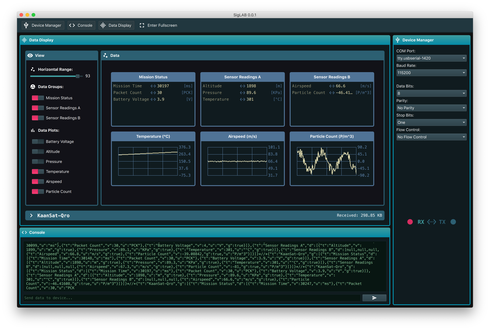

#  Serial Studio

[](https://github.com/Serial-Studio/Serial-Studio/releases/)
[](https://deepwiki.com/Serial-Studio/Serial-Studio)
[](https://instagram.com/serialstudio.app)
[](https://www.paypal.com/donate?hosted_button_id=XN68J47QJKYDE)
[](https://store.serial-studio.com/buy/ba46c099-0d51-4d98-9154-6be5c35bc1ec)
[](https://app.codacy.com/gh/Serial-Studio/Serial-Studio/dashboard?utm_source=gh&utm_medium=referral&utm_content=&utm_campaign=Badge_grade)

**Serial Studio** is an open source dashboard tool for embedded developers. You describe your data format once in a **project file**, and it builds a live dashboard around it so you can stop squinting at scrolling terminals.

It works with Arduino, ESP32, STM32, Raspberry Pi, Teensy, and anything that talks over UART, Bluetooth LE, TCP/UDP, or CAN Bus. Modbus TCP/RTU covers industrial and PLC setups, and the built-in register map importer turns CSV/XML/JSON maps into a ready project. The Audio driver lets you analyze analog signals, and MQTT works as either publisher or subscriber for IoT setups where data has to travel beyond the local network. Raw USB gives bulk and isochronous access to USB devices via libusb. HID devices (gamepads, custom USB HIDs, sensors) connect through hidapi. Process I/O pipes any program's stdout into the dashboard. Multi-device projects let you connect several devices at once, each with its own protocol, and watch them on a single dashboard.

You can parse frames in JavaScript or Lua 5.4, and apply per-dataset value transforms (EMA filters, scaling, calibration, unit conversion) without re-flashing firmware. File transfers run over XMODEM, YMODEM, or ZMODEM, and you can write output-widget scripts that emit GCode, SCPI, Modbus, NMEA, CAN, and other device commands.

Once data is coming in, Serial Studio draws it with plots, gauges, 3D views, tables, and more. You can send commands back using output widgets (buttons, toggles, sliders, knobs, text fields, and freeform panels). Data Tables act as a central bus where transforms share state, derive virtual datasets, and read from constants libraries. Workspaces split a large project into focused dashboard tabs, with a taskbar search for big setups. Data can be exported to CSV or MDF4, or recorded frame-by-frame into a SQLite session database that you can replay later in the Database Explorer. Actions let you define buttons that send commands back to the device, with optional timers for polling or periodic control.

Serial Studio runs on Windows, macOS, and Linux, including ARM64 for Raspberry Pi.

New here? Have a look at the [help center](https://serial-studio.com/help) for FAQs, use cases, and comparisons with similar tools.



## Download

Serial Studio is available as source code and as official precompiled binaries for Windows, macOS, and Linux.

- [Latest stable release](https://github.com/Serial-Studio/Serial-Studio/releases/latest)
- [Pre-release builds](https://github.com/Serial-Studio/Serial-Studio/releases/continuous)

### Windows

Requires the [Microsoft Visual C++ Redistributable (x64)](https://learn.microsoft.com/en-us/cpp/windows/latest-supported-vc-redist?view=msvc-170#latest-microsoft-visual-c-redistributable-version). On first launch Windows may warn about an unknown developer. Click _"More Info → Run Anyway"_ to continue.

### macOS

Distributed as a universal DMG. Open the DMG and drag **Serial Studio** into **Applications**. You can also install it via Homebrew:

```bash
brew install --cask serial-studio
```

The Homebrew cask is community-maintained. It's available, but not officially tested by me.

### Linux

The recommended way to install on Linux is via the official [AppImage](https://appimage.org/). Make it executable and run it:

```bash
chmod +x SerialStudio-Pro-3.2.7-Linux-x64.AppImage
./SerialStudio-Pro-3.2.7-Linux-x64.AppImage
```

If the AppImage fails to launch, your system is probably missing `libfuse2`:

```bash
sudo apt install libfuse2
```

For better desktop integration (menu entries, icons, updates), use [AppImageLauncher](https://github.com/TheAssassin/AppImageLauncher).

#### Flatpak (Flathub)

Serial Studio is on [Flathub](https://flathub.org/apps/com.serial_studio.Serial-Studio). That version gets regular updates and tends to work better on ARM64. On some desktop environments, mostly Wayland, you may see small visual glitches like missing window shadows.

#### Raspberry Pi / ARM64

An ARM64 AppImage is available for Raspberry Pi and similar boards. Performance depends on your GPU drivers since the UI is GPU-accelerated. Requirements:

- A 64-bit Linux distro equivalent to or newer than Ubuntu 24.04 (needs `glibc 2.38`)
- `libfuse2` installed

## Features

### How it works

- **Project file mode (recommended):** Build dashboards in the Project Editor with drag-and-drop widgets. No code required.
- **Quick plot mode:** Drop in comma-separated values from Arduino and get an instant plot.
- **Device-defined mode:** Let the device ship its own dashboard layout as JSON.

### What it can do

- **No coding needed.** Build dashboards with a visual editor.
- **10+ protocols.** Serial/UART, Bluetooth LE, MQTT, Modbus TCP/RTU, CAN Bus, TCP/UDP, Audio, raw USB, HID, and Process I/O.
- **15+ visualization widgets.** Line plots, gauges, bar charts, GPS maps, FFT spectrum, accelerometers, gyroscopes, compass, data grids, 3D views, and live camera feed (Pro).
- **Output widgets.** Send commands back to your device via buttons, toggles, sliders, knobs, text fields, and freeform output panels, powered by JS templates for GCode, SCPI, Modbus, NMEA, CAN, and more (Pro).
- **CSV export.** Saves every frame for later analysis in Excel, Python, MATLAB, or R.
- **MDF4 playback and export.** Read and write MDF4/MF4 files for CAN Bus, LIN, FlexRay, and analog channels (Pro).
- **Session database.** Record every frame plus raw bytes into a SQLite session, then browse, tag, export, and replay it in the Database Explorer (Pro).
- **Data Tables.** Central bus shared across transforms: system datasets, user-defined constant and computed registers, and virtual datasets derived entirely from transforms.
- **Workspaces.** Break a large project into focused dashboard tabs with a taskbar search.
- **File transmission.** Send files over the wire with XMODEM, YMODEM, or ZMODEM, including CRC and crash recovery (Pro).
- **Cross-platform.** Windows 10/11, macOS 11+ (Intel and Apple Silicon), Linux x64, Raspberry Pi ARM64.
- **Works with Arduino/ESP32.** Compatible with any device that talks over serial, BLE, or the network.
- **Fast updates.** 60 FPS dashboard with latency under 50 ms.
- **Custom parsing.** Frame parsers in JavaScript or Lua 5.4, with 20+ ready-made templates (MAVLink, NMEA 0183/2000, UBX, SiRF, RTCM, MessagePack, TLV, COBS, SLIP, JSON, XML, YAML, INI, Modbus, and others).
- **Per-dataset transforms.** Filter, scale, calibrate, or derive datasets with short JS or Lua snippets that run every frame.
- **Modbus TCP/RTU.** Talk to industrial PLCs and equipment. A register-map importer reads CSV, XML, and JSON (Pro).
- **CAN Bus.** Import DBC files for automotive and industrial work (Pro).
- **MQTT for IoT.** Connect to brokers for distributed sensor networks (Pro).
- **Image view.** Display live JPEG or PNG camera streams alongside telemetry on the same connection (Pro).
- **Multi-device support.** Connect multiple devices at once in a single project, each with its own protocol and frame settings (Pro).
- **API server on TCP port 7777.** Control Serial Studio programmatically with 290+ commands (see the [API client example](./examples/API%20Test)).
- **AI integration via MCP.** Connect models like Claude through the Model Context Protocol for automated analysis and control (see [MCP Client](./examples/MCP%20Client)).
- **Dual licensing.** Open source GPL-3.0 core with proprietary Pro features (see [LICENSE.md](LICENSE.md)).

## Quick start

You can be up and running in about five minutes.

### 1. Download and install

- Grab the latest release for your platform (see [Download](#download)).
- **Windows:** run the installer. Allow "Unknown developer" if prompted.
- **macOS:** drag to Applications, then right-click and choose Open the first time.
- **Linux:** `chmod +x` the AppImage and run it. You may need `sudo apt install libfuse2`.

### 2. Connect your device

- Launch Serial Studio.
- Pick your serial port and baud rate (9600 and 115200 are common).
- Click **Connect**.

### 3. Visualize

- **Quick plot mode:** send comma-separated values and watch them plot live.
- **Project mode:** build a custom dashboard in the Project Editor, complete with gauges, maps, and more.
- **Examples:** browse [`/examples`](./examples) for Arduino sketches, ESP32 code, and Python scripts.

### Arduino example

```cpp
void setup() {
  Serial.begin(9600);
}

void loop() {
  int temperature = analogRead(A0);
  int humidity = analogRead(A1);
  Serial.print(temperature);
  Serial.print(",");
  Serial.println(humidity);
  delay(100);
}
```

Upload, connect Serial Studio, enable Quick Plot, and you're done.

First time using it? The [help center](https://serial-studio.com/help) covers troubleshooting and common questions.

## Documentation

### Official docs

- [Wiki](https://github.com/Serial-Studio/Serial-Studio/wiki): full guides and tutorials.
- [Help center](https://serial-studio.com/help): FAQs, use cases, comparisons, troubleshooting.
- [AI agent guide](AGENTS.md): for ChatGPT, Claude, and other assistants.
- [API reference](https://github.com/Serial-Studio/Serial-Studio/wiki/API-Reference): full TCP API and automation docs.
- [Examples](./examples): Arduino, ESP32, Python code with sample projects.

### Key topics

- **Installation** for Windows, macOS, Linux, and Raspberry Pi.
- **Quick start:** connect an Arduino or ESP32 and visualize data in five minutes.
- **Dashboard creation:** build layouts in the Project Editor and split them into workspaces.
- **Protocol support:** Serial/UART, Bluetooth LE, MQTT, Modbus TCP/RTU, CAN Bus, TCP/UDP, Audio, raw USB, HID, Process I/O.
- **Frame parsing:** handle binary protocols, checksums, and custom formats in JavaScript or Lua 5.4.
- **Per-dataset transforms:** EMA filters, scaling, calibration, and virtual datasets via Data Tables.
- **Output widgets:** send commands back with buttons, sliders, knobs, toggles, and output panels (Pro).
- **File transfer:** XMODEM, YMODEM, and ZMODEM over the active connection (Pro).
- **CSV export and playback:** log sensor data and replay it.
- **MDF4 playback and export:** CAN Bus, LIN, FlexRay, and analog (Pro).
- **Session database and Explorer:** record, tag, export, and replay full sessions from SQLite (Pro).
- **TCP API:** 290+ commands for programmatic control (see [API Client](./examples/API%20Test)).

## Building Serial Studio

### Requirements

Minimum:

- **Qt 6.7 or later** (6.9.2 recommended). Required modules: QtCore, QtGui, QtWidgets, QtSerialPort, QtNetwork, QtCharts, QtSvg, QtBluetooth, QtQuick.
- **C++20 compiler:** GCC 10+ (Linux), Clang 12+ (macOS), or MSVC 2019+ (Windows).
- **CMake 3.16 or later.**
- Platform toolchain (see below).

Platform specifics:

#### Linux

```bash
sudo apt install libgl1-mesa-dev build-essential
```

#### macOS

```bash
xcode-select --install
brew install qt@6
```

#### Windows

Visual Studio 2019 or later with the C++ workload, and Qt from the official installer.

### Build instructions

All C/C++ dependencies (zlib, expat, OpenSSL, KissFFT, and so on) are vendored in `lib/` or fetched automatically via CMake's FetchContent. No package manager is needed.

```bash
cmake -B build -DPRODUCTION_OPTIMIZATION=ON -DCMAKE_BUILD_TYPE=Release
cmake --build build -j$(nproc)
```

You can also open `CMakeLists.txt` in Qt Creator or any CMake-aware IDE without extra setup.

By default the build produces a fully GPLv3-compliant version. It includes most core features but leaves out commercial modules like MQTT, 3D visualization, XY plotting, and other advanced tools that depend on proprietary Qt components.

If you are a Pro user or have a commercial license, [contact the maintainer](mailto:alex@serial-studio.com) for build instructions and activation details.

## Support the project

Serial Studio is developed and maintained by [Alex Spataru](https://github.com/alex-spataru). It is open source and community-driven, with commercial options for users who need advanced features or a business-friendly license.

If Serial Studio is useful to you, here are a few ways to support it:

- [Donate via PayPal](https://www.paypal.com/donate?hosted_button_id=XN68J47QJKYDE): keeps the project active.
- [Buy a commercial license](https://serial-studio.com): required for commercial use of the official binary. Includes Pro features and priority support.
- [Become an affiliate](https://store.serial-studio.com/affiliates): a good fit for content creators who want to earn a commission by referring new customers.

Commercial licenses directly fund development, bug fixes, and new features.

## Licensing

Serial Studio uses a dual-license model that separates open source usage from commercial distribution:

- [LICENSE.md](LICENSE.md): summary of the dual-license structure and usage terms.
- [LICENSES/GPL-3.0-only.txt](LICENSES/GPL-3.0-only.txt): full GNU GPLv3 text for open source source code.
- [LICENSES/LicenseRef-SerialStudio-Commercial.txt](LICENSES/LicenseRef-SerialStudio-Commercial.txt): full terms for proprietary features and official binaries.

Source files are individually marked with SPDX headers, either `GPL-3.0-only`, `LicenseRef-SerialStudio-Commercial`, or both. This lets developers build and distribute GPL-compliant versions while keeping commercial features protected.

## Picking the right version

The table below shows licensing, feature access, and obligations for each edition.

| Feature / use case     | GPL version *(build it yourself)*    | Trial version *(official binary)*    | Pro version *(activated official binary)*   |
|------------------------|--------------------------------------|--------------------------------------|---------------------------------------------|
| **Commercial use**     | ✅ If fully GPL compliant            | ❌ Evaluation only                   | ✅ Fully licensed                            |
| **Official support**   | ❌ Community only                    | ❌ None                              | ✅ Priority support                          |
| **Pro features**       | ❌ Not included                      | ✅ Included                          | ✅ Included                                  |
| **Usage restrictions** | Must comply with GPL and Qt terms    | 14-day trial, no redistribution      | Bound by commercial license terms           |
| **Precompiled binary** | ❌ Must build from source            | ✅ Provided for trial only           | ✅ Provided                                  |
| **Qt licensing**       | Requires GPL-compatible Qt           | Qt licensing covered by vendor       | Qt licensing covered by vendor              |
| **Activation system**  | ❌ Not applicable                    | ✅ Trial disables after 14 days      | ✅ Requires a valid license key              |
| **Business use**       | ✅ If strictly GPL compliant         | ❌ Prohibited                        | ✅ Fully allowed                             |
| **Best for**           | OSS devs, students, contributors     | Hobbyists, personal evaluation       | Businesses, teams, commercial products      |

Pro features and official binaries are proprietary and need a commercial license for anything beyond personal evaluation. Seeing the source code does not grant GPL rights unless a file is explicitly licensed that way.

## Contributing

Contributions are welcome: bug fixes, new features, or doc improvements.

Before contributing:

- Check existing [issues](https://github.com/Serial-Studio/Serial-Studio/issues) and [pull requests](https://github.com/Serial-Studio/Serial-Studio/pulls).
- Review [CLAUDE.md](CLAUDE.md) for code style.
- Focus on GPL-licensed code, and leave the commercial modules alone.

Code style:

- Follow the project's clang-format config (LLVM base style).
- Use meaningful names.
- Avoid inline end-of-line comments (see [CLAUDE.md](CLAUDE.md#comments-policy)).
- Add Doxygen comments for new public APIs.

Submitting changes:

1. Fork the repository.
2. Create a feature branch (`git checkout -b feature/amazing-feature`).
3. Commit with descriptive messages.
4. Push to your fork and open a pull request.
5. Make sure CI passes.

For larger changes, open an issue first so we can talk about the approach.
