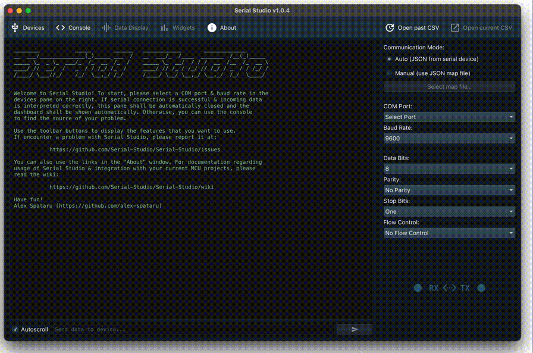

# Serial Studio

Serial Studio es un programa de visualización de datos de puertos serial multiplataforma y multipropósito. El objetivo de este proyecto es permitir a los desarrolladores y creadores de sistemas embebidos visualizar, presentar y analizar fácilmente los datos generados por sus proyectos y dispositivos, sin la necesidad de escribir software especializado para cada proyecto.

La necesidad de este proyecto surgió durante el desarrollo del software de estación terrestre para varios concursos de CanSat. Simplemente no es sostenible desarrollar y mantener diferentes programas para cada competencia. La solución inteligente es tener un software de estación terrestre común y permitir que cada CanSat defina cómo se presentan los datos al usuario final mediante un protocolo de comunicación extensible.

Además, este enfoque se puede extender a casi cualquier tipo de proyecto que implique algún tipo de adquisición y medición de datos.

**NOTA:** en el [wiki](https://github.com/Serial-Studio/Serial-Studio/wiki/Protocolo-de-Comunicación) se muestra más información acerca del protocolo de comunicación utilizado por Serial Studio.

*Lea esto en otros idiomas:* [English](README.md)

## Instrucciones de complicación

##### Requisitos

El único requisito para compilar la aplicación es tener [Qt](http://www.qt.io/download-open-source/) instalado en su sistema. La aplicación se compilará con Qt 5.15 o superior.

### Clonado de este repositorio

Este repositorio hace uso de [`git submodule`](https://git-scm.com/docs/git-submodule). Para clonarlo, tiene dos opciones:

Comando breve:

    git clone --recursive https://github.com/Serial-Studio/Serial-Studio

Procedimiento normal:

    git clone https://github.com/Serial-Studio/Serial-Studio
    cd Serial-Studio
    git submodule init
    git submodule update
    
###### Compilación

Una vez que haya instalado Qt, abra *Serial-Studio.pro* en Qt Creator y haga clic en el botón de "Ejecutar".

Alternativamente, también puede utilizar los siguientes comandos:

	qmake
	make -j4

## Licencia

Este proyecto se publica bajo la licencia MIT, para obtener más información, consulte el archivo [LICENSE](LICENSE.md).

