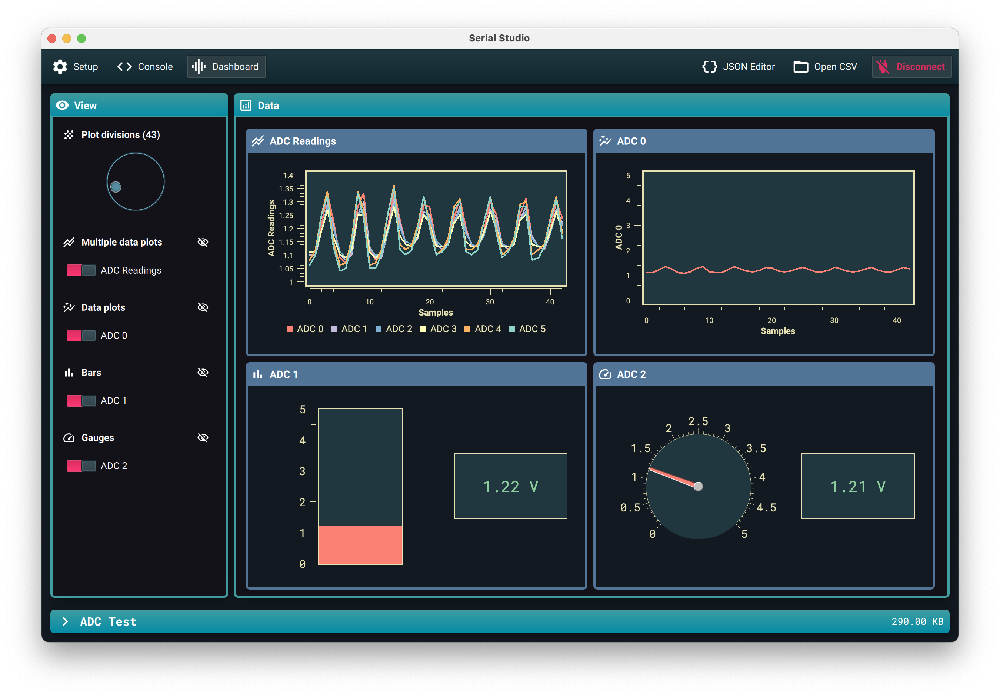

# Serial Studio

Serial Studio ist ein plattformübergreifendes Programm zur Visualisierung serieller Daten. Ziel dieses Projekts ist es, eingebetteten Entwicklern und Machern die einfache Visualisierung, Präsentation und Analyse der von ihren Projekten und Geräten generierten Daten zu ermöglichen, ohne dass für jedes Projekt eine spezielle Computersoftware geschrieben werden muss.

Die Notwendigkeit für dieses Projekt entstand während der Entwicklung der Bodenstationssoftware für mehrere CanSat-basierte Wettbewerbe, an denen ich teilnehme. Es ist einfach nicht nachhaltig, für jeden Wettbewerb und jedes Projekt unterschiedliche GSS-Programme zu entwickeln und zu pflegen. Die intelligente Lösung besteht darin, eine gemeinsame Ground Station-Software zu haben und jedem CanSat zu ermöglichen, zu definieren, wie die Daten dem Endbenutzer mithilfe eines erweiterbaren Kommunikationsprotokolls präsentiert werden.

Darüber hinaus kann dieser Ansatz auf nahezu jede Art von Projekt ausgedehnt werden, bei dem Daten erfasst und gemessen werden. Wenn Sie ausführlicher erklären möchten, warum dieses Projekt existiert und worum es geht, lesen Sie [diesen Blog-Beitrag](https://www.alex-spataru.com/blog/introducing-serial-studio).

**HINWEIS:** Informationen zum Kommunikationsprotokoll finden Sie im [Wiki](https://github.com/Serial-Studio/Serial-Studio/wiki/Communication-Protocol).

*Lesen Sie dies in anderen Sprachen:* [English](../README.md) [简体中文](README_ZH.md) [Español](README_ES.md)

## Bauanweisungen

#### Bedarf

Die einzige Voraussetzung zum Kompilieren der Anwendung ist, dass [Qt](http://www.qt.io/download-open-source/) auf Ihrem System installiert ist. Die Desktop-Anwendung wird mit **Qt 5.15** kompiliert.

Auf GNU / Linux-Systemen müssen Sie außerdem `libgl1-mesa-dev` installieren, um die Anwendung zu kompilieren.

Vollständige Liste der verwendeten Qt-Module:

- Qt SVG
- Qt Quick
- Qt Widgets
- Qt Networking
- Qt Serial Port
- Qt Print Support
- Qt Quick Widgets
- Qt Quick Controls 2

#### Klonen

Dieses Repository verwendet [`git submodule`](https://git-scm.com/book/en/v2/Git-Tools-Submodules). Führen Sie die folgenden Befehle auf Ihrem Terminal aus, um sie zu klonen:

	git clone https://github.com/Serial-Studio/Serial-Studio
	cd Serial-Studio
	git submodule init
	git submodule update
	
Alternativ können Sie auch Folgendes ausführen:

	git clone --recursive https://github.com/Serial-Studio/Serial-Studio
    
#### Kompilieren

Sobald Sie Qt installiert haben, öffnen Sie *Serial-Studio.pro* in Qt Creator und klicken Sie auf die Schaltfläche "Ausführen".

Alternativ können Sie auch die folgenden Befehle verwenden:

	qmake
	make -j4

## Lizenz

Dieses Projekt wird unter der MIT-Lizenz veröffentlicht. Weitere Informationen finden Sie in der Datei [LICENSE](LICENSE.md)

