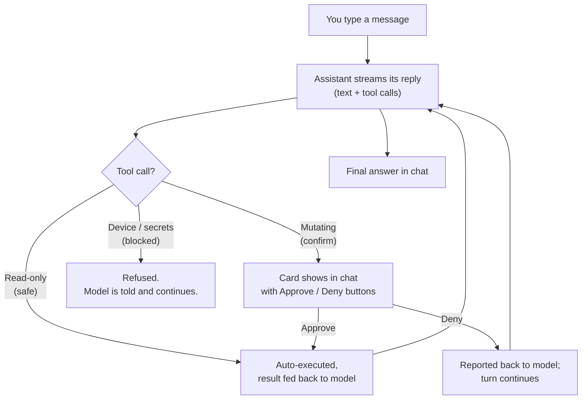

# AI Assistant

A chat-based assistant that lives inside Serial Studio and edits the project for you. Open it from the main toolbar (the **Assistant** button next to *Extensions*) or from the **Project Editor** toolbar, describe what you want to build, and the assistant configures sources, groups, datasets, frame parsers, transforms, output widgets, painters, and workspaces by calling the same in-process API your scripts and the MCP server already use.

It is **bring-your-own-key**. You pick a provider (Anthropic, OpenAI, Google Gemini, DeepSeek, Groq, Mistral, OpenRouter, or a local model server) and paste an API key once. The key is encrypted on this machine and never leaves your computer except to talk to the provider you selected. The local-server option lets you run everything offline against Ollama, llama.cpp, LM Studio, or vLLM.

> **Pro feature.** The Assistant button is only present in Pro builds; GPL builds hide it entirely. Operator deployments (`--runtime`) also hide it. The Assistant is a build-time author tool, not something you ship to operators.

## What it can do

The assistant talks to Serial Studio through the same command surface as the MCP/JSON-RPC API (see the [API Reference](API-Reference.md) for the full list). The short version: anything you can do in the Project Editor, the assistant can do for you, with two important caveats:

- **It does not connect, disconnect, or change driver settings by default.** Anything that pokes the running connection (open/close port, change baud rate, change Modbus slave, write bytes to the device) is blocked from the AI surface unless you opt in by ticking **Allow device control** in the panel footer. With that toggle on, those commands become Always-confirm (you approve each call, even when Auto-approve edits is on); with it off they are refused outright so a wrong answer cannot knock you offline.
- **It can read documentation.** When you ask about a feature it doesn't already know, it pulls the relevant page from `doc/help/` directly off the Serial Studio repo so its answer matches the version you are running.

Typical things people ask it to do:

- "List the sources in this project."
- "Add a UART source for an Arduino at 115 200 baud, frame end on `\n`."
- "Write a CSV frame parser for me with three floats and a status byte."
- "Suggest dashboard widgets for this data."
- "Build me a workspace called *Engine* with the RPM gauge, oil-pressure plot, and the alarm panel."
- "Add a moving-average transform to dataset *Speed*."
- "Open the painter widget docs and walk me through writing one for a compass."

The four chips on the empty-conversation card are starter prompts (one per category, reshuffled each time the card appears). Click one to send it straight to the assistant.

## Picking a provider

Eight providers are wired in. They all do roughly the same job; the trade-offs are price, speed, how generous the free tier is, and whether the data ever leaves your machine.

| Provider | Default model | What it costs | What it does well |
|---|---|---|---|
| **Anthropic** (Claude) | Haiku 4.5 | ~$1 / $5 per million tokens (in/out) | Default. Streaming, tool use, prompt caching, extended thinking on Sonnet/Opus. Sonnet 4.6, Opus 4.7, and Opus 4.8 are also selectable for harder tasks. |
| **OpenAI** | GPT-5 mini | Pay-per-token; mini tier is cheap | Default. Streaming, parallel tool calls, native function-calling. GPT-5.2 and GPT-5.2 Chat are the strongest options for hard tasks. GPT-4.1, GPT-4.1 mini, GPT-4o, and GPT-4o mini remain available. Reasoning-capable models run at `reasoning_effort: none` -- right for fast, interactive tool-calling. |
| **Google Gemini** | 2.5 Flash | Generous free tier (rate-limited via AI Studio) | 2.5 Flash and 2.0 Flash run on the free tier. 2.5 Pro is paid. |
| **DeepSeek** | deepseek-chat (V3) | Often the cheapest cloud option for tool use | OpenAI-compatible API. `deepseek-reasoner` (R1) is also selectable. |
| **Groq** | llama-3.3-70b-versatile | Free tier with daily limits; very low paid pricing | OpenAI-compatible API on Groq's LPU hardware (extremely fast token output). `llama-3.1-8b-instant` for cheapest/fastest, plus the OpenAI gpt-oss-120b / 20b open-weights builds. |
| **Mistral** | mistral-large-latest | Pay-per-token; small / Ministral / Nemo tiers are cheap | OpenAI-compatible API. Selectable: `mistral-medium-latest`, `mistral-small-latest`, `ministral-8b-latest`, `ministral-3b-latest`, `codestral-latest` (code-tuned), `pixtral-large-latest` (vision), `open-mistral-nemo`. |
| **OpenRouter** | anthropic/claude-haiku-4.5 | Aggregator pricing per upstream model; some `:free` routes | OpenAI-compatible aggregator. Single key fans out to Anthropic, OpenAI, Google, Meta Llama, DeepSeek, Mistral, Qwen routes. Useful when you want to try several backends without juggling keys. |
| **Local model** | (whatever your server has loaded) | Free | OpenAI-compatible local endpoint. Works with Ollama (default `http://localhost:11434/v1`), llama.cpp's `llama-server`, LM Studio, or vLLM. The model list is queried live from `/v1/models`. Nothing leaves your machine. |

You switch providers from the footer combo box. Each provider keeps its own model selection. Serial Studio remembers which model you picked per provider, so flipping back and forth doesn't reset anything.

> **Anthropic and OpenAI have the most complete integrations today.** Anthropic surfaces cache read/write counts and adaptive extended thinking back to the UI; the OpenAI path uses server-side prompt caching (silent), parallel tool calls, and the GPT-5 / o-series developer-role conventions, with `reasoning_effort: none` so tool-calling stays responsive. Gemini, DeepSeek, Groq, Mistral, OpenRouter, and Local all work for streaming chat and tool calls (Groq, Mistral, OpenRouter and DeepSeek run on the same OpenAI-compatible code path) but don't have cache reporting or thinking integration.

### Local models

The Local provider doesn't take an API key; it takes a base URL. Default is Ollama on `http://localhost:11434/v1`. To point at a different server, open **Manage Keys**, edit the URL field on the Local card, and click **Apply**. Common alternatives:

- LM Studio: `http://localhost:1234/v1`
- llama.cpp `llama-server`: `http://localhost:8080/v1`
- vLLM: `http://localhost:8000/v1`

Whatever models are installed on the server show up in the model picker. Click the refresh icon next to the URL field to re-query the list after pulling a new model. Tool use works on any model that supports the OpenAI function-calling shape (most modern Llama, Qwen, DeepSeek, and Mistral fine-tunes do), but small models will struggle with multi-step tool chains.

### Getting a key

The empty-conversation card has a **Get a key from <provider>** link that opens the right signup page. Once you have the key, click **Open API Key Setup** (or the wrench icon in the footer), paste the key, and save. The key is checked, redacted in the UI (you only ever see the last few characters), and persisted under your local app settings encrypted with a per-machine key.

You can change provider, change model, or revoke a key at any time from the same dialog. Revoking a key clears it from disk; revoking the active provider's key drops you back to the welcome screen until you paste a new one.

## How a turn works

Each tool call shows up in the chat as a small expandable card with the command name, the arguments, and (after it runs) the result. You can click the card to inspect what was sent and what came back. This is useful when you want to learn the underlying API, or when something goes sideways.

### The safety tiers

Every command is tagged at startup. There are five tiers:

| Tier | Behavior | Examples |
|---|---|---|
| **Safe** | Auto-runs. No prompt. Read-only inspection. | `project.group.list`, `dashboard.getStatus`, `io.uart.listPorts`, every `get*` and `*.list` |
| **Confirm** | Card with **Approve** / **Deny** buttons. Anything that mutates the project counts. | `project.group.add`, `project.dataset.update`, `project.workspace.add`, `project.template.apply` |
| **Always confirm** | Like Confirm, but still asks **even when Auto-approve edits is on**. Destructive or sensitive families: delete / clear / new / open-replace / install / uninstall, plus MQTT credential + TLS config and control-script installs. | `project.new`, `project.group.delete`, `project.workspace.clearAll`, `fs.delete`, `sessions.delete`, `controlscript.setCode`, `project.mqtt.publisher.setConfig` |
| **Device-gated** | Blocked by default; becomes **Always confirm** only when **Allow device control** is ticked. Driver settings, connection state, and anything that writes bytes to the device. | `io.connect`, `io.disconnect`, `io.setPaused`, `io.writeData`, `console.send`, every driver `set*` |
| **Blocked** | Refused outright; never unblockable from the UI. The model is told it isn't available. | `licensing.activate`, `licensing.deactivate`, `licensing.setLicense`, and the other `licensing.*` mutations |

You can approve a single call (**Approve**) or, when the assistant queues several mutations in a row, approve the whole batch at once (**Approve all**). Denial is logged and the assistant is told. It will usually offer an alternative or back off, not retry blindly.

The full safety map ships in `app/rcc/ai/command_safety.json`. New commands default to **Confirm** until they're explicitly tagged, so adding an API method doesn't quietly grant the AI new powers. Two footer toggles tune this: **Auto-approve edits** runs **Confirm**-tier project edits without asking (Always-confirm, device-gated, and Blocked are unaffected), and **Allow device control** unblocks the device-gated commands above behind a one-time warning (each call still asks for approval).

## The composer

The bar at the bottom is the input. It has three controls:

- **Text field**. Type your prompt, press **Enter** to send.
- **Trash icon**. Wipes the conversation. Cached prompt context is kept on the provider side (cheaper for follow-ups), but the history shown in the panel is cleared.
- **Send / Cancel**. Round button on the far right. While the model is generating, the icon flips to **Cancel** and clicking it stops the stream. Anything already produced stays in the chat.

While the assistant is working you'll see a thin animated stripe under the message list. The footer **Status** pill shows *Working* or *Ready* and, when prompt caching is in use, how many cached tokens the current turn read from or wrote to the cache.

## Privacy and what gets sent

Read this before pasting anything sensitive. Every message you send goes to the provider you chose. Specifically:

- **Sent on every turn**: your message, the conversation history so far, the tool catalog, and a snapshot of the live project state (sources, groups, datasets, frame parser code, transforms, and so on; the same JSON your `.ssproj` would contain). Frame parser scripts and transform scripts are part of that snapshot.
- **Not sent**: live telemetry data, your raw serial bytes, your dashboard frames, your CSV/MDF4 logs, your session database, the API key for any *other* provider.
- **Stored where**: the API key is encrypted on this machine via Serial Studio's per-machine key derivation. The conversation history lives only in memory for the current panel session. Closing the dialog (or clicking the trash) clears it.

If your project file contains commercial firmware code or proprietary protocol notes inside frame parsers or transforms, that text will travel to the provider with each turn. Treat the provider's data-handling policy as the relevant constraint, not Serial Studio's.

## Documentation lookup

The assistant can pull `doc/help/*.md` pages directly off the Serial Studio GitHub repo when it needs them. You'll see this as a tool call named `meta.fetchHelp` with a path like `Painter-Widget` or `JavaScript-API`. It is read-only and Safe. The first call usually grabs `help.json` (the page index), the second pulls the relevant page.

For scripting, there's a parallel surface called `meta.fetchScriptingDocs` that returns the API reference for one of nine kinds: `frame_parser_js`, `frame_parser_lua`, `transform_js`, `transform_lua`, `output_widget_js`, `painter_js`, `control_script_js`, plus `sdk_js` and `sdk_lua`, which return the generated SerialStudio SDK source itself. The assistant is wired to call this **before** writing or modifying any script. That's why frame parsers it generates use real APIs and not made-up function names.

There's also `meta.searchDocs` (a small built-in BM25 index over the bundled help and scripting docs, used to find the right page when a path isn't obvious) and `meta.loadSkill` (loads one of a handful of focused skill briefs: `painter`, `frame_parsers`, `transforms`, `output_widgets`, `workspace_design`, `dashboard_layout`, `mqtt`, `can_modbus`, `filesystem`, `debugging`, `project_basics`, `tool_discovery`, `api_semantics`, `behavioral`, `control_script`) when the assistant needs deeper guidance for a specific task.

## Project templates

When you're starting from a blank project, you can ask the assistant to "use a template" and it will call `project.template.list` (Safe) followed by `project.template.apply` (Confirm) with one of the bundled starters: blank, IMU over UART, GPS over UART (NMEA), multi-channel UART scope, MQTT subscriber, or telemetry over UDP. Templates load instantly into an empty project and give you a working scaffold to edit from.

## Frequently asked

**Does the assistant work offline?**
Yes, with the **Local model** provider. Point it at Ollama, llama.cpp, LM Studio, or vLLM running on your machine and the Assistant works fully offline. The cloud providers (Anthropic, OpenAI, Gemini, DeepSeek, Groq, Mistral, OpenRouter) need a network connection. The rest of Serial Studio works offline regardless.

**Can I use a self-hosted model (Ollama, LM Studio, llama.cpp, vLLM)?**
Eight providers are wired in: Anthropic, OpenAI, Google Gemini, DeepSeek, Groq, Mistral, OpenRouter, and a Local provider that talks to any OpenAI-compatible server (Ollama, llama.cpp, LM Studio, vLLM). The Local provider's base URL is user-configurable, so any other compatible endpoint works without a code change.

**Can I see what the assistant is about to do before it does it?**
Yes. That's exactly what the **Confirm** tier is for. The card shows the command name and the full arguments object before you approve.

**Can the assistant connect or disconnect my device?**
Not unless you let it. Connection-state changes (`io.connect`, `io.disconnect`, `io.setPaused`) and every `set*` on every driver are device-gated: blocked by default, and the assistant can only read your device list and current configuration. Tick **Allow device control** in the footer and those commands become available as Always-confirm actions (you approve each call, even when Auto-approve edits is on).

**Can it write data to my device?**
Direct MCP write commands are device-gated: `console.send` (text/serial writes) and `io.writeData` (raw binary writes), alongside every driver `set*` and every connection-state command, are blocked until you tick **Allow device control** (then they ask for approval per call). A second group is blocked outright with no UI override: `licensing.*` mutations. MQTT broker credentials get a different guard: `project.mqtt.publisher.setConfig` and `project.mqtt.subscriber.setConfig` are Always-confirm, and the matching `getConfig` commands never return the stored password. The assistant can, however, propose **frame parser / transform / painter code that calls `deviceWrite()` or `actionFire()`** (scripting APIs that push bytes back to the device or trigger an existing project Action whenever the script decides to). Pushing the script is a **Confirm** tier action, so you see the exact code before it lands. Once approved and connected, the script will fire on incoming frames — review the logic carefully before approving anything that writes on every frame. For one-shot user-triggered commands, prefer an [Output Control](Output-Controls.md).

**Why does my project state show up in the prompt?**
So the assistant can answer "what sources are configured?", "which datasets feed this group?", or "is the frame parser doing what I think it is?" without first running ten read-only tool calls. The state snapshot lives outside the cached prefix so it can change between turns without invalidating the cache.

**The assistant suggested an API call that doesn't exist.**
Tell it; it will usually call `meta.listCommands` or `meta.describeCommand` to recover. If you keep hitting hallucinated commands on a given provider, switch to a stronger model (Sonnet 4.6, Opus 4.7, or Opus 4.8 on Anthropic, GPT-5.2 on OpenAI, 2.5 Pro on Gemini).

**Where do I report a bug or a wrong answer?**
File an issue on the Serial Studio GitHub repo. Include the prompt, the reply, and ideally the project file (or a stripped-down repro). Provider name and model help too.

## See also

- [API Reference](API-Reference.md): the command surface the assistant calls into.
- [Project Editor](Project-Editor.md): the editor the assistant edits on your behalf.
- [Frame Parser Scripting](JavaScript-API.md): JavaScript and Lua frame parser API.
- [Dataset Value Transforms](Dataset-Transforms.md): per-dataset transform scripts.
- [Painter Widget](Painter-Widget.md): the painter API the assistant references when asked to write one.
- [Output Controls](Output-Controls.md): output widget framework, including transmit-function generation.
- [Pro vs Free Features](Pro-vs-Free.md): what's included with a Pro license.
