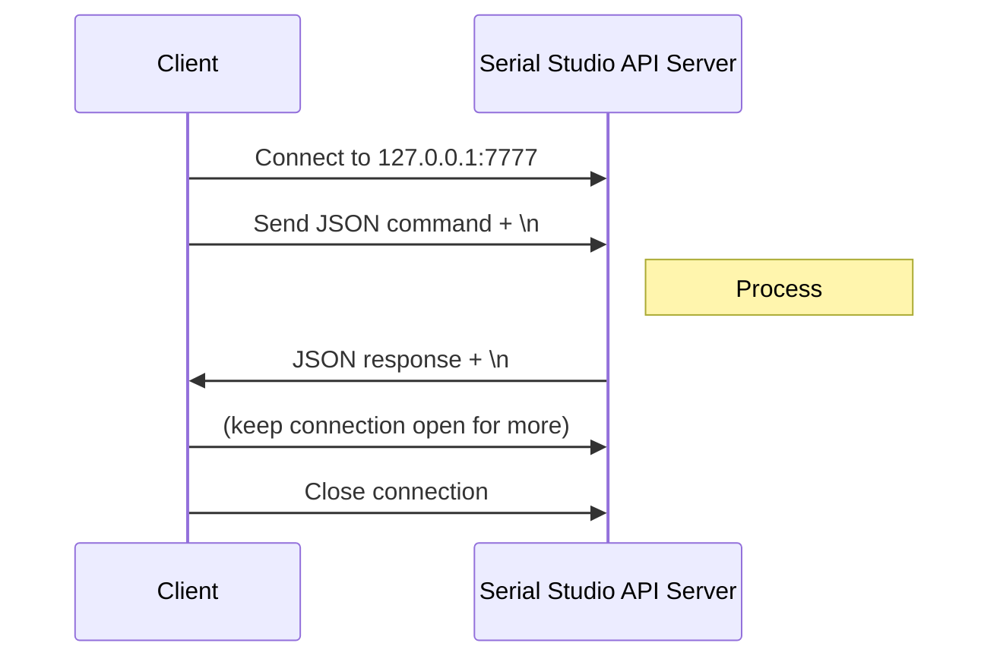

> **The command-by-command reference below is regenerated by hand and
> drifts behind the C++ registry over time.** The protocol shape, the
> connection details, and the prose sections (overview, security,
> usage, recommended patterns, troubleshooting) are kept current. The
> per-command sections under *Complete Command Reference* are best read
> as a structured tour, not a contract.
>
> The authoritative live surface is whatever the running server
> registers at startup (`app/src/API/Handlers/*.cpp`). To enumerate it:
>
> - **Legacy JSON**: send `api.getCommands` (no params). It returns
>   `{name, description}` for every registered command.
> - **MCP**: send `tools/list` over JSON-RPC 2.0 (see [MCP
>   Client](../../examples/MCP%20Client/)) for the same surface plus full
>   per-command input schemas.
> - **REPL**: `python test_api.py list` from
>   [examples/API Test/](../../examples/API%20Test/).
> - **From the AI Assistant**: `meta.listCategories` followed by
>   `meta.listCommands` and `meta.describeCommand`.

## Table of Contents

- [Overview](#overview)
- [Getting Started](#getting-started)
- [Enabling the API Server](#enabling-the-api-server)
- [Security Considerations](#security-considerations)
- [Automation Use Cases](#automation-use-cases)
- [Connection Details](#connection-details)
- [Protocol Specification](#protocol-specification)
- [Complete Command Reference](#complete-command-reference)
- [Usage Examples](#usage-examples)
- [Client Tools and Libraries](#client-tools-and-libraries)
- [Best Practices](#best-practices)
- [Troubleshooting](#troubleshooting)
- [Advanced Topics](#advanced-topics)
- [Additional Resources](#additional-resources)

## Overview

### What is the API Server?

The Serial Studio API Server is a **TCP server** that listens on **port 7777** (default) and accepts JSON-formatted commands to control Serial Studio programmatically. It provides programmatic control over Serial Studio through a TCP socket connection.

> **Identifier conventions.** Most API commands address objects through some combination of `sourceId`, `groupId`, `datasetId`, `index`, and `uniqueId`. They look interchangeable but are not. See the [Dataset Identity Model](Identity-Model.md) for the rules of thumb (mutate by `(groupId, datasetId)`, read by `uniqueId`, position by `index`).

### Key Capabilities

- **Full Configuration Control**: Set bus types, configure UART/Network/BLE/Modbus/CAN/MQTT settings
- **Connection Management**: Connect, disconnect, and monitor device connection status
- **Data Operations**: Send data to connected devices, control frame parsing
- **Export Management**: Enable/disable CSV and MDF4 exports, manage export files
- **Real-time Queries**: Get port lists, device status, configuration parameters
- **Batch Operations**: Execute multiple commands in a single request

### Use Cases

1. **Automated Testing**: Configure and control Serial Studio from test scripts
2. **CI/CD Integration**: Include hardware-in-the-loop testing in your pipeline
3. **Custom Dashboards**: Build specialized UIs for specific applications
4. **Multi-Device Control**: Manage multiple Serial Studio instances programmatically
5. **Workflow Automation**: Script repetitive configuration tasks
6. **Remote Monitoring**: Monitor connection status and data export from remote scripts
7. **Integration**: Connect Serial Studio with LabVIEW, MATLAB, Python scripts, or other tools
8. **Manufacturing QA**: Production line testing and quality assurance
9. **Laboratory Automation**: Multi-device coordination and long-running experiments
10. **Educational Demonstrations**: Classroom demonstration automation

### Available in Both Licenses

The API Server is available in both **Serial Studio GPL** and **Serial Studio Pro** builds:

- **GPL Build**: Access to the core commands (UART, Network, BLE, CSV export/player, Console, Dashboard, Project, I/O Manager)
- **Pro Build**: Full access to every command (includes Modbus, CAN Bus, MQTT, MDF4 export/player, Audio)

**Legend:**
- 🟢 = GPL/Pro (available in all builds)
- 🔵 = Pro only (requires commercial license)

## Calling the API from Frame Parsers, Transforms, and Painters

The commands in this document are also reachable from inside Serial Studio's scripting surfaces (Lua and JavaScript) via a generic `apiCall()` gateway. No TCP socket required: the call is dispatched in-process on the dashboard thread. The gateway is default-deny: only a small read-only allow-list is callable with no setup, and every other command returns `METHOD_NOT_ALLOWED` unless the project opts in via `apiCall.allowFullSurface`. See [Frame Parser Scripting](JavaScript-API.md) for the allow-list, rate limits, and examples.

```lua
local r = apiCall("project.dataset.list")
if r.ok then
  print("Got " .. #r.result.datasets .. " datasets")
end
```

```javascript
const r = apiCall("dashboard.getStatus");
if (!r.ok) console.warn(r.error);
```

Return shape: `{ ok, result?, error?, errorCode?, errorData? }`. See [Frame Parser Scripting -> apiCall](JavaScript-API.md) for the full signature, examples, and the list of focused helpers (`clearPlots`, `deviceWrite`, `actionFire`, `setActiveWorkspace`, ...) that exist as thin shortcuts over `apiCall`.

`apiCall` runs synchronously and never throws. Treat it as a one-shot, event-driven trigger, not as something to invoke on every frame.

## Getting Started

### Prerequisites

1. **Serial Studio** installed and running
2. **Network Access**: Ensure localhost (127.0.0.1) connections are allowed
3. **No additional dependencies** for basic usage

### Quick Start

1. **Launch Serial Studio**

2. **Enable the API Server**:
   - Go to **Preferences → General → Advanced**
   - Turn on **"Enable API Server (Port 7777)"**
   - Click **OK**

3. **Test the connection** using curl (or any TCP client):
   ```bash
   echo '{"type":"command","id":"1","command":"io.getStatus"}' | nc localhost 7777
   ```

4. **Download the Python test client** (optional):
   - Navigate to `examples/API Test/` in the Serial Studio repository
   - Run: `python test_api.py send io.getStatus`

## Enabling the API Server

### Through the GUI

1. Open Serial Studio
2. Click **Preferences** (wrench icon) or press **Ctrl/Cmd+,**
3. On the **General** tab, scroll to the **Advanced** section
4. Find **"Enable API Server (Port 7777)"**
5. Toggle the switch to **ON**
6. Click **OK** to apply

The API Server starts immediately and will remember your preference across restarts.

### Verify Connection

Test the API is running:

```bash
# Linux/macOS
nc -zv 127.0.0.1 7777

# Or test with the Python client
cd examples/API\ Test
python test_api.py send io.getStatus
```

Expected output:
```json
{
  "isConnected": false,
  "paused": false,
  "busType": 0,
  "configurationOk": false
}
```

### Port Configuration

The API Server always listens on **port 7777**; the port is not configurable. By default it is:
- **Localhost-only**: Only accepts connections from 127.0.0.1 (same machine)
- **No authentication**: Any local process can connect

When external connections are enabled, the server binds to all interfaces and non-loopback clients must authenticate with an access token. See [Authentication for External Connections](#authentication-for-external-connections).

## Security Considerations

### Localhost By Default

By default, the API Server **only accepts connections from 127.0.0.1** (localhost). In this default configuration it is:
- ✅ **Safe** for local development and automation
- ✅ **Isolated** from network attacks
- ❌ **Not accessible** from other machines
- ❌ **No remote access**

This is the recommended configuration for most users. Remote access is opt-in: enabling **Allow External API Connections** binds the server to all interfaces and requires non-loopback clients to authenticate (see [Authentication for External Connections](#authentication-for-external-connections)).

### Authentication

By default the server binds to localhost only and requires **no authentication**, so any local process can connect. This is safe on single-user machines; on shared or multi-user systems, remember that any local process can control Serial Studio.

When **external connections** are enabled, the server also accepts connections from other machines. To keep that exposure safe, **every non-loopback client must authenticate with an access token** before any command or raw data is honored. Loopback (127.0.0.1 / ::1) clients are always exempt, so existing local tooling keeps working unchanged.

**Implications:**
- Safe on single-user machines in the default (localhost-only) configuration
- On shared/multi-user systems, any local process can control Serial Studio
- Enabling external connections exposes port 7777 to your network; the token is the only barrier, so keep it secret and disable external access when it is not needed

### Authentication for External Connections

The access token gate applies **only to non-loopback clients** and **only when external connections are enabled**. Local (loopback) clients never need a token, so scripts running on the same machine are unaffected.

**Where to find the token**

1. Open **Preferences -> General -> Advanced**.
2. Enable **Allow External API Connections**.
3. The **API Access Token** field shows a 64-character hexadecimal token. Use the refresh button beside it to issue a new token. Regenerating leaves already-authenticated sessions connected; new connections must use the new token.

The token is generated automatically the first time external connections are enabled and persists across restarts.

**How a client authenticates**

A non-loopback client must send an auth handshake as its **first line**, before any other command:

```json
{"type":"auth","token":"<your-token>"}
```

On success the server replies, and the connection stays authenticated for its lifetime:

```json
{"type":"response","success":true,"result":{"authenticated":true}}
```

Any command sent before authenticating is rejected with an `EXECUTION_ERROR` ("Authentication required"), and the connection is closed after a few failed attempts. Loopback clients skip this step entirely.

**Example (Python)**

```python
import json
import socket

TOKEN = "paste-your-token-here"

sock = socket.socket(socket.AF_INET, socket.SOCK_STREAM)
sock.connect(("192.168.1.50", 7777))  # the machine running Serial Studio

# Authenticate first (required only for non-loopback connections).
sock.sendall((json.dumps({"type": "auth", "token": TOKEN}) + "\n").encode())
print(sock.recv(4096).decode())  # {"type":"response","success":true,...}

# Now send commands as usual.
status = {"type": "command", "id": "1", "command": "io.getStatus"}
sock.sendall((json.dumps(status) + "\n").encode())
print(sock.recv(65536).decode())
sock.close()
```

> **Token storage.** The token is kept in cleartext in Serial Studio's
> application settings, alongside other preferences. Treat it like a
> password: anyone holding it with network access to port 7777 can control
> Serial Studio. Regenerate it if you suspect it leaked, and keep external
> connections disabled unless you need them.

### Production Environments

For production or multi-user systems:

1. **Disable the API when not needed** - Only enable when actively using it
2. **Use automation with caution** - Validate all parameters before sending commands
3. **Monitor connections** - Check the Device Setup or Dashboard Panel indicators
4. **Run as limited user** - Don't run Serial Studio with elevated privileges when API is enabled
5. **Audit access** - Keep logs of which scripts/tools access the API

### Firewall

Ensure your firewall does not expose port 7777 externally:

**Linux:**
```bash
# Check if port is listening externally
netstat -tuln | grep 7777

# Should show: 127.0.0.1:7777 (not 0.0.0.0:7777)
```

**Windows:**
```powershell
netstat -an | findstr 7777
```

**macOS:**
```bash
netstat -an | grep 7777
```

### Security Best Practices

```bash
# Good: Validate inputs before sending to API
python validate_config.py && python configure_device.py

# Bad: Blindly forwarding untrusted data to API
curl http://external-source/config.json | python send_to_api.py

# Good: Use local scripts with known behavior
./scripts/connect_uart.py

# Bad: Running unknown scripts with API access
wget http://example.com/script.py && python script.py
```

**Best Practices:**
1. **Only enable when needed**: Disable the API Server when not in use
2. **Monitor connections**: Watch for unexpected API activity
3. **Validate inputs**: Always validate parameters in client code
4. **Use HTTPS/VPN**: If remote access is needed, use a VPN or SSH tunnel
5. **Don't expose publicly**: Never expose port 7777 to the internet
6. **Audit scripts**: Review automation scripts for security issues

### Future Enhancements

Planned security features (not yet implemented):
- Per-command permissions
- Connection logging
- Rate limiting
- TLS/SSL encryption
- Configurable bind address

## Automation Use Cases

The API is designed for:

### 1. Automated Testing
```python
# Automated hardware-in-the-loop testing using test_api.py
import subprocess
import time

# Configure device
subprocess.run(["python", "test_api.py", "send", "io.setBusType", "-p", "busType=0"])
subprocess.run(["python", "test_api.py", "send", "io.uart.setBaudRate", "-p", "baudRate=115200"])
subprocess.run(["python", "test_api.py", "send", "io.uart.setPortIndex", "-p", "portIndex=0"])
subprocess.run(["python", "test_api.py", "send", "io.connect"])

# Your test code here - e.g., send test commands, read responses, etc.

# Export data for later analysis
subprocess.run(["python", "test_api.py", "send", "csvExport.setEnabled", "-p", "enabled=true"])
time.sleep(10)  # Let it record data
subprocess.run(["python", "test_api.py", "send", "csvExport.close"])

# Your analysis code here - e.g., parse CSV, validate data ranges, etc.
```

### 2. Manufacturing QA
```python
# Production line testing using the API client
import json
import socket

def send_command(command, params=None):
    sock = socket.socket(socket.AF_INET, socket.SOCK_STREAM)
    sock.connect(("127.0.0.1", 7777))
    msg = {"type": "command", "id": "qa", "command": command}
    if params:
        msg["params"] = params
    sock.sendall((json.dumps(msg) + "\n").encode())
    response = json.loads(sock.recv(65536).decode())
    sock.close()
    return response

# Example: Test 100 units in production
for unit_id in range(100):
    send_command("io.connect")

    # Your testing logic here - e.g., send test commands,
    # read sensor values, validate against specifications

    send_command("io.disconnect")

    # Your logging/reporting logic here
```

### 3. Laboratory Automation
```bash
#!/bin/bash
# Example: Multi-device coordination using shell scripts

# Setup device connection
python test_api.py send io.setBusType -p busType=0
python test_api.py send io.uart.setBaudRate -p baudRate=115200
python test_api.py send io.connect
python test_api.py send csvExport.setEnabled -p enabled=true

# Monitor connection for extended experiment (e.g., 24 hours)
for i in {1..1440}; do  # 1440 = 24 hours * 60 minutes
    STATUS=$(python test_api.py send io.getStatus --json)
    IS_CONNECTED=$(echo $STATUS | jq -r '.result.isConnected')

    if [ "$IS_CONNECTED" != "true" ]; then
        echo "$(date): Connection lost, reconnecting..." >> experiment.log
        python test_api.py send io.connect
    fi

    sleep 60  # Check every minute
done

python test_api.py send csvExport.close
echo "$(date): Experiment complete" >> experiment.log
```

### 4. Remote Monitoring
```python
# Example: Raspberry Pi sensor gateway
import subprocess
import json
import time

while True:
    result = subprocess.run(
        ["python", "test_api.py", "send", "io.getStatus", "--json"],
        capture_output=True, text=True
    )
    status = json.loads(result.stdout)

    # Your cloud upload logic here - e.g., HTTP POST, MQTT publish, etc.
    # Example data to send:
    # {
    #     "connected": status["result"]["isConnected"],
    #     "bus_type": status["result"]["busType"],
    #     "timestamp": time.time()
    # }

    time.sleep(300)  # Check every 5 minutes
```

### 5. CI/CD Integration
```yaml
# Example: GitLab CI / GitHub Actions workflow
jobs:
  hardware_test:
    runs-on: ubuntu-latest
    steps:
      - uses: actions/checkout@v2

      - name: Start Serial Studio
        run: |
          # Start Serial Studio in background (assuming it's installed)
          serial-studio &
          sleep 5

      - name: Configure Device via API
        run: |
          cd examples/API\ Test
          python test_api.py send io.setBusType -p busType=0
          python test_api.py send io.uart.setBaudRate -p baudRate=115200
          python test_api.py send io.connect

      - name: Run Your Hardware Tests
        run: |
          # Your test commands here
          # e.g., send test data, verify responses, etc.
          python test_api.py send io.getStatus
```

### 6. Educational Demonstrations
```bash
#!/bin/bash
# Example: Classroom demonstration automation

# Step 1: Connect to Arduino
python test_api.py send io.setBusType -p busType=0
python test_api.py send io.uart.setBaudRate -p baudRate=9600
python test_api.py send io.uart.setPortIndex -p portIndex=0
python test_api.py send io.connect
sleep 2

# Step 2: Enable CSV logging
python test_api.py send csvExport.setEnabled -p enabled=true
echo "Recording data for 30 seconds..."
sleep 30

# Step 3: Stop recording
python test_api.py send csvExport.close
echo "Data saved to CSV file"

# Analyze the data with your own tools (e.g., Python, Excel, MATLAB, etc.)
```

## Connection Details

### Network Protocol

- **Protocol**: TCP (Transmission Control Protocol)
- **Host**: `127.0.0.1` (localhost only)
- **Port**: `7777` (default)
- **Encoding**: UTF-8
- **Message Format**: JSON (one message per line, terminated with `\n`)

### Message Flow



### Connection Lifecycle

1. **Establish TCP connection** to `127.0.0.1:7777`
2. **Send commands** as JSON objects, each terminated with newline (`\n`)
3. **Receive responses** as JSON objects, each terminated with newline
4. **Keep connection open** for multiple commands (persistent connection)
5. **Close when done** - the server keeps the connection open until the client disconnects (no idle timeout)

### Connection Handling

The API server accepts multiple concurrent client connections. Each client operates independently:

```python
# Multiple clients can connect simultaneously
client1 = connect_to_api()  # Control connection
client2 = connect_to_api()  # Monitoring connection
client3 = connect_to_api()  # Data export control

# Command responses go only to the socket that sent the command.
# Push messages (frames, raw data, lifecycle events) go to every client.
status = client1.send("io.getStatus")
# State changes made by one client are visible to all clients
```

**Connection lifecycle:**
1. Client connects to `127.0.0.1:7777`
2. Client sends JSON commands (one per line)
3. Server responds with JSON (one per line)
4. Client can keep connection open or close after each command
5. Server automatically cleans up on client disconnect

> **gRPC**: The entire API is also available via gRPC on port 8888, with high-performance binary streaming. See the [gRPC Server](gRPC-Server.md) documentation.

## Protocol Specification

### Message Format

All messages are JSON objects terminated by a newline (`\n`). The server processes one command per connection or multiple commands in sequence.

### Message Types

The API supports two message types:

1. **Command**: Execute a single command
2. **Batch**: Execute multiple commands sequentially

### Command Request Format

```json
{
  "type": "command",
  "id": "unique-request-id",
  "command": "io.getStatus",
  "params": {
    "key": "value"
  }
}
```

**Fields:**
- `type` (string, required): Always `"command"` for single commands
- `id` (string, optional): Unique identifier for this request (echoed in response)
- `command` (string, required): Command name (e.g., `"io.connect"`)
- `params` (object, optional): Parameters for the command

### Batch Request Format

```json
{
  "type": "batch",
  "id": "batch-request-id",
  "commands": [
    {
      "command": "io.setBusType",
      "id": "cmd-1",
      "params": {"busType": 0}
    },
    {
      "command": "io.uart.setBaudRate",
      "id": "cmd-2",
      "params": {"baudRate": 115200}
    }
  ]
}
```

**Fields:**
- `type` (string, required): Always `"batch"` for batch requests
- `id` (string, optional): Unique identifier for the entire batch
- `commands` (array, required): Array of command objects

### Success Response Format

```json
{
  "type": "response",
  "id": "unique-request-id",
  "success": true,
  "result": {
    "isConnected": false,
    "paused": false
  }
}
```

**Fields:**
- `type` (string): Always `"response"`
- `id` (string): Matches the request ID
- `success` (boolean): `true` if command succeeded
- `result` (object): Command-specific result data

### Error Response Format

```json
{
  "type": "response",
  "id": "unique-request-id",
  "success": false,
  "error": {
    "code": "INVALID_PARAM",
    "message": "Invalid port: 70000. Valid range: 1-65535"
  }
}
```

**Error Codes:**

| Code | Description | Example |
|------|-------------|---------|
| `INVALID_JSON` | Malformed JSON message | Missing closing brace, invalid syntax |
| `INVALID_MESSAGE_TYPE` | Unknown or missing message type | `"type": "unknown"` or missing `type` field |
| `UNKNOWN_COMMAND` | Command not recognized | `"command": "invalid.command"` |
| `INVALID_PARAM` | Parameter value out of range or invalid | Port 70000, negative baud rate |
| `MISSING_PARAM` | Required parameter not provided | Missing `baudRate` for `setBaudRate` |
| `EXECUTION_ERROR` | Command failed during execution | Disconnect when not connected |
| `OPERATION_FAILED` | Operation could not be completed | File I/O error, hardware error |

### Batch Response Format

```json
{
  "type": "response",
  "id": "batch-request-id",
  "success": false,
  "results": [
    {
      "id": "cmd-1",
      "success": true,
      "result": {"busType": 0}
    },
    {
      "id": "cmd-2",
      "success": false,
      "error": {"code": "INVALID_PARAM", "message": "..."}
    }
  ]
}
```

**Notes:**
- Batch `success` is `false` if **any** command fails
- Individual results are in `results` array
- Commands execute sequentially in order
- All commands execute even if one fails (no short-circuit)

### Server-Push Messages

Besides command responses, the server writes unsolicited JSON lines to **every** connected client:

| Message | When it is sent |
|---------|-----------------|
| `{"frames": [{"data": {...}}, ...]}` | Batch of parsed dashboard frames, pushed as data arrives |
| `{"data": "<base64>"}` | Raw bytes received from the device, base64-encoded |
| `{"event": "connected"}` / `{"event": "disconnected"}` | Device connection lifecycle changes |

A client that issues commands on a long-lived socket while a device is streaming must demultiplex incoming lines: a line whose `type` field is `"response"` answers a command (match it to the request by `id`); lines with a `frames`, `data`, or `event` key are push messages. A naive `recv()` after `send()` can pick up a frame batch instead of the response.

## Complete Command Reference

The API provides **300+ commands** across multiple modules; enumerate the live surface with `api.getCommands`:

**GPL Build:**
- API introspection: 1 command
- I/O Manager: 12 commands
- UART Driver: 12 commands
- Network Driver: 10 commands
- Bluetooth LE Driver: 9 commands
- CSV Export: 3 commands
- CSV Player: 9 commands
- Console Control: 11 commands
- Dashboard Configuration: 7 commands
- Project Management: 19 commands

**Pro Build Additional:**
- Modbus Driver: 21 commands
- CAN Bus Driver: 9 commands
- MQTT Client: 27 commands
- MDF4 Export: 3 commands
- MDF4 Player: 9 commands
- Audio Driver: 13 commands

### API Commands (1)

#### 🟢 `api.getCommands`
Returns every command the live server exposes, with descriptions.

**Parameters:** None

**Returns:**
```json
{
  "commands": [
    {"name": "io.connect", "description": "Open the configured connection"},
    {"name": "io.uart.setBaudRate", "description": "Set the UART baud rate (params: baudRate)"}
  ]
}
```

**Example:**
```bash
python test_api.py send api.getCommands
```

> Over MCP, the equivalent is the standard `tools/list` JSON-RPC
> method, which returns the same surface plus per-command input
> schemas.

### I/O Manager Commands (7)

Connection and bus management:

#### 🟢 `io.getStatus`
Get current connection status and configuration.

**Parameters:** None

**Returns:**
```json
{
  "isConnected": false,
  "paused": false,
  "busType": 0,
  "busTypeLabel": "UART (serial port)",
  "busTypeSlug": "uart",
  "configurationOk": true,
  "readOnly": false,
  "readWrite": true,
  "busTypeName": "UART/COM",
  "_summary": "Not connected. UART (serial port) is configured and ready to open."
}
```

#### 🟢 `io.listBuses`
Get list of supported bus types.

**Parameters:** None

**Returns:**
```json
{
  "buses": [
    {"index": 0, "name": "UART/COM"},
    {"index": 1, "name": "Network Socket"},
    {"index": 2, "name": "Bluetooth LE"}
  ]
}
```

#### 🟢 `io.setBusType`
Set the active bus/driver type.

**Parameters:**
- `busType` (int): 0=UART, 1=Network, 2=BLE, 3=Audio, 4=Modbus, 5=CAN, 6=USB, 7=HID, 8=Process (3-8 require Pro)

**Example:**
```bash
python test_api.py send io.setBusType -p busType=0
```

#### 🟢 `io.setPaused`
Pause or resume data processing.

**Parameters:**
- `paused` (bool): true to pause, false to resume

**Example:**
```bash
python test_api.py send io.setPaused -p paused=true
```

#### 🟢 `io.connect`
Open connection to the configured device.

**Parameters:** None

**Returns:**
```json
{
  "connected": true
}
```

**Errors:**
- `EXECUTION_ERROR`: Already connected or configuration invalid

**Example:**
```bash
python test_api.py send io.connect
```

#### 🟢 `io.disconnect`
Close current device connection.

**Parameters:** None

**Returns:**
```json
{
  "connected": false
}
```

**Errors:**
- `EXECUTION_ERROR`: Not connected

**Example:**
```bash
python test_api.py send io.disconnect
```

#### 🟢 `io.writeData`
Send data to the connected device.

**Parameters:**
- `data` (string): Base64-encoded data to send

**Returns:**
```json
{
  "bytesWritten": 12
}
```

**Example:**
```bash
# Send "Hello World" (SGVsbG8gV29ybGQ= in Base64)
echo -n "Hello World" | base64  # SGVsbG8gV29ybGQ=
python test_api.py send io.writeData -p data=SGVsbG8gV29ybGQ=
```

**Errors:**
- `EXECUTION_ERROR`: Not connected, or device write denied by the user
- `MISSING_PARAM`: Missing `data` parameter
- `INVALID_PARAM`: Invalid base64 encoding

> Device-write commands (`io.writeData`, `io.ble.writeCharacteristic`, `console.send`) sent
> by a remote API/MCP client trigger a one-time consent prompt; the user's answer is
> remembered. Headless runs cannot show the prompt, so set the environment variable
> `SERIAL_STUDIO_API_AUTO_CONSENT=1` to allow API device writes in that mode (used by CI).

> Frame-detection mode and start/finish delimiter sequences are no longer
> live runtime commands. They are per-source project settings configured
> in the Project Editor (or via `project.source.update`) and persisted in
> the `.ssproj` file.

### UART Driver Commands (12)

Serial port configuration:

#### 🟢 `io.uart.getConfig`
Get current UART configuration.

**Parameters:** None

**Returns:**
```json
{
  "port": "/dev/ttyUSB0",
  "baudRate": 115200,
  "dataBits": 8,
  "parity": "None",
  "stopBits": 1,
  "flowControl": "None",
  "dtrEnabled": true,
  "autoReconnect": false,
  "parityIndex": 0,
  "dataBitsIndex": 3,
  "stopBitsIndex": 0,
  "flowControlIndex": 0,
  "isOpen": false
}
```

#### 🟢 `io.uart.listPorts`
Get list of available serial ports.

**Parameters:** None

**Returns:**
```json
{
  "portList": [
    {"index": 0, "name": "COM1"},
    {"index": 1, "name": "COM3"}
  ],
  "currentPortIndex": 0,
  "ports": [
    {"index": 0, "name": "None"},
    {"index": 1, "name": "/dev/ttyUSB0"}
  ]
}
```

#### 🟢 `io.uart.listBaudRates`
Get list of common baud rates.

**Parameters:** None

**Returns:**
```json
{
  "baudRateList": ["110", "300", "1200", "2400", "4800", "9600", "19200", "38400", "57600", "115200"],
  "currentBaudRate": 9600,
  "baudRates": [
    {"index": 0, "value": 1200},
    {"index": 1, "value": 2400}
  ]
}
```

#### 🟢 `io.uart.setDevice`
Register a custom serial port device name.

**Parameters:**
- `device` (string): Device name (e.g., "COM3", "/dev/ttyUSB0")

**Example:**
```bash
python test_api.py send io.uart.setDevice -p device=COM3
```

#### 🟢 `io.uart.setPortIndex`
Select serial port by index from port list.

**Parameters:**
- `portIndex` (int): Index from getPortList

**Example:**
```bash
python test_api.py send io.uart.setPortIndex -p portIndex=0
```

#### 🟢 `io.uart.setBaudRate`
Set baud rate.

**Parameters:**
- `baudRate` (int): Baud rate (e.g., 9600, 115200)

**Example:**
```bash
python test_api.py send io.uart.setBaudRate -p baudRate=115200
```

#### 🟢 `io.uart.setParity`
Set parity mode.

**Parameters:**
- `parityIndex` (int): 0=None, 1=Even, 2=Odd, 3=Space, 4=Mark

**Example:**
```bash
python test_api.py send io.uart.setParity -p parityIndex=0
```

#### 🟢 `io.uart.setDataBits`
Set data bits.

**Parameters:**
- `dataBitsIndex` (int): 0=5 bits, 1=6 bits, 2=7 bits, 3=8 bits

**Example:**
```bash
python test_api.py send io.uart.setDataBits -p dataBitsIndex=3
```

#### 🟢 `io.uart.setStopBits`
Set stop bits.

**Parameters:**
- `stopBitsIndex` (int): 0=1 bit, 1=1.5 bits, 2=2 bits

**Example:**
```bash
python test_api.py send io.uart.setStopBits -p stopBitsIndex=0
```

#### 🟢 `io.uart.setFlowControl`
Set flow control mode.

**Parameters:**
- `flowControlIndex` (int): 0=None, 1=Hardware, 2=Software

**Example:**
```bash
python test_api.py send io.uart.setFlowControl -p flowControlIndex=0
```

#### 🟢 `io.uart.setDtrEnabled`
Enable or disable DTR signal.

**Parameters:**
- `dtrEnabled` (bool): true to enable, false to disable
- `enabled` (bool): Alternative parameter name

**Example:**
```bash
python test_api.py send io.uart.setDtrEnabled -p dtrEnabled=false
```

#### 🟢 `io.uart.setAutoReconnect`
Set auto-reconnect behavior.

**Parameters:**
- `autoReconnect` (bool): true to enable, false to disable
- `enabled` (bool): Alternative parameter name

**Example:**
```bash
python test_api.py send io.uart.setAutoReconnect -p autoReconnect=true
```

### Network Driver Commands (10)

TCP/UDP configuration:

#### 🟢 `io.network.getConfig`
Get current network configuration.

**Parameters:** None

**Returns:**
```json
{
  "socketType": 0,
  "socketTypeName": "TCP",
  "remoteAddress": "192.168.1.1",
  "tcpPort": 8080,
  "udpLocalPort": 0,
  "udpRemotePort": 8081,
  "socketTypeIndex": 0,
  "udpMulticast": false,
  "isOpen": false
}
```

#### 🟢 `io.network.listSocketTypes`
Get list of available socket types.

**Parameters:** None

**Returns:**
```json
{
  "socketTypes": [
    {"index": 0, "name": "TCP"},
    {"index": 1, "name": "UDP"}
  ]
}
```

#### 🟢 `io.network.setRemoteAddress`
Set remote host address.

**Parameters:**
- `address` (string): IP address or hostname

**Example:**
```bash
python test_api.py send io.network.setRemoteAddress -p address=192.168.1.100
```

#### 🟢 `io.network.setTcpPort`
Set TCP port number.

**Parameters:**
- `port` (int): Port number (1-65535)

**Example:**
```bash
python test_api.py send io.network.setTcpPort -p port=8080
```

#### 🟢 `io.network.setUdpLocalPort`
Set UDP local port.

**Parameters:**
- `port` (int): Port number (0-65535, 0=any available port)

**Example:**
```bash
python test_api.py send io.network.setUdpLocalPort -p port=9000
```

#### 🟢 `io.network.setUdpRemotePort`
Set UDP remote port.

**Parameters:**
- `port` (int): Port number (1-65535)

**Example:**
```bash
python test_api.py send io.network.setUdpRemotePort -p port=9001
```

#### 🟢 `io.network.setSocketType`
Set socket type.

**Parameters:**
- `socketTypeIndex` (int): 0=TCP (client), 1=UDP. Serial Studio does not act as a TCP server.

**Example:**
```bash
python test_api.py send io.network.setSocketType -p socketTypeIndex=0
```

#### 🟢 `io.network.setUdpMulticast`
Enable or disable UDP multicast.

**Parameters:**
- `enabled` (bool): true to enable, false to disable

**Example:**
```bash
python test_api.py send io.network.setUdpMulticast -p enabled=false
```

#### 🟢 `io.network.lookup`
Perform DNS lookup for a hostname.

**Parameters:**
- `host` (string): Hostname to resolve

**Returns:**
```json
{
  "host": "example.com",
  "addresses": ["93.184.216.34"]
}
```

**Example:**
```bash
python test_api.py send io.network.lookup -p host=google.com
```

### Bluetooth LE Driver Commands (9)

BLE device management:

#### 🟢 `io.ble.getStatus`
Get Bluetooth adapter status.

**Parameters:** None

**Returns:**
```json
{
  "operatingSystemSupported": true,
  "adapterAvailable": true,
  "isOpen": false,
  "deviceCount": 0,
  "scanning": false,
  "connected": false
}
```

#### 🟢 `io.ble.getConfig`
Get current BLE configuration.

**Parameters:** None

**Returns:**
```json
{
  "deviceIndex": -1,
  "characteristicIndex": -1,
  "isOpen": false,
  "configurationOk": false,
  "deviceName": "Arduino BLE",
  "serviceName": "Environmental Sensing",
  "characteristicName": "Temperature"
}
```

#### 🟢 `io.ble.listDevices`
Get list of discovered BLE devices.

**Parameters:** None

**Returns:**
```json
{
  "deviceList": [
    {"index": 0, "name": "My BLE Device"},
    {"index": 1, "name": "Heart Rate Monitor"}
  ],
  "currentDeviceIndex": -1,
  "devices": [
    {"index": 0, "name": "Arduino BLE", "address": "00:11:22:33:44:55"}
  ]
}
```

#### 🟢 `io.ble.listServices`
Get list of services for selected device.

**Parameters:** None

**Returns:**
```json
{
  "serviceList": [
    {"index": 0, "name": "Generic Access"},
    {"index": 1, "name": "Heart Rate"}
  ],
  "services": [
    {"index": 0, "name": "Environmental Sensing", "uuid": "181A"}
  ]
}
```

#### 🟢 `io.ble.listCharacteristics`
Get list of characteristics for selected service.

**Parameters:** None

**Returns:**
```json
{
  "characteristicList": [
    {"index": 0, "name": "Heart Rate Measurement"}
  ],
  "currentCharacteristicIndex": -1,
  "characteristics": [
    {"index": 0, "name": "Temperature", "uuid": "2A6E"}
  ]
}
```

#### 🟢 `io.ble.startDiscovery`
Start scanning for BLE devices.

**Parameters:** None

**Example:**
```bash
python test_api.py send io.ble.startDiscovery
```

#### 🟢 `io.ble.selectDevice`
Select a discovered BLE device.

**Parameters:**
- `deviceIndex` (int): Device index from listDevices

**Example:**
```bash
python test_api.py send io.ble.selectDevice -p deviceIndex=0
```

#### 🟢 `io.ble.selectService`
Select a BLE service.

**Parameters:**
- `serviceIndex` (int): Service index from listServices

**Example:**
```bash
python test_api.py send io.ble.selectService -p serviceIndex=0
```

#### 🟢 `io.ble.setCharacteristicIndex`
Select a BLE characteristic.

**Parameters:**
- `characteristicIndex` (int): Characteristic index from listCharacteristics

**Example:**
```bash
python test_api.py send io.ble.setCharacteristicIndex -p characteristicIndex=0
```

### CSV Export Commands (3)

CSV file export control:

#### 🟢 `csvExport.getStatus`
Get CSV export status.

**Parameters:** None

**Returns:**
```json
{
  "enabled": false,
  "isOpen": false,
  "filePath": ""
}
```

#### 🟢 `csvExport.setEnabled`
Enable or disable CSV export.

**Parameters:**
- `enabled` (bool): true to enable, false to disable

**Example:**
```bash
python test_api.py send csvExport.setEnabled -p enabled=true
```

#### 🟢 `csvExport.close`
Close current CSV file.

**Parameters:** None

**Example:**
```bash
python test_api.py send csvExport.close
```

### CSV Player Commands (9)

CSV file playback control:

#### 🟢 `csvPlayer.open`
Open a CSV file for playback.

**Parameters:**
- `filePath` (string): Path to CSV file

**Example:**
```bash
python test_api.py send csvPlayer.open -p filePath=/path/to/data.csv
```

#### 🟢 `csvPlayer.close`
Close current CSV file.

**Parameters:** None

#### 🟢 `csvPlayer.play`
Start playback.

**Parameters:** None

#### 🟢 `csvPlayer.pause`
Pause playback.

**Parameters:** None

#### 🟢 `csvPlayer.toggle`
Toggle play/pause state.

**Parameters:** None

#### 🟢 `csvPlayer.nextFrame`
Advance to next frame.

**Parameters:** None

#### 🟢 `csvPlayer.previousFrame`
Go to previous frame.

**Parameters:** None

#### 🟢 `csvPlayer.setProgress`
Seek to position in file.

**Parameters:**
- `progress` (double): Position from 0.0 to 1.0

**Example:**
```bash
python test_api.py send csvPlayer.setProgress -p progress=0.5
```

#### 🟢 `csvPlayer.getStatus`
Get player status.

**Parameters:** None

**Returns:**
```json
{
  "isOpen": true,
  "isPlaying": false,
  "frameCount": 1000,
  "framePosition": 500,
  "progress": 0.5,
  "timestamp": "00:05:23.456",
  "filename": "data.csv"
}
```

### Console Commands (11)

Console/terminal control:

#### 🟢 `console.setEcho`
Enable or disable echo mode.

**Parameters:**
- `enabled` (bool): true to enable, false to disable

#### 🟢 `console.setShowTimestamp`
Show or hide timestamps.

**Parameters:**
- `enabled` (bool): true to show, false to hide

#### 🟢 `console.setDisplayMode`
Set display mode.

**Parameters:**
- `modeIndex` (int): 0=PlainText, 1=Hexadecimal

#### 🟢 `console.setDataMode`
Set data mode.

**Parameters:**
- `modeIndex` (int): 0=UTF8, 1=Hexadecimal

#### 🟢 `console.setLineEnding`
Set line ending mode.

**Parameters:**
- `endingIndex` (int): 0=None, 1=LF, 2=CR, 3=CRLF

#### 🟢 `console.setFontFamily`
Set console font.

**Parameters:**
- `fontFamily` (string): Font name

#### 🟢 `console.setFontSize`
Set console font size.

**Parameters:**
- `fontSize` (int): Font size in points

#### 🟢 `console.setChecksumMethod`
Set checksum method.

**Parameters:**
- `methodIndex` (int): Checksum method index

#### 🟢 `console.clear`
Clear console output.

**Parameters:** None

#### 🟢 `console.send`
Send data to device.

**Parameters:**
- `data` (string): Data to send

#### 🟢 `console.getConfig`
Get console configuration.

**Parameters:** None

**Returns:**
```json
{
  "echo": false,
  "showTimestamp": true,
  "displayMode": 0,
  "dataMode": 0,
  "lineEnding": 1,
  "fontFamily": "Courier New",
  "fontSize": 10,
  "checksumMethod": 0
}
```

### Dashboard Configuration Commands (7)

Dashboard settings and visualization control:

#### 🟢 `dashboard.getStatus`
Get all dashboard configuration settings.

**Parameters:** None

**Returns:**
```json
{
  "operationMode": 0,
  "operationModeName": "ProjectFile",
  "fps": 60,
  "timeRange": 10.0,
  "widgetCount": 3,
  "datasetCount": 12,
  "running": false
}
```

**Example:**
```bash
python test_api.py send dashboard.getStatus
```

#### 🟢 `dashboard.setOperationMode`
Set the dashboard operation mode.

**Parameters:**
- `mode` (int): 0=ProjectFile, 1=ConsoleOnly, 2=QuickPlot

**Returns:**
```json
{
  "mode": 0,
  "modeName": "ProjectFile"
}
```

**Example:**
```bash
python test_api.py send dashboard.setOperationMode -p mode=1
```

**Operation Modes:**
- `0` - **ProjectFile**: Use a JSON project file to define dashboard layout
- `1` - **ConsoleOnly**: No parsing. Raw bytes flow only to the terminal, no dashboard.
- `2` - **QuickPlot**: Automatic plotting of incoming numeric data

#### 🟢 `dashboard.getOperationMode`
Get the current dashboard operation mode.

**Parameters:** None

**Returns:**
```json
{
  "mode": 0,
  "modeName": "ProjectFile"
}
```

**Example:**
```bash
python test_api.py send dashboard.getOperationMode
```

#### 🟢 `dashboard.setFps`
Set the visualization refresh rate.

**Parameters:**
- `fps` (int): Refresh rate in frames per second (1-240 Hz)

**Returns:**
```json
{
  "fps": 60
}
```

**Example:**
```bash
python test_api.py send dashboard.setFps -p fps=60
```

**Notes:**
- Higher FPS provides smoother visualization but increases CPU usage
- Default is 60 FPS
- Valid range is 1-240 FPS

#### 🟢 `dashboard.getFps`
Get the current visualization refresh rate.

**Parameters:** None

**Returns:**
```json
{
  "fps": 60
}
```

**Example:**
```bash
python test_api.py send dashboard.getFps
```

#### 🟢 `dashboard.setTimeRange`
Set the visible plot time window, in seconds.

**Parameters:**
- `seconds` (double): Visible plot time window in seconds (0.001-300)

**Returns:**
```json
{
  "seconds": 10.0
}
```

**Example:**
```bash
python test_api.py send dashboard.setTimeRange -p seconds=10
```

**Notes:**
- A longer window shows more history but increases memory usage
- Plots are time-based: the window length sets how far back samples are kept
- Affects all plot widgets in the dashboard
- Also exposed as `project.dashboard.setTimeRange` (per-project; survives project reload)

#### 🟢 `dashboard.getTimeRange`
Get the current visible plot time window, in seconds.

**Parameters:** None

**Returns:**
```json
{
  "seconds": 10.0
}
```

**Example:**
```bash
python test_api.py send dashboard.getTimeRange
```

### Project Management Commands (19)

Project file and configuration management:

> Project file I/O (new / open / save) is no longer exposed as a runtime
> API command. Project files are loaded and saved through the GUI.
> Programmatic project authoring uses `project.exportJson` (read) plus
> the `project.{group,dataset,action,workspace}.*` mutators (write) on
> the in-memory model.

#### 🟢 `project.getStatus`
Get project info.

**Returns:**
```json
{
  "title": "My Project",
  "filePath": "/path/to/project.json",
  "modified": false,
  "groupCount": 3,
  "datasetCount": 12
}
```

#### 🟢 `project.group.add`
Add new group.

**Parameters:**
- `title` (string): Group title
- `widgetType` (int): Widget type (0-6)

#### 🟢 `project.group.delete`
Delete current group.

**Parameters:** None

#### 🟢 `project.group.duplicate`
Duplicate current group.

**Parameters:** None

#### 🟢 `project.dataset.add`
Add new dataset.

**Parameters:**
- `options` (int): Dataset options (bit flags 0-63)

#### 🟢 `project.dataset.delete`
Delete current dataset.

**Parameters:** None

#### 🟢 `project.dataset.duplicate`
Duplicate current dataset.

**Parameters:** None

#### 🟢 `project.dataset.setOption`
Toggle dataset option.

**Parameters:**
- `option` (int): Option flag
- `enabled` (bool): Enable or disable

#### 🟢 `project.action.add`
Add new action.

**Parameters:** None

#### 🟢 `project.action.delete`
Delete current action.

**Parameters:** None

#### 🟢 `project.action.duplicate`
Duplicate current action.

**Parameters:** None

#### 🟢 `project.frameParser.setCode`
Set frame parser code.

**Parameters:**
- `code` (string): Frame parser source code
- `language` (int, optional): 0=JavaScript, 1=Lua, 2=Built-In. Pass it to lock in the runtime engine; a mismatch silently fails to compile.

#### 🟢 `project.frameParser.getCode`
Get frame parser code.

**Returns:**
```json
{
  "sourceId": 0,
  "language": 0,
  "code": "function parse(frame) { ... }",
  "codeLength": 256
}
```
Built-In (`language: 2`) sources also return `template` and `params`, and `code` carries the JSON descriptor.

#### 🟢 `project.group.list`
List all groups.

**Returns:**
```json
{
  "groups": [
    {
      "groupId": 0,
      "title": "Sensors",
      "widget": "MultiPlot",
      "datasetCount": 5
    }
  ],
  "groupCount": 1
}
```

#### 🟢 `project.dataset.list`
List all datasets.

**Returns:**
```json
{
  "datasets": [
    {
      "groupId": 0,
      "groupTitle": "Sensors",
      "index": 0,
      "title": "Temperature",
      "units": "°C",
      "widget": "bar",
      "value": "25.3"
    }
  ],
  "datasetCount": 5
}
```

#### 🟢 `project.action.list`
List all actions.

**Returns:**
```json
{
  "actions": [],
  "actionCount": 0
}
```

### Modbus Driver Commands - Pro (21)

**Note:** These commands require a Serial Studio Pro license.

#### 🔵 `io.modbus.getConfig`
Get current Modbus configuration.

**Parameters:** None

#### 🔵 `io.modbus.listProtocols`
Get list of supported Modbus protocols.

**Returns:**
```json
{
  "protocolList": [
    {"index": 0, "name": "Modbus RTU"},
    {"index": 1, "name": "Modbus TCP"}
  ]
}
```

#### 🔵 `io.modbus.setProtocolIndex`
Set Modbus protocol.

**Parameters:**
- `protocolIndex` (int): 0=RTU, 1=TCP

#### 🔵 `io.modbus.setSlaveAddress`
Set Modbus slave address.

**Parameters:**
- `address` (int): Slave address (1-247)

#### 🔵 `io.modbus.setPollInterval`
Set polling interval.

**Parameters:**
- `intervalMs` (int): Interval in milliseconds (minimum 10)

#### 🔵 `io.modbus.setHost`
Set Modbus TCP host address.

**Parameters:**
- `host` (string): IP address or hostname

#### 🔵 `io.modbus.setPort`
Set Modbus TCP port.

**Parameters:**
- `port` (int): Port number (1-65535)

#### 🔵 `io.modbus.setSerialPortIndex`
Set RTU serial port.

**Parameters:**
- `portIndex` (int): Serial port index

#### 🔵 `io.modbus.setBaudRate`
Set RTU baud rate.

**Parameters:**
- `baudRate` (int): Baud rate

#### 🔵 `io.modbus.setParityIndex`
Set RTU parity.

**Parameters:**
- `parityIndex` (int): Parity index

#### 🔵 `io.modbus.setDataBitsIndex`
Set RTU data bits.

**Parameters:**
- `dataBitsIndex` (int): Data bits index

#### 🔵 `io.modbus.setStopBitsIndex`
Set RTU stop bits.

**Parameters:**
- `stopBitsIndex` (int): Stop bits index

#### 🔵 `io.modbus.addRegisterGroup`
Add a register group to poll.

**Parameters:**
- `type` (int): Register type (0=Coils, 1=Discrete, 2=Holding, 3=Input)
- `startAddress` (int): Starting register address (0-65535)
- `count` (int): Number of registers to read (1-125)

**Example:**
```bash
python test_api.py send io.modbus.addRegisterGroup -p type=2 startAddress=0 count=10
```

#### 🔵 `io.modbus.removeRegisterGroup`
Remove a register group.

**Parameters:**
- `groupIndex` (int): Group index to remove

#### 🔵 `io.modbus.clearRegisterGroups`
Clear all register groups.

**Parameters:** None

#### 🔵 Additional Modbus Query Commands
- `io.modbus.listSerialPorts`
- `io.modbus.listParities`
- `io.modbus.listDataBits`
- `io.modbus.listStopBits`
- `io.modbus.listBaudRates`
- `io.modbus.listRegisterTypes`
- `io.modbus.listRegisterGroups`

### CAN Bus Driver Commands - Pro (9)

**Note:** These commands require a Serial Studio Pro license.

#### 🔵 `io.canbus.getConfig`
Get current CAN bus configuration.

**Parameters:** None

#### 🔵 `io.canbus.listPlugins`
Get list of available CAN plugins.

**Returns:**
```json
{
  "pluginList": [
    {"index": 0, "name": "socketcan", "displayName": "SocketCAN"},
    {"index": 1, "name": "peakcan", "displayName": "PEAK PCAN"}
  ]
}
```

#### 🔵 `io.canbus.listInterfaces`
Get list of available CAN interfaces.

**Returns:**
```json
{
  "interfaceList": [
    {"index": 0, "name": "can0"},
    {"index": 1, "name": "can1"}
  ]
}
```

#### 🔵 `io.canbus.listBitrates`
Get list of supported bitrates.

**Returns:**
```json
{
  "bitrateList": ["10000", "20000", "50000", "125000", "250000", "500000", "1000000"]
}
```

#### 🔵 `io.canbus.getInterfaceError`
Get interface error message if any.

**Parameters:** None

#### 🔵 `io.canbus.setPluginIndex`
Select CAN plugin.

**Parameters:**
- `pluginIndex` (int): Plugin index from listPlugins

#### 🔵 `io.canbus.setInterfaceIndex`
Select CAN interface.

**Parameters:**
- `interfaceIndex` (int): Interface index from listInterfaces

#### 🔵 `io.canbus.setBitrate`
Set CAN bitrate.

**Parameters:**
- `bitrate` (int): Bitrate in bits/second (e.g., 250000)

#### 🔵 `io.canbus.setCanFd`
Enable or disable CAN FD.

**Parameters:**
- `enabled` (bool): true to enable CAN FD, false for standard CAN

### MQTT Commands - Pro (6)

**Note:** These commands require a Serial Studio Pro license.

MQTT is split into two independent surfaces, each configured with a single
patch-style `setConfig` command instead of one command per field. The
**publisher** forwards dashboard data to a broker and runs alongside any data
source. The **subscriber** is the MQTT data-source driver: configure it here,
then open it with `io.setBusType` + `io.connect` like any other driver.

Shared rules for both `setConfig` commands:

- Pass only the keys you want to change; omitted keys keep their values.
- Setting `password` requires `username` in the same call. The pair is stored
  in the encrypted credential vault, never in the project file, and is never
  returned by `getConfig` (check `hasCredentials` instead). Pass empty strings
  for both to clear the stored pair.
- Enum-valued fields (`mqttVersion`, `sslProtocol`, `peerVerifyMode`) take
  integer indices; `getConfig` returns the canonical lookup tables
  (`mqttVersions`, `sslProtocols`, `peerVerifyModes`).

#### 🔵 `project.mqtt.publisher.getConfig`
Read the publisher configuration (broker, mode, TLS). Includes the enum lookup
tables and `hasCredentials`.

**Parameters:** None

#### 🔵 `project.mqtt.publisher.setConfig`
Patch one or more publisher fields. Setting `enabled: true` starts publishing.

**Parameters (all optional):**
- `enabled` (bool): Start or stop publishing
- `hostname` (string), `port` (int): Broker endpoint
- `clientId` (string), `customClientId` (bool): Client identity; with
  `customClientId: false` the ID regenerates automatically
- `username`, `password` (string): Credential pair (vault rules above)
- `topicBase` (string): Publish topic root
- `mode` (int): 0=RawRxData, 1=ScriptDriven, 2=DashboardCsv, 3=DashboardJson
- `publishFrequency` (int): Publish rate in Hz (1-30)
- `publishNotifications` (bool), `notificationTopic` (string): Forward app
  notifications to MQTT
- `cleanSession` (bool), `keepAlive` (int): Session settings
- `mqttVersion`, `sslEnabled`, `sslProtocol`, `peerVerifyMode`,
  `peerVerifyDepth`: Protocol and TLS settings

#### 🔵 `project.mqtt.publisher.getStatus`
Snapshot of publisher live state (`connected`, `messagesSent`, broker
endpoint). Does not trigger a connection attempt.

**Parameters:** None

#### 🔵 `project.mqtt.subscriber.getConfig`
Read the subscriber driver configuration, as used the next time `io.connect`
runs with the MQTT bus type. Password is never returned.

**Parameters:** None

#### 🔵 `project.mqtt.subscriber.setConfig`
Patch one or more subscriber driver fields. Changing fields while connected
schedules a reconnect.

**Parameters (all optional):**
- `hostname` (string), `port` (int): Broker endpoint
- `clientId` (string): Client identity
- `username`, `password` (string): Credential pair (vault rules above)
- `topicFilter` (string): Subscribe filter; `+` and `#` wildcards supported
- `cleanSession` (bool), `keepAlive` (int), `autoKeepAlive` (bool): Session
  settings
- `mqttVersion`, `sslEnabled`, `sslProtocol`, `peerVerifyMode`,
  `peerVerifyDepth`: Protocol and TLS settings

#### 🔵 `project.mqtt.subscriber.getStatus`
Snapshot of subscriber driver live state (`isOpen`, `hostname`, `port`).

**Parameters:** None

### MDF4 Export Commands - Pro (3)

**Note:** These commands require a Serial Studio Pro license.

#### 🔵 `mdf4Export.getStatus`
Get MDF4 export status.

**Parameters:** None

**Returns:**
```json
{
  "enabled": false,
  "isOpen": false
}
```

#### 🔵 `mdf4Export.setEnabled`
Enable or disable MDF4 export.

**Parameters:**
- `enabled` (bool): true to enable, false to disable

#### 🔵 `mdf4Export.close`
Close current MDF4 file.

**Parameters:** None

### MDF4 Player Commands - Pro (9)

MDF4 file playback control (same interface as CSV Player):

#### 🔵 `mdf4Player.open`
Open MDF4/MF4 file for playback.

**Parameters:**
- `filePath` (string): Path to MDF4 file

**Example:**
```bash
python test_api.py send mdf4Player.open -p filePath=/path/to/data.mf4
```

#### 🔵 `mdf4Player.close`
Close current MDF4 file.

**Parameters:** None

#### 🔵 `mdf4Player.play`
Start playback.

**Parameters:** None

#### 🔵 `mdf4Player.pause`
Pause playback.

**Parameters:** None

#### 🔵 `mdf4Player.toggle`
Toggle play/pause state.

**Parameters:** None

#### 🔵 `mdf4Player.nextFrame`
Advance to next frame.

**Parameters:** None

#### 🔵 `mdf4Player.previousFrame`
Go to previous frame.

**Parameters:** None

#### 🔵 `mdf4Player.setProgress`
Seek to position in file.

**Parameters:**
- `progress` (double): Position from 0.0 to 1.0

**Example:**
```bash
python test_api.py send mdf4Player.setProgress -p progress=0.25
```

#### 🔵 `mdf4Player.getStatus`
Get player status.

**Returns:**
```json
{
  "isOpen": true,
  "isPlaying": true,
  "frameCount": 5000,
  "framePosition": 1250,
  "progress": 0.25,
  "timestamp": "00:01:15.678",
  "filename": "data.mf4"
}
```

### Audio Driver Commands - Pro (13)

**Note:** These commands require a Serial Studio Pro license.

#### 🔵 `io.audio.setInputDevice`
Select audio input device.

**Parameters:**
- `deviceIndex` (int): Device index

#### 🔵 `io.audio.setOutputDevice`
Select audio output device.

**Parameters:**
- `deviceIndex` (int): Device index

#### 🔵 `io.audio.setSampleRate`
Set sample rate.

**Parameters:**
- `rateIndex` (int): Sample rate index

#### 🔵 `io.audio.setInputSampleFormat`
Set input sample format.

**Parameters:**
- `formatIndex` (int): Format index

#### 🔵 `io.audio.setInputChannelConfig`
Set input channel configuration.

**Parameters:**
- `channelIndex` (int): Channel config index

#### 🔵 `io.audio.setOutputSampleFormat`
Set output sample format.

**Parameters:**
- `formatIndex` (int): Format index

#### 🔵 `io.audio.setOutputChannelConfig`
Set output channel configuration.

**Parameters:**
- `channelIndex` (int): Channel config index

#### 🔵 `io.audio.listInputDevices`
Get list of input devices.

**Returns:**
```json
{
  "devices": ["Microphone", "Line In"],
  "selectedIndex": 0
}
```

#### 🔵 `io.audio.listOutputDevices`
Get list of output devices.

**Returns:**
```json
{
  "devices": ["Speakers", "Headphones"],
  "selectedIndex": 0
}
```

#### 🔵 `io.audio.listSampleRates`
Get list of sample rates.

**Returns:**
```json
{
  "sampleRates": ["8000 Hz", "44100 Hz", "48000 Hz"],
  "selectedIndex": 2
}
```

#### 🔵 `io.audio.listInputFormats`
Get list of input sample formats.

**Returns:**
```json
{
  "formats": ["16-bit", "24-bit", "32-bit float"],
  "selectedIndex": 0
}
```

#### 🔵 `io.audio.listOutputFormats`
Get list of output sample formats.

**Returns:**
```json
{
  "formats": ["16-bit", "24-bit", "32-bit float"],
  "selectedIndex": 0
}
```

#### 🔵 `io.audio.getConfig`
Get complete audio configuration.

**Returns:**
```json
{
  "selectedInputDevice": 0,
  "selectedOutputDevice": 0,
  "selectedSampleRate": 2,
  "selectedInputSampleFormat": 0,
  "selectedInputChannelConfig": 0,
  "selectedOutputSampleFormat": 0,
  "selectedOutputChannelConfig": 0
}
```

## Usage Examples

### Example 1: Check Connection Status

**Request:**
```json
{
  "type": "command",
  "id": "status-1",
  "command": "io.getStatus"
}
```

**Response:**
```json
{
  "type": "response",
  "id": "status-1",
  "success": true,
  "result": {
    "isConnected": false,
    "paused": false,
    "busType": 0,
    "configurationOk": false
  }
}
```

### Example 2: Configure UART and Connect

**Request (Batch):**
```json
{
  "type": "batch",
  "id": "uart-setup",
  "commands": [
    {"command": "io.setBusType", "id": "1", "params": {"busType": 0}},
    {"command": "io.uart.setBaudRate", "id": "2", "params": {"baudRate": 115200}},
    {"command": "io.uart.setParity", "id": "3", "params": {"parityIndex": 0}},
    {"command": "io.uart.setDataBits", "id": "4", "params": {"dataBitsIndex": 3}},
    {"command": "io.uart.setStopBits", "id": "5", "params": {"stopBitsIndex": 0}},
    {"command": "io.uart.setPortIndex", "id": "6", "params": {"portIndex": 0}},
    {"command": "io.connect", "id": "7"}
  ]
}
```

### Example 3: Send Data to Device

First, Base64-encode your data:
```bash
echo -n "Hello World" | base64
# Output: SGVsbG8gV29ybGQ=
```

**Request:**
```json
{
  "type": "command",
  "id": "send-1",
  "command": "io.writeData",
  "params": {
    "data": "SGVsbG8gV29ybGQ="
  }
}
```

### Example 4: Configure Network (TCP Client)

```json
{
  "type": "batch",
  "id": "network-setup",
  "commands": [
    {"command": "io.setBusType", "id": "1", "params": {"busType": 1}},
    {"command": "io.network.setSocketType", "id": "2", "params": {"socketTypeIndex": 0}},
    {"command": "io.network.setRemoteAddress", "id": "3", "params": {"address": "192.168.1.100"}},
    {"command": "io.network.setTcpPort", "id": "4", "params": {"port": 8080}},
    {"command": "io.connect", "id": "5"}
  ]
}
```

### Example 5: Enable CSV Export

```json
{
  "type": "command",
  "id": "csv-1",
  "command": "csvExport.setEnabled",
  "params": {
    "enabled": true
  }
}
```

### Example 6: Configure Dashboard Settings

**Request (Batch):**
```json
{
  "type": "batch",
  "id": "dashboard-setup",
  "commands": [
    {"command": "dashboard.setOperationMode", "id": "1", "params": {"mode": 1}},
    {"command": "dashboard.setFps", "id": "2", "params": {"fps": 60}},
    {"command": "dashboard.setTimeRange", "id": "3", "params": {"seconds": 10}},
    {"command": "dashboard.getStatus", "id": "4"}
  ]
}
```

**Shell Example:**
```bash
python test_api.py send dashboard.setOperationMode -p mode=1
python test_api.py send dashboard.setFps -p fps=60
python test_api.py send dashboard.setTimeRange -p seconds=10
python test_api.py send dashboard.getStatus
```

### Example 7: Query Available Commands

```json
{
  "type": "command",
  "id": "list-1",
  "command": "api.getCommands"
}
```

Returns:
```json
{
  "type": "response",
  "id": "list-1",
  "success": true,
  "result": {
    "commands": [
      {"name": "io.connect", "description": "Open the configured connection"},
      {"name": "io.uart.setBaudRate", "description": "Set UART baud rate"}
    ]
  }
}
```

Over MCP, the equivalent request is `{"jsonrpc": "2.0", "id": 1,
"method": "tools/list"}` for the same surface plus input schemas.

### Quick Reference Card

#### Common Workflows

**Configure UART Connection:**
```bash
python test_api.py send io.setBusType -p busType=0
python test_api.py send io.uart.setBaudRate -p baudRate=115200
python test_api.py send io.uart.setPortIndex -p portIndex=0
python test_api.py send io.connect
```

**Configure Network (TCP) Connection:**
```bash
python test_api.py send io.setBusType -p busType=1
python test_api.py send io.network.setSocketType -p socketTypeIndex=0
python test_api.py send io.network.setRemoteAddress -p address=192.168.1.100
python test_api.py send io.network.setTcpPort -p port=8080
python test_api.py send io.connect
```

**Enable Data Export:**
```bash
python test_api.py send csvExport.setEnabled -p enabled=true
```

**Configure Dashboard Settings:**
```bash
python test_api.py send dashboard.setOperationMode -p mode=1
python test_api.py send dashboard.setFps -p fps=60
python test_api.py send dashboard.setTimeRange -p seconds=10
python test_api.py send dashboard.getStatus
```

## Client Tools and Libraries

### Official Python Client

The `examples/API Test/test_api.py` script provides a full-featured client.

**Location:** `examples/API Test/test_api.py`

**Features:**
- Command-line interface for single commands
- Interactive REPL mode
- Batch command execution from JSON files
- Comprehensive test suite (95+ tests)
- JSON output for scripting
- No external dependencies

**Usage:**
```bash
# Single command
python test_api.py send io.getStatus

# With parameters
python test_api.py send io.uart.setBaudRate -p baudRate=115200

# Interactive mode
python test_api.py interactive

# Run tests
python test_api.py test

# List all commands
python test_api.py list
```

**Installation:**
```bash
cd examples/API\ Test/
python test_api.py --help
```

### Custom Client (Python)

```python
#!/usr/bin/env python3
import socket
import json
import time

class SerialStudioAPI:
    def __init__(self, host="127.0.0.1", port=7777):
        self.host = host
        self.port = port

    def send_command(self, command, params=None):
        sock = socket.socket(socket.AF_INET, socket.SOCK_STREAM)
        sock.connect((self.host, self.port))

        msg = {
            "type": "command",
            "id": f"cmd-{time.time()}",
            "command": command
        }
        if params:
            msg["params"] = params

        sock.sendall((json.dumps(msg) + "\n").encode())
        response = json.loads(sock.recv(65536).decode())
        sock.close()

        return response

    def connect_uart(self, baud=115200, port_index=0):
        self.send_command("io.setBusType", {"busType": 0})
        self.send_command("io.uart.setBaudRate", {"baudRate": baud})
        self.send_command("io.uart.setPortIndex", {"portIndex": port_index})
        return self.send_command("io.connect")

# Usage
api = SerialStudioAPI()
status = api.send_command("io.getStatus")
print(f"Connected: {status['result']['isConnected']}")
```

### Custom Client (Node.js)

```javascript
const net = require('net');

class SerialStudioAPI {
    constructor(host = '127.0.0.1', port = 7777) {
        this.host = host;
        this.port = port;
    }

    sendCommand(command, params = {}) {
        return new Promise((resolve, reject) => {
            const client = net.createConnection({ host: this.host, port: this.port });

            const msg = {
                type: 'command',
                id: `cmd-${Date.now()}`,
                command: command,
                params: params
            };

            client.on('connect', () => {
                client.write(JSON.stringify(msg) + '\n');
            });

            client.on('data', (data) => {
                const response = JSON.parse(data.toString());
                client.end();
                resolve(response);
            });

            client.on('error', (err) => {
                reject(err);
            });
        });
    }
}

// Usage
const api = new SerialStudioAPI();
api.sendCommand('io.getStatus')
    .then(response => console.log(response))
    .catch(err => console.error(err));
```

### Custom Client (Bash)

```bash
#!/bin/bash

API_HOST="127.0.0.1"
API_PORT="7777"

send_command() {
    local command=$1
    local params=${2:-"{}"}

    local msg=$(cat <<EOF
{
  "type": "command",
  "id": "bash-cmd",
  "command": "$command",
  "params": $params
}
EOF
)

    echo "$msg" | nc $API_HOST $API_PORT
}

# Usage
send_command "io.getStatus"
send_command "io.uart.setBaudRate" '{"baudRate": 115200}'
```

### Other Languages

#### Using netcat
```bash
# Using netcat
echo '{"type":"command","id":"1","command":"io.getStatus"}' | nc localhost 7777

# Using curl (if supported)
curl -X POST http://localhost:7777 \
  -H "Content-Type: application/json" \
  -d '{"type":"command","id":"1","command":"io.getStatus"}'
```

#### Python (Raw Socket)
```python
import socket
import json

sock = socket.socket(socket.AF_INET, socket.SOCK_STREAM)
sock.connect(("127.0.0.1", 7777))

request = {
    "type": "command",
    "id": "test-1",
    "command": "io.getStatus"
}

sock.sendall((json.dumps(request) + "\n").encode())
response = json.loads(sock.recv(65536).decode())
print(response)

sock.close()
```

#### C# (.NET)
```csharp
using System;
using System.Net.Sockets;
using System.Text;
using System.Text.Json;

var client = new TcpClient("127.0.0.1", 7777);
var stream = client.GetStream();

var request = new {
    type = "command",
    id = "test-1",
    command = "io.getStatus"
};

var json = JsonSerializer.Serialize(request) + "\n";
var data = Encoding.UTF8.GetBytes(json);
stream.Write(data, 0, data.Length);

var buffer = new byte[65536];
var bytes = stream.Read(buffer, 0, buffer.Length);
var response = Encoding.UTF8.GetString(buffer, 0, bytes);
Console.WriteLine(response);

client.Close();
```

## Best Practices

### 1. Connection Management

**✅ DO:**
- Reuse connections for multiple commands (persistent connection)
- Close connections when done
- Handle connection errors gracefully
- Implement reconnection logic with exponential backoff
- Always check connection status before operations

**❌ DON'T:**
- Open a new connection for every command (inefficient)
- Leave connections idle indefinitely
- Ignore timeout errors
- Retry failures without delay
- Assume connection state

**Good:**
```python
status = api.send_command("io.getStatus")
if not status["result"]["isConnected"]:
    api.send_command("io.connect")

# Bad - assuming connection state
api.send_command("io.writeData", {"data": "..."})
```

### 2. Command Batching

Use batch commands when executing multiple related operations:

**Good (Batch):**
```json
{
  "type": "batch",
  "commands": [
    {"command": "io.setBusType", "id": "1", "params": {"busType": 0}},
    {"command": "io.uart.setBaudRate", "id": "2", "params": {"baudRate": 115200}},
    {"command": "io.connect", "id": "3"}
  ]
}
```

**Less Efficient (Sequential):**
```python
# Three separate TCP connections
send_command("io.setBusType", {"busType": 0})
send_command("io.uart.setBaudRate", {"baudRate": 115200})
send_command("io.connect")
```

### 3. Error Handling

Always check for errors in responses:

```python
# Good
response = api.send_command("io.connect")
if not response.get("success"):
    error = response.get("error", {})
    code = error.get("code")
    message = error.get("message")

    if code == "EXECUTION_ERROR":
        # Handle connection failure
        print(f"Connection failed: {message}")
    else:
        # Handle other errors
        print(f"Error {code}: {message}")
else:
    print("Connected successfully")

# Bad - ignoring errors
api.send_command("io.connect")
# Continue without checking...
```

### 4. Parameter Validation

Validate parameters before sending:

```python
# Good
def set_baud_rate(rate):
    valid_rates = [1200, 2400, 4800, 9600, 19200, 38400, 57600, 115200]
    if rate not in valid_rates:
        raise ValueError(f"Invalid baud rate: {rate}")
    return api.send_command("io.uart.setBaudRate", {"baudRate": rate})

# Bad - sending unchecked values
set_baud_rate(user_input)  # Could be anything!
```

### 5. State Management

Track connection state in your client:

```python
class SerialStudioClient:
    def __init__(self):
        self.connected = False
        self.bus_type = None

    def connect(self):
        response = self.send_command("io.connect")
        if response.get("success"):
            self.connected = True
        return response

    def disconnect(self):
        response = self.send_command("io.disconnect")
        if response.get("success"):
            self.connected = False
        return response
```

### 6. Resource Cleanup

```python
# Good
try:
    api.send_command("io.connect")
    api.send_command("csvExport.setEnabled", {"enabled": True})

    # Do work...

finally:
    api.send_command("csvExport.close")
    api.send_command("io.disconnect")

# Bad - leaving resources open
api.send_command("io.connect")
# Exit without cleanup
```

### 7. Persistent Connections for Monitoring

```python
# Good - keep connection open for monitoring
sock = socket.socket(socket.AF_INET, socket.SOCK_STREAM)
sock.connect(("127.0.0.1", 7777))

while monitoring:
    msg = {"type": "command", "command": "io.getStatus"}
    sock.sendall((json.dumps(msg) + "\n").encode())
    response = sock.recv(65536)
    # Process response
    time.sleep(1)

sock.close()

# Bad - reconnecting every time
while monitoring:
    response = api.send_command("io.getStatus")  # New connection each time!
    time.sleep(1)
```

## Troubleshooting

### Cannot Connect to API Server

**Problem:** Connection refused or timeout

**Solutions:**
1. Verify Serial Studio is running
2. Check API Server is enabled (Preferences → General → Advanced)
3. Confirm you are connecting to port 7777
4. Try: `telnet localhost 7777` or `nc localhost 7777`
5. Check the firewall isn't blocking localhost connections
6. Look for error messages in Serial Studio's console output

### Commands Return Errors

**Problem:** `UNKNOWN_COMMAND` or `INVALID_PARAM`

**Solutions:**
1. List available commands: `python test_api.py list`
2. Check command spelling (case-sensitive)
3. Verify parameter types (int vs string)
4. Check if command requires Pro license
5. Review the per-command sections on this page, or run `python test_api.py list` against the live server
6. Check parameter ranges (e.g., port 1-65535, valid baud rates)
7. Verify parameter types (int vs string vs bool)
8. Use `listBaudRates`, `getPortList`, etc. to see valid values

### Batch Commands Fail

**Problem:** All commands in batch fail

**Solutions:**
1. Check JSON syntax (use a validator)
2. Ensure each command has an `id` field
3. Verify `commands` is an array
4. Test commands individually first
5. Check batch isn't empty

### Connection Drops

**Problem:** Connection closes unexpectedly

**Solutions:**
1. Increase socket timeout
2. Send commands more frequently (keep-alive)
3. Check network stability
4. Review Serial Studio logs for crashes
5. Avoid very long idle periods

### Response IDs Don't Match

**Problem:** Response ID differs from request ID

**Solutions:**
1. Ensure unique IDs for each request
2. Don't reuse IDs across connections
3. Check for concurrent requests (not supported on single connection)
4. Verify JSON structure

### Pro Commands Not Available

**Problem:** `UNKNOWN_COMMAND` for Modbus/CAN/MQTT commands

**Solutions:**
1. Verify you have Serial Studio Pro license
2. Check license is activated and valid
3. Confirm build includes Pro features
4. Try GPL-only commands first to test connection

### Execution Error

**Problem:** `EXECUTION_ERROR` when command fails

**Solutions:**
1. Check preconditions (e.g., must be disconnected before changing bus type)
2. Verify device configuration is valid
3. Check hardware is available (e.g., serial port exists)

## Advanced Topics

### Performance Optimization

**Connection Pooling:**
```python
class ConnectionPool:
    def __init__(self, size=5):
        self.connections = [create_connection() for _ in range(size)]
        self.available = self.connections.copy()

    def get(self):
        return self.available.pop() if self.available else None

    def release(self, conn):
        self.available.append(conn)
```

**Pipelining Commands:**
```python
# Send multiple commands without waiting for responses
for cmd in commands:
    send_async(cmd)

# Then collect all responses
responses = [receive() for _ in commands]
```

### Integration Examples

**LabVIEW Integration:**
Use LabVIEW's TCP/IP VIs to communicate with the API Server.

**MATLAB Integration:**
```matlab
% Connect to Serial Studio
t = tcpclient('127.0.0.1', 7777);

% Send command
request = struct('type', 'command', 'id', 'matlab-1', 'command', 'io.getStatus');
json = jsonencode(request);
write(t, [json, newline]);

% Read response
response = read(t);
data = jsondecode(char(response));

% Close
clear t;
```

**Docker/Container Usage:**
```bash
# Expose host's Serial Studio to container
docker run -it --network host my-automation-script

# Inside container, connect to 127.0.0.1:7777
```

### Custom Protocol Wrappers

Build language-specific wrappers for easier use:

```python
class SerialStudio:
    def __init__(self, host='127.0.0.1', port=7777):
        self.api = SerialStudioAPI(host, port)

    def uart(self):
        return UARTDriver(self.api)

    def network(self):
        return NetworkDriver(self.api)

class UARTDriver:
    def __init__(self, api):
        self.api = api

    def set_baud_rate(self, rate):
        return self.api.send("io.uart.setBaudRate", {"baudRate": rate})

    def get_ports(self):
        response = self.api.send("io.uart.listPorts")
        return response.get("result", {}).get("portList", [])

# Usage
ss = SerialStudio()
ss.uart().set_baud_rate(115200)
ports = ss.uart().get_ports()
```

## MCP (Model Context Protocol) Integration

Serial Studio includes a built-in **MCP (Model Context Protocol) server** that exposes the API Server functionality to AI models like Claude and ChatGPT. AI assistants can control Serial Studio directly (connecting to devices, reading sensor data, sending commands, and managing exports) through natural language instructions.

### How It Works

The MCP handler wraps the Serial Studio TCP API (port 7777) in an MCP-compliant interface. Any MCP-capable AI client can discover and call all 300+ API commands as tools.

### Use Cases

- Ask Claude to "connect to the serial port and start logging" without writing any code
- Have an AI assistant automate test sequences (connect → configure → export → disconnect)
- Use ChatGPT to analyze live sensor data and suggest configuration changes
- Script hardware-in-the-loop tests driven by an AI model

### Getting Started with MCP

1. Enable the API Server in Serial Studio (Preferences → General → Advanced → Enable API Server).
2. Configure your MCP client (Claude Desktop, a custom MCP host, etc.) to connect to the Serial Studio MCP endpoint.
3. The AI model can now call any API command as an MCP tool.

See the **[MCP Client example](https://github.com/Serial-Studio/Serial-Studio/tree/master/examples/MCP%20Client)** in the examples directory for a complete working client implementation.

### Related

- [API Test example](https://github.com/Serial-Studio/Serial-Studio/tree/master/examples/API%20Test): Python test suite covering all API commands.
- [Automation Use Cases](#automation-use-cases): non-AI automation patterns.

## Additional Resources

- **Example Code**: `examples/API Test/` directory (client, REPL, and smoke tests in `test_api.py`)
- **Test Suite**: `examples/API Test/test_api.py test`
- **MCP Client**: `examples/MCP Client/` directory
- **GitHub Issues**: https://github.com/Serial-Studio/Serial-Studio/issues
- **Help Center**: [Getting Started](Getting-Started.md)
- **FAQ**: FAQ.md
- **Issue Tracker**: https://github.com/Serial-Studio/Serial-Studio/issues

## Changelog

### Version 2.2.1 (January 2025)
- **Added**: 7 new Dashboard Configuration commands:
  - `dashboard.getStatus` - Get all dashboard settings
  - `dashboard.setOperationMode` / `dashboard.getOperationMode` - Control operation mode
  - `dashboard.setFps` / `dashboard.getFps` - Control visualization refresh rate
  - `dashboard.setPoints` / `dashboard.getPoints` - Control plot data points
- **Total**: 165 commands (93 GPL, 72 Pro)
- **Improved**: Documentation with comprehensive dashboard control examples

### Version 2.2.0 (January 2025)
- **Added**: 42 new API commands:
  - CSV Player: 9 commands for CSV file playback
  - Console Control: 11 commands for console/terminal management
  - Project Management: 19 commands for project file operations
  - MDF4 Player: 9 commands for MDF4 file playback (Pro)
  - Audio Driver: Enhanced to 13 commands (Pro)
- **Total**: 158 commands (86 GPL, 72 Pro)
- **Improved**: Documentation with real examples using test_api.py

### Version 2.1.0 (January 2025)
- **Added**: 72 new API commands (Modbus, CAN, MQTT, BLE, CSV, MDF4)
- **Renamed**: "Plugin Server" → "API Server" for clarity
- **Enhanced**: Comprehensive test suite with 95+ tests
- **Improved**: Error messages and parameter validation
- **Added**: Full API documentation and examples

### Version 2.0.0 (December 2024)
- **Initial Release**: Core API with UART, Network, I/O Manager
- **Added**: Batch command support
- **Added**: Python test client

## License

The Serial Studio API Server is dual-licensed:

- **GPL-3.0**: For use with Serial Studio GPL builds (core command set)
- **GPL-3.0-only**: For open-source use
- **Commercial**: For use with Serial Studio Pro builds (the full command set)
- **LicenseRef-SerialStudio-Commercial**: For commercial Pro features

See the main LICENSE file for details.

## Contributing

Found a bug or have a suggestion?

1. Report issues: https://github.com/Serial-Studio/Serial-Studio/issues
2. Submit pull requests with improvements
3. Share your client libraries and wrappers
4. Improve documentation
5. Check the [FAQ](FAQ.md) and [Troubleshooting](Troubleshooting.md) pages
6. Search existing [GitHub Issues](https://github.com/Serial-Studio/Serial-Studio/issues)
7. Create a new issue with details about your use case

For security issues, please contact privately rather than creating a public issue.

**Total Commands: 300+** — the registry grows with every release; enumerate the live surface with `api.getCommands`.

**Made with ❤️ by the Serial Studio team**

For questions and support, visit the [Serial Studio GitHub repository](https://github.com/Serial-Studio/Serial-Studio).

