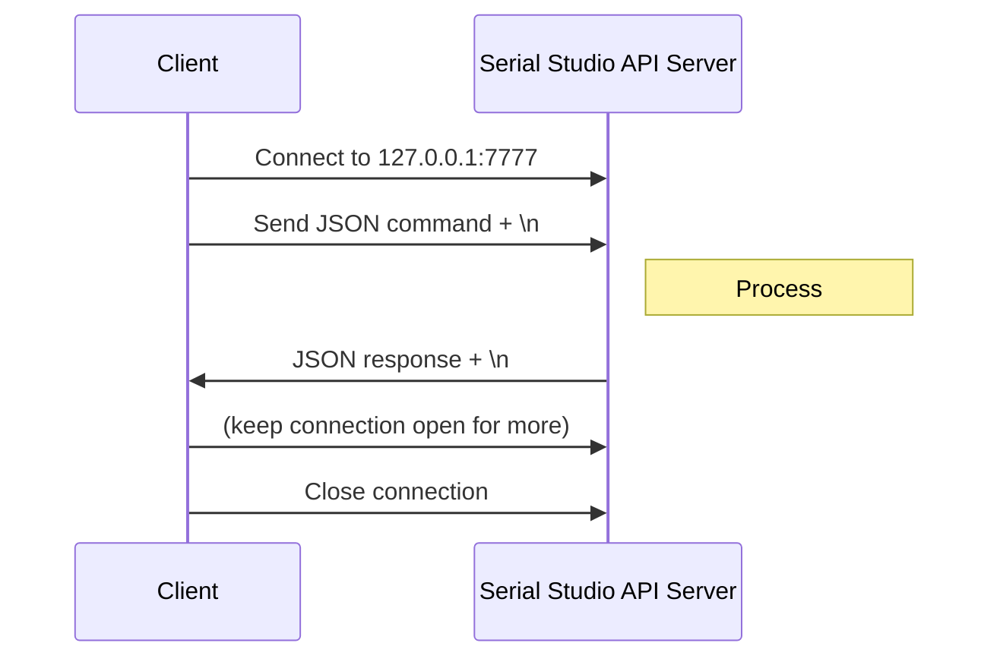

> **The command-by-command reference below is regenerated by hand and
> drifts behind the C++ registry over time.** The protocol shape, the
> connection details, and the prose sections (overview, security,
> usage, recommended patterns, troubleshooting) are kept current. The
> per-command sections under *Complete Command Reference* are best read
> as a structured tour, not a contract.
>
> The authoritative live surface is whatever the running server
> registers at startup (`app/src/API/Handlers/*.cpp`). To enumerate it:
>
> - **Legacy JSON**: send `api.getCommands` (no params). It returns
>   `{name, description}` for every registered command.
> - **MCP**: send `tools/list` over JSON-RPC 2.0 (see [MCP
>   Client](../../examples/MCP%20Client/)) for the same surface plus full
>   per-command input schemas.
> - **REPL**: `python test_api.py list` from
>   [examples/API Test/](../../examples/API%20Test/).
> - **From the AI Assistant**: `meta.listCategories` followed by
>   `meta.listCommands` and `meta.describeCommand`.

## Table of Contents

- [Overview](#overview)
- [Getting Started](#getting-started)
- [Enabling the API Server](#enabling-the-api-server)
- [Security Considerations](#security-considerations)
- [Automation Use Cases](#automation-use-cases)
- [Connection Details](#connection-details)
- [Protocol Specification](#protocol-specification)
- [Complete Command Reference](#complete-command-reference)
- [Usage Examples](#usage-examples)
- [Client Tools and Libraries](#client-tools-and-libraries)
- [Best Practices](#best-practices)
- [Troubleshooting](#troubleshooting)
- [Advanced Topics](#advanced-topics)
- [Additional Resources](#additional-resources)

## Overview

### The API Server

The Serial Studio API Server is a **TCP server** that listens on **port 7777** (default) and accepts JSON-formatted commands to control Serial Studio programmatically. It provides programmatic control over Serial Studio through a TCP socket connection.

> **Identifier conventions.** Most API commands address objects through some combination of `sourceId`, `groupId`, `datasetId`, `index`, and `uniqueId`. They look interchangeable but are not. See the [Dataset Identity Model](Identity-Model.md) for the rules of thumb (mutate by `(groupId, datasetId)`, read by `uniqueId`, position by `index`).

### Key Capabilities

- **Full Configuration Control**: Set bus types, configure UART/Network/BLE/Modbus/CAN/MQTT settings
- **Connection Management**: Connect, disconnect, and monitor device connection status
- **Data Operations**: Send data to connected devices, control frame parsing
- **Export Management**: Enable/disable CSV and MDF4 exports, manage export files
- **Real-time Queries**: Get port lists, device status, configuration parameters
- **Batch Operations**: Execute multiple commands in a single request

### Use Cases

1. **Automated Testing**: Configure and control Serial Studio from test scripts
2. **CI/CD Integration**: Include hardware-in-the-loop testing in your pipeline
3. **Custom Dashboards**: Build specialized UIs for specific applications
4. **Multi-Device Control**: Manage multiple Serial Studio instances programmatically
5. **Workflow Automation**: Script repetitive configuration tasks
6. **Remote Monitoring**: Monitor connection status and data export from remote scripts
7. **Integration**: Connect Serial Studio with LabVIEW, MATLAB, Python scripts, or other tools
8. **Manufacturing QA**: Production line testing and quality assurance
9. **Laboratory Automation**: Multi-device coordination and long-running experiments
10. **Educational Demonstrations**: Classroom demonstration automation

### Available in Both Licenses

The API Server is available in both **Serial Studio GPL** and **Serial Studio Pro** builds:

- **GPL Build**: Access to the core commands (UART, Network, BLE, CSV export/player, Console, Dashboard, Project, I/O Manager)
- **Pro Build**: Full access to every command (includes Modbus, CAN Bus, MQTT, MDF4 export/player, Audio, USB, HID, Process I/O)

**Legend:**
- 🟢 = GPL/Pro (available in all builds)
- 🔵 = Pro only (requires commercial license)

## Calling the API from Frame Parsers, Transforms, and Canvas Widgets

The commands in this document are also reachable from inside Serial Studio's scripting surfaces (Lua and JavaScript) via a generic `apiCall()` gateway. No TCP socket required: the call is dispatched in-process on the dashboard thread. A project's own scripts are first-party code, so the gateway is ungated for them — the full catalog below is callable with no allow-list, rate limit, or payload cap. The user-consent gate applies only to remote clients over TCP. See [Frame Parser Scripting](JavaScript-API.md) for examples.

```lua
local r = apiCall("project.dataset.list")
if r.ok then
  print("Got " .. #r.result.datasets .. " datasets")
end
```

```javascript
const r = apiCall("dashboard.getStatus");
if (!r.ok) console.warn(r.error);
```

Return shape: `{ ok, result?, error?, errorCode?, errorData? }`. See [Frame Parser Scripting -> apiCall](JavaScript-API.md) for the full signature, examples, and the list of focused helpers (`clearPlots`, `deviceWrite`, `actionFire`, `setActiveWorkspace`, ...) that exist as thin shortcuts over `apiCall`.

`apiCall` runs synchronously and never throws. Treat it as a one-shot, event-driven trigger, not as something to invoke on every frame.

## Getting Started

### Prerequisites

1. **Serial Studio** installed and running
2. **Network Access**: Ensure localhost (127.0.0.1) connections are allowed
3. **No additional dependencies** for basic usage

### Quick Start

1. **Launch Serial Studio**

2. **Enable the API Server**:
   - Go to **Preferences → General → API & Plugins**
   - Turn on **"Enable API Server (Port 7777)"**
   - Click **OK**

3. **Test the connection** using curl (or any TCP client):
   ```bash
   echo '{"type":"command","id":"1","command":"io.getStatus"}' | nc localhost 7777
   ```

4. **Download the Python test client** (optional):
   - Navigate to `examples/API Test/` in the Serial Studio repository
   - Run: `python test_api.py send io.getStatus`

## Enabling the API Server

### Through the GUI

1. Open Serial Studio
2. Click **Preferences** (wrench icon) or press **Ctrl/Cmd+,**
3. On the **General** tab, scroll to the **API & Plugins** section
4. Find **"Enable API Server (Port 7777)"**
5. Toggle the switch to **ON**
6. Click **OK** to apply

The API Server starts immediately and will remember your preference across restarts.

### Verify Connection

Test the API is running:

```bash
# Linux/macOS
nc -zv 127.0.0.1 7777

# Or test with the Python client
cd examples/API\ Test
python test_api.py send io.getStatus
```

Expected output:
```json
{
  "isConnected": false,
  "paused": false,
  "busType": 0,
  "configurationOk": false
}
```

### Port Configuration

The API Server always listens on **port 7777**; the port is not configurable. By default it is:
- **Localhost-only**: Only accepts connections from 127.0.0.1 (same machine)
- **No authentication**: Any local process can connect

When external connections are enabled, the server binds to all interfaces and non-loopback clients must authenticate with an access token. See [Authentication for External Connections](#authentication-for-external-connections).

The same server and token also carry the [Remote Dashboard](Remote-Dashboard.md) mirror: a second Serial Studio instance can attach as a read-only viewer of the local dashboard.

## Security Considerations

### Localhost By Default

By default, the API Server **only accepts connections from 127.0.0.1** (localhost). In this default configuration it is:
- ✅ **Safe** for local development and automation
- ✅ **Isolated** from network attacks
- ❌ **Not accessible** from other machines
- ❌ **No remote access**

This is the recommended configuration for most users. Remote access is opt-in: enabling **Allow External API Connections** binds the server to all interfaces and requires non-loopback clients to authenticate (see [Authentication for External Connections](#authentication-for-external-connections)).

### Authentication

By default the server binds to localhost only and requires **no authentication**, so any local process can connect. This is safe on single-user machines; on shared or multi-user systems, remember that any local process can control Serial Studio.

When **external connections** are enabled, the server also accepts connections from other machines. To keep that exposure safe, **every non-loopback client must authenticate with an access token** before any command or raw data is honored. Loopback (127.0.0.1 / ::1) clients are always exempt, so existing local tooling keeps working unchanged.

**Implications:**
- Safe on single-user machines in the default (localhost-only) configuration
- On shared/multi-user systems, any local process can control Serial Studio
- Enabling external connections exposes port 7777 to your network; the token is the only barrier, so keep it secret and disable external access when it is not needed

### Authentication for External Connections

The access token gate applies **only to non-loopback clients** and **only when external connections are enabled**. Local (loopback) clients never need a token, so scripts running on the same machine are unaffected.

**Where to find the token**

1. Open **Preferences -> General -> API & Plugins**.
2. Enable **Allow External API Connections**.
3. The **API Access Token** field shows a 64-character hexadecimal token. Use the refresh button beside it to issue a new token. Regenerating leaves already-authenticated sessions connected; new connections must use the new token.

The token is generated automatically the first time external connections are enabled and persists across restarts.

**How a client authenticates**

A non-loopback client must send an auth handshake as its **first line**, before any other command:

```json
{"type":"auth","token":"<your-token>"}
```

On success the server replies, and the connection stays authenticated for its lifetime:

```json
{"type":"response","success":true,"result":{"authenticated":true}}
```

Any command sent before authenticating is rejected with an `EXECUTION_ERROR` ("Authentication required"), and the connection is closed after a few failed attempts. Loopback clients skip this step entirely.

**Example (Python)**

```python
import json
import socket

TOKEN = "paste-your-token-here"

sock = socket.socket(socket.AF_INET, socket.SOCK_STREAM)
sock.connect(("192.168.1.50", 7777))  # the machine running Serial Studio

# Authenticate first (required only for non-loopback connections).
sock.sendall((json.dumps({"type": "auth", "token": TOKEN}) + "\n").encode())
print(sock.recv(4096).decode())  # {"type":"response","success":true,...}

# Now send commands as usual.
status = {"type": "command", "id": "1", "command": "io.getStatus"}
sock.sendall((json.dumps(status) + "\n").encode())
print(sock.recv(65536).decode())
sock.close()
```

> **Token storage.** The token is kept in cleartext in Serial Studio's
> application settings, alongside other preferences. Treat it like a
> password: anyone holding it with network access to port 7777 can control
> Serial Studio. Regenerate it if you suspect it leaked, and keep external
> connections disabled unless you need them.

### Production Environments

For production or multi-user systems:

1. **Disable the API when not needed** - Only enable when actively using it
2. **Use automation with caution** - Validate all parameters before sending commands
3. **Monitor connections** - Check the Device Setup or Dashboard Panel indicators
4. **Run as limited user** - Don't run Serial Studio with elevated privileges when API is enabled
5. **Audit access** - Keep logs of which scripts/tools access the API

### Firewall

Ensure your firewall does not expose port 7777 externally:

**Linux:**
```bash
# Check if port is listening externally
netstat -tuln | grep 7777

# Should show: 127.0.0.1:7777 (not 0.0.0.0:7777)
```

**Windows:**
```powershell
netstat -an | findstr 7777
```

**macOS:**
```bash
netstat -an | grep 7777
```

### Security Best Practices

```bash
# Good: Validate inputs before sending to API
python validate_config.py && python configure_device.py

# Bad: Blindly forwarding untrusted data to API
curl http://external-source/config.json | python send_to_api.py

# Good: Use local scripts with known behavior
./scripts/connect_uart.py

# Bad: Running unknown scripts with API access
wget http://example.com/script.py && python script.py
```

**Best Practices:**
1. **Only enable when needed**: Disable the API Server when not in use
2. **Monitor connections**: Watch for unexpected API activity
3. **Validate inputs**: Always validate parameters in client code
4. **Use HTTPS/VPN**: If remote access is needed, use a VPN or SSH tunnel
5. **Don't expose publicly**: Never expose port 7777 to the internet
6. **Audit scripts**: Review automation scripts for security issues

### Future Enhancements

Rate limiting and basic connection logging are already present. The
server enforces a per-window message cap (clients that exceed it are
disconnected), and connect, disconnect, and authentication events are
logged.

Planned security features (not yet implemented):
- Per-command permissions
- TLS/SSL encryption
- Configurable bind address

## Automation Use Cases

The API is designed for:

### 1. Automated Testing
```python
# Automated hardware-in-the-loop testing using test_api.py
import subprocess
import time

# Configure device
subprocess.run(["python", "test_api.py", "send", "io.setBusType", "-p", "busType=0"])
subprocess.run(["python", "test_api.py", "send", "io.uart.setBaudRate", "-p", "baudRate=115200"])
subprocess.run(["python", "test_api.py", "send", "io.uart.setPortIndex", "-p", "portIndex=0"])
subprocess.run(["python", "test_api.py", "send", "io.connect"])

# Your test code here - e.g., send test commands, read responses, etc.

# Export data for later analysis
subprocess.run(["python", "test_api.py", "send", "csvExport.setEnabled", "-p", "enabled=true"])
time.sleep(10)  # Let it record data
subprocess.run(["python", "test_api.py", "send", "csvExport.close"])

# Your analysis code here - e.g., parse CSV, validate data ranges, etc.
```

### 2. Manufacturing QA
```python
# Production line testing using the API client
import json
import socket

def send_command(command, params=None):
    sock = socket.socket(socket.AF_INET, socket.SOCK_STREAM)
    sock.connect(("127.0.0.1", 7777))
    msg = {"type": "command", "id": "qa", "command": command}
    if params:
        msg["params"] = params
    sock.sendall((json.dumps(msg) + "\n").encode())
    response = json.loads(sock.recv(65536).decode())
    sock.close()
    return response

# Example: Test 100 units in production
for unit_id in range(100):
    send_command("io.connect")

    # Your testing logic here - e.g., send test commands,
    # read sensor values, validate against specifications

    send_command("io.disconnect")

    # Your logging/reporting logic here
```

### 3. Laboratory Automation
```bash
#!/bin/bash
# Example: Multi-device coordination using shell scripts

# Setup device connection
python test_api.py send io.setBusType -p busType=0
python test_api.py send io.uart.setBaudRate -p baudRate=115200
python test_api.py send io.connect
python test_api.py send csvExport.setEnabled -p enabled=true

# Monitor connection for extended experiment (e.g., 24 hours)
for i in {1..1440}; do  # 1440 = 24 hours * 60 minutes
    STATUS=$(python test_api.py send io.getStatus --json)
    IS_CONNECTED=$(echo $STATUS | jq -r '.result.isConnected')

    if [ "$IS_CONNECTED" != "true" ]; then
        echo "$(date): Connection lost, reconnecting..." >> experiment.log
        python test_api.py send io.connect
    fi

    sleep 60  # Check every minute
done

python test_api.py send csvExport.close
echo "$(date): Experiment complete" >> experiment.log
```

### 4. Remote Monitoring
```python
# Example: Raspberry Pi sensor gateway
import subprocess
import json
import time

while True:
    result = subprocess.run(
        ["python", "test_api.py", "send", "io.getStatus", "--json"],
        capture_output=True, text=True
    )
    status = json.loads(result.stdout)

    # Your cloud upload logic here - e.g., HTTP POST, MQTT publish, etc.
    # Example data to send:
    # {
    #     "connected": status["result"]["isConnected"],
    #     "bus_type": status["result"]["busType"],
    #     "timestamp": time.time()
    # }

    time.sleep(300)  # Check every 5 minutes
```

### 5. CI/CD Integration
```yaml
# Example: GitLab CI / GitHub Actions workflow
jobs:
  hardware_test:
    runs-on: ubuntu-latest
    steps:
      - uses: actions/checkout@v2

      - name: Start Serial Studio
        run: |
          # Start Serial Studio in background (assuming it's installed)
          serial-studio &
          sleep 5

      - name: Configure Device via API
        run: |
          cd examples/API\ Test
          python test_api.py send io.setBusType -p busType=0
          python test_api.py send io.uart.setBaudRate -p baudRate=115200
          python test_api.py send io.connect

      - name: Run Your Hardware Tests
        run: |
          # Your test commands here
          # e.g., send test data, verify responses, etc.
          python test_api.py send io.getStatus
```

### 6. Educational Demonstrations
```bash
#!/bin/bash
# Example: Classroom demonstration automation

# Step 1: Connect to Arduino
python test_api.py send io.setBusType -p busType=0
python test_api.py send io.uart.setBaudRate -p baudRate=9600
python test_api.py send io.uart.setPortIndex -p portIndex=0
python test_api.py send io.connect
sleep 2

# Step 2: Enable CSV logging
python test_api.py send csvExport.setEnabled -p enabled=true
echo "Recording data for 30 seconds..."
sleep 30

# Step 3: Stop recording
python test_api.py send csvExport.close
echo "Data saved to CSV file"

# Analyze the data with your own tools (e.g., Python, Excel, MATLAB, etc.)
```

## Connection Details

### Network Protocol

- **Protocol**: TCP (Transmission Control Protocol)
- **Host**: `127.0.0.1` (localhost only)
- **Port**: `7777` (default)
- **Encoding**: UTF-8
- **Message Format**: JSON (one message per line, terminated with `\n`)

### Message Flow


```mermaid
sequenceDiagram
    participant Client
    participant Server as Serial Studio API Server

    Client->>Server: Connect to 127.0.0.1:7777
    Client->>Server: Send JSON command + \n
    Note right of Server: Process
    Server->>Client: JSON response + \n
    Client->>Server: (keep connection open for more)
    Client->>Server: Close connection
```

### Connection Lifecycle

1. **Establish TCP connection** to `127.0.0.1:7777`
2. **Send commands** as JSON objects, each terminated with newline (`\n`)
3. **Receive responses** as JSON objects, each terminated with newline
4. **Keep connection open** for multiple commands (persistent connection)
5. **Close when done** - the server keeps the connection open until the client disconnects (no idle timeout)

### Connection Handling

The API server accepts multiple concurrent client connections. Each client operates independently:

```python
# Multiple clients can connect simultaneously
client1 = connect_to_api()  # Control connection
client2 = connect_to_api()  # Monitoring connection
client3 = connect_to_api()  # Data export control

# Command responses go only to the socket that sent the command.
# Push messages (frames, raw data, lifecycle events) go to every client.
status = client1.send("io.getStatus")
# State changes made by one client are visible to all clients
```

**Connection lifecycle:**
1. Client connects to `127.0.0.1:7777`
2. Client sends JSON commands (one per line)
3. Server responds with JSON (one per line)
4. Client can keep connection open or close after each command
5. Server automatically cleans up on client disconnect

> **gRPC**: The entire API is also available via gRPC on port 8888, with high-performance binary streaming. See the [gRPC Server](gRPC-Server.md) documentation.

## Protocol Specification

### Message Format

All messages are JSON objects terminated by a newline (`\n`). The server processes one command per connection or multiple commands in sequence.

### Message Types

The API supports two message types:

1. **Command**: Execute a single command
2. **Batch**: Execute multiple commands sequentially

### Command Request Format

```json
{
  "type": "command",
  "id": "unique-request-id",
  "command": "io.getStatus",
  "params": {
    "key": "value"
  }
}
```

**Fields:**
- `type` (string, required): Always `"command"` for single commands
- `id` (string, optional): Unique identifier for this request (echoed in response)
- `command` (string, required): Command name (e.g., `"io.connect"`)
- `params` (object, optional): Parameters for the command

### Batch Request Format

```json
{
  "type": "batch",
  "id": "batch-request-id",
  "commands": [
    {
      "command": "io.setBusType",
      "id": "cmd-1",
      "params": {"busType": 0}
    },
    {
      "command": "io.uart.setBaudRate",
      "id": "cmd-2",
      "params": {"baudRate": 115200}
    }
  ]
}
```

**Fields:**
- `type` (string, required): Always `"batch"` for batch requests
- `id` (string, optional): Unique identifier for the entire batch
- `commands` (array, required): Array of command objects

### Success Response Format

```json
{
  "type": "response",
  "id": "unique-request-id",
  "success": true,
  "result": {
    "isConnected": false,
    "paused": false
  }
}
```

**Fields:**
- `type` (string): Always `"response"`
- `id` (string): Matches the request ID
- `success` (boolean): `true` if command succeeded
- `result` (object): Command-specific result data

### Error Response Format

```json
{
  "type": "response",
  "id": "unique-request-id",
  "success": false,
  "error": {
    "code": "INVALID_PARAM",
    "message": "Invalid port: 70000. Valid range: 1-65535"
  }
}
```

**Error Codes:**

| Code | Description | Example |
|------|-------------|---------|
| `INVALID_JSON` | Malformed JSON message | Missing closing brace, invalid syntax |
| `INVALID_MESSAGE_TYPE` | Unknown or missing message type | `"type": "unknown"` or missing `type` field |
| `UNKNOWN_COMMAND` | Command not recognized | `"command": "invalid.command"` |
| `INVALID_PARAM` | Parameter value out of range or invalid | Port 70000, negative baud rate |
| `MISSING_PARAM` | Required parameter not provided | Missing `baudRate` for `setBaudRate` |
| `EXECUTION_ERROR` | Command failed during execution | Disconnect when not connected |
| `OPERATION_FAILED` | Operation could not be completed | File I/O error, hardware error |

### Batch Response Format

```json
{
  "type": "response",
  "id": "batch-request-id",
  "success": false,
  "results": [
    {
      "id": "cmd-1",
      "success": true,
      "result": {"busType": 0}
    },
    {
      "id": "cmd-2",
      "success": false,
      "error": {"code": "INVALID_PARAM", "message": "..."}
    }
  ]
}
```

**Notes:**
- Batch `success` is `false` if **any** command fails
- Individual results are in `results` array
- Commands execute sequentially in order
- All commands execute even if one fails (no short-circuit)

### Server-Push Messages

Besides command responses, the server writes unsolicited JSON lines to **every** connected client:

| Message | When it is sent |
|---------|-----------------|
| `{"frames": [{"data": {...}}, ...]}` | Batch of parsed dashboard frames, pushed as data arrives |
| `{"data": "<base64>"}` | Raw bytes received from the device, base64-encoded |
| `{"event": "connected"}` / `{"event": "disconnected"}` | Device connection lifecycle changes |

A client that issues commands on a long-lived socket while a device is streaming must demultiplex incoming lines: a line whose `type` field is `"response"` answers a command (match it to the request by `id`); lines with a `frames`, `data`, or `event` key are push messages. A naive `recv()` after `send()` can pick up a frame batch instead of the response.

## Complete Command Reference

The API provides **300+ commands** across multiple modules; enumerate the live surface with `api.getCommands`:

The per-module counts below are approximate and drift behind the C++
registry; treat `api.getCommands` as the source of truth.

When a command is invoked through the AI Assistant rather than a raw TCP/JSON client, it is additionally gated by a five-tier safety system (Safe, Confirm, Always confirm, Device-gated, Blocked); see [The safety tiers](AI-Assistant.md#the-safety-tiers).

**GPL Build:**
- API introspection: 1 command
- I/O Manager: 8 commands
- UART Driver: 12 commands
- Network Driver: 9 commands
- Bluetooth LE Driver: 12 commands
- CSV Export: 3 commands
- CSV Player: 6 commands
- Console Control: 17 commands
- Dashboard Configuration: 13 commands
- Project Management: 64 commands
- Workspace Management: 15 commands
- Problem Center: 3 commands

**Pro Build Additional:**
- Modbus Driver: 22 commands
- CAN Bus Driver: 9 commands
- MQTT Client: 6 commands
- MDF4 Export: 3 commands
- MDF4 Player: 6 commands
- Audio Driver: 13 commands
- USB Driver: 7 commands
- HID Driver: 3 commands
- Process I/O Driver: 7 commands

### API Commands (1)

#### 🟢 `api.getCommands`
Returns every command the live server exposes, with descriptions.

**Parameters:** None

**Returns:**
```json
{
  "commands": [
    {"name": "io.connect", "description": "Open the configured connection"},
    {"name": "io.uart.setBaudRate", "description": "Set the UART baud rate (params: baudRate)"}
  ]
}
```

**Example:**
```bash
python test_api.py send api.getCommands
```

> Over MCP, the equivalent is the standard `tools/list` JSON-RPC
> method, which returns the same surface plus per-command input
> schemas.

### I/O Manager Commands (8)

Connection and bus management:

#### 🟢 `io.getStatus`
Get current connection status and configuration.

**Parameters:** None

**Returns:**
```json
{
  "isConnected": false,
  "paused": false,
  "busType": 0,
  "busTypeLabel": "UART (serial port)",
  "busTypeSlug": "uart",
  "configurationOk": true,
  "readOnly": false,
  "readWrite": true,
  "busTypeName": "UART/COM",
  "_summary": "Not connected. UART (serial port) is configured and ready to open."
}
```

#### 🟢 `io.listBuses`
Get list of supported bus types.

**Parameters:** None

**Returns:**
```json
{
  "buses": [
    {"index": 0, "name": "UART/COM"},
    {"index": 1, "name": "Network Socket"},
    {"index": 2, "name": "Bluetooth LE"}
  ]
}
```

#### 🟢 `io.setBusType`
Set the active bus/driver type.

**Parameters:**
- `busType` (int): 0=UART, 1=Network, 2=BLE, 3=Audio, 4=Modbus, 5=CAN, 6=USB, 7=HID, 8=Process, 9=MQTT (3-9 require Pro)

**Example:**
```bash
python test_api.py send io.setBusType -p busType=0
```

#### 🟢 `io.setPaused`
Pause or resume data processing.

**Parameters:**
- `paused` (bool): true to pause, false to resume

**Example:**
```bash
python test_api.py send io.setPaused -p paused=true
```

#### 🟢 `io.connect`
Open connection to the configured device.

**Parameters:** None

**Returns:**
```json
{
  "connected": true
}
```

**Errors:**
- `EXECUTION_ERROR`: Already connected or configuration invalid

**Example:**
```bash
python test_api.py send io.connect
```

#### 🟢 `io.disconnect`
Close current device connection.

**Parameters:** None

**Returns:**
```json
{
  "connected": false
}
```

**Errors:**
- `EXECUTION_ERROR`: Not connected

**Example:**
```bash
python test_api.py send io.disconnect
```

#### 🟢 `io.writeData`
Send data to the connected device.

**Parameters:**
- `data` (string): Base64-encoded data to send

**Returns:**
```json
{
  "bytesWritten": 12
}
```

**Example:**
```bash
# Send "Hello World" (SGVsbG8gV29ybGQ= in Base64)
echo -n "Hello World" | base64  # SGVsbG8gV29ybGQ=
python test_api.py send io.writeData -p data=SGVsbG8gV29ybGQ=
```

**Errors:**
- `EXECUTION_ERROR`: Not connected, or device write denied by the user
- `MISSING_PARAM`: Missing `data` parameter
- `INVALID_PARAM`: Invalid base64 encoding

> Device-write commands (`io.writeData`, `io.ble.writeCharacteristic`, `console.send`) sent
> by a remote API/MCP client trigger a one-time consent prompt; the user's answer is
> remembered. Headless runs cannot show the prompt, so set the environment variable
> `SERIAL_STUDIO_API_AUTO_CONSENT=1` to allow API device writes in that mode (used by CI).

> Frame-detection mode and start/finish delimiter sequences are no longer
> live runtime commands. They are per-source project settings configured
> in the Project Editor (or via `project.source.update`) and persisted in
> the `.ssproj` file.

#### 🟢 `io.getLatestFrame`
Get the latest raw frame received from the device, including channel tokens not yet mapped to any dataset.

**Parameters:**
- `sourceId` (int, optional): Source filter; omit for the newest frame across all sources
- `encoding` (string, optional, default `text`): Payload encoding - `text`, `base64`, or `both`

**Returns:**
```json
{
  "hasData": true,
  "sequence": 42,
  "timestampMs": 123456,
  "ageMs": 8,
  "sourceId": 0,
  "text": "25.3,60\n",
  "valueCount": 2,
  "values": ["25.3", "60"]
}
```

**Notes:**
- `timestampMs` is a monotonic clock in milliseconds, not Unix epoch time; use it only for deltas between frames
- Capture runs only while a control loop is running or the API server is enabled; `hasData: false` means no data or no active consumer

### UART Driver Commands (12)

Serial port configuration:

#### 🟢 `io.uart.getConfig`
Get current UART configuration.

**Parameters:** None

**Returns:**
```json
{
  "portIndex": 1,
  "portName": "/dev/ttyUSB0",
  "baudRate": 115200,
  "parityIndex": 0,
  "parityName": "None",
  "dataBitsIndex": 3,
  "dataBitsValue": 8,
  "stopBitsIndex": 0,
  "stopBitsValue": 1,
  "flowControlIndex": 0,
  "flowControlName": "None",
  "dtrEnabled": true,
  "autoReconnect": false,
  "isOpen": false,
  "configurationOk": true
}
```

#### 🟢 `io.uart.listPorts`
Get list of available serial ports.

**Parameters:** None

**Returns:**
```json
{
  "portList": [
    {"index": 0, "name": "COM1"},
    {"index": 1, "name": "COM3"}
  ],
  "currentPortIndex": 0,
  "ports": [
    {"index": 0, "name": "None"},
    {"index": 1, "name": "/dev/ttyUSB0"}
  ]
}
```

#### 🟢 `io.uart.listBaudRates`
Get list of common baud rates.

**Parameters:** None

**Returns:**
```json
{
  "baudRateList": ["110", "150", "300", "1200", "2400", "4800", "9600", "19200", "38400", "57600", "115200", "230400", "256000", "460800", "576000", "921600"],
  "currentBaudRate": 9600,
  "baudRates": [
    {"index": 0, "value": 1200},
    {"index": 1, "value": 2400}
  ]
}
```

#### 🟢 `io.uart.setDevice`
Register a custom serial port device name.

**Parameters:**
- `device` (string): Device name (e.g., "COM3", "/dev/ttyUSB0")

**Example:**
```bash
python test_api.py send io.uart.setDevice -p device=COM3
```

#### 🟢 `io.uart.setPortIndex`
Select serial port by index from port list.

**Parameters:**
- `portIndex` (int): Index from getPortList

**Example:**
```bash
python test_api.py send io.uart.setPortIndex -p portIndex=0
```

#### 🟢 `io.uart.setBaudRate`
Set baud rate.

**Parameters:**
- `baudRate` (int): Baud rate (e.g., 9600, 115200)

**Example:**
```bash
python test_api.py send io.uart.setBaudRate -p baudRate=115200
```

#### 🟢 `io.uart.setParity`
Set parity mode.

**Parameters:**
- `parityIndex` (int): 0=None, 1=Even, 2=Odd, 3=Space, 4=Mark

**Example:**
```bash
python test_api.py send io.uart.setParity -p parityIndex=0
```

#### 🟢 `io.uart.setDataBits`
Set data bits.

**Parameters:**
- `dataBitsIndex` (int): 0=5 bits, 1=6 bits, 2=7 bits, 3=8 bits

**Example:**
```bash
python test_api.py send io.uart.setDataBits -p dataBitsIndex=3
```

#### 🟢 `io.uart.setStopBits`
Set stop bits.

**Parameters:**
- `stopBitsIndex` (int): 0=1 bit, 1=1.5 bits, 2=2 bits

**Example:**
```bash
python test_api.py send io.uart.setStopBits -p stopBitsIndex=0
```

#### 🟢 `io.uart.setFlowControl`
Set flow control mode.

**Parameters:**
- `flowControlIndex` (int): 0=None, 1=Hardware, 2=Software

**Example:**
```bash
python test_api.py send io.uart.setFlowControl -p flowControlIndex=0
```

#### 🟢 `io.uart.setDtrEnabled`
Enable or disable DTR signal.

**Parameters:**
- `dtrEnabled` (bool): true to enable, false to disable

**Example:**
```bash
python test_api.py send io.uart.setDtrEnabled -p dtrEnabled=false
```

#### 🟢 `io.uart.setAutoReconnect`
Set auto-reconnect behavior.

**Parameters:**
- `autoReconnect` (bool): true to enable, false to disable

**Example:**
```bash
python test_api.py send io.uart.setAutoReconnect -p autoReconnect=true
```

### Network Driver Commands (17)

TCP, UDP, WebSocket and HTTP client configuration:

#### 🟢 `io.network.getConfig`
Get current network configuration.

**Parameters:** None

**Returns:**
```json
{
  "socketTypeIndex": 0,
  "socketTypeName": "TCP",
  "remoteAddress": "192.168.1.1",
  "tcpPort": 8080,
  "udpLocalPort": 0,
  "udpRemotePort": 8081,
  "udpMulticast": false,
  "webSocketUrl": "ws://127.0.0.1:8080",
  "webSocketFormatIndex": 0,
  "httpUrl": "http://127.0.0.1:8080/",
  "httpMethod": "GET",
  "httpBody": "",
  "httpHeaders": "",
  "httpInterval": 1000,
  "ignoreTlsErrors": false,
  "isOpen": false
}
```

#### 🟢 `io.network.getStatus`
Get the link state and the HTTP poll counters. The counters cover the current connection only and reset on each connect.

**Parameters:** None

**Returns:**
```json
{
  "socketTypeIndex": 3,
  "isOpen": true,
  "isConnecting": false,
  "pollsOk": 41,
  "pollsFailed": 2,
  "pollsSkipped": 0,
  "consecutiveFailures": 0
}
```

#### 🟢 `io.network.listSocketTypes`
Get list of available socket types.

**Parameters:** None

**Returns:**
```json
{
  "socketTypes": [
    {"index": 0, "name": "TCP"},
    {"index": 1, "name": "UDP"},
    {"index": 2, "name": "WebSocket"},
    {"index": 3, "name": "HTTP"}
  ]
}
```

#### 🟢 `io.network.setRemoteAddress`
Set remote host address.

**Parameters:**
- `address` (string): IP address or hostname

**Example:**
```bash
python test_api.py send io.network.setRemoteAddress -p address=192.168.1.100
```

#### 🟢 `io.network.setTcpPort`
Set TCP port number.

**Parameters:**
- `port` (int): Port number (1-65535)

**Example:**
```bash
python test_api.py send io.network.setTcpPort -p port=8080
```

#### 🟢 `io.network.setUdpLocalPort`
Set UDP local port.

**Parameters:**
- `port` (int): Port number (0-65535, 0=any available port)

**Example:**
```bash
python test_api.py send io.network.setUdpLocalPort -p port=9000
```

#### 🟢 `io.network.setUdpRemotePort`
Set UDP remote port.

**Parameters:**
- `port` (int): Port number (1-65535)

**Example:**
```bash
python test_api.py send io.network.setUdpRemotePort -p port=9001
```

#### 🟢 `io.network.setSocketType`
Set socket type.

**Parameters:**
- `socketTypeIndex` (int): 0=TCP, 1=UDP, 2=WebSocket, 3=HTTP. Every transport is a client; Serial Studio never listens for inbound connections.

**Example:**
```bash
python test_api.py send io.network.setSocketType -p socketTypeIndex=0
```

#### 🟢 `io.network.setUdpMulticast`
Enable or disable UDP multicast.

**Parameters:**
- `enabled` (bool): true to enable, false to disable

**Example:**
```bash
python test_api.py send io.network.setUdpMulticast -p enabled=false
```

#### 🟢 `io.network.setWebSocketUrl`
Set the WebSocket endpoint. Rejected with `InvalidParam` unless the scheme is `ws` or `wss`.

**Parameters:**
- `url` (string): `ws://host:port/path` or `wss://host:port/path`

**Example:**
```bash
python test_api.py send io.network.setWebSocketUrl -p url=ws://127.0.0.1:8080/feed
```

#### 🟢 `io.network.setHttpUrl`
Set the HTTP endpoint. Rejected with `InvalidParam` unless the scheme is `http` or `https`.

**Parameters:**
- `url` (string): `http://host:port/path` or `https://host:port/path`

**Example:**
```bash
python test_api.py send io.network.setHttpUrl -p url=http://127.0.0.1:8080/telemetry
```

#### 🟢 `io.network.setHttpMethod`
Set the HTTP method used for every request.

**Parameters:**
- `method` (string): `GET`, `POST`, `PUT`, `PATCH` or `DELETE`

**Example:**
```bash
python test_api.py send io.network.setHttpMethod -p method=POST
```

#### 🟢 `io.network.setHttpBody`
Set the body sent with every HTTP request. Ignored by servers that do not accept a body for the chosen method.

**Parameters:**
- `body` (string): Request body

**Example:**
```bash
python test_api.py send io.network.setHttpBody -p body='{"probe":1}'
```

#### 🟢 `io.network.setHttpHeaders`
Set the custom HTTP request headers. This is where API keys, bearer tokens and `Accept` go; there are no dedicated credential fields.

**Parameters:**
- `headers` (string): One `Name: Value` pair per line

**Example:**
```bash
python test_api.py send io.network.setHttpHeaders -p headers='X-Api-Key: secret'
```

#### 🟢 `io.network.setHttpInterval`
Set the HTTP poll interval. `0` disables polling: the source then issues a request only when data is written to it.

**Parameters:**
- `interval` (int): Milliseconds, `0` or 10-3600000

**Example:**
```bash
python test_api.py send io.network.setHttpInterval -p interval=250
```

#### 🟢 `io.network.setIgnoreTlsErrors`
Accept an untrusted certificate on `wss://` and `https://` endpoints. Off by default; every connection that uses the bypass reports it on the console.

**Parameters:**
- `enabled` (bool): true to bypass certificate verification

**Example:**
```bash
python test_api.py send io.network.setIgnoreTlsErrors -p enabled=true
```

#### 🟢 `io.network.lookup`
Perform DNS lookup for a hostname.

**Parameters:**
- `host` (string): Hostname to resolve

**Returns:**
```json
{
  "host": "example.com",
  "addresses": ["93.184.216.34"]
}
```

**Example:**
```bash
python test_api.py send io.network.lookup -p host=google.com
```

### Bluetooth LE Driver Commands (12)

BLE device management:

#### 🟢 `io.ble.getStatus`
Get Bluetooth adapter status.

**Parameters:** None

**Returns:**
```json
{
  "operatingSystemSupported": true,
  "adapterAvailable": true,
  "isOpen": false,
  "deviceCount": 0
}
```

#### 🟢 `io.ble.getConfig`
Get current BLE configuration.

**Parameters:** None

**Returns:**
```json
{
  "deviceIndex": -1,
  "characteristicIndex": 0,
  "isOpen": false,
  "configurationOk": false,
  "deviceName": "Arduino BLE",
  "characteristicName": "Temperature"
}
```

#### 🟢 `io.ble.listDevices`
Get list of discovered BLE devices.

**Parameters:** None

**Returns:**
```json
{
  "deviceList": [
    {"index": 0, "name": "My BLE Device"},
    {"index": 1, "name": "Heart Rate Monitor"}
  ],
  "currentDeviceIndex": -1,
  "devices": [
    {"index": 0, "name": "Arduino BLE", "address": "00:11:22:33:44:55"}
  ]
}
```

#### 🟢 `io.ble.listServices`
Get list of services for selected device.

**Parameters:** None

**Returns:**
```json
{
  "serviceList": [
    {"index": 0, "name": "Generic Access"},
    {"index": 1, "name": "Heart Rate"}
  ],
  "services": [
    {"index": 0, "name": "Environmental Sensing", "uuid": "181A"}
  ]
}
```

#### 🟢 `io.ble.listCharacteristics`
Get list of characteristics for selected service.

**Parameters:** None

**Returns:**
```json
{
  "characteristicList": [
    {"index": 0, "name": "Heart Rate Measurement"}
  ],
  "currentCharacteristicIndex": -1,
  "characteristics": [
    {"index": 0, "name": "Temperature", "uuid": "2A6E"}
  ]
}
```

#### 🟢 `io.ble.startDiscovery`
Start scanning for BLE devices.

**Parameters:** None

**Example:**
```bash
python test_api.py send io.ble.startDiscovery
```

#### 🟢 `io.ble.selectDevice`
Select a discovered BLE device.

**Parameters:**
- `deviceIndex` (int): Device index from listDevices

**Example:**
```bash
python test_api.py send io.ble.selectDevice -p deviceIndex=0
```

#### 🟢 `io.ble.selectService`
Select a BLE service.

**Parameters:**
- `serviceIndex` (int): Service index from listServices

**Example:**
```bash
python test_api.py send io.ble.selectService -p serviceIndex=0
```

#### 🟢 `io.ble.setCharacteristicIndex`
Select a BLE characteristic.

**Parameters:**
- `characteristicIndex` (int): Characteristic index from listCharacteristics

**Example:**
```bash
python test_api.py send io.ble.setCharacteristicIndex -p characteristicIndex=0
```

#### 🟢 `io.ble.selectServiceByUuid`
Select a BLE service by UUID instead of index. The device must already be connected.

**Parameters:**
- `serviceUuid` (string): Service UUID (16-bit short form like `fff0` or full 128-bit UUID)

**Example:**
```bash
python test_api.py send io.ble.selectServiceByUuid -p serviceUuid=fff0
```

#### 🟢 `io.ble.setNotifyCharacteristic`
Subscribe to the notify characteristic with the given UUID for incoming data. A service must be selected first.

**Parameters:**
- `characteristicUuid` (string): Notify characteristic UUID (16-bit short form like `fff2` or full 128-bit UUID)

**Example:**
```bash
python test_api.py send io.ble.setNotifyCharacteristic -p characteristicUuid=fff2
```

#### 🟢 `io.ble.writeCharacteristic`
Write raw bytes to a BLE characteristic resolved by UUID, independent of the selected notify characteristic. Pairs with `io.ble.setNotifyCharacteristic` for split read/write devices. The device must be connected and the owning service selected.

**Parameters:**
- `characteristicUuid` (string): Target characteristic UUID (16-bit short form like `fff1` or full 128-bit UUID)
- `data` (string): Base64-encoded bytes to write

**Errors:**
- `EXECUTION_ERROR`: Not connected, no service selected, or device write denied by the user

> This is one of the device-write commands covered by the consent prompt described
> under `io.writeData` above; the same one-time prompt and
> `SERIAL_STUDIO_API_AUTO_CONSENT=1` override apply here.

### CSV Export Commands (3)

CSV file export control:

#### 🟢 `csvExport.getStatus`
Get CSV export status.

**Parameters:** None

**Returns:**
```json
{
  "enabled": false,
  "isOpen": false
}
```

#### 🟢 `csvExport.setEnabled`
Enable or disable CSV export.

**Parameters:**
- `enabled` (bool): true to enable, false to disable

**Example:**
```bash
python test_api.py send csvExport.setEnabled -p enabled=true
```

#### 🟢 `csvExport.close`
Close current CSV file.

**Parameters:** None

**Example:**
```bash
python test_api.py send csvExport.close
```

### CSV Player Commands (6)

CSV file playback control:

#### 🟢 `csvPlayer.open`
Open a CSV file for playback.

**Parameters:**
- `filePath` (string): Path to CSV file

**Example:**
```bash
python test_api.py send csvPlayer.open -p filePath=/path/to/data.csv
```

#### 🟢 `csvPlayer.close`
Close current CSV file.

**Parameters:** None

#### 🟢 `csvPlayer.setPaused`
Pause or resume playback.

**Parameters:**
- `paused` (bool): true to pause, false to resume

**Example:**
```bash
python test_api.py send csvPlayer.setPaused -p paused=true
```

#### 🟢 `csvPlayer.step`
Step the player by a number of frames.

**Parameters:**
- `delta` (int, optional, default `1`): frames to advance; negative steps backward

**Example:**
```bash
python test_api.py send csvPlayer.step -p delta=-1
```

#### 🟢 `csvPlayer.setProgress`
Seek to position in file.

**Parameters:**
- `progress` (double): Position from 0.0 to 1.0

**Example:**
```bash
python test_api.py send csvPlayer.setProgress -p progress=0.5
```

#### 🟢 `csvPlayer.getStatus`
Get player status.

**Parameters:** None

**Returns:**
```json
{
  "isOpen": true,
  "isPlaying": false,
  "frameCount": 1000,
  "framePosition": 500,
  "progress": 0.5,
  "timestamp": "00:05:23.456",
  "filename": "data.csv"
}
```

### Console Commands (11)

> This section documents a representative subset; the live Console module
> registers 17 commands. Run `api.getCommands` for the full list.

Console/terminal control:

#### 🟢 `console.setEcho`
Enable or disable echo mode.

**Parameters:**
- `enabled` (bool): true to enable, false to disable

#### 🟢 `console.setShowTimestamp`
Show or hide timestamps.

**Parameters:**
- `enabled` (bool): true to show, false to hide

#### 🟢 `console.setDisplayMode`
Set display mode.

**Parameters:**
- `modeIndex` (int): 0=PlainText, 1=Hexadecimal

#### 🟢 `console.setDataMode`
Set data mode.

**Parameters:**
- `modeIndex` (int): 0=UTF8, 1=Hexadecimal

#### 🟢 `console.setLineEnding`
Set line ending mode.

**Parameters:**
- `endingIndex` (int): 0=None, 1=LF, 2=CR, 3=CRLF

#### 🟢 `console.setFontFamily`
Set console font.

**Parameters:**
- `fontFamily` (string): Font name

#### 🟢 `console.setFontSize`
Set console font size.

**Parameters:**
- `fontSize` (int): Font size in points

#### 🟢 `console.setChecksumMethod`
Set checksum method.

**Parameters:**
- `methodIndex` (int): Checksum method index

#### 🟢 `console.clear`
Clear console output.

**Parameters:** None

#### 🟢 `console.send`
Send data to device.

**Parameters:**
- `data` (string): Data to send

#### 🟢 `console.getConfig`
Get console configuration.

**Parameters:** None

**Returns:**
```json
{
  "echo": false,
  "showTimestamp": true,
  "displayMode": 0,
  "dataMode": 0,
  "lineEnding": 1,
  "fontFamily": "Courier New",
  "fontSize": 10,
  "checksumMethod": 0
}
```

### Dashboard Configuration Commands (10)

> This section documents a representative subset; the live Dashboard
> Configuration module registers 13 commands. Run `api.getCommands` for the
> full list.

Dashboard settings and visualization control:

#### 🟢 `dashboard.getStatus`
Get all dashboard configuration settings.

**Parameters:** None

**Returns:**
```json
{
  "operationMode": 0,
  "operationModeName": "ProjectFile",
  "fps": 60,
  "timeRange": 10.0,
  "widgetCount": 3,
  "datasetCount": 12,
  "running": false
}
```

**Example:**
```bash
python test_api.py send dashboard.getStatus
```

#### 🟢 `dashboard.setOperationMode`
Set the dashboard operation mode.

**Parameters:**
- `mode` (int): 0=ProjectFile, 1=ConsoleOnly, 2=QuickPlot

**Returns:**
```json
{
  "mode": 0,
  "modeName": "ProjectFile"
}
```

**Example:**
```bash
python test_api.py send dashboard.setOperationMode -p mode=1
```

**Operation Modes:**
- `0` - **ProjectFile**: Use a JSON project file to define dashboard layout
- `1` - **ConsoleOnly**: No parsing. Raw bytes flow only to the terminal, no dashboard.
- `2` - **QuickPlot**: Automatic plotting of incoming numeric data

#### 🟢 `dashboard.getOperationMode`
Get the current dashboard operation mode.

**Parameters:** None

**Returns:**
```json
{
  "mode": 0,
  "modeName": "ProjectFile"
}
```

**Example:**
```bash
python test_api.py send dashboard.getOperationMode
```

#### 🟢 `dashboard.setFps`
Set the visualization refresh rate.

**Parameters:**
- `fps` (int): Refresh rate in frames per second (1-240 Hz)

**Returns:**
```json
{
  "fps": 60
}
```

**Example:**
```bash
python test_api.py send dashboard.setFps -p fps=60
```

**Notes:**
- Higher FPS provides smoother visualization but increases CPU usage
- Default is 60 FPS
- Valid range is 1-240 FPS

#### 🟢 `dashboard.getFps`
Get the current visualization refresh rate.

**Parameters:** None

**Returns:**
```json
{
  "fps": 60
}
```

**Example:**
```bash
python test_api.py send dashboard.getFps
```

#### 🟢 `dashboard.setTimeRange`
Set the visible plot time window, in seconds.

**Parameters:**
- `seconds` (double): Visible plot time window in seconds (0.001-300)

**Returns:**
```json
{
  "seconds": 10.0
}
```

**Example:**
```bash
python test_api.py send dashboard.setTimeRange -p seconds=10
```

**Notes:**
- A longer window shows more history but increases memory usage
- Plots are time-based: the window length sets how far back samples are kept
- Affects all plot widgets in the dashboard
- Also exposed as `project.dashboard.setTimeRange` (per-project; survives project reload)

#### 🟢 `dashboard.getTimeRange`
Get the current visible plot time window, in seconds.

**Parameters:** None

**Returns:**
```json
{
  "seconds": 10.0
}
```

**Example:**
```bash
python test_api.py send dashboard.getTimeRange
```

#### 🟢 `project.dashboard.setWidgetTitle`
Set (or clear) a display-title override for the dataset or group with the given `uniqueId`.

Overrides come in two scopes. Without `widgetType` the override is **entity-level**: every
widget of that dataset or group displays it. With `widgetType` it is **widget-level** and
targets only that widget kind, so a dataset shown as Plot, FFT, and Waterfall can give
each its own name. Widget-level wins over entity-level, which wins over the canonical
title.

Display-only: widget window captions, freeze-mode headers, painted instrument titles
(Bar/Gauge/Meter), taskbar entries, and popped-out windows show the override. CSV/MDF4
exports, `dashboard.getData`, and every `project.*` response keep the canonical title, so
tooling keyed on dataset titles is unaffected. Overrides are persisted in the project
file under `widgetDisplay.titles` and survive group/dataset reorders (keyed by the stable
`uniqueId`, not a positional index).

**Parameters:**
- `uniqueId` (int): Stable uniqueId of the dataset or group the widget displays
- `title` (string, optional): Display title; empty or absent clears the override
- `widgetType` (int, optional): `SerialStudio::DashboardWidget` enum value; present =
  widget-level override for that widget kind only

**Returns:**
```json
{
  "uniqueId": 614,
  "title": "Pressure Spectrum",
  "previous": "",
  "canonical": "PT-01-RAW",
  "cleared": false,
  "scope": "widget",
  "widgetType": 7
}
```

**Example:**
```bash
# Rename every widget of the dataset at once (entity-level)
python test_api.py send project.dashboard.setWidgetTitle -p uniqueId=614 -p "title=Chamber Pressure"

# Give only the FFT its own name (widget-level, wins over the entity-level entry)
python test_api.py send project.dashboard.setWidgetTitle -p uniqueId=614 -p widgetType=7 -p "title=Pressure Spectrum"
```

**Notes:**
- Requires ProjectFile mode with a loaded project
- Fails with `INVALID_PARAM` when no dataset or group has the given `uniqueId`
- All display surfaces update live; the dashboard is not rebuilt

#### 🟢 `project.dashboard.getWidgetTitles`
Get every display-title override, each annotated with its scope and the canonical title
it shadows.

**Parameters:** None

**Returns:**
```json
{
  "titles": [
    { "uniqueId": 614, "title": "Chamber Pressure", "scope": "entity", "canonical": "PT-01-RAW" },
    { "uniqueId": 614, "title": "Pressure Spectrum", "scope": "widget", "widgetType": 7, "canonical": "PT-01-RAW" }
  ],
  "count": 2
}
```

`canonical` is `null` when the target dataset/group no longer exists (the entry is inert
and harmless). `widgetType` is present only on widget-level rows.

**Example:**
```bash
python test_api.py send project.dashboard.getWidgetTitles
```

#### 🟢 `project.dashboard.setWidgetFreezeTitle`
Set how one widget titles itself while the dashboard is frozen (Pro freeze mode).

Each widget is addressed by its `widgetType` (the `SerialStudio::DashboardWidget` enum
value) plus the `uniqueId` of the dataset or group it displays, so a Bar and a Gauge on
the same dataset keep independent modes. Persisted under `widgetDisplay.freezeTitle`.

**Parameters:**
- `widgetType` (int): `SerialStudio::DashboardWidget` enum value of the widget
- `uniqueId` (int): Stable uniqueId of the dataset or group the widget displays
- `mode` (string): `bar`, `painted`, or `hidden`

**Modes:**
- `bar`: panel-style freeze header shown (painted instrument titles are suppressed so the
  name appears exactly once); the default for every widget except Bar, Gauge, and Meter
- `painted`: title drawn on the instrument face, no freeze header; only valid for Bar,
  Gauge, and Meter, and their default
- `hidden`: no title anywhere while frozen (label-free instrument faces)

Responses always carry the resolved mode, and writing a widget's own default removes its
stored entry instead of recording it, so project files only list widgets that diverge
from default behavior.

**Returns:**
```json
{
  "widgetType": 9,
  "uniqueId": 614,
  "mode": "hidden",
  "previous": "painted"
}
```

**Example:**
```bash
python test_api.py send project.dashboard.setWidgetFreezeTitle -p widgetType=9 -p uniqueId=614 -p mode=hidden
```

**Notes:**
- Requires ProjectFile mode with a loaded project
- Only affects freeze mode; normal-mode chrome and titles are unchanged

### Project Management Commands (63)

> This section documents 61 of the 64 commands the live Project
> Management module registers. `project.new`, `project.open`, and
> `project.save` are covered above in prose rather than as separate
> entries. Run `api.getCommands` for the full list.

Project file and configuration management:

> Project file I/O is exposed as runtime API commands: `project.new`,
> `project.open`, and `project.save` (with an optional `filePath` for a
> headless save-as), plus `project.loadJson` to replace the in-memory model.
> The GUI is one of several entry points. Programmatic project authoring can
> also use `project.exportJson` (read) plus the `project.group.*`,
> `project.dataset.*`, and `project.action.*` mutators documented below
> (write) on the in-memory model. `project.workspace.*` is a separate
> registered command family (see `WorkspacesHandler.cpp`); see [Workspace
> Commands](#workspace-commands-15) below.

#### 🟢 `project.getStatus`
Get project info.

**Returns:**
```json
{
  "title": "My Project",
  "filePath": "/path/to/project.json",
  "modified": false,
  "groupCount": 3,
  "datasetCount": 12
}
```

#### 🟢 `project.snapshot`
Composite read of the active project: title, sources, groups + datasets,
workspaces summary, and shared-tables summary, in one round trip. Prefer this
over chaining `project.group.list` / `project.dataset.list` / etc. Every
level (top, source, group, dataset) carries an `_explanations` object with
prose translations of enum/bitflag fields (`operationMode`, `busType`,
`frameDetection`, `frameParserLanguage`, `enabledOptions`, `transformLanguage`)
and a one-line summary of the project's operating shape.

**Parameters:**
- `verbose` (bool, optional): Include frame parser source and source-level
  frame settings (`frameStart`, `frameEnd`, `checksumAlgorithm`,
  `frameDetection`, `frameParserCode`) for each source.
- `sections` (array of string, optional): Which top-level blocks to include:
  any of `"sources"`, `"groups"`, `"workspaces"`, `"dataTables"` (default:
  all). `groupCount`/`datasetCount` always reflect the whole project even
  when a section is omitted.
- `offset` (int, optional): Skip this many groups before returning results
  (default 0); pass the previous reply's `nextOffset` to page through a large
  project's `groups` array.
- `limit` (int, optional): Max groups to return (default 0 = all).

**Returns:**
```json
{
  "snapshot": {
    "title": "My Project",
    "pointCount": 512,
    "filePath": "/path/to/project.json",
    "modified": false,
    "sources": [
      {
        "sourceId": 0,
        "title": "Serial Source",
        "busType": 0,
        "frameParserLanguage": 0,
        "frameParserSize": 256,
        "_explanations": {}
      }
    ],
    "groups": [
      {
        "groupId": 0,
        "title": "Sensors",
        "widget": "",
        "datasetCount": 1,
        "datasets": [ { "...": "same shape as project.dataset.list entries" } ],
        "_explanations": {
          "widget": "No group widget (datasets render independently)"
        }
      }
    ],
    "groupCount": 1,
    "datasetCount": 1,
    "workspaces": [
      { "workspaceId": 0, "title": "Default", "widgetCount": 4 }
    ],
    "dataTables": [
      {
        "title": "Calibration",
        "path": "Calibration",
        "registerCount": 6,
        "constantCount": 2,
        "computedCount": 1
      }
    ],
    "operationMode": 1,
    "_explanations": {
      "operationMode": "Project File (full dashboard with parser)",
      "summary": "Project File mode: 1 source(s), 1 group(s), 1 dataset(s), 1 workspace(s), 1 data table(s). Frame parser code is authoritative."
    }
  },
  "hint": "Pass verbose=true to include frame parser source and source-level frame settings. For per-table register details, call project.dataTable.get with the table name.",
  "projectEpoch": 9
}
```
When `groups` is windowed by `offset`/`limit` and more groups remain,
`snapshot.nextOffset` carries the offset for the next page.

#### 🟢 `project.loadJson`
Replace the current project with a JSON object, in memory only (no file association). The JSON must match the `.ssproj` schema (top-level `title`, `frameStart`, `frameEnd`, `frameDetection`, `decoder`, `frameParser`, `groups`, `actions`, ...). Prefer `project.template.apply` for canned starters.

**Parameters:**
- `config` (object): Full project JSON document
- `dryRun` (bool, optional): If `true`, return a `wouldDiscard`/`wouldApply` summary instead of loading

**Returns:**
```json
{
  "loaded": true,
  "title": "My Project",
  "groupCount": 3,
  "datasetCount": 12
}
```

With `dryRun: true`, no project is loaded and the response summarizes both sides of the replacement instead:
```json
{
  "dryRun": true,
  "wouldDiscard": {
    "title": "Old Project",
    "groupCount": 3,
    "datasetCount": 12,
    "sourceCount": 1,
    "filePath": "/path/to/old.ssproj",
    "groupTitles": ["Sensors"]
  },
  "wouldApply": {
    "title": "New Project",
    "groupCount": 1,
    "datasetCount": 4,
    "groupTitles": ["Telemetry"],
    "sourceCount": 1
  },
  "warning": "DRY RUN: no project was loaded. wouldDiscard shows what would be lost; wouldApply shows what would replace it. Confirm before re-issuing without dryRun:true."
}
```

**Errors:**
- `MISSING_PARAM`: Missing `config` parameter
- `INVALID_PARAM`: `config` is empty
- `EXECUTION_ERROR`: Project failed to load from JSON (validation error)

#### 🟢 `project.exportJson`
Export the current in-memory project as JSON, in the same schema used by project files on disk.

**Parameters:** None

**Returns:**
```json
{
  "config": {
    "title": "My Project",
    "schemaVersion": "1.0.0",
    "groups": [],
    "actions": [],
    "sources": []
  }
}
```

#### 🟢 `project.setTitle`
Rename the project (in-app title only). Does not move or rename the `.ssproj` file on disk; auto-save keeps writing to the existing file path. To save to a different file, use `project.save` with a `filePath`.

**Parameters:**
- `title` (string): Project title

**Returns:**
```json
{
  "title": "My Project"
}
```

**Errors:**
- `MISSING_PARAM`: Missing `title` parameter
- `INVALID_PARAM`: `title` is empty

#### 🟢 `project.activate`
Load the current in-memory project into FrameBuilder, making it the live frame-parsing
configuration. Fails if the project has no groups, or no datasets and no image/canvas group.

**Parameters:** None

**Returns:**
```json
{
  "loaded": true,
  "source": "API",
  "title": "My Project",
  "groupCount": 3,
  "datasetCount": 12
}
```

#### 🟢 `project.validate`
Walk the loaded project and report inconsistencies: missing source references, frame parser
compile errors, empty groups, duplicate dataset indexes, and similar issues. Call before
`project.save` when building a project programmatically.

**Parameters:** None

**Returns:**
```json
{
  "ok": true,
  "issues": [
    {
      "level": "warning",
      "location": "group[0]",
      "message": "Group has no datasets; nothing to display"
    }
  ],
  "groupCount": 3,
  "sourceCount": 1,
  "actionCount": 0,
  "issueCount": 1
}
```
`level` is one of `info`, `warning`, or `error`. `ok` is `false` when any `error`-level issue
is present.

#### 🟢 `project.template.list`
List the built-in starter project templates available to `project.template.apply`.

**Parameters:** None

**Returns:**
```json
{
  "templates": [
    {
      "id": "blank",
      "title": "Blank project",
      "description": "Empty project with one default UART source. Useful as a starting point when the user wants to build from scratch.",
      "file": "blank.json"
    },
    {
      "id": "imu_uart",
      "title": "IMU over UART",
      "description": "Single UART source with a 9-DOF IMU group: accelerometer (X/Y/Z), gyroscope (X/Y/Z), magnetometer (X/Y/Z). Comma-separated frame parser. Plots + accelerometer 3-axis widget.",
      "file": "imu_uart.json"
    }
  ]
}
```
Six templates are registered: `blank`, `imu_uart`, `gps_uart_nmea`, `scope_multichannel_uart`,
`telemetry_udp`, and `mqtt_subscriber`.

#### 🟢 `project.template.apply`
Replace the current project with a built-in starter template. Discards any unsaved state in
the current project; auto-save writes the new template to disk shortly after applying.

**Parameters:**
- `templateId` (string): Template id from `project.template.list` (`blank`, `imu_uart`,
  `gps_uart_nmea`, `scope_multichannel_uart`, `telemetry_udp`, `mqtt_subscriber`)
- `dryRun` (bool, optional): If true, summarize the template without applying it

**Returns:**
```json
{
  "templateId": "imu_uart",
  "title": "IMU over UART",
  "groupCount": 1,
  "datasetCount": 9
}
```

With `dryRun: true`, no project is replaced; the response summarizes both sides of the swap
instead:
```json
{
  "dryRun": true,
  "templateId": "imu_uart",
  "wouldDiscard": {
    "title": "My Project",
    "groupCount": 3,
    "datasetCount": 12,
    "sourceCount": 1,
    "filePath": "/path/to/project.json",
    "groupTitles": ["Sensors", "GPS", "Status"]
  },
  "wouldApply": {
    "title": "IMU over UART",
    "groupCount": 1,
    "datasetCount": 9,
    "groupTitles": ["IMU"],
    "sourceCount": 1
  },
  "warning": "DRY RUN: template not applied. wouldDiscard shows what would be lost; wouldApply shows what would replace it. Confirm before re-issuing without dryRun:true."
}
```

**Note:** The `mqtt_subscriber` template configures an MQTT subscriber-mode project. Applying
it works in any build, but the resulting project only receives data once an MQTT connection is
configured, which is a Pro feature.

#### 🟢 `project.group.add`
Add new group.

**Parameters:**
- `title` (string): Group title
- `widgetType` (int): Widget type (0-8): 0=DataGrid, 1=Accelerometer,
  2=Gyroscope, 3=GPS, 4=MultiPlot, 5=NoGroupWidget, 6=Plot3D, 7=ImageView,
  8=Painter

#### 🟢 `project.group.delete`
Delete a group by id.

**Parameters:**
- `groupId` (int, required): Group id to delete
- `dryRun` (bool, optional): If true, return the affected entities without
  committing. Auto-runs without an approval card.

**Returns:**
```json
{
  "deleted": {
    "groupId": 0,
    "title": "Sensors",
    "widget": "MultiPlot",
    "datasetCount": 1,
    "datasets": [
      {"datasetId": 0, "uniqueId": 1024, "title": "Temperature"}
    ]
  },
  "renumbered": [
    {"oldGroupId": 1, "newGroupId": 0, "title": "GPS", "datasetCount": 3}
  ],
  "backupPath": "/path/to/backup.ssbak",
  "warnings": [
    "groupId values shifted after deletion; uniqueIds of every dataset in renumbered groups are now stale -- re-read project state before further mutations.",
    "Pre-mutation snapshot saved at backupPath; pass it to assistant.restore to undo."
  ],
  "projectEpoch": 9
}
```
With `dryRun: true`, the response sets `"dryRun": true`, omits `backupPath`,
and nothing is written.

#### 🟢 `project.group.duplicate`
Duplicate a group by id.

**Parameters:**
- `groupId` (int, required): Group id to duplicate

**Returns:**
```json
{
  "groupId": 0,
  "duplicated": true
}
```

#### 🟢 `project.group.update`
Patch any subset of group fields by id.

**Parameters:**
- `groupId` (int, required): Target group id
- `title` (string, optional)
- `widget` (string, optional): Group widget identifier (e.g. `"MultiPlot"`)
- `columns` (int, optional)
- `sourceId` (int, optional)
- `painterCode` (string, optional): Same as `project.painter.setCode`, addressable
  through the generic patch endpoint

Unknown fields are accepted but ignored, and surfaced in `result.warnings[].fields`
with code `unknown_field`.

**Returns:**
```json
{
  "groupId": 0,
  "updated": true
}
```

#### 🟢 `project.group.move`
Reorder a group within the project. This renumbers `groupId` for the moved
group and every group it crosses. `uniqueId` is a persistent id assigned at
creation and is unaffected by the renumbering, so workspace refs and any
script that pinned a `uniqueId` keep working unchanged. Pass `dryRun: true`
to preview the renumbering without committing.

**Parameters:**
- `groupId` (int): Group id to move.
- `newPosition` (int): New 0-based position; clamped to the valid range.
- `dryRun` (bool, optional): If true, return the affected entities without
  committing. Auto-runs without an approval card.
- `expectedProjectEpoch` (int, optional): Same stale-project check as
  `project.dataset.move`.

**Returns:**
```json
{
  "oldPosition": 0,
  "newPosition": 1,
  "moved": true,
  "renumbered": [
    {
      "oldGroupId": 1,
      "newGroupId": 0,
      "title": "GPS",
      "datasetCount": 3
    }
  ],
  "warning": "Group reorder renumbers groupId. Dataset uniqueIds and Group.uniqueId stay stable, so workspace refs and xAxisId references survive untouched.",
  "projectEpoch": 9
}
```
With `dryRun: true`, the response additionally sets `"dryRun": true` and
`"moved": false`, and nothing is written.

**Errors:**
- `MISSING_PARAM`: Missing `groupId` or `newPosition` parameter
- `INVALID_PARAM`: `groupId` is out of range

#### 🟢 `project.search`
Case-insensitive substring search across every project entity type: datasets
(title, alias, units), groups, actions, sources, workspaces, and shared tables
(title/name). Returns compact typed rows, never full objects. The starting
point for finding anything in a large project; drill into hits with
`project.dataset.getByUniqueId` / `project.dataset.getByPath` or
`project.group.get`.

**Parameters:**
- `query` (string, required): Substring to find; must be non-empty
- `type` (string or array, optional): Restrict to one or more of `dataset`,
  `group`, `action`, `source`, `workspace`, `table`
- `groupId` (int, optional): Only datasets in this positional group
- `sourceId` (int, optional): Only entities bound to this source
- `offset` (int, optional): First match to return (default 0)
- `limit` (int, optional): Max rows (default 20, max 100)

**Returns:**
```json
{
  "_summary": "3 matches for \"pressure\".",
  "query": "pressure",
  "matchCount": 3,
  "rows": [
    { "type": "group", "groupId": 4, "uniqueId": 614, "title": "Absolute Pressure (psia)", "datasetCount": 8 },
    { "type": "dataset", "uniqueId": 731, "title": "PT-1", "path": "Absolute Pressure (psia)/PT-1", "groupId": 4, "groupTitle": "Absolute Pressure (psia)", "index": 3, "units": "psia", "matchedField": "units" }
  ],
  "window": { "offset": 0, "count": 3, "total": 3 },
  "projectEpoch": 7
}
```

Rows are grouped by type (sources, groups, datasets, actions, workspaces,
tables) and follow project order within each type, so `offset` paging over an
unchanged project is deterministic; `nextOffset` appears when more matches
remain. `matchedField` appears on dataset rows that matched via `alias` or
`units` rather than the title.

#### 🟢 `project.group.get`
Read one group plus a compact per-dataset summary without pulling the whole
project. Address the group by either id space, never both:

**Parameters:**
- `groupId` (int, optional): Positional id (0..N-1, shifts on reorder); what
  `project.group.update` and dataset CRUD take
- `uniqueId` (int, optional): Stable persisted id (sparse counter); what
  workspace widget refs carry under the key `groupId`
- `offset` (int, optional): First dataset-summary row (default 0)
- `limit` (int, optional): Max dataset-summary rows (default 50, max 200)

**Returns:**
```json
{
  "groupId": 4,
  "uniqueId": 614,
  "title": "Absolute Pressure (psia)",
  "widget": "",
  "sourceId": 0,
  "datasetCount": 8,
  "datasetSummary": [
    { "datasetId": 0, "uniqueId": 731, "index": 3, "title": "PT-1", "units": "psia" }
  ],
  "window": { "offset": 0, "count": 8, "total": 8 },
  "projectEpoch": 7
}
```

Passing both selectors, neither, or an id that matches no group returns an
explicit error whose hint explains the two id spaces.

#### 🟢 `project.group.list`
List all groups. Each group row also embeds the group's full nested `datasets`
array, so a single row can be large on a densely-populated group; on big
projects prefer `project.search` (compact rows) to find a group and
`project.group.get` to inspect one. Row order is positional, so a group's array
position equals its `groupId`.

**Parameters:**
- `offset` (int, optional): First group to return (default 0)
- `limit` (int, optional): Max groups to return; omit for all

**Returns:**
```json
{
  "groups": [
    {
      "groupId": 0,
      "uniqueId": 12,
      "title": "Sensors",
      "widget": "MultiPlot",
      "datasetCount": 5,
      "datasets": [ "...full dataset objects..." ]
    }
  ],
  "groupCount": 1,
  "window": { "offset": 0, "count": 1, "total": 1 },
  "projectEpoch": 7
}
```

`groupId` is the positional index (use it with `project.group.get` or the
CRUD/update commands); `uniqueId` is the stable id. `groupCount` always reflects
the whole project; when a `limit` windows the reply, `nextOffset` gives the next
page's offset.

#### 🟢 `project.dataset.add`
Add a dataset to a group.

**Parameters:**
- `groupId` (int, required): Group to attach the dataset to
- `options` (int, required): Dataset options (bit flags 0-127): 1=Plot, 2=FFT, 4=Bar,
  8=Gauge, 16=Compass, 32=LED, 64=Waterfall

**Returns:**
```json
{
  "groupId": 0,
  "options": 9
}
```

#### 🟢 `project.dataset.addMany`
Bulk-create multiple datasets on a group in one call (1-1024).

**Parameters:**
- `groupId` (int): Group to attach the datasets to
- `count` (int): How many datasets to create (1-1024)
- `options` (int): Visualization bit flags applied to every created dataset (same bits as `project.dataset.add`): 1=Plot, 2=FFT, 4=Bar, 8=Gauge, 16=Compass, 32=LED, 64=Waterfall
- `titlePattern` (string, optional): Title template, e.g. `"LED {n}"`. `{n}` is replaced with `startNumber + i`, `{i}` with the zero-based index. Omit to keep the auto-generated title.
- `startNumber` (int, optional): First `{n}` value. Default `1`.
- `startIndex` (int, optional): First parser-slot index to assign. Default `-1` (auto-assign the next free slot); `0` leaves the index unset; `1+` assigns consecutive slots starting there.

**Returns:**
```json
{
  "groupId": 0,
  "count": 3,
  "created": [
    {"groupId": 0, "datasetId": 4, "title": "LED 1", "index": 5, "uniqueId": "..."},
    {"groupId": 0, "datasetId": 5, "title": "LED 2", "index": 6, "uniqueId": "..."},
    {"groupId": 0, "datasetId": 6, "title": "LED 3", "index": 7, "uniqueId": "..."}
  ]
}
```

#### 🟢 `project.dataset.delete`
Delete a dataset by id.

**Parameters:**
- `groupId` (int, required): Owning group id
- `datasetId` (int, required): Dataset id within the group
- `dryRun` (bool, optional): If true, return the affected entities without
  committing. Auto-runs without an approval card.

**Returns:**
```json
{
  "deleted": {
    "groupId": 0,
    "groupTitle": "Sensors",
    "datasetId": 0,
    "uniqueId": 1024,
    "title": "Temperature",
    "units": "°C"
  },
  "renumbered": [
    {"groupId": 0, "oldDatasetId": 1, "newDatasetId": 0, "uniqueId": 1025, "title": "Humidity"}
  ],
  "backupPath": "/path/to/backup.ssbak",
  "warnings": [
    "datasetId values in groupId=0 were renumbered; cached uniqueIds for the affected datasets are now stale -- re-read project state before further mutations.",
    "Pre-mutation snapshot saved at backupPath; pass it to assistant.restore to undo."
  ],
  "projectEpoch": 9
}
```
With `dryRun: true`, the response sets `"dryRun": true`, omits `backupPath`,
and nothing is written.

#### 🟢 `project.dataset.duplicate`
Duplicate a dataset by id.

**Parameters:**
- `groupId` (int, required): Owning group id
- `datasetId` (int, required): Dataset id within the group

**Returns:**
```json
{
  "groupId": 0,
  "datasetId": 0,
  "duplicated": true
}
```

#### 🟢 `project.dataset.update`
Patch any subset of dataset fields by group id and dataset id.

**Parameters:**
- `groupId` (int, required): Target group id
- `datasetId` (int, required): Target dataset id
- `title`, `units`, `widget` (string, optional): `widget` is the widget identifier
  string (e.g. `"bar"`, `"gauge"`)
- `alias` (string, optional): Stable user-chosen dataset name used for script and API
  lookups. Must be unique across the project; an empty string clears it
- `graph`, `fft`, `led`, `waterfall` (bool, optional): Toggle the same flags as
  `project.dataset.setOption`; use here when patching multiple fields at once
- `index` (int, optional): 1-based parser-output slot (`0` = unassigned); must be `>= 0`
- `sourceId` (int, optional)
- `xAxisId` (int, optional), `waterfallYAxis` (int, optional)
- `fftSamples` (int, optional), `fftSamplingRate` (int, optional)
- `fftWindow` (int, optional): FFT window function, `0`-`14` (`5` = Blackman-Harris,
  the default); see the dataset fields table in [Widget Reference](Widget-Reference.md#dataset-fields-reference)
- `fftMin`, `fftMax`, `pltMin`, `pltMax`, `wgtMin`, `wgtMax`, `ledHigh` (number, optional)
- `alarmBands` (array, optional): Array of `{min, max, severity, color, label, blink}`
  objects, `severity` 0-3 for Info/Ok/Warning/Critical. Replaces the dataset's entire
  band list.
- `alarmLow`, `alarmHigh`, `alarmEnabled` (optional): Legacy 2-band simple mode, used
  only when `alarmBands` is not present
- `displayTickCount` (int, optional, clamped to `>= 0`)
- `displayFormat` (string, optional)
- `decimalPoints` (int, optional, clamped to `-1..15`)
- `log` (bool, optional)
- `overviewDisplay` (bool, optional), `hideOnDashboard` (bool, optional)
- `transformCode` (string, optional): Per-dataset value transform source
- `transformLanguage` (int, optional): `-1`=inherit from source, `0`=JavaScript, `1`=Lua
- `virtual` (bool, optional): Set `true` when the value comes from `transformCode`
  rather than a parser-output slot; without it a dataset with no slot reads
  `channels[index-1]` and stays empty

Any applied field forces a tree rebuild, so the epoch-gated dashboard apply and editor
reload fire. Unknown fields are accepted but ignored, and surfaced in
`result.warnings[].fields` with code `unknown_field`.

**Returns:**
```json
{
  "groupId": 0,
  "datasetId": 0,
  "updated": true,
  "projectEpoch": 12
}
```
May also include `warnings` (unknown fields, stale-epoch), `warning` (transform
language/code mismatch), and `hint` (when `transformCode` is set but `virtual` is
`false` and `index <= 0`).

#### 🟢 `project.dataset.move`
Reorder a dataset within its group. This renumbers `datasetId` for the moved
dataset and every dataset it crosses. `uniqueId` is a persistent id assigned
at creation and is unaffected by the renumbering, so workspace refs and any
script that pinned a `uniqueId` keep working unchanged. Pass `dryRun: true`
to preview the renumbering without committing.

**Parameters:**
- `uniqueId` (int or string): uniqueId of the dataset to move. A string value is
  resolved as the dataset's alias.
- `newPosition` (int): New 0-based position within the group; clamped to the
  valid range.
- `dryRun` (bool, optional): If true, return the affected entities without
  committing. Auto-runs without an approval card.
- `expectedProjectEpoch` (int, optional): The `projectEpoch` this call assumes
  as current (from a prior `project.snapshot`/list read). When it no longer
  matches, the response carries a `stale_project` warning instead of failing
  the call.

**Returns:**
```json
{
  "uniqueId": 1024,
  "groupId": 0,
  "oldPosition": 0,
  "newPosition": 2,
  "moved": true,
  "renumbered": [
    {
      "groupId": 0,
      "oldDatasetId": 0,
      "newDatasetId": 2,
      "uniqueId": 1024,
      "title": "Temperature"
    }
  ],
  "warning": "Dataset reorder renumbers datasetId within the group. uniqueId stays stable across reorders, so workspace refs and xAxisId references survive untouched.",
  "projectEpoch": 8
}
```
With `dryRun: true`, the response additionally sets `"dryRun": true` and
`"moved": false`, and nothing is written.

**Errors:**
- `MISSING_PARAM`: Missing `uniqueId` or `newPosition` parameter
- `INVALID_PARAM`: No dataset has this `uniqueId`

#### 🟢 `project.dataset.setOption`
Toggle a single dataset option flag.

> **Deprecated.** Prefer `project.dataset.setOptions`, which takes the full
> bitfield in one call and removes the singular/plural ambiguity. Kept for
> backward compatibility with existing scripts.

**Parameters:**
- `groupId` (int, required): Owning group id
- `datasetId` (int, required): Dataset id within the group
- `option` (string or int, required): Preferred form is a slug (`"plot"`,
  `"fft"`, `"bar"`, `"gauge"`, `"compass"`, `"led"`, `"waterfall"`). An
  integer `DatasetOption` bitflag is also accepted (1, 2, 4, 8, 16, 32, 64).
- `enabled` (bool, required): Enable or disable

**Returns:**
```json
{
  "groupId": 0,
  "datasetId": 2,
  "option": 8,
  "optionSlug": "gauge",
  "enabled": true
}
```

#### 🟢 `project.dataset.setOptions`
Apply several `DatasetOption` flags at once (plural form of `project.dataset.setOption`).

**Parameters:**
- `groupId` (int): Owning group id
- `datasetId` (int): Dataset id within the group
- `options` (array or int): Preferred form is an array of slugs, e.g. `["plot", "fft", "waterfall"]`. An integer bitfield is also accepted: 1=Plot, 2=FFT, 4=Bar, 8=Gauge, 16=Compass, 32=LED, 64=Waterfall (Pro).

Any flag not present in `options` is disabled on the dataset. Bar/Gauge/Compass are mutually exclusive; if more than one is set, the highest bit wins. Updates the group's `compatibleWidgetTypes` immediately. Note: these are `DatasetOption` bitflags, not `DashboardWidget` enum values; the numbers do not line up with `project.workspace.addWidget`'s `widgetType`.

**Returns:**
```json
{
  "groupId": 0,
  "datasetId": 2,
  "options": 9,
  "optionsSlugs": ["plot", "gauge"]
}
```

#### 🟢 `project.dataset.setVirtual`
Toggle the virtual flag on a dataset.

**Parameters:**
- `groupId` (int): Owning group id
- `datasetId` (int): Dataset id within the group
- `virtual` (bool): Mark the dataset as virtual (computed by a transform, no slot in the parser output array)

**Returns:**
```json
{
  "groupId": 0,
  "datasetId": 2,
  "virtual": true,
  "updated": true
}
```

#### 🟢 `project.dataset.setTransformCode`
Set a dataset's per-value transform code.

**Parameters:**
- `groupId` (int): Owning group id
- `datasetId` (int): Dataset id within the group
- `code` (string): Transform source (Lua or JS, must match `language`). Pass an empty string to clear it.
- `language` (int, optional): 0=JavaScript, 1=Lua. If omitted, the dataset inherits the source's `frameParserLanguage` (Built-In sources inherit Lua).

If this dataset is compute-only (no slot in the parser output array), also set `virtual: true` via `project.dataset.setVirtual` or `project.dataset.update` -- otherwise the dataset reads empty channel data. A transform may read RAW values from any dataset but only FINAL values of datasets earlier in `project.dataset.getExecutionOrder`.

**Returns:**
```json
{
  "groupId": 0,
  "datasetId": 2,
  "codeLength": 42,
  "language": 1,
  "updated": true
}
```
When `language` was omitted, the response also includes `languageInherited: true` and an `inheritNotice` string. When the code's syntax looks like it does not match `language`, the response includes a `warning` string. When `code` is non-empty but the dataset is not virtual and has no parser slot (`index <= 0`), the response includes a `hint` string.

#### 🟢 `project.dataset.transform.dryRun`
Compile and run a value-transform script against sample values, without touching the live project or any dataset.

**Parameters:**
- `code` (string): Transform source. Must define `transform(value)`.
- `language` (int): 0=JavaScript, 1=Lua
- `values` (array of number|string): Sample values to pass through `transform()`. Each entry may be a number or a string.

**Returns:**
```json
{
  "ok": true,
  "outputs": [50.6, "on", null],
  "hint": "outputs[i] is the result of transform(values[i]). null means transform returned a non-finite value -- the live runtime falls back to the raw value in that case."
}
```
Returns an error response (not `ok:false`) if the script fails to compile or does not define `transform(value)`.

#### 🟢 `project.dataset.getAlarmBands`
Get a dataset's coloured alarm bands.

**Parameters:**
- `groupId` (int): Owning group id
- `datasetId` (int): Dataset id within the group

**Returns:**
```json
{
  "groupId": 0,
  "datasetId": 2,
  "alarmBands": [
    {"min": 80, "max": 100, "severity": 3, "color": "#ff0000", "label": "Overheat", "blink": true}
  ],
  "count": 1,
  "rangeMin": 0,
  "rangeMax": 100
}
```
`rangeMin`/`rangeMax` are the dataset's `wgtMin`/`wgtMax`, returned so callers can validate band ranges before writing them back. An empty project (no bands configured) returns an empty `alarmBands` array. Applies to bar/gauge/meter widgets and LED-panel datasets; calling it on other widget types succeeds with an empty array.

#### 🟢 `project.dataset.setAlarmBands`
Atomically replace a dataset's alarm-band array.

**Parameters:**
- `groupId` (int): Owning group id
- `datasetId` (int): Dataset id within the group
- `alarmBands` (array): Full replacement list. Each entry:
  - `min` (number): Lower bound (inclusive)
  - `max` (number): Upper bound (exclusive at top of range); entries with `max <= min` are dropped
  - `severity` (int): 0=Info, 1=OK, 2=Warning, 3=Critical
  - `color` (string, optional): `"#rrggbb"` override; empty/omitted uses the severity's theme colour
  - `label` (string, optional): Band name, shown in band-edge notifications
  - `blink` (bool, optional): LED panels flash the LED while the band is active

Bands may have gaps and may overlap; rendering paints them in array order behind the value indicator. Severity of Warning or higher triggers a notification when the value enters the band (3-second per-dataset cooldown suppresses repeat spam). Pass an empty array to clear all alarms.

**Returns:**
```json
{
  "groupId": 0,
  "datasetId": 2,
  "count": 1,
  "updated": true
}
```
If any entries were dropped for `max <= min`, the response also includes `droppedInvalid` with the number of dropped entries.

#### 🟢 `project.dataset.getByPath`
Resolve a dataset by a `"Group/Dataset"` or `"Source/Group/Dataset"` title path
(segments are titles, separated by `/`). Preferred over `getByTitle` for
human-readable addressing, since a path survives renumbering of positional
ids (`groupId`/`datasetId`).

**Parameters:**
- `path` (string): `'Group/Dataset'` or `'Source/Group/Dataset'`.

**Returns:** Same object shape as an entry of `project.dataset.list`, plus
`groupId`, `groupTitle`, `sourceId`, `uniqueId`, `enabledFeatures`,
`enabledOptions`/`enabledOptionsSlugs`,
`enabledWidgetTypes`/`enabledWidgetTypesSlugs`, `hasTransform`, `isVirtual`,
and an `_explanations` object.
```json
{
  "groupId": 0,
  "groupTitle": "Sensors",
  "sourceId": 0,
  "datasetId": 1,
  "uniqueId": 1024,
  "index": 1,
  "title": "Temperature",
  "value": "25.3",
  "units": "°C",
  "widget": "bar",
  "enabledFeatures": "plot, bar",
  "enabledOptions": 3,
  "enabledOptionsSlugs": ["plot", "bar"],
  "hasTransform": false,
  "isVirtual": false
}
```

**Errors:**
- `MISSING_PARAM`: Missing `path` parameter
- `INVALID_PARAM`: `path` is not 2 or 3 `/`-separated segments, the source
  segment (3-part path) doesn't match a source title, or no dataset matches

#### 🟢 `project.dataset.getByTitle`
Resolve a dataset by exact title match. Pass `sourceId` and/or `groupId` to
disambiguate when the same title is reused across groups or sources.

**Parameters:**
- `title` (string): Dataset title (exact match).
- `sourceId` (int, optional): Restrict the search to this source.
- `groupId` (int, optional): Restrict the search to this group.

**Returns:** Same object shape as `project.dataset.getByPath` above.

**Errors:**
- `MISSING_PARAM`: Missing `title` parameter
- `INVALID_PARAM`: `title` is empty, no dataset matches, or the title is
  ambiguous (multiple matches); an ambiguous match returns `errorData` with
  a `matches` array (the full dataset objects) and a `hint` to narrow the
  search with `sourceId`/`groupId` or switch to `getByPath`

#### 🟢 `project.dataset.getByUniqueId`
Resolve a dataset by its persisted `uniqueId`.

**Parameters:**
- `uniqueId` (int or string): Opaque persisted handle allocated at dataset creation;
  stable across reorders. Read it from `project.dataset.list` or
  `project.snapshot` responses; never compute it. A string value is resolved as the
  dataset's alias instead.

**Returns:** Same object shape as `project.dataset.getByPath` above.

**Errors:**
- `MISSING_PARAM`: Missing `uniqueId` parameter
- `INVALID_PARAM`: No dataset has this `uniqueId`

#### 🟢 `project.dataset.getExecutionOrder`
Return the order datasets execute in during transform processing (the same
order `FrameBuilder` traverses groups/datasets). A transform can read the raw
value of any dataset, but only reads the final (post-transform) value of
datasets that appear earlier in this list.

**Parameters:**
- `offset` (int, optional): First execution position to return (default 0)
- `limit` (int, optional): Max rows to return; omit for all

**Returns:**
```json
{
  "order": [
    {
      "position": 0,
      "uniqueId": 1024,
      "title": "Temperature",
      "sourceId": 0,
      "groupId": 0,
      "datasetId": 1,
      "hasTransform": false,
      "isVirtual": false,
      "transformLanguage": 0
    }
  ],
  "count": 1,
  "window": { "offset": 0, "count": 1, "total": 1 },
  "_explanations": {
    "summary": "Datasets execute in (group-array, dataset-array) order. A transform may read raw values of ALL datasets via datasetGetRaw(uid), but only final values of datasets EARLIER in this list via datasetGetFinal(uid)."
  },
  "projectEpoch": 7
}
```

#### 🟢 `project.dataset.list`
List all datasets.

**Parameters:**
- `offset` (int, optional): First dataset to return (default 0)
- `limit` (int, optional): Max datasets to return; omit for all

**Returns:**
```json
{
  "datasets": [
    {
      "groupId": 0,
      "groupTitle": "Sensors",
      "index": 0,
      "title": "Temperature",
      "units": "°C",
      "widget": "bar",
      "value": "25.3"
    }
  ],
  "datasetCount": 5,
  "window": { "offset": 0, "count": 5, "total": 5 },
  "projectEpoch": 7
}
```

`datasetCount` always reflects the whole project; when a `limit` windows the
reply, `nextOffset` gives the next page's offset. On large projects prefer
`project.search` to find datasets and page this list instead of pulling it
whole.

#### 🟢 `project.action.add`
Add new action.

**Parameters:** None

#### 🟢 `project.action.delete`
Delete an action by id.

**Parameters:**
- `actionId` (int, required): Action id to delete

**Returns:**
```json
{
  "actionId": 0,
  "deleted": true
}
```

#### 🟢 `project.action.duplicate`
Duplicate an action by id.

**Parameters:**
- `actionId` (int, required): Action id to duplicate

**Returns:**
```json
{
  "actionId": 0,
  "duplicated": true
}
```

#### 🟢 `project.action.update`
Patch action fields by id.

**Parameters:**
- `actionId` (int, required): Target action id
- `title` (string, optional)
- `icon` (string, optional)
- `txData` (string, optional): Data to transmit
- `eolSequence` (string, optional): End-of-line sequence appended to `txData`
- `timerMode` (int, optional): Timer mode enum
- `timerIntervalMs` (int, optional)
- `repeatCount` (int, optional)
- `sourceId` (int, optional)
- `txEncoding` (int, optional)
- `binaryData` (bool, optional)
- `autoExecuteOnConnect` (bool, optional)

Unknown fields are accepted but ignored, and surfaced in `result.warnings[].fields`
with code `unknown_field`.

**Returns:**
```json
{
  "actionId": 0,
  "updated": true
}
```

#### 🟢 `project.action.list`
List all actions.

**Returns:**
```json
{
  "actions": [],
  "actionCount": 0
}
```

#### 🟢 `project.outputWidget.add`
Add an output widget to a group. Output widgets attach to a group's output
panel; they are a Pro dashboard feature, but this command runs in GPL builds
too (the widget is stored in the project file) and only fails to render as
an interactive control there.

**Parameters:**
- `groupId` (int): Group id to add the widget to
- `type` (int): OutputWidgetType enum: 0=Button, 1=Slider, 2=Toggle,
  3=TextField, 4=Knob

**Returns:**
```json
{
  "groupId": 0,
  "type": 0,
  "added": true
}
```

#### 🟢 `project.outputWidget.delete`
Delete an output widget by id.

**Parameters:**
- `groupId` (int): Owning group id
- `widgetId` (int): Widget id within the group

**Returns:**
```json
{
  "groupId": 0,
  "widgetId": 0,
  "deleted": true
}
```

#### 🟢 `project.outputWidget.duplicate`
Duplicate an output widget by id.

**Parameters:**
- `groupId` (int): Owning group id
- `widgetId` (int): Widget id within the group

**Returns:**
```json
{
  "groupId": 0,
  "widgetId": 0,
  "duplicated": true
}
```

#### 🟢 `project.outputWidget.get`
Read the configuration of an output widget by id. Use this before rewriting
`transmitFunction` so you preserve the widget's current ranges and labels.

**Parameters:**
- `groupId` (int): Owning group id
- `widgetId` (int): Widget id within the group

**Returns:**
```json
{
  "groupId": 0,
  "widgetId": 0,
  "type": 2,
  "title": "Relay",
  "icon": "toggle-power",
  "monoIcon": false,
  "minValue": 0,
  "maxValue": 100,
  "stepSize": 1,
  "initialValue": 0,
  "sourceId": 0,
  "txEncoding": 0,
  "transmitFunction": "function transmit(value) { return value ? [0x01] : [0x00]; }"
}
```

#### 🟢 `project.outputWidget.update`
Patch any subset of output-widget fields by id.

**Parameters:**
- `groupId` (int): Target group id
- `widgetId` (int): Target widget index within the group
- `title` (string, optional): Widget title
- `icon` (string, optional): Icon identifier
- `transmitFunction` (string, optional): JavaScript source defining
  `transmit(value)`, converting UI state into device bytes. Validate first
  with `project.outputWidget.dryRun`.
- `sourceId` (int, optional): Target source/device id
- `txEncoding` (int, optional): Text encoding for string payloads
  (SerialStudio::TextEncoding enum, 0=UTF-8)
- `monoIcon` (bool, optional): Use monochrome icon styling
- `minValue` (double, optional): Minimum allowed value
- `maxValue` (double, optional): Maximum allowed value
- `stepSize` (double, optional): Value increment step
- `initialValue` (double, optional): Initial widget value

**Returns:**
```json
{
  "groupId": 0,
  "widgetId": 0,
  "updated": true
}
```
Unrecognized parameter names are ignored and reported back as a `warnings`
array (`code: "unknown_field"`) rather than failing the command.

#### 🟢 `project.outputWidget.dryRun`
Compile an output-widget transmit function without touching the live
project. Verifies the script compiles and defines `transmit(value)`.
`transmitFunction` is JavaScript only and runs with the same table API (plus,
in Pro builds, the injected Modbus/CAN helper globals) as the live widget.
Validate here before `project.outputWidget.update`.

**Parameters:**
- `code` (string): Transmit source. Must define `transmit(value)`
- `inputValue` (string, optional): Sample value to run `transmit()` against
- `hex` (bool, optional): Treat `inputValue` as space-separated hex bytes.
  Default false.

**Returns (compile error):**
```json
{
  "ok": false,
  "compileError": "SyntaxError: Expected token `}`",
  "line": 3
}
```

**Returns (compiled, no sample run):**
```json
{
  "ok": true,
  "hasTransmit": true,
  "hint": "Compiled and transmit(value) is defined. Pass inputValue (and hex:true for hex byte input) to also execute it and see the produced bytes."
}
```

**Returns (with `inputValue`):**
```json
{
  "ok": true,
  "hasTransmit": true,
  "sampleRun": {
    "ok": true,
    "byteCount": 4,
    "outputHex": "01 02 03 04"
  }
}
```
A failing sample run reports `sampleRun.ok: false` with `runtimeError` and
`line` instead of `outputHex`/`byteCount`.

#### 🟢 `project.painter.getCode`
Get the Canvas widget JavaScript for a group.

**Parameters:**
- `groupId` (int, required): Target group id

**Returns:**
```json
{
  "groupId": 0,
  "code": "function paint(ctx, w, h) { ... }"
}
```

#### 🟢 `project.painter.setCode`
Set the Canvas widget code for a group. JavaScript only — Canvas scripts run in
`QJSEngine`, not Lua. The entry point is `paint(ctx, w, h)`, with globals `ctx` (2D
canvas context, QPainter-like), `w`, `h` (canvas dimensions),
`datasetGetFinal(uid)`/`datasetGetRaw(uid)`, and an optional zero-arg `onFrame()`
callback. Validate with `project.painter.dryRun` before setting. The Canvas widget
itself requires a Pro license, but this command is not license-gated.

**Parameters:**
- `groupId` (int, required): Target group id (from `project.group.list`)
- `code` (string, required): Canvas widget JS source. Replaces any existing code
  for the group.

**Returns:**
```json
{
  "groupId": 0,
  "codeLength": 256
}
```

#### 🟢 `project.painter.dryRun`
Compile a canvas program without touching the live project or rendering to a canvas.

**Parameters:**
- `code` (string): Canvas source. Must define `paint(ctx, w, h)`.

**Returns:**
```json
{
  "ok": true,
  "hasPaint": true,
  "hasOnFrame": false,
  "hint": "Compile + paint() lookup succeeded. Note: dry-run does NOT actually render -- runtime errors inside paint() (out-of-bounds reads, missing moveTo before arc, etc.) only surface when the live widget mounts."
}
```
On failure, `ok` is `false` and the response carries `compileError` (and `line` when the engine reports one) instead of `hasPaint`/`hasOnFrame`/`hint` -- either because the script failed to compile, or because it compiled but did not define `paint(ctx, w, h)`.

#### 🟢 `project.frameParser.setCode`
Set frame parser code.

**Parameters:**
- `code` (string): Frame parser source code
- `language` (int, optional): 0=JavaScript, 1=Lua, 2=Built-In. Pass it to lock in the runtime engine; a mismatch silently fails to compile.

#### 🟢 `project.frameParser.getCode`
Get frame parser code.

**Returns:**
```json
{
  "sourceId": 0,
  "language": 0,
  "code": "function parse(frame) { ... }",
  "codeLength": 256
}
```
Built-In (`language: 2`) sources also return `template` and `params`, and `code` carries the JSON descriptor.

#### 🟢 `project.frameParser.getConfig`
Get the project-wide frame parser configuration (delimiters, checksum, operation mode, frame detection).

**Parameters:** None

**Returns:**
```json
{
  "startSequence": "/*",
  "endSequence": "*/",
  "startSequences": ["/*"],
  "endSequences": ["*/"],
  "checksumAlgorithm": "CRC-16",
  "operationMode": 0,
  "frameDetection": 0
}
```
`startSequence`/`endSequence` are the primary (first) delimiters; `startSequences`/`endSequences` list every configured delimiter. `operationMode` is 0=ProjectFile, 1=ConsoleOnly, 2=QuickPlot. `frameDetection` is 0-3 (End Delimiter Only, Start and End Delimiter, No Delimiters, Start Delimiter Only).

#### 🟢 `project.frameParser.update`
Configure frame parser delimiters, checksum, frame detection, and operation mode.

**Parameters:**
- `sourceId` (int, optional): Source index (default 0)
- `startSequence` (string, optional): Frame start delimiter
- `endSequence` (string, optional): Frame end delimiter
- `checksumAlgorithm` (string, optional): Checksum algorithm name
- `frameDetection` (int, optional): Frame detection mode (0-3)
- `operationMode` (int, optional): Operation mode (0-2)

**Returns:**
```json
{
  "updated": true,
  "sourceId": 0
}
```
`operationMode` is always applied project-wide (via `AppState`), regardless of `sourceId`. For `sourceId: 0`, `startSequence`/`endSequence`/`checksumAlgorithm`/`frameDetection` are the global frame parser settings and take effect immediately, resetting the frame reader. For a non-zero `sourceId`, those same fields configure a per-source override stored on that source instead of the global settings. Out-of-range `frameDetection`/`operationMode` values are ignored rather than rejected.

#### 🟢 `project.frameParser.getLanguage`
Get the script language used by the frame parser for a given source.

**Parameters:**
- `sourceId` (int, optional): Source identifier (default 0)

**Returns:**
```json
{
  "sourceId": 0,
  "language": 0
}
```
`language` is 0=JavaScript, 1=Lua, 2=Built-In. Fails with an `InvalidParam` error if `sourceId` does not match an existing source.

#### 🟢 `project.frameParser.setLanguage`
Switch a source between JavaScript, Lua, and Built-In frame parsers.

**Parameters:**
- `language` (int): Script language: 0=JavaScript, 1=Lua, 2=Built-In
- `sourceId` (int, optional): Source identifier (default 0)

**Returns:**
```json
{
  "sourceId": 0,
  "language": 1
}
```
Switching to JavaScript or Lua **wipes** the source's existing frame parser code: the default template for the new language replaces it. To preserve the source, read it first with `project.frameParser.getCode`, switch, then write the translated code back with `project.frameParser.setCode`. Switching to Built-In (2) keeps any previously-saved template/params for that source (or seeds the default `delimited` template if none exists) and leaves the source's JS/Lua code intact for later round-trips. Fails with an `InvalidParam` error for an unknown `sourceId` or an out-of-range `language`.

#### 🟢 `project.frameParser.listTemplates`
List the available Built-In (C++) frame parser templates.

**Parameters:** None

**Returns:**
```json
{
  "templates": [
    {
      "id": "delimited",
      "name": "Delimited",
      "description": "Splits a frame on a separator character."
    }
  ],
  "count": 1
}
```
Built-In templates parse without user code. Inspect a template's parameters with `project.frameParser.getTemplateSchema` before applying it with `project.frameParser.setTemplate`.

#### 🟢 `project.frameParser.getTemplate`
Get the Built-In frame parser configuration for a source.

**Parameters:**
- `sourceId` (int, optional): Source index (default 0)

**Returns:**
```json
{
  "sourceId": 0,
  "language": 2,
  "template": "delimited",
  "params": {}
}
```
`template` is empty and `params` is empty when the source has never used the Built-In language. Fails with an `InvalidParam` error if `sourceId` does not match an existing source.

#### 🟢 `project.frameParser.getTemplateSchema`
Get the parameter schema of a Built-In frame parser template.

**Parameters:**
- `template` (string): Template id from `project.frameParser.listTemplates`

**Returns:**
```json
{
  "id": "delimited",
  "name": "Delimited",
  "description": "Splits a frame on a separator character.",
  "params": [
    {
      "key": "separator",
      "type": "char",
      "label": "Separator",
      "description": "Character used to split the frame",
      "default": ","
    }
  ]
}
```
Param `type` is one of `string`, `char`, `int`, `float`, `bool`, `enum` (enum options come from `options[].value`); numeric params may also carry `min`/`max`. Fails with an `InvalidParam` error for an unknown template id.

#### 🟢 `project.frameParser.setTemplate`
Select a Built-In frame parser template for a source and switch the source to the Built-In language.

**Parameters:**
- `template` (string): Template id from `project.frameParser.listTemplates`
- `sourceId` (int, optional): Source index (default 0)
- `params` (object, optional): Template parameters (see `project.frameParser.getTemplateSchema`); omitted keys use the schema defaults

**Returns:**
```json
{
  "sourceId": 0,
  "language": 2,
  "template": "delimited",
  "params": { "separator": "," }
}
```
Params are validated against the template's schema before the change is applied. Fails with an `InvalidParam` error for an unknown template id, invalid params, or an unknown `sourceId`. Preview the parsed output before or after applying with `project.frameParser.dryRun` (language 2, the JSON descriptor as `code`).

#### 🟢 `project.frameParser.dryCompile`
Compile-only check for frame parser code. Catches syntax errors and the "wrong-language" mismatch without executing the parser.

**Parameters:**
- `code` (string): Frame parser source.
- `language` (int): 0=JavaScript, 1=Lua, 2=Built-In.

**Returns:**
```json
{
  "ok": false,
  "language": "javascript",
  "error": "Compile failed or parse(frame) is not defined.",
  "warning": "Code looks like Lua but language is set to JavaScript."
}
```
`ok:true` omits `error` and `warning`. `warning` is only produced for JavaScript/Lua when the code's shape suggests the other language; for Built-In (`language: 2`) `error` instead names the expected `{"template": id, "params": {...}}` descriptor shape.

#### 🟢 `project.frameParser.dryRun`
Compile and execute frame parser code against raw stream bytes, driving the full pipeline (extraction, decoder, `parse()`) without touching the live project.

**Parameters:**
- `code` (string): Frame parser source.
- `language` (int): 0=JavaScript, 1=Lua.
- `inputBytes` (string, optional): Raw stream bytes as UTF-8 text. Lossy for binary payloads.
- `inputBytesHex` (string, optional): Raw stream bytes as a space-tolerant hex string. Binary-safe. One of `inputBytes` / `inputBytesHex` is required and must decode to a non-empty byte array.
- `decoderMethod` (int, optional): 0=PlainText (default), 1=Hexadecimal, 2=Base64, 3=Binary. Binary is the only mode safe for non-text protocols (COBS, Modbus, custom binary).
- `frameDetection` (int, optional): 0=EndDelimiterOnly (default), 1=StartAndEndDelimiter, 2=NoDelimiters, 3=StartDelimiterOnly.
- `frameStart` (string, optional): Start delimiter. Hex when `hexadecimalDelimiters` is true.
- `frameEnd` (string, optional): End delimiter. Hex when `hexadecimalDelimiters` is true.
- `hexadecimalDelimiters` (bool, optional): Parse `frameStart`/`frameEnd` as hex bytes. Default: false.
- `checksumAlgorithm` (string, optional): Checksum name to validate trailing bytes. Default: none.
- `operationMode` (int, optional): 0=ProjectFile (default; runs decoder + parser), 2=QuickPlot (line extractor, comma-split, parser bypassed). 1=ConsoleOnly is invalid for this command.

**Returns:**
```json
{
  "ok": true,
  "frames": [
    {
      "rawHex": "32 35 2e 33 2c 36 30 0a",
      "rawByteCount": 8,
      "decoderOutput": "25.3,60",
      "decoderIsBinary": false,
      "rows": [["25.3", "60"]],
      "rowCount": 1
    }
  ],
  "frameCount": 1,
  "extractedCount": 1,
  "consumedBytes": 8,
  "remainingBytes": 0,
  "droppedFrames": 0,
  "totalRows": 1,
  "hint": "Bytes flow through extraction (delimiters / detection) -> decoder method -> parser, the same path the live FrameBuilder uses. Pick the Binary decoder for non-text streams (COBS, Modbus, custom binary) -- PlainText / Hex / Base64 route through QString::fromUtf8 and mojibake non-ASCII bytes."
}
```
Returns an error response if extraction, decoding, or parser compile/execution fails.

#### 🟢 `project.batch`
Run several project mutations atomically with respect to autosave: all ops execute
sequentially under one suspended-autosave window, and a single save is flushed at
the end. Use this instead of more than ~5 sequential mutations (renames, retypes,
reindexes) — N round-trips cost N times the latency and N times the autosave/tree-rebuild
churn.

**Parameters:**
- `ops` (array, required): Up to 1024 `{command, params}` objects, executed in order.
  `command` is a registered command name (e.g. `project.dataset.update`); nesting
  `project.batch` is rejected. `params` is the arguments object exactly as passed at
  the top level for that command.
- `stopOnError` (bool, optional, default `false`): Abort the batch on the first op
  failure. Default is best-effort — every op is attempted regardless of earlier
  failures.
- `dryRun` (bool, optional, default `false`): Preview every op without committing.
  Rejected when any op's command is outside the dry-run-aware set (`project.dataset.delete`,
  `project.group.delete`, `project.dataset.move`, `project.group.move`,
  `project.workspace.delete`, `project.workspace.clearAll`, `project.new`, `project.open`,
  `project.loadJson`, `project.template.apply`, `project.batch`,
  `assistant.project.bulkApply`) — patch-style commands such as `project.dataset.update`,
  `project.group.update`, `project.action.update`, and `project.painter.setCode` are not
  in that set, so a batch mixing them with `dryRun:true` is rejected outright.

**Not transactional:** already-applied ops are not rolled back if a later op fails —
this is a save-suspend wrapper, not a database transaction.

**Returns:**
```json
{
  "results": [
    {"index": 0, "command": "project.dataset.update", "success": true, "result": {}}
  ],
  "total": 1,
  "succeeded": 1,
  "failed": 0,
  "aborted": false,
  "autoSaveMode": "flushed"
}
```
Each result entry carries `index`, `command`, `success`, and either `result` (the
wrapped command's success payload) or `error` (`code`, `message`, optional `data`).
When `dryRun` is true, the top-level response also includes `"dryRun": true`,
`autoSaveMode` is `"none"`, and a `warning` notes that no ops were committed.

**Example:**
```json
{
  "ops": [
    {"command": "project.dataset.update", "params": {"groupId": 0, "datasetId": 0, "title": "LED 1", "index": 1}},
    {"command": "project.dataset.update", "params": {"groupId": 0, "datasetId": 1, "title": "LED 2", "index": 2}}
  ]
}
```

#### 🟢 `project.dryRun.endToEnd`
Run one or more sample frames through the project's frame parser, then apply every dataset's transform in execution order, without touching live state.

**Parameters:**
- `sampleFrame` (string, optional): Single frame body (no delimiters). One of `sampleFrame` / `sampleFrames` is required.
- `sampleFrames` (array of string, optional): Multiple frame bodies, run sequentially through one parser engine instance.
- `sourceId` (int, optional): Source index to use for the parser and dataset transforms. Default: 0.
- `code` (string, optional): Frame parser source override. Default: the live project's parser for `sourceId`.
- `language` (int, optional): Parser language override, 0=JavaScript, 1=Lua. Default: the live source's language.
- `verbose` (bool, optional): Include each row's raw cell value alongside its transformed value. Default: false.

**Returns:**
```json
{
  "ok": true,
  "sourceId": 0,
  "frameCount": 1,
  "frames": [
    {
      "rowCount": 1,
      "rows": [
        {
          "rawCells": ["25.3", "60"],
          "datasets": [
            {
              "uniqueId": 1001,
              "title": "Temperature",
              "groupId": 0,
              "datasetId": 0,
              "index": 1,
              "isVirtual": false,
              "final": 25.3,
              "transformApplied": false
            }
          ]
        }
      ]
    }
  ]
}
```
`rawCells[i]` maps to `dataset.index = i + 1`. The table API (`tableGet`/`tableSet`/`datasetGetRaw`/`datasetGetFinal`) is not injected here: transforms that read other datasets see 0/null; test those individually with `project.dataset.transform.dryRun`. If one or more dataset transforms fail to compile, the response still succeeds: their `final` value is `null`, their `uniqueId` is listed in `transformCompileFailures`, and a top-level `warning` is added. A frame-parser compile failure, a missing `sampleFrame`/`sampleFrames`, or an out-of-range `sourceId` returns an error response instead.

### Workspace Commands (15)

> `project.workspace.*` is a separate registered command family
> (`WorkspacesHandler.cpp`) from Project Management above. It manages
> dashboard workspaces (taskbar tabs) and the widget tiles pinned to them.
> Every mutating command requires `ProjectFile` operation mode; `delete`,
> `rename`, `update`, `addWidget`, and `removeWidget` also require
> `customizeWorkspaces` to be enabled first via
> `project.workspace.setCustomizeMode`. Workspace ids: `1000`-`1001` are
> the auto-generated Overview/AllData workspaces, `1002`-`4999` are
> auto-generated per-group/per-folder workspaces, `5000`+ are user-created.
> `Group.uniqueId` (not the positional array index, not `Group.groupId`) is
> the stable identifier used to attach widgets to a group; it never changes
> across group reorders.

#### 🟢 `project.workspace.list`
List all workspaces with widget counts.

**Parameters:** None

**Returns:**
```json
{
  "workspaces": [
    {"id": 1000, "title": "Overview", "icon": "qrc:/icons/panes/overview.svg", "description": "", "widgetCount": 4}
  ],
  "count": 1,
  "customizeEnabled": false
}
```

#### 🟢 `project.workspace.get`
Return widget refs for a single workspace.

**Parameters:**
- `id` (int, required): Workspace id

**Returns:**
```json
{
  "id": 1000,
  "title": "Overview",
  "icon": "qrc:/icons/panes/overview.svg",
  "description": "",
  "widgets": [
    {
      "widgetType": 9,
      "widgetTypeSlug": "plot",
      "groupId": 1024,
      "relativeIndex": 0,
      "widgetId": "ws1000:plot:g1024:0"
    }
  ]
}
```
Returns `INVALID_PARAM` if `id` does not match a live workspace.

#### 🟢 `project.workspace.add`
Create a new workspace. Requires `ProjectFile` mode.

**Parameters:**
- `title` (string, optional, default `"Workspace"`): Workspace title

**Returns:**
```json
{
  "id": 5000,
  "title": "Workspace",
  "added": true
}
```

#### 🟢 `project.workspace.delete`
Delete a workspace by id. Requires `ProjectFile` mode and `customizeWorkspaces`
enabled (see `project.workspace.setCustomizeMode`).

**Parameters:**
- `id` (int, required): Workspace id
- `dryRun` (bool, optional): If true, return the workspace + widgetCount that
  would be removed without committing. Auto-runs without an approval card.

**Returns:**
```json
{
  "id": 5000,
  "deleted": true,
  "workspace": {"id": 5000, "title": "My Layout", "widgetCount": 3}
}
```
With `dryRun: true`, the response adds `"dryRun": true` and a `warning`, sets
`"deleted": false`, and nothing is written.

#### 🟢 `project.workspace.clearAll`
Wipe every workspace in one call. Forces `customizeWorkspaces` on and leaves
an empty list. Use instead of looping `project.workspace.delete`: one
approval card, one autosave flush. Follow with `project.workspace.autoGenerate`
to restore the default Overview/AllData/per-group layout, or
`project.workspace.add` + `addWidget` to build a custom layout. Requires
`ProjectFile` mode; does not require `customizeWorkspaces` to already be on.

**Parameters:**
- `dryRun` (bool, optional): If true, return the list of workspaces that
  would be cleared. Auto-runs without an approval card.

**Returns:**
```json
{
  "cleared": 3,
  "remaining": 0,
  "deleted": [
    {"id": 1000, "title": "Overview", "widgetCount": 4}
  ],
  "hint": "All workspaces removed; customize mode is on. Call project.workspace.autoGenerate to recreate the default Overview/AllData/per-group layout, or build a custom layout with project.workspace.add + project.workspace.addWidget."
}
```
With `dryRun: true`, the response instead carries `"dryRun": true`, `"cleared": 0`,
`"remaining"` (unchanged workspace count), and `"wouldDelete"` in place of `"deleted"`.

#### 🟢 `project.workspace.rename`
Rename a workspace. Requires `ProjectFile` mode and `customizeWorkspaces` enabled.

**Parameters:**
- `id` (int, required): Workspace id
- `title` (string, required): New workspace title (cannot be empty/whitespace)

**Returns:**
```json
{
  "id": 5000,
  "title": "New Title",
  "renamed": true
}
```

#### 🟢 `project.workspace.update`
Patch workspace `title`, `icon`, and/or `description`. Requires `ProjectFile`
mode and `customizeWorkspaces` enabled. At least one optional field is required.

**Parameters:**
- `id` (int, required): Workspace id
- `title` (string, optional): New title (cannot be empty/whitespace)
- `icon` (string, optional): New icon path, e.g. `"qrc:/icons/panes/overview.svg"`
- `description` (string, optional): Free-text intent / audience note

**Returns:**
```json
{
  "id": 5000,
  "title": "New Title",
  "updated": true
}
```
Only the fields that were set are echoed back alongside `id` and `updated`.

#### 🟢 `project.workspace.reorder`
Reorder user-defined workspaces (`id >= 5000`) in the taskbar. System
workspaces (auto-generated, ids `1000`-`4999`) keep their original slots.
Requires `ProjectFile` mode.

**Parameters:**
- `workspaceIds` (array of int, required): Every current user-workspace id
  (`>= 5000`), in the desired order. Must exactly match the set of current
  user workspaces; partial reorders are rejected to avoid silent corruption.

**Returns:**
```json
{
  "ok": true,
  "newOrder": [5001, 5000, 5002]
}
```
Returns `INVALID_PARAM` if any id is below 5000, or if the id set does not
exactly match the current user workspaces.

#### 🟢 `project.workspace.autoGenerate`
Materialise the synthetic Overview/AllData/per-group workspaces into the
customized set. No-op if already customized. Requires `ProjectFile` mode.

**Parameters:** None

**Returns:**
```json
{
  "firstWorkspaceId": 1000,
  "generated": true
}
```
`generated` is `false` and `firstWorkspaceId` is `-1` when the project was
already customized (no-op).

#### 🟢 `project.workspace.getCustomizeMode`
Return the `customizeWorkspaces` flag.

**Parameters:** None

**Returns:**
```json
{
  "enabled": false
}
```

#### 🟢 `project.workspace.setCustomizeMode`
Flip the `customizeWorkspaces` flag. Requires `ProjectFile` mode. Most other
`project.workspace.*` mutators require this flag to be `true` first.

**Parameters:**
- `enabled` (bool, required): Enable (true) or disable (false)

**Returns:**
```json
{
  "enabled": true,
  "updated": true
}
```

#### 🟢 `project.workspace.addWidget`
Pin a visualization tile onto a workspace: the tile renders the dashboard
widget of the given `widgetType` fed by the given `groupId`. Requires
`ProjectFile` mode and `customizeWorkspaces` enabled. Call `project.group.list`
(for `groupId` + `compatibleWidgetTypes`) and `project.workspace.list` (for
`workspaceId`) before calling this command.

**Parameters:**
- `workspaceId` (int, required): Workspace id from `project.workspace.list`
- `groupId` (int, required): `Group.uniqueId` from `project.group.list`
  (stable across reorders), not the positional array index and not `Group.groupId`
- `widgetType` (string or int, required): Widget kind. Preferred form is a
  string slug: `"plot"`, `"fft"`, `"bar"`, `"gauge"`, `"compass"`, `"led"`,
  `"datagrid"`, `"multiplot"`, `"accelerometer"`, `"gyroscope"`, `"gps"`,
  `"plot3d"`, `"imageview"` (Pro), `"output-panel"` (Pro),
  `"notification-log"` (Pro), `"waterfall"` (Pro), `"painter"` (Pro). An
  integer `DashboardWidget` enum is also accepted for back-compat.
- `datasetId` (int, optional): For per-dataset widgets
  (plot/fft/bar/gauge/meter/compass/waterfall), pin the tile to this dataset
  within `groupId`. When omitted, the first dataset in the group with the
  matching option enabled is used. Ignored for group-level widgets.
- `relativeIndex` (int, optional, discouraged): Dashboard-level global index
  across all widgets of this type in the project. Omit it and the command
  computes the correct index from `groupId` (and `datasetId` for per-dataset
  widgets).

**Returns:**
```json
{
  "workspaceId": 5000,
  "widgetType": 9,
  "widgetTypeSlug": "plot",
  "groupId": 1024,
  "relativeIndex": 0,
  "relativeIndexAutoAssigned": true,
  "widgetId": "ws5000:plot:g1024:0",
  "added": true
}
```
`datasetId` is echoed back when it was supplied. `widgetId` is the opaque
identifier to pass to `project.workspace.removeWidget`. Returns
`INVALID_PARAM` if the workspace or group does not exist, `widgetType` is
unknown or a sentinel value (`0`=Terminal, `17`=NoWidget), `widgetType` is
not in the group's `compatibleWidgetTypes`, or `datasetId` is not in
`groupId`.

#### 🟢 `project.workspace.removeWidget`
Detach a widget ref from a workspace. Requires `ProjectFile` mode and
`customizeWorkspaces` enabled.

**Parameters:**
- `widgetId` (string, optional): Opaque identifier in the form
  `"ws<workspaceId>:<slug>:g<groupId>:<relativeIndex>"` (returned by
  `project.workspace.addWidget` and `project.workspace.get`). Provide either
  `widgetId` or all four tuple fields below.
- `workspaceId` (int, optional): Workspace id (tuple form)
- `widgetType` (string or int, optional): `DashboardWidget` slug or enum (tuple form)
- `groupId` (int, optional): `Group.uniqueId` of the source group (tuple form)
- `relativeIndex` (int, optional): Relative widget index (tuple form)

**Returns:**
```json
{
  "workspaceId": 5000,
  "widgetType": 9,
  "widgetTypeSlug": "plot",
  "groupId": 1024,
  "relativeIndex": 0,
  "widgetId": "ws5000:plot:g1024:0",
  "removed": true
}
```
Returns `INVALID_PARAM` for a malformed `widgetId`, or `MISSING_PARAM` if
neither `widgetId` nor the full tuple is provided.

#### 🟢 `project.workspace.validate`
Walk workspace widget refs and report orphaned references (the
group/dataset/widgetType combo no longer exists) plus groups not pinned to
any workspace. Read-only: does not modify project state or toggle
`customizeWorkspaces`, and does not require `ProjectFile` mode. Pair with
`project.workspace.cleanup` to repair.

**Parameters:**
- `workspaceId` (int, optional): Limit validation to one workspace; omit to
  validate all workspaces

**Returns:**
```json
{
  "ok": true,
  "issues": [],
  "workspaceCount": 3,
  "orphanedCount": 0,
  "unreferencedGroups": [],
  "issueCount": 0
}
```
Each entry in `issues` carries `level` (`"error"` for orphaned refs,
`"warning"` for unreferenced groups), `location`, and a `message`; orphan
entries also carry `workspaceId`, `widgetType`, `widgetTypeSlug`, `groupId`,
`relativeIndex`, and `widgetId`. `unreferencedGroups` (checked only when
`workspaceId` is omitted) is skipped when validation is scoped to one workspace.

#### 🟢 `project.workspace.cleanup`
Drop workspace widget refs that no longer resolve to a live
group/dataset/widgetType. Scope is orphans only: it does not touch refs where
the group still exists but `compatibleWidgetTypes` has changed. Requires
`ProjectFile` mode unless `dryRun` is true.

**Parameters:**
- `workspaceId` (int, optional): Limit cleanup to one workspace
- `dryRun` (bool, optional, default `false`): Report what would be removed
  without mutating

**Returns:**
```json
{
  "ok": true,
  "dryRun": false,
  "removed": 2,
  "removedRefs": [
    {
      "workspaceId": 5000,
      "widgetType": 9,
      "widgetTypeSlug": "plot",
      "groupId": 1024,
      "relativeIndex": 0,
      "widgetId": "ws5000:plot:g1024:0"
    }
  ]
}
```
When `dryRun` is true, `removed` is the count of `removedRefs` and nothing
is written.

### Problems Commands (3)

Read-only diagnostics. Serial Studio runs a set of checkers over the loaded project, the
live link counters, and the parser/transform scripts, and keeps the result as a standing
list: a finding stays until its cause is fixed, then disappears on the next run. Start here
when a dashboard is blank, a widget stays empty, or values look wrong.

Each finding carries:

| Field | Meaning |
|-------|---------|
| `severity` | `info`, `warning`, or `error` |
| `checkerId` | Which checker produced it (see `problems.listCheckers`) |
| `code` | Stable identifier for the condition, e.g. `duplicate-frame-index` |
| `title` | One-line summary |
| `explanation` | One or two sentences naming the concrete cause |
| `remedy` | What to change to fix it (may be empty) |
| `entityUniqueId` | The project entity to fix, or `-1` when there is none |
| `jump` | `dataset`, `group`, `action`, `source`, `settings/<page>`, or empty |

#### 🟢 `problems.list`
List the diagnostics currently reported.

**Parameters:**
- `severity` (string, optional): only `info`, `warning`, or `error` findings
- `checkerId` (string, optional): only findings from this checker
- `limit` (int, optional): maximum findings to return (default 50, max 200)

**Returns:**
```json
{
  "findings": [
    {
      "severity": "warning",
      "checkerId": "project.frame-index",
      "code": "duplicate-frame-index",
      "title": "Two datasets share a frame index",
      "explanation": "\"Altitude\" and \"Speed\" both read frame index 2 of the same source, so they will always show the same value.",
      "remedy": "Give one of them the frame index of its own value, or delete the duplicate if the repetition is intentional.",
      "entityUniqueId": 1025,
      "jump": "dataset"
    }
  ],
  "counts": {"info": 0, "warning": 1, "error": 0},
  "total": 1,
  "matchCount": 1,
  "lastRun": "14:03:11"
}
```

`total` and `counts` describe the whole list; `matchCount` is how many findings matched the
filter, which may exceed the number returned when `limit` truncates.

**Example:**
```bash
python test_api.py send problems.list -p severity=error
```

#### 🟢 `problems.run`
Re-run every registered checker and return the refreshed list in the same shape as
`problems.list`. Use it after an edit to confirm a finding cleared. Checkers only
read the project, the link counters, and the script engines; nothing is modified.

**Parameters:** None

**Example:**
```bash
python test_api.py send problems.run
```

#### 🟢 `problems.listCheckers`
List the registered checkers and the triggers each one answers to.

**Parameters:** None

**Returns:**
```json
{
  "checkers": [
    {"id": "project.frame-index", "triggers": ["projectChanged", "onDemand"]},
    {"id": "link.statistics", "triggers": ["linkSample", "onDemand"]}
  ],
  "total": 2
}
```

`projectChanged` runs on project load, edit, and save; `linkSample` runs on the shared 1 Hz
diagnostics tick; `onDemand` runs only through `problems.run`.

### Diagnostics Commands (2)

Connection self-checks: whether this machine is set up to connect at all. Run them when a
connection fails, when the Connect button does nothing, or before plugging anything in.
Checks never open a data link, never change a setting, and never run a repair — where a
remedy is a shell command, the command is printed verbatim for you to run.

Checks come in two classes:

| Class | What it covers | Timing |
|-------|----------------|--------|
| Instant | Serial ports and device-node permissions, Bluetooth adapter power and permission, audio backend and input devices, host/port configuration | Complete before `diagnostics.run` returns |
| Probing | Host name resolution and a bounded TCP connect to the configured network or MQTT endpoint | Finish in the background, within `estimatedMs` |

Because a run can outlive the call that started it, `diagnostics.run` acknowledges
immediately and you poll `diagnostics.status`. The findings themselves are read with
`problems.list`, filtered by `checkerId`: `diagnostics.serial`, `diagnostics.bluetooth`,
`diagnostics.network`, `diagnostics.broker`, or `diagnostics.audio`. `broker` and `audio`
exist only in Pro builds.

#### 🟢 `diagnostics.run`
Start a diagnostics run and return the instant results, which are already complete.

**Parameters:**
- `bus` (string, optional): check only `serial`, `bluetooth`, `network`, `broker`, or
  `audio`. Omitted means every bus this build supports. An unknown or unsupported slug
  returns `INVALID_PARAM` naming the valid values.

**Returns:**
```json
{
  "started": true,
  "running": true,
  "buses": ["serial", "bluetooth", "network"],
  "probing": ["network"],
  "instant": [
    {
      "bus": "serial",
      "verdict": "failure",
      "code": "port-not-writable",
      "title": "The serial port cannot be opened by this account",
      "explanation": "/dev/ttyUSB0 belongs to the group dialout, and the account alex is not a member of it.",
      "remedy": "Run sudo usermod -aG dialout alex, then log out and back in."
    }
  ],
  "estimatedMs": 5000,
  "hint": "..."
}
```

`running` is false when the requested scope had no probing work; `probing` lists the buses
still in flight; `estimatedMs` is the declared worst case for the scope that was started.
`verdict` is `pass`, `info`, `warning`, or `failure`.

**Example:**
```bash
python test_api.py send diagnostics.run -p bus=serial
```

#### 🟢 `diagnostics.status`
Report whether a run is still probing and what the standing results add up to.

**Parameters:** None

**Returns:**
```json
{
  "running": false,
  "lastRun": "14:03:11",
  "buses": ["serial", "bluetooth", "network"],
  "counts": {"info": 0, "warning": 1, "failure": 1},
  "hint": "..."
}
```

`running` false means every probe settled. Poll this after `diagnostics.run`, then read the
findings with `problems.list`.

**Example:**
```bash
python test_api.py send diagnostics.status
```

### Modbus Driver Commands - Pro (22)

**Note:** These commands require a Serial Studio Pro license.

#### 🔵 `io.modbus.getConfig`
Get current Modbus configuration.

**Parameters:** None

#### 🔵 `io.modbus.listProtocols`
Get list of supported Modbus protocols.

**Returns:**
```json
{
  "protocolList": [
    {"index": 0, "name": "Modbus RTU"},
    {"index": 1, "name": "Modbus TCP"}
  ]
}
```

#### 🔵 `io.modbus.setProtocolIndex`
Set Modbus protocol.

**Parameters:**
- `protocolIndex` (int): 0=RTU, 1=TCP

#### 🔵 `io.modbus.setSlaveAddress`
Set Modbus slave address.

**Parameters:**
- `address` (int): Slave address (1-247)

#### 🔵 `io.modbus.setPollInterval`
Set polling interval.

**Parameters:**
- `intervalMs` (int): Interval in milliseconds (minimum 10)

#### 🔵 `io.modbus.setHost`
Set Modbus TCP host address.

**Parameters:**
- `host` (string): IP address or hostname

#### 🔵 `io.modbus.setPort`
Set Modbus TCP port.

**Parameters:**
- `port` (int): Port number (1-65535)

#### 🔵 `io.modbus.setSerialPortIndex`
Set RTU serial port.

**Parameters:**
- `portIndex` (int): Serial port index

#### 🔵 `io.modbus.setBaudRate`
Set RTU baud rate.

**Parameters:**
- `baudRate` (int): Baud rate

#### 🔵 `io.modbus.setParityIndex`
Set RTU parity.

**Parameters:**
- `parityIndex` (int): Parity index

#### 🔵 `io.modbus.setDataBitsIndex`
Set RTU data bits.

**Parameters:**
- `dataBitsIndex` (int): Data bits index

#### 🔵 `io.modbus.setStopBitsIndex`
Set RTU stop bits.

**Parameters:**
- `stopBitsIndex` (int): Stop bits index

#### 🔵 `io.modbus.addRegisterGroup`
Add a register group to poll.

**Parameters:**
- `type` (int): Register type (0=Holding, 1=Input, 2=Coils, 3=Discrete)
- `startAddress` (int): Starting register address (0-65535)
- `count` (int): Number of registers to read (1-125)

**Example:**
```bash
python test_api.py send io.modbus.addRegisterGroup -p type=2 startAddress=0 count=10
```

#### 🔵 `io.modbus.removeRegisterGroup`
Remove a register group.

**Parameters:**
- `groupIndex` (int): Group index to remove

#### 🔵 `io.modbus.clearRegisterGroups`
Clear all register groups.

**Parameters:** None

#### 🔵 Additional Modbus Query Commands
- `io.modbus.listSerialPorts`
- `io.modbus.listParities`
- `io.modbus.listDataBits`
- `io.modbus.listStopBits`
- `io.modbus.listBaudRates`
- `io.modbus.listRegisterTypes`
- `io.modbus.listRegisterGroups`

### CAN Bus Driver Commands - Pro (9)

**Note:** These commands require a Serial Studio Pro license.

#### 🔵 `io.canbus.getConfig`
Get current CAN bus configuration.

**Parameters:** None

#### 🔵 `io.canbus.listPlugins`
Get list of available CAN plugins.

**Returns:**
```json
{
  "pluginList": [
    {"index": 0, "name": "socketcan", "displayName": "SocketCAN"},
    {"index": 1, "name": "peakcan", "displayName": "PEAK PCAN"}
  ]
}
```

#### 🔵 `io.canbus.listInterfaces`
Get list of available CAN interfaces.

**Returns:**
```json
{
  "interfaceList": [
    {"index": 0, "name": "can0"},
    {"index": 1, "name": "can1"}
  ]
}
```

#### 🔵 `io.canbus.listBitrates`
Get list of supported bitrates.

**Returns:**
```json
{
  "bitrateList": ["10000", "20000", "50000", "100000", "125000", "250000", "500000", "800000", "1000000"]
}
```

#### 🔵 `io.canbus.getInterfaceError`
Get interface error message if any.

**Parameters:** None

#### 🔵 `io.canbus.setPluginIndex`
Select CAN plugin.

**Parameters:**
- `pluginIndex` (int): Plugin index from listPlugins

#### 🔵 `io.canbus.setInterfaceIndex`
Select CAN interface.

**Parameters:**
- `interfaceIndex` (int): Interface index from listInterfaces

#### 🔵 `io.canbus.setBitrate`
Set CAN bitrate.

**Parameters:**
- `bitrate` (int): Bitrate in bits/second (e.g., 250000)

#### 🔵 `io.canbus.setCanFd`
Enable or disable CAN FD.

**Parameters:**
- `enabled` (bool): true to enable CAN FD, false for standard CAN

### MQTT Commands - Pro (6)

**Note:** These commands require a Serial Studio Pro license.

MQTT is split into two independent surfaces, each configured with a single
patch-style `setConfig` command instead of one command per field. The
**publisher** forwards dashboard data to a broker and runs alongside any data
source. The **subscriber** is the MQTT data-source driver: configure it here,
then open it with `io.setBusType` + `io.connect` like any other driver.

Shared rules for both `setConfig` commands:

- Pass only the keys you want to change; omitted keys keep their values.
- Setting `password` requires `username` in the same call. The pair is stored
  in the encrypted credential vault, never in the project file, and is never
  returned by `getConfig` (check `hasCredentials` instead). Pass empty strings
  for both to clear the stored pair.
- Enum-valued fields (`mqttVersion`, `sslProtocol`, `peerVerifyMode`) take
  integer indices; `getConfig` returns the canonical lookup tables
  (`mqttVersions`, `sslProtocols`, `peerVerifyModes`).

#### 🔵 `project.mqtt.publisher.getConfig`
Read the publisher configuration (broker, mode, TLS). Includes the enum lookup
tables and `hasCredentials`.

**Parameters:** None

#### 🔵 `project.mqtt.publisher.setConfig`
Patch one or more publisher fields. Setting `enabled: true` starts publishing.

**Parameters (all optional):**
- `enabled` (bool): Start or stop publishing
- `hostname` (string), `port` (int): Broker endpoint
- `clientId` (string), `customClientId` (bool): Client identity; with
  `customClientId: false` the ID regenerates automatically
- `username`, `password` (string): Credential pair (vault rules above)
- `topicBase` (string): Publish topic root
- `mode` (int): 0=RawRxData, 1=ScriptDriven, 2=DashboardCsv, 3=DashboardJson
- `publishFrequency` (int): Publish rate in Hz (1-30)
- `publishNotifications` (bool), `notificationTopic` (string): Forward app
  notifications to MQTT
- `cleanSession` (bool), `keepAlive` (int): Session settings
- `mqttVersion`, `sslEnabled`, `sslProtocol`, `peerVerifyMode`,
  `peerVerifyDepth`: Protocol and TLS settings

#### 🔵 `project.mqtt.publisher.getStatus`
Snapshot of publisher live state (`connected`, `messagesSent`, broker
endpoint). Does not trigger a connection attempt.

**Parameters:** None

#### 🔵 `project.mqtt.subscriber.getConfig`
Read the subscriber driver configuration, as used the next time `io.connect`
runs with the MQTT bus type. Password is never returned.

**Parameters:** None

#### 🔵 `project.mqtt.subscriber.setConfig`
Patch one or more subscriber driver fields. Changing fields while connected
schedules a reconnect.

**Parameters (all optional):**
- `hostname` (string), `port` (int): Broker endpoint
- `clientId` (string): Client identity
- `username`, `password` (string): Credential pair (vault rules above)
- `topicFilter` (string): Subscribe filter; `+` and `#` wildcards supported
- `cleanSession` (bool), `keepAlive` (int), `autoKeepAlive` (bool): Session
  settings
- `mqttVersion`, `sslEnabled`, `sslProtocol`, `peerVerifyMode`,
  `peerVerifyDepth`: Protocol and TLS settings

#### 🔵 `project.mqtt.subscriber.getStatus`
Snapshot of subscriber driver live state (`isOpen`, `hostname`, `port`).

**Parameters:** None

### MDF4 Export Commands - Pro (3)

**Note:** These commands require a Serial Studio Pro license.

#### 🔵 `mdf4Export.getStatus`
Get MDF4 export status.

**Parameters:** None

**Returns:**
```json
{
  "enabled": false,
  "isOpen": false
}
```

#### 🔵 `mdf4Export.setEnabled`
Enable or disable MDF4 export.

**Parameters:**
- `enabled` (bool): true to enable, false to disable

#### 🔵 `mdf4Export.close`
Close current MDF4 file.

**Parameters:** None

### MDF4 Player Commands - Pro (6)

MDF4 file playback control (same interface as CSV Player):

#### 🔵 `mdf4Player.open`
Open MDF4/MF4 file for playback.

**Parameters:**
- `filePath` (string): Path to MDF4 file

**Example:**
```bash
python test_api.py send mdf4Player.open -p filePath=/path/to/data.mf4
```

#### 🔵 `mdf4Player.close`
Close current MDF4 file.

**Parameters:** None

#### 🔵 `mdf4Player.setPaused`
Pause or resume playback.

**Parameters:**
- `paused` (bool): true to pause, false to resume

**Example:**
```bash
python test_api.py send mdf4Player.setPaused -p paused=true
```

#### 🔵 `mdf4Player.step`
Step the player by a number of frames.

**Parameters:**
- `delta` (int, optional, default `1`): frames to advance; negative steps backward

**Example:**
```bash
python test_api.py send mdf4Player.step -p delta=-1
```

#### 🔵 `mdf4Player.setProgress`
Seek to position in file.

**Parameters:**
- `progress` (double): Position from 0.0 to 1.0

**Example:**
```bash
python test_api.py send mdf4Player.setProgress -p progress=0.25
```

#### 🔵 `mdf4Player.getStatus`
Get player status.

**Returns:**
```json
{
  "isOpen": true,
  "isPlaying": true,
  "frameCount": 5000,
  "framePosition": 1250,
  "progress": 0.25,
  "timestamp": "00:01:15.678",
  "filename": "data.mf4"
}
```

### Audio Driver Commands - Pro (13)

**Note:** These commands require a Serial Studio Pro license.

#### 🔵 `io.audio.setInputDevice`
Select audio input device.

**Parameters:**
- `deviceIndex` (int): Device index

#### 🔵 `io.audio.setOutputDevice`
Select audio output device.

**Parameters:**
- `deviceIndex` (int): Device index

#### 🔵 `io.audio.setSampleRate`
Set sample rate.

**Parameters:**
- `rateIndex` (int): Sample rate index

#### 🔵 `io.audio.setInputSampleFormat`
Set input sample format.

**Parameters:**
- `formatIndex` (int): Format index

#### 🔵 `io.audio.setInputChannelConfig`
Set input channel configuration.

**Parameters:**
- `channelIndex` (int): Channel config index

#### 🔵 `io.audio.setOutputSampleFormat`
Set output sample format.

**Parameters:**
- `formatIndex` (int): Format index

#### 🔵 `io.audio.setOutputChannelConfig`
Set output channel configuration.

**Parameters:**
- `channelIndex` (int): Channel config index

#### 🔵 `io.audio.listInputDevices`
Get list of input devices.

**Returns:**
```json
{
  "devices": ["Microphone", "Line In"],
  "selectedIndex": 0
}
```

#### 🔵 `io.audio.listOutputDevices`
Get list of output devices.

**Returns:**
```json
{
  "devices": ["Speakers", "Headphones"],
  "selectedIndex": 0
}
```

#### 🔵 `io.audio.listSampleRates`
Get list of sample rates.

**Returns:**
```json
{
  "sampleRates": ["8000", "44100", "48000"],
  "selectedIndex": 2
}
```

#### 🔵 `io.audio.listInputFormats`
Get list of input sample formats.

**Returns:**
```json
{
  "formats": ["Unsigned 8-bit", "Signed 16-bit", "Signed 24-bit", "Signed 32-bit", "Float 32-bit"],
  "selectedIndex": 0
}
```

#### 🔵 `io.audio.listOutputFormats`
Get list of output sample formats.

**Returns:**
```json
{
  "formats": ["Unsigned 8-bit", "Signed 16-bit", "Signed 24-bit", "Signed 32-bit", "Float 32-bit"],
  "selectedIndex": 0
}
```

#### 🔵 `io.audio.getConfig`
Get complete audio configuration.

**Returns:**
```json
{
  "selectedInputDevice": 0,
  "selectedOutputDevice": 0,
  "selectedSampleRate": 2,
  "selectedInputSampleFormat": 0,
  "selectedInputChannelConfig": 0,
  "selectedOutputSampleFormat": 0,
  "selectedOutputChannelConfig": 0
}
```

### USB Driver Commands - Pro (7)

**Note:** These commands require a Serial Studio Pro license. USB is a
libusb-based driver (`BusType::RawUsb`); select it via `io.setBusType` with
`busType=6` before configuring it.

#### 🔵 `io.usb.setDeviceIndex`
Select USB device by index.

**Parameters:**
- `deviceIndex` (int): USB device index (0 = placeholder)

#### 🔵 `io.usb.setTransferMode`
Set the transfer mode.

**Parameters:**
- `mode` (int): 0=Bulk, 1=Advanced, 2=Isochronous

#### 🔵 `io.usb.setInEndpointIndex`
Select the IN endpoint after connection.

**Parameters:**
- `endpointIndex` (int): IN endpoint index

#### 🔵 `io.usb.setOutEndpointIndex`
Select the OUT endpoint after connection.

**Parameters:**
- `endpointIndex` (int): OUT endpoint index

#### 🔵 `io.usb.setIsoPacketSize`
Set the ISO transfer packet size, in bytes.

**Parameters:**
- `size` (int): ISO transfer packet size in bytes (1-49152)

#### 🔵 `io.usb.listDevices`
Get list of available USB devices.

**Parameters:** None

**Returns:**
```json
{
  "devices": ["USB Device 0"],
  "selectedIndex": 0
}
```

#### 🔵 `io.usb.getConfig`
Get complete USB driver configuration.

**Parameters:** None

**Returns:**
```json
{
  "deviceIndex": 0,
  "transferMode": 0,
  "inEndpointIndex": 0,
  "outEndpointIndex": 0,
  "isoPacketSize": 512,
  "inEndpoints": [],
  "outEndpoints": []
}
```

### HID Driver Commands - Pro (3)

**Note:** These commands require a Serial Studio Pro license. HID is a
hidapi-based driver (`BusType::HidDevice`); select it via `io.setBusType`
with `busType=7` before configuring it.

#### 🔵 `io.hid.setDeviceIndex`
Select HID device by index.

**Parameters:**
- `deviceIndex` (int): HID device index (0 = placeholder)

#### 🔵 `io.hid.listDevices`
Get list of available HID devices.

**Parameters:** None

**Returns:**
```json
{
  "devices": ["HID Device 0"],
  "selectedIndex": 0
}
```

#### 🔵 `io.hid.getConfig`
Get complete HID driver configuration.

**Parameters:** None

**Returns:**
```json
{
  "deviceIndex": 0,
  "usagePage": 0,
  "usage": 0
}
```

### Process I/O Driver Commands - Pro (7)

**Note:** These commands require a Serial Studio Pro license. Process I/O
(`BusType::Process`) either launches an external executable or attaches to a
named pipe/FIFO; select it via `io.setBusType` with `busType=8` before
configuring it. Executable and path parameters are checked against the
same allow-list as other filesystem-facing commands.

#### 🔵 `io.process.setMode`
Set the driver mode.

**Parameters:**
- `mode` (int): 0=Launch, 1=NamedPipe

#### 🔵 `io.process.setExecutable`
Set the executable path for Launch mode.

**Parameters:**
- `executable` (string): Absolute path to the executable

#### 🔵 `io.process.setArguments`
Set the command-line arguments for Launch mode.

**Parameters:**
- `arguments` (string): Shell-style argument string

#### 🔵 `io.process.setWorkingDir`
Set the working directory for Launch mode.

**Parameters:**
- `workingDir` (string): Absolute path to the working directory

#### 🔵 `io.process.setPipePath`
Set the named pipe / FIFO path for NamedPipe mode.

**Parameters:**
- `pipePath` (string): Named pipe or FIFO path

#### 🔵 `io.process.listRunning`
Refresh and return the list of running processes.

**Parameters:** None

**Returns:**
```json
{
  "processes": [],
  "count": 0
}
```

#### 🔵 `io.process.getConfig`
Get complete Process driver configuration.

**Parameters:** None

**Returns:**
```json
{
  "mode": 0,
  "executable": "",
  "arguments": "",
  "workingDir": "",
  "pipePath": ""
}
```

## Usage Examples

### Example 1: Check Connection Status

**Request:**
```json
{
  "type": "command",
  "id": "status-1",
  "command": "io.getStatus"
}
```

**Response:**
```json
{
  "type": "response",
  "id": "status-1",
  "success": true,
  "result": {
    "isConnected": false,
    "paused": false,
    "busType": 0,
    "configurationOk": false
  }
}
```

### Example 2: Configure UART and Connect

**Request (Batch):**
```json
{
  "type": "batch",
  "id": "uart-setup",
  "commands": [
    {"command": "io.setBusType", "id": "1", "params": {"busType": 0}},
    {"command": "io.uart.setBaudRate", "id": "2", "params": {"baudRate": 115200}},
    {"command": "io.uart.setParity", "id": "3", "params": {"parityIndex": 0}},
    {"command": "io.uart.setDataBits", "id": "4", "params": {"dataBitsIndex": 3}},
    {"command": "io.uart.setStopBits", "id": "5", "params": {"stopBitsIndex": 0}},
    {"command": "io.uart.setPortIndex", "id": "6", "params": {"portIndex": 0}},
    {"command": "io.connect", "id": "7"}
  ]
}
```

### Example 3: Send Data to Device

First, Base64-encode your data:
```bash
echo -n "Hello World" | base64
# Output: SGVsbG8gV29ybGQ=
```

**Request:**
```json
{
  "type": "command",
  "id": "send-1",
  "command": "io.writeData",
  "params": {
    "data": "SGVsbG8gV29ybGQ="
  }
}
```

### Example 4: Configure Network (TCP Client)

```json
{
  "type": "batch",
  "id": "network-setup",
  "commands": [
    {"command": "io.setBusType", "id": "1", "params": {"busType": 1}},
    {"command": "io.network.setSocketType", "id": "2", "params": {"socketTypeIndex": 0}},
    {"command": "io.network.setRemoteAddress", "id": "3", "params": {"address": "192.168.1.100"}},
    {"command": "io.network.setTcpPort", "id": "4", "params": {"port": 8080}},
    {"command": "io.connect", "id": "5"}
  ]
}
```

### Example 5: Enable CSV Export

```json
{
  "type": "command",
  "id": "csv-1",
  "command": "csvExport.setEnabled",
  "params": {
    "enabled": true
  }
}
```

### Example 6: Configure Dashboard Settings

**Request (Batch):**
```json
{
  "type": "batch",
  "id": "dashboard-setup",
  "commands": [
    {"command": "dashboard.setOperationMode", "id": "1", "params": {"mode": 1}},
    {"command": "dashboard.setFps", "id": "2", "params": {"fps": 60}},
    {"command": "dashboard.setTimeRange", "id": "3", "params": {"seconds": 10}},
    {"command": "dashboard.getStatus", "id": "4"}
  ]
}
```

**Shell Example:**
```bash
python test_api.py send dashboard.setOperationMode -p mode=1
python test_api.py send dashboard.setFps -p fps=60
python test_api.py send dashboard.setTimeRange -p seconds=10
python test_api.py send dashboard.getStatus
```

### Example 7: Query Available Commands

```json
{
  "type": "command",
  "id": "list-1",
  "command": "api.getCommands"
}
```

Returns:
```json
{
  "type": "response",
  "id": "list-1",
  "success": true,
  "result": {
    "commands": [
      {"name": "io.connect", "description": "Open the configured connection"},
      {"name": "io.uart.setBaudRate", "description": "Set UART baud rate"}
    ]
  }
}
```

Over MCP, the equivalent request is `{"jsonrpc": "2.0", "id": 1,
"method": "tools/list"}` for the same surface plus input schemas.

### Quick Reference Card

#### Common Workflows

**Configure UART Connection:**
```bash
python test_api.py send io.setBusType -p busType=0
python test_api.py send io.uart.setBaudRate -p baudRate=115200
python test_api.py send io.uart.setPortIndex -p portIndex=0
python test_api.py send io.connect
```

**Configure Network (TCP) Connection:**
```bash
python test_api.py send io.setBusType -p busType=1
python test_api.py send io.network.setSocketType -p socketTypeIndex=0
python test_api.py send io.network.setRemoteAddress -p address=192.168.1.100
python test_api.py send io.network.setTcpPort -p port=8080
python test_api.py send io.connect
```

**Enable Data Export:**
```bash
python test_api.py send csvExport.setEnabled -p enabled=true
```

**Configure Dashboard Settings:**
```bash
python test_api.py send dashboard.setOperationMode -p mode=1
python test_api.py send dashboard.setFps -p fps=60
python test_api.py send dashboard.setTimeRange -p seconds=10
python test_api.py send dashboard.getStatus
```

## Client Tools and Libraries

### Official Python Client

The `examples/API Test/test_api.py` script provides a full-featured client.

**Location:** `examples/API Test/test_api.py`

**Features:**
- Command-line interface for single commands
- Interactive REPL mode
- Batch command execution from JSON files
- Comprehensive test suite (95+ tests)
- JSON output for scripting
- No external dependencies

**Usage:**
```bash
# Single command
python test_api.py send io.getStatus

# With parameters
python test_api.py send io.uart.setBaudRate -p baudRate=115200

# Interactive mode
python test_api.py interactive

# Run tests
python test_api.py test

# List all commands
python test_api.py list
```

**Installation:**
```bash
cd examples/API\ Test/
python test_api.py --help
```

### Custom Client (Python)

```python
#!/usr/bin/env python3
import socket
import json
import time

class SerialStudioAPI:
    def __init__(self, host="127.0.0.1", port=7777):
        self.host = host
        self.port = port

    def send_command(self, command, params=None):
        sock = socket.socket(socket.AF_INET, socket.SOCK_STREAM)
        sock.connect((self.host, self.port))

        msg = {
            "type": "command",
            "id": f"cmd-{time.time()}",
            "command": command
        }
        if params:
            msg["params"] = params

        sock.sendall((json.dumps(msg) + "\n").encode())
        response = json.loads(sock.recv(65536).decode())
        sock.close()

        return response

    def connect_uart(self, baud=115200, port_index=0):
        self.send_command("io.setBusType", {"busType": 0})
        self.send_command("io.uart.setBaudRate", {"baudRate": baud})
        self.send_command("io.uart.setPortIndex", {"portIndex": port_index})
        return self.send_command("io.connect")

# Usage
api = SerialStudioAPI()
status = api.send_command("io.getStatus")
print(f"Connected: {status['result']['isConnected']}")
```

### Custom Client (Node.js)

```javascript
const net = require('net');

class SerialStudioAPI {
    constructor(host = '127.0.0.1', port = 7777) {
        this.host = host;
        this.port = port;
    }

    sendCommand(command, params = {}) {
        return new Promise((resolve, reject) => {
            const client = net.createConnection({ host: this.host, port: this.port });

            const msg = {
                type: 'command',
                id: `cmd-${Date.now()}`,
                command: command,
                params: params
            };

            client.on('connect', () => {
                client.write(JSON.stringify(msg) + '\n');
            });

            client.on('data', (data) => {
                const response = JSON.parse(data.toString());
                client.end();
                resolve(response);
            });

            client.on('error', (err) => {
                reject(err);
            });
        });
    }
}

// Usage
const api = new SerialStudioAPI();
api.sendCommand('io.getStatus')
    .then(response => console.log(response))
    .catch(err => console.error(err));
```

### Custom Client (Bash)

```bash
#!/bin/bash

API_HOST="127.0.0.1"
API_PORT="7777"

send_command() {
    local command=$1
    local params=${2:-"{}"}

    local msg=$(cat <<EOF
{
  "type": "command",
  "id": "bash-cmd",
  "command": "$command",
  "params": $params
}
EOF
)

    echo "$msg" | nc $API_HOST $API_PORT
}

# Usage
send_command "io.getStatus"
send_command "io.uart.setBaudRate" '{"baudRate": 115200}'
```

### Other Languages

#### Using netcat
```bash
# The API server speaks newline-delimited JSON over a raw TCP socket, not HTTP --
# curl cannot talk to it. Use nc or a language's raw socket API instead.
echo '{"type":"command","id":"1","command":"io.getStatus"}' | nc localhost 7777
```

#### Python (Raw Socket)
```python
import socket
import json

sock = socket.socket(socket.AF_INET, socket.SOCK_STREAM)
sock.connect(("127.0.0.1", 7777))

request = {
    "type": "command",
    "id": "test-1",
    "command": "io.getStatus"
}

sock.sendall((json.dumps(request) + "\n").encode())
response = json.loads(sock.recv(65536).decode())
print(response)

sock.close()
```

#### C# (.NET)
```csharp
using System;
using System.Net.Sockets;
using System.Text;
using System.Text.Json;

var client = new TcpClient("127.0.0.1", 7777);
var stream = client.GetStream();

var request = new {
    type = "command",
    id = "test-1",
    command = "io.getStatus"
};

var json = JsonSerializer.Serialize(request) + "\n";
var data = Encoding.UTF8.GetBytes(json);
stream.Write(data, 0, data.Length);

var buffer = new byte[65536];
var bytes = stream.Read(buffer, 0, buffer.Length);
var response = Encoding.UTF8.GetString(buffer, 0, bytes);
Console.WriteLine(response);

client.Close();
```

## Best Practices

### 1. Connection Management

**✅ DO:**
- Reuse connections for multiple commands (persistent connection)
- Close connections when done
- Handle connection errors gracefully
- Implement reconnection logic with exponential backoff
- Always check connection status before operations

**❌ DON'T:**
- Open a new connection for every command (inefficient)
- Leave connections idle indefinitely
- Ignore timeout errors
- Retry failures without delay
- Assume connection state

**Good:**
```python
status = api.send_command("io.getStatus")
if not status["result"]["isConnected"]:
    api.send_command("io.connect")

# Bad - assuming connection state
api.send_command("io.writeData", {"data": "..."})
```

### 2. Command Batching

Use batch commands when executing multiple related operations:

**Good (Batch):**
```json
{
  "type": "batch",
  "commands": [
    {"command": "io.setBusType", "id": "1", "params": {"busType": 0}},
    {"command": "io.uart.setBaudRate", "id": "2", "params": {"baudRate": 115200}},
    {"command": "io.connect", "id": "3"}
  ]
}
```

**Less Efficient (Sequential):**
```python
# Three separate TCP connections
send_command("io.setBusType", {"busType": 0})
send_command("io.uart.setBaudRate", {"baudRate": 115200})
send_command("io.connect")
```

### 3. Error Handling

Always check for errors in responses:

```python
# Good
response = api.send_command("io.connect")
if not response.get("success"):
    error = response.get("error", {})
    code = error.get("code")
    message = error.get("message")

    if code == "EXECUTION_ERROR":
        # Handle connection failure
        print(f"Connection failed: {message}")
    else:
        # Handle other errors
        print(f"Error {code}: {message}")
else:
    print("Connected successfully")

# Bad - ignoring errors
api.send_command("io.connect")
# Continue without checking...
```

### 4. Parameter Validation

Validate parameters before sending:

```python
# Good
def set_baud_rate(rate):
    valid_rates = [1200, 2400, 4800, 9600, 19200, 38400, 57600, 115200]
    if rate not in valid_rates:
        raise ValueError(f"Invalid baud rate: {rate}")
    return api.send_command("io.uart.setBaudRate", {"baudRate": rate})

# Bad - sending unchecked values
set_baud_rate(user_input)  # Could be anything!
```

### 5. State Management

Track connection state in your client:

```python
class SerialStudioClient:
    def __init__(self):
        self.connected = False
        self.bus_type = None

    def connect(self):
        response = self.send_command("io.connect")
        if response.get("success"):
            self.connected = True
        return response

    def disconnect(self):
        response = self.send_command("io.disconnect")
        if response.get("success"):
            self.connected = False
        return response
```

### 6. Resource Cleanup

```python
# Good
try:
    api.send_command("io.connect")
    api.send_command("csvExport.setEnabled", {"enabled": True})

    # Do work...

finally:
    api.send_command("csvExport.close")
    api.send_command("io.disconnect")

# Bad - leaving resources open
api.send_command("io.connect")
# Exit without cleanup
```

### 7. Persistent Connections for Monitoring

```python
# Good - keep connection open for monitoring
sock = socket.socket(socket.AF_INET, socket.SOCK_STREAM)
sock.connect(("127.0.0.1", 7777))

while monitoring:
    msg = {"type": "command", "command": "io.getStatus"}
    sock.sendall((json.dumps(msg) + "\n").encode())
    response = sock.recv(65536)
    # Process response
    time.sleep(1)

sock.close()

# Bad - reconnecting every time
while monitoring:
    response = api.send_command("io.getStatus")  # New connection each time!
    time.sleep(1)
```

## Troubleshooting

### Cannot Connect to API Server

**Problem:** Connection refused or timeout

**Solutions:**
1. Verify Serial Studio is running
2. Check API Server is enabled (Preferences → General → API & Plugins)
3. Confirm you are connecting to port 7777
4. Try: `telnet localhost 7777` or `nc localhost 7777`
5. Check the firewall isn't blocking localhost connections
6. Look for error messages in Serial Studio's console output

### Commands Return Errors

**Problem:** `UNKNOWN_COMMAND` or `INVALID_PARAM`

**Solutions:**
1. List available commands: `python test_api.py list`
2. Check command spelling (case-sensitive)
3. Verify parameter types (int vs string)
4. Check if command requires Pro license
5. Review the per-command sections on this page, or run `python test_api.py list` against the live server
6. Check parameter ranges (e.g., port 1-65535, valid baud rates)
7. Verify parameter types (int vs string vs bool)
8. Use `listBaudRates`, `getPortList`, etc. to see valid values

### Batch Commands Fail

**Problem:** All commands in batch fail

**Solutions:**
1. Check JSON syntax (use a validator)
2. Ensure each command has an `id` field
3. Verify `commands` is an array
4. Test commands individually first
5. Check batch isn't empty

### Connection Drops

**Problem:** Connection closes unexpectedly

**Solutions:**
1. Increase socket timeout
2. Send commands more frequently (keep-alive)
3. Check network stability
4. Review Serial Studio logs for crashes
5. Avoid very long idle periods

### Response IDs Don't Match

**Problem:** Response ID differs from request ID

**Solutions:**
1. Ensure unique IDs for each request
2. Don't reuse IDs across connections
3. Check for concurrent requests (not supported on single connection)
4. Verify JSON structure

### Pro Commands Not Available

**Problem:** `UNKNOWN_COMMAND` for Modbus/CAN/MQTT commands

**Solutions:**
1. Verify you have Serial Studio Pro license
2. Check license is activated and valid
3. Confirm build includes Pro features
4. Try GPL-only commands first to test connection

### Execution Error

**Problem:** `EXECUTION_ERROR` when command fails

**Solutions:**
1. Check preconditions (e.g., must be disconnected before changing bus type)
2. Verify device configuration is valid
3. Check hardware is available (e.g., serial port exists)

## Advanced Topics

### Performance Optimization

**Connection Pooling:**
```python
class ConnectionPool:
    def __init__(self, size=5):
        self.connections = [create_connection() for _ in range(size)]
        self.available = self.connections.copy()

    def get(self):
        return self.available.pop() if self.available else None

    def release(self, conn):
        self.available.append(conn)
```

**Pipelining Commands:**
```python
# Send multiple commands without waiting for responses
for cmd in commands:
    send_async(cmd)

# Then collect all responses
responses = [receive() for _ in commands]
```

### Integration Examples

**LabVIEW Integration:**
Use LabVIEW's TCP/IP VIs to communicate with the API Server.

**MATLAB Integration:**
```matlab
% Connect to Serial Studio
t = tcpclient('127.0.0.1', 7777);

% Send command
request = struct('type', 'command', 'id', 'matlab-1', 'command', 'io.getStatus');
json = jsonencode(request);
write(t, [json, newline]);

% Read response
response = read(t);
data = jsondecode(char(response));

% Close
clear t;
```

**Docker/Container Usage:**
```bash
# Expose host's Serial Studio to container
docker run -it --network host my-automation-script

# Inside container, connect to 127.0.0.1:7777
```

### Custom Protocol Wrappers

Build language-specific wrappers for easier use:

```python
class SerialStudio:
    def __init__(self, host='127.0.0.1', port=7777):
        self.api = SerialStudioAPI(host, port)

    def uart(self):
        return UARTDriver(self.api)

    def network(self):
        return NetworkDriver(self.api)

class UARTDriver:
    def __init__(self, api):
        self.api = api

    def set_baud_rate(self, rate):
        return self.api.send("io.uart.setBaudRate", {"baudRate": rate})

    def get_ports(self):
        response = self.api.send("io.uart.listPorts")
        return response.get("result", {}).get("portList", [])

# Usage
ss = SerialStudio()
ss.uart().set_baud_rate(115200)
ports = ss.uart().get_ports()
```

## MCP (Model Context Protocol) Integration

Serial Studio includes a built-in **MCP (Model Context Protocol) server** that exposes the API Server functionality to AI models like Claude and ChatGPT. AI assistants can control Serial Studio directly (connecting to devices, reading sensor data, sending commands, and managing exports) through natural language instructions.

### How It Works

The MCP handler wraps the Serial Studio TCP API (port 7777) in an MCP-compliant interface. Any MCP-capable AI client can discover and call all 300+ API commands as tools.

### Use Cases

- Ask Claude to "connect to the serial port and start logging" without writing any code
- Have an AI assistant automate test sequences (connect → configure → export → disconnect)
- Use ChatGPT to analyze live sensor data and suggest configuration changes
- Script hardware-in-the-loop tests driven by an AI model

### Getting Started with MCP

1. Enable the API Server in Serial Studio (Preferences → General → API & Plugins → Enable API Server).
2. Configure your MCP client (Claude Desktop, a custom MCP host, etc.) to connect to the Serial Studio MCP endpoint.
3. The AI model can now call any API command as an MCP tool.

See the **[MCP Client example](https://github.com/Serial-Studio/Serial-Studio/tree/master/examples/MCP%20Client)** in the examples directory for a complete working client implementation.

### Related

- [API Test example](https://github.com/Serial-Studio/Serial-Studio/tree/master/examples/API%20Test): Python test suite covering all API commands.
- [Automation Use Cases](#automation-use-cases): non-AI automation patterns.

## Additional Resources

- **Example Code**: `examples/API Test/` directory (client, REPL, and smoke tests in `test_api.py`)
- **Test Suite**: `examples/API Test/test_api.py test`
- **MCP Client**: `examples/MCP Client/` directory
- **GitHub Issues**: https://github.com/Serial-Studio/Serial-Studio/issues
- **Help Center**: [Getting Started](Getting-Started.md)
- **FAQ**: FAQ.md
- **Issue Tracker**: https://github.com/Serial-Studio/Serial-Studio/issues

## Changelog

### Version 2.2.1 (January 2025)
- **Added**: 7 new Dashboard Configuration commands:
  - `dashboard.getStatus` - Get all dashboard settings
  - `dashboard.setOperationMode` / `dashboard.getOperationMode` - Control operation mode
  - `dashboard.setFps` / `dashboard.getFps` - Control visualization refresh rate
  - `dashboard.setPoints` / `dashboard.getPoints` - Control plot data points
- **Total**: 165 commands (93 GPL, 72 Pro)
- **Improved**: Documentation with comprehensive dashboard control examples

### Version 2.2.0 (January 2025)
- **Added**: 42 new API commands:
  - CSV Player: 9 commands for CSV file playback
  - Console Control: 11 commands for console/terminal management
  - Project Management: 19 commands for project file operations
  - MDF4 Player: 9 commands for MDF4 file playback (Pro)
  - Audio Driver: Enhanced to 13 commands (Pro)
- **Total**: 158 commands (86 GPL, 72 Pro)
- **Improved**: Documentation with real examples using test_api.py

### Version 2.1.0 (January 2025)
- **Added**: 72 new API commands (Modbus, CAN, MQTT, BLE, CSV, MDF4)
- **Renamed**: "Plugin Server" → "API Server" for clarity
- **Enhanced**: Comprehensive test suite with 95+ tests
- **Improved**: Error messages and parameter validation
- **Added**: Full API documentation and examples

### Version 2.0.0 (December 2024)
- **Initial Release**: Core API with UART, Network, I/O Manager
- **Added**: Batch command support
- **Added**: Python test client

## License

The Serial Studio API Server is dual-licensed:

- **GPL-3.0**: For use with Serial Studio GPL builds (core command set)
- **GPL-3.0-or-later**: For open-source use
- **Commercial**: For use with Serial Studio Pro builds (the full command set)
- **LicenseRef-SerialStudio-Commercial**: For commercial Pro features

See the main LICENSE file for details.

## Contributing

Found a bug or have a suggestion?

1. Report issues: https://github.com/Serial-Studio/Serial-Studio/issues
2. Submit pull requests with improvements
3. Share your client libraries and wrappers
4. Improve documentation
5. Check the [FAQ](FAQ.md) and [Troubleshooting](Troubleshooting.md) pages
6. Search existing [GitHub Issues](https://github.com/Serial-Studio/Serial-Studio/issues)
7. Create a new issue with details about your use case

For security issues, please contact privately rather than creating a public issue.

**Total Commands: 300+** — the registry grows with every release; enumerate the live surface with `api.getCommands`.

**Made with ❤️ by the Serial Studio team**

For questions and support, visit the [Serial Studio GitHub repository](https://github.com/Serial-Studio/Serial-Studio).

