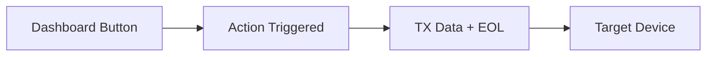
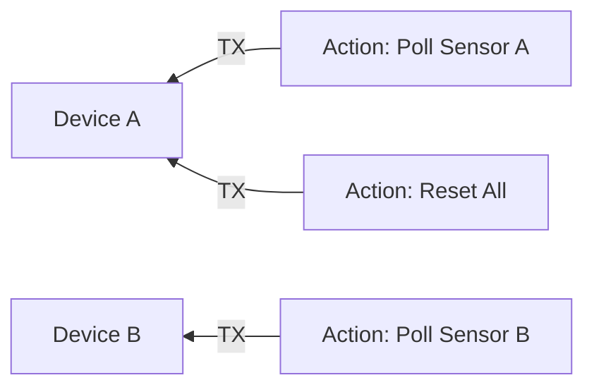

# Actions

## Overview

Actions let you put buttons on the Serial Studio dashboard that send commands back to the connected device. Typical uses include resetting a microcontroller, toggling an output pin, asking for a sensor reading, or sending calibration sequences. Each action is configured in the Project Editor and shows up automatically on the dashboard when you connect.

## How actions work

When you click an action button (or a timer fires), Serial Studio transmits the action's payload (the **Transmit Data** string followed by the configured **End-of-Line Sequence**) to the target device over the active connection. If **Send as Binary** is on, the payload is interpreted as hexadecimal bytes instead of plain text.

## Creating an action

1. Open the Project Editor (toolbar wrench icon).
2. Click **Action** in the Project Editor toolbar (in the Output section).
3. Select the new action in the tree to configure it in the property panel.

## Action properties

### General information

- **Action Title.** The label shown on the dashboard button (for example "Reset Device", "Start Logging").
- **Action Icon.** Pick one from the built-in icon set. The icon appears on both the dashboard button and the flow diagram in the Project Editor.
- **Target Device.** In a multi-source project, pick which connected device receives the command. The dropdown only appears when the project has more than one source; single-source projects send to the only available device.

### Data payload

- **Send as Binary.** When checked, the payload field becomes **Transmit Data (Hex)** and is interpreted as hexadecimal bytes (for example `FF 01 A3`) instead of text.
- **Transmit Data.** The command string or hex bytes to send when the action fires.
  - Text mode example: `RST` or `GET_TEMP`. C-style escape sequences (`\n`, `\r`, `\t`, `\\`) are resolved before transmission.
  - Binary mode example: `FF 01 00 A3`.
- **Text Encoding.** In text mode, the character encoding used to serialize the payload. This option is hidden when **Send as Binary** is enabled.
- **End-of-Line Sequence.** Characters appended after the payload. Disabled in binary mode; append terminator bytes to the hex payload instead.

| Option                  | Bytes sent         |
|-------------------------|--------------------|
| None                    | Nothing appended   |
| New Line (`\n`)         | `0x0A`             |
| Carriage Return (`\r`)  | `0x0D`             |
| CRLF (`\r\n`)           | `0x0D 0x0A`        |

### Execution behavior

- **Auto-execute on connect.** When enabled, the action fires automatically as soon as the device connects. Handy for initialization sequences (for example sending a configuration command or enabling a sensor).

### Timer behavior

Actions can repeat on a timer, which is useful for periodic polling or keep-alive commands.

- **Timer Mode:**

| Mode             | Behavior |
|------------------|----------|
| Off              | Manual trigger only (default). The button sends the command once per click. |
| Auto Start       | Timer starts automatically when the device connects. The command repeats at the configured interval until the device disconnects. |
| Start on Trigger | Timer starts on the first click. The command repeats at the configured interval until stopped. |
| Toggle on Trigger| Each click toggles the repeating timer on or off. |
| Repeat N Times   | Each click sends the command a fixed number of times, waiting the configured interval between each send. |

- **Interval (ms).** The repeat interval in milliseconds. Default is 100 ms. Set it to match your desired polling or command rate (for example 1000 ms for once per second).
- **Repeat Count.** Only used by the **Repeat N Times** mode. The number of times the command is sent on each trigger. Default is 3.

## Multi-source actions

In projects with multiple sources (devices), each action can target a specific one. Use the **Target Device** dropdown in the action properties to pick which device receives the command. The flow diagram in the Project Editor shows a dashed arrow from each action to its target device.

If you don't set a target device, the action defaults to the first source (Device A).

## Dashboard appearance

When the device is connected, action buttons show up on the dashboard alongside your data widgets. Each button has:

- The action **icon** on the left.
- The action **title** as the button label.

Clicking the button sends the configured payload immediately. If a timer mode is active, the button label reflects the timer state.

## Examples

### Simple text command

Send a reset command followed by a newline:

| Property             | Value        |
|----------------------|--------------|
| Action Title         | Reset Device |
| Transmit Data        | `RST`        |
| End-of-Line Sequence | New Line (`\n`) |
| Send as Binary       | Off          |

### Binary initialization sequence

Send a binary configuration packet on connect:

| Property                | Value               |
|-------------------------|---------------------|
| Action Title            | Initialize Sensor   |
| Transmit Data (Hex)     | `AA 01 FF 00 55`    |
| Send as Binary          | On                  |
| Auto-Execute on Connect | On                  |

### Periodic data polling

Request a sensor reading every 500 ms:

| Property             | Value             |
|----------------------|-------------------|
| Action Title         | Poll Temperature  |
| Transmit Data        | `GET_TEMP`        |
| End-of-Line Sequence | CRLF (`\r\n`)     |
| Timer Mode           | Auto Start        |
| Interval (ms)        | 500               |

### Toggle command

Toggle an LED on or off with each click:

| Property             | Value           |
|----------------------|-----------------|
| Action Title         | Toggle LED      |
| Transmit Data        | `LED_TOGGLE`    |
| End-of-Line Sequence | New Line (`\n`) |
| Timer Mode           | Off             |

## Common mistakes

### Action button doesn't appear

**Symptom.** The action is configured in the Project Editor but no button shows up on the dashboard.

**Fix.** Make sure the device is connected. Action buttons only appear on the dashboard while a connection is active.

### Command not received by the device

**Symptom.** The button appears and can be clicked, but the device doesn't respond.

**Fix:**

1. Check the Console view to confirm the data is being sent.
2. Make sure the EOL setting matches what the device firmware expects. Many embedded parsers need `\n` or `\r\n`.
3. If you're in binary mode, make sure the hex string is valid and well-formatted (pairs of hex digits, optionally separated by spaces).
4. In multi-source projects, check that the Target Device is set correctly.

### Timer fires too fast

**Symptom.** The device is overwhelmed with commands or the serial buffer overflows.

**Fix.** Increase the Timer Interval. A value of 100 ms sends 10 commands per second. Reduce this if your device can't keep up. For most polling scenarios, 500 to 2000 ms is enough.

## Tips

- Use **Auto-Execute on Connect** for initialization commands that must run before data collection starts.
- Combine a timed action with a frame parser to implement a request/response protocol: the action sends the request, the parser decodes the response.
- Use clear titles and icons so dashboard buttons are self-explanatory.
- Test actions with the Console view open so you can see the exact bytes being sent.
- For complex multi-step initialization, create multiple actions with **Auto-Execute on Connect** enabled. They fire in the order they appear in the project tree.

## See also

- [Project Editor](Project-Editor.md): full guide to creating and configuring projects.
- [Widget Reference](Widget-Reference.md): all dashboard widget types.
- [Data Sources](Data-Sources.md): configuring device connections.
- [Communication Protocols](Communication-Protocols.md): protocol-specific setup and considerations.
