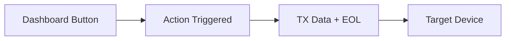
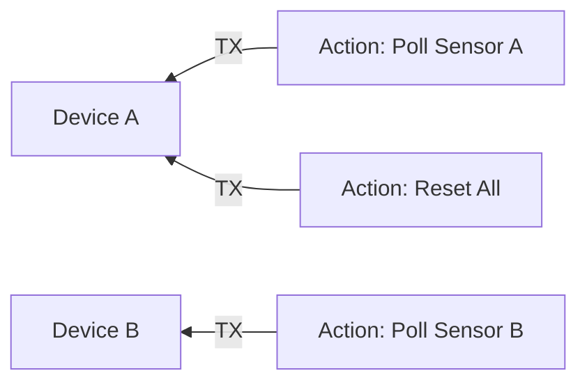

# Actions

## Overview

Actions let you define buttons on the Serial Studio dashboard that send commands back to the connected device. Common uses include resetting a microcontroller, toggling an output pin, requesting a sensor reading, or sending calibration sequences. Each action is configured in the Project Editor and appears automatically on the dashboard when you connect.

## How Actions Work

When the user clicks an action button (or a timer fires), Serial Studio transmits the action's payload — the **TX Data** string followed by the configured **EOL** sequence — to the target device over the active connection. If **Binary** mode is enabled, the payload is interpreted as hexadecimal bytes instead of plain text.

## Creating an Action

1. Open the Project Editor (toolbar wrench icon, or Ctrl+Shift+P / Cmd+Shift+P).
2. Click **Add Action** in the toolbar, or right-click **Actions** in the tree view.
3. Select the new action in the tree to configure it in the property panel.

## Action Properties

### General Information

- **Title** — the label displayed on the dashboard button (e.g., "Reset Device", "Start Logging").
- **Icon** — choose from the built-in icon set. The icon appears on both the dashboard button and the flow diagram in the Project Editor.
- **Target Device** — when working with a multi-source project, select which connected device receives the command. Single-source projects send to the only available device automatically.

### Data Payload

- **Send as Binary** — when checked, the TX Data field is interpreted as hexadecimal bytes (e.g., `FF 01 A3`) rather than ASCII text.
- **Transmit Data** — the command string or hex bytes to send when the action triggers.
  - Text mode example: `RST` or `GET_TEMP`
  - Binary mode example: `FF 01 00 A3`
- **End-of-Line Sequence** — characters appended after the payload:

| Option | Bytes sent |
|--------|-----------|
| None | Nothing appended |
| `\n` (LF) | `0x0A` |
| `\r` (CR) | `0x0D` |
| `\r\n` (CRLF) | `0x0D 0x0A` |

### Execution Behavior

- **Auto-Execute on Connect** — when enabled, the action fires automatically as soon as the device connects. Useful for initialization sequences (e.g., sending a configuration command or enabling a sensor).

### Timer Behavior

Actions can repeat on a timer, which is useful for periodic polling or keep-alive commands.

- **Timer Mode**:

| Mode | Behavior |
|------|----------|
| Off | Manual trigger only (default). The button sends the command once per click. |
| AutoStart | The timer starts automatically when the device connects. The command repeats at the configured interval until the device disconnects. |
| StartOnTrigger | The timer starts on the first click. The command repeats at the configured interval until stopped. |
| ToggleOnTrigger | Each click toggles the repeating timer on or off. |

- **Timer Interval** — the repeat interval in milliseconds. Default is 100 ms. Set this to match the desired polling or command rate (e.g., 1000 ms for once per second).

## Multi-Source Actions

In projects with multiple sources (devices), each action can target a specific device. Use the **Target Device** dropdown in the action properties to select which device receives the command. The flow diagram in the Project Editor shows a dashed arrow from each action to its target device.

If you do not explicitly set a target device, the action defaults to the first source (Device A).

## Dashboard Appearance

When the device is connected, action buttons appear on the dashboard alongside your data widgets. Each button shows:

- The action **icon** on the left.
- The action **title** as the button label.

Clicking a button sends the configured payload immediately. If a timer mode is active, the button label indicates the current timer state.

## Examples

### Simple Text Command

Send a reset command followed by a newline:

| Property | Value |
|----------|-------|
| Title | Reset Device |
| TX Data | `RST` |
| EOL | `\n` |
| Binary | Off |

### Binary Initialization Sequence

Send a binary configuration packet on connect:

| Property | Value |
|----------|-------|
| Title | Initialize Sensor |
| TX Data | `AA 01 FF 00 55` |
| EOL | None |
| Binary | On |
| Auto-Execute | On |

### Periodic Data Polling

Request a sensor reading every 500 ms:

| Property | Value |
|----------|-------|
| Title | Poll Temperature |
| TX Data | `GET_TEMP` |
| EOL | `\r\n` |
| Timer Mode | AutoStart |
| Timer Interval | 500 |

### Toggle Command

Toggle an LED on/off with each click:

| Property | Value |
|----------|-------|
| Title | Toggle LED |
| TX Data | `LED_TOGGLE` |
| EOL | `\n` |
| Timer Mode | Off |

## Common Mistakes

### Action Button Does Not Appear

**Symptom:** The action is configured in the Project Editor but no button appears on the dashboard.

**Fix:** Ensure the device is connected. Action buttons only appear on the dashboard while a connection is active.

### Command Not Received by Device

**Symptom:** The button appears and can be clicked, but the device does not respond.

**Fix:**
1. Check the **Console** view to confirm the data is being sent.
2. Verify the **EOL** setting matches what the device firmware expects (many embedded parsers require `\n` or `\r\n`).
3. If using binary mode, confirm the hex string is valid and correctly formatted (pairs of hex digits, optionally separated by spaces).
4. In multi-source projects, verify the **Target Device** is set to the correct device.

### Timer Fires Too Fast

**Symptom:** The device is overwhelmed with commands or the serial buffer overflows.

**Fix:** Increase the **Timer Interval**. A value of 100 ms sends 10 commands per second — reduce this if your device cannot keep up. For most polling scenarios, 500–2000 ms is sufficient.

## Tips

- Use **Auto-Execute on Connect** for initialization commands that must run before data collection begins.
- Combine a timed action with a frame parser to implement request/response protocols — the action sends the request, and the parser decodes the response.
- Use descriptive titles and icons so that dashboard buttons are self-explanatory.
- Test actions with the Console view open to verify the exact bytes being transmitted.
- For complex multi-step initialization, create multiple actions with **Auto-Execute on Connect** enabled — they fire in the order they appear in the project tree.

## See Also

- [Project Editor](Project-Editor.md) — complete guide to creating and configuring projects.
- [Widget Reference](Widget-Reference.md) — all dashboard widget types.
- [Data Sources](Data-Sources.md) — configuring device connections.
- [Communication Protocols](Communication-Protocols.md) — protocol-specific setup and considerations.
