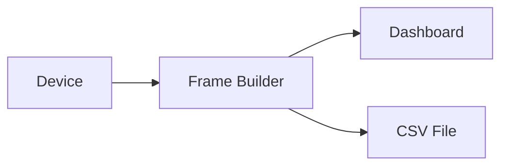

# CSV export and playback

Serial Studio can export incoming telemetry to CSV during a live session and replay saved CSV files through the same data pipeline. This page covers both workflows and the file format. For high-rate binary logging with per-channel sample rates and channel metadata, see [MDF4 Export & Playback](MDF4.md). Serial Studio Pro supports both formats and you can run them side by side.

## Export and playback pipeline

The diagrams below show how CSV export runs on a background thread during live data, and how CSV playback feeds recorded data back through the same pipeline.



> Export runs in the background, writes in batches, and never blocks the dashboard.


## CSV export

### Turning export on

CSV export is toggled in the Setup panel of the main window. Turn on the **CSV Export** switch before or during a live connection. Once it's on, Serial Studio writes every incoming frame to a CSV file on a background thread, so dashboard performance isn't affected.

### File location

Exported CSV files land under your Documents directory in a structured hierarchy:

```
Documents/Serial Studio/CSV/<Project Name>/<Year>/<Month>/<Day>/<Time>.csv
```

For example, a session started at 3:30:05 PM on March 17, 2026, for a project named "Weather Station" would produce:

```
Documents/Serial Studio/CSV/Weather Station/2026/03/17/15-30-05.csv
```

### File format

The CSV file contains a header row followed by one row per received frame.

**Header row:**

```
RX Date/Time,GroupName/DatasetName,GroupName/DatasetName,...
```

The first column is elapsed time in seconds since the session started, with nanosecond precision (for example `0.000000000`, `0.016384512`). The remaining columns correspond to each dataset defined in the project, ordered by unique ID. Header labels are formed as `GroupName/DatasetName` so you can trace each column back to the project structure.

**Data rows.** Each row is one complete frame. Cells hold the numeric or string values of each dataset at that point in time.

### File lifecycle

- The file is created on the first frame received after export is turned on.
- The file auto-closes when the device disconnects or when export is turned off.
- If you disconnect and reconnect during the same session, a new file is created with a new timestamp.

### Background writing

CSV export runs in the background and flushes to disk in batches. So even on slow storage (spinning disks, network shares, SD cards), CSV export never stalls the dashboard, drops frames, or pauses the pipeline.

## CSV playback

### Opening a CSV file

To replay a recorded CSV file:

1. Click **Open CSV** in the toolbar (or use Ctrl+O / Cmd+O).
2. Pick the CSV file in the file dialog.
3. The CSV Player dialog appears.

### Timestamp handling

When a CSV file opens, Serial Studio looks at the first column to figure out the timestamp format:

- **Decimal seconds** (for example `0.0`, `1.5`, `3.016`): used directly as elapsed time. This is the format Serial Studio's own export produces.
- **Date/time strings** (for example `2026-03-17 15:30:05`): parsed into absolute timestamps and converted to elapsed offsets.
- **Unrecognizable format:** Serial Studio asks you to specify a fixed interval between rows (in milliseconds). Useful for CSV files from other tools that don't include timestamps.

### Player controls

The CSV Player has these controls:

| Control          | Action                           | Shortcut       |
|------------------|----------------------------------|----------------|
| Play / Pause     | Start or pause playback          | Space          |
| Previous frame   | Step back one frame              | Left Arrow     |
| Next frame       | Step forward one frame           | Right Arrow    |
| Progress slider  | Seek to any position in the file | Drag or click  |

The current timestamp shows next to the slider as `HH:MM:SS.mmm`.

### How playback works

During playback, the CSV Player feeds each row through the same data pipeline as a live connection: Frame Builder, then Dashboard. That means all widgets, plots, and gauges render exactly as they would with a live device. The player respects the original timing between frames, so playback speed matches the original recording rate.

### Multi-source CSV files

For projects with multiple data sources, the CSV Player maps columns back to their respective source IDs. Each column is associated with a source based on the dataset's unique ID recorded in the header. The player reconstructs per-source frames and injects them into the pipeline at the right routing.

### Speed control

Playback runs at real-time speed by default. The player uses the timestamp differences between consecutive rows to schedule frame delivery, so the original data rate is preserved.

## Analyzing exported data

CSV opens in every common analysis tool:

- Excel / LibreOffice Calc: open directly.
- Python: `import pandas; df = pandas.read_csv('file.csv')`.
- MATLAB: `data = readtable('file.csv');`.
- R: `data <- read.csv('file.csv')`.

For per-channel sample rates, channel-level units and metadata, or smaller files at high data rates, use MDF4 instead — see [MDF4 Export & Playback](MDF4.md).

## See also

- [MDF4 Export & Playback](MDF4.md): binary logging with per-channel sample rates and channel metadata (Pro).
- [Session Database](Session-Database.md): SQLite-backed project archive with built-in replay (Pro).
- [Getting Started](Getting-Started.md): initial setup and first connection.
- [Operation Modes](Operation-Modes.md): Quick Plot vs Project File mode.
- [Project Editor](Project-Editor.md): define datasets and dashboard layout.
- [Data Flow](Data-Flow.md): how data moves through the pipeline.
