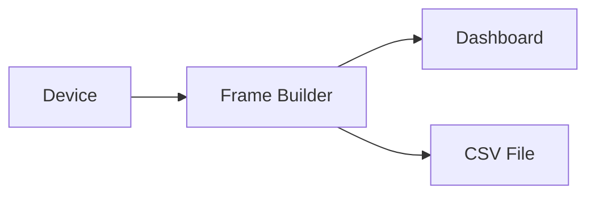

# CSV export and playback

Serial Studio can export incoming telemetry to CSV during a live session and replay saved CSV files through the same data pipeline. This page covers both workflows and the file format. For high-rate binary logging with per-channel sample rates and channel metadata, see [MDF4 Export & Playback](MDF4.md). Serial Studio Pro supports both formats and you can run them side by side.

## Export and playback pipeline

The diagrams below show how CSV export runs on a background thread during live data, and how CSV playback feeds recorded data back through the same pipeline.


```mermaid
flowchart LR
    A["Device"] --> B["Frame Builder"]
    B --> C["Dashboard"]
    B --> D["CSV File"]
```

> Export runs in the background, writes in batches, and never blocks the dashboard.


```mermaid
flowchart LR
    A["CSV File"] --> B["CSV Player"]
    B --> C["Frame Builder"]
    C --> D["Dashboard"]
```

## CSV export

### Turning export on

CSV export is toggled in the Setup panel of the main window, under **Data Export**. Turn on the **CSV Spreadsheet** switch before or during a live connection. Once it's on, Serial Studio writes every incoming frame to a CSV file on a background thread, so dashboard performance isn't affected. The switch is disabled in Console Only mode (no project/frame structure to export); switch to Quick Plot or Project File mode first.

**Quick Plot doubles every channel.** Quick Plot builds both a Data Grid group and a Multi-Plot group from the same channels, and both groups are exported, so a three-channel Quick Plot session produces six value columns in the CSV, not three — one pair of duplicate columns per channel.

### File location

Exported CSV files land under your workspace folder (Documents/Serial Studio by default; configurable in Settings) in a structured hierarchy:

```
<Workspace>/CSV/<Project Name>/<YYYY-MM-DD_HH-MM-SS>.csv
```

For example, a session started at 3:30:05 PM on March 17, 2026, for a project named "Weather Station" would produce:

```
Documents/Serial Studio/CSV/Weather Station/2026-03-17_15-30-05.csv
```

### Automation

Export and playback can be driven without the GUI. The [API](API-Reference.md) exposes `csvExport.getStatus`, `csvExport.setEnabled`, and `csvExport.close` for export, plus the `csvPlayer.*` family (`open`, `setPaused`, `setProgress`, `getStatus`, and frame stepping via `csvPlayer.step`) for playback. The `--csv-export` flag in the [Command-Line Interface](Command-Line-Interface.md) turns export on at startup (commercial builds only).

### File format

The CSV file contains a header row followed by one row per received frame.

**Header row:**

```
Elapsed (s),GroupName/DatasetName,GroupName/DatasetName,...
```

The first column, labeled `Elapsed (s)`, is elapsed time in seconds since the session started, with nanosecond precision (for example `0.000000000`, `0.016384512`). The remaining columns correspond to each dataset defined in the project, ordered by unique ID. Header labels are formed as `GroupName/DatasetName`, prefixed with `SourceName/` whenever the owning source has a non-empty title — including a single-source project, if its source is titled — so you can trace each column back to the project structure.

The file opens with a UTF-8 byte-order mark. Most tools handle this transparently; pandas needs `encoding="utf-8-sig"` to read the file without leaving a `` in the first header cell. Any cell whose text starts with `=`, `+`, `-`, `@`, a tab, or a carriage return is prefixed with an apostrophe before being written (unless the cell is purely numeric), which stops spreadsheet software from evaluating it as a formula.

**Data rows.** For a single-source project, each row is one complete frame. For a multi-source project, rows are sparse: one row per distinct sample instant, with a source's columns left empty on any row where that source didn't produce a sample at that instant. Cells hold the numeric or string values of each dataset at that point in time.

### Row interval

CSV export writes rows in one of two modes, set by **Row Interval (ms)** in the Preferences dialog's **Export** tab: `0` (the default) writes one row per received frame, on the raw data timing. A nonzero value N instead writes one row every N milliseconds, each row a snapshot of the latest value of every dataset at that instant; the interval applies live, so changing it mid-export takes effect on the next snapshot.

### File lifecycle

- Export opens the file on the first frame received after export is turned on.
- Disconnecting the device, turning export off, or pausing the connection (the dashboard Pause control) all close the file, the same as each other.
- Reconnecting, resuming, or re-enabling export during the same session opens a new file with a new timestamp.

### Background writing

CSV export runs in the background and flushes to disk in batches. So even on slow storage (spinning disks, network shares, SD cards), CSV export never stalls the dashboard, drops frames, or pauses the pipeline.

## CSV playback

### Opening a CSV file

To replay a recorded CSV file:

1. Click **Open CSV** in the toolbar (or use Ctrl+O / Cmd+O).
2. Pick the CSV file in the file dialog.
3. The CSV Player dialog appears.

### Timestamp handling

When a CSV file opens, Serial Studio looks at the first column to figure out the timestamp format:

- **Numeric, with a recognized unit in the header:** a bracketed unit (`time(ms)`, `t [us]`) or a `_unit` suffix (`time_ms`) on the header cell selects the scale — seconds, milliseconds (`ms`), microseconds (`us`), or nanoseconds (`ns`), by name or common abbreviation. This is the format Serial Studio's own export produces (`Elapsed (s)`).
- **Numeric, with no recognizable unit in the header:** Serial Studio shows a **Timestamp Units** prompt asking whether the column is Seconds, Milliseconds, or Microseconds; seconds is preselected.
- **Date/time strings** (for example `2026/03/17 15:30:05`): parsed into absolute timestamps and converted to elapsed offsets.
- **Unrecognizable format:** Serial Studio prompts you to either pick an existing column to use as the timestamp, or set a fixed interval between rows (in milliseconds) — useful for CSV files from tools that don't record timestamps at all.

### Player controls

The CSV Player has these controls:

| Control          | Action                           | Shortcut       |
|------------------|----------------------------------|----------------|
| Play / Pause     | Start or pause playback          | Space          |
| Previous frame   | Step back one frame              | Left Arrow     |
| Next frame       | Step forward one frame           | Right Arrow    |
| Progress slider  | Seek to any position in the file | Drag or click  |

The current timestamp shows next to the slider as `HH:MM:SS.mmm`.

### How playback works

During playback, the CSV Player feeds each row through the same data pipeline as a live connection: Frame Builder, then Dashboard. That means all widgets, plots, and gauges render exactly as they would with a live device. Original per-frame timing carries through, so playback speed matches the original recording rate.

### Multi-source CSV files

For projects with multiple data sources, the CSV Player maps columns back to their respective source IDs. The header carries labels only, not machine-readable IDs: the mapping is positional, built from the currently loaded project's export schema in unique-ID order, and matched against the file's data columns in that same order. This means the project loaded during playback must be the same one that produced the file (or one with an identical dataset/unique-ID layout) — the player has no way to recover source or dataset identity from header text alone. Reconstructed per-source frames go back into the pipeline at the right routing.

### Speed control

Playback runs at real-time speed by default. Timestamp differences between consecutive rows schedule frame delivery, so the original data rate is preserved.

## Analyzing exported data

CSV opens in every common analysis tool:

- Excel / LibreOffice Calc: open directly.
- Python: `import pandas; df = pandas.read_csv('file.csv')`.
- MATLAB: `data = readtable('file.csv');`.
- R: `data <- read.csv('file.csv')`.

For per-channel sample rates, channel-level units and metadata, or smaller files at high data rates, use MDF4 instead — see [MDF4 Export & Playback](MDF4.md).

## See also

- [MDF4 Export & Playback](MDF4.md): binary logging with per-channel sample rates and channel metadata (Pro).
- [Historian](Session-Database.md): SQLite-backed project archive with built-in replay (Pro).
- [Getting Started](Getting-Started.md): initial setup and first connection.
- [Operation Modes](Operation-Modes.md): Quick Plot vs Project File mode.
- [Project Editor](Project-Editor.md): define datasets and dashboard layout.
- [Data Flow](Data-Flow.md): how data moves through the pipeline.
