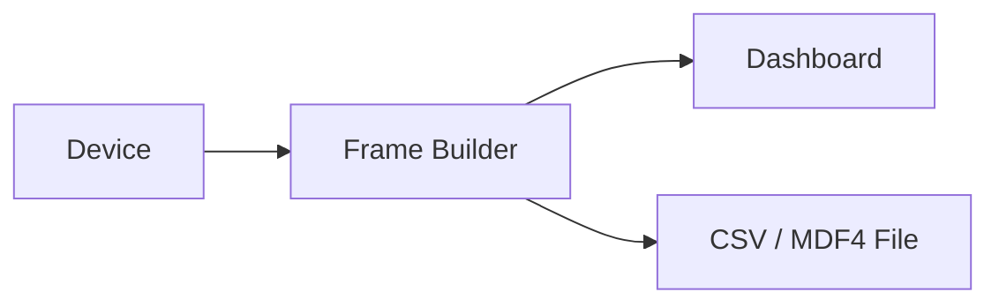

# CSV Import and Export

Serial Studio can export incoming telemetry data to CSV files during a live session and replay previously saved CSV files through the full data pipeline. This page covers both workflows, the file format, and the MDF4 alternative available in Pro.

## Export and Playback Pipeline

The following diagram shows how CSV export runs on a background thread during live data, and how CSV playback feeds recorded data back through the same pipeline.



> **Export:** 8192 queue capacity | 1024 frame flush threshold | 1 s timer | zero dashboard impact


---

## CSV Export

### Enabling Export

CSV export is toggled in the **Setup Panel** of the main window. Enable the **CSV Export** switch before or during a live connection. Once enabled, Serial Studio writes every incoming frame to a CSV file on a background thread, so dashboard performance is unaffected.

### File Location

Exported CSV files are saved under the user's Documents directory in a structured hierarchy:

```
Documents/Serial Studio/CSV/<Project Name>/<Year>/<Month>/<Day>/<Time>.csv
```

For example, a session started at 3:30:05 PM on March 17, 2026, for a project named "Weather Station" would produce:

```
Documents/Serial Studio/CSV/Weather Station/2026/03/17/15-30-05.csv
```

### File Format

The CSV file contains a header row followed by one row per received frame.

**Header row:**

```
RX Date/Time,GroupName/DatasetName,GroupName/DatasetName,...
```

The first column is the elapsed time in seconds since the session started, with nanosecond precision (e.g., `0.000000000`, `0.016384512`). The remaining columns correspond to each dataset defined in the project, ordered by their unique ID. The header labels are formed as `GroupName/DatasetName` so you can trace each column back to the project structure.

**Data rows:**

Each row represents one complete frame. Cells contain the numeric or string values of each dataset at that point in time.

### File Lifecycle

- The file is created on the first frame received after export is enabled.
- The file auto-closes when the device disconnects or when export is disabled.
- If you disconnect and reconnect during the same session, a new file is created with a new timestamp.

### Background Thread

The `CSV::ExportWorker` runs on a dedicated background thread. Frames are enqueued from the main thread in a lock-free manner and written to disk in batches. This design ensures that disk I/O latency never blocks the dashboard or data pipeline.

---

## CSV Playback

### Opening a CSV File

To replay a previously recorded CSV file:

1. Click the **Open CSV** button in the toolbar (or use the keyboard shortcut Ctrl+O / Cmd+O).
2. Select the CSV file in the file dialog.
3. The CSV Player dialog appears.

### Timestamp Handling

When a CSV file is opened, Serial Studio examines the first column to determine the timestamp format:

- **Decimal seconds** (e.g., `0.0`, `1.5`, `3.016`): Used directly as elapsed time. This is the format Serial Studio's own export produces.
- **Date/time strings** (e.g., `2026-03-17 15:30:05`): Parsed into absolute timestamps and converted to elapsed offsets.
- **No recognizable format**: Serial Studio prompts you to specify a fixed interval between rows (in milliseconds). This is useful for CSV files generated by other tools that lack timestamps.

### Player Controls

The CSV Player provides the following controls:

| Control | Action | Shortcut |
|---------|--------|----------|
| Play / Pause | Start or pause playback | Space |
| Previous Frame | Step back one frame | Left Arrow |
| Next Frame | Step forward one frame | Right Arrow |
| Progress Slider | Seek to any position in the file | Drag or click |

The current timestamp is displayed next to the slider, formatted as `HH:MM:SS.mmm`.

### How Playback Works

During playback, the CSV Player feeds each row through the same data pipeline used for live connections: Frame Builder, then Dashboard. This means all widgets, plots, and gauges render exactly as they would with a live device. The player respects the original timing between frames, so playback speed matches the original recording rate.

### Multi-Source CSV Files

For projects with multiple data sources, the CSV Player maps columns back to their respective source IDs. Each column is associated with a source based on the dataset's unique ID recorded in the header. The player reconstructs per-source frames and injects them into the pipeline at the correct source routing.

### Speed Control

Playback runs at real-time speed by default. The player uses the timestamp differences between consecutive rows to schedule frame delivery, preserving the original data rate.

---

## MDF4 Export and Playback (Pro)

Serial Studio Pro can also export and replay MDF4 (Measurement Data Format version 4) files, an ASAM standard for storing measurement data in a compact binary format.

### When to Use MDF4 vs. CSV

| Aspect | CSV | MDF4 (Pro) |
|--------|-----|------------|
| File size | Larger (text-based) | Smaller (binary, compressed) |
| Write speed | Adequate for most rates | Better for high-frequency data |
| Compatibility | Universal (Excel, Python, MATLAB, R) | Specialized (CANape, DIAdem, asammdf) |
| Metadata | Column headers only | Rich: channel names, units, conversions |
| Best for | General analysis, sharing | Automotive, industrial, high-rate logging |

### Analyzing Exported Data

**CSV files:**

- Excel / LibreOffice Calc: Open directly.
- Python: `import pandas; df = pandas.read_csv('file.csv')`
- MATLAB: `data = readtable('file.csv');`
- R: `data <- read.csv('file.csv')`

**MDF4 files (Pro):**

- Vector CANape: Professional automotive analysis.
- NI DIAdem: Industrial data management.
- MATLAB: Vehicle Network Toolbox.
- Python: `from asammdf import MDF; mdf = MDF('file.mf4')`

---

## See Also

- [Getting Started](Getting-Started.md) — Initial setup and first connection
- [Operation Modes](Operation-Modes.md) — Quick Plot vs. Project File mode
- [Project Editor](Project-Editor.md) — Define datasets and dashboard layout
- [Data Flow](Data-Flow.md) — How data moves through the pipeline
- [Pro vs Free Features](Pro-vs-Free.md) — MDF4 export is a Pro feature
