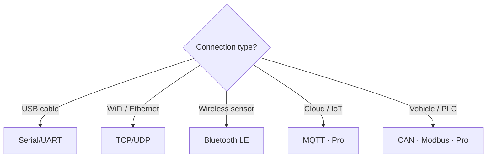

# Communication protocols

Serial Studio supports 10 communication protocols across wired serial links, wireless radios, network sockets, industrial buses, and local inter-process channels. This page describes each one, covers when to pick it, and highlights the configuration parameters and platform details that matter in practice.

## Protocol landscape

The diagram below maps all supported protocols by throughput range and license tier.

## Protocol summary

| Protocol           | License | Medium                  | Typical throughput         | Primary use case                       |
|--------------------|---------|-------------------------|----------------------------|----------------------------------------|
| Serial/UART        | Free    | USB / RS-232 / RS-485   | 110 bps to 1 Mbps+         | Microcontrollers, embedded dev         |
| TCP/UDP network    | Free    | Ethernet / WiFi         | Network-dependent          | WiFi-enabled boards, remote telemetry  |
| Bluetooth LE       | Free    | 2.4 GHz radio           | ~1 Mbps                    | Battery-powered wireless sensors       |
| MQTT               | Pro     | Internet / LAN          | Network-dependent          | IoT cloud, distributed systems         |
| Modbus             | Pro     | RS-485 / Ethernet       | 9600 bps to network speed  | PLCs, SCADA, industrial equipment      |
| CAN Bus            | Pro     | Twisted pair            | Up to 8 Mbps (CAN FD)      | Automotive, industrial machinery       |
| Audio input        | Pro     | Analog audio            | Up to 48 kHz sample rate   | Sound analysis, vibration monitoring   |
| Raw USB            | Pro     | USB cable               | Up to 480 Mbps (USB 2.0)   | Custom firmware, bulk/iso endpoints    |
| HID                | Pro     | USB cable               | Up to 64 KB/s              | Gamepads, custom HID sensors           |
| Process I/O        | Pro     | Local IPC               | OS-dependent               | Scripts, simulators, named pipes       |

---

## Free protocols

### Serial/UART

Serial/UART is the most common way to connect microcontrollers to a computer. It covers USB-to-serial adapters (CH340, FTDI, CP210x, PL2303), native hardware UARTs, and RS-232/RS-485 transceivers.

**When to use it:**

- Arduino, ESP32, STM32, or any board with a USB-serial bridge.
- Direct hardware UART wiring between two devices.
- RS-232 lab instruments and RS-485 industrial sensors.
- Quick prototyping where simplicity matters most.

**Key configuration parameters:**

- **Baud rate.** Has to match the device. Common values: 9600, 115200, 921600. Serial Studio supports custom rates up to 1 Mbps and beyond.
- **Data bits.** 5, 6, 7, or 8 (8 is standard for nearly all modern devices).
- **Parity.** None, Even, Odd, Space, or Mark. Most devices use None.
- **Stop bits.** 1, 1.5, or 2. Almost always 1.
- **Flow control.** None, RTS/CTS (hardware), or XON/XOFF (software). Use None unless your device needs it.
- **DTR signal.** Some boards (notably Arduino) use DTR to trigger a reset on connect. Enable or disable based on whether you want auto-reset.
- **Auto reconnect.** Reconnects automatically if the device is unplugged and replugged.

**Platform considerations:**

- **Linux:** The user has to belong to the `dialout` (or `uucp`) group to access `/dev/ttyUSBx` and `/dev/ttyACMx` without root.
- **Windows:** CH340 and PL2303 adapters may need a manually installed driver. FTDI and CP210x drivers ship with Windows 10+.
- **macOS:** Most USB-serial adapters work out of the box on macOS 11+. Older CP210x chips may need a signed kext or VCP driver.

---

### TCP/UDP network

The Network driver connects to devices over TCP or UDP sockets. It's the natural fit for WiFi-enabled microcontrollers (ESP32, ESP8266), Ethernet-connected instruments, and remote data acquisition systems.

**When to use it:**

- ESP32/ESP8266 sending telemetry over WiFi.
- Ethernet-connected lab instruments or PLCs.
- Receiving multicast or broadcast sensor data on a LAN.
- Remote monitoring where the device and computer aren't in the same place.

**TCP vs UDP:**

| Property            | TCP                                | UDP                              |
|---------------------|------------------------------------|----------------------------------|
| Delivery guarantee  | Yes (retransmits lost segments)    | No                               |
| Connection model    | Connection-oriented (handshake)    | Connectionless (fire-and-forget) |
| Ordering            | Guaranteed in-order                | No ordering guarantee            |
| Latency             | Slightly higher                    | Lower                            |
| Best for            | Reliable streams, file-like data   | Low-latency datagrams, multicast |

**Key configuration parameters:**

- **Socket type.** TCP or UDP.
- **Remote address.** IP address or hostname of the device. Default: `127.0.0.1`.
- **TCP port.** Remote port for TCP connections. Default: 23.
- **UDP remote port.** Port the device is listening on or sending from. Default: 53.
- **UDP local port.** Port Serial Studio binds to for receiving. Set to 0 for automatic assignment.
- **UDP multicast.** Join a multicast group specified by the remote address.

**Platform considerations:**

- Firewall rules on any OS may block incoming UDP datagrams or outgoing TCP connections. Allow Serial Studio through if connections fail.
- On macOS, the first network connection may trigger a system permission dialog.
- DNS resolution runs asynchronously. A spinner appears while the hostname is looked up.

---

### Bluetooth Low Energy

The BLE driver talks to Bluetooth Low Energy peripherals via GATT. It auto-discovers advertising devices, enumerates their services and characteristics, and streams notification data into Serial Studio's pipeline.

**When to use it:**

- Battery-powered wireless sensors (temperature, humidity, IMU, heart rate).
- Wearables and fitness trackers.
- BLE modules like HM-10, nRF52, or ESP32 BLE.
- Any scenario where wiring isn't practical and low power matters.

**Key configuration parameters:**

- **Device.** Selected from the auto-discovered list. Scanning starts automatically when BLE is chosen.
- **Service.** If the device exposes multiple GATT services, pick the one carrying your data.
- **Characteristic.** The specific characteristic that sends notifications or indications with your telemetry payload.

**How discovery works.** Serial Studio uses a shared static discovery agent. All BLE driver instances share the same device list, so scanning happens once no matter how many sources reference BLE. The device list is append-only during a scan, and device indices stay stable, so combobox selections aren't disrupted by new discoveries.

**Platform considerations:**

- **Windows:** Needs Windows 10 version 1803 or later with a Bluetooth 4.0+ adapter.
- **macOS:** Needs macOS 11+ and Bluetooth entitlement. The system may prompt for Bluetooth permission.
- **Linux:** Needs BlueZ 5.44+ and a Bluetooth 4.0+ adapter. The user may need to be in the `bluetooth` group. Some distros require `bluetoothd` to be running.
- **All platforms:** The BLE device must be advertising and not already connected to another host. Move it closer if it doesn't show up in the scan.

---

## Pro protocols

These protocols need a Serial Studio Pro license.

### MQTT

MQTT (Message Queuing Telemetry Transport) is a lightweight publish/subscribe messaging protocol built for constrained devices and unreliable networks. Serial Studio Pro can act as an MQTT subscriber (receiving telemetry from a broker) or as a publisher (forwarding received frame data to a broker).

**When to use it:**

- Cloud-connected IoT devices publishing to AWS IoT, Azure IoT Hub, or a self-hosted Mosquitto broker.
- Distributed sensor networks where multiple subscribers need the same data.
- Remote monitoring over the internet without direct device access.
- Bridging Serial Studio data to other MQTT-aware applications.

**Key configuration parameters:**

- **Hostname.** Broker address. Default: `127.0.0.1`.
- **Port.** Broker port. Default: 1883 (plaintext) or 8883 (TLS).
- **Client ID.** Auto-generated 16-character random string. Regenerate via the button.
- **Username / password.** Broker authentication.
- **MQTT version.** 3.1, 3.1.1, or 5.0.
- **Mode.** Publisher or Subscriber.
- **Topic filter.** Topic to subscribe to or publish on. Supports MQTT wildcards (`+` single level, `#` multi-level).
- **QoS.** 0 (at most once), 1 (at least once), or 2 (exactly once) for the will message.
- **TLS/SSL.** Optional encryption with configurable protocol version, peer verification mode, and CA certificates.
- **Will message.** Last Will and Testament sent by the broker if the client disconnects unexpectedly.
- **Keep alive.** Interval in seconds for PING packets. Supports automatic keep-alive.

**Platform considerations:**

- Needs network or internet access to the broker.
- TLS connections need valid CA certificates. Load system certificates or point to a custom CA bundle.
- MQTT 5.0 extended authentication is supported when the broker requires it.

For detailed setup, see [MQTT Integration](MQTT-Integration.md).

---

### Modbus

Modbus is an industrial communication protocol for reading and writing registers on PLCs, SCADA devices, and other industrial equipment. Serial Studio Pro supports both Modbus RTU (over RS-485 serial) and Modbus TCP (over Ethernet/IP).

**When to use it:**

- Reading holding registers, input registers, coils, or discrete inputs from a PLC.
- Industrial automation monitoring and factory floor dashboards.
- Building management systems (HVAC, power meters).
- Any Modbus-enabled equipment with a documented register map.

**Key configuration parameters:**

- **Protocol.** Modbus RTU or Modbus TCP.
- **Slave address.** Device address on the bus (1 to 247).
- **Register groups.** One or more groups, each specifying a register type (coil, discrete input, input register, holding register), start address, and count.
- **Poll interval.** How often to query registers, in milliseconds.
- RTU-specific: serial port, baud rate, data bits, parity, stop bits.
- TCP-specific: host address, port (default 502).

**Register types:**

| Type              | Code | Access      | Size    |
|-------------------|------|-------------|---------|
| Coil              | 01   | Read/Write  | 1 bit   |
| Discrete input    | 02   | Read-only   | 1 bit   |
| Holding register  | 03   | Read/Write  | 16 bits |
| Input register    | 04   | Read-only   | 16 bits |

**Platform considerations:**

- Modbus RTU needs an RS-485-to-USB adapter. Make sure A/B terminal polarity is correct and use 120-ohm termination resistors at each end of the bus.
- Modbus TCP runs over standard Ethernet. No special hardware beyond network access.
- The serial port list is refreshed automatically. On Linux, make sure the user has permission to access `/dev/ttyUSBx`.

---

### CAN Bus

Controller Area Network (CAN) is a robust vehicle and industrial bus standard. Serial Studio Pro reads and writes CAN frames through the host platform's CAN interface layer.

**When to use it:**

- Automotive diagnostics and OBD-II data logging.
- Racing or electric vehicle telemetry.
- Industrial machinery with CAN networks.
- CAN FD (Flexible Data-rate) applications needing up to 64 bytes per frame.

**Key configuration parameters:**

- **Plugin.** The CAN backend. Platform-dependent:
  - Linux: `socketcan`.
  - Windows: `peakcan`, `vectorcan`, `systeccan`.
  - macOS: limited. Needs third-party drivers.
- **Interface.** The CAN interface name (for example `can0`, `PCAN_USBBUS1`).
- **Bitrate.** Has to match the network exactly. Common: 125, 250, 500 kbps, 1 Mbps.
- **CAN FD.** Enable for Flexible Data-rate frames (29-bit identifiers, up to 64 bytes payload).

**CAN frame format emitted by the driver.** The driver converts each received CAN frame into a byte array: `[ID_high, ID_low, DLC, data_0, data_1, ...]`. This array is passed to Serial Studio's frame parser for decoding.

**Platform considerations:**

- **Linux:** SocketCAN is a kernel-level CAN interface. Configure with `ip link set can0 type can bitrate 500000 && ip link set up can0`. No extra drivers needed for most USB-CAN adapters.
- **Windows:** Needs vendor-specific drivers (PEAK, Vector, Systec). Install the driver before connecting the adapter.
- **macOS:** Native CAN support is limited. Third-party CAN adapters with their own drivers may work through the Qt CAN bus plugin system, but support isn't guaranteed.

---

### Audio input

The Audio Input driver captures raw PCM audio from the computer's sound input (microphone, line-in, audio interface) and feeds it into Serial Studio's data pipeline. It uses the miniaudio library for cross-platform low-latency audio capture.

**When to use it:**

- Audio spectrum analysis and FFT visualization.
- Vibration monitoring via audio-coupled accelerometers or piezo sensors.
- Acoustic measurements and sound-level monitoring.
- Analog signal visualization within the audio frequency range (roughly 20 Hz to 24 kHz).

**Key configuration parameters:**

- **Input device.** Pick from enumerated audio capture devices.
- **Sample rate.** Depends on the device. Common: 44100, 48000 Hz.
- **Sample format.** Bit depth (for example 16-bit integer, 32-bit float).
- **Channel configuration.** Mono or stereo.

The driver also exposes output device settings for audio passthrough, though the primary use case is capture.

**Platform considerations:**

- **macOS:** May need Microphone permission in System Settings > Privacy & Security.
- **Windows:** May need "Stereo Mix" enabled or a specific input in Sound Settings.
- **Linux:** Works with ALSA and PulseAudio. Use `arecord -l` to list capture devices.
- For sensor measurement, prefer line-in over microphone input to avoid automatic gain control.

---

### Raw USB

The Raw USB driver gives direct access to USB device endpoints via libusb, bypassing operating system serial and HID drivers. It supports bulk, control, and isochronous transfer modes.

**When to use it:**

- Custom USB firmware with bulk endpoints (STM32, TinyUSB, PIC, and so on).
- High-bandwidth sensors that exceed UART throughput.
- Devices that need vendor-specific USB control transfers.
- Isochronous USB devices for fixed-rate streaming (audio endpoints, custom DAQ).

**Transfer modes:**

| Mode              | Description |
|-------------------|-------------|
| Bulk stream       | Synchronous bulk IN/OUT transfers. Default and most common. |
| Advanced control  | Bulk transfers plus vendor-specific control transfers. Requires user confirmation. |
| Isochronous       | Asynchronous isochronous transfers for time-sensitive fixed-rate streams. |

**Key configuration parameters:**

- **Device.** Pick from the enumerated list (VID:PID and product string).
- **IN endpoint.** The endpoint to read data from.
- **OUT endpoint.** The endpoint to write data to.
- **Transfer mode.** Bulk Stream, Advanced Control, or Isochronous.
- **ISO packet size.** Packet size for isochronous transfers (only relevant in Isochronous mode).

**Platform considerations:**

- **Linux:** Needs `udev` rules granting the user access to the USB device, or root privileges. Hotplug detection is supported natively.
- **macOS:** The system may hold a kernel driver claim on some devices. libusb will try to detach it. Hotplug is supported.
- **Windows:** Needs a WinUSB or libusb-compatible driver installed for the target device (for example via Zadig). Hotplug is supported on Windows 8+.
- A dedicated event thread runs `libusb_handle_events_timeout()` continuously to service hotplug callbacks and isochronous completions.

---

### HID

The HID driver accesses Human Interface Devices via the hidapi library. It reads interrupt reports from gamepads, joysticks, custom USB HID firmware, and HID-class sensors without custom OS drivers.

**When to use it:**

- Gamepad or joystick telemetry for robotics dashboards.
- Custom HID firmware on Arduino (HID library), STM32, or nRF52.
- Sensors and measurement instruments that enumerate as USB HID.
- Any USB device where you want driver-free cross-platform access.

**Key configuration parameters:**

- **Device.** Pick from the auto-enumerated list, shown as `VID:PID, Product Name`.
- **Usage Page / Usage.** Shown after device selection for reference (identifies the HID function).

**How enumeration works.** The driver re-enumerates all HID devices every 2 seconds via a QTimer. The device list updates automatically when devices are plugged in or removed.

**Platform considerations:**

- **Windows:** Uses WinAPI (`hid.dll`). Most HID devices work without extra drivers.
- **macOS:** Uses IOHIDManager / IOKit. No extra drivers needed.
- **Linux:** Uses the `hidraw` kernel interface. The user may need `udev` rules to access `/dev/hidrawX` without root. The hidraw backend avoids conflicts with the libusb-based Raw USB driver.
- HID reports are 65 bytes (1 report ID byte + 64 data bytes). The driver forwards the full report to the data pipeline.

---

### Process I/O

The Process I/O driver captures data from child processes or named pipes, so Serial Studio can visualize output from scripts, simulators, and external programs.

**When to use it:**

- Python, Node.js, or shell scripts that aggregate sensor data and print CSV to stdout.
- Physics engines or flight simulators emitting telemetry.
- Protocol bridge programs translating proprietary formats to Serial Studio frames.
- Testing dashboards with synthetic data generators.
- Reading from a named pipe (FIFO) written by an external app.

**Modes:**

| Mode       | Description |
|------------|-------------|
| Launch     | Serial Studio spawns the process, reads its merged stdout+stderr, and can write to its stdin. |
| Named pipe | Serial Studio opens an existing named pipe or FIFO and reads from it. The external process manages the pipe. |

**Launch mode parameters:**

- **Executable.** Path to the program. Supports browsing via file dialog. Serial Studio searches standard PATH locations plus platform-specific extras.
- **Arguments.** Command-line arguments passed to the process.
- **Working directory.** The directory the process runs in. Supports browsing.

**Named pipe parameters:**

- **Pipe path.** Filesystem path to the named pipe or FIFO. Supports browsing.

**Platform considerations:**

- **Linux and macOS:** Named pipes are created with `mkfifo`. Make sure the pipe exists before connecting.
- **Windows:** Named pipes use the `\\.\pipe\PipeName` convention.
- If the child process crashes or exits unexpectedly, Serial Studio shows a warning and triggers a disconnect.
- The process's stdout and stderr are merged into a single stream. Make sure your script writes only data frames to stdout if you want clean parsing.

---

## Picking the right protocol

**By situation:**

| Situation                                  | Recommended protocol   |
|--------------------------------------------|------------------------|
| Microcontroller connected via USB cable    | Serial/UART            |
| Device on the same WiFi or Ethernet network| TCP/UDP Network        |
| Battery-powered wireless sensor nearby     | Bluetooth LE           |
| Device publishing to a cloud MQTT broker   | MQTT (Pro)             |
| Industrial PLC with Modbus registers       | Modbus (Pro)           |
| Vehicle CAN bus or OBD-II port             | CAN Bus (Pro)          |
| Analyzing audio signals or vibrations      | Audio Input (Pro)      |
| Custom USB device with bulk or ISO endpoints| Raw USB (Pro)         |
| Gamepad, joystick, or HID-class sensor     | HID (Pro)              |
| Script or simulator writing to stdout      | Process I/O (Pro)      |

**By priority:**

- **Simplest setup:** Serial/UART, then HID, then Process I/O.
- **Highest throughput:** Raw USB, then CAN Bus (FD), then TCP Network.
- **Longest range:** MQTT (global via internet), then TCP/UDP (LAN/internet), then BLE (~100 m).
- **Lowest power on the device side:** Bluetooth LE.
- **No special hardware:** Process I/O (just a script), Audio Input (just a microphone).

---

## Hardware requirements

| Protocol       | Required hardware |
|----------------|-------------------|
| Serial/UART    | USB cable or USB-to-serial adapter (CH340, FTDI, CP210x) |
| TCP/UDP        | Ethernet or WiFi connectivity |
| Bluetooth LE   | Bluetooth 4.0+ adapter on the computer |
| MQTT           | Network or internet access to an MQTT broker |
| Modbus RTU     | RS-485-to-USB adapter with termination resistors |
| Modbus TCP     | Ethernet connectivity |
| CAN Bus        | CAN-to-USB adapter (PEAK PCAN, Kvaser, CANable, SocketCAN-compatible) |
| Audio input    | Audio capture device (microphone, line-in, audio interface) |
| Raw USB        | USB device with accessible bulk, control, or isochronous endpoints |
| HID            | USB HID-class device |
| Process I/O    | None (runs a local program or reads a named pipe) |

---

## See also

- [Protocol Setup Guides](Protocol-Setup-Guides.md): step-by-step instructions for each protocol.
- [MQTT Integration](MQTT-Integration.md): detailed MQTT configuration and usage.
- [Getting Started](Getting-Started.md): first-time setup tutorial.
- [Troubleshooting](Troubleshooting.md): fixes for common connection problems.
- [Pro vs Free Features](Pro-vs-Free.md): compare protocol availability across editions.
