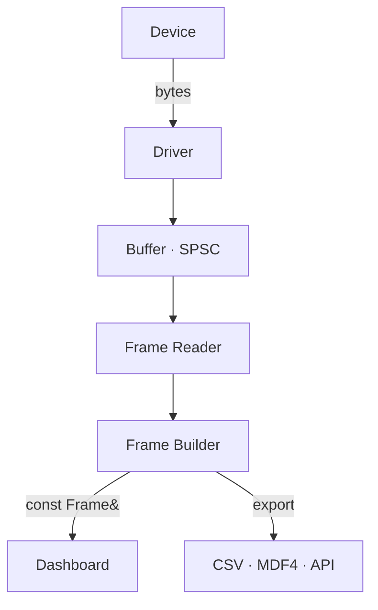

# Data Flow in Serial Studio

## Overview

Understanding how data moves through Serial Studio helps you configure it correctly and troubleshoot issues. This page traces the journey of a single byte from your device to a rendered widget on screen.

## The Pipeline

The following diagram shows the complete data flow from hardware device to rendered dashboard widgets, including the optional export path for CSV, MDF4, and API output.

## Stage 1: Device and Driver

Your device sends raw bytes over one of nine supported transports: UART, TCP/UDP, Bluetooth LE, Audio Input, Modbus RTU/TCP, CAN Bus, USB (libusb), HID (hidapi), or Process I/O.

The selected driver receives bytes on a dedicated I/O thread managed by `DeviceManager`. No parsing happens here — the driver's only job is raw byte transport. Each driver type handles its own protocol: serial framing, TCP streams, BLE characteristic notifications, audio sample buffers, and so on.

Drivers are not singletons. `ConnectionManager` holds one UI-configuration instance per driver type (used by the QML interface), while `DeviceManager` creates a fresh live instance for each active connection.

## Stage 2: Circular Buffer

A 10 MB lock-free single-producer single-consumer (SPSC) ring buffer sits between the driver and the frame reader.

- The driver thread writes bytes into the buffer.
- The frame reader reads bytes out of it.
- No locks, no contention, no blocking.

The SPSC design is a hard architectural constraint. There is exactly one producer (the driver) and one consumer (the frame reader). Adding a second producer or consumer would violate the lock-free guarantee and corrupt data.

The buffer handles burst data without dropping bytes. If data arrives faster than it can be consumed, an overflow counter increments so you can detect the condition.

## Stage 3: Frame Reader

The frame reader runs on the I/O thread alongside the driver. Its job is to scan the circular buffer for frame boundaries and extract complete frames.

Delimiter detection uses the KMP (Knuth-Morris-Pratt) string matching algorithm for O(n + m) performance, where n is the buffer size and m is the delimiter length. Four detection modes are available:

- **End Delimiter Only**: finds the end marker and extracts everything before it.
- **Start and End Delimiter**: finds the start marker, then the end marker, and extracts between them.
- **Start Delimiter Only**: frame boundaries fall between consecutive start markers.
- **No Delimiters**: passes all data through. Use this with a frame parser script (Lua or JavaScript) for length-prefixed or self-delimiting protocols.

After extraction, the frame reader optionally validates a checksum (CRC-8, CRC-16, or CRC-32). Valid frames are placed into a lock-free queue with a capacity of 4096 entries. The main thread is signaled when frames are ready.

The frame reader is configured once before being moved to its thread. If configuration changes (different delimiters, different checksum), the entire frame reader is destroyed and recreated via `resetFrameReader()`. Mutexes are never used.

## Stage 4: Frame Builder

The frame builder runs on the main thread. It dequeues frames from the lock-free queue and processes them according to the current operation mode.

### Quick Plot Mode

1. Split the frame string on commas.
2. If the first row contains all non-numeric values, treat them as column headers.
3. Auto-generate a Data Grid group and a MultiPlot group.
4. Assign values to auto-created datasets.

No project file is needed. This mode is designed for rapid prototyping with CSV-formatted serial output.

### Device Sends JSON Mode

1. Parse the JSON object directly (delimiters are fixed to `/*` and `*/`).
2. Build the Frame structure from the groups and datasets defined in the JSON.
3. No frame parser script is involved.

### Project File Mode

1. Apply the configured decoder (Plain Text, Hexadecimal, Base64, or Binary Direct) to convert raw bytes into a parse-ready format.
2. Call the `parse(frame)` function via the configured scripting engine (Lua 5.4 or QJSEngine).
3. The function returns a table/array of values (or a 2D table/array for multi-frame output).
4. Map returned values to datasets by their Frame Index.
5. Build the Frame object with populated dataset values.

### Multi-Source Routing

In multi-device projects, each device (source) has its own frame reader. The frame builder routes data by source ID through `hotpathRxSourceFrame(sourceId, data)`. Each source maintains its own per-source Frame and its own isolated script engine instance. Source frames are published independently to the dashboard.

## Stage 5: Dashboard

The dashboard receives a `const Frame&` — a read-only reference. No copying. No heap allocation. This is the critical performance constraint that enables Serial Studio to sustain data rates of 256 KHz and above.

The dashboard updates all active widgets with new values. The UI refresh rate is capped at 20 Hz for optimal performance. Time-series data (plots, FFT, GPS trajectory) is appended to fixed-capacity circular buffers that automatically discard the oldest samples.

All dashboard operations run on the main thread. Widget rendering is handled by Qt Quick's scene graph.

## Stage 6: Export (Optional Parallel Path)

The export path is the only place where a heap allocation occurs per frame. When CSV export, MDF4 export, or the API server is active:

1. A single `TimestampedFrame` is created with a nanosecond timestamp (one `make_shared` call).
2. The shared pointer is enqueued into a lock-free queue for each active export worker.
3. Worker threads dequeue and process frames in batches.

Export worker configuration (CSV example):
- Queue capacity: 8192 frames
- Flush threshold: 1024 frames
- Timer interval: 1000 ms (flush at least once per second)

The API server on port 7777 serializes frames to JSON and broadcasts to connected clients using MCP (JSON-RPC 2.0) or the legacy protocol.

## Performance Characteristics

| Operation | Complexity |
|-----------|-----------|
| Circular buffer append | O(1) amortized |
| KMP delimiter search | O(n + m), n = buffer size, m = delimiter length |
| Script parse (Lua/JS) | O(n) interpreter time per frame |
| Dashboard update | O(d), d = total datasets (zero-copy) |
| Export enqueue | O(1) lock-free |

Total hotpath memory allocations: zero on the dashboard path. One `shared_ptr` per frame on the export path only when export is active.

## Threading Summary

| Component | Thread | Constraint |
|-----------|--------|-----------|
| Driver | I/O thread (QThread) | One driver per DeviceManager |
| Circular Buffer | Shared (write: I/O, read: I/O) | SPSC only, never MPMC |
| Frame Reader | I/O thread | Configured once, then immutable. Recreate on config change. |
| Frame Builder | Main thread | Dequeues from lock-free queue |
| Dashboard | Main thread | Zero-copy `const Frame&` only |
| CSV/MDF4/API Export | Worker threads | Lock-free enqueue from main, batch dequeue on worker |

## Troubleshooting Data Flow

**No data in console**: Check driver configuration — correct port, baud rate, IP address, or BLE characteristic.

**Data in console but no dashboard**: Verify the operation mode. Check that frame delimiters match what your device actually sends. In Project File mode, confirm the frame parser returns valid arrays/tables.

**Garbled data**: Wrong baud rate, wrong decoder method, or mismatched delimiters. Compare raw console output against your expected format.

**Partial frames**: Delimiter mismatch. Your device may be sending `\r\n` while you configured only `\n`, or vice versa. Inspect the raw hex in the console.

**Dashboard not updating**: Check that dataset Frame Index values in the project file match the positions in your parsed data array. Index 1 maps to the first element returned by `parse()`.

**High CPU with no dashboard**: The frame reader may be finding too many false frames. Tighten your delimiters or add checksum validation.

**Export files empty**: Export workers only write when a device is connected. Check that the export was started before disconnecting.

---

## See Also

- [Getting Started](Getting-Started.md) — First-time setup and Quick Plot tutorial
- [Operation Modes](Operation-Modes.md) — Quick Plot, Project File, and Device Sends JSON
- [Project Editor](Project-Editor.md) — Configure frame parsing and dashboard layout
- [Frame Parser Scripting](JavaScript-API.md) — Complete Lua and JavaScript parser reference
- [Widget Reference](Widget-Reference.md) — All 15+ widget types and their data requirements
- [Communication Protocols](Communication-Protocols.md) — Protocol comparison and setup
- [Troubleshooting](Troubleshooting.md) — Solutions to common problems
