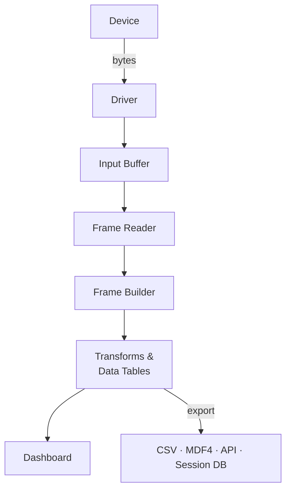

# Data flow in Serial Studio

## Overview

Understanding how data moves through Serial Studio helps you configure it and debug issues. This page follows a single byte from your device to a rendered widget on screen.

## The pipeline

The diagram below shows the full data flow from hardware to dashboard widgets, along with the optional export path for CSV, MDF4, and the API.

## Stage 1: device and driver

Your device sends raw bytes over one of nine supported transports: UART, TCP/UDP, Bluetooth LE, audio input, Modbus RTU/TCP, CAN Bus, USB, HID, or Process I/O.

The selected driver receives bytes from the operating system and hands them off to the rest of the pipeline. No parsing happens here. The driver's only job is raw byte transport. Each driver handles its own protocol: serial framing, TCP streams, BLE characteristic notifications, audio sample buffers, and so on.

## Stage 2: input buffer

A 1 MB input buffer sits between the driver and the frame reader. It absorbs bursts of incoming data so momentary spikes in data rate don't cause dropped bytes. If data arrives faster than Serial Studio can consume it for a while, an overflow counter increments so you can spot the condition.

## Stage 3: frame reader

The frame reader scans the input buffer for frame boundaries and extracts complete frames. Four detection modes are available:

- **End Delimiter Only.** Find the end marker and extract everything before it.
- **Start and End Delimiter.** Find the start marker, then the end marker, and extract what's between them.
- **Start Delimiter Only.** Frame boundaries fall between consecutive start markers.
- **No Delimiters.** Pass all data through. Use this with a frame parser script (Lua or JavaScript) for length-prefixed or self-delimiting protocols.

After extraction, the frame reader can optionally validate a checksum (CRC-8, CRC-16, or CRC-32). Valid frames move to the next stage.

## Stage 4: frame builder

The frame builder turns each complete frame into a structured record of groups and datasets, based on the current operation mode.

### Quick Plot mode

1. Split the frame string on commas.
2. If the first row is all non-numeric, treat it as column headers.
3. Auto-generate a Data Grid group and a MultiPlot group.
4. Assign values to auto-created datasets.

No project file needed. This mode is built for rapid prototyping with CSV-formatted serial output.

### Project File mode

1. Apply the configured decoder (Plain Text, Hexadecimal, Base64, or Binary Direct) to turn raw bytes into a parse-ready form.
2. Call the `parse(frame)` function in your chosen scripting engine (Lua 5.4 or JavaScript).
3. The function returns a list of values (or a 2D list for multi-frame output).
4. Map returned values to datasets by their Frame Index.
5. Reset every computed register in the project's [Data Tables](Data-Tables.md) to its default value, so transform-to-transform communication is always scoped to a single frame.
6. For each dataset, apply its optional `transform(value)` function to convert the raw value into an engineering value. Transforms can read project constants, publish computed registers, and reference other datasets' raw or already-transformed values. See [Dataset Value Transforms](Dataset-Transforms.md).
7. Build the final frame with the populated dataset values. Virtual datasets (datasets with no Frame Index) are filled entirely by their transform at this point.

### Multi-source projects

In multi-device projects, each device (source) is parsed independently, with its own frame reader and its own isolated script engine. Source frames are published to the dashboard independently, so one noisy source can't block or corrupt another.

## Stage 5: dashboard

The dashboard updates all active widgets with the new values as they arrive. Time-series widgets (plots, FFT, GPS trajectory) append new samples to a fixed-size history and drop the oldest samples once the history is full.

Widget rendering is capped at a configurable refresh rate. The default is 60 Hz, and you can change it in **Settings → UI Refresh Rate** to any value between 1 and 240 Hz. Higher rates give smoother animation but cost more CPU and GPU. Lower rates are useful on laptops, older machines, or when you want to free resources for recording. Note that incoming data is not sampled or discarded at this rate. Every frame is still processed and exported. Only the visual refresh of the widgets is capped.

## Stage 6: export (optional parallel path)

When CSV export, MDF4 export, the session database, or the API server is active, every frame is also handed to the export workers. Each export target writes data in the background, so disk I/O and network traffic never block the dashboard or slow down the pipeline.

- **CSV** writes one file per session under `Documents/Serial Studio/CSV/`. See [CSV Import & Export](CSV-Import-Export.md).
- **MDF4 (Pro)** writes a binary measurement file suitable for automotive and high-rate workflows.
- **Session Database (Pro)** appends every frame, raw byte, and data-table snapshot to a per-project SQLite file that you can browse, tag, and replay later. See [Session Database](Session-Database.md).
- **API** on port 7777 serializes frames to JSON and broadcasts them to connected clients using MCP (JSON-RPC 2.0) or the legacy protocol. See the [API Reference](API-Reference.md).

## Troubleshooting data flow

**No data in the console.** Check driver configuration: correct port, baud rate, IP address, or BLE characteristic.

**Data in the console but no dashboard.** Check the operation mode. Make sure frame delimiters match what your device actually sends. In Project File mode, make sure the frame parser returns valid arrays or tables.

**Garbled data.** Wrong baud rate, wrong decoder, or mismatched delimiters. Compare the raw console output against your expected format.

**Partial frames.** Delimiter mismatch. Your device may be sending `\r\n` while you configured only `\n`, or vice versa. Look at the raw hex in the console.

**Dashboard not updating.** Check that dataset Frame Index values in the project file match the positions in your parsed data array. Index 1 maps to the first element returned by `parse()`.

**High CPU with no dashboard.** The frame reader may be matching too many false frames. Tighten your delimiters or add checksum validation.

**Choppy dashboard animation.** Raise the UI refresh rate in **Settings → UI Refresh Rate**. 60 Hz is a good baseline. 120 Hz or higher gives smoother motion at the cost of more CPU.

**High CPU from the dashboard itself.** Lower the UI refresh rate. Dropping from 60 Hz to 30 Hz roughly halves the cost of widget redraws without losing any incoming data.

**Export files empty.** Export workers only write while a device is connected. Check that export was started before you disconnected.

---

## See also

- [Getting Started](Getting-Started.md): first-time setup and Quick Plot tutorial.
- [Operation Modes](Operation-Modes.md): Quick Plot and Project File modes.
- [Project Editor](Project-Editor.md): configure frame parsing and dashboard layout.
- [Frame Parser Scripting](JavaScript-API.md): full Lua and JavaScript parser reference.
- [Dataset Value Transforms](Dataset-Transforms.md): per-dataset calibration, filtering, and unit conversion.
- [Data Tables](Data-Tables.md): shared constants and computed registers used by transforms.
- [Session Database](Session-Database.md): record, tag, and replay sessions through the same pipeline.
- [Widget Reference](Widget-Reference.md): all 15+ widget types and their data requirements.
- [Communication Protocols](Communication-Protocols.md): protocol comparison and setup.
- [Troubleshooting](Troubleshooting.md): fixes for common problems.
