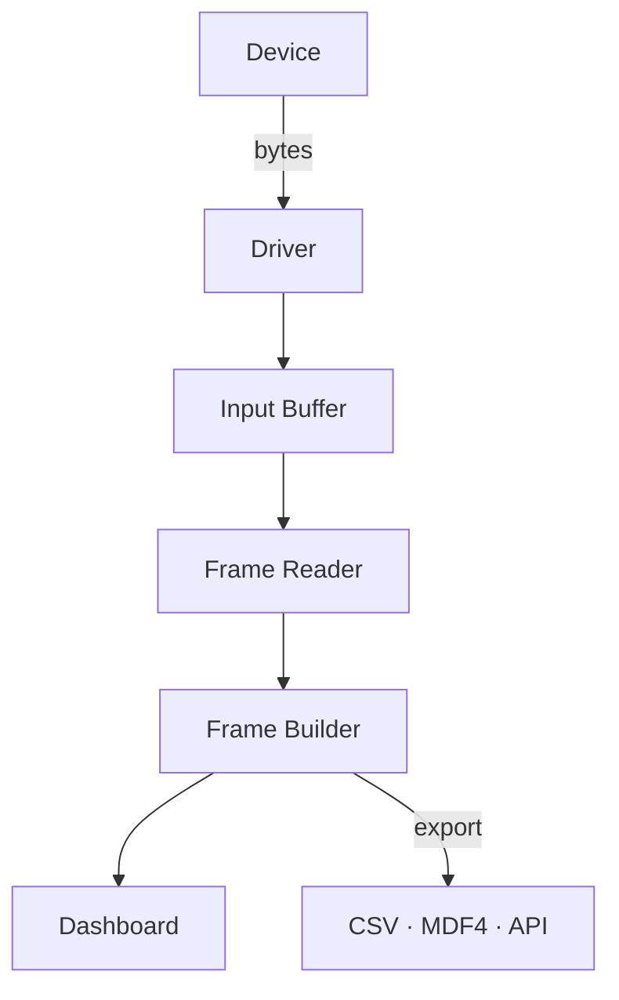

# Data Flow in Serial Studio

## Overview

Understanding how data moves through Serial Studio helps you configure it correctly and troubleshoot issues. This page traces the journey of a single byte from your device to a rendered widget on screen.

## The Pipeline

The following diagram shows the complete data flow from hardware device to rendered dashboard widgets, including the optional export path for CSV, MDF4, and API output.

## Stage 1: Device and Driver

Your device sends raw bytes over one of nine supported transports: UART, TCP/UDP, Bluetooth LE, Audio Input, Modbus RTU/TCP, CAN Bus, USB, HID, or Process I/O.

The selected driver receives bytes from the operating system and hands them off to the rest of the pipeline. No parsing happens here — the driver's only job is raw byte transport. Each driver type handles its own protocol: serial framing, TCP streams, BLE characteristic notifications, audio sample buffers, and so on.

## Stage 2: Input Buffer

A 1 MB input buffer sits between the driver and the frame reader. It absorbs bursts of incoming data so that momentary spikes in data rate don't cause dropped bytes. If data arrives faster than Serial Studio can consume it for a sustained period, an overflow counter increments so you can detect the condition.

## Stage 3: Frame Reader

The frame reader scans the input buffer for frame boundaries and extracts complete frames. Four detection modes are available:

- **End Delimiter Only**: finds the end marker and extracts everything before it.
- **Start and End Delimiter**: finds the start marker, then the end marker, and extracts between them.
- **Start Delimiter Only**: frame boundaries fall between consecutive start markers.
- **No Delimiters**: passes all data through. Use this with a frame parser script (Lua or JavaScript) for length-prefixed or self-delimiting protocols.

After extraction, the frame reader optionally validates a checksum (CRC-8, CRC-16, or CRC-32). Valid frames are handed to the next stage.

## Stage 4: Frame Builder

The frame builder takes each complete frame and turns it into a structured record of groups and datasets, according to the current operation mode.

### Quick Plot Mode

1. Split the frame string on commas.
2. If the first row contains all non-numeric values, treat them as column headers.
3. Auto-generate a Data Grid group and a MultiPlot group.
4. Assign values to auto-created datasets.

No project file is needed. This mode is designed for rapid prototyping with CSV-formatted serial output.

### Device Sends JSON Mode

1. Parse the JSON object directly (delimiters are fixed to `/*` and `*/`).
2. Build the frame from the groups and datasets defined in the JSON payload.
3. No frame parser script is involved.

### Project File Mode

1. Apply the configured decoder (Plain Text, Hexadecimal, Base64, or Binary Direct) to convert raw bytes into a parse-ready format.
2. Call the `parse(frame)` function in your chosen scripting engine (Lua 5.4 or JavaScript).
3. The function returns a list of values (or a 2D list for multi-frame output).
4. Map returned values to datasets by their Frame Index.
5. For each dataset with a `transform(value)` function, apply the transform to convert raw values into engineering units (calibration, filtering, unit conversion). See [Dataset Value Transforms](Dataset-Transforms.md).
6. Build the final frame with the populated dataset values.

### Multi-Source Projects

In multi-device projects, each device (source) is parsed independently, with its own frame reader and its own isolated script engine. Source frames are published to the dashboard independently, so one noisy source can never block or corrupt another.

## Stage 5: Dashboard

The dashboard updates all active widgets with the new values as they arrive. Time-series widgets (plots, FFT, GPS trajectory) append new samples to a fixed-size history and automatically discard the oldest samples once the history is full.

Widget rendering is capped to a configurable refresh rate. The default is **60 Hz**, and you can change it in **Settings → UI Refresh Rate** to any value between 1 and 240 Hz. Higher rates produce smoother animation but consume more CPU and GPU; lower rates are useful on laptops, older machines, or when you want to free resources for recording. Note that incoming data is **not** sampled or discarded at this rate — every frame is still processed and exported. Only the visual refresh of the widgets is capped.

## Stage 6: Export (Optional Parallel Path)

When CSV export, MDF4 export, or the API server is active, every frame is additionally handed to the export workers. Each export target (CSV file, MDF4 file, API clients) writes data in the background so disk I/O and network traffic never block the dashboard or slow down the data pipeline.

The API server on port 7777 serializes frames to JSON and broadcasts to connected clients using MCP (JSON-RPC 2.0) or the legacy protocol. See the [API Reference](API-Reference.md) for details.

## Troubleshooting Data Flow

**No data in console**: Check driver configuration — correct port, baud rate, IP address, or BLE characteristic.

**Data in console but no dashboard**: Verify the operation mode. Check that frame delimiters match what your device actually sends. In Project File mode, confirm the frame parser returns valid arrays/tables.

**Garbled data**: Wrong baud rate, wrong decoder method, or mismatched delimiters. Compare raw console output against your expected format.

**Partial frames**: Delimiter mismatch. Your device may be sending `\r\n` while you configured only `\n`, or vice versa. Inspect the raw hex in the console.

**Dashboard not updating**: Check that dataset Frame Index values in the project file match the positions in your parsed data array. Index 1 maps to the first element returned by `parse()`.

**High CPU with no dashboard**: The frame reader may be matching too many false frames. Tighten your delimiters or add checksum validation.

**Choppy dashboard animation**: Raise the UI refresh rate in **Settings → UI Refresh Rate**. The default of 60 Hz is a good balance; 120 Hz or higher gives smoother motion at the cost of more CPU.

**High CPU from the dashboard itself**: Lower the UI refresh rate. Dropping from 60 Hz to 30 Hz roughly halves the cost of widget redraws without losing any incoming data.

**Export files empty**: Export workers only write when a device is connected. Check that the export was started before disconnecting.

---

## See Also

- [Getting Started](Getting-Started.md) — First-time setup and Quick Plot tutorial
- [Operation Modes](Operation-Modes.md) — Quick Plot, Project File, and Device Sends JSON
- [Project Editor](Project-Editor.md) — Configure frame parsing and dashboard layout
- [Frame Parser Scripting](JavaScript-API.md) — Complete Lua and JavaScript parser reference
- [Dataset Value Transforms](Dataset-Transforms.md) — Per-dataset calibration, filtering, and unit conversion
- [Widget Reference](Widget-Reference.md) — All 15+ widget types and their data requirements
- [Communication Protocols](Communication-Protocols.md) — Protocol comparison and setup
- [Troubleshooting](Troubleshooting.md) — Solutions to common problems
