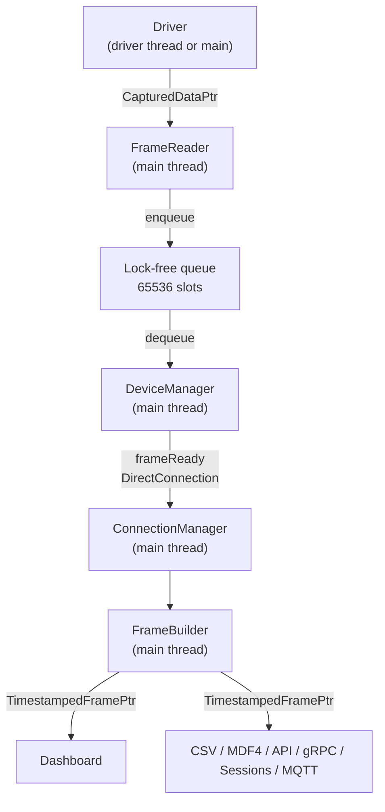
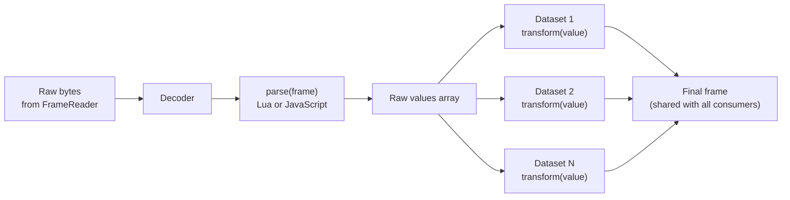

# The data hotpath

A technical reference for how a single byte travels from a connected device to a rendered widget,
and how the frame parser and dataset transforms plug into that pipeline. If you're looking for
the high-level user view, start with [Data Flow](Data-Flow.md). For threading-specific guarantees
(what is and isn't guaranteed, why FrameReader stays on the main thread), see
[Threading and Timing Guarantees](Threading-and-Timing.md). This page is for advanced users,
plugin authors, and anyone debugging throughput, latency, or timing problems.

The hotpath is the chain of components that runs once per received frame at full data rate.
Serial Studio targets sustained data rates above 256 kHz, so every stage on this path avoids
allocations, copies, and cross-thread context switches.

## Stages

Each arrow is either a direct in-thread call or a `Qt::DirectConnection` signal. Same-thread
queued connections are avoided on this path: at 10 kHz they fill Qt's event queue faster than
the consumer can drain it, and the FrameReader's bounded queue starts dropping frames.

### Stage 1: driver

Drivers wrap one transport each (UART, TCP/UDP, BLE, Audio, Modbus, CAN Bus, USB, HID,
Process I/O). They publish data through `HAL_Driver::publishReceivedData(...)`, which carries
a shared `IO::CapturedData` payload:

- `data` (`QByteArray`; Qt's copy-on-write means consumers get an atomic refcount bump, not
  a deep copy)
- `timestamp` (steady-clock time of acquisition)
- `frameStep` (cadence in nanoseconds, when the driver knows it)
- `logicalFramesHint` (how many logical frames are encoded in the chunk, when known)

Drivers that already know their cadence fill `frameStep` so downstream stages can fan out
timestamps without re-measuring. The audio driver, for example, backdates the chunk start by
`step * (totalFrames - 1)` so each parsed sample lines up with the moment it was captured,
not the moment Qt happened to deliver it.

If a driver posts to the main thread (via `QMetaObject::invokeMethod` or a queued connection),
it must capture `SteadyClock::now()` *before* queueing and pass that into
`publishReceivedData`. A default-constructed timestamp would otherwise be filled in on the
receiving thread and report fictional timing.

### Stage 2: frame reader

`IO::FrameReader` runs on the main thread and owns a single producer / single consumer
`CircularBuffer`. It scans the buffer for frame boundaries (start delimiter, end delimiter,
both, or none) and pulls out one logical frame at a time.

- Single-delimiter modes use the KMP fast path.
- Multi-delimiter modes use `CircularBuffer::findFirstOfPatterns()`, a single-pass scan with
  a stack-allocated `PatInfo` array of up to eight patterns; it never touches the heap.
- Optional CRC validation (CRC-8, CRC-16, CRC-32) runs immediately after extraction.

Each completed frame is enqueued into a lock-free
`moodycamel::ReaderWriterQueue<CapturedDataPtr>` with 65536 slots. When that queue is full,
frames are dropped and a log line is emitted. That message is the canonical signal that a
downstream stage is too slow.

The frame reader is configuration-immutable. To change delimiters, decoder, or checksum mode,
the live FrameReader is destroyed and a new one is created via
`ConnectionManager::resetFrameReader()` or `DeviceManager::reconfigure()`. There are no
mutexes anywhere on this path.

### Stage 3: device manager and connection manager

`DeviceManager::onReadyRead` drains the queue and emits `frameReady(deviceId, frame)` per
dequeued frame, using `Qt::DirectConnection` so it lands in
`ConnectionManager::onFrameReady` as a normal function call. `ConnectionManager` then routes
the frame into `FrameBuilder::hotpathRxFrame` or, for multi-source projects,
`hotpathRxSourceFrame(sourceId, data)`.

### Stage 4: frame builder, parser, and transforms

`FrameBuilder` is where the project's parsing rules turn raw bytes into a populated `Frame`
object. It runs three things in order:

1. The selected **decoder** (Plain Text, Hexadecimal, Base64, or Binary Direct) converts the
   raw bytes into the form `parse()` expects.
2. The **frame parser** (`parse(frame)` in Lua or JavaScript) returns an array of values. See
   [Frame Parser Scripting](JavaScript-API.md) for the full API.
3. Per-dataset **transforms** (`transform(value)`) are called in group then dataset order. A
   transform can read raw values from any dataset and final values from datasets earlier in
   the order, plus shared registers from [Data Tables](Data-Tables.md). See
   [Dataset Value Transforms](Dataset-Transforms.md).

In Quick Plot mode, steps 1 and 2 are replaced by a built-in line splitter that treats commas
as the field separator. In Console-Only mode, the FrameBuilder hotpath is a no-op: bytes go
straight to the terminal via `DeviceManager::rawDataReceived`.

When a single captured chunk expands into N logical frames, FrameBuilder publishes them at
`data->timestamp + step * i`, so a dropped or coalesced read on the driver side does not
collapse all the frames into a single instant.

The parser and transforms are the only points on the hotpath where user code runs. Both run
under a runtime watchdog and are wrapped so that a thrown error, infinite loop, or non-finite
return value falls back to the safe path: the raw value, or an empty frame. Errors do not
interrupt the data stream. Transform watchdogs use a 100 ms budget; for JavaScript transforms
the budget is armed once per frame in `applyDatasetValues` and covers all of that frame's
transforms collectively, not per dataset call.

Transforms that don't declare an `info` parameter (`function transform(value)`) pay no extra
cost for it: the engine inspects each transform's parameter count at compile time and skips
building the info table or object when it isn't used.

#### Parser engine details

- One engine instance per source, never shared across sources.
- Lua uses an embedded Lua 5.4 interpreter with `base`, `table`, `string`, `math`, and `utf8`
  loaded. JavaScript uses Qt's `QJSEngine` with the Console and GC extensions only.
- Each parser is compiled once when the project loads or the connection opens, then called
  many times. Compilation cost is paid up front, not per frame.

#### Transform isolation

- In Lua, top-level `local` declarations become upvalues of the `transform` closure, so each
  dataset has its own state on the shared Lua state.
- In JavaScript, the user's code is wrapped in an IIFE at compile time so top-level `var`
  declarations are private to that dataset's closure on the shared `QJSEngine`.

Two datasets that copy the same EMA template will not clobber each other's state in either
language.

### Stage 5: fan-out

FrameBuilder produces exactly one `TimestampedFramePtr` per parsed frame and shares the same
shared pointer with every consumer:

- the dashboard,
- CSV and MDF4 export workers,
- the Session Database (Pro),
- the API server (port 7777, MCP and legacy JSON-RPC),
- the gRPC server (when built with `ENABLE_GRPC`),
- the MQTT bridge.

There is no second copy. Export workers run on dedicated threads and consume from lock-free
queues, so writing to disk or the network never blocks the dashboard.

## Timestamp ownership

The driver owns time. Every component downstream of the driver propagates the timestamp
attached to the captured chunk; nothing on the hotpath calls `steady_clock::now()` to stamp a
frame after the fact.

- `IO::CapturedData` carries the chunk timestamp.
- `FrameReader::frameTimestamp(endOffsetExclusive)` walks pending chunks to assign each
  extracted logical frame the correct moment, advancing the per-chunk clock by `frameStep`.
- `FrameBuilder` interpolates timestamps when one chunk expands into multiple frames.
- Export workers derive strictly-increasing offsets via
  `FrameConsumerWorkerBase::monotonicFrameNs(frame->timestamp, baseline)`. That helper is a
  safety net against same-nanosecond collisions on coarse clocks (Windows `steady_clock` has
  about 15 ms resolution); it is not the source of truth.

If timing looks wrong on a chart or in an export, work from left to right: driver stamp,
`CapturedData` propagation, FrameReader split, FrameBuilder fan-out, and only then the
export or report. Patching a downstream stage to "fix" timing usually masks an earlier bug.

## Performance characteristics

The hotpath is designed around three rules:

1. **No allocations after init.** `FrameBuilder` reuses one `Frame` per source and draws
   each `TimestampedFramePtr` from a fixed-size slot pool (`acquireFrame`); slots are
   recycled via a custom shared_ptr deleter when the last consumer releases the frame.
   Parser engines are compiled once, `CircularBuffer` and lock-free queues are pre-sized,
   and per-source transform engines are looked up once per source switch (not per dataset).
2. **No copies of the frame.** Every consumer holds the same `TimestampedFramePtr`; there is
   no second ownership layer.
3. **No queued connections between main-thread objects.** Direct connections turn signal
   emissions into ordinary function calls.

The cost per frame is dominated by:

- The parser call (`parse`), which the user controls.
- The transform calls, one per dataset that defines a transform, again user-controlled.
- The dashboard widget update path, which is rate-capped by the UI refresh rate (default
  60 Hz, configurable from 1 Hz to 240 Hz). Every frame is still parsed and exported; only
  the visual refresh is throttled.

To measure this pipeline end-to-end on your own hardware, the [Benchmark Dialog](Benchmark.md)
(About > Benchmark) drives the real `FrameReader` -> `FrameBuilder` -> consumer chain and
reports sustained frames/second per stage and per parser language, gated against the targets
above. The same engine runs headless for CI; see
[Command-Line Interface](Command-Line-Interface.md#hotpath-benchmark).

## Where the parser and transforms fit

The parser and transforms are the user-visible parts of the hotpath. Everything else is
fixed; the parser and transforms are where you add custom protocol logic and signal
conditioning without rebuilding the application.

A few things to keep in mind:

- The parser runs once per frame; transforms run once per frame *per dataset that defines
  one*. Heavy work in a transform that runs at 10 kHz across 50 datasets adds up quickly.
- Transforms can read raw values from any dataset and final values from datasets that come
  earlier in group / dataset order. They can also publish to computed registers in the
  project's [Data Tables](Data-Tables.md), which other transforms can then read, in the
  same frame or in any later frame, since computed registers persist.
- Computed registers hold their last written value indefinitely. For per-dataset state
  isolated from other datasets, transform-local upvalues (top-level `local` in Lua,
  top-level `var`/`let` in JavaScript) are still the lightest option.
- A transform can return a string for label-style datasets. Non-finite numbers (`NaN`,
  `Infinity`) and errors fall back to the raw value silently.

For the full parser and transform API, see [Frame Parser Scripting](JavaScript-API.md) and
[Dataset Value Transforms](Dataset-Transforms.md).

## Debugging the hotpath

| Symptom | Where to look |
|---|---|
| `[FrameReader] Frame queue full -- frame dropped` in the log | A downstream consumer is too slow. Check parser and transform CPU cost first; a transform that does HTTP calls or string-heavy work will saturate the path. |
| Timestamps drift or cluster | Driver stamping. Check that the driver fills `frameStep` and that any cross-thread post captures `SteadyClock::now()` before queueing. |
| Same-instant timestamps in CSV or the Session DB | Coarse clock granularity (often Windows). The export-side monotonic helper preserves order, but per-frame resolution is hardware-bound. |
| Parser appears to skip frames | Check the operation mode (Console-Only skips the parser by design) and the delimiter configuration. In multi-source projects, each source has its own parser engine; an error in one source does not affect the others. |
| Transform changes don't take effect | Transforms are compiled once when the project loads or the connection opens. Re-open the connection or reload the project. |
| High CPU but the dashboard is smooth | The bottleneck is upstream of the dashboard. Profile the parser and transforms; the dashboard refresh rate cap doesn't affect parser load. |

## Threading invariants

Treat these as load-bearing:

- `FrameReader` runs on the main thread. Its configuration is immutable; recreate the reader
  to change delimiters, decoder, or checksum.
- `CircularBuffer` is single-producer / single-consumer. Never make it MPMC.
- `Dashboard` is main-thread only. It receives the same `TimestampedFramePtr` that export
  workers receive, and reads from `frame->data` directly.
- Export workers (CSV, MDF4, Session DB, API, gRPC, MQTT) consume from lock-free queues on
  worker threads. They never block the main thread.

If you're writing a plugin or a new driver, follow the existing drivers (see `BluetoothLE.h`
and `BluetoothLE.cpp` as the canonical reference) and keep these invariants intact.

## See also

- [Data Flow](Data-Flow.md): the user-facing version of this pipeline, with troubleshooting tips.
- [Frame Parser Scripting](JavaScript-API.md): full Lua and JavaScript `parse()` reference.
- [Dataset Value Transforms](Dataset-Transforms.md): per-dataset calibration, filtering, and
  unit conversion.
- [Data Tables](Data-Tables.md): shared constants and computed registers used by transforms.
- [Operation Modes](Operation-Modes.md): how Project File, Quick Plot, and Console-Only modes
  shape the hotpath.
- [Benchmark Dialog](Benchmark.md): the interactive tool that drives this exact pipeline and
  reports its sustained throughput against the 256 kHz gates.
- [Communication Protocols](Communication-Protocols.md): protocol comparison and per-driver
  setup.
- [API Reference](API-Reference.md): how the API server consumes the same shared frame
  object.
