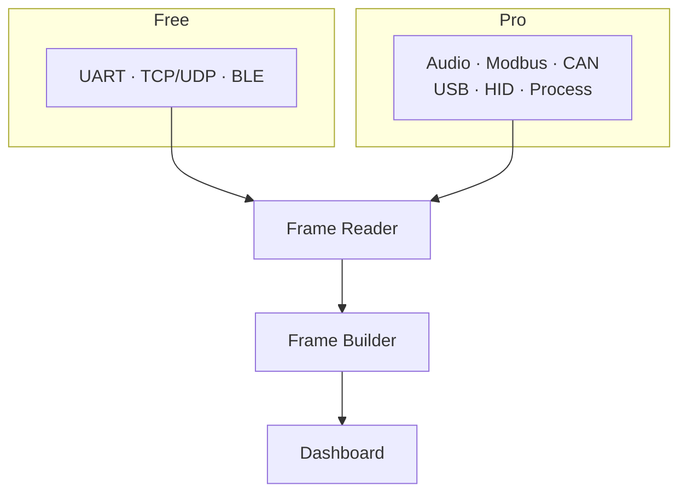

# Data sources

## Overview

Serial Studio connects to hardware and software data sources through nine driver types. Three ship in the free GPL edition; six more need a Pro license. Each driver feeds raw bytes into the frame-parsing pipeline. You pick the active driver in the Setup panel, or (for multi-device projects) in the Project Editor.

The diagram below shows how each driver type feeds into the data pipeline.

---

## Free drivers

### Serial port (UART)

Talks to physical or virtual serial ports. A good fit for Arduino, ESP32, STM32, any USB-to-serial adapter, RS-232, and RS-485 links.

**Configuration:**

| Parameter        | Options / range                                    | Default   |
|------------------|----------------------------------------------------|-----------|
| COM port         | Auto-detected list of available ports              | —         |
| Baud rate        | 110 to 1,000,000+ (custom values accepted)         | 9600      |
| Data bits        | 5, 6, 7, 8                                         | 8         |
| Parity           | None, Even, Odd, Space, Mark                       | None      |
| Stop bits        | 1, 1.5, 2                                          | 1         |
| Flow control     | None, RTS/CTS (hardware), XON/XOFF (software)      | None      |
| DTR signal       | On / Off. Toggles the Data Terminal Ready line     | Off       |
| Auto reconnect   | On / Off. Reconnects automatically on disconnect   | Off       |

**Platform notes.** Port names are platform-specific: `COM3` on Windows, `/dev/ttyUSB0` or `/dev/ttyACM0` on Linux, `/dev/cu.usbserial-*` on macOS. You can register custom port paths manually.

**Quick start:**

1. Select your COM port from the dropdown.
2. Set the baud rate to match your device firmware.
3. Adjust data bits, parity, stop bits, and flow control if your device needs non-default values.
4. Turn on DTR if your board needs it for reset (common on some Arduino variants).
5. Click **Connect**.

---

### Network socket (TCP/UDP)

Talks over TCP or UDP sockets. Use this for WiFi-enabled microcontrollers (ESP32 in WiFi mode, Raspberry Pi), remote telemetry servers, or network-attached instruments.

**Configuration:**

| Parameter       | TCP                     | UDP                              |
|-----------------|-------------------------|----------------------------------|
| Socket type     | TCP                     | UDP                              |
| Remote address  | IP or hostname          | IP or hostname                   |
| Port            | TCP port (default: 23)  | Remote port (default: 53)        |
| Local port      | —                       | Listening port (0 = auto-assign) |
| Multicast       | —                       | On / Off                         |

**Protocol differences:**

- **TCP** sets up a persistent, reliable connection. Data arrives in order, with automatic retransmission of lost packets. Hostname resolution runs asynchronously before the connection is opened.
- **UDP** is connectionless, with lower latency and no delivery guarantee. It supports multicast group reception when enabled.

**Quick start (TCP):**

1. Select TCP as the socket type.
2. Enter the remote IP address and port.
3. Click **Connect**. Serial Studio opens a TCP session and starts receiving data.

**Quick start (UDP):**

1. Select UDP as the socket type.
2. Enter the remote address and remote port where the device sends data.
3. Set a local port if your device expects a specific listening port, or leave it at 0 for auto-assignment.
4. Turn on multicast if you're receiving from a multicast group.
5. Click **Connect**.

---

### Bluetooth Low Energy (BLE)

Connects to BLE peripherals using GATT service/characteristic subscriptions. A good fit for BLE sensors, fitness devices, and custom BLE firmware.

**Configuration:**

| Parameter       | Description                                                |
|-----------------|------------------------------------------------------------|
| Device          | Discovered BLE peripherals (scanning starts automatically) |
| Service         | GATT service to subscribe to                               |
| Characteristic  | Specific characteristic for data notifications             |

**Platform support:** macOS (CoreBluetooth), Windows 10+ (WinRT), Linux (BlueZ 5+).

**Architecture notes:**

- Device discovery state is shared across all BLE driver instances. The device list is append-only during scanning, so indices stay stable.
- Each driver instance keeps its own connection (controller, service, characteristic subscriptions).
- Service and characteristic names discovered on one instance are propagated to all other instances targeting the same device.

**Quick start:**

1. Open the Setup panel. BLE scanning starts automatically.
2. Pick a device from the dropdown.
3. Wait for service discovery to finish, then pick a service.
4. Pick the characteristic that carries your data.
5. Click **Connect**.

---

## Pro drivers

The next six drivers need a Serial Studio Pro license.

### Audio input

Captures audio samples from system input devices through the miniaudio library. Useful for microphone analysis, acoustic sensors, vibration monitoring via piezo elements, and analog signal visualization within the audio frequency range.

**Configuration:**

| Parameter           | Options                                                     |
|---------------------|-------------------------------------------------------------|
| Input device        | System audio inputs (microphone, line-in, and so on)        |
| Sample rate         | Device-dependent (common: 8, 22.05, 44.1, 48, 96, 192 kHz)  |
| Sample format       | PCM signed/unsigned 16/24/32-bit, float 32-bit              |
| Channel config      | Mono, stereo, or any layout the device supports             |
| Output device       | System audio outputs (optional, for loopback)               |

**Quick start:**

1. Select Audio Input as the data source.
2. Choose an input device and sample rate.
3. Set the sample format and channel configuration.
4. Click **Connect**. Audio samples flow into the frame pipeline as CSV rows.

**Tips.** Use line-in instead of mic-in to avoid automatic gain control. Turn off OS-level noise cancellation and audio effects for clean signals. Grant microphone permissions if your OS asks for them.

---

### Modbus (RTU and TCP)

Polls registers from Modbus-compatible PLCs, sensors, and industrial controllers. Supports both Modbus RTU (serial, RS-485/RS-232) and Modbus TCP.

**Common configuration:**

| Parameter        | Range / options                                 |
|------------------|-------------------------------------------------|
| Protocol         | Modbus RTU, Modbus TCP                          |
| Slave address    | 1 to 247                                        |
| Poll interval    | 50 to 60,000 ms                                 |
| Register groups  | Type + start address + count (multiple groups)  |

**Register types:** coil (read/write discrete), discrete input (read-only discrete), holding register (read/write 16-bit), input register (read-only 16-bit).

**RTU-specific parameters.** Serial port, baud rate, data bits, parity, stop bits. Identical to the UART driver settings.

**TCP-specific parameters.** Host address and TCP port (default: 502).

**Quick start (RTU):**

1. Connect an RS-485 adapter to the Modbus device and your computer.
2. Select Modbus RTU. Configure the serial port and line parameters.
3. Set the slave address and add one or more register groups.
4. Set the poll interval.
5. Click **Connect**. Register values are polled on a timer and delivered as frames.

**Quick start (TCP):**

1. Enter the device IP address and port.
2. Set the slave address (unit ID) and register groups.
3. Click **Connect**.

---

### CAN Bus

Receives and transmits CAN frames through platform-specific CAN interface plugins. Used for automotive ECU diagnostics, industrial control networks, and vehicle telemetry.

**Configuration:**

| Parameter       | Options                                                                  |
|-----------------|--------------------------------------------------------------------------|
| Plugin          | SocketCAN, PEAK PCAN, Vector CAN, Systec, others                         |
| Interface       | can0, can1, PCAN_USBBUS1, and so on (plugin-dependent)                   |
| Bitrate         | 10K to 1M (common: 125K, 250K, 500K, 1M)                                 |
| CAN FD          | On / Off. Enables flexible data-rate frames (up to 64 bytes)             |

**Platform support:**

- **Linux:** SocketCAN is built into the kernel. Configure with `ip link set can0 type can bitrate 500000 && ip link set can0 up`.
- **Windows:** Requires a third-party CAN adapter with a Qt CAN Bus plugin (PEAK, Vector, Systec).
- **macOS:** Limited support. Requires third-party drivers.

**Frame format.** Standard CAN uses 11-bit identifiers (0x000 to 0x7FF). CAN FD extends that to 29-bit identifiers and up to 64 data bytes per frame. The driver outputs frames as `[ID_high, ID_low, DLC, data...]` byte arrays.

**Quick start:**

1. Connect your CAN adapter and install its drivers.
2. Select CAN Bus as the data source.
3. Pick the plugin that matches your hardware and select the interface.
4. Set the bitrate to match your CAN network exactly. Mismatched bitrates cause bus errors.
5. Turn on CAN FD if your network uses it.
6. Click **Connect**.

---

### Raw USB

Direct USB access via libusb, bypassing OS serial and HID abstractions. Supports bulk, control, and isochronous transfers for custom USB devices and high-bandwidth sensors.

**Configuration:**

| Parameter       | Options                                               |
|-----------------|-------------------------------------------------------|
| Device          | Enumerated USB devices (VID:PID, product name)        |
| Transfer mode   | Bulk Stream (default), Advanced Control, Isochronous  |
| IN endpoint     | USB endpoint to read from                             |
| OUT endpoint    | USB endpoint to write to                              |
| ISO packet size | Packet size in bytes (isochronous mode only)          |

**Transfer modes:**

- **Bulk stream.** Standard bulk IN/OUT transfers. Best for most custom USB firmware.
- **Advanced control.** Bulk plus control transfers, for devices that need vendor-specific USB control commands.
- **Isochronous.** Time-sensitive, fixed-rate streaming transfers. Use this for real-time audio, video, or other isochronous devices.

**Device enumeration.** Uses libusb hotplug callbacks where the OS supports them (Linux, macOS, Windows). Falls back to a 2-second polling timer when hotplug isn't available.

**Quick start:**

1. Plug in your USB device.
2. Select Raw USB as the data source.
3. Pick your device from the enumerated list.
4. Select Bulk Stream as the transfer mode (unless your device specifically needs something else).
5. Select the IN and OUT endpoints that match your device firmware.
6. Click **Connect**.

**Platform notes:**

- **Linux:** You may need `udev` rules (for example `SUBSYSTEM=="usb", ATTR{idVendor}=="1234", MODE="0666"`) or root access.
- **macOS:** The kernel HID or serial driver may have to be detached before libusb can claim the device.
- **Windows:** A WinUSB or libusb-compatible driver must be installed (for example via Zadig).

---

### HID device

Connects to Human Interface Devices (gamepads, joysticks, custom HID sensors) through hidapi. Works on Windows, macOS, and Linux without extra drivers for most devices.

**Configuration:**

| Parameter   | Description                                              |
|-------------|----------------------------------------------------------|
| Device      | Enumerated HID devices (VID:PID, product name)           |
| Usage page  | Read-only. HID Usage Page reported by the device         |
| Usage       | Read-only. HID Usage reported by the device              |

**Enumeration.** The device list refreshes automatically every 2 seconds. The list includes a placeholder entry at index 0 ("Select Device").

**Data format.** The driver reads 65-byte HID reports directly from the device. Unexpected disconnections (unplugging, driver errors) are handled cleanly, and the UI is notified.

**Quick start:**

1. Plug in your HID device.
2. Select HID Device as the data source.
3. Pick your device from the list (check Usage Page and Usage to confirm the right interface on multi-interface devices).
4. Click **Connect**.

**Platform notes:**

- **Linux:** Add a `udev` rule for `hidraw` access (for example `SUBSYSTEM=="hidraw", GROUP="plugdev", MODE="0664"`).
- **macOS and Windows:** most HID devices work without extra configuration.

---

### Process I/O

Reads data from a child process's stdout or from a named pipe/FIFO. Any script or program that writes to stdout can feed data into Serial Studio dashboards this way.

**Modes:**

| Mode       | Description                                                     |
|------------|-----------------------------------------------------------------|
| Launch     | Spawns a child process and reads its combined stdout and stderr |
| Named pipe | Opens an existing named pipe or FIFO for reading                |

**Launch mode parameters:**

| Parameter    | Description                              |
|--------------|------------------------------------------|
| Executable   | Path to the program to launch            |
| Arguments    | Command-line arguments                   |
| Working dir  | Working directory for the child process  |

**Named pipe parameters:**

| Parameter   | Description                                                              |
|-------------|--------------------------------------------------------------------------|
| Pipe path   | Path to the FIFO or named pipe (e.g., `/tmp/mydata` or `\\.\pipe\mydata`)|

**Quick start (Launch mode):**

1. Select Process I/O as the data source.
2. Pick Launch mode.
3. Enter the path to your script or executable.
4. Add command-line arguments if needed.
5. Click **Connect**. Serial Studio spawns the process and reads its stdout.

**Quick start (Named Pipe mode):**

1. Create a FIFO or named pipe from your external process.
2. Select Process I/O and pick Named Pipe mode.
3. Enter the pipe path.
4. Click **Connect**.

**Tips:**

- The child process has to write data in a format Serial Studio can parse (for example CSV lines or delimited frames).
- For Python scripts, use the `-u` flag or call `flush()` after each `print()` to disable output buffering.
- If the child process crashes, Serial Studio prints a warning and disconnects.
- Use Named Pipe mode when you want to connect to a long-running external process without Serial Studio managing its lifecycle.

---

## Multi-device mode

When a project file defines multiple sources, Serial Studio runs in multi-device mode. Each source sets its own bus type, connection settings, frame delimiters, and (optionally) JavaScript parser.

**Key behaviors:**

- All configured devices connect at the same time when you click **Connect**.
- Each device's data routes to its own groups and datasets in the dashboard.
- Sources are configured in the Project Editor under the Sources section.
- The Setup panel shows a "Multi-Device Project" notice with a link to open the Project Editor.
- Driver toolbar buttons are disabled while a multi-device project is active.
- Multi-device mode needs a Pro license.

---

## Picking a data source

**Single-device mode.** Use the Setup panel's "I/O Interface" dropdown or the driver buttons in the toolbar to pick a data source type.

**Multi-device mode.** Each source is configured individually in the Project Editor. The Setup panel shows the active project but doesn't allow per-source driver selection.

---

## Troubleshooting

| Driver        | Common issues                                                                  |
|---------------|--------------------------------------------------------------------------------|
| Serial port   | Wrong COM port or baud rate mismatch. Check that settings match device firmware. |
| Network       | Firewall blocking the port. Check that IP address and port are reachable.      |
| BLE           | Device out of range or not advertising. Check the Bluetooth adapter is enabled.|
| Audio input   | Input device muted or permissions denied. Check OS audio and privacy settings. |
| Modbus        | Slave ID or register address mismatch. For RTU, check wiring and termination.  |
| CAN Bus       | Bitrate mismatch causes bus errors. Check CAN-H/CAN-L wiring and termination.  |
| Raw USB       | Missing udev rules (Linux) or kernel driver conflict (macOS). Check endpoints. |
| HID device    | Device claimed by another application. Add udev rules on Linux.                |
| Process I/O   | Executable not found or stdout buffered. Use `-u` for Python; check the path.  |
