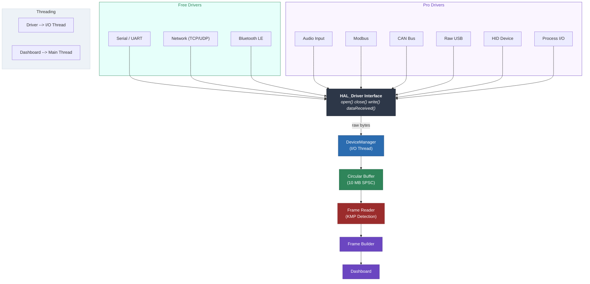

# Data Sources

## Overview

Serial Studio connects to hardware and software data sources through nine driver types. Three are available in the free GPL edition; six additional drivers require a Pro license. Each driver runs on a dedicated thread and feeds raw bytes into the frame-parsing pipeline.

All drivers share a common interface (`HAL_Driver`) that provides `open()`, `close()`, `write()`, `isOpen()`, `configurationOk()`, and `dataReceived()`. The active driver is selected in the Setup Panel or, for multi-device projects, in the Project Editor.

The following diagram shows the driver architecture and how each driver feeds into the data pipeline.

> **Note:** UI-config instances are owned by `ConnectionManager`; live instances are created by `DeviceManager`.

---

## Free Drivers

### Serial Port (UART)

Communicates over physical or virtual serial ports. Suitable for Arduino, ESP32, STM32, any USB-to-serial adapter, RS-232, and RS-485 links.

**Configuration:**

| Parameter        | Options / Range                                    | Default   |
|------------------|----------------------------------------------------|-----------|
| COM Port         | Auto-detected list of available ports               | —        |
| Baud Rate        | 110 — 1,000,000+ (custom values accepted)          | 9600      |
| Data Bits        | 5, 6, 7, 8                                          | 8         |
| Parity           | None, Even, Odd, Space, Mark                         | None      |
| Stop Bits        | 1, 1.5, 2                                           | 1         |
| Flow Control     | None, RTS/CTS (hardware), XON/XOFF (software)       | None      |
| DTR Signal       | On / Off — toggles Data Terminal Ready line          | Off       |
| Auto Reconnect   | On / Off — reconnects automatically on disconnect    | Off       |

**Platform notes:** Port names are platform-specific — `COM3` on Windows, `/dev/ttyUSB0` or `/dev/ttyACM0` on Linux, `/dev/cu.usbserial-*` on macOS. Custom port paths can be registered manually.

**Quick start:**

1. Select your COM port from the dropdown.
2. Set the baud rate to match your device firmware.
3. Adjust data bits, parity, stop bits, and flow control if your device requires non-default values.
4. Enable DTR if your board needs it for reset (common on some Arduino variants).
5. Click **Connect**.

---

### Network Socket (TCP/UDP)

Communicates over TCP or UDP sockets. Use this for WiFi-enabled microcontrollers (ESP32 WiFi mode, Raspberry Pi), remote telemetry servers, or network-attached instruments.

**Configuration:**

| Parameter        | TCP                | UDP                              |
|------------------|--------------------|----------------------------------|
| Socket Type      | TCP                | UDP                              |
| Remote Address   | IP or hostname     | IP or hostname                   |
| Port             | TCP port (default: 23) | Remote port (default: 53)    |
| Local Port       | —                 | Listening port (0 = auto-assign) |
| Multicast        | —                 | On / Off                         |

**Protocol differences:**

- **TCP** establishes a persistent, reliable connection. Data arrives in order with automatic retransmission of lost packets. Hostname resolution is performed asynchronously before connection.
- **UDP** is connectionless with lower latency and no delivery guarantee. Supports multicast group reception when enabled.

**Quick start (TCP):**

1. Select TCP as socket type.
2. Enter the remote IP address and port.
3. Click **Connect**. Serial Studio establishes a TCP session and begins receiving data.

**Quick start (UDP):**

1. Select UDP as socket type.
2. Enter the remote address and remote port where the device sends data.
3. Set a local port if your device expects a specific listening port, or leave at 0 for auto-assignment.
4. Enable multicast if receiving from a multicast group.
5. Click **Connect**.

---

### Bluetooth Low Energy (BLE)

Connects to BLE peripherals using GATT service/characteristic subscriptions. Suitable for BLE sensors, fitness devices, and custom BLE firmware.

**Configuration:**

| Parameter       | Description                                           |
|-----------------|-------------------------------------------------------|
| Device          | Discovered BLE peripherals (scanning starts automatically) |
| Service         | GATT service to subscribe to                           |
| Characteristic  | Specific characteristic for data notifications          |

**Platform support:** macOS (CoreBluetooth), Windows 10+ (WinRT), Linux (BlueZ 5+).

**Architecture notes:**

- Device discovery state is shared across all BLE driver instances. The device list is append-only during scanning — indices remain stable.
- Each driver instance maintains its own connection (controller, service, characteristic subscriptions).
- Service and characteristic names discovered on one instance are propagated to all other instances targeting the same device.

**Quick start:**

1. Open the Setup Panel. BLE scanning starts automatically.
2. Select a device from the dropdown.
3. Wait for service discovery to complete, then select a service.
4. Select the characteristic that carries your data.
5. Click **Connect**.

---

## Pro Drivers

The following six drivers require a Serial Studio Pro license.

### Audio Input

Captures audio samples from system input devices using the miniaudio library. Useful for microphone analysis, acoustic sensors, vibration monitoring via piezo elements, and analog signal visualization within the audio frequency range.

**Configuration:**

| Parameter           | Options                                         |
|---------------------|-------------------------------------------------|
| Input Device        | System audio inputs (microphone, line-in, etc.) |
| Sample Rate         | Device-dependent (common: 8, 22.05, 44.1, 48, 96, 192 kHz) |
| Sample Format       | PCM signed/unsigned 16/24/32-bit, float 32-bit  |
| Channel Config      | Mono, stereo, or device-supported layouts        |
| Output Device       | System audio outputs (optional, for loopback)    |

**Quick start:**

1. Select Audio Input as the data source.
2. Choose an input device and sample rate.
3. Set the sample format and channel configuration.
4. Click **Connect**. Audio samples flow into the frame pipeline as CSV rows.

**Tips:** Use line-in instead of mic-in to avoid automatic gain control. Disable OS-level noise cancellation and audio effects for clean signals. Grant microphone permissions if your OS requires them.

---

### Modbus (RTU and TCP)

Polls registers from Modbus-compatible PLCs, sensors, and industrial controllers. Supports both Modbus RTU (serial, RS-485/RS-232) and Modbus TCP (network) protocols.

**Common configuration:**

| Parameter       | Range / Options                                |
|-----------------|------------------------------------------------|
| Protocol        | Modbus RTU, Modbus TCP                         |
| Slave Address   | 1 — 247                                       |
| Poll Interval   | 50 — 60,000 ms                                |
| Register Groups | Type + start address + count (multiple groups)  |

**Register types:** Coil (read/write discrete), Discrete Input (read-only discrete), Holding Register (read/write 16-bit), Input Register (read-only 16-bit).

**RTU-specific parameters:** Serial port, baud rate, data bits, parity, stop bits — identical to the UART driver settings.

**TCP-specific parameters:** Host address, TCP port (default: 502).

**Quick start (RTU):**

1. Connect an RS-485 adapter to the Modbus device and your computer.
2. Select Modbus RTU. Configure the serial port and line parameters.
3. Set the slave address and add one or more register groups.
4. Set the poll interval.
5. Click **Connect**. Register values are polled on a timer and delivered as frames.

**Quick start (TCP):**

1. Enter the device IP address and port.
2. Set the slave address (unit ID) and register groups.
3. Click **Connect**.

---

### CAN Bus

Receives and transmits CAN frames through platform-specific CAN interface plugins. Used for automotive ECU diagnostics, industrial control networks, and vehicle telemetry.

**Configuration:**

| Parameter       | Options                                                 |
|-----------------|---------------------------------------------------------|
| Plugin          | SocketCAN, PEAK PCAN, Vector CAN, Systec, others       |
| Interface       | can0, can1, PCAN_USBBUS1, etc. (plugin-dependent)      |
| Bitrate         | 10K — 1M (common: 125K, 250K, 500K, 1M)               |
| CAN FD          | On / Off — enables flexible data-rate frames (up to 64 bytes) |

**Platform support:**

- **Linux:** SocketCAN is built into the kernel. Configure with `ip link set can0 type can bitrate 500000 && ip link set can0 up`.
- **Windows:** Requires a third-party CAN adapter with a Qt CAN Bus plugin (PEAK, Vector, Systec).
- **macOS:** Limited support; requires third-party drivers.

**Frame format:** Standard CAN uses 11-bit identifiers (0x000--0x7FF). CAN FD extends to 29-bit identifiers and up to 64 data bytes per frame. The driver outputs frames as `[ID_high, ID_low, DLC, data...]` byte arrays.

**Quick start:**

1. Connect your CAN adapter and install its drivers.
2. Select CAN Bus as the data source.
3. Choose the plugin matching your hardware and select the interface.
4. Set the bitrate to match your CAN network exactly (mismatched bitrates cause bus errors).
5. Enable CAN FD if your network uses it.
6. Click **Connect**.

---

### Raw USB

Direct USB access via libusb, bypassing OS serial and HID abstraction layers. Provides bulk, control, and isochronous transfer modes for custom USB devices and high-bandwidth sensors.

**Configuration:**

| Parameter       | Options                                            |
|-----------------|----------------------------------------------------|
| Device          | Enumerated USB devices (VID:PID — Product name)   |
| Transfer Mode   | Bulk Stream (default), Advanced Control, Isochronous |
| IN Endpoint     | USB endpoint to read data from                      |
| OUT Endpoint    | USB endpoint to write data to                       |
| ISO Packet Size | Packet size in bytes (isochronous mode only)        |

**Transfer modes:**

- **Bulk Stream:** Synchronous bulk IN/OUT on a dedicated read thread. Best for most custom USB firmware.
- **Advanced Control:** Bulk plus control transfers for devices requiring vendor-specific USB control commands.
- **Isochronous:** Asynchronous transfers for time-sensitive, fixed-rate data streams. Callbacks are processed on a libusb event thread.

**Device enumeration:** Uses libusb hotplug callbacks on platforms that support them (Linux, macOS, Windows). Falls back to a 2-second polling timer when hotplug is unavailable.

**Quick start:**

1. Plug in your USB device.
2. Select Raw USB as the data source.
3. Choose your device from the enumerated list.
4. Select Bulk Stream as transfer mode (unless your device specifically requires another mode).
5. Select the IN and OUT endpoints matching your device firmware.
6. Click **Connect**.

**Platform notes:**

- Linux: You may need `udev` rules (e.g., `SUBSYSTEM=="usb", ATTR{idVendor}=="1234", MODE="0666"`) or root access.
- macOS: The kernel HID or serial driver may need to be detached before libusb can claim the device.
- Windows: A WinUSB or libusb-compatible driver must be installed (e.g., via Zadig).

---

### HID Device

Connects to Human Interface Devices (gamepads, joysticks, custom HID sensors) using the hidapi library. Works on Windows, macOS, and Linux without additional drivers for most devices.

**Configuration:**

| Parameter   | Description                                        |
|-------------|----------------------------------------------------|
| Device      | Enumerated HID devices (VID:PID — Product name)   |
| Usage Page  | Read-only — HID Usage Page reported by the device  |
| Usage       | Read-only — HID Usage reported by the device       |

**Enumeration:** The device list refreshes automatically every 2 seconds. The list includes a placeholder entry at index 0 ("Select Device").

**Data format:** The driver reads 65-byte HID reports on a dedicated thread using blocking `hid_read_timeout()` calls. Fatal read errors are marshalled back to the main thread for safe disconnection.

**Quick start:**

1. Plug in your HID device.
2. Select HID Device as the data source.
3. Choose your device from the list (check Usage Page and Usage to confirm the correct interface on multi-interface devices).
4. Click **Connect**.

**Platform notes:**

- Linux: Add a `udev` rule for `hidraw` access (e.g., `SUBSYSTEM=="hidraw", GROUP="plugdev", MODE="0664"`).
- macOS and Windows: Most HID devices are accessible without extra configuration.

---

### Process I/O

Reads data from a child process's stdout or from a named pipe/FIFO. Enables any script or program that writes to stdout to feed data into Serial Studio dashboards.

**Modes:**

| Mode       | Description                                              |
|------------|----------------------------------------------------------|
| Launch     | Spawns a child process via QProcess; reads merged stdout/stderr |
| Named Pipe | Opens an existing named pipe or FIFO for reading          |

**Launch mode parameters:**

| Parameter    | Description                                  |
|--------------|----------------------------------------------|
| Executable   | Path to the program to launch                 |
| Arguments    | Command-line arguments                        |
| Working Dir  | Working directory for the child process       |

**Named Pipe mode parameters:**

| Parameter   | Description                                                        |
|-------------|--------------------------------------------------------------------|
| Pipe Path   | Path to the FIFO or named pipe (e.g., `/tmp/mydata` or `\\.\pipe\mydata`) |

**Quick start (Launch mode):**

1. Select Process I/O as the data source.
2. Choose Launch mode.
3. Enter the path to your script or executable.
4. Add command-line arguments if needed.
5. Click **Connect**. Serial Studio spawns the process and reads its stdout.

**Quick start (Named Pipe mode):**

1. Create a FIFO or named pipe from your external process.
2. Select Process I/O and choose Named Pipe mode.
3. Enter the pipe path.
4. Click **Connect**.

**Tips:**

- The child process must write data in a format Serial Studio can parse (e.g., CSV lines or delimited frames).
- For Python scripts, use the `-u` flag or call `flush()` after each `print()` to disable output buffering.
- If the child process crashes, Serial Studio emits a warning and disconnects.
- Use Named Pipe mode when you want to connect to a long-running external process without Serial Studio managing its lifecycle.

---

## Multi-Device Mode

When a project file defines multiple Sources, Serial Studio operates in multi-device mode. Each source specifies its own bus type, connection settings, frame delimiters, and optional JavaScript parser.

**Key behaviors:**

- All configured devices connect simultaneously when you click **Connect**.
- Each device's data routes to its own groups and datasets in the dashboard.
- Sources are configured in the Project Editor under the Sources section.
- The Setup Panel displays a "Multi-Device Project" notice with a link to open the Project Editor.
- Driver toolbar buttons are disabled while a multi-device project is active.
- Multi-device mode requires a Pro license.

---

## Selecting a Data Source

**Single-device mode:** Use the Setup Panel's "I/O Interface" dropdown or the driver buttons in the toolbar to select a data source type.

**Multi-device mode:** Each source is configured individually in the Project Editor. The Setup Panel shows the active project but does not allow per-source driver selection.

---

## Troubleshooting

| Driver        | Common Issues                                                                |
|---------------|------------------------------------------------------------------------------|
| Serial Port   | Wrong COM port or baud rate mismatch. Verify settings match device firmware.  |
| Network       | Firewall blocking the port. Verify IP address and port are reachable.         |
| BLE           | Device out of range or not advertising. Check Bluetooth adapter is enabled.   |
| Audio Input   | Input device muted or permissions denied. Check OS audio and privacy settings.|
| Modbus        | Slave ID or register address mismatch. For RTU, check wiring and termination. |
| CAN Bus       | Bitrate mismatch causes bus errors. Verify CAN-H/CAN-L wiring and termination.|
| Raw USB       | Missing udev rules (Linux) or kernel driver conflict (macOS). Check endpoints.|
| HID Device    | Device claimed by another application. Add udev rules on Linux.               |
| Process I/O   | Executable not found or stdout buffered. Use `-u` for Python, check the path. |
