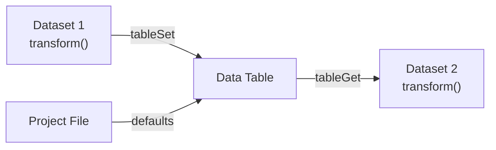

# Data Tables

Shared registers that any dataset transform can read and write. Use them for project-wide constants (calibration factors, thresholds, scale values) and for computed values that need to flow between transforms inside the same frame.

## Overview

A **data table** is a named collection of **registers**. Each register has a name, a type, and a default value, and it stores either a number or a string. Tables are defined once in the Project Editor and saved with the project file. At runtime, every transform can read and write them through a small four-function API.



Tables are useful when:

- Several datasets share the same calibration constant and you want to edit it in one place.
- One transform derives a value (total current, RMS error, CRC) that another transform needs to consume.
- You want a named, typed place for "magic numbers" instead of hard-coding them inside transform scripts.

---

## Register types

Every register is one of two types:

| Type         | Written at                        | Readable by      | Resets between frames                           |
|--------------|-----------------------------------|------------------|-------------------------------------------------|
| **Constant** | Project load only                 | All transforms   | No. Value is fixed for the session              |
| **Computed** | Any transform via `tableSet()`    | All transforms   | Yes. Reset to the default at the start of every frame |

Constants are the right tool for configuration: sensor slopes, offsets, thresholds, full-scale ranges. They can't be modified by `tableSet()` at runtime.

Computed registers are frame-scoped scratch space shared between transforms. A computed register's value survives across transforms inside one frame, but it's wiped back to its default at the start of the next frame. That keeps the model simple, so you never accidentally consume a stale value from the previous frame.

---

## The system table

Serial Studio maintains one built-in table called `__datasets__`, generated automatically from your project. You don't define it, and it doesn't appear in the editor. It mirrors every dataset as two registers:

| Register          | Contents                                                          |
|-------------------|-------------------------------------------------------------------|
| `raw:<uniqueId>`  | Raw value from the frame parser, before the dataset's transform runs |
| `final:<uniqueId>`| Final value after the dataset's transform has run                 |

`<uniqueId>` is the integer unique ID shown next to each dataset in the Project Editor.

In practice you'll rarely read `__datasets__` directly. The convenience functions `datasetGetRaw(uid)` and `datasetGetFinal(uid)` wrap it with a cleaner API and are the recommended way to read dataset values inside a transform.

---

## The transform API

Four functions are injected into every transform engine. Lua and JavaScript behave identically.

| Function                       | Arguments                               | Returns |
|--------------------------------|-----------------------------------------|---------|
| `tableGet(table, reg)`         | table name, register name               | number / string / nil (Lua) / undefined (JS) |
| `tableSet(table, reg, value)`  | table name, register name, number or string | nothing (no-op if the register is a constant or doesn't exist) |
| `datasetGetRaw(uniqueId)`      | integer unique ID                       | number / string / nil / undefined |
| `datasetGetFinal(uniqueId)`    | integer unique ID                       | number / string / nil / undefined |

**Read a constant from a user table:**

```lua
function transform(value)
  local k = tableGet("calibration", "voltage_scale")
  return value * (k or 1.0)
end
```

**Publish a value from one transform, consume it in another:**

```lua
-- Earlier dataset writes a shared value
function transform(value)
  tableSet("runtime", "pack_current", value)
  return value
end
```

```lua
-- Later dataset reads it
function transform(value)
  local i = tableGet("runtime", "pack_current") or 0
  return value * i
end
```

**Compute a derived value in a virtual dataset:**

```lua
function transform(value)
  local a = datasetGetFinal(10)
  local b = datasetGetFinal(11)
  if a == nil or b == nil then return 0 end
  return (a + b) / 2
end
```

See [Dataset Value Transforms](Dataset-Transforms.md#data-table-api) for the per-language quick reference, including the equivalent JavaScript examples.

---

## Processing order and visibility

Transforms are applied sequentially: groups in project order, datasets in group order. Within a single frame:

1. All raw dataset values are populated from the frame parser first.
2. All computed registers are reset to their defaults.
3. Each dataset's transform runs in turn.

That gives these guarantees:

- `datasetGetRaw(uid)` can read any dataset at any time.
- `datasetGetFinal(uid)` only returns a meaningful value for datasets that have already been transformed (that is, datasets earlier in the same group, or in an earlier group).
- Computed registers written by earlier transforms are visible to later ones.
- Nothing written to a computed register leaks into the next frame.

If dataset B depends on dataset A's final value, make sure A is listed before B in the Project Editor tree. Otherwise `datasetGetFinal(A)` will still return the default value from the reset in step 2.

---

## Defining tables in the Project Editor

1. Open the project in the Project Editor.
2. Select the **Tables** node in the tree.
3. Click **Add Table** and give it a name (for example `calibration` or `runtime`).
4. Add registers with **Add Register**. For each register, set:
   - **Name.** Unique within the table.
   - **Type.** Constant or Computed.
   - **Default value.** The numeric or string value used at project load (constants) or at the start of each frame (computed).

Tables are saved with the project file. When the project is shared, anyone opening it gets the same table definitions and defaults.

### Naming rules

Table and register names are free-form strings, but keep them short and descriptive. They appear as string literals in every transform that uses them. Avoid whitespace and non-ASCII characters to keep scripts readable. The name `__datasets__` is reserved for the built-in system table.

---

## Virtual datasets

A virtual dataset has no Frame Index. It receives no value from the frame parser and computes its entire output from transforms. Pair a virtual dataset with a transform that reads other datasets or table registers, and you can add a derived channel that's plotted, exported, and broadcast to the API alongside the real data.

See [Virtual Datasets](Dataset-Transforms.md#virtual-datasets) in the Dataset Transforms reference for usage patterns.

---

## Multi-source projects

Data tables are shared across all sources in a project. A transform on source A can read a computed register written by a transform on source B, as long as both transforms run within the same frame cycle. In practice, per-source frames are processed independently, so cross-source table communication is rarely useful. Prefer keeping each source's tables self-contained unless you specifically need to fuse values across sources.

---

## Rules and limitations

1. Registers hold a number or a string, not arrays or tables. For a vector of values, use multiple registers or multiple datasets.
2. `tableSet()` on a constant register is silently ignored. Constants are frozen at project load.
3. `tableSet()` on a register that doesn't exist is also ignored. There's no auto-creation. Define the register in the Project Editor first.
4. Computed registers reset to their default at the start of every frame. Don't rely on values surviving between frames. Use chunk-local variables in the transform itself for per-dataset state.
5. The `__datasets__` table is reserved. Don't create a user table with that name.
6. Table and register names are case-sensitive.

---

## See also

- [Dataset Value Transforms](Dataset-Transforms.md): how to write the `transform(value)` function and call the data-table API.
- [Project Editor](Project-Editor.md): where tables are defined.
- [Data Flow](Data-Flow.md): where transforms and tables sit in the overall pipeline.
- [Frame Parser Scripting](JavaScript-API.md): `parse(frame)` produces the raw values that transforms consume.
