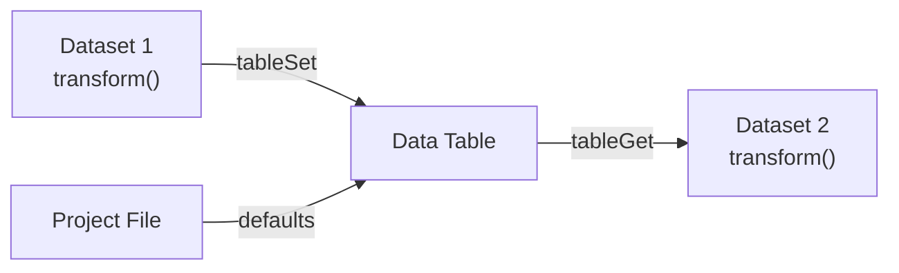

# Data Tables

Shared registers that any dataset transform can read and write. Use them for project-wide constants (calibration factors, thresholds, scale values) and for computed values that flow between transforms, either within a single frame or across frames (running filters, integrators, latched state).

## Overview

A **data table** is a named collection of **registers**. Each register has a name, a type, and a default value, and it stores either a number or a string. Tables are defined once in the Project Editor and saved with the project file. At runtime, every transform can read and write them through a small four-function API.



Tables are useful when:

- Several datasets share the same calibration constant and you want to edit it in one place.
- One transform derives a value (total current, RMS error, CRC) that another transform needs to consume.
- You want a named, typed place for "magic numbers" instead of hard-coding them inside transform scripts.

## Register types

Every register is one of two types:

| Type         | Written at                     | Readable by    | Lifetime                                    |
|--------------|--------------------------------|----------------|---------------------------------------------|
| **Constant** | Project load only              | All transforms | Fixed for the session                       |
| **Computed** | Any transform via `tableSet()` | All transforms | Holds the last value written, indefinitely  |

Constants are the right tool for configuration: sensor slopes, offsets, thresholds, full-scale ranges. They can't be modified by `tableSet()` at runtime.

Computed registers behave like ordinary memory: once you write a value, it stays there until you (or another transform) write again. That matches the way state lives in control and embedded systems: Kalman states, integrators, PID controllers, edge counters, latched flags. If you specifically want a register to start each frame at a known value, write that value at the top of an early transform with `tableSet()`.

## The system table

Serial Studio maintains one built-in table called `__datasets__`, generated automatically from your project. You don't define it, and it doesn't appear in the editor. It mirrors every dataset as two registers:

| Register          | Contents                                                          |
|-------------------|-------------------------------------------------------------------|
| `raw:<uniqueId>`  | Raw value from the frame parser, before the dataset's transform runs |
| `final:<uniqueId>`| Final value after the dataset's transform has run                 |

`<uniqueId>` is the integer unique ID shown next to each dataset in the Project Editor. For the rules around `uniqueId`, `datasetId`, and `index`, see the [Dataset Identity Model](Identity-Model.md).

In practice you'll rarely read `__datasets__` directly. The convenience functions `datasetGetRaw(uid)` and `datasetGetFinal(uid)` wrap it with a cleaner API and are the recommended way to read dataset values inside a transform.

## The transform API

Four functions are injected into every transform engine. Lua and JavaScript behave identically.

| Function                       | Arguments                               | Returns |
|--------------------------------|-----------------------------------------|---------|
| `tableGet(table, reg)`         | table name, register name               | number / string / nil (Lua) / undefined (JS) |
| `tableSet(table, reg, value)`  | table name, register name, number or string | nothing (no-op if the register is a constant or doesn't exist) |
| `datasetGetRaw(uniqueId)`      | integer unique ID                       | number / string / nil / undefined |
| `datasetGetFinal(uniqueId)`    | integer unique ID                       | number / string / nil / undefined |

**Read a constant from a user table:**

```lua
function transform(value)
  local k = tableGet("calibration", "voltage_scale")
  return value * (k or 1.0)
end
```

**Publish a value from one transform, consume it in another:**

```lua
-- Earlier dataset writes a shared value
function transform(value)
  tableSet("runtime", "pack_current", value)
  return value
end
```

```lua
-- Later dataset reads it
function transform(value)
  local i = tableGet("runtime", "pack_current") or 0
  return value * i
end
```

**Compute a derived value in a virtual dataset:**

```lua
function transform(value)
  local a = datasetGetFinal(10)
  local b = datasetGetFinal(11)
  if a == nil or b == nil then return 0 end
  return (a + b) / 2
end
```

See [Dataset Value Transforms](Dataset-Transforms.md#data-table-api) for the per-language quick reference, including the equivalent JavaScript examples.

## Processing order and visibility

Transforms are applied sequentially: groups in project order, datasets in group order. Each dataset is processed in a single pass before moving to the next:

1. The dataset's raw value is written to the system table.
2. The dataset's transform runs (if it has one).
3. The dataset's final value is written to the system table.

That gives these guarantees:

- `datasetGetRaw(uid)` returns a meaningful value only for the current dataset and for datasets earlier in project order. A dataset later in the order still holds whatever raw value the previous frame left there, because its raw write hasn't happened yet.
- `datasetGetFinal(uid)` only returns a meaningful value for datasets that have already been transformed (that is, datasets earlier in the same group, or in an earlier group).
- Computed registers written by earlier transforms are visible to later ones, inside the same frame and on every subsequent frame, until the next write.

If dataset B depends on dataset A's final value, make sure A is listed before B in the Project Editor tree. Otherwise `datasetGetFinal(A)` will return whatever the previous frame left in the register, almost certainly not what you want.

## Defining tables in the Project Editor

1. Open the project in the Project Editor.
2. Select the **Shared Memory** node in the tree.
3. Click **Add Shared Table** and give it a name (for example `calibration` or `runtime`).
4. Add registers with **Add Register**. For each register, set:
   - **Register Name.** Unique within the table.
   - **Permissions.** **Read-Only** (a Constant register) or **Read/Write** (a Computed register).
   - **Default Value.** The numeric or string value used at project load. Read-Only (Constant) registers stay at this value for the whole session; Read/Write (Computed) registers start the session at this value and hold whatever transforms write thereafter.

Tables are saved with the project file. When the project is shared, anyone opening it gets the same table definitions and defaults.

### Naming rules

Table and register names are free-form strings, but keep them short and descriptive. They appear as string literals in every transform that uses them. Avoid whitespace and non-ASCII characters to keep scripts readable. The name `__datasets__` is reserved for the built-in system table.

## Common use cases

Here's a tour of patterns that come up repeatedly in real projects. Each one is a small recipe you can adapt rather than a fully finished template. The shipped **Calibration from Data Table** transform template covers the first pattern; open the transform editor's template picker and use it as a starting point.

### Sensor calibration constants

Problem: several datasets share the same calibration, and every firmware rev, lab recalibration, or field swap forces you to edit each transform by hand.

Solution: store the calibration in a Constant register and read it from the transform.

Table `calibration`:

| Register | Type     | Default | Purpose                       |
|----------|----------|---------|-------------------------------|
| `slope`  | Constant | `0.01`  | V per ADC count               |
| `offset` | Constant | `0.0`   | Zero-offset in volts          |

```lua
function transform(value)
  local slope  = tableGet("calibration", "slope")  or 1.0
  local offset = tableGet("calibration", "offset") or 0.0
  return slope * value + offset
end
```

When the sensor is recalibrated, edit the defaults in the Project Editor. Every dataset using this transform picks up the new values on the next project load.

### Unit conversions that change per deployment

Same pattern, different use. A register called `units_per_count` lets you keep one generic transform but ship the project to customers on metric or imperial units without code changes. Good candidates: `m_to_ft`, `c_to_f`, `psi_to_bar`, `counts_per_rev`.

### Thresholds and alarm limits

Store your warning and critical levels in Constant registers and let a transform return a status code that downstream widgets can color by:

Table `limits`:

| Register  | Type     | Default |
|-----------|----------|---------|
| `warn_lo` | Constant | `10`    |
| `warn_hi` | Constant | `80`    |
| `crit_lo` | Constant | `0`     |
| `crit_hi` | Constant | `95`    |

```lua
function transform(value)
  local wl = tableGet("limits", "warn_lo")
  local wh = tableGet("limits", "warn_hi")
  local cl = tableGet("limits", "crit_lo")
  local ch = tableGet("limits", "crit_hi")
  if value <= cl or value >= ch then return 2  -- critical
  elseif value <= wl or value >= wh then return 1  -- warning
  else return 0 end  -- ok
end
```

Pair this with a [virtual dataset](Dataset-Transforms.md#virtual-datasets) so the status has its own channel without consuming a frame index.

### Derived quantities from other datasets

The classic case: compute power from voltage and current. Create a virtual dataset whose transform reads both channels with `datasetGetFinal()`. The ordering rule matters: both source datasets must come before the derived one in project order.

Assume voltage has uniqueId 10, current has 11:

```lua
function transform(value)
  local v = datasetGetFinal(10)
  local i = datasetGetFinal(11)
  if v == nil or i == nil then return 0 end
  return v * i
end
```

Other classics that fit this shape: IMU accelerometer magnitude `sqrt(ax² + ay² + az²)`, RMS of three phase currents, torque × angular velocity, differential pressure from two absolute pressure channels.

### Cross-dataset scratch pad

If two transforms both need the output of an expensive calculation (an FFT peak, a filtered value, a CRC), compute it once in an earlier dataset, publish it to a Computed register, and read it from the later datasets. The value persists, so the downstream readers see whatever the earlier transform last wrote, within the same frame or carried over from the previous frame if the upstream transform didn't run this time.

Table `runtime`:

| Register      | Type     | Default |
|---------------|----------|---------|
| `filtered_v`  | Computed | `0`     |

```lua
-- Earlier dataset: compute and publish
function transform(value)
  local smoothed = 0.9 * (tableGet("runtime", "filtered_v") or value) + 0.1 * value
  tableSet("runtime", "filtered_v", smoothed)
  return smoothed
end
```

```lua
-- Later dataset: consume without recomputing
function transform(value)
  local f = tableGet("runtime", "filtered_v") or 0
  return value - f  -- residual vs filtered baseline
end
```

### Quality flags that downstream transforms respect

Set a Computed register to a "data valid" flag from one transform and have the others branch on it. Useful when a single out-of-range channel should taint several derived channels:

```lua
-- Range check on a temperature probe
function transform(value)
  if value < -50 or value > 150 then
    tableSet("runtime", "probe_ok", 0)
  else
    tableSet("runtime", "probe_ok", 1)
  end
  return value
end
```

```lua
-- Downstream dataset
function transform(value)
  if (tableGet("runtime", "probe_ok") or 0) == 0 then
    return 0  -- or a sentinel your widgets recognize
  end
  return value
end
```

### Tunable filter parameters

Put the knob (cutoff, alpha, window size) in a Constant register. Keep the filter's running state in a Computed register (or a transform-local upvalue; both work, since Computed registers persist). That separates *configuration* (in a Constant) from *running state*, and lets you re-tune the filter without editing its code.

```lua
function transform(value)
  local alpha = tableGet("filters", "ema_alpha") or 0.1
  local ema   = tableGet("filters", "ema_state")
  if ema == nil then ema = value end
  ema = alpha * value + (1 - alpha) * ema
  tableSet("filters", "ema_state", ema)
  return ema
end
```

### Cross-frame state: integrators, derivatives, latches

Because Computed registers hold the last value written, they're a natural place for state that has to survive between frames, the things every controls engineer recognizes: integrators, derivatives, edge counters, peak detectors, latched alarms. A discrete-time derivative `dT/dt`:

Table `calibration`:

| Register        | Type     | Default |
|-----------------|----------|---------|
| `last_temp`     | Computed | `0`     |
| `last_t_ms`     | Computed | `0`     |

```lua
function transform(_, info)
  if not info then return 0 end
  local T  = datasetGetFinal(2)
  if T == nil then return 0 end
  local ts = info.timestampMs or 0

  local prevT  = tableGet("calibration", "last_temp")
  local prevTs = tableGet("calibration", "last_t_ms")

  tableSet("calibration", "last_temp", T)
  tableSet("calibration", "last_t_ms", ts)

  if prevTs == 0 then return 0 end
  local dt = ts - prevTs
  if dt <= 0 then return 0 end
  return (T - prevT) / (dt / 1000)
end
```

### Nameplate and identity strings

Registers can hold strings, not just numbers. A Constant register with a device serial number, firmware version, or site ID is occasionally useful when a transform produces a string output (for a log message, an MQTT topic, or a console line).

```lua
function transform(value)
  local serial = tableGet("device", "serial") or "unknown"
  return string.format("%s=%.2f", serial, value)
end
```

### What *not* to do

- **Don't put arrays in a register.** Registers are scalars. Use multiple registers or multiple datasets.
- **Don't use a data table as a configuration dialog.** Tables persist with the project file, so editing a Constant register always means saving the project. For UI knobs that change at runtime, use an Output widget instead.
- **Don't assume "first frame" gives sentinel zeros.** Computed registers start at their declared default at project load and then hold whatever transforms write. If your transform depends on detecting the very first sample, branch on `info.frameNumber == 1` rather than on a register being "still zero".

## Virtual datasets

A virtual dataset has no Frame Index. It receives no value from the frame parser and computes its entire output from transforms. Pair a virtual dataset with a transform that reads other datasets or table registers, and you can add a derived channel that's plotted, exported, and broadcast to the API alongside the real data.

See [Virtual Datasets](Dataset-Transforms.md#virtual-datasets) in the Dataset Transforms reference for usage patterns.

## Multi-source projects

Data tables are shared across all sources in a project. A transform on source A can read a computed register written by a transform on source B, as long as both transforms run within the same frame cycle. In practice, per-source frames are processed independently, so cross-source table communication is rarely useful. Prefer keeping each source's tables self-contained unless you specifically need to fuse values across sources.

## Rules and limitations

1. Registers hold a number or a string, not arrays or tables. For a vector of values, use multiple registers or multiple datasets.
2. `tableSet()` on a constant register is silently ignored. Constants are frozen at project load.
3. `tableSet()` on a register that doesn't exist is also ignored. There's no auto-creation. Define the register in the Project Editor first.
4. Computed registers hold their last written value indefinitely. If you want one to start each frame at a known value, write that value with `tableSet()` at the top of an early transform.
5. The `__datasets__` table is reserved. Don't create a user table with that name.
6. Table and register names are case-sensitive.

## See also

- [Dataset Value Transforms](Dataset-Transforms.md): how to write the `transform(value)` function and call the data-table API.
- [Project Editor](Project-Editor.md): where tables are defined.
- [Data Flow](Data-Flow.md): where transforms and tables sit in the overall pipeline.
- [Frame Parser Scripting](JavaScript-API.md): `parse(frame)` produces the raw values that transforms consume.
