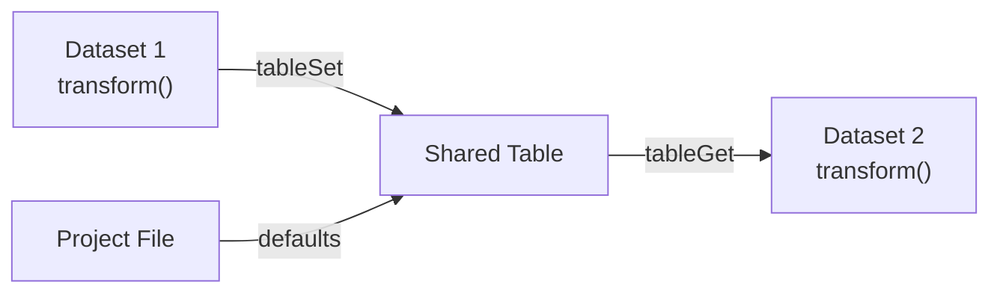

# Variables

*Formerly called Data Tables. The feature and the `RegisterDef`/`registers` project JSON keys are unchanged — only the name shown in the UI and docs changed.*

Shared variables that any dataset transform can read and write. Use them for project-wide constants (calibration factors, thresholds, scale values) and for computed values that flow between transforms, either within a single frame or across frames (running filters, integrators, latched state).

## Overview

A **shared table** is a named collection of **variables**. Each variable has a name, a type, and a default value, and it stores either a number or a string. Tables are defined once in the Project Editor and saved with the project file. At runtime, every transform can read and write them through a small four-function API.


```mermaid
flowchart LR
    A["Dataset 1<br/>transform()"] -->|tableSet| C["Shared Table"]
    C -->|tableGet| B["Dataset 2<br/>transform()"]
    D["Project File"] -->|defaults| C
```

Tables are useful when:

- Several datasets share the same calibration constant and you want to edit it in one place.
- One transform derives a value (total current, RMS error, CRC) that another transform needs to consume.
- You want a named, typed place for "magic numbers" instead of hard-coding them inside transform scripts.

## Variable types

Every variable is one of two types:

| Type         | Written at                     | Readable by    | Lifetime                                    |
|--------------|--------------------------------|----------------|---------------------------------------------|
| **Constant** | Project load only              | All transforms | Fixed for the session                       |
| **Computed** | Any transform via `tableSet()` | All transforms | Holds the last value written, indefinitely  |

Constants are the right tool for configuration: sensor slopes, offsets, thresholds, full-scale ranges. They can't be modified by `tableSet()` at runtime.

Computed variables behave like ordinary memory: once you write a value, it stays there until you (or another transform) write again. That matches the way state lives in control and embedded systems: Kalman states, integrators, PID controllers, edge counters, latched flags. If you specifically want a variable to start each frame at a known value, write that value at the top of an early transform with `tableSet()`.

## The system table

Serial Studio maintains one built-in table called `__datasets__`, generated automatically from your project. You don't define it. It surfaces in the Project Editor only as a read-only **Dataset Values** node under Variables, which lists each dataset's unique ID and its `datasetGetFinal()` access code; you can't edit it. It mirrors every dataset as two variables:

| Variable          | Contents                                                          |
|-------------------|-------------------------------------------------------------------|
| `raw:<uniqueId>`  | Raw value from the frame parser, before the dataset's transform runs |
| `final:<uniqueId>`| Final value after the dataset's transform has run                 |

`<uniqueId>` is the integer unique ID shown next to each dataset in the Project Editor. For the rules around `uniqueId`, `datasetId`, and `index`, see the [Dataset Identity Model](Identity-Model.md).

If a dataset has an alias set (the **Script Alias** field in the Project Editor), the same two variables are also exposed under that name, `raw:<alias>` and `final:<alias>`. This is how a Control Loop or the API reads a dataset value by alias: `tableGet("__datasets__", "final:ATAM1-CH1")` resolves the same value that `datasetGetFinal("ATAM1-CH1")` returns from a transform.

In practice you'll rarely read `__datasets__` directly. The convenience functions `datasetGetRaw(uid)` and `datasetGetFinal(uid)` wrap it with a cleaner API and are the recommended way to read dataset values inside a transform.

## The transform API

Four functions are injected into every transform engine. Lua and JavaScript behave identically.

| Function                       | Arguments                               | Returns |
|--------------------------------|-----------------------------------------|---------|
| `tableGet(table, reg)`         | table name, variable name               | number / string / nil (Lua) / undefined (JS) |
| `tableSet(table, reg, value)`  | table name, variable name, number or string | nothing (no-op if the variable is a constant or doesn't exist) |
| `datasetGetRaw(uniqueId \| alias)`   | integer uniqueId or alias string        | number / string / nil / undefined |
| `datasetGetFinal(uniqueId \| alias)` | integer uniqueId or alias string        | number / string / nil / undefined |

**Read a constant from a user table:**

```lua
function transform(value)
  local k = tableGet("calibration", "voltage_scale")
  return value * (k or 1.0)
end
```

**Publish a value from one transform, consume it in another:**

```lua
-- Earlier dataset writes a shared value
function transform(value)
  tableSet("runtime", "pack_current", value)
  return value
end
```

```lua
-- Later dataset reads it
function transform(value)
  local i = tableGet("runtime", "pack_current") or 0
  return value * i
end
```

**Compute a derived value in a computed dataset:**

```lua
function transform(value)
  local a = datasetGetFinal(10)
  local b = datasetGetFinal(11)
  if a == nil or b == nil then return 0 end
  return (a + b) / 2
end
```

See [Dataset Value Transforms](Dataset-Transforms.md#table-api) for the per-language quick reference, including the equivalent JavaScript examples.

## Processing order and visibility

Transforms are applied sequentially: groups in project order, datasets in group order. Each dataset is processed in a single pass before moving to the next:

1. The dataset's raw value is written to the system table.
2. The dataset's transform runs (if it has one).
3. The dataset's final value is written to the system table.

That gives these guarantees:

- `datasetGetRaw(uid)` returns a meaningful value only for the current dataset and for datasets earlier in project order. A dataset later in the order still holds whatever raw value the previous frame left there, because its raw write hasn't happened yet.
- `datasetGetFinal(uid)` only returns a meaningful value for datasets that have already been transformed (that is, datasets earlier in the same group, or in an earlier group).
- Computed variables written by earlier transforms are visible to later ones, inside the same frame and on every subsequent frame, until the next write.

If dataset B depends on dataset A's final value, make sure A is listed before B in the Project Editor tree. Otherwise `datasetGetFinal(A)` will return whatever the previous frame left in the variable, almost certainly not what you want.

## Defining tables in the Project Editor

1. Open the project in the Project Editor.
2. Select the **Variables** node in the tree.
3. Click **Add Shared Table** and give it a name (for example `calibration` or `runtime`).
4. Add variables with **Add Variable**. For each variable, set:
   - **Variable Name.** Unique within the table.
   - **Permissions.** **Read-Only** (a Constant variable) or **Read/Write** (a Computed variable).
   - **Default Value.** The numeric or string value used at project load. Read-Only (Constant) variables stay at this value for the whole session; Read/Write (Computed) variables start the session at this value and hold whatever transforms write thereafter.

Tables are saved with the project file. When the project is shared, anyone opening it gets the same table definitions and defaults.

### Naming rules

Table and variable names are free-form strings, but keep them short and descriptive. They appear as string literals in every transform that uses them. Avoid whitespace and non-ASCII characters to keep scripts readable. The name `__datasets__` is reserved for the built-in system table.

## Common use cases

Here's a tour of patterns that come up repeatedly in real projects. Each one is a small recipe you can adapt rather than a fully finished template. The shipped **Calibration from Data Table** transform template covers the first pattern; open the transform editor's template picker and use it as a starting point.

### Sensor calibration constants

Problem: several datasets share the same calibration, and every firmware rev, lab recalibration, or field swap forces you to edit each transform by hand.

Solution: store the calibration in a Constant variable and read it from the transform.

Table `calibration`:

| Variable | Type     | Default | Purpose                       |
|----------|----------|---------|-------------------------------|
| `slope`  | Constant | `0.01`  | V per ADC count               |
| `offset` | Constant | `0.0`   | Zero-offset in volts          |

```lua
function transform(value)
  local slope  = tableGet("calibration", "slope")  or 1.0
  local offset = tableGet("calibration", "offset") or 0.0
  return slope * value + offset
end
```

When the sensor is recalibrated, edit the defaults in the Project Editor. Every dataset using this transform picks up the new values on the next project load.

### Unit conversions that change per deployment

Same pattern, different use. A variable called `units_per_count` lets you keep one generic transform but ship the project to customers on metric or imperial units without code changes. Good candidates: `m_to_ft`, `c_to_f`, `psi_to_bar`, `counts_per_rev`.

### Thresholds and alarm limits

Store your warning and critical levels in Constant variables and let a transform return a status code that downstream widgets can color by:

Table `limits`:

| Variable  | Type     | Default |
|-----------|----------|---------|
| `warn_lo` | Constant | `10`    |
| `warn_hi` | Constant | `80`    |
| `crit_lo` | Constant | `0`     |
| `crit_hi` | Constant | `95`    |

```lua
function transform(value)
  local wl = tableGet("limits", "warn_lo")
  local wh = tableGet("limits", "warn_hi")
  local cl = tableGet("limits", "crit_lo")
  local ch = tableGet("limits", "crit_hi")
  if value <= cl or value >= ch then return 2  -- critical
  elseif value <= wl or value >= wh then return 1  -- warning
  else return 0 end  -- ok
end
```

Pair this with a [computed dataset](Dataset-Transforms.md#computed-datasets) so the status has its own channel without consuming a frame index.

### Derived quantities from other datasets

The classic case: compute power from voltage and current. Create a computed dataset whose transform reads both channels with `datasetGetFinal()`. The ordering rule matters: both source datasets must come before the derived one in project order.

Assume voltage has uniqueId 10, current has 11:

```lua
function transform(value)
  local v = datasetGetFinal(10)
  local i = datasetGetFinal(11)
  if v == nil or i == nil then return 0 end
  return v * i
end
```

If the source datasets have aliases, the same transform reads by name, which keeps it readable in a large project: `datasetGetFinal("voltage")` and `datasetGetFinal("current")`.

Other classics that fit this shape: IMU accelerometer magnitude `sqrt(ax² + ay² + az²)`, RMS of three phase currents, torque × angular velocity, differential pressure from two absolute pressure channels.

### Cross-dataset scratch pad

If two transforms both need the output of an expensive calculation (an FFT peak, a filtered value, a CRC), compute it once in an earlier dataset, publish it to a Computed variable, and read it from the later datasets. The value persists, so the downstream readers see whatever the earlier transform last wrote, within the same frame or carried over from the previous frame if the upstream transform didn't run this time.

Table `runtime`:

| Variable      | Type     | Default |
|---------------|----------|---------|
| `filtered_v`  | Computed | `0`     |

```lua
-- Earlier dataset: compute and publish
function transform(value)
  local smoothed = 0.9 * (tableGet("runtime", "filtered_v") or value) + 0.1 * value
  tableSet("runtime", "filtered_v", smoothed)
  return smoothed
end
```

```lua
-- Later dataset: consume without recomputing
function transform(value)
  local f = tableGet("runtime", "filtered_v") or 0
  return value - f  -- residual vs filtered baseline
end
```

### Quality flags that downstream transforms respect

Set a Computed variable to a "data valid" flag from one transform and have the others branch on it. Useful when a single out-of-range channel should taint several derived channels:

```lua
-- Range check on a temperature probe
function transform(value)
  if value < -50 or value > 150 then
    tableSet("runtime", "probe_ok", 0)
  else
    tableSet("runtime", "probe_ok", 1)
  end
  return value
end
```

```lua
-- Downstream dataset
function transform(value)
  if (tableGet("runtime", "probe_ok") or 0) == 0 then
    return 0  -- or a sentinel your widgets recognize
  end
  return value
end
```

### Tunable filter parameters

Put the knob (cutoff, alpha, window size) in a Constant variable. Keep the filter's running state in a Computed variable (or a transform-local upvalue; both work, since Computed variables persist). That separates *configuration* (in a Constant) from *running state*, and lets you re-tune the filter without editing its code.

```lua
function transform(value)
  local alpha = tableGet("filters", "ema_alpha") or 0.1
  local ema   = tableGet("filters", "ema_state")
  if ema == nil then ema = value end
  ema = alpha * value + (1 - alpha) * ema
  tableSet("filters", "ema_state", ema)
  return ema
end
```

### Cross-frame state: integrators, derivatives, latches

Because Computed variables hold the last value written, they're a natural place for state that has to survive between frames, the things every controls engineer recognizes: integrators, derivatives, edge counters, peak detectors, latched alarms. A discrete-time derivative `dT/dt`:

Table `runtime`:

| Variable        | Type     | Default |
|-----------------|----------|---------|
| `last_temp`     | Computed | `0`     |
| `last_t_ms`     | Computed | `0`     |

```lua
function transform(_, info)
  if not info then return 0 end
  local T  = datasetGetFinal(2)
  if T == nil then return 0 end
  local ts = info.timestampMs or 0

  local prevT  = tableGet("runtime", "last_temp")
  local prevTs = tableGet("runtime", "last_t_ms")

  tableSet("runtime", "last_temp", T)
  tableSet("runtime", "last_t_ms", ts)

  if prevTs == 0 then return 0 end
  local dt = ts - prevTs
  if dt <= 0 then return 0 end
  return (T - prevT) / (dt / 1000)
end
```

### Nameplate and identity strings

Variables can hold strings, not just numbers. A Constant variable with a device serial number, firmware version, or site ID is occasionally useful when a transform produces a string output (for a log message, an MQTT topic, or a console line).

```lua
function transform(value)
  local serial = tableGet("device", "serial") or "unknown"
  return string.format("%s=%.2f", serial, value)
end
```

### What *not* to do

- **Don't put arrays in a variable.** Variables are scalars. Use multiple variables or multiple datasets.
- **Don't use a shared table as a configuration dialog.** Tables persist with the project file, so editing a Constant variable always means saving the project. For UI knobs that change at runtime, use an Output widget instead.
- **Don't assume "first frame" gives sentinel zeros.** Computed variables start at their declared default at project load and then hold whatever transforms write. If your transform depends on detecting the very first sample, branch on `info.frameNumber == 1` rather than on a variable being "still zero".

## Computed datasets

A computed dataset has no Frame Index. It receives no value from the frame parser and computes its entire output from transforms. Pair a computed dataset with a transform that reads other datasets or table variables, and you can add a derived channel that's plotted, exported, and broadcast to the API alongside the real data.

See [Computed Datasets](Dataset-Transforms.md#computed-datasets) in the Dataset Transforms reference for usage patterns.

## Multi-source projects

Shared tables span all sources in a project. A transform on source A can read a computed variable written by a transform on source B, as long as both transforms run within the same frame cycle. In practice, per-source frames are processed independently, so cross-source table communication is rarely useful. Prefer keeping each source's tables self-contained unless you specifically need to fuse values across sources.

## Rules and limitations

1. Variables hold a number or a string, not arrays or tables. For a vector of values, use multiple variables or multiple datasets.
2. `tableSet()` on a constant variable has no effect. Constants are frozen at project load, and Serial Studio logs a warning to the Console panel when the write is attempted.
3. `tableSet()` on a variable that doesn't exist is also ignored. There's no auto-creation. Define the variable in the Project Editor first.
4. Computed variables hold their last written value indefinitely. If you want one to start each frame at a known value, write that value with `tableSet()` at the top of an early transform.
5. The `__datasets__` table name is reserved for the built-in system table. The Project Editor doesn't stop you from naming a user table `__datasets__`; avoid it anyway to prevent a naming collision with the system table's variables.
6. Table and variable names are case-sensitive.

## See also

- [Dataset Value Transforms](Dataset-Transforms.md): how to write the `transform(value)` function and call the table API.
- [Project Editor](Project-Editor.md): where tables are defined.
- [Data Flow](Data-Flow.md): where transforms and tables sit in the overall pipeline.
- [Frame Parser Scripting](JavaScript-API.md): `parse(frame)` produces the raw values that transforms consume.
