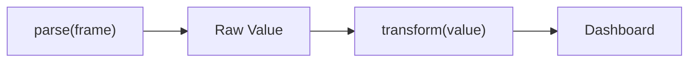

# Dataset value transforms

Per-dataset scripting for calibration, unit conversion, filtering, and signal conditioning. Each dataset can optionally define a `transform(value)` function that converts the raw parsed value into an engineering value before it reaches the dashboard.

## Overview

The frame parser (`parse(frame)`) produces an array of raw values. Each value is mapped to a dataset by its Frame Index. Before the value reaches the dashboard, an optional transform function can modify it:



Transforms are useful when:

- Your device sends raw ADC counts that need calibration (slope + offset).
- You need unit conversion (Celsius to Fahrenheit, radians to degrees).
- The signal is noisy and needs filtering (moving average, EMA, low-pass).
- You want derived values (rate of change, running total, dB conversion).
- Sensor non-linearity needs polynomial correction or a lookup table.

Transforms are optional. Datasets without one display the raw parsed value unchanged.

A transform can also read and write **shared data tables**: constants defined at project time, and computed registers that hold their value across frames. That's how you pass a calibration value into several channels, have one transform compute a value that another consumes, or keep state for an integrator, filter, or latch. See [Data Tables](Data-Tables.md) for the full reference.

## The `transform()` function

### Signature

**Lua:**

```lua
function transform(value)
  return value * 0.01 + 273.15
end
```

**JavaScript:**

```javascript
function transform(value) {
    return value * 0.01 + 273.15;
}
```

### Input

The `value` parameter is the value already parsed from the frame and mapped to this dataset by its Frame Index. When the parsed value is numeric it arrives as a floating-point number (Lua `number` / JS `number`); when it isn't, it arrives as a string (Lua `string` / JS `string`).

Non-numeric dataset values are still passed to the transform as a string. If the transform returns a number, the dataset becomes numeric; if it returns a string, the string value is kept.

### Output

The function returns a number, or a string for text datasets (a returned string is kept as the dataset value). The returned value replaces the raw value everywhere: dashboard widgets, plots, CSV export, MDF4 export, and the API.

If the function returns `nil` (Lua), `undefined`/`NaN`/`Infinity` (JS), or if an error happens, the raw value is kept unchanged so the data stream isn't interrupted. JavaScript exceptions fall back silently; a Lua error also logs a warning (with the error message and dataset ID) to the application log.

## Persistent state

Variables declared at the top level of the transform code (outside the `transform()` function) persist between frames. That's how filters, accumulators, and other stateful transforms keep state across calls.

The key rule: use `local` (Lua) or `var` (JavaScript) at the top of the file. Don't rely on bare globals. Serial Studio isolates each dataset's top-level state so two datasets using the same template (for example two EMAs on two different channels) can't clobber each other's variables.

**Lua: declare `local` at the top of the file:**

```lua
local alpha = 0.1
local ema

function transform(value)
  if ema == nil then
    ema = value
  end

  ema = alpha * value + (1 - alpha) * ema
  return ema
end
```

`alpha` and `ema` are chunk locals. Lua captures them as upvalues of the `transform` closure, so they survive between calls and they're private to this dataset. Another dataset on the same source with its own `local ema` won't see or overwrite this one.

**JavaScript: declare `var` at the top of the file:**

```javascript
var alpha = 0.1;
var ema;

function transform(value) {
  if (ema === undefined)
    ema = value;

  ema = alpha * value + (1 - alpha) * ema;
  return ema;
}
```

Serial Studio wraps every JavaScript transform in an IIFE at compile time, so top-level `var` declarations are scoped to that dataset's closure, not the shared engine's global object. You get the same isolation as Lua without any extra effort.

### What NOT to do

In JavaScript, avoid bare globals: an implicit global is written to the shared engine's global object and will collide with other datasets on the same source. In Lua each dataset chunk gets its own private environment, so a bare global stays isolated per dataset and won't collide. Declaring `local` is still recommended in Lua for clarity and to match the JavaScript rule:

```lua
-- Lua: this works (ema is isolated to this dataset), but local is clearer
function transform(value)
  ema = ema or value
  ema = 0.1 * value + 0.9 * ema
  return ema
end
```

```javascript
// WRONG in JavaScript: ema without var is an implicit global
// on the shared engine, so another dataset with the same mistake
// would clobber it. Always declare var at the top.
function transform(value) {
  if (typeof ema === 'undefined') ema = value;
  ema = 0.1 * value + 0.9 * ema;
  return ema;
}
```

Always declare stateful variables with `local`/`var` at the top of the file. It also makes the code easier to read: someone scanning the top of the transform can see at a glance which variables carry state.

### Helper functions

In JavaScript, helpers defined at the top of the file (for example `function clamp(x, lo, hi) { ... }`) are also closed over by the IIFE and private per dataset. Safe to use.

### Virtual datasets

A dataset can be marked **virtual** in the Project Editor. A virtual dataset has no Frame Index: nothing in the incoming frame feeds it. Its value is computed entirely by the `transform()` function, typically by reading other datasets or table registers. The `value` argument passed in is always `0`.

```lua
function transform(value)
  local a = datasetGetFinal(10)   -- reads the final value of dataset with unique ID 10
  local b = datasetGetFinal(11)
  return (a + b) / 2              -- average of two channels
end
```

Use virtual datasets for derived metrics (averages, ratios, sums, percentage-of-total) that should show up on the dashboard and be exported alongside the raw channels, but that aren't present in the wire format.

In Lua, use `local function` for helpers so they share the isolation:

```lua
local function clamp(x, lo, hi)
  if x < lo then return lo end
  if x > hi then return hi end
  return x
end

function transform(value)
  return clamp(value, 0, 100)
end
```

A plain `function foo() end` at chunk top level in Lua defines a global, but that global stays in this dataset's private environment, so it won't collide with other datasets. Prefixing helpers with `local function` is still recommended for clarity.

### When state resets

Persistent state (both top-level Lua/JS upvalues *and* Computed table registers) is cleared when:

- The device is disconnected (transform engines are destroyed).
- The user clicks **Apply** in the transform editor (engines are recompiled with fresh state).
- The project is reloaded or saved with changes.

So filters and accumulators start from scratch on each new connection session, which is usually what you want. Within a connection session, Computed registers and transform upvalues hold their values indefinitely; they aren't wiped between frames.

## Data Table API

Every transform has access to four built-in functions for reading and writing the project's data tables. Tables are covered in full in [Data Tables](Data-Tables.md). This section documents the API surface from the transform's point of view.

| Function                       | Returns                        | Purpose |
|--------------------------------|--------------------------------|---------|
| `tableGet(table, reg)`         | number, string, or nil/undefined | Read a user-defined register |
| `tableSet(table, reg, value)`  | nothing                        | Write a **computed** register (constants are read-only) |
| `datasetGetRaw(uniqueId)`      | number, string, or nil/undefined | Raw (pre-transform) value of any dataset in the current frame |
| `datasetGetFinal(uniqueId)`    | number, string, or nil/undefined | Final (post-transform) value of any dataset already processed in the current frame |

The API is identical in Lua and JavaScript. `table` and `reg` are strings. `uniqueId` is the integer unique ID shown next to each dataset in the Project Editor.

For a transform that touches the same registers on every value, resolving a name once to a **handle** and using `tableGetH` / `tableSetH` avoids the per-call name lookup. See [Fast table access with handles](SerialStudio-SDK.md#handles-the-fast-path-for-table-heavy-parsers).

**Lua example: scale a voltage reading by a project-wide calibration factor:**

```lua
function transform(value)
  local k = tableGet("calibration", "voltage_scale")  -- constant
  return value * (k or 1.0)
end
```

**JavaScript example: same idea.**

```javascript
function transform(value) {
  var k = tableGet("calibration", "voltage_scale");
  return value * (k !== undefined ? k : 1.0);
}
```

**Writing to a computed register. One transform publishes, another consumes:**

```lua
-- Dataset 10 (processed first): publish the total current
function transform(value)
  tableSet("runtime", "total_current", value)
  return value
end
```

```lua
-- Dataset 20 (processed later): compute power from current × voltage
function transform(value)
  local i = tableGet("runtime", "total_current") or 0
  return value * i
end
```

### Processing order

Transforms are applied in order: groups in frame order, datasets in group order. Inside a single frame:

- `datasetGetRaw(uid)` returns the current frame's raw value only for the current dataset and the ones already processed before it. Later datasets still hold the previous frame's raw value, because raw and final values are written incrementally per dataset, not in a pre-pass.
- `datasetGetFinal(uid)` only works for datasets that have already been transformed (earlier datasets in the same group, or any dataset in an earlier group).
- Computed registers hold their last written value, so a value written in one frame is still visible in the next, handy for integrators, derivatives, and latched flags. If you specifically want a register to start each frame fresh, write the reset value yourself at the top of an early transform.

If you need dataset B to consume dataset A's final value, make sure A comes before B in the Project Editor tree.

## Change-driven transforms (opt-in)

By default every dataset's transform runs on every frame. For a large table-driven project, where the frame parser writes table registers and many virtual datasets each read one register, that means a frame for one device re-runs the transforms of *every* dataset, even the ones whose data did not change.

The **Change-driven transforms** toggle in the Project Editor's Project Summary turns on a faster mode: a virtual dataset's transform runs only when one of the registers (or datasets) it reads has changed since it last ran; otherwise it keeps its previous output for that frame. Serial Studio discovers what each transform reads automatically, so you change nothing in your scripts. The dashboard shows the same values either way; the option just skips recomputing values that did not change.

It is **off by default** and saved per project. Turn it on for heavy table-driven dashboards that are dropping frames. Two things to know:

- A per-sample filter (an EMA, a deadband) then steps once per *real* new sample of its input rather than once per global frame, which is what you usually want.
- If a virtual dataset's output depends on something Serial Studio cannot see as an input — wall-clock time read directly inside the transform (`Date.now()`, `os.time()`) rather than a value passed through a table or `frameInfo` — leave this off for that project, or keep such datasets non-virtual, since the transform may not re-run on time alone.

## Frame metadata: the second `frameInfo` argument

Every transform may declare a second argument with metadata about the frame the value belongs to. One-arg transforms (`function transform(value)`) keep working and pay no extra cost: the engine inspects each transform's parameter count at compile time and skips building the info table or object entirely when it isn't used.

```lua
function transform(value, info)
  -- info.frameNumber : integer, monotonic counter per source (starts at 1)
  -- info.sourceId    : integer, the source the dataset belongs to
  -- info.timestampMs : integer, monotonic milliseconds (steady clock)
  return value
end
```

```javascript
function transform(value, info) {
  // info.frameNumber : number
  // info.sourceId    : number
  // info.timestampMs : number
  return value;
}
```

`info.timestampMs` is a **monotonic** millisecond counter taken from the OS steady clock. It increases between consecutive frames but is not wall-clock time and does not match `Date.now()`. Use it for deltas (`info.timestampMs - lastTs`), not for "what time is it now".

`info.frameNumber` is per-source and restarts at 1 after a disconnect or project reload.

### Example: rate-limit a control update

A transform that nudges the device's setpoint, but no more than ten times per second regardless of frame rate:

```lua
local lastTs = 0
function transform(temperature, info)
  if info.timestampMs - lastTs >= 100 then
    lastTs = info.timestampMs
    local sp = tableGet("Control", "setpoint") or 25.0
    deviceWrite(string.format("SP=%.2f\n", sp))
  end
  return temperature
end
```

### Example: request a status push every 50th frame

```javascript
function transform(value, info) {
  if (info.frameNumber % 50 === 0) deviceWrite("STATUS?\n");
  return value;
}
```

## Writing back to the device: `deviceWrite()`

Transforms can send bytes back to the connected device with `deviceWrite(data, sourceId?)`. The intended use is **closed-loop control**: read a sensor value, compute a setpoint or correction, and push it back to the device in one step.

### Signature

```text
deviceWrite(data, sourceId?)
  data:     string (Lua) or string / array of bytes (JavaScript)
  sourceId: optional number; defaults to the source the transform's dataset belongs to
  returns:  { ok = true }                  on success
            { ok = false, error = "..." }  on failure
```

`deviceWrite` is **synchronous and fire-and-forget**: it pushes the bytes to the driver immediately. It does not block waiting for a reply, and it does not throw. Every failure becomes `{ ok = false, error = "..." }`.

Every call is logged to the application log as `[deviceWrite] source=<id> bytes=<n> written=<n>` so you can verify control commands fired the way you expected.

### Lua example: PWM controller

```lua
local kp = 4.0
local setpoint = 25.0

function transform(sensor_temp)
  local error = setpoint - sensor_temp
  local pwm = math.max(0, math.min(255, kp * error + 128))
  deviceWrite(string.format("PWM=%d\n", math.floor(pwm + 0.5)))
  return sensor_temp
end
```

The transform returns the raw temperature unchanged (so the dashboard still shows the measured value) and writes the computed PWM duty cycle back on every frame.

### JavaScript example: alarm latch

```javascript
let triggered = false;

function transform(value) {
  if (!triggered && value > 100) {
    const r = deviceWrite("ALARM=1\n");
    if (r.ok) triggered = true;
    else console.warn("alarm write failed:", r.error);
  }
  return value;
}
```

The `triggered` upvalue keeps `deviceWrite` from firing on every subsequent frame after the alarm condition latches.

### Targeting another source

Pass an explicit `sourceId` to write to a different source. Useful when telemetry arrives on one source and the device's command channel lives on another:

```lua
function transform(value)
  if value < 5 then
    deviceWrite("REQ_FULL_REPORT\n", 0)  -- ask source 0 for a full status frame
  end
  return value
end
```

### Failure modes

`deviceWrite` never throws. Possible `error` values:

- `"device not connected or write failed"`: the target source has no live driver, or the driver's `write()` returned 0/negative.
- `"deviceWrite: data is empty"`: the payload was zero bytes.
- `"deviceWrite: data must be a string"` (Lua) / `"... string or byte array"` (JS).
- `"deviceWrite: sourceId must be a number"`.

### When NOT to use it

- For a button or slider the user clicks, use an **Output Widget**. Transforms run on every frame; an Output Widget runs when the user acts.
- Don't `deviceWrite` from a virtual dataset unless you understand its execution order. Virtual datasets are processed in tree order like any other dataset (they are not automatically processed last), so a virtual dataset only sees the *final* values of datasets that come before it. Place it after its inputs. It still fires every frame.
- Don't write large payloads on every frame. The transform hotpath is shared with all datasets in the source; a noisy `deviceWrite` saturates the link.

## Firing actions: `actionFire()`

Transforms can also trigger any **Action** already defined in the project (see [Actions](Actions.md)). Reuse an existing action (with its prebuilt payload, encoding, and timer mode) instead of hardcoding bytes in a `deviceWrite`.

```text
actionFire(actionId)
  actionId: integer (the action's stable identifier)
  returns:  { ok = true } | { ok = false, error = "..." }
```

`actionId` is the action's `actionId` field: the same persistent integer the project file stores and the API returns. It is **not** the position in the action list. Find it with `project.action.list` (MCP) or read it off the Actions panel in the Project Editor.

```lua
local triggered = false
function transform(value, info)
  if not triggered and value > 100 then
    local r = actionFire(7)
    if r.ok then triggered = true end
  end
  return value
end
```

Behaves like the user pressing the action's button, including running the action's timer (`AutoStart`, `RepeatNTimes`, ...). Calls are logged as `[actionFire] id=N index=M ok`.

`actionFire` is also available in frame parsers and painter scripts.

## Controlling the dashboard

Transforms can also drive a small set of dashboard helpers: `clearPlots()`, `setPlotPoints(n)`, `setTerminalVisible(bool)`, `setNotificationLogVisible(bool)`, `setClockVisible(bool)`, `setStopwatchVisible(bool)`, and `setActiveWorkspace(idOrName)`. They behave the same way they do in parsers and return the same `{ ok, error }` shape. The typical pattern from a transform is "fire once on a state transition", for example:

```lua
function transform(value)
  if value >= 9999 then    -- device reboot sentinel
    clearPlots()
    return 0
  end
  return value
end
```

Full reference, including argument types and longer examples (GPS fix reset, mode-driven workspace switching, focus mode): see [Controlling the dashboard](JavaScript-API.md#controlling-the-dashboard-clearplots-and-friends) in the Frame Parser Scripting Reference.

## Using the Transform Editor

1. Select a dataset in the Project Editor tree.
2. Click the **Transform** button in the dataset toolbar.
3. The Transform Editor opens with:
   - **Language selector.** Lua or JavaScript. Defaults to the source's frame parser language, but each dataset can pick its own.
   - **Template dropdown.** 34 ready-made transforms for common operations.
   - **Code editor.** Syntax-highlighted, with auto-completion.
   - **Test area.** Enter a raw value, click Test, see the transformed output.
4. Write or pick a `transform(value)` function.
5. Click **Apply** to save the transform to the dataset.

When you open the editor on a dataset with no transform yet, it's pre-filled with a multiline comment explaining how `transform(value)` works and how top-level `local`/`var` state is captured. The placeholder isn't a real transform. If you click Apply without defining a `transform()` function, the placeholder is discarded and the dataset keeps showing raw values. Same rule if you later clear the code or write notes that never define `transform()`: nothing is saved to the project.

### Switching languages

When you switch the language dropdown, the editor loads the equivalent template in the new language automatically (if the current code matches a known template). Custom code is left unchanged. Only the syntax highlighter switches.

## Built-in templates

The Transform Editor includes 34 ready-to-use templates. Pick one from the Template dropdown and it loads into the editor ready to tune.

### Calibration and conversion

| Template                | Description |
|-------------------------|-------------|
| Linear Calibration      | `y = slope × value + offset`. Sensor calibration. |
| Polynomial (2nd order)  | `y = a×x² + b×x + c`. Non-linear response curves. |
| Map Range               | Rescale from `[inMin, inMax]` to `[outMin, outMax]`. |
| ADC to Voltage          | 10-bit ADC count to voltage (3.3 V reference). |
| Calibration from Data Table | Read slope/offset from a data table register and apply it. |

### Smoothing filters

| Template                         | Description |
|----------------------------------|-------------|
| Moving Average                   | Averages the last N samples via a circular buffer. |
| Exponential Moving Average (EMA) | Weighted average, tunable responsiveness (alpha). |
| Low-Pass Filter                  | First-order IIR, adjustable cutoff via alpha. |
| High-Pass Filter                 | First-order IIR. Removes DC drift and slow offsets. |
| Median Filter                    | Rolling-window median. Robust to outlier spikes. |
| Kalman Filter (1D)               | Scalar Kalman filter with tunable Q (process) and R (measurement) noise. |

### Statistical

| Template              | Description |
|-----------------------|-------------|
| Rolling RMS           | Root-mean-square over the last N samples. Useful for AC signals, vibration, audio. |
| Running Minimum       | Smallest value observed since the transform started. |
| Running Maximum       | Largest value observed since the transform started. |
| Running Accumulator   | Discrete integral (running sum). |
| Rate of Change        | Discrete derivative (`value - previous`). |

### Signal shaping

| Template             | Description |
|----------------------|-------------|
| Clamp                | Restrict output to `[min, max]`. |
| Dead Zone            | Suppress small values near zero. |
| Slew-Rate Limiter    | Cap how much the value can change between consecutive samples. |
| Auto-Zero / Tare     | Average the first N samples, then subtract that bias from every later value. |
| Schmitt Trigger      | Hysteresis comparator. Outputs 0/1 with separate rising and falling thresholds. |

### Angle math

| Template                  | Description |
|---------------------------|-------------|
| Unwrap Angle              | Remove ±360° jumps so the output is continuous across the boundary. |
| Integrate Rate to Angle   | Integrate an angular rate (deg/s) into an absolute angle at a fixed sample rate. |
| Radians to Degrees        | deg = rad × 180/π. |
| Degrees to Radians        | rad = deg × π/180. |

### Unit conversions

| Template                  | Description |
|---------------------------|-------------|
| Celsius to Fahrenheit     | °F = °C × 9/5 + 32. |
| Fahrenheit to Celsius     | °C = (°F - 32) × 5/9. |
| Kelvin to Celsius         | °C = K - 273.15. |
| Logarithmic (dB)          | Convert linear amplitude to decibels. |

### Logic and bit operations

| Template             | Description |
|----------------------|-------------|
| Bit Extract          | Return a single bit from a packed status word (0 or 1). |
| Absolute Value       | Unsigned magnitude. |
| Invert Sign          | Negate the value. |
| Round to N Decimals  | Precision control. |

### Sensors

| Template                    | Description |
|-----------------------------|-------------|
| Steinhart-Hart Thermistor   | NTC resistance to temperature (°C). |

## How transforms fit into the data pipeline

Serial Studio processes data in a clear pipeline. Knowing where transforms sit helps you decide what belongs in `parse()` vs `transform()`.

| Stage                 | Function          | Scope        | Purpose |
|-----------------------|-------------------|--------------|---------|
| **Frame parser**      | `parse(frame)`    | Per-source   | Decode raw bytes into an array of values |
| **Dataset transform** | `transform(value)`| Per-dataset  | Convert raw values to engineering units |
| **Dashboard**         | (n/a)             | Per-widget   | Display the final values |

**Rule of thumb:**

- The frame parser handles protocol decoding: byte extraction, bit manipulation, CRC validation, multi-message state machines. It deals with the wire format.
- The dataset transform handles value conditioning: calibration, unit conversion, filtering, derived calculations. It deals with physical meaning.

That separation keeps parsers focused on protocol logic and transforms focused on sensor characteristics. You can reuse the same parser across different projects with different calibrations by changing only the per-dataset transforms.

## Practical examples

### Example 1: linear calibration

A pressure sensor outputs raw ADC counts (0 to 4095). The datasheet says 0 = 0 PSI, 4095 = 100 PSI:

```lua
function transform(value)
  return value * 100 / 4095
end
```

### Example 2: noisy temperature sensor

An RTD sensor fluctuates ±0.5°C around the true value. Smooth it with EMA:

```lua
local alpha = 0.15
local ema

function transform(value)
  if ema == nil then
    ema = value
  end

  ema = alpha * value + (1 - alpha) * ema
  return ema
end
```

Both `alpha` and `ema` are declared `local` at the top of the file, so Lua captures them as upvalues of the `transform` closure. State persists between frames and is private to this dataset. Another dataset on the same source can use the same EMA template with its own `local ema` without interference.

### Example 3: compass heading normalization

A magnetometer reports heading in radians. Convert to degrees and clamp to 0 to 360:

```lua
function transform(value)
  local degrees = value * 180 / math.pi
  return degrees % 360
end
```

### Example 4: battery voltage with dead zone

A battery monitor fluctuates around 0 V when disconnected. Suppress noise below 0.5 V:

```lua
function transform(value)
  if value < 0.5 then
    return 0
  end

  return value
end
```

### Example 5: speed in km/h from m/s

```lua
function transform(value)
  return value * 3.6
end
```

## Rules and limitations

1. The function has to be named `transform` (case-sensitive).
2. It takes one required parameter (`value`), plus an optional second parameter (`info`) with frame metadata (`frameNumber`, `sourceId`, `timestampMs`).
3. It has to return a number, or a string for text datasets (a returned string is kept as the dataset value).
4. Returning `nil`, `NaN`, or `Infinity` falls back to the raw value, as does a script error (silent in JavaScript; logged in Lua).
5. Each dataset picks its own transform language (Lua or JavaScript); datasets on the same source can mix the two. The source's frame parser language is only the default when none is picked.
6. Datasets on the same source share one underlying scripting engine, but each dataset's top-level state is isolated. In JavaScript, declare stateful variables with `var`: an implicit (undeclared) global is written to the shared engine and leaks across datasets. In Lua each dataset chunk has its own environment, so bare globals (and `function foo() end` at chunk top level) stay isolated per dataset; `local` is still recommended for clarity and consistency with the JavaScript rule.
7. The engine is sandboxed: no file I/O, no network, no OS commands.
8. Transforms run on every incoming frame, so keep them fast. Avoid unbounded loops or heavy computation.

## See also

- [SDK Reference](SerialStudio-SDK.md): the full helper surface a transform can call (`tableGet`/`tableSet`, `deviceWrite`, `actionFire`, notifications, protocol encoders).
- [Frame Parser Scripting](JavaScript-API.md): the `parse(frame)` function that feeds values to transforms.
- [Data Tables](Data-Tables.md): shared constants and computed registers available to every transform.
- [Data Flow](Data-Flow.md): how data moves from device through parsing, transforms, and into the dashboard.
- [Project Editor](Project-Editor.md): where you configure datasets, transforms, and tables.
- [Widget Reference](Widget-Reference.md): dashboard widgets that display transformed values.
