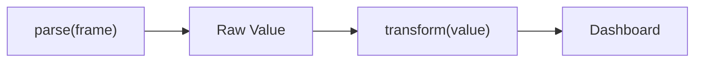

# Dataset Value Transforms

Per-dataset scripting for calibration, unit conversion, filtering, and signal conditioning. Each dataset can optionally define a `transform(value)` function that converts the raw parsed value into an engineering value before it reaches the dashboard.

## Overview

The frame parser (`parse(frame)`) produces an array of raw values. Each value is mapped to a dataset by its Frame Index. **Before** the value reaches the dashboard, an optional transform function can modify it:



Transforms are useful when:

- Your device sends raw ADC counts that need calibration (slope + offset)
- You need unit conversion (Celsius → Fahrenheit, radians → degrees)
- The signal is noisy and needs filtering (moving average, EMA, low-pass)
- You want derived values (rate of change, running total, dB conversion)
- Sensor non-linearity requires polynomial correction or lookup tables

Transforms are optional. Datasets without a transform function display the raw parsed value unchanged.

---

## The `transform()` Function

### Signature

**Lua (default):**
```lua
function transform(value)
  return value * 0.01 + 273.15
end
```

**JavaScript:**
```javascript
function transform(value) {
    return value * 0.01 + 273.15;
}
```

### Input

The `value` parameter is the **numeric** value already parsed from the frame and mapped to this dataset by its Frame Index. It is a floating-point number (Lua `number` / JS `number`).

Non-numeric dataset values (strings) skip the transform entirely — the raw string is displayed as-is.

### Output

The function must return a **number**. The returned value replaces the raw value everywhere: dashboard widgets, plots, CSV export, MDF4 export, and the API.

If the function returns `nil` (Lua), `undefined`/`NaN`/`Infinity` (JS), or if an error occurs, the raw value is kept unchanged and no error is shown to avoid interrupting the data stream.

---

## Persistent State

Variables declared at the **top level** of the transform code — outside the `transform()` function — persist between frames. This is how filters, accumulators, and other stateful transforms maintain state across calls.

The key rule: **use `local` (Lua) or `var` (JavaScript) at the top of the file.** Do NOT rely on bare globals. Serial Studio deliberately isolates each dataset's top-level state so that two datasets using the same template (for example two EMAs on two different channels) cannot clobber each other's variables.

**Lua — declare `local` at the top of the file:**
```lua
local alpha = 0.1
local ema

function transform(value)
  if ema == nil then
    ema = value
  end

  ema = alpha * value + (1 - alpha) * ema
  return ema
end
```

`alpha` and `ema` are **chunk locals**. Lua captures them as upvalues of the `transform` closure, so they survive between calls **and** they are private to this dataset — another dataset on the same source with its own `local ema` won't see or overwrite this one.

**JavaScript — declare `var` at the top of the file:**
```javascript
var alpha = 0.1;
var ema;

function transform(value) {
  if (ema === undefined)
    ema = value;

  ema = alpha * value + (1 - alpha) * ema;
  return ema;
}
```

Serial Studio wraps every JavaScript transform in an IIFE at compile time, so top-level `var` declarations are scoped to that dataset's closure — not the shared engine's global object. You get the same isolation as Lua without any extra effort.

### What NOT to do

Avoid bare globals — they bypass the isolation and will collide with other datasets on the same source:

```lua
-- WRONG in Lua: ema is a shared global
function transform(value)
  ema = ema or value  -- leaks across all datasets on this source
  ema = 0.1 * value + 0.9 * ema
  return ema
end
```

```javascript
// WRONG in JavaScript: ema without var is an implicit global
// on the shared engine — another dataset with the same mistake
// would clobber it. Always declare var at the top.
function transform(value) {
  if (typeof ema === 'undefined') ema = value;
  ema = 0.1 * value + 0.9 * ema;
  return ema;
}
```

Always declare stateful variables with `local`/`var` at the top of the file. This also makes your code easier to read — someone scanning the top of the transform can see at a glance which variables carry state.

### Helper functions

In JavaScript, helpers defined at the top of the file (e.g. `function clamp(x, lo, hi) { ... }`) are also closed over by the IIFE and private per dataset. Safe to use.

In Lua, use `local function` for helpers so they share the isolation:

```lua
local function clamp(x, lo, hi)
  if x < lo then return lo end
  if x > hi then return hi end
  return x
end

function transform(value)
  return clamp(value, 0, 100)
end
```

A plain `function foo() end` at chunk top level in Lua creates a global and would collide with other datasets — always prefix helpers with `local function`.

### When State Resets

Persistent state is cleared when:

- The device is **disconnected** (transform engines are destroyed)
- The user clicks **Apply** in the transform editor (engines are recompiled with fresh state)
- The project is **reloaded** or **saved** with changes

This means filters and accumulators start from scratch on each new connection session, which is typically the desired behavior.

---

## Using the Transform Editor

1. Select a dataset in the Project Editor tree.
2. Click the **Transform** button in the dataset toolbar.
3. The Transform Editor dialog opens with:
   - **Language selector** — Lua (default) or JavaScript. Follows the source's frame parser language.
   - **Template dropdown** — 33 ready-made transforms for common operations.
   - **Code editor** — syntax-highlighted, with auto-completion.
   - **Test area** — enter a raw value, click Test, see the transformed output.
4. Write or select a `transform(value)` function.
5. Click **Apply** to save the transform to the dataset.

When you open the editor on a dataset that has no transform yet, it is pre-filled with a multiline comment explaining how `transform(value)` works and how top-level `local`/`var` state is captured. This placeholder is not a real transform — if you click Apply without defining a `transform()` function, the placeholder is discarded and the dataset keeps displaying raw values. The same rule applies if you later clear the code or write notes that never define `transform()`: nothing is saved to the project.

### Switching Languages

When you switch the language dropdown, the editor automatically loads the equivalent template in the new language (if the current code matches a known template). Custom code is left unchanged — only the syntax highlighter switches.

---

## Built-in Templates

The Transform Editor includes 33 ready-to-use templates. Pick one from the Template dropdown and it loads into the editor ready to tune.

### Calibration & Conversion

| Template | Description |
|----------|-------------|
| Linear Calibration | `y = slope × value + offset` — sensor calibration |
| Polynomial (2nd order) | `y = a×x² + b×x + c` — non-linear response curves |
| Map Range | Rescale from `[inMin, inMax]` to `[outMin, outMax]` |
| ADC to Voltage | 10-bit ADC count → voltage (3.3V reference) |

### Smoothing Filters

| Template | Description |
|----------|-------------|
| Moving Average | Averages the last N samples via a circular buffer |
| Exponential Moving Average (EMA) | Weighted average, tunable responsiveness (alpha) |
| Low-Pass Filter | First-order IIR, adjustable cutoff via alpha |
| High-Pass Filter | First-order IIR, removes DC drift and slow offsets |
| Median Filter | Rolling-window median — robust to outlier spikes |
| Kalman Filter (1D) | Scalar Kalman filter with tunable Q (process) and R (measurement) noise |

### Statistical

| Template | Description |
|----------|-------------|
| Rolling RMS | Root-mean-square over the last N samples — useful for AC signals, vibration, audio |
| Running Minimum | Smallest value observed since the transform started |
| Running Maximum | Largest value observed since the transform started |
| Running Accumulator | Discrete integral (running sum) |
| Rate of Change | Discrete derivative (`value − previous`) |

### Signal Shaping

| Template | Description |
|----------|-------------|
| Clamp | Restrict output to `[min, max]` range |
| Dead Zone | Suppress small values near zero |
| Slew-Rate Limiter | Cap how much the value can change between consecutive samples |
| Auto-Zero / Tare | Average the first N samples, then subtract that bias from every subsequent value |
| Schmitt Trigger | Hysteresis comparator — outputs 0/1 with separate rising and falling thresholds |

### Angle Math

| Template | Description |
|----------|-------------|
| Unwrap Angle | Remove ±360° jumps so the output is continuous across the boundary |
| Integrate Rate to Angle | Integrate an angular rate (deg/s) into an absolute angle at a fixed sample rate |
| Radians → Degrees | deg = rad × 180/π |
| Degrees → Radians | rad = deg × π/180 |

### Unit Conversions

| Template | Description |
|----------|-------------|
| Celsius → Fahrenheit | °F = °C × 9/5 + 32 |
| Fahrenheit → Celsius | °C = (°F − 32) × 5/9 |
| Kelvin → Celsius | °C = K − 273.15 |
| Logarithmic (dB) | Convert linear amplitude to decibels |

### Logic & Bit Operations

| Template | Description |
|----------|-------------|
| Bit Extract | Return a single bit from a packed status word (0 or 1) |
| Absolute Value | Unsigned magnitude |
| Invert Sign | Negate the value |
| Round to N Decimals | Precision control |

### Sensors

| Template | Description |
|----------|-------------|
| Steinhart-Hart Thermistor | NTC resistance → temperature (°C) |

---

## How Transforms Relate to the Data Pipeline

Serial Studio processes data in a clear pipeline. Understanding where transforms fit helps you decide what belongs in `parse()` vs `transform()`:

| Stage | Function | Scope | Purpose |
|-------|----------|-------|---------|
| **Frame Parser** | `parse(frame)` | Per-source | Decode raw bytes into an array of values |
| **Dataset Transform** | `transform(value)` | Per-dataset | Convert raw values to engineering units |
| **Dashboard** | — | Per-widget | Display the final values |

**Rule of thumb:**

- **Frame parser** handles protocol decoding: byte extraction, bit manipulation, CRC validation, multi-message state machines. It deals with the wire format.
- **Dataset transform** handles value conditioning: calibration, unit conversion, filtering, derived calculations. It deals with the physical meaning.

This separation keeps parsers focused on protocol logic and transforms focused on sensor characteristics. You can reuse the same parser across different projects with different calibrations by only changing the per-dataset transforms.

---

## Practical Examples

### Example 1: Linear Calibration

A pressure sensor outputs raw ADC counts (0–4095). The datasheet says 0 = 0 PSI, 4095 = 100 PSI:

```lua
function transform(value)
  return value * 100 / 4095
end
```

### Example 2: Noisy Temperature Sensor

An RTD sensor fluctuates ±0.5°C around the true value. Smooth it with EMA:

```lua
local alpha = 0.15
local ema

function transform(value)
  if ema == nil then
    ema = value
  end

  ema = alpha * value + (1 - alpha) * ema
  return ema
end
```

Both `alpha` and `ema` are declared `local` at the top of the file, so Lua captures them as upvalues of the `transform` closure — state persists between frames and is private to this dataset. Another dataset on the same source can use the exact same EMA template with its own `local ema` and the two will not interfere.

### Example 3: Compass Heading Normalization

A magnetometer reports heading in radians. Convert to degrees and clamp to 0–360:

```lua
function transform(value)
  local degrees = value * 180 / math.pi
  return degrees % 360
end
```

### Example 4: Battery Voltage with Dead Zone

A battery monitor fluctuates around 0V when disconnected. Suppress noise below 0.5V:

```lua
function transform(value)
  if value < 0.5 then
    return 0
  end

  return value
end
```

### Example 5: Speed in km/h from m/s

```lua
function transform(value)
  return value * 3.6
end
```

---

## Rules and Limitations

1. The function **must** be named `transform` (case-sensitive).
2. It must accept exactly **one parameter** (`value`).
3. It must **return a number**.
4. Returning `nil`, `NaN`, or `Infinity` silently falls back to the raw value.
5. The transform language matches the source's frame parser language (Lua or JavaScript).
6. Datasets on the same source share one underlying scripting engine, but each dataset's top-level state is **isolated**: declare stateful variables with `local` in Lua or `var` in JavaScript and they will not collide with other datasets. Bare globals in Lua (and `function foo() end` at chunk top level) DO leak across datasets — always use `local`.
7. The engine is sandboxed: no file I/O, no network, no OS commands.
8. Transforms run on every incoming frame, so keep them fast. Avoid unbounded loops or heavy computation.

---

## See Also

- [Frame Parser Scripting](JavaScript-API.md) — the `parse(frame)` function that feeds values to transforms
- [Data Flow](Data-Flow.md) — how data moves from device through parsing, transforms, and into the dashboard
- [Project Editor](Project-Editor.md) — where you configure datasets and their transforms
- [Widget Reference](Widget-Reference.md) — dashboard widgets that display transformed values
