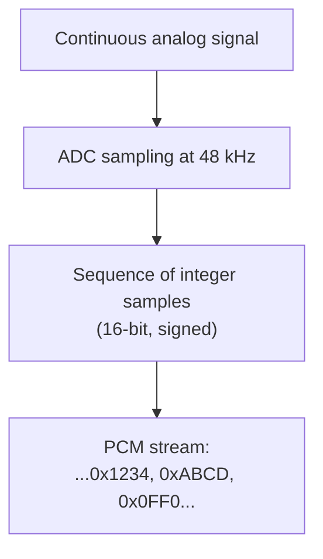

# Audio Driver (Pro)

The Audio driver lets Serial Studio treat any OS-level audio input device as an analog data source: microphones, line-in, audio interfaces, USB DACs, virtual loopback devices, anything the OS can record from.

It can also feed an analog signal into Serial Studio when no dedicated driver fits. A vibration sensor through a microphone preamp, or a current shunt through a line input, both work the same as a real microphone.

## What is digital audio?

Digital audio is the discrete-time, discrete-amplitude representation of an analog sound waveform. Three numbers describe it:

- **Sample rate.** How many times per second the analog waveform is measured. Typical values are 44100, 48000, 96000, and 192000 Hz.
- **Bit depth.** How many bits each sample uses. Typical values are 16-bit signed integer, 24-bit signed integer, and 32-bit float.
- **Channels.** How many independent waveforms are bundled together. 1 is mono, 2 is stereo, more for surround formats.

The encoding scheme is almost always **PCM** (Pulse-Code Modulation): each sample is the amplitude at that instant, encoded as an integer or float. No compression, no transformations, no per-sample headers.

### Sample rate and the Nyquist limit

The Nyquist-Shannon sampling theorem states that, to faithfully reconstruct a signal containing frequencies up to **f**, the sample rate must be at least **2f**. A 44.1 kHz sample rate therefore captures frequencies up to about 22.05 kHz, which exceeds the upper limit of human hearing (about 20 kHz). That is the reason CD audio settled on 44.1 kHz.

Higher sample rates (96 and 192 kHz) are common in studio work, mostly to provide headroom during processing rather than to capture sound above 22 kHz. For Serial Studio's purposes:

- **44.1 / 48 kHz** is sufficient for general acoustic capture, vibration analysis up to about 20 kHz, and audio fingerprinting.
- **96 / 192 kHz** provides ultrasonic headroom — useful for some non-destructive testing, bat detectors, and ultrasound transducers.
- **Below 44.1 kHz** is rare on PC audio hardware. A few interfaces support 22, 16, or 8 kHz for legacy compatibility.

Sampling below twice the highest signal frequency causes aliasing: high frequencies fold back into the audible band as ghost signals at the wrong pitch. Most audio hardware filters out high frequencies before sampling to prevent this. Custom hardware feeding Serial Studio should bandwidth-limit its input the same way.

### Bit depth and dynamic range

Each PCM sample's bit depth determines the smallest amplitude difference that can be represented. The signal-to-noise ratio (SNR) of a perfectly-quantised sine wave is roughly 6 dB per bit:

| Bit depth | Theoretical SNR | Use case |
|-----------|-----------------|----------|
| 8-bit     | ~48 dB          | Voice memos, low-quality streaming |
| 16-bit    | ~96 dB          | CD-quality, most consumer audio |
| 24-bit    | ~144 dB         | Studio recording, master tapes |
| 32-bit float | effectively unlimited | Mixing, processing |

Anything below the bit-depth's noise floor is lost. 16-bit is usually adequate for Serial Studio applications; 24-bit or 32-bit float adds headroom for signals that vary across many orders of magnitude.

### Channels

A stereo signal is two PCM streams interleaved sample by sample: `L, R, L, R, L, R, ...`. A 4-channel interface gives `1, 2, 3, 4, 1, 2, 3, 4, ...`. The OS exposes each channel as a separate stream of samples that share the same sample rate and bit depth.

In Serial Studio each input channel can drive its own dataset. A 4-input audio interface with sensors on each input therefore yields four independent telemetry streams.

## How Serial Studio uses it

The audio driver is built on **miniaudio**, a single-header cross-platform audio library. miniaudio talks directly to:

- **WASAPI** on Windows
- **Core Audio** on macOS
- **ALSA** on Linux

This avoids the overhead of QtMultimedia and gives the driver direct access to low-latency callback-based capture.

### Threading and timestamps

The audio driver is the most thread-heavy of all Serial Studio drivers:

- The audio backend (miniaudio's internal threads) invokes a capture callback on its own thread whenever a buffer of samples is ready. The callback hands the raw bytes to a lock-free single-producer queue and never blocks.
- A dedicated worker thread runs a 10 ms `Qt::PreciseTimer` at highest priority, drains the captured-buffer queue, and forwards data downstream.
- When a buffer of N samples arrives, the driver back-dates the timestamp to `now - (N-1) / sample_rate` so the first sample carries the correct acquisition time, not the moment the OS got around to firing the callback.
- Consecutive buffers extend a continuous sample clock rather than being stamped independently; the clock snaps back to wall time only when it drifts more than 50 ms, so callback jitter never shifts the sample timeline.

This timestamp accuracy is what keeps audio data lined up in CSV exports and session reports even when the audio backend buffer is large. See [Threading and Timing Guarantees](Threading-and-Timing.md) for the full timestamp-ownership rules.

### What you get downstream

The driver converts each captured buffer to CSV text: one line per sample period, channels separated by commas (`L,R` for stereo). Under line-delimited framing (the Quick Plot default), each line becomes one frame carrying its own sample-clock timestamp, so a 48000 Hz capture produces 48000 frames per second. The [frame parser](JavaScript-API.md) sees the decoded sample values as text, which can be:

- Plotted directly as time-domain waveforms.
- Fed into an FFT widget for spectrum analysis.
- Fed into a Waterfall (spectrogram) widget for time-frequency analysis.
- Reshaped by per-dataset transforms for filtering, scaling, or unit conversion.

The FFT and Waterfall widgets share the same per-dataset settings (`fftSamples`, `fftSamplingRate`, `fftMin`, `fftMax`), so a single audio channel can drive both views simultaneously.

In [Quick Plot mode](Operation-Modes.md) the dashboard configures itself: each channel becomes a dataset in an *Audio Input* group with FFT enabled, `fftSamplingRate` set to the device sample rate, `fftSamples` sized to the power of two covering roughly 50 ms of signal (256 to 8192), and plot ranges taken from the sample format's limits. In a project, set those per-dataset values yourself.

### Configuration

| Setting | Controls |
|---------|----------|
| **Input Device** | Which OS audio device to capture from. |
| **Sample Rate** | Capture rate in Hz; only rates the device reports are offered. First-run default is 44100 Hz (22050 Hz on Windows) when the device supports it. |
| **Sample Format** | Unsigned 8-bit, Signed 16-bit, Signed 24-bit, Signed 32-bit, or Float 32-bit, filtered to what the device supports. |
| **Channels** | Mono, Stereo, or a multichannel layout (3.0 up to 7.1), depending on the device. |
| **Output Device** | Optional playback device, with its own **Sample Format** and **Channels** selectors. |

Selections persist across sessions and are saved with the project by stable identifiers (device name, rate in Hz, format name, channel count), so they survive index changes when devices are plugged or unplugged. None of them can change while the device is open; disconnect first.

When an **Output Device** is configured, the driver opens in duplex mode and data written to it plays back as audio. Each outgoing frame is a comma-separated list with one value per playback channel: integer sample values for the integer formats, `-1.0` to `1.0` for Float 32-bit.

The same settings are scriptable through the `io.audio.*` commands of the [JSON-RPC API](API-Reference.md): `setInputDevice` and `setOutputDevice` (`deviceIndex`), `setSampleRate` (`rateIndex`), `setInputSampleFormat` and `setOutputSampleFormat` (`formatIndex`), and `setInputChannelConfig` and `setOutputChannelConfig` (`channelIndex`), plus the read-only `listInputDevices`, `listOutputDevices`, `listSampleRates`, `listInputFormats`, `listOutputFormats`, and `getConfig`. Every setter takes a zero-based index into the option list, in the same order as the Setup Panel. When the in-app AI issues these commands, they sit behind the **Allow device control** toggle.

For step-by-step setup, see the [Protocol Setup Guides, Audio Input section](Protocol-Setup-Guides.md).

## Common pitfalls

- **No audio detected.** Verify the input device in the OS audio settings first. On macOS, grant Serial Studio Microphone permission in **System Settings → Privacy & Security → Microphone**. On Linux, check `arecord -l` (ALSA) or PulseAudio's `pavucontrol` to confirm the device exists and is not muted.
- **Distorted signal at high amplitude.** The input is clipping. Reduce the input gain in the OS or on the hardware preamp. PCM saturation produces hard distortion that looks like sharp peaks pinned to the bit-depth maximum.
- **High noise floor.** Microphone inputs are noisier than line inputs because they expect a millivolt-range source. Driving a low-impedance signal into a microphone input amplifies the noise as well; use a line input where possible.
- **Required sample rate is not listed.** The hardware reports its supported sample rates and Serial Studio only offers those. If a rate is unsupported, the driver cannot fake it; use a different audio interface.
- **FFT or waterfall looks wrong.** Set `fftSamplingRate` on the dataset to match the audio sample rate. If the sample rate is 48 kHz and `fftSamplingRate` is left at its default of 100, the frequency axis is scaled by 480x. Quick Plot mode sets it automatically; projects do not.
- **Latency feels high.** Audio backends typically buffer 10 to 50 ms by default. That is fine for real-time visualisation but not for closed-loop applications. Lower-latency capture requires backend-specific tuning that Serial Studio does not currently expose.
- **Stereo input but only one channel visible.** **Channels** is set to Mono. Switch to Stereo and the second channel appears as a second dataset.
- **High CPU at 192 kHz.** FFT plus waterfall at a high sample rate is expensive. Reduce `fftSamples` or disable the waterfall in the per-dataset settings.

## Further reading

- [Audio bit depth — Wikipedia](https://en.wikipedia.org/wiki/Audio_bit_depth)
- [Digital audio basics: audio sample rate and bit depth — iZotope](https://www.izotope.com/en/learn/digital-audio-basics-sample-rate-and-bit-depth)
- [44,100 Hz — Wikipedia](https://en.wikipedia.org/wiki/44,100_Hz)
- [Understanding Sample Rate, Bit Depth, and Bit Rate — Headphonesty](https://www.headphonesty.com/2019/07/sample-rate-bit-depth-bit-rate/)
- [miniaudio — single-file audio playback and capture library](https://miniaud.io/)

## See also

- [Protocol Setup Guides](Protocol-Setup-Guides.md): step-by-step Audio Input setup.
- [API Reference](API-Reference.md): the `io.audio.*` command set for scripted control.
- [Operation Modes](Operation-Modes.md): Quick Plot vs Project File, and what gets auto-configured.
- [Data Sources](Data-Sources.md): driver capability summary across all transports.
- [Communication Protocols](Communication-Protocols.md): overview of all supported transports.
- [Widget Reference](Widget-Reference.md): FFT Plot and Waterfall widget configuration.
- [Dataset Value Transforms](Dataset-Transforms.md): per-channel calibration, scaling, and filtering of audio samples.
- [Threading and Timing Guarantees](Threading-and-Timing.md): for why audio's timestamp handling matters.
- [Use Cases](Use-Cases.md): examples of acoustic analysis with Serial Studio.
