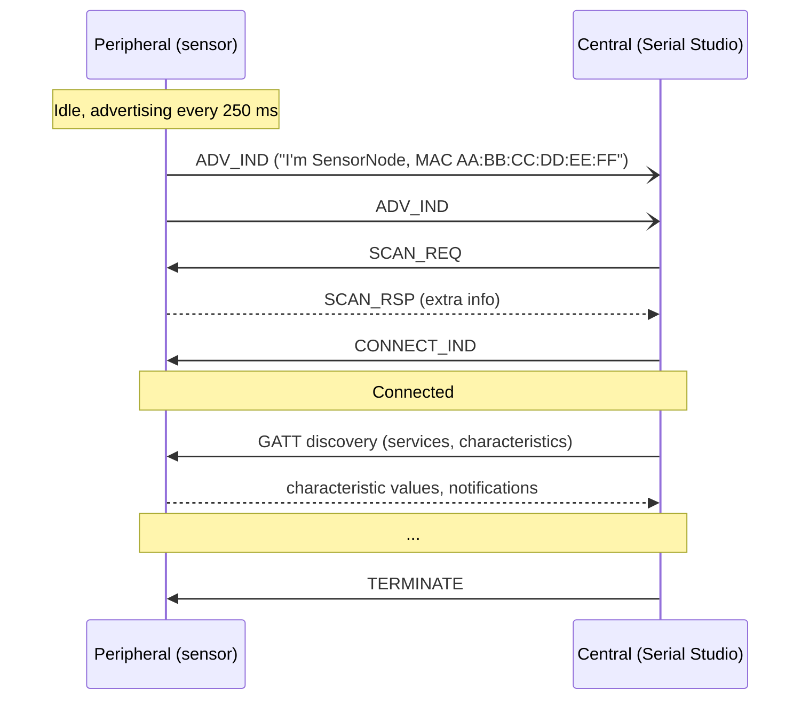
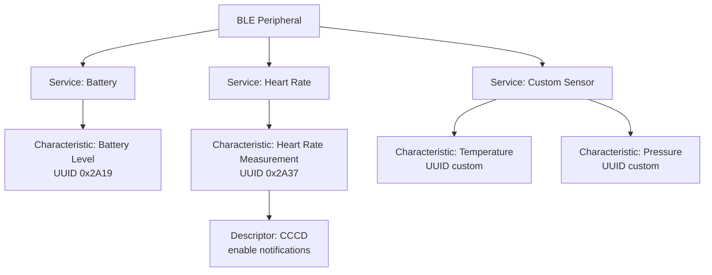

# Bluetooth Low Energy Driver

The Bluetooth Low Energy (BLE) driver lets Serial Studio connect to any BLE peripheral that exposes its data through GATT services and characteristics. It is included in the free build. BLE is the common wireless transport for battery-powered sensors, fitness wearables, and prototyping boards such as the ESP32 and nRF52.

For "classic" Bluetooth devices (the older 2.x flavor that uses the Serial Port Profile), the OS already exposes a virtual COM port. Use the [UART driver](Drivers-UART.md) for those. This page covers BLE only.

## What is Bluetooth Low Energy?

Bluetooth Low Energy was introduced in Bluetooth 4.0 (2010) as a low-power, low-data-rate companion to classic Bluetooth. It is *not* wire-compatible with classic Bluetooth; the radio is shared but the protocol stack is entirely separate.

The design goals are different too:

| | Classic Bluetooth | Bluetooth LE |
|---|-------------------|--------------|
| Use case | Audio streaming, file transfer | Sensor data, beacons, control |
| Data rate | Up to 3 Mbps (BR/EDR), higher with HS | Typically tens to hundreds of kbps |
| Power | Watts | Microwatts (months on a coin cell) |
| Connection | Always-on while paired | Bursty: connect, exchange, sleep |
| Topology | Star, piconet | Star, mesh, broadcast |

BLE excels at infrequent small bursts of data from devices that need to live on a battery for weeks or months. It is a poor fit for high-throughput streaming.

### Roles: peripheral and central

Two roles matter:

- **Peripheral**: the device that *advertises* its presence and *exposes* data. A heart-rate monitor, a temperature sensor, or an ESP32 running custom firmware.
- **Central**: the device that *scans* for advertisements and *connects* to a peripheral. The laptop running Serial Studio is the central.

A peripheral broadcasts short advertising packets every few hundred milliseconds. A central scans those packets, picks one, and initiates a connection. Once connected, the link is point-to-point until either side disconnects.

### GATT: services and characteristics

Once connected, BLE devices talk over the **Generic Attribute Profile (GATT)**. GATT is a simple hierarchical data model:

- A **service** is a logical grouping of related data (for example "Heart Rate Service", "Battery Service", or "Custom Vendor Service").
- A **characteristic** is one piece of data inside a service (for example "Heart Rate Measurement", "Battery Level", or "Sensor X Reading").
- A **descriptor** is metadata about a characteristic: units, format, valid range, or the Client Characteristic Configuration descriptor that enables notifications.

Standard services and characteristics use 16-bit UUIDs assigned by the Bluetooth SIG (e.g. `0x180F` for Battery Service, `0x2A19` for Battery Level). Custom services use 128-bit UUIDs picked by the vendor.

### How data flows

A central can use four GATT operations against a characteristic:

- **Read**: pull the current value once. Used for values that change rarely, such as firmware version or a calibration constant.
- **Write**: push a value to the peripheral. Used for control such as toggling a relay or setting a sample rate.
- **Notify**: the peripheral pushes a new value to the central whenever the value changes. The central must enable notifications first by writing to the **Client Characteristic Configuration Descriptor (CCCD)**. This is the standard pattern for telemetry.
- **Indicate**: like Notify, but the central acknowledges each update. Slightly more reliable, slightly slower.

For Serial Studio, the operation is almost always Notify: select a characteristic, enable notifications, and every value the peripheral sends flows into the incoming data stream.

### MTU and throughput

BLE is slow compared to USB or TCP. The default MTU (Maximum Transmission Unit) is 23 bytes, of which 20 are usable as payload after ATT overhead. Modern BLE 4.2+ devices negotiate larger MTUs (247 or more), but the practical ceiling on a single connection is around 1 to 2 Mbps under ideal conditions. Plan accordingly: 1 kHz of sensor data will struggle on BLE, and Wi-Fi (TCP or UDP) is the better choice in that case.

## How Serial Studio uses it

The BLE driver wraps Qt's `QLowEnergyController` and `QLowEnergyService`. The Setup Panel exposes three dropdowns, labeled **Device**, **Service**, and **Characteristic**, and the flow has four steps:

1. **Scan.** Serial Studio uses `QBluetoothDeviceDiscoveryAgent` to enumerate nearby BLE peripherals. The **Device** list builds up over a few seconds; the refresh button restarts the scan. Only peripherals that advertise a name are listed.
2. **Select device.** Pick a peripheral from the **Device** dropdown and click **Connect**. Serial Studio connects and discovers services.
3. **Select service.** Once discovery finishes, pick the GATT service that holds the telemetry data from the **Service** dropdown. Most devices expose several services; choose the one containing the characteristic you need.
4. **Select characteristic.** Pick the characteristic to subscribe to from the **Characteristic** dropdown. Serial Studio enables notifications on it by writing `0x0001` to the CCCD.

From that point on, every notification's payload bytes enter the incoming stream exactly as if they had arrived over UART, and the configured frame detection splits them into frames. Quick Plot mode frames on line endings; in a project, set the source's frame detection to **No Delimiters** to map one notification to one frame, and decode packed binary payloads in a [frame parser](JavaScript-API.md).

Writes use the same selection in reverse: data sent through the console or an [action](Actions.md) is written to the selected characteristic with Write With Response. Devices that split RX and TX across two characteristics (the Nordic UART Service pattern) take writes through `io.ble.writeCharacteristic`, which resolves any characteristic in the selected service by UUID and uses Write Without Response when the characteristic supports it.

The device, service, and notify characteristic are saved with the project (the device by name/address, the service and characteristic by UUID, so they survive a firmware update that reorders the GATT table). On the next connection Serial Studio reselects them automatically after discovery, and only then reports the source as connected, so anything that runs on connect (a [Control Loop](Control-Script.md), an auto-execute action) sees a fully wired GATT. A control loop should therefore handle only the write handshake, not service or characteristic selection.

If a project knows only the notify characteristic (the saved service UUID is empty, as in projects saved by older versions), Serial Studio probes the discovered services one by one until it finds the one containing that characteristic, then wires it exactly as if the service had been saved. The connection is reported only after the probe finishes, so connect-time automation still sees a ready GATT.

### Discovery is shared across instances

Serial Studio caches BLE discovery state in static storage shared across all instances of the driver. The consequences:

- Discovery runs once even when multiple driver instances exist (for example a UI driver and a live driver).
- The device list is append-only during rediscovery, so dropdown indices stay stable across QML rebuilds.
- Selecting the same device twice is a no-op when it is already selected and connected.

This is intentional. It prevents the dropdown from snapping to a different selection every time QML reloads.

### Threading

The driver lives on the main thread. QtBluetooth's event-driven async I/O delivers notifications via Qt signals; there is no dedicated worker thread. See [Threading and Timing Guarantees](Threading-and-Timing.md).

### Scripting and API control

The same flow is scriptable through the `io.ble.*` commands of the [JSON-RPC API](API-Reference.md): `selectDevice` (`deviceIndex`), `selectService` (`serviceIndex`), and `setCharacteristicIndex` (`characteristicIndex`) select by index into the lists returned by `listDevices`, `listServices`, and `listCharacteristics`; `selectServiceByUuid` (`serviceUuid`) and `setNotifyCharacteristic` (`characteristicUuid`) select by UUID, which survives GATT-table reordering; `writeCharacteristic` (`characteristicUuid`, base64 `data`) writes to any characteristic in the selected service. `startDiscovery`, `getConfig`, and `getStatus` round out the set. UUID parameters accept the 16-bit short form (`fff1`, `0xFFF1`) or the full 128-bit form, with or without braces. When the in-app AI issues these commands, they sit behind the **Allow device control** toggle.

For step-by-step setup, see the [Protocol Setup Guides, Bluetooth LE section](Protocol-Setup-Guides.md).

## Common pitfalls

- **Device does not appear in the scan.** The peripheral may not be advertising, or its advertisement interval may be very long. Power-cycle it. Serial Studio also hides peripherals that advertise without a name, so set a device name in the firmware. On macOS, grant Serial Studio Bluetooth permission in **System Settings → Privacy & Security → Bluetooth**. On Linux, the user may need to be in the `bluetooth` group.
- **Connected, but no characteristic appears.** GATT discovery may not have finished. Wait a few seconds after connect; some peripherals are slow to respond to discovery requests. If nothing ever appears, the device may require pairing or bonding before exposing the service (some Nordic-based devices do).
- **Notifications enable but no data arrives.** Notifications were probably enabled on a characteristic that does not push notifications. Check the characteristic's properties (Read / Write / Notify / Indicate). Only Notify-capable characteristics deliver data continuously.
- **Throughput is much lower than expected.** This is BLE working as designed. The connection interval (negotiated between central and peripheral, typically 7.5 ms to 4 s) caps the packet rate. A 7.5 ms interval with a 247-byte MTU yields roughly 250 kbps of payload. Peripherals often negotiate slow intervals to save power; check the firmware for a way to request a faster interval.
- **Connection drops after a few seconds.** The peripheral may be enforcing a security requirement (encryption or bonding). Pair the device through the OS first, then reconnect from Serial Studio.
- **Multiple Serial Studio windows fight over the same device.** BLE is point-to-point: a peripheral can only be connected to one central at a time. Close the other window.
- **Bluetooth radio "missing" on Linux.** Run `bluetoothctl` from a terminal; it tells you whether BlueZ sees the adapter. If not, the kernel module is probably not loaded.

## Further reading

- [Bluetooth Low Energy Fundamentals (Nordic Developer Academy)](https://academy.nordicsemi.com/courses/bluetooth-low-energy-fundamentals/)
- [Bluetooth Low Energy: A Primer (Memfault Interrupt blog)](https://interrupt.memfault.com/blog/bluetooth-low-energy-a-primer)
- [Bluetooth Low Energy (Wikipedia)](https://en.wikipedia.org/wiki/Bluetooth_Low_Energy)
- [Bluetooth low energy Characteristics, a beginner's tutorial (Nordic DevZone)](https://devzone.nordicsemi.com/tutorials/b/bluetooth-low-energy/posts/ble-characteristics-a-beginners-tutorial)
- [Services and characteristics (Nordic Developer Academy)](https://academy.nordicsemi.com/courses/bluetooth-low-energy-fundamentals/lessons/lesson-4-bluetooth-le-data-exchange/topic/services-and-characteristics/)

## See also

- [Protocol Setup Guides](Protocol-Setup-Guides.md): step-by-step BLE setup in the Setup Panel.
- [API Reference](API-Reference.md): the `io.ble.*` command set for scripted control.
- [Data Sources](Data-Sources.md): driver capability summary across all transports.
- [Communication Protocols](Communication-Protocols.md): overview of all supported transports.
- [Use Cases](Use-Cases.md): wireless sensor patterns and BLE prototyping setups.
- [Troubleshooting](Troubleshooting.md): pairing, permission, and adapter-detection diagnostics.
- [Drivers: UART](Drivers-UART.md): for classic Bluetooth SPP devices that show up as virtual COM ports.
- [Drivers: Network](Drivers-Network.md): when you need more throughput than BLE can provide.
