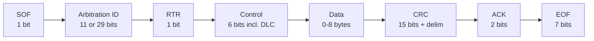
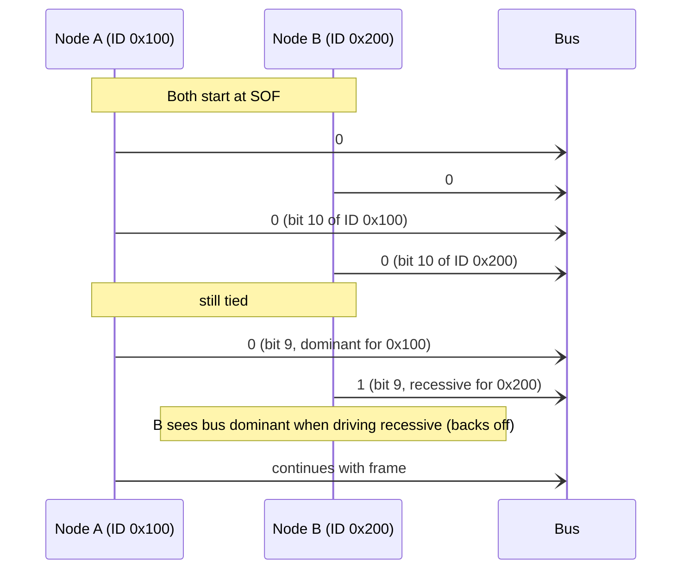

# CAN Bus Driver (Pro)

The CAN Bus driver lets Serial Studio capture frames from a Controller Area Network. CAN is the dominant in-vehicle bus and is also widely used in industrial automation, motor control, and any embedded system distributed across more than one board. Typical sources include ECUs, electric motor controllers, automotive diagnostic tools, and CAN-to-USB adapters.

Serial Studio Pro implements CAN through Qt's `QtSerialBus` module, which fronts SocketCAN (Linux), PEAK PCAN, Vector, SysTec, Tiny-CAN, and a virtual-CAN backend for testing. Serial Studio adds three backends of its own for consumer USB-CAN adapters: CANable and other gs_usb devices, slcan serial adapters, and the Seeed/Waveshare USB-CAN Analyzer; these appear in the same driver list and need no vendor SDK. DBC files are imported automatically by the [Auto-Generating Projects](Auto-Generating-Projects.md) flow.

## What is CAN?

The Controller Area Network was developed by Bosch in 1986 for in-vehicle communication and is standardised as ISO 11898. It is a multi-master, message-broadcast, differential-pair bus designed around four priorities:

- **Resistant to electrical noise.** Differential signalling on a twisted pair.
- **No central master.** Any node can transmit at any time.
- **Deterministic priority.** Higher-priority messages always preempt lower-priority ones.
- **Built-in error detection.** A CRC on every frame, automatic retransmission, and an error-confinement scheme that quarantines faulty nodes.

The trade-off is a relatively low data rate (1 Mbps for classic CAN, up to 8 Mbps for CAN FD) and small payloads (8 bytes per frame for classic CAN, 64 bytes for CAN FD).

### Frame structure

A simplified classic CAN data frame:



The two pieces that matter day-to-day:

- **Arbitration ID.** Identifies the message. 11 bits is "standard" (CAN 2.0A); 29 bits is "extended" (CAN 2.0B). Lower IDs win arbitration and therefore have higher priority. The ID is *not* an address in the TCP/Modbus sense; nobody is being addressed. It identifies the meaning of the message, and any node that cares filters by ID.
- **Data.** 0 to 8 bytes for classic CAN, up to 64 for CAN FD. The bytes are vendor-defined: the meaning of byte 3 in message `0x7E8` is whatever the DBC file or the OEM's spec says it is.

### Bitwise arbitration

CAN is a multi-master bus where any node can transmit, yet collisions never corrupt a frame. The mechanism is non-destructive bitwise arbitration.

The bus has two voltage states:

- **Dominant** (logic 0). The driver pulls the bus to a defined level.
- **Recessive** (logic 1). The driver releases the bus, and biasing resistors hold it at the recessive level.

If two nodes start transmitting at the same time and they reach a bit position where one drives dominant and the other drives recessive, the dominant level always wins. It physically overrides the recessive one. The node that was driving recessive sees the bus go dominant against its will and immediately stops transmitting. The dominant node continues without knowing anything happened.



Because lower numerical IDs have more leading dominant bits, they always win arbitration. A safety-critical engine message at ID `0x010` preempts an infotainment message at `0x500` every time. This is why ID assignment in a CAN network is a careful design exercise: priorities are baked into the IDs.

### Bit timing

CAN's reliability depends on every node sampling each bit at the right place. Bit timing is divided into time quanta allocated across four segments (sync, propagation, phase 1, phase 2). In practice you only choose a **bit rate** (for example 500 kbps); the controller computes the rest.

Common bit rates are 125 kbps, 250 kbps, 500 kbps, and 1 Mbps. CAN FD adds a faster data-phase rate of up to 8 Mbps that is used after the arbitration phase.

The bit rate must match exactly across every node on the bus. Even a 1% mismatch causes errors.

### CAN FD

CAN with Flexible Data-rate (CAN FD) was introduced by Bosch in 2012 and adds two things:

- **Up to 64 bytes of payload** per frame, instead of 8.
- **A higher data-phase bit rate** (up to 8 Mbps) that takes effect after the arbitration phase. The arbitration phase still runs at the slower rate so priority semantics are preserved.

When the hardware and every node on the bus support CAN FD, use it. The larger payload is the bigger gain in practice: many automotive protocols (UDS, ISO-TP) become both faster and simpler when each frame can carry more bytes.

### DBC: the signal database

Raw CAN delivers bytes inside messages. **DBC** (CAN Database) files describe what those bytes mean. A typical DBC entry looks like:

```
BO_ 256 EngineData: 8 ECU
 SG_ EngineRPM : 0|16@1+ (0.25,0) [0|16383] "rpm" Dashboard
 SG_ ThrottlePosition : 16|8@1+ (0.392,0) [0|100] "%" Dashboard
 SG_ EngineTemp : 24|8@1+ (1,-40) [-40|215] "°C" Dashboard
```

That declares: message ID 256 (`0x100`), 8 bytes long, sent by `ECU`, received by `Dashboard`. It contains three signals:

- **EngineRPM** at bit 0, 16 bits wide, little-endian, unsigned, factor 0.25, offset 0, range 0-16383, units rpm.
- **ThrottlePosition** at bit 16, 8 bits wide, factor 0.392, offset 0, units %.
- **EngineTemp** at bit 24, 8 bits wide, factor 1, offset -40, units °C.

Most automotive and industrial CAN networks come with a DBC describing every message and signal. Serial Studio's importer reads the file and generates a project automatically (see [Auto-Generating Projects](Auto-Generating-Projects.md)).

## How Serial Studio uses it

The CAN driver wraps `QCanBusDevice`. Setup involves these fields:

| Setting | Controls | Default |
|---------|----------|---------|
| **CAN Driver** | Which CAN backend to use: the Qt plugins `socketcan` (Linux), `peakcan`, `vectorcan`, `systeccan`, `tinycan`, `virtualcan`, plus Serial Studio's own `canable_gsusb` (CANable USB), `slcan` (Serial CAN), and `seeed_usbcan` (Seeed / Waveshare) backends. | first available |
| **Interface** | Which physical interface inside that backend (e.g. `can0`, `PCAN_USBBUS1`). | first available |
| **Bitrate** | Must match the bus exactly. Pick a preset (10 kbps to 1 Mbps) or type a custom value in bit/s. | 500000 bit/s |
| **Flexible Data-Rate** | Whether to use the CAN FD frame format. | off |
| **Loopback** | Echo transmitted frames back to the application (self-reception). | off |
| **Listen-Only** | Silent monitoring: receive frames without acknowledging or transmitting. | off |
| **DBC Database** | **Import DBC File…** generates a project from a signal database (see [Auto-Generating Projects](Auto-Generating-Projects.md)). | none |

For Linux SocketCAN, the interface must be brought up from a terminal *before* Serial Studio connects:

```sh
sudo ip link set can0 type can bitrate 500000
sudo ip link set up can0
```

For CAN FD:

```sh
sudo ip link set can0 type can bitrate 500000 dbitrate 2000000 fd on
sudo ip link set up can0
```

### Frame parsing

Serial Studio publishes every received CAN frame to the frame parser as a binary byte array. Standard (11-bit) frames use the layout `[ID_hi, ID_lo, DLC, payload...]`, zero-padded to 11 bytes. Extended (29-bit) frames set bit 7 of the first byte: `[0x80|ID28..24, ID23..16, ID15..8, ID7..0, DLC, payload...]`, zero-padded to 13 bytes. Configure the source with no frame delimiters and the **Binary** decoder (`decoder: 3` in the project file) so the parser entry point, `parse(frame)`, receives those raw bytes. Transmitting uses the same layout: write the header and payload bytes and the driver assembles the CAN frame.

In a DBC-imported project the auto-generated parser is a Built-In (no-code) parser configured from the DBC: it dispatches by CAN ID, extracts each signal at the documented bit offset, applies factor and offset, and writes the value into the matching dataset.

When the project is built by hand, the dispatch logic can instead be written in Lua or JavaScript. See [Frame Parser Scripting](JavaScript-API.md).

### Threading

The CAN driver runs on the main thread. Qt's async I/O delivers received frames via signals; there is no dedicated worker thread for CAN. See [Threading and Timing Guarantees](Threading-and-Timing.md).

### API control

The [Socket API](API-Reference.md) and the in-app [AI Assistant](AI-Assistant.md) configure this driver through the `io.canbus.*` command scope. Mutations: `setPluginIndex` (param `pluginIndex`), `setInterfaceIndex` (`interfaceIndex`), `setBitrate` (`bitrate`, bit/s), `setCanFd` (`enabled`). Read-only: `getConfig`, `listPlugins`, `listInterfaces`, `listBitrates`, `getInterfaceError`. For the AI Assistant the setters are device-gated: blocked until the user ticks **Allow device control**, and each call still requires confirmation.

For step-by-step setup, see the [Protocol Setup Guides, CAN Bus section](Protocol-Setup-Guides.md).

## Common pitfalls

- **No frames received.** Bit-rate mismatch is the most common cause; even a 1% deviation rejects every frame. Verify the rate with the bus owner or the device documentation. Use a CAN analyser (PCAN-View, `candump`, BusMaster) to confirm that traffic exists at the bit rate you expect.
- **Error frames only.** Termination is missing or incorrect. A CAN bus needs exactly two 120 Ω terminators, one at each physical end of the trunk. Measured between CAN-H and CAN-L with the bus powered off, the resistance should be about 60 Ω. Anything else points to a wiring problem.
- **Interface not listed (Linux).** Run `ip link show can0`. If the interface is not there, the kernel module is not loaded. `modprobe can_dev` and `modprobe vcan` (for virtual-CAN testing) usually fix it.
- **Permission denied on SocketCAN.** Opening a SocketCAN interface needs no special privileges, but configuring it (`ip link set`) requires root or `CAP_NET_ADMIN`. Bring the interface up once with `sudo`, then connect as a normal user. For `slcan` and other serial adapters, the user must be able to open the serial device (the `dialout` group on Debian-family distributions).
- **DBC import produces wrong values.** Check the byte order on the signals. DBC supports both little-endian (Intel) and big-endian (Motorola) encoding inside the same message. Auto-generated parsers handle both, but a manually edited DBC with the wrong byte order produces values that look scaled or shifted by a constant amount.
- **Multiplexed (MUX) signals do not decode.** Simple multiplexing is supported automatically: the importer recognises the message's `MultiplexorSwitch` selector and gates each muxed signal on the matching mux value. Imported datasets are titled `Foo (mux 3)` so you can tell them apart on the dashboard. Extended multiplexing (`SG_MUL_VAL_`, `SwitchAndSignal` intermediates, value ranges) is not supported; those signals are skipped during import and the post-import dialog reports how many were dropped. Switch the source to a Lua or JavaScript frame parser to handle them by hand.
- **CAN FD frames are dropped.** The bus, the adapter, and Serial Studio all need to be in CAN FD mode. Mixing classic-only nodes on a CAN FD bus works only if the FD nodes downshift, which not every adapter supports.
- **PCAN/Vector/SysTec driver not found (Windows).** The vendor driver and runtime are separate installs. Qt's CAN plugin is only a wrapper; the actual hardware support comes from the vendor. The CANable, slcan, and Seeed/Waveshare backends are the exception: Serial Studio talks to those adapters directly.

## Further reading

- [CAN bus (Wikipedia)](https://en.wikipedia.org/wiki/CAN_bus)
- [CAN Bus Explained: A Simple Intro (CSS Electronics)](https://www.csselectronics.com/pages/can-bus-simple-intro-tutorial)
- [CAN Bus Protocol Tutorial (Kvaser)](https://kvaser.com/can-protocol-tutorial/)
- [CAN FD Protocol Tutorial (Kvaser)](https://kvaser.com/can-fd-protocol-tutorial/)
- [An Introduction to CAN FD (Vector, PDF)](https://cdn.vector.com/cms/content/know-how/can/Slides/CAN_FD_Introduction_EN.pdf)

## See also

- [Auto-Generating Projects](Auto-Generating-Projects.md): DBC file import.
- [Protocol Setup Guides](Protocol-Setup-Guides.md): step-by-step CAN setup.
- [Data Sources](Data-Sources.md): driver capability summary across all transports.
- [Communication Protocols](Communication-Protocols.md): overview of all supported transports.
- [Use Cases](Use-Cases.md): automotive and industrial CAN dashboards.
- [Troubleshooting](Troubleshooting.md): bit-rate, termination, and adapter-detection diagnostics.
- [Drivers: Modbus](Drivers-Modbus.md): the other industrial protocol.
- [Frame Parser Scripting](JavaScript-API.md): for editing the generated parser by hand.
