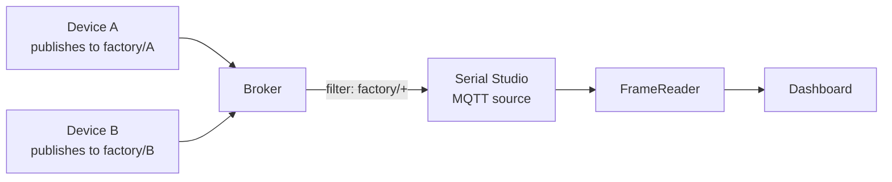

# MQTT Driver (Subscriber, Pro)

The MQTT driver lets a project subscribe to one or more broker topics and feed each received message into the regular frame pipeline as if the bytes had arrived over a serial port or TCP socket. It is the right transport when the data already lives on an MQTT broker, or when several Serial Studio instances need to consume the same telemetry without each one talking to the device directly.

Unlike UART, BLE, or CAN Bus, MQTT does not present a physical bus to Serial Studio: it runs over TCP and through a broker. The driver still slots into the same per-source architecture as every other transport, so a single project can mix MQTT subscribers with serial or network sources side by side.

If you have never used MQTT before, read [MQTT Topics & Semantics](MQTT-Topics.md) first; this page assumes the protocol vocabulary.

## What an MQTT subscriber sees

The broker maintains a routing table. Whenever a publisher posts to a topic, the broker forwards a copy of the payload to every client whose **topic filter** matches. The driver opens one connection per project source, registers its topic filter, and from then on every matching payload triggers a `messageReceived` callback. The bytes are then handed to the FrameReader exactly the same way bytes off a UART would be.

Two consequences shape how you configure the driver:

- **One MQTT message is one chunk of bytes.** The broker preserves payload boundaries; a 200-byte publish arrives as a single 200-byte read. The same frame-detection rules still apply (start/end delimiters, fixed length, no delimiter), but in practice each MQTT message usually already contains exactly one frame, so **No Delimiters** is a common choice.
- **Wildcards multiplex publishers.** A filter like `sensors/+/temp` accepts payloads from many publishers on a single source, but Serial Studio cannot tell them apart at the bytes level. If the dashboard has to distinguish them, encode the publisher's identity inside the payload (an ID column in CSV, a `device` field in JSON) or use one source per publisher.

## How Serial Studio uses it

The driver wraps Qt's `QMqttClient` and lives on the main thread. Per-source state — broker connection, SSL configuration, topic subscription — is kept on the driver instance itself, so each MQTT source in the project has its own independent broker session. Adding a second MQTT subscriber to the same project does not share anything with the first.

When you select **MQTT Subscriber** as the **Bus Type** for a source, the project editor exposes these fields under **Connection Settings**:

| Field | Controls |
|-------|----------|
| **Hostname** | Broker address (IP or hostname). Default `127.0.0.1`. |
| **Port** | Broker port. Default `1883` plaintext, `8883` for TLS. |
| **Client ID** | Identifier sent on CONNECT. Auto-generated; **Regenerate** picks a new one. |
| **Username / Password** | Optional broker authentication. |
| **Topic Filter** | Topic to subscribe to. Supports `+` (one level) and `#` (rest) wildcards. |
| **MQTT Version** | 3.1, 3.1.1, or 5.0. |
| **Clean Session** | Discard any persisted session state on CONNECT. Default on. |
| **Keep Alive** | Seconds between PING packets when idle. |
| **Auto Keep Alive** | Let the driver pick a sensible keep-alive interval. |
| **SSL / TLS** | Master toggle, protocol family, peer-verify mode, peer-verify depth. |
| **CA Certificates** | Load extra PEM certificates for self-signed brokers. |

For step-by-step instructions, see the [Protocol Setup Guides, MQTT section](Protocol-Setup-Guides.md).

### Payload expectations

The driver is transport-only. It does not decode the payload; it hands the bytes to the project's frame parser:

- **Quick Plot mode** expects comma-separated numeric values (`23.5,48.2,1013.25\n`). Each MQTT message should be a complete line.
- **Project File mode** expects whatever the project's JavaScript or Lua parser is written to accept. JSON, CSV, fixed-byte structs, and binary protocols all work the same as on any other driver.
- **Console Only mode** displays the payload as-is in the terminal.

The frame-detection rules on the source still apply. If the publisher embeds start/end delimiters inside the payload, configure them; otherwise leave **No Delimiters** selected so each MQTT message becomes one frame.

## Multiple MQTT subscribers in one project

The project editor treats MQTT subscribers the same as any other bus type, so a project with two ESP32 fleets on different brokers — one local, one cloud — is a normal multi-source project:

1. **Add a source.** In the project editor, add a new source and set its **Bus Type** to **MQTT Subscriber**.
2. **Point it at the broker.** Fill in hostname, port, credentials, and topic filter for the first fleet.
3. **Repeat.** Add a second source, set **Bus Type** to **MQTT Subscriber** again, and configure it for the second broker (or a different topic on the same broker).
4. **Map datasets per source.** Each source has its own frame parser; the Frame builder routes parsed frames to the dashboard with the source ID preserved, exactly as for serial+network mixes.

Two MQTT sources targeting the same broker but different topic filters are fine: the driver opens two CONNECT sessions with different client IDs and registers one subscription each. There is no special "shared broker" optimization, and there does not need to be — `QMqttClient` is cheap to instance.

## TLS / SSL

For any broker reachable from outside the local network, use TLS:

- Set the port to `8883` (the standard MQTT-over-TLS port).
- Enable **SSL/TLS**.
- Keep **Peer Verify** at `Verify Peer` (or the default `Auto Verify Peer`) for production. Drop to `None` only when testing against a self-signed broker certificate and never against a public broker.
- If the broker uses a private CA, click **Load From Folder…** under **CA Certificates** and pick the directory containing the PEM chain.

The TLS configuration is per-source, so two MQTT subscribers in the same project can use different brokers with different trust roots without interfering with each other.

## Common pitfalls

- **Subscribed but no data.** Topics are case-sensitive: `Sensors/Temp` is not the same as `sensors/temp`. Run `mosquitto_sub -t '#' -v` against the broker to see what is being published. If the publisher uses a deeper or shallower level structure than expected, the filter will silently miss everything.
- **Connected but stale data shows up.** A retained message on a topic above the live stream can mask new publishes for a fresh subscriber. Subscribe to `your/topic/#` and watch what the broker delivers on connect.
- **Client ID conflict.** Brokers enforce unique client IDs. Two Serial Studio instances (or two sources within the same instance, by accident) sharing one client ID make the broker kick the older connection. **Regenerate** to pick a fresh ID per source.
- **TLS handshake fails.** A broker requiring TLS will reject the connection if the certificate chain is not trusted. Self-signed brokers need the CA imported explicitly via the **CA Certificates** field's **Load From Folder…** button.
- **Public-broker latency.** Free public brokers like `test.mosquitto.org` round-trip through the public Internet; expect tens-to-hundreds of milliseconds of jitter. For low-latency telemetry, run Mosquitto on the same LAN.
- **High publish rate stalls the dashboard.** MQTT is not a streaming protocol. At thousands of messages per second, broker queues back up and the dashboard sees bursts and pauses. When per-reading granularity is not required, batch multiple readings into a single MQTT message and parse them frame-by-frame inside the project's frame parser.
- **One filter, many publishers, mixed payload formats.** A `sensors/+/temp` filter that catches both `room1` (CSV) and `room2` (JSON) cannot be parsed by a single frame parser cleanly. Either standardise the payload format or split into two sources with one filter each.

## Further reading

- [HiveMQ: MQTT 2026 Guide](https://www.hivemq.com/mqtt/)
- [HiveMQ Essentials, Part 2: Publish/Subscribe Architecture](https://www.hivemq.com/blog/mqtt-essentials-part2-publish-subscribe/)
- [Eclipse Mosquitto](https://mosquitto.org/) — lightweight broker for self-hosting and testing.
- [mqtt.org, the official MQTT site](https://mqtt.org/)

## See also

- [MQTT Topics & Semantics](MQTT-Topics.md): the protocol vocabulary — topics, wildcards, QoS, retained messages, sessions.
- [MQTT Publisher](MQTT-Publisher.md): the project-level outbound side, when Serial Studio is the producer.
- [Protocol Setup Guides](Protocol-Setup-Guides.md): step-by-step MQTT setup in the project editor.
- [Drivers: Network](Drivers-Network.md): raw TCP/UDP, when you do not need a broker.
- [Data Sources](Data-Sources.md): driver capability summary across all transports.
- [Communication Protocols](Communication-Protocols.md): overview of all supported transports.
- [Pro vs Free Features](Pro-vs-Free.md): MQTT is a Pro feature.
- [Troubleshooting](Troubleshooting.md): general troubleshooting guide.
