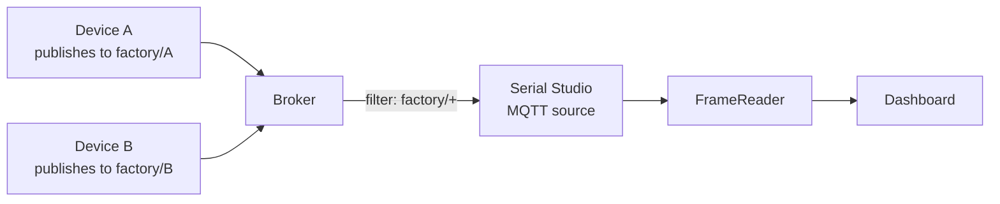

# MQTT Driver (Subscriber, Pro)

The MQTT driver lets a project subscribe to one or more broker topics and feed each received message into the regular frame pipeline as if the bytes had arrived over a serial port or TCP socket. It is the right transport when the data already lives on an MQTT broker, or when several Serial Studio instances need to consume the same telemetry without each one talking to the device directly.

Unlike UART, BLE, or CAN Bus, MQTT does not present a physical bus to Serial Studio: it runs over TCP and through a broker. The driver still slots into the same per-source architecture as every other transport, so a single project can mix MQTT subscribers with serial or network sources side by side.

If you have never used MQTT before, read [MQTT Topics & Semantics](MQTT-Topics.md) first; this page assumes the protocol vocabulary.

## What an MQTT subscriber sees

The broker maintains a routing table. Whenever a publisher posts to a topic, the broker forwards a copy of the payload to every client whose **topic filter** matches. The driver opens one connection per project source, registers its topic filter at QoS 0, and from then on every matching payload triggers a `messageReceived` callback. The bytes are then handed to the FrameReader exactly the same way bytes off a UART would be. Empty payloads and messages that do not match the filter are discarded before they reach the FrameReader.

```mermaid
flowchart LR
    Dev1["Device A<br/>publishes to factory/A"] --> Broker
    Dev2["Device B<br/>publishes to factory/B"] --> Broker
    Broker -- "filter: factory/+" --> SS["Serial Studio<br/>MQTT source"]
    SS --> FR["FrameReader"]
    FR --> Dash["Dashboard"]
```

Two consequences shape how you configure the driver:

- **One MQTT message is one chunk of bytes.** The broker preserves payload boundaries; a 200-byte publish arrives as a single 200-byte read. The same frame-detection rules still apply (start/end delimiters, fixed length, no delimiter), but in practice each MQTT message usually already contains exactly one frame, so **No Delimiters** is a common choice.
- **Wildcards multiplex publishers.** A filter like `sensors/+/temp` accepts payloads from many publishers on a single source, but Serial Studio cannot tell them apart at the bytes level. If the dashboard has to distinguish them, encode the publisher's identity inside the payload (an ID column in CSV, a `device` field in JSON) or use one source per publisher.

## How Serial Studio uses it

The driver wraps Qt's `QMqttClient` and lives on the main thread. Per-source state — broker connection, SSL configuration, topic subscription — is kept on the driver instance itself, so each MQTT source in the project has its own independent broker session. Adding a second MQTT subscriber to the same project does not share anything with the first.

When you select **MQTT Subscriber** as the **Bus Type** for a source, the project editor exposes these fields under **Connection Settings**:

| Field | Controls |
|-------|----------|
| **Hostname** | Broker address (IP or hostname). Default `127.0.0.1`. |
| **Port** | Broker TCP port. Default `1883`. Set `8883` yourself for TLS brokers; toggling TLS does not change the port. |
| **Topic Filter** | Topic to subscribe to. Supports `+` (one level) and `#` (rest) wildcards. Required; the source will not open without one. |
| **Client ID** | Identifier sent on CONNECT. Auto-generated (random 16 characters) when empty. |
| **Username / Password** | Optional broker authentication. |
| **MQTT Version** | MQTT 3.1, 3.1.1, or 5.0. Default MQTT 5.0. |
| **Clean Session** | Discard any persisted session state on CONNECT. Default on. |
| **Keep Alive (s)** | Seconds between PING packets when idle. Default 60; `0` disables the mechanism. |
| **Auto Keep Alive** | Let the client send keep-alive pings automatically. Default on. |
| **SSL/TLS Enabled** | Master TLS toggle. Off by default; when on, the three fields below appear. |
| **SSL Protocol** | TLS protocol family. One of Any Protocol, DTLS 1.2 or Later, Secure Protocols Only, TLS 1.2, TLS 1.3, or TLS 1.3 or Later. Default Secure Protocols Only. |
| **Peer Verify Mode** | One of Auto Verify Peer, None, Query Peer, or Verify Peer. Default Auto Verify Peer. |
| **Peer Verify Depth** | Maximum certificate chain length accepted. Default `10`; `0` = unlimited. |
| **Client Certificate** | Path to a PEM client certificate, for mutual TLS. Optional; leave empty for ordinary CA-only (server-authentication) TLS. |
| **Private Key** | Path to the client certificate's private key. Defaults to the certificate file itself when left empty. |
| **Key Passphrase** | Passphrase for an encrypted private key, if the key requires one. |

The main window's **Setup** pane shows the same configuration with a few extras: a **Regenerate** button beside **Client ID**, a **CA Certificates** row whose **Load From Folder…** button imports PEM certificates for self-signed brokers, and **Browse…** buttons beside **Client Certificate** and **Private Key** (both hidden unless **SSL/TLS Enabled** is on). The Setup pane omits **Auto Keep Alive** and shortens a few labels (**Version**, **Use SSL/TLS**, **Peer Verify**, **Verify Depth**); the fields are otherwise the same.

**Credential storage.** Broker username/password and the private key passphrase are obfuscated with SimpleCrypt inside the application's settings store (`QSettings`), not held in the OS keychain — protect the settings file accordingly.

The same fields are scriptable through the [API](API-Reference.md) commands `project.mqtt.subscriber.getConfig`, `project.mqtt.subscriber.setConfig`, and `project.mqtt.subscriber.getStatus`. `setConfig` patches only the keys you pass and schedules a reconnect when the driver is connected.

For step-by-step instructions, see the [Protocol Setup Guides, MQTT section](Protocol-Setup-Guides.md#mqtt-setup-pro).

### Payload expectations

The driver is transport-only. It does not decode the payload; it hands the bytes to the project's frame parser:

- **Quick Plot mode** expects comma-separated numeric values (`23.5,48.2,1013.25\n`). Each MQTT message should be a complete line.
- **Project File mode** expects whatever the project's JavaScript or Lua parser is written to accept. JSON, CSV, fixed-byte structs, and binary protocols all work the same as on any other driver.
- **Console Only mode** displays the payload as-is in the terminal.

The frame-detection rules on the source still apply. If the publisher embeds start/end delimiters inside the payload, configure them; otherwise leave **No Delimiters** selected so each MQTT message becomes one frame.

## Sparkplug

Sparkplug is a convention layered on MQTT: a fixed topic namespace rooted at `spBv1.0`, protobuf payloads, birth certificates that declare what a node publishes, and a death certificate the broker delivers when that node drops off. Serial Studio speaks both halves of it. As a subscriber, the MQTT driver acts as a host application and turns the namespace into datasets. As a producer, the [MQTT Publisher](MQTT-Publisher.md) acts as an edge node. Payloads on both sides follow the Sparkplug B v1.0 specification, in the Eclipse Tahu schema.

### Subscribing

Tick **Sparkplug** in the Setup pane's MQTT section. The checkbox replaces **Topic Filter**: the driver subscribes to the `spBv1.0` namespace itself, so no filter is required and the one configured for plain subscription does not apply while Sparkplug is on. Two rows appear below the checkbox:

| Field | Controls |
|-------|----------|
| **Sparkplug Group ID** | Restricts the subscription to one group. Empty means every group on the broker. Wildcards and `/` are refused, because a group id is a single topic element. |
| **Create Project from Births** | Generates a project from the metrics discovered so far. Enabled once the source is connected. |

Decoding is birth-driven. A node's birth certificate names its metrics and hands out the numeric aliases its later data messages carry; the driver assigns each named metric a wire slot, latches the birth values, and resolves every later alias through that table. A data message whose scope has no certificate yet, or that carries an alias the certificate never declared, is not guessed at: it is held until the birth arrives and counted if it cannot be resolved. Every edge node also gets a synthetic `Online` metric carrying its birth and death state, so a node that dies reads as offline on the dashboard instead of merely going stale.

Sequence numbers are checked per node, and a gap is counted rather than interpolated over.

The session's state is capped rather than grown on demand: 2048 metric slots, 256 nodes, 64 devices per node, and 256 messages held ahead of a birth. Traffic past a ceiling is refused and counted.

### Create Project from Births

Connect first, let the certificates arrive, then generate. The button builds a project with one source of type MQTT Subscriber carrying the broker settings and the group id, one group per publishing scope (an edge node, or a device when the node publishes devices), one dataset per discovered metric, and a Built-In frame parser using the **Sparkplug** template. The template's schema parameter is machine-managed: connect again to discover more metrics and generate again rather than editing it by hand. Generating before any certificate has arrived reports that nothing was discovered instead of writing an empty project.

The project opens in the Project Editor for customization.

### Publishing as an edge node

The outbound direction is configured in the Project Editor, in the MQTT publisher's **Sparkplug** section:

| Field | Controls |
|-------|----------|
| **Publish as Edge Node** | Publishes the dashboard's datasets into the Sparkplug namespace instead of the payload mode selected above. |
| **Group ID** | The logical group this node belongs to. |
| **Edge Node ID** | Identifies this node inside the group. |
| **Device ID** | Optional. When set, the datasets are published as a device of this node, under its birth and data topics rather than the node's own. |

The publisher owns the lifecycle. The death certificate is registered as the connection's will before CONNECT, because a will armed after CONNECT never fires and a node that exits ungracefully would then read as online forever. The birth certificate goes out on connect and declares every dataset as a metric with an alias; each publish tick afterwards sends one data message addressed by alias, carrying only the metrics that changed. A dataset that appears later grows the registry, and the node re-publishes its certificate before the next data message so no host ever receives an alias it cannot resolve. The node also subscribes to its own command topic and answers a rebirth request by publishing the certificate again.

An edge node publishes its own namespace and nothing else. While it is on, the raw-byte and script payload modes are suppressed and their queues drained rather than left to grow behind a mode that is not running.

### Monitoring

`project.mqtt.subscriber.getStatus` returns a `sparkplug` block beside the connection state. It reports whether the mode is on, the group id, the number of discovered metrics, and the pulled counters: sequence gaps, cap drops, decode errors, ignored messages, messages held and dropped before a birth, rebirth requests, and metrics whose datatype the decoder does not support.

## Multiple MQTT subscribers in one project

The project editor treats MQTT subscribers the same as any other bus type, so a project with two ESP32 fleets on different brokers — one local, one cloud — is a normal multi-source project:

1. **Add a source.** In the project editor, add a new source and set its **Bus Type** to **MQTT Subscriber**.
2. **Point it at the broker.** Fill in hostname, port, credentials, and topic filter for the first fleet.
3. **Repeat.** Add a second source, set **Bus Type** to **MQTT Subscriber** again, and configure it for the second broker (or a different topic on the same broker).
4. **Map datasets per source.** Each source has its own frame parser; the Frame builder routes parsed frames to the dashboard with the source ID preserved, exactly as for serial+network mixes.

Two MQTT sources targeting the same broker but different topic filters are fine: the driver opens two independent CONNECT sessions and registers one subscription each. Give each source its own **Client ID**; brokers drop the older connection when two clients share one. There is no special "shared broker" optimization, and there does not need to be — `QMqttClient` is cheap to instance.

## TLS / SSL

For any broker reachable from outside the local network, use TLS:

- Set the port to `8883` (the standard MQTT-over-TLS port).
- Enable **SSL/TLS**.
- Keep **Peer Verify** at `Verify Peer` (or the default `Auto Verify Peer`) for production. Drop to `None` only when testing against a self-signed broker certificate and never against a public broker.
- If the broker uses a private CA, click **Load From Folder…** under **CA Certificates** in the Setup pane and pick the directory containing the PEM chain.

The TLS configuration is per-source, so two MQTT subscribers in the same project can use different brokers with different trust roots without interfering with each other.

## Common pitfalls

- **Subscribed but no data.** Topics are case-sensitive: `Sensors/Temp` is not the same as `sensors/temp`. Run `mosquitto_sub -t '#' -v` against the broker to see what is being published. If the publisher uses a deeper or shallower level structure than expected, the filter will silently miss everything.
- **Connected but stale data shows up.** A retained message on a topic above the live stream can mask new publishes for a fresh subscriber. Subscribe to `your/topic/#` and watch what the broker delivers on connect.
- **Client ID conflict.** Brokers enforce unique client IDs. Two Serial Studio instances (or two sources within the same instance, by accident) sharing one client ID make the broker kick the older connection. Click **Regenerate** in the Setup pane to pick a fresh ID per source.
- **TLS handshake fails.** A broker requiring TLS will reject the connection if the certificate chain is not trusted. Self-signed brokers need the CA imported explicitly via the **CA Certificates** field's **Load From Folder…** button.
- **Public-broker latency.** Free public brokers like `test.mosquitto.org` round-trip through the public Internet; expect tens-to-hundreds of milliseconds of jitter. For low-latency telemetry, run Mosquitto on the same LAN.
- **High publish rate stalls the dashboard.** MQTT is not a streaming protocol. At thousands of messages per second, broker queues back up and the dashboard sees bursts and pauses. When per-reading granularity is not required, batch multiple readings into a single MQTT message and parse them frame-by-frame inside the project's frame parser.
- **One filter, many publishers, mixed payload formats.** A `sensors/+/temp` filter that catches both `room1` (CSV) and `room2` (JSON) cannot be parsed by a single frame parser cleanly. Either standardise the payload format or split into two sources with one filter each.

## Further reading

- [HiveMQ: MQTT 2026 Guide](https://www.hivemq.com/mqtt/)
- [HiveMQ Essentials, Part 2: Publish/Subscribe Architecture](https://www.hivemq.com/blog/mqtt-essentials-part2-publish-subscribe/)
- [Eclipse Mosquitto](https://mosquitto.org/) — lightweight broker for self-hosting and testing.
- [mqtt.org, the official MQTT site](https://mqtt.org/)

## See also

- [MQTT Topics & Semantics](MQTT-Topics.md): the protocol vocabulary — topics, wildcards, QoS, retained messages, sessions.
- [MQTT Publisher](MQTT-Publisher.md): the project-level outbound side, when Serial Studio is the producer, and where the edge-node fields of [Sparkplug](#sparkplug) are configured.
- [Protocol Setup Guides](Protocol-Setup-Guides.md): step-by-step MQTT setup in the project editor.
- [Drivers: Network](Drivers-Network.md): raw TCP/UDP, when you do not need a broker.
- [Data Sources](Data-Sources.md): driver capability summary across all transports.
- [Communication Protocols](Communication-Protocols.md): overview of all supported transports.
- [Pro vs Free Features](Pro-vs-Free.md): MQTT is a Pro feature.
- [Troubleshooting](Troubleshooting.md): general troubleshooting guide.
