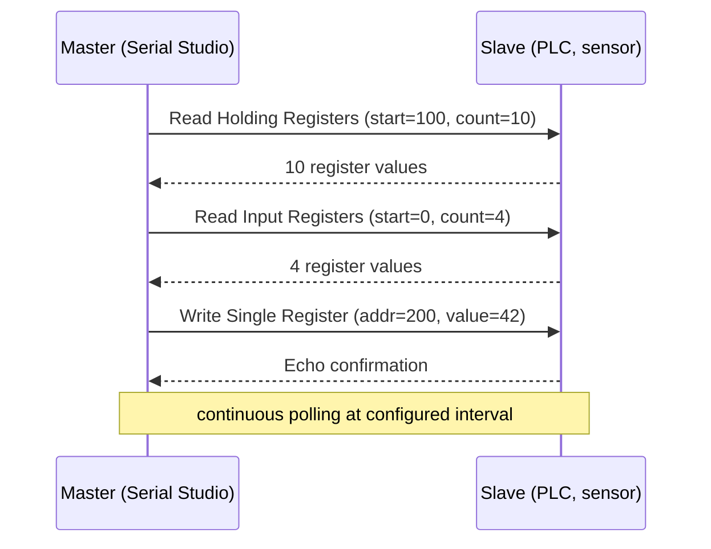
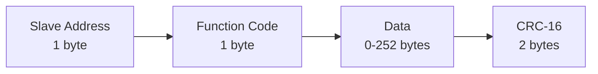
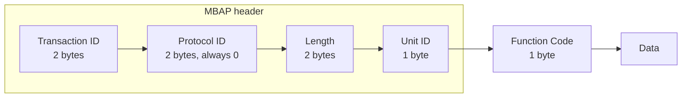

# Modbus Driver (Pro)

Modbus is a long-standing industrial protocol. Designed in 1979 by Modicon for their PLCs, it is now a de-facto standard across factory automation, building management, energy metering, and process control. PLCs, RTUs, and SCADA equipment overwhelmingly speak Modbus, so Serial Studio uses it to read most factory-floor devices.

Serial Studio Pro implements both **Modbus RTU** (over serial) and **Modbus TCP** (over Ethernet), and includes a [register-map importer](Auto-Generating-Projects.md) that turns vendor CSV/XML/JSON files into a working project automatically.

## What is Modbus?

Modbus is a request/response, master/slave protocol for reading and writing memory locations on a remote device. The model is intentionally simple:

- Every Modbus device exposes a flat memory map, divided into four register tables (described below).
- A **master** sends a request frame containing a function code (what to do) and addresses (where in the memory map).
- The **slave** replies with the requested data or an error.

There is no streaming, no events, and no push notifications. The master polls; the slave answers. Continuous data requires continuous polling.

### The four register tables

Modbus organises data into four tables, distinguished by read/write capability and bit width:

| Table              | Width    | Access | Typical use                           |
|--------------------|----------|--------|---------------------------------------|
| **Coils**          | 1 bit    | R/W    | Digital outputs (relays, valves)      |
| **Discrete inputs**| 1 bit    | R only | Digital inputs (switches, sensors)    |
| **Input registers**| 16 bits  | R only | Analog inputs (sensor readings)       |
| **Holding registers**| 16 bits | R/W   | General-purpose storage (setpoints, configuration, scratch values) |

Real devices are fuzzier than the table suggests. A modern temperature transmitter might expose its current reading as a holding register (writable in principle, but writing has no effect) because that is what the firmware engineer chose. Always check the device's documentation rather than assume.

Addresses inside each table go from 0 to 65535. Vendors document them in two ways, which is a frequent source of confusion:

- **PLC numbering** (1-based, table-prefixed): `40001`-`49999` for holding registers, `30001`-`39999` for input registers, and so on.
- **Protocol numbering** (0-based, no prefix): `0`-`65535` per table.

Modbus on the wire uses protocol numbering. PLC numbering is a vendor convention. Holding register `40100` in PLC numbering is *address 99* in protocol numbering. Off-by-one is the single most common Modbus debugging story.

### Function codes

Every Modbus request carries a one-byte function code identifying what to do. The common ones:

| Code | Function | Tables it touches |
|------|----------|-------------------|
| 1    | Read Coils | Coils |
| 2    | Read Discrete Inputs | Discrete inputs |
| 3    | Read Holding Registers | Holding registers |
| 4    | Read Input Registers | Input registers |
| 5    | Write Single Coil | Coils |
| 6    | Write Single Register | Holding registers |
| 15   | Write Multiple Coils | Coils |
| 16   | Write Multiple Registers | Holding registers |

More function codes exist (read/write combined, file records, diagnostics), but those eight cover 95% of real-world traffic.

### Multi-register data types

A Modbus register is 16 bits. Anything wider spans multiple consecutive registers:

- `uint32`, `int32`, `float32`: 2 registers (4 bytes).
- `uint64`, `int64`, `float64`: 4 registers (8 bytes).

Byte and word order are device-specific:

- **Big-endian** (most common): high-order byte first, high-order word first. `0x12345678` in two registers reads as register A = `0x1234`, register B = `0x5678`.
- **Little-endian word swap**: register A = `0x5678`, register B = `0x1234`. Common on some legacy gear.
- **Mixed**: byte-swap inside each register but not between them. Rare but it happens.

Vendor documentation always specifies the order. Serial Studio's register-map importer assumes big-endian by default (the convention used by most modern devices); for anything else, edit the generated frame parser.

### RTU vs TCP

Modbus rides on top of two transports:

#### Modbus RTU

The original. Runs over RS-232, RS-485, or RS-422. Each frame is wrapped with a **slave address** (1 byte, identifies which device on a multi-drop bus), the function code, the data, and a **CRC-16** checksum. Frames are separated by a 3.5-character idle gap on the line.

RTU usually runs on RS-485, which supports up to 247 slaves on a single pair of wires. Each slave has a unique address from 1 to 247; address 0 is reserved for broadcast.

#### Modbus TCP

The Ethernet variant. Wraps Modbus PDUs in a TCP stream. The frame format is different:

There is no CRC because TCP already handles error detection. The **Unit ID** is equivalent to the slave address; it identifies the target when a TCP-to-RTU gateway fronts a multi-drop RS-485 bus. Native Modbus TCP devices typically use Unit ID 1 or 255.

The standard Modbus TCP port is **502**.

## How Serial Studio uses it

Serial Studio acts as the master (Modbus client). One connection polls one slave address; every configured register group is read from that slave. Writes from [Output Controls](Output-Controls.md) target holding registers on the same slave (one or two consecutive registers per write).

### Configuration model

Setup is a hierarchy:

1. **Protocol.** Modbus RTU or Modbus TCP (default: TCP).
   - RTU: **Serial Port**, **Baud Rate** (default 9600), **Parity** (default None), **Data Bits** (default 8), **Stop Bits** (default 1).
   - TCP: **Host** (default `127.0.0.1`) and **Port**. Serial Studio defaults to port 5020, the unprivileged port most local simulators bind; real devices almost always listen on 502.
2. **Slave Address.** 1 to 247 for RTU, Unit ID for TCP. Default 1.
3. **Register groups** (the **Configure Register Groups…** button). One group per contiguous block of same-type registers to read. Each group has:
   - Register type (Holding Registers, Input Registers, Coils, Discrete Inputs).
   - Starting address (0-based, protocol numbering, 0-65535).
   - Count of entries to read in one request: 1 to 125. The cap applies to coil and discrete-input groups as well, even though the protocol allows more bits per read.
4. **Poll Interval (ms).** How often Serial Studio restarts the read cycle. Default 100 ms, minimum 10 ms.

On each poll tick, Serial Studio reads the groups sequentially: it sends the request for the first group, waits for the reply, then moves to the next. Each reply is published to the frame parser as its own binary frame in RTU layout, `[slave address, function code, byte count, data...]`, with no CRC appended; the same layout is used on TCP connections. Register data arrives big-endian (high byte first); coil and discrete-input data arrives as packed bits, least-significant bit first. A reply that reports an error produces no frame. If a reply is still outstanding when the timer fires again, that cycle is skipped, so a slow slave lowers the effective poll rate instead of queueing requests. Requests time out after 1000 ms with 3 retries.

The frame parser extracts named datasets from those bytes through its `parse(frame)` entry point, where `frame` is the byte array above (use the **Binary** decoder and no frame delimiters). Because the groups arrive as separate frames, a hand-written parser must track which group each frame belongs to; the auto-generated Lua parser counts frames through the cycle. See [Frame Parser Scripting](JavaScript-API.md).

### Auto-generation

For devices with documented register maps, the [Modbus map importer](Auto-Generating-Projects.md) (**Import Register Map…** in the setup panel) reads vendor CSV/XML/JSON files and generates the register groups, datasets, and a complete Lua frame parser automatically. This is the recommended starting point. Without a vendor file, the **Generate Project** button in the register-groups dialog builds an equivalent project from the groups configured by hand.

### Threading

The Modbus driver wraps Qt's `QModbusClient` and runs on the main thread. Polling is event-driven (no busy loop); Qt's async I/O delivers responses via signals. See [Threading and Timing Guarantees](Threading-and-Timing.md).

### API control

The [Socket API](API-Reference.md) and the in-app [AI Assistant](AI-Assistant.md) configure this driver through the `io.modbus.*` command scope. Mutations: `setProtocolIndex` (param `protocolIndex`: 0 = RTU, 1 = TCP), `setSlaveAddress` (`address`: 1-247), `setPollInterval` (`intervalMs`: minimum 10), `setHost` (`host`), `setPort` (`port`), `setSerialPortIndex` (`portIndex`), `setBaudRate` (`baudRate`), `setParityIndex` (`parityIndex`), `setDataBitsIndex` (`dataBitsIndex`), `setStopBitsIndex` (`stopBitsIndex`), `addRegisterGroup` (`type`: 0 = Holding Registers, 1 = Input Registers, 2 = Coils, 3 = Discrete Inputs; `startAddress`: 0-65535; `count`: 1-125), `removeRegisterGroup` (`groupIndex`), `clearRegisterGroups`. Read-only: `getConfig`, `listProtocols`, `listSerialPorts`, `listParities`, `listDataBits`, `listStopBits`, `listBaudRates`, `listRegisterTypes`, `listRegisterGroups`. For the AI Assistant the setters are device-gated: blocked until the user ticks **Allow device control**, and each call still requires confirmation.

For step-by-step setup, see the [Protocol Setup Guides, Modbus section](Protocol-Setup-Guides.md).

## Common pitfalls

- **"No response from slave."** Verify the slave address. Different PLC vendors use different defaults (1 is common but not universal). On RS-485, check the wiring: A-to-A, B-to-B, plus a common ground when the bus spans different power domains.
- **Off-by-one address.** PLC numbering versus protocol numbering. If the docs say "holding register 40101", the protocol address is *100*, not 40101 and not 101.
- **CRC errors on RTU.** Almost always a wiring or termination issue. RS-485 needs 120 Ω terminators at both ends of the trunk. Stub branches longer than a few inches corrupt the CRC at high baud rates.
- **Wrong byte order for 32-bit values.** Read raw 16-bit registers, inspect the bytes, and compare them to the vendor documentation. Most modern devices use big-endian word and big-endian byte order. A float that reads as `1.234e-23` is being decoded with the wrong endianness.
- **Polling too fast.** Some devices, especially older PLCs, cannot process requests faster than about one every 100 ms. Serial Studio accepts intervals down to 10 ms, but when a reply is still pending at the next tick the whole cycle is skipped, so an overdriven slave shows up as a low or irregular frame rate. Slow the poll interval down.
- **TCP works but RTU does not.** RS-485 is an unforgiving electrical environment: long cables, missing ground, intermittent termination, or missing bias resistors can all break it. Some adapters lack pull-up/pull-down on the idle bus and need an external biasing network. An oscilloscope on the line is the fastest way to diagnose this.
- **"Illegal data address" exception.** The slave's memory map does not contain that register. Recheck the vendor documentation. Some PLCs only respond to addresses configured in their program; others allow reads of any address. Serial Studio discards error replies, so a group that triggers this exception produces no frames at all.
- **Slave responds slowly under load.** Modern Modbus TCP is fast; Modbus RTU at 9600 baud is slow by design. A 60-register read takes about 12 ms of wire time alone, plus device processing time. Do not expect kilohertz polling on serial.

## Further reading

- [Modbus (Wikipedia)](https://en.wikipedia.org/wiki/Modbus)
- [Modbus Protocol Overview (modbustools.com)](https://www.modbustools.com/modbus.html)
- [Modbus RTU Made Simple (IPC2U)](https://ipc2u.com/articles/knowledge-base/modbus-rtu-made-simple-with-detailed-descriptions-and-examples/)
- [What is Modbus & How Does It Work (NI)](https://www.ni.com/en/shop/seamlessly-connect-to-third-party-devices-and-supervisory-system/the-modbus-protocol-in-depth.html)
- [Introduction to Modbus and Modbus Function Codes (Control.com)](https://control.com/technical-articles/introduction-to-modbus-and-modbus-function-codes/)
- [modbus.org (official Modbus site)](https://modbus.org/)

## See also

- [Auto-Generating Projects](Auto-Generating-Projects.md): Modbus register-map import (CSV/XML/JSON).
- [Protocol Setup Guides](Protocol-Setup-Guides.md): step-by-step Modbus setup.
- [Data Sources](Data-Sources.md): driver capability summary across all transports.
- [Communication Protocols](Communication-Protocols.md): overview of all supported transports.
- [Use Cases](Use-Cases.md): industrial monitoring and PLC integration examples.
- [Troubleshooting](Troubleshooting.md): wiring, addressing, and CRC-error diagnostics.
- [Drivers: UART](Drivers-UART.md): RTU rides on serial; the UART page covers RS-485 physical layer.
- [Drivers: Network](Drivers-Network.md): TCP transport details.
- [Drivers: CAN Bus](Drivers-CAN-Bus.md): the other big industrial protocol.
