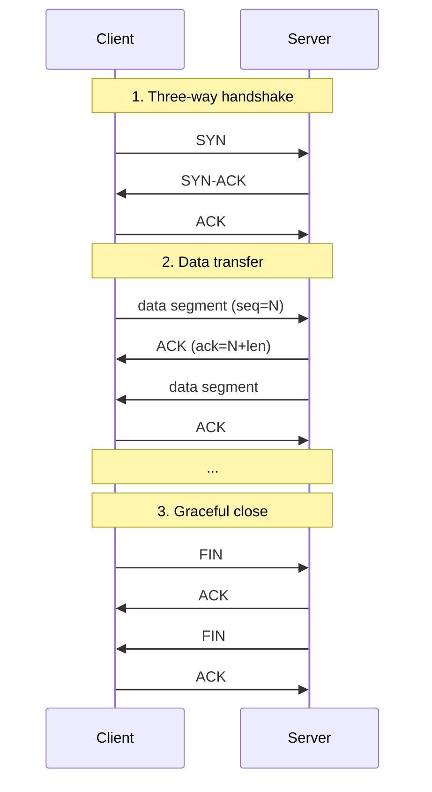
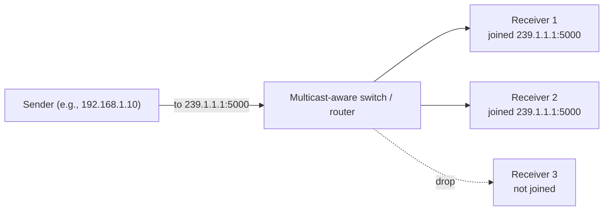

# Network Driver (TCP / UDP)

The Network driver is the right transport once a project outgrows a single USB cable: when the device is on another machine, behind a network gateway, on a Wi-Fi link, or being shared between multiple Serial Studio instances. The driver speaks two transport protocols:

- **TCP**, for reliable, ordered, connection-oriented streams.
- **UDP**, for low-overhead, connectionless datagrams, including multicast.

Both are available in the free build.

## What is TCP?

TCP, the **Transmission Control Protocol**, was specified in [RFC 793](https://www.rfc-editor.org/rfc/rfc793) in 1981 and is still the workhorse of the Internet. It provides a reliable, ordered stream of bytes between two endpoints, hides packet loss, retransmits what is missing, and enforces flow control so a fast sender does not overwhelm a slow receiver.

### How TCP looks on the wire

A TCP connection has three phases:

Once the handshake completes, both sides see a virtual full-duplex pipe: write bytes in at one end, and the same bytes come out at the other end, in order, with nothing missing. TCP achieves this on top of an unreliable IP network by numbering every byte, acknowledging what it received, and retransmitting anything that is not acknowledged in time.

### Stream, not message

The most important thing about TCP is that it is a stream of bytes, not a stream of messages. If a device writes 100 bytes followed by 100 bytes, the receiver may see one read of 200 bytes, or two of 100, or 200 of 1. The boundaries are not preserved.

This matters for Serial Studio because frame parsing has to operate on the stream. With a delimiter (newline, custom byte sequence) the FrameReader finds frames regardless of how the OS chunked the stream. With fixed-length frames it counts bytes. Either approach works; do not assume "one TCP packet = one frame". Each extracted frame is then handed to the project's [frame parser](JavaScript-API.md) as a single `parse(frame)` call.

### Ports

Every TCP endpoint is `(IP address, port number)`. Ports go from 0 to 65535. 0-1023 are "well-known" (reserved for system services on most operating systems); 1024-49151 are "registered" (database servers, application services); 49152-65535 are "ephemeral" (assigned by the OS to outgoing client connections).

Serial Studio enforces no specific choice. Use whatever the device is configured for.

## What is UDP?

UDP, the **User Datagram Protocol**, was specified in [RFC 768](https://www.rfc-editor.org/rfc/rfc768) in 1980; the entire specification is three pages. Where TCP provides a reliable stream, UDP provides something far simpler: send one packet and hope it arrives. There are no guarantees.

UDP's header is 8 bytes: source port, destination port, length, and checksum. There is no handshake, no acknowledgement, no retransmission, no ordering, and no flow control. A lost packet stays lost. Out-of-order packets stay out of order.

### When to choose UDP over TCP

- **Real-time data where freshness beats reliability.** Live sensor readings at high rates: a dropped packet is replaced by the next one on its way, and retransmitting a stale reading is worse than skipping it.
- **One-to-many distribution (multicast).** TCP cannot multicast; UDP can.
- **Low overhead.** UDP avoids per-connection state and the handshake. Useful when the device is a small microcontroller with limited RAM.
- **Discovery and beacons.** "I'm here, my IP is X" announcements fit onto UDP broadcast or multicast.

Choose UDP when either the data is inherently datagram-shaped (one self-contained reading per packet), or it is acceptable to drop a stale message rather than wait for it.

### Multicast

UDP supports a special form of distribution called **multicast**: one sender publishes to a multicast group address, and any number of receivers can subscribe to that group. Routers and switches that support multicast replicate packets only where receivers exist.

Multicast group addresses are in the IP range `224.0.0.0` to `239.255.255.255`. The most useful sub-range for application traffic is `239.0.0.0/8` (administratively scoped, organisation-local).

Receivers join a group by sending an **IGMP** (Internet Group Management Protocol) Membership Report. The router then forwards the multicast traffic on that interface. When the receiver leaves, it sends an IGMP Leave message and the router stops forwarding. Without IGMP support in the network, multicast either floods everywhere or fails entirely.

In Serial Studio, multicast is useful when:

- Multiple dashboards on a LAN need to receive the same telemetry without each opening a separate TCP connection to the source.
- The data source is a CAN-to-UDP gateway that publishes a multicast group per CAN bus.
- You are integrating with industrial multicast publishers (some PLCs, OPC UA Pub/Sub, audio-over-IP systems).

## How Serial Studio uses it

The Network driver wraps Qt's `QTcpSocket` and `QUdpSocket`. It lives on the main thread and uses Qt's async I/O; there is no dedicated thread (see [Threading and Timing Guarantees](Threading-and-Timing.md)).

> **Serial Studio is a TCP client only.** It dials out to an existing TCP server. It does not listen for incoming TCP connections, and there is no setting to make it act as a server. If the device expects to push data to a listener, run a small TCP server in front of Serial Studio (see [Common pitfalls](#common-pitfalls)).

The Setup panel exposes these fields:

| Field | Applies to | Controls | Default |
|-------|------------|----------|---------|
| **Socket Type** | both | TCP or UDP | TCP |
| **Remote Address** | both | Server IP / hostname (TCP) or peer / multicast group (UDP) | `127.0.0.1` |
| **Remote Port** | TCP, UDP non-multicast | Port to connect to (TCP) or send to (UDP); hidden while **Multicast** is checked | 23 (TCP), 53 (UDP) |
| **Local Port** | UDP only | Port to bind for receiving; `0` = OS-assigned | 0 |
| **Multicast** | UDP only | When checked, **Remote Address** is treated as a multicast group (e.g. `239.1.1.1`) and Serial Studio joins it on connect; the OS handles IGMP transparently | off |

**Remote Address** accepts hostnames as well as IP literals. A hostname triggers a background DNS lookup, and the Connect button stays disabled until the name resolves. Clearing the address or a port field restores its default.

UDP uses a single socket; there is no separate Receiver / Sender / Multicast mode. Serial Studio binds **Local Port** to receive datagrams. Incoming datagrams are read one at a time, so on the receive side UDP preserves the message boundaries that TCP discards. Outbound data (actions, output controls, the console send line) is sent as datagrams to **Remote Address** / **Remote Port**.

The same settings are scriptable through the `io.network.*` commands of the [JSON-RPC API](API-Reference.md): `setSocketType` (`socketTypeIndex` 0 = TCP, 1 = UDP), `setRemoteAddress`, `setTcpPort`, `setUdpLocalPort`, `setUdpRemotePort`, `setUdpMulticast`, and `lookup`, plus the read-only `getConfig` and `listSocketTypes`. The port commands take a `port` parameter (1-65535; `setUdpLocalPort` also accepts 0). When the in-app AI issues these commands, they sit behind the **Allow device control** toggle.

For step-by-step setup, see the [Protocol Setup Guides, Network section](Protocol-Setup-Guides.md).

## Common pitfalls

- **Serial Studio cannot connect over TCP.** Confirm that the device or remote service is listening. From a terminal, `telnet host port` (or `nc host port`) tries the same connection; if that fails, the problem is in the network or the remote endpoint, not in Serial Studio.
- **The device wants to push to a listener.** Serial Studio is TCP client only and cannot listen for inbound TCP connections. Stand up a small TCP server that the device connects to and point Serial Studio at that server. A 10-line Python script is enough (the [FAQ](FAQ.md) includes one); `ncat -lk <port>` and `socat` also work. To avoid running a relay at all, send the data over UDP, since Serial Studio binds a local port for that.
- **Firewall blocks the port.** On Windows, the Windows Firewall prompt may have been dismissed without granting access. Re-allow Serial Studio in Windows Firewall settings. On Linux, `ufw status` shows whether the port is blocked.
- **Address already in use (UDP local port).** Another process is bound to the same port. Find it with `netstat -an | findstr :7777` (Windows) or `lsof -i :7777` (Linux/macOS). The error does not apply to TCP: Serial Studio is a TCP client and uses an OS-assigned ephemeral source port.
- **UDP packets arrive out of order or get lost.** That is UDP working as designed, not a bug. If the application cannot tolerate it, switch to TCP or layer sequence numbers on top.
- **Multicast traffic does not cross subnets.** Most home routers do not forward multicast across VLANs without explicit IGMP-snooping configuration. Multicast is reliable on a single LAN segment; cross-subnet routing is a network-admin problem.
- **TCP appears slow on Windows.** Nagle's algorithm is on by default and bunches small writes together to amortise header overhead. For interactive serial-style streams it can add up to 200 ms of latency. Most embedded TCP stacks support disabling Nagle (`TCP_NODELAY`); configure this on the device or remote service if latency matters, since Serial Studio leaves the socket at Qt's defaults.
- **A "raw TCP socket" still imposes structure.** TCP is a byte stream and frame boundaries are the application's responsibility. If a device sends `frame1frame2frame3` with no delimiter and no length prefix, parsing is impossible. Add a delimiter (newline) or a length prefix.

## Further reading

- [RFC 793: Transmission Control Protocol (TCP)](https://www.rfc-editor.org/rfc/rfc793)
- [RFC 768: User Datagram Protocol (UDP)](https://www.rfc-editor.org/rfc/rfc768)
- [Internet Group Management Protocol (Wikipedia)](https://en.wikipedia.org/wiki/Internet_Group_Management_Protocol)
- [What is IGMP? (Cloudflare Learning Center)](https://www.cloudflare.com/learning/network-layer/what-is-igmp/)
- [User Datagram Protocol (Wikipedia)](https://en.wikipedia.org/wiki/User_Datagram_Protocol)
- [The Difference Between TCP and UDP Explained (Linode Docs)](https://www.linode.com/docs/guides/difference-between-tcp-and-udp/)

## See also

- [Protocol Setup Guides](Protocol-Setup-Guides.md): step-by-step Network setup in the Setup Panel.
- [Data Sources](Data-Sources.md): driver capability summary across all transports.
- [Communication Protocols](Communication-Protocols.md): overview of all supported transports.
- [MQTT Subscriber](Drivers-MQTT.md): when you need pub/sub semantics on top of TCP.
- [MQTT Topics & Semantics](MQTT-Topics.md): the protocol vocabulary that MQTT layers on top of TCP.
- [Troubleshooting](Troubleshooting.md): firewall, port-conflict, and connectivity diagnostics.
- [Drivers: UART](Drivers-UART.md): the physical-layer alternative when both ends are local.
- [API Reference](API-Reference.md): Serial Studio's own JSON-RPC TCP API on port 7777.
