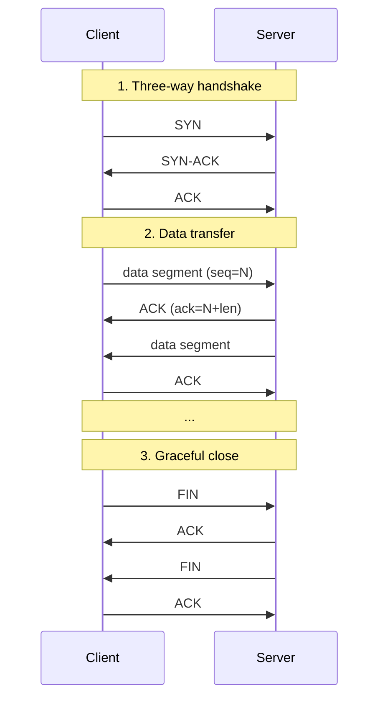
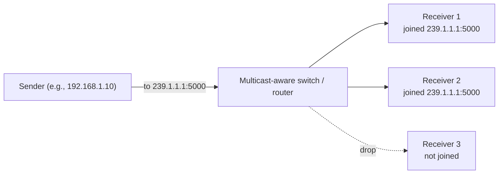
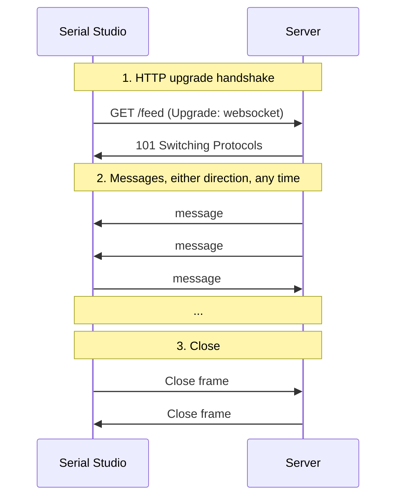
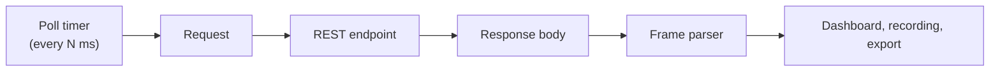

# Network Driver (TCP / UDP / WebSocket / HTTP)

The Network driver is the right transport once a project outgrows a single USB cable: when the device is on another machine, behind a network gateway, on a Wi-Fi link, or being shared between multiple Serial Studio instances. The driver speaks four protocols:

- **TCP**, for reliable, ordered, connection-oriented streams.
- **UDP**, for low-overhead, connectionless datagrams, including multicast.
- **WebSocket**, for message-oriented feeds from a gateway, a broker, or a cloud service.
- **HTTP**, for polling a REST endpoint that returns a reading per request.

All four are clients, all four are available in the free build, and all four feed the same acquisition pipeline, so the frame parser, dashboard, recording and export behave identically whichever one is selected.

## TCP basics

TCP, the **Transmission Control Protocol**, was specified in [RFC 793](https://www.rfc-editor.org/rfc/rfc793) in 1981 and is still the workhorse of the Internet. It provides a reliable, ordered stream of bytes between two endpoints, hides packet loss, retransmits what is missing, and enforces flow control so a fast sender does not overwhelm a slow receiver.

### How TCP looks on the wire

A TCP connection has three phases:


```mermaid
sequenceDiagram
    participant C as Client
    participant S as Server

    Note over C,S: 1. Three-way handshake
    C->>S: SYN
    S->>C: SYN-ACK
    C->>S: ACK

    Note over C,S: 2. Data transfer
    C->>S: data segment (seq=N)
    S->>C: ACK (ack=N+len)
    S->>C: data segment
    C->>S: ACK
    Note over C,S: ...

    Note over C,S: 3. Graceful close
    C->>S: FIN
    S->>C: ACK
    S->>C: FIN
    C->>S: ACK
```

Once the handshake completes, both sides see a virtual full-duplex pipe: write bytes in at one end, and the same bytes come out at the other end, in order, with nothing missing. TCP achieves this on top of an unreliable IP network by numbering every byte, acknowledging what it received, and retransmitting anything that is not acknowledged in time.

### Stream, not message

The most important thing about TCP is that it is a stream of bytes, not a stream of messages. If a device writes 100 bytes followed by 100 bytes, the receiver may see one read of 200 bytes, or two of 100, or 200 of 1. The boundaries are not preserved.

This matters for Serial Studio because frame parsing has to operate on the stream. With a delimiter (newline, custom byte sequence) the FrameReader finds frames regardless of how the OS chunked the stream. With fixed-length frames it counts bytes. Either approach works; do not assume "one TCP packet = one frame". Each extracted frame is then handed to the project's [frame parser](JavaScript-API.md) as a single `parse(frame)` call.

### Ports

Every TCP endpoint is `(IP address, port number)`. Ports go from 0 to 65535. 0-1023 are "well-known" (reserved for system services on most operating systems); 1024-49151 are "registered" (database servers, application services); 49152-65535 are "ephemeral" (assigned by the OS to outgoing client connections).

Serial Studio enforces no specific choice. Use whatever the device is configured for.

## UDP basics

UDP, the **User Datagram Protocol**, was specified in [RFC 768](https://www.rfc-editor.org/rfc/rfc768) in 1980; the entire specification is three pages. Where TCP provides a reliable stream, UDP provides something far simpler: send one packet and hope it arrives. There are no guarantees.

UDP's header is 8 bytes: source port, destination port, length, and checksum. There is no handshake, no acknowledgement, no retransmission, no ordering, and no flow control. A lost packet stays lost. Out-of-order packets stay out of order.

### When to choose UDP over TCP

- **Real-time data where freshness beats reliability.** Live sensor readings at high rates: a dropped packet is replaced by the next one on its way, and retransmitting a stale reading is worse than skipping it.
- **One-to-many distribution (multicast).** TCP cannot multicast; UDP can.
- **Low overhead.** UDP avoids per-connection state and the handshake. Useful when the device is a small microcontroller with limited RAM.
- **Discovery and beacons.** "I'm here, my IP is X" announcements fit onto UDP broadcast or multicast.

Choose UDP when either the data is inherently datagram-shaped (one self-contained reading per packet), or it is acceptable to drop a stale message rather than wait for it.

### Multicast

UDP supports a special form of distribution called **multicast**: one sender publishes to a multicast group address, and any number of receivers can subscribe to that group. Routers and switches that support multicast replicate packets only where receivers exist.

Multicast group addresses are in the IP range `224.0.1.0` to `239.255.255.255`. The most useful sub-range for application traffic is `239.0.0.0/8` (administratively scoped, organisation-local).


```mermaid
flowchart LR
    Sender["Sender (e.g., 192.168.1.10)"]
    Switch[Multicast-aware switch / router]
    R1["Receiver 1<br/>joined 239.1.1.1:5000"]
    R2["Receiver 2<br/>joined 239.1.1.1:5000"]
    R3["Receiver 3<br/>not joined"]

    Sender -->|"to 239.1.1.1:5000"| Switch
    Switch --> R1
    Switch --> R2
    Switch -. drop .-> R3
```

Receivers join a group by sending an **IGMP** (Internet Group Management Protocol) Membership Report. The router then forwards the multicast traffic on that interface. When the receiver leaves, it sends an IGMP Leave message and the router stops forwarding. Without IGMP support in the network, multicast either floods everywhere or fails entirely.

In Serial Studio, multicast is useful when:

- Multiple dashboards on a LAN need to receive the same telemetry without each opening a separate TCP connection to the source.
- The data source is a CAN-to-UDP gateway that publishes a multicast group per CAN bus.
- You are integrating with industrial multicast publishers (some PLCs, OPC UA Pub/Sub, audio-over-IP systems).

## WebSocket basics

WebSocket, specified in [RFC 6455](https://www.rfc-editor.org/rfc/rfc6455), starts life as an ordinary HTTP request that asks the server to switch protocols. Once the server agrees, the same TCP connection stops speaking HTTP and becomes a two-way channel that either side can write to at any time.


```mermaid
sequenceDiagram
    participant C as Serial Studio
    participant S as Server

    Note over C,S: 1. HTTP upgrade handshake
    C->>S: GET /feed  (Upgrade: websocket)
    S->>C: 101 Switching Protocols

    Note over C,S: 2. Messages, either direction, any time
    S->>C: message
    S->>C: message
    C->>S: message
    Note over C,S: ...

    Note over C,S: 3. Close
    C->>S: Close frame
    S->>C: Close frame
```

### Messages, not a byte stream

The difference that matters for Serial Studio is that WebSocket preserves **message boundaries**. Where TCP delivers an arbitrary slice of bytes, a WebSocket message arrives whole: if the server sends 100 bytes and then 100 bytes, you receive exactly two messages. Serial Studio publishes each one separately, so with **No Delimiters** frame detection you get exactly one frame per message, the same way one UDP datagram becomes one frame. If your project uses a delimiter instead, that still works: the delimiter is applied to the message contents just as it would be to a TCP stream.

Messages come in two flavours, text (UTF-8) and binary. Serial Studio receives both and passes the raw bytes to the parser either way; a text message reaches it as its UTF-8 encoding.

### When to choose WebSocket

- The device or service already exposes one, which is common for gateways, cloud brokers, and anything with a browser dashboard.
- You want message framing for free rather than inventing a delimiter.
- The link has to traverse a proxy or firewall that only permits HTTP ports.
- You need the server to push data as it happens, without polling.

`wss://` is WebSocket over TLS, and is the right default over any network you do not control.

## HTTP basics

HTTP needs less introduction: Serial Studio issues a request to a URL and the response body is the data. Because HTTP is request/response rather than a push protocol, Serial Studio **polls** — it repeats the request on a fixed interval and treats each response body as one chunk of incoming data.


```mermaid
flowchart LR
    T["Poll timer<br/>(every N ms)"] --> R[Request]
    R --> S[REST endpoint]
    S --> B[Response body]
    B --> P[Frame parser]
    P --> D[Dashboard, recording, export]
```

### When to choose HTTP

- The only interface the device or service offers is a REST API.
- The data changes slowly enough that polling once a second, or once a minute, is enough: weather stations, building sensors, cloud telemetry, lab instruments behind a web front end.
- You need to *interact* with an API rather than only read from it, sending a command and charting the response.

It is the wrong choice for anything fast. Each reading costs a full request/response round trip, so HTTP is comfortable in the range of a few readings per second, not thousands. For high-rate data, use TCP, UDP, or WebSocket.

### Polling, and not polling

The **Poll Interval** decides the cadence:

- A value in milliseconds repeats the request forever at that rate. The floor is 10 ms; be considerate with public APIs, which frequently rate-limit.
- **Zero** turns polling off entirely. Serial Studio connects, sends one request, and then stays quiet until *you* send something. This is the mode for a command/response API driven from the console, an [action widget](Widgets-Actions.md), or an output widget: each send issues one request and its response comes back as a frame.

Only one request is ever in flight. If a response has not arrived by the time the next interval elapses, that tick is skipped rather than queued, because a backlog of requests behind a slow endpoint reports data older than the dashboard already displayed. Skipped ticks are counted and readable through the API.

### When a poll fails

A failed poll does **not** disconnect. A transport error, a TLS failure, or any non-2xx status leaves the link up and the timer running; the first failure of a run is written to the console, the rest are counted silently, and a recovery is announced once. This matches how real APIs behave: a 503 during a deploy should not end a recording that has been running for an hour.

The connect attempt is stricter. Clicking **Connect** issues the configured request once and that request *is* the verdict, so an unreachable host or a 404 is caught immediately instead of surfacing quietly at the first poll. Its response body is published like any other, giving you an initial reading straight away.

## How Serial Studio uses it

The Network driver wraps Qt's `QTcpSocket`, `QUdpSocket`, `QWebSocket`, and `QNetworkAccessManager`. Incoming bytes are handed off to the acquisition pipeline thread for frame assembly (see [Threading and Timing Guarantees](Threading-and-Timing.md)). Opening a TCP connection is not purely asynchronous: the driver probes the resolved endpoint synchronously with a 5-second deadline, retrying a refused connection every 250 ms so a helper process that binds its listening socket late is still caught before the deadline expires. UDP sockets open immediately since there is no remote endpoint to dial. WebSocket and HTTP dial in the background, so the toolbar button reads "Connecting..." until the handshake or the first request settles.

> **Serial Studio is always the client.** It dials out; it never listens. There is no server mode for any of the four transports, and no setting that adds one. If the device expects to push data to a listener, run a small server in front of Serial Studio (see [Common pitfalls](#common-pitfalls)).

The Setup panel exposes these fields:

| Field | Applies to | Controls | Default |
|-------|------------|----------|---------|
| **Socket Type** | all | TCP, UDP, WebSocket, or HTTP | TCP |
| **Remote Address** | TCP, UDP | Server IP / hostname (TCP) or peer / multicast group (UDP) | `127.0.0.1` |
| **Remote Port** | TCP, UDP non-multicast | Port to connect to (TCP) or send to (UDP); hidden while **Multicast** is checked | 23 (TCP), 53 (UDP) |
| **Local Port** | UDP only | Port to bind for receiving; `0` = OS-assigned | 0 |
| **Multicast** | UDP only | When checked, **Remote Address** is treated as a multicast group (e.g. `239.1.1.1`) and Serial Studio joins it on connect; the OS handles IGMP transparently | off |
| **URL** | WebSocket | Endpoint to dial; must be `ws://` or `wss://` | `ws://127.0.0.1:8080` |
| **Send Format** | WebSocket | How written payloads are framed: **Automatic** sends text when the bytes are valid UTF-8 and binary otherwise, or force one | Automatic |
| **URL** | HTTP | Endpoint to request; must be `http://` or `https://` | `http://127.0.0.1:8080/` |
| **Method** | HTTP | `GET`, `POST`, `PUT`, `PATCH`, or `DELETE` | GET |
| **Poll Interval** | HTTP | Milliseconds between requests; `0` sends only when you write | 1000 |
| **Request Body** | HTTP | Body sent with every request | empty |
| **Request Headers** | HTTP | One `Name: Value` pair per line | empty |
| **Ignore TLS Errors** | WebSocket, HTTP | Accepts a self-signed or hostname-mismatched certificate | off |

**Remote Address** accepts hostnames as well as IP literals. The TCP dial resolves the hostname itself: a bad hostname surfaces as a "Host not found" dial error after clicking **Connect**, rather than as a disabled Connect button. Clearing the address or a port field restores its default.

UDP uses a single socket; there is no separate Receiver / Sender / Multicast mode. Serial Studio binds **Local Port** to receive datagrams. Incoming datagrams are read one at a time, so on the receive side UDP preserves the message boundaries that TCP discards. Outbound data (actions, output controls, the console send line) is sent as datagrams to **Remote Address** / **Remote Port**.

The **URL** fields are validated when you press **Connect**, not while you type, so a half-typed address does not fight the field. A URL whose scheme does not match the selected transport is refused with a message saying so.

### Authentication and headers

There are no dedicated username, password, or token fields. Anything an API needs goes into **Request Headers**, one pair per line:

```
Authorization: Bearer eyJhbGciOi...
X-Api-Key: 4f9a2c...
Accept: application/json
```

Serial Studio sends `Content-Type: application/octet-stream` unless you supply a `Content-Type` header yourself, in which case yours wins. Redirects are followed for `GET` only: replaying a request body against a redirect target would be a second side effect you did not ask for.

### TLS

`wss://` and `https://` verify the server's certificate chain by default, and a failure aborts the connection before any data is exchanged. **Ignore TLS Errors** exists for lab endpoints with self-signed certificates; when it is on, every connection that uses the bypass says so in the console, so it cannot be inherited silently from a shared project file.

The same settings are scriptable through the `io.network.*` commands of the [JSON-RPC API](API-Reference.md): `setSocketType` (`socketTypeIndex` 0 = TCP, 1 = UDP, 2 = WebSocket, 3 = HTTP), `setRemoteAddress`, `setTcpPort`, `setUdpLocalPort`, `setUdpRemotePort`, `setUdpMulticast`, `setWebSocketUrl`, `setHttpUrl`, `setHttpMethod`, `setHttpBody`, `setHttpHeaders`, `setHttpInterval`, and `setIgnoreTlsErrors`, plus the read-only `lookup`, `getConfig`, `listSocketTypes`, and `getStatus`. The port commands take a `port` parameter (1-65535; `setUdpLocalPort` also accepts 0). `getStatus` reports the link state and the HTTP poll counters (`pollsOk`, `pollsFailed`, `pollsSkipped`, `consecutiveFailures`), which is how you check on a source that is quietly failing. When the in-app AI calls any of the setter commands above, they sit behind the **Allow device control** toggle; `lookup`, `getConfig`, `listSocketTypes`, and `getStatus` are read-only and run without it.

For step-by-step setup, see the [Protocol Setup Guides, Network section](Protocol-Setup-Guides.md).

## Common pitfalls

- **Serial Studio cannot connect over TCP.** Confirm that the device or remote service is listening. From a terminal, `telnet host port` (or `nc host port`) tries the same connection; if that fails, the problem is in the network or the remote endpoint, not in Serial Studio.
- **The device wants to push to a listener.** Serial Studio is a client on every transport and cannot accept inbound connections. Stand up a small server that accepts the device's connection and re-serves the data to Serial Studio; `ncat -lk <port>` and `socat` also work. To avoid running a relay at all, send the data over UDP, since Serial Studio binds a local port for that.
- **The WebSocket connects and then immediately drops.** Most often the server expects a subprotocol or an authentication token in the handshake, neither of which Serial Studio sends. The console reports the close reason the server gave. A URL query string (`ws://host/feed?token=...`) is usually the workable path.
- **An `https://` endpoint refuses to connect.** If the console reports a certificate error, the endpoint is using a certificate your machine does not trust, typically self-signed. Install the certificate in the OS trust store, or tick **Ignore TLS Errors** if it is a device on your own bench.
- **HTTP charts update far slower than the poll interval.** Check `pollsSkipped` through `io.network.getStatus`. A skipped tick means the endpoint had not answered the previous request yet, so the effective rate is bounded by the server's response time, not by your interval.
- **The dashboard shows nothing although the HTTP endpoint answers.** The response body reaches the frame parser exactly as received. For a JSON reading, set frame detection to **No Delimiters** so each response becomes one frame, then parse the JSON in the frame parser.
- **Firewall blocks the port.** On Windows, the Windows Firewall prompt may have been dismissed without granting access. Re-allow Serial Studio in Windows Firewall settings. On Linux, `ufw status` shows whether the port is blocked.
- **Address already in use (UDP local port).** Another process is bound to the same port. Find it with `netstat -an | findstr :7777` (Windows) or `lsof -i :7777` (Linux/macOS). The error does not apply to TCP: Serial Studio is a TCP client and uses an OS-assigned ephemeral source port.
- **UDP packets arrive out of order or get lost.** That is UDP working as designed, not a bug. If the application cannot tolerate it, switch to TCP or layer sequence numbers on top.
- **Multicast traffic does not cross subnets.** Most home routers do not forward multicast across VLANs without explicit IGMP-snooping configuration. Multicast is reliable on a single LAN segment; cross-subnet routing is a network-admin problem.
- **TCP appears slow on Windows.** Nagle's algorithm is on by default and bunches small writes together to amortise header overhead. For interactive serial-style streams it can add up to 200 ms of latency. Most embedded TCP stacks support disabling Nagle (`TCP_NODELAY`); configure this on the device or remote service if latency matters, since Serial Studio leaves the socket at Qt's defaults.
- **A "raw TCP socket" still imposes structure.** TCP is a byte stream and frame boundaries are the application's responsibility. If a device sends `frame1frame2frame3` with no delimiter and no length prefix, parsing is impossible. Add a delimiter (newline) or a length prefix.

## Further reading

- [RFC 793: Transmission Control Protocol (TCP)](https://www.rfc-editor.org/rfc/rfc793)
- [RFC 768: User Datagram Protocol (UDP)](https://www.rfc-editor.org/rfc/rfc768)
- [RFC 6455: The WebSocket Protocol](https://www.rfc-editor.org/rfc/rfc6455)
- [RFC 9110: HTTP Semantics](https://www.rfc-editor.org/rfc/rfc9110)
- [Internet Group Management Protocol (Wikipedia)](https://en.wikipedia.org/wiki/Internet_Group_Management_Protocol)
- [What is IGMP? (Cloudflare Learning Center)](https://www.cloudflare.com/learning/network-layer/what-is-igmp/)
- [User Datagram Protocol (Wikipedia)](https://en.wikipedia.org/wiki/User_Datagram_Protocol)
- [The Difference Between TCP and UDP Explained (Linode Docs)](https://www.linode.com/docs/guides/difference-between-tcp-and-udp/)

## See also

- [Protocol Setup Guides](Protocol-Setup-Guides.md): step-by-step Network setup in the Setup Panel.
- [Data Sources](Data-Sources.md): driver capability summary across all transports.
- [Communication Protocols](Communication-Protocols.md): overview of all supported transports.
- [MQTT Subscriber](Drivers-MQTT.md): when you need pub/sub semantics on top of TCP.
- [MQTT Topics & Semantics](MQTT-Topics.md): the protocol vocabulary that MQTT layers on top of TCP.
- [Troubleshooting](Troubleshooting.md): firewall, port-conflict, and connectivity diagnostics.
- [Drivers: UART](Drivers-UART.md): the physical-layer alternative when both ends are local.
- [API Reference](API-Reference.md): Serial Studio's own JSON-RPC TCP API on port 7777.
