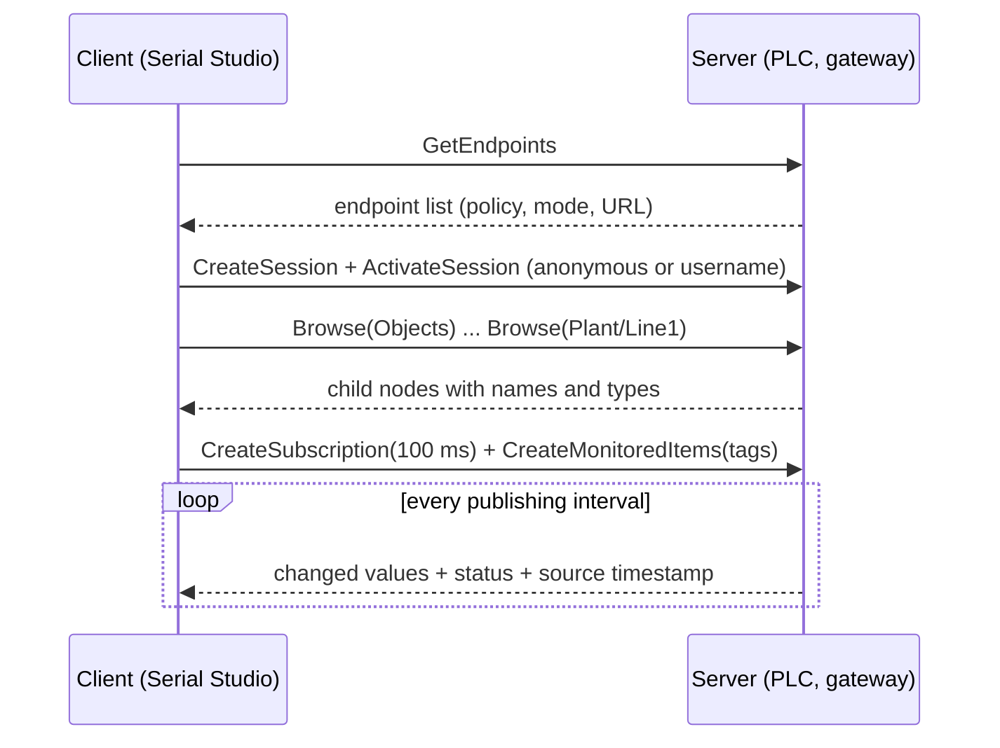

# OPC UA Driver (Pro)

OPC UA (IEC 62541) is the tag-oriented interface modern automation equipment exposes over Ethernet. PLCs, SCADA servers and gateways publish a browsable **address space** of named, typed variables; a client subscribes to the ones it cares about and the server pushes changes. Serial Studio Pro implements an OPC UA **client**: it discovers a server's endpoints, browses its tags, builds a project from the selection and streams live values into the dashboard.

Because OPC UA is the common denominator across vendors, one driver reaches Rockwell controllers through a FactoryTalk Linx Gateway, any device behind KEPServerEX or Ignition, Siemens S7-1200/1500 and WinCC, Beckhoff TwinCAT, CODESYS runtimes, B&R, WAGO and Schneider PLCs. Vendor names appear here only to state compatibility; the driver speaks the standard, not a vendor dialect.

## OPC UA overview

An OPC UA server is a tree. Under the **Objects** folder, vendors arrange folders (a plant, a line, a machine) and inside them **variable nodes**: the tags. Every node has a **node id** (`ns=2;s=Plant.Line1.Filler.Level_pct` or `ns=3;i=1017`), a display name, a data type and an access level. The client never deals with registers or byte offsets: it asks for values by node id and receives typed values with a **status code** (Good, or a Bad reason) and a **source timestamp** from the device's own clock.

Two ways of getting values exist:

- **Subscription.** The client creates a subscription with a publishing interval and adds monitored items. The server samples each item and publishes every change. This is the efficient path.
- **Read.** The client asks for the current value of a list of nodes in one request. Simple, but the client has to poll.



### Endpoints and security

A server advertises one **endpoint** per security configuration. Each endpoint pairs a **security policy** (`None`, `Basic256Sha256`, ...) with a **message security mode** (None, Sign, Sign & Encrypt). A client picks one endpoint and opens a secure channel with it.

The OPC UA backend bundled with Serial Studio is built without encryption support, so this version opens **policy None** endpoints only. Secured endpoints still appear in the endpoint list, greyed out, so you can see what the server offers. Username/password login works on a None-policy channel, but the credentials travel unencrypted; the Setup panel shows a warning whenever that mode is selected and the connection log records it once per connect. Use anonymous login or an isolated network segment when that matters. Certificate (X.509) login is not available in this version.

## How Serial Studio uses it

The driver wraps Qt's OPC UA client on the main thread. One source is one session with one server; the session subscribes to every selected tag.

### Configuration model

1. **Endpoint.** The server URL, `opc.tcp://host:port/path` (default `opc.tcp://127.0.0.1:4840`). Press **Discover** to fetch the server's endpoint list; the first None-policy endpoint whose user tokens match the selected authentication is picked automatically, and an explicit choice survives the next discovery. Connecting without a selected endpoint runs the same discovery first. Serial Studio always dials the **host and port you typed**, keeping the rest of the discovered description: servers routinely advertise their own hostname (`opc.tcp://PLC-01:4840`), which rarely resolves from an engineering laptop.
2. **Poll Interval (ms).** The interval requested for the subscription and for the read timer, and the frame rate of the source. Default 100 ms, clamped to 10-60000 ms. Servers revise it upward when it is below their minimum (PLC-embedded servers commonly floor it at 50-100 ms); the status line under the pane reports the rate in force, not the one requested.
3. **Security.** The discovered endpoint rows, shown as `policy / mode / url`. Only None-policy rows that accept the selected authentication are selectable.
4. **Authentication.** **Anonymous** (default) or **Username / Password**. The password is stored in the same encrypted per-machine vault the MQTT driver uses, keyed by host and port; it is never written to a project file.
5. **Tags.** The **Browse Tags...** dialog opens a browse-only session and fetches exactly one level per expansion: one Browse plus one batched Read for the whole level. Nothing below a node is read until you expand it, so a gateway with a hundred thousand nodes stays responsive. Variables expand too, because PLC structs and UDTs expose their members, and their `EngineeringUnits`/`EURange` properties, as child Variables. Ticking a folder marks it: every readable supported variable under it is selected, including ones fetched later when you expand it. **Select All Readable** ticks everything fetched so far. **OK** commits the selection; **Cancel** and the window's close button discard it. Tags in branches you never expanded keep their place. Up to 2048 channels can be selected; the dialog warns above 512 because a very wide frame slows the dashboard. An edit made while a session is connected is applied when the link closes.
6. **Generate Project.** Builds a project from the selection ([Generated project](#generated-project)).

Supported tag types: Boolean, SByte, Byte, Int16, UInt16, Int32, UInt32, Int64, UInt64, Float, Double, String, and one-dimensional arrays of those. The common namespace-0 subtypes resolve too (`Duration`, `UtcTime`, `Enumeration`, `IntegerId`, `DateTime`, `Guid`, `ByteString`, `LocalizedText`); when a vendor declares a type the table does not know, the value's own type decides, and anything printable becomes a string channel. Strings are capped at 256 bytes of UTF-8, truncated on a character boundary. Variables of any other type show in the browser but cannot be ticked.

### Subscription and polling

On connect the driver asks the server for one monitored item per tag and reports progress as **Subscribing, n of N tags**. If the server refuses every item (no subscription support, or its quota is exhausted) the driver switches to timed reads of all tags and the status reads **Polling (server refused subscriptions)**. A refusal of individual tags (item caps on an S7-1200, per-user access, a node id gone stale after a PLC download) is logged with the node id, and those tags move to the read lane while the rest stay subscribed: the status then reads **Subscribed N tags, polling M refused**.

Reads are batched and chunked to the server's `MaxNodesPerRead`, and exactly one read is outstanding at a time; a tick arriving while the previous read is still open is skipped and counted rather than queued behind a slow PLC.

A subscription can also go silent without any error, when a server reloads its project or drops the subscription while leaving the session up. A watchdog notices that nothing has arrived for several publishing periods and falls back to polling instead of freezing the dashboard.

Each publishing tick, the driver collects every tag whose value changed since the previous tick and publishes them as one binary frame. Tags that did not change are not resent; the frame parser latches their last value. Value quality follows the OPC UA severity bits: Good and Uncertain values (a gateway serving its last usable value, a device in warm-up) are published, Bad values are dropped. A tag whose newest value is Bad keeps its last good value on the dashboard, increments the bad-status counter and appears in the API status `badTags` list. An array tag fans out into one channel per element.

### Timestamps

Every frame is stamped with the earliest source timestamp it carries, mapped onto Serial Studio's monotonic clock. The server-to-local offset is sampled at connect, so a PLC without NTP is followed rather than rejected; only a stamp more than 5 s away from that offset, or a missing one, falls back to the receipt time and counts as unstamped. A frame stamp never goes backwards. Recordings and CSV exports therefore follow the device clock while a skewed server cannot rewind the dashboard.

### Generated project

**Generate Project** writes a project with:

- One source of type OPC UA carrying the endpoint, authentication mode, username, interval and the tag list, so reopening the project reconnects without browsing again.
- One group per folder the selected tags live in, titled after the folder.
- One dataset per channel: the tag's display name as the title (`name[i]` for array elements), LED widget for booleans, plotting enabled for numeric types, string tags routed to the data grid. `EngineeringUnits` becomes the dataset unit and `EURange` its widget and plot range, read from the ticked tags' properties.
- A Built-In frame parser using the **OPC UA tag frames** template. The template's schema parameter lists each channel's wire type and is regenerated with the project; edit the tag selection and generate again rather than editing the schema by hand.

The project opens in the Project Editor for customization, like any other generated project. The headless API command `io.opcua.generateProject` performs the same generation without a save dialog.

### Connection lifecycle

Connecting is asynchronous. The driver reports exactly one outcome per attempt: the session becomes connected, or the attempt fails with a reason (unreachable, access denied, unsupported authentication, rejected endpoint), at the latest after a 15 s deadline. A session that drops after it was established is reported through the normal disconnect path; pressing connect again resubscribes to the same tags.

## Command line

```bash
SerialStudio --opcua opc.tcp://192.168.1.10:4840/ \
  --opcua-tag "ns=2;s=Plant.Line1.Filler.Level_pct:f64:Level" \
  --opcua-tag "ns=2;s=Plant.Line1.Filler.Running:bool:Running" \
  --opcua-interval 100
```

`--opcua-tag` takes `nodeId[:type[:name]][:n=N][:unit=U]` and repeats; the type code defaults to `f64`, `n` gives an array length and `unit` a dataset unit. The node id may itself contain colons: the suffixes are parsed from the right. `--opcua-user` and `--opcua-pass` select username/password login. Without `--project`, Serial Studio generates a project from the tag list so the frames decode.

## API

The Socket API exposes the driver under `io.opcua.*`: `getConfig`, `setEndpointUrl`, `discoverEndpoints` and `listEndpoints`, `setEndpointIndex`, `setAuthMode`, `setUsername`, `setPassword`, `setPublishingInterval`, `startBrowse`, `browse`, `stopBrowse`, `listTags`, `setTags`, `addTag`, `removeTag`, `clearTags`, `generateProject` and `getStatus`. Discovery and browsing are asynchronous: the command starts the request and the matching list command is polled for the result. `getStatus` returns the session state and the pulled counters: values received, bad-status count and the node ids currently bad, unstamped values, frames published, link drops, refused tags, skipped polls and the revised publishing interval.

## Simulator

The `OPC UA PLC Simulator` example ships a Python server (`pip install asyncua`) modelling a bottling line: typed tags, a six-element float array, string status tags and a sensor that reports a Bad status for five seconds out of every ten. Flags reproduce the situations this page describes: `--user/--password` for authentication, `--no-subscriptions` to force the polling fallback, `--drop-after N` to stop publishing without closing the socket (the watchdog case), `--secure-only` to advertise only a secured endpoint. The address space mixes string and numeric node ids, engineering units and ranges, a struct-shaped Variable with child Variables, and a sensor cycling Good, Bad and Uncertain. The driver's integration tests run against it.

1. Start the simulator: `python "examples/OPC UA PLC Simulator/opcua_plc_simulator.py"`.
2. Select the **OPC UA** data source, keep `opc.tcp://127.0.0.1:4840`, press **Discover**.
3. **Browse Tags...**, tick the `Plant` folder, press **OK**, then **Generate Project**.
4. Connect. `FaultySensor` holds its last good value while the simulator reports the fault.

## Common pitfalls

- **Endpoint list is empty or greyed out.** The server offers only secured endpoints, or none of its None-policy endpoints accepts the selected authentication (a server advertising Anonymous only rejects a username session). Enable a matching endpoint, switch the authentication mode, or wait for secure-channel support.
- **"Access denied".** Anonymous login is disabled on the server, or the username/password is wrong. Switch the authentication mode and check the account; some servers also require the user to be granted read access to the browsed folders.
- **Discovery works, connect times out.** Serial Studio dials the host you typed, so an unresolvable advertised hostname is not the cause; check the firewall on port 4840 and whether the server binds an interface your machine can reach.
- **Everything polls instead of subscribing.** The server hit its subscription limit. A previous session that was not closed cleanly holds its subscriptions until the server times it out; wait for that, or raise the limit on the server.
- **A tag is visible but cannot be ticked.** Its data type is not supported (a structure as a whole, a multi-dimensional array), or the account has no read access. A struct is not a dead end: expand it and tick its members.
- **Values update slower than the interval.** The server revised the publishing interval upward; the status line shows the rate in force. Ask the server for a faster minimum, or accept its floor.

## Further reading

- [OPC UA (Wikipedia)](https://en.wikipedia.org/wiki/OPC_Unified_Architecture)
- [OPC Foundation: Unified Architecture](https://opcfoundation.org/about/opc-technologies/opc-ua/)
- [OPC UA Online Reference](https://reference.opcfoundation.org/)
- [open62541 project](https://www.open62541.org/)

## See also

- [Auto-Generating Projects](Auto-Generating-Projects.md): the other driver-side project generators.
- [Drivers: Modbus](Drivers-Modbus.md): the register-oriented industrial protocol.
- [Drivers: MQTT](Drivers-MQTT.md): broker-based telemetry; many gateways bridge OPC UA to MQTT.
- [Data Sources](Data-Sources.md): driver capability summary across all transports.
- [Communication Protocols](Communication-Protocols.md): overview of all supported transports.
