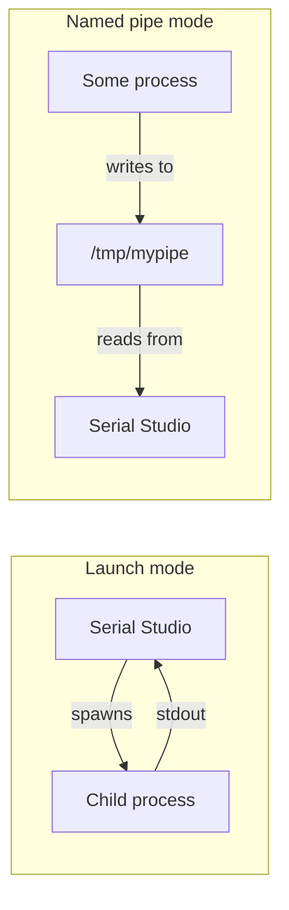

# Process I/O Driver (Pro)

The Process I/O driver lets Serial Studio ingest data from any external program. It has two modes:

- **Launch mode.** Serial Studio spawns a child process and reads its standard output. The child can be a shell script, a Python program, `socat`, `nc`, or anything else that writes bytes to stdout.
- **Named pipe mode.** Serial Studio reads from a named pipe (a FIFO on Linux/macOS, a Windows named pipe on Windows), creating it when it does not already exist. The producer is whatever process opens the same pipe for writing.

This is the catch-all transport. When no built-in driver fits a data source but a script can emit bytes for it, the Process I/O driver bridges the gap.

## What is process I/O?

### Standard streams

Every process on a Unix-like system, and on Windows, has three standard streams attached to it at startup:

- **stdin** (file descriptor 0). Input.
- **stdout** (file descriptor 1). Normal output.
- **stderr** (file descriptor 2). Error output.

By default these are connected to the terminal: keyboard for stdin, terminal display for stdout and stderr. They can be redirected to files, devices, or other processes. Pipes redirect the stdout of one process to the stdin of another.

When Serial Studio launches a child process in Launch mode, it captures the child's stdout and treats every byte the child writes as if it had arrived from a serial port. The child is a black box that produces bytes.

### Pipes

A **pipe** is an in-memory unidirectional byte channel between two processes. Two flavors:

- **Anonymous pipe.** Created at process-spawn time, accessible only to parent and child through inherited file descriptors. The shell `|` operator creates anonymous pipes.
- **Named pipe (FIFO).** Has a path in the filesystem. Any process with the right permissions can open it for reading or writing. On Unix it is created with `mkfifo /tmp/mypipe`. Windows has its own named-pipe API with paths like `\\.\pipe\mypipe`.



Use Launch mode when Serial Studio is the parent and a fresh process should start with each connection. Use Named pipe mode when the producer is already running, when multiple producers may write to the same pipe, or when the same data feed needs to be readable by multiple consumers.

### What can you pipe in?

Practically anything that produces bytes:

- A Python script reading a custom binary protocol over UDP and translating to CSV.
- `socat` bridging a non-standard transport into stdout.
- `nc` reading from a network socket.
- A shell pipeline doing format conversion (`somecmd | sed | awk`).
- An MQTT client subscribing to a topic and writing the payloads to stdout.
- A gRPC client converting protobuf messages to JSON lines.
- A simulation script generating synthetic telemetry for development.

Process I/O is the right driver when the data source's transport is exotic but the data itself is text or binary that Serial Studio's frame parser can handle.

## How Serial Studio uses it

In Launch mode the child runs under `QProcess` on the main thread, with event-driven reads, so nothing blocks. In Named pipe mode a dedicated thread runs a polled read loop (4 KB reads), so a quiet pipe does not stall the UI. Either way, each chunk of bytes is timestamped at read time before it reaches the FrameReader. See [Threading and Timing Guarantees](Threading-and-Timing.md).

### Launch mode configuration

| Setting | Controls |
|---------|----------|
| **Mode** | Launch Process |
| **Executable** | Path to the program to run, or a bare name resolved against PATH plus common install directories that GUI apps often miss (Homebrew, `/usr/local/bin`, `~/.local/bin`, snap and Flatpak exports on Linux; `WindowsApps` and Scoop shims on Windows) |
| **Arguments** | Command-line arguments (whitespace-separated; wrap an argument that contains spaces in double quotes) |
| **Working Dir** | The directory the child should be spawned in (cwd); optional |

On connect, Serial Studio spawns the child process and reads its output until the child exits or the user disconnects. The child runs with merged output channels, so anything the child writes to stderr is captured alongside stdout and treated as incoming data. The extra search directories are also appended to the child's PATH, so a script that spawns `python3` or similar finds it even when Serial Studio was launched from a desktop shortcut. Data sent from the console is written to the child's stdin.

### Named pipe mode configuration

| Setting | Controls |
|---------|----------|
| **Mode** | Named Pipe |
| **Pipe Path** | Filesystem path (Linux/macOS) or pipe name (Windows) |

Named pipe mode is read-only; the write path (console send) only exists in Launch mode.

For Linux/macOS, if the path does not already exist Serial Studio creates the FIFO for you (with `0600` permissions) when you connect. If the path exists but is not a FIFO, the connection fails with a Pipe Error. You can also create the FIFO yourself beforehand:

```sh
mkfifo /tmp/serialstudio_in
```

For Windows, name the pipe with the standard prefix: `\\.\pipe\serialstudio_in`. On Windows Serial Studio acts as the pipe server and always creates the named pipe (byte mode, inbound only), then waits for a writer to connect.

The **Pick Running Process…** button lists running processes and pre-fills **Pipe Path** with a name derived from the chosen process (`/tmp/ss-<name>.fifo` or `\\.\pipe\ss-<name>`). The producer still has to open and write that path itself.

### Example: piping a Python data generator

A simple Python sender that publishes CSV-shaped frames at 100 Hz:

```python
import time, math, sys
t = 0
while True:
    t += 0.01
    v1 = math.sin(t)
    v2 = math.cos(t)
    print(f"{v1:.3f},{v2:.3f}")
    sys.stdout.flush()
    time.sleep(0.01)
```

In Launch mode, set Executable to `python3` (the bare name resolves against PATH) and Arguments to the script path. Connect, switch to Quick Plot mode, and the two sine/cosine signals will plot.

For step-by-step setup, see the [Protocol Setup Guides, Process I/O section](Protocol-Setup-Guides.md).

### Remote API commands

The TCP API and the in-app AI assistant configure this driver through the `io.process.*` scope:

| Command | Parameters | Notes |
|---------|------------|-------|
| `io.process.setMode` | `mode` (0 = Launch, 1 = NamedPipe) | |
| `io.process.setExecutable` | `executable` (string) | Path is validated against the API path policy |
| `io.process.setArguments` | `arguments` (string) | Shell-style argument string; double-quoted substrings stay one argument |
| `io.process.setWorkingDir` | `workingDir` (string) | |
| `io.process.setPipePath` | `pipePath` (string) | |
| `io.process.listRunning` | none | Refreshes and returns running processes as `name [pid]` |
| `io.process.getConfig` | none | Returns mode, executable, arguments, workingDir, pipePath |

Transport details and command safety tiers are in the [API Reference](API-Reference.md).

## Common pitfalls

- **No data appears.** The child is usually buffering its own output. Standard-library functions block-buffer stdout (typically 4 KB or more) when it is not attached to a terminal. Force a flush after each line: in Python use `print(..., flush=True)` or `sys.stdout.flush()`; in C use `fflush(stdout)`; for programs you cannot modify, `stdbuf -oL my_program` (Linux coreutils) forces line-buffered output.
- **Child process exits immediately.** Serial Studio drains any remaining output, shows a "Process stopped" dialog with the exit code, and disconnects. Run the child from a normal terminal first to confirm it starts.
- **Path issues.** Spaces and Unicode in executable paths or arguments can be misparsed. The arguments field is split with `QProcess::splitCommand`, which groups double-quoted substrings into one argument; single quotes are not special. Wrap an argument that contains spaces in double quotes.
- **Working directory matters.** Some programs read configuration files relative to their working directory. Set the Working Directory field accordingly.
- **Permission denied on the pipe.** On Linux/macOS, the FIFO inherits filesystem permissions. `chmod 666 /tmp/mypipe` opens it to all users; tighter permissions require both reader and writer to share a user or group.
- **Data stops after the writer exits.** Closing the write end of the pipe ends the read loop, and the session does not resume when a new writer opens the pipe. Disconnect and reconnect to wait for the next writer.
- **Pipe buffer fills up.** Linux pipes have a small buffer (typically 64 KB). If the writer outruns Serial Studio, the writer blocks until the reader catches up. This is normal flow control. For real-time critical paths, send bytes through a TCP socket instead (see [Drivers: Network](Drivers-Network.md)).
- **Windows-specific pipe path syntax.** On Windows, the pipe must be named `\\.\pipe\<name>`. A Unix-style path causes pipe creation to fail, and Serial Studio reports a "Pipe Error" dialog.
- **Process I/O is convenient but not free.** At very high data rates (hundreds of kHz), the cost of stdout buffering, the OS pipe, and the cross-thread queue becomes noticeable. Direct drivers are always cheaper. Process I/O is the right tool at moderate rates and for prototype or integration work.

## Further reading

- [subprocess (Python Standard Library)](https://docs.python.org/3/library/subprocess.html)
- [Inter-process Communication: Pipes (OCaml UNIX)](https://ocaml.github.io/ocamlunix/pipes.html)
- [Inter Process Communication, Named Pipes (TutorialsPoint)](https://www.tutorialspoint.com/inter_process_communication/inter_process_communication_named_pipes.htm)
- [Inter-process Communication CS 217 (Princeton, PDF)](https://www.cs.princeton.edu/courses/archive/spr04/cos217/lectures/Communication.pdf)
- [Python and Pipes (Lyceum Allotments)](https://lyceum-allotments.github.io/2017/03/python-and-pipes-part-5-subprocesses-and-pipes/)

## See also

- [Protocol Setup Guides](Protocol-Setup-Guides.md): step-by-step Process I/O setup, with both Launch and Named pipe examples.
- [Data Sources](Data-Sources.md): driver capability summary across all transports.
- [Communication Protocols](Communication-Protocols.md): overview of all supported transports.
- [Operation Modes](Operation-Modes.md): Quick Plot is the easiest way to visualize ad-hoc CSV from a script.
- [Use Cases](Use-Cases.md): bridging exotic transports through helper processes.
- [Drivers: Network](Drivers-Network.md): for higher-rate streaming when a pipe isn't enough.
- [Frame Parser Scripting](JavaScript-API.md): for parsing whatever your producer emits.
