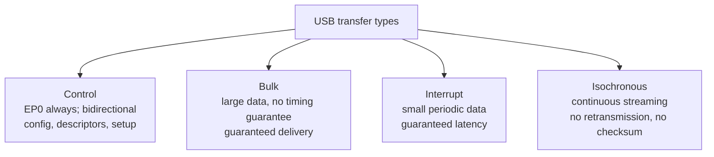
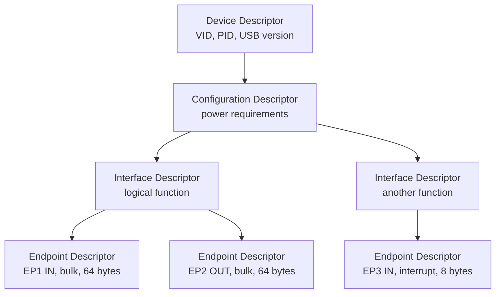

# Raw USB Driver (Pro)

The Raw USB driver talks to USB devices directly through **libusb**, bypassing the operating system's class drivers. It is the right driver when a device exposes vendor-specific bulk, control, or isochronous endpoints rather than presenting itself as a serial port (CDC), an HID device, or a mass-storage volume.

If the device shows up as a virtual COM port, use the [UART driver](Drivers-UART.md). For gamepads, joysticks, or HID firmware, use the [HID driver](Drivers-HID.md). This page covers everything else: logic analysers, oscilloscopes, custom data-acquisition boards, vendor-specific scientific instruments, and any device whose datasheet says "uses bulk endpoints".

## What is USB, really?

USB is layered. From the bottom up:

- **Physical layer.** Differential pair (D+/D-) plus power and ground. Speeds: 1.5 Mbps (Low Speed), 12 Mbps (Full Speed), 480 Mbps (High Speed), 5 Gbps (USB 3.0 SuperSpeed), and faster.
- **Packet layer.** A host-driven token/data/handshake protocol. Devices never initiate transfers; the host always polls.
- **Transfer layer.** Four transfer types (control, bulk, interrupt, isochronous) sit on top of packets.
- **Class layer.** Standard classes (HID, CDC, Mass Storage, Audio, Video) define the device category.

Almost every consumer USB device implements one of the standard classes. The OS bundles a generic driver for each class, so plugging in a USB-CDC microcontroller exposes a COM port without any extra install.

Vendor-specific USB devices skip the standard classes. They expose endpoints with custom semantics that the OS does not know how to interpret. libusb is a userspace library that lets an application open such a device and talk to its endpoints directly.

### Endpoints and transfer types

Every USB device has at least one **endpoint** (endpoint 0, the control endpoint). Most devices have several. Endpoints are unidirectional buffers identified by a number and a direction (IN = device to host, OUT = host to device).

Each endpoint is configured for one of four **transfer types**:



- **Control transfers (Endpoint 0)** carry configuration data: reading device descriptors, selecting interfaces, sending vendor commands. Always bidirectional through the same endpoint pair.
- **Bulk transfers** carry large amounts of data with error detection (CRC) and guaranteed delivery but no bandwidth guarantee. Used for printers, mass storage, and most raw data-acquisition devices. The host fits bulk transfers around higher-priority traffic.
- **Interrupt transfers** carry small amounts of data with a guaranteed maximum latency (the polling interval set in the endpoint descriptor). Used for HID devices and other small periodic data. Despite the name there are no real hardware interrupts; the host polls.
- **Isochronous transfers** carry time-sensitive streaming data (audio, video) with guaranteed bandwidth but no retransmission. A corrupted packet is lost. Used for USB audio interfaces and webcams.

For Serial Studio's USB driver, the relevant types are **bulk** (the default, for streaming captured data) and **isochronous** (for high-rate continuous streams where dropped frames are acceptable).

### Descriptors

A USB device describes itself through a tree of **descriptors**:



The host queries the device for its descriptor tree on enumeration, decides what to do with it, and binds drivers accordingly. A vendor-specific bulk device usually has one configuration, one interface, and a couple of endpoints (one IN for reading, one OUT for writing).

### VID and PID

Every USB device has a **Vendor ID (VID)** and **Product ID (PID)**, both 16-bit. VIDs are assigned by the USB-IF; PIDs are chosen by the vendor. Together they uniquely identify a device model. Serial Studio lists USB devices as `VID:PID, Product Name`.

## How Serial Studio uses it

The USB driver wraps libusb's asynchronous API. The setup flow is:

1. Pick a device by VID:PID.
2. Pick a **transfer mode**:
   - **Bulk Stream** (default): synchronous bulk IN/OUT. Works for most devices.
   - **Advanced Control**: bulk transfers plus vendor-specific control transfers. A confirmation dialog appears before enabling this, because vendor-specific control writes can do anything the device firmware allows, up to and including bricking the device.
   - **Isochronous**: asynchronous isochronous transfers for fixed-rate streaming. ISO packet size is also configured here.
3. Pick the **IN endpoint** (and the OUT endpoint, if writing).
4. Connect.

### Threading

The USB driver runs two dedicated threads:

- **Event thread.** Pumps libusb's event loop. Required by libusb's async API.
- **Read thread.** Issues bulk or isochronous read transfers and forwards completed buffers downstream.

Both threads connect to FrameReader using `Qt::AutoConnection`, which Qt promotes to `Qt::QueuedConnection` for cross-thread emits. Each completed transfer carries a timestamp captured at completion time and is queued to the main thread for FrameReader processing. See [Threading and Timing Guarantees](Threading-and-Timing.md).

### Permissions and OS specifics

USB device access is permission-controlled differently on each OS:

- **Linux.** By default only `root` can open arbitrary USB devices. Add a `udev` rule granting the user access to a specific VID:PID:
  ```
  /etc/udev/rules.d/99-myusbdevice.rules:
  SUBSYSTEM=="usb", ATTR{idVendor}=="1234", ATTR{idProduct}=="5678", MODE="0666"
  ```
  Then run `sudo udevadm control --reload-rules && sudo udevadm trigger`.
- **Windows.** A WinUSB driver must be installed for the device. The standard Windows class drivers (HID, CDC, and so on) hold the device open and prevent libusb from claiming it. Use **Zadig** to replace the driver with WinUSB for the target VID:PID.
- **macOS.** Devices that are not already claimed by an OS class driver can be opened directly. When macOS has bound a kernel driver, libusb can detach it; Serial Studio does not do this automatically because detaching system drivers would interfere with normal devices.

For step-by-step setup, see the [Protocol Setup Guides, Raw USB section](Protocol-Setup-Guides.md).

## Common pitfalls

- **Device not listed.** On Linux, the udev rule is missing or has not taken effect. `lsusb` shows the device; `lsusb -v -d VID:PID` shows its descriptor. If `lsusb` works but Serial Studio does not see the device, it is a permissions problem.
- **Device is listed but will not open.** Another driver has already claimed it. On Windows, switch to WinUSB through Zadig. On Linux, check `lsusb` and `dmesg | grep usb` for hints; the device's CDC class driver sometimes takes precedence, and Zadig (Windows) or unbinding from the kernel driver (Linux) fixes it.
- **No data on the IN endpoint.** Confirm the endpoint number. Vendor documentation always specifies which endpoint streams data; pick the matching one in the dropdown. Also confirm the device is streaming; some devices need a vendor-specific control write to start.
- **Bulk reads time out.** Either the device is not sending or the transfer size is wrong. Reduce the read buffer size if the device sends short packets infrequently.
- **Isochronous mode drops samples.** Some hardware/OS combinations cap isochronous bandwidth. Check the device's datasheet for the recommended ISO packet size and adjust accordingly.
- **Advanced Control mode warning.** Take it seriously. Vendor-specific control transfers can issue any command the firmware understands, including writing to flash, changing calibration, and arbitrary memory writes. Only enable Advanced Control with a full understanding of what is being sent.
- **Permission denied on Linux, even with udev.** The udev rule did not reload, or the device was not unplugged and replugged after the rule was added. Trigger a re-enumeration with `sudo udevadm trigger`.

## Further reading

- [Beyond Logic: USB primer](https://www.beyondlogic.org/usbnutshell/usb1.shtml): introduction to USB.
- [USB Endpoint Types (Beyond Logic Chapter 4)](https://www.beyondlogic.org/usbnutshell/usb4.shtml)
- [USB Descriptors (Beyond Logic Chapter 5)](https://www.beyondlogic.org/usbnutshell/usb5.shtml)
- [libusb-1.0 API Reference](https://libusb.sourceforge.io/api-1.0/)
- [Asynchronous Device I/O (libusb docs)](https://libusb.sourceforge.io/api-1.0/group__libusb__asyncio.html)

## See also

- [Protocol Setup Guides](Protocol-Setup-Guides.md): step-by-step Raw USB setup.
- [Data Sources](Data-Sources.md): driver capability summary across all transports.
- [Communication Protocols](Communication-Protocols.md): overview of all supported transports.
- [Use Cases](Use-Cases.md): logic analyzers, scientific instruments, and bulk-endpoint devices.
- [Troubleshooting](Troubleshooting.md): WinUSB, udev, and permission diagnostics.
- [Drivers: UART](Drivers-UART.md): for USB-CDC virtual serial ports.
- [Drivers: HID](Drivers-HID.md): for HID-class devices.
