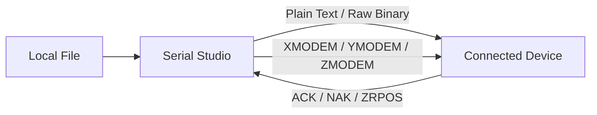

# File Transmission

Serial Studio can send files to a connected device using plain text, raw binary, or industry-standard transfer protocols (XMODEM, XMODEM-1K, YMODEM, ZMODEM). This is useful for uploading firmware, configuration files, scripts, or any other data to an embedded target over an active connection.

> **Availability:** File transmission is currently available in the nightly build. It will be included in the public release starting with version 3.2.8.

## Protocol Overview

| Mode | Error Detection | Block Size | Pause/Resume | Best For |
|------|----------------|------------|--------------|----------|
| Plain Text | None | Line-based | Yes | Human-readable config files, AT commands |
| Raw Binary | None | 64–8192 B | Yes | Simple binary uploads without protocol overhead |
| XMODEM | CRC-16 | 128 B | No | Legacy devices, small files |
| XMODEM-1K | CRC-16 | 1024 B | No | Legacy devices, larger files |
| YMODEM | CRC-16 | 1024 B | No | Files where the receiver needs filename and size metadata |
| ZMODEM | CRC-32 | 64–8192 B | Crash recovery | Large files, unreliable links, modern firmware loaders |

---

## Opening the File Transmission Dialog

Click the **File Transmission** button in the toolbar while a device connection is active. The dialog closes automatically if the connection drops.

---

## Transfer Modes

### Plain Text

Sends the file line by line as text. Each line is terminated with a newline character. This mode is ideal for sending scripts, AT command sequences, or configuration files to devices that process text input.

**Configuration:**

- **Transmission Interval** — Delay between consecutive lines (0–10,000 ms, default 100 ms). Increase this if the device needs time to process each line before accepting the next.

**Behavior:**

- Lines are read sequentially from the file.
- A newline is appended automatically if the line does not already end with one.
- You can pause and resume transmission; it continues from where it left off.

---

### Raw Binary

Sends the file in fixed-size binary blocks without any framing or error checking. Use this when the receiving device expects raw bytes and handles its own integrity verification.

**Configuration:**

- **Block Size** — Number of bytes per block (64–8,192, default 1,024).
- **Transmission Interval** — Delay between consecutive blocks (0–10,000 ms, default 100 ms).

**Behavior:**

- The file is read in sequential chunks of the configured block size.
- The last block may be smaller than the configured size.
- You can pause and resume transmission.

---

### XMODEM

A classic byte-oriented protocol that transmits data in 128-byte blocks with CRC-16 error detection. The receiver initiates the transfer by sending a `C` character to request CRC mode.

**Configuration:**

- **Timeout** — Time to wait for receiver responses (1,000–60,000 ms, default 10,000 ms).
- **Max Retries** — Number of retry attempts per block on NAK or timeout (1–100, default 10).

**Protocol flow:**

1. Serial Studio waits for the receiver to send `C` (CRC mode request).
2. Each 128-byte block is sent with a sequence number and CRC-16 checksum.
3. The receiver responds with ACK (success) or NAK (retransmit).
4. After all blocks are sent, Serial Studio sends EOT to signal completion.

**Notes:**

- Files smaller than 128 bytes are padded to fill the block.
- Only CRC-16 mode is supported (not the legacy checksum mode).

---

### XMODEM-1K

Identical to XMODEM but uses 1,024-byte blocks instead of 128-byte blocks, reducing protocol overhead for larger files.

**Configuration:**

- Same as XMODEM: **Timeout** and **Max Retries**.

---

### YMODEM

Extends XMODEM-1K with a metadata block that carries the filename and file size. This allows the receiver to know what it is receiving before the data arrives.

**Configuration:**

- Same as XMODEM: **Timeout** and **Max Retries**.

**Protocol flow:**

1. Serial Studio sends block 0 containing the filename and file size.
2. Data is transmitted in 1,024-byte blocks with CRC-16.
3. After the file data, Serial Studio sends EOT (twice, per YMODEM convention).
4. An empty block 0 signals end-of-batch.

**Notes:**

- The receiver can use the file size from block 0 to strip padding from the last block.

---

### ZMODEM

A streaming protocol that does not wait for per-block acknowledgment, making it significantly faster than XMODEM/YMODEM on high-latency or high-throughput links. It uses CRC-32 for stronger error detection and supports crash recovery.

**Configuration:**

- **Block Size** — Bytes per data subpacket (64–8,192, default 1,024).
- **Timeout** — Time to wait for receiver responses (1,000–60,000 ms, default 10,000 ms).
- **Max Retries** — Retry attempts on error (1–100, default 10).

**Key features:**

- **Streaming**: Data subpackets are sent continuously without waiting for ACK after each one, maximizing throughput.
- **Crash recovery**: If a transfer is interrupted and restarted, the receiver can request retransmission from a specific file offset (ZRPOS), avoiding resending data that was already received.
- **File metadata**: The ZFILE header carries the filename, size, and modification timestamp.
- **ZDLE escaping**: Control characters are transparently escaped so the data stream does not interfere with terminal or modem control sequences.

---

## Progress and Status

During an active transfer, the dialog displays:

- **Progress bar** — Percentage of the file transmitted.
- **Transfer speed** — Current throughput in B/s, KB/s, or MB/s.
- **Bytes sent / total** — Absolute byte counters.
- **Error count** — Number of protocol-level errors (NAKs, retries, timeouts). Only incremented during protocol-based transfers.
- **Status text** — Current protocol state or last event.

---

## Activity Log

The bottom section of the dialog contains a scrollable activity log that records timestamped events: block transmissions, acknowledgments, errors, retries, and completion status. The log retains the most recent 200 entries. Click **Clear** to reset it.

---

## Settings Reference

All settings are saved automatically and restored across sessions.

| Setting | Applicable Modes | Range | Default |
|---------|-----------------|-------|---------|
| Transmission Interval | Plain Text, Raw Binary | 0–10,000 ms | 100 ms |
| Block Size | Raw Binary, ZMODEM | 64–8,192 bytes | 1,024 bytes |
| Timeout | XMODEM, XMODEM-1K, YMODEM, ZMODEM | 1,000–60,000 ms | 10,000 ms |
| Max Retries | XMODEM, XMODEM-1K, YMODEM, ZMODEM | 1–100 | 10 |

---

## Tips

- **Choosing a protocol**: Use ZMODEM when possible — it is the fastest and most robust. Fall back to XMODEM/YMODEM only if the receiver does not support ZMODEM.
- **Slow receivers**: Increase the transmission interval (Plain Text / Raw Binary) or the timeout (protocol modes) if the device cannot keep up.
- **Noisy links**: Use smaller block sizes to reduce the cost of retransmissions. For ZMODEM, a block size of 256 or 512 bytes is a good starting point on unreliable connections.
- **Large files**: Use XMODEM-1K, YMODEM, or ZMODEM to reduce per-block overhead compared to standard XMODEM.
- **Firmware uploads**: Many bootloaders support XMODEM or YMODEM natively. Check your device documentation for the expected protocol.
