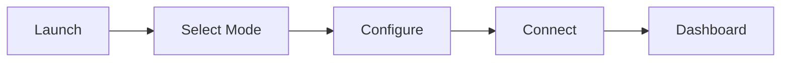

# Getting started with Serial Studio

## What is Serial Studio?

Serial Studio is a cross-platform telemetry dashboard for visualizing real-time data from embedded devices, sensors, and other data sources. It runs on Windows, macOS, and Linux.

**Core capabilities:**

- **Data sources.** Serial/UART, TCP/UDP, and Bluetooth LE are included in the free edition. MQTT, Modbus, CAN Bus, Audio input, raw USB, HID, and Process I/O are available in Pro.
- **15+ widget types.** Plot, MultiPlot, FFT Plot, Bar, Gauge, Compass, Gyroscope, Accelerometer, GPS Map, Data Grid, LED Panel, Terminal, 3D Plot, XY Plot, and Image View.
- **Export.** Save sessions to CSV or MDF4 for offline analysis.
- **Performance.** Built with Qt 6 and C++20, aimed at 256 KHz+ data rates.
- **Three operation modes.** Console Only for inspecting the raw stream, Quick Plot for instant CSV visualization, and Project File for fully customized dashboards.

Whether you're reading temperature from an Arduino, monitoring a CAN Bus in a vehicle, or building a ground station for a rocket, Serial Studio handles the visualization layer so you can focus on your hardware and firmware.

## First connection workflow

This diagram shows the path from launching Serial Studio to seeing data on the dashboard.



---

## Installation

### Windows

1. Download the installer from the [releases page](https://github.com/Serial-Studio/Serial-Studio/releases/latest).
2. Double-click the installer.

**Unknown developer warning.** Windows may show a warning because the installer isn't digitally signed. Click **More Info**, then **Run Anyway**.

**Visual C++ Redistributable.** On a fresh Windows install, Serial Studio may fail to launch. If that happens, install the [Microsoft Visual C++ Redistributable (64-bit)](https://aka.ms/vs/17/release/vc_redist.x64.exe) and try again.

### macOS

1. Download the DMG from the [releases page](https://github.com/Serial-Studio/Serial-Studio/releases/latest).
2. Open the DMG and drag Serial Studio into **Applications**.

Or install via Homebrew (community-maintained):

```bash
brew install --cask serial-studio
```

The Homebrew cask isn't officially maintained by the Serial Studio team. Use the DMG for guaranteed compatibility.

### Linux

A few install options are available.

**AppImage (recommended):**

```bash
chmod +x SerialStudio-*.AppImage
./SerialStudio-*.AppImage
```

You may need `libfuse2` first:

```bash
sudo apt update && sudo apt install libfuse2
```

**Flatpak (Flathub):**

```bash
flatpak install flathub com.serial_studio.Serial-Studio
```

DEB and RPM packages are also on the releases page.

**Serial port permissions on Linux.** If your serial device doesn't show up, add your user to the `dialout` group:

```bash
sudo usermod -a -G dialout $USER
```

Log out and back in for it to take effect.

### Building from source (GPL)

If you'd rather compile from source, you need Qt 6.9+ and CMake:

```bash
git clone https://github.com/Serial-Studio/Serial-Studio.git
cd Serial-Studio
cmake -B build -DCMAKE_BUILD_TYPE=Release
cmake --build build -j$(nproc)
```

The binary ends up in `build/`.

---

## Interface overview

When you launch Serial Studio, the main window splits into four areas.

### 1. Toolbar (top)

The toolbar runs along the top of the window:

- **Project controls.** Open, save, and edit project files. The wrench icon opens the Project Editor.
- **I/O interface selector.** Choose between Serial Port, Network Socket, Bluetooth LE, and in Pro: MQTT, Modbus, CAN Bus, Audio, USB, HID, or Process.
- **Connect/Disconnect button.** Starts or stops the data connection.
- **Examples browser.** Load example projects that ship with Serial Studio to see working configurations.
- **CSV playback controls.** Replay previously recorded sessions.

### 2. Console (center, default view)

When you first connect, the console panel shows raw incoming data from your device. You can switch between ASCII and hexadecimal display. The console is handy for checking that your device is actually sending data before you configure a dashboard.

### 3. Dashboard (center, replaces the console)

Once Serial Studio parses at least one valid frame, the view switches from the Console to the Dashboard. The Dashboard shows real-time widgets (plots, gauges, maps, grids, and so on) arranged according to your configuration. You can toggle individual widgets on and off from the sidebar on the left.

### 4. Setup panel (right side, collapsible)

The Setup panel is where you configure the connection:

- **Operation mode.** Console Only, Quick Plot, or Project File.
- **I/O interface settings.** Port, baud rate, IP address, and so on, depending on the interface.
- **Frame parsing options.** Delimiters, data conversion, and other protocol settings.
- **Export options.** Turn on CSV or MDF4 logging.

You can collapse the Setup panel by clicking its header to give the Dashboard more space.

---

## Your first connection: Quick Plot mode

This is the fastest way to get data on screen. We'll use an Arduino as the example, but the approach works with any device that sends comma-separated values over a serial port.

### Step 1: prepare your device

Upload this sketch to an Arduino (or adapt it for your board):

```cpp
void setup() {
  Serial.begin(115200);
  pinMode(A0, INPUT);
  pinMode(A1, INPUT);
  pinMode(A2, INPUT);
}

void loop() {
  Serial.print(analogRead(A0));
  Serial.print(",");
  Serial.print(analogRead(A1));
  Serial.print(",");
  Serial.print(analogRead(A2));
  Serial.print("\n");
  delay(20);
}
```

The only requirement is that your device sends comma-separated numeric values terminated by a newline (`\n`, `\r`, or `\r\n`). For example: `512,1023,300\n`.

### Step 2: configure Serial Studio

1. Open Serial Studio.
2. In the Setup panel on the right, set the operation mode to **Quick Plot (Comma Separated Values)**.
3. Set the I/O interface to **Serial Port**.
4. Pick your device's COM port (for example `COM3` on Windows, `/dev/ttyUSB0` on Linux, `/dev/cu.usbmodem*` on macOS).
5. Set the baud rate to `115200` (it has to match the value in your Arduino sketch).

### Step 3: connect

Click the **Connect** button in the toolbar. You'll see:

1. The Console panel displays raw incoming CSV data.
2. After a moment, Serial Studio detects valid frames and switches to the Dashboard.
3. The Dashboard shows a Data Grid with your current values and a MultiPlot with one line per CSV field.

That's all. No project file, no JSON, just connect and visualize.

### Step 4: explore the dashboard

- Use the Widgets sidebar on the left to show or hide individual plots.
- Hover over plots to inspect values.
- Enable CSV export in the Setup panel to record the session for later playback.

---

## Your first connection: Project File mode

Project File mode gives you full control over how Serial Studio interprets your data and what widgets show up on the dashboard. You create a `.ssproj` project file in the built-in Project Editor, and Serial Studio uses it to parse incoming data and build the dashboard. It's the recommended mode for most real-world projects.

### Step 1: open the Project Editor

Click the wrench icon in the toolbar, or pick **Project Editor** from the menu. That opens a separate editor window.

### Step 2: create a project

1. Click **New Project**.
2. Give the project a title (for example "My Sensor Dashboard").
3. Configure frame detection: set the start delimiter, end delimiter, or choose line-based detection depending on how your device frames its data.

### Step 3: add groups and datasets

1. Click **Add Group** in the tree view on the left.
2. Name the group (for example "Temperature Sensors") and pick a widget type (Data Grid, MultiPlot, Gauge).
3. Inside the group, click **Add Dataset** for each data field.
4. For each dataset, set its title, index (which CSV field it maps to, starting at 0), units, and any min/max bounds.

### Step 4: save and load

1. Save the project file (a `.ssproj`).
2. Back in the main window, set the operation mode to **Parse via JSON Project File**.
3. Load your project file through the file selector in the Setup panel.

### Step 5: connect

Configure your I/O interface and click **Connect**. Serial Studio uses your project file to parse incoming frames and draw the widgets you configured.

---

## Your first connection: Console Only mode

Console Only is a diagnostic mode. Serial Studio doesn't try to parse anything — raw bytes from the data source go straight to the terminal. Use it when you want to verify that a device is alive, check the baud rate and framing, or send commands interactively.

### Steps

1. In the Setup panel, set the operation mode to **Console Only (No Parsing)**.
2. Pick your I/O interface and configure the connection (port, baud rate, IP, and so on).
3. Click **Connect**.
4. Raw bytes appear in the terminal. Toggle between ASCII and hexadecimal display from the console toolbar.
5. Use the input box at the bottom of the console to send bytes back to the device.

No dashboard, no CSV export, no parsing. Once the stream looks correct, switch to Quick Plot or Project File to actually visualize the data.

---

## Operation modes

Serial Studio has three operation modes. The right one depends on how much control you need and how your device formats its output.

### Console Only

| Aspect               | Detail |
|----------------------|--------|
| Configuration needed | None |
| Data format          | Any (bytes are never parsed) |
| Dashboard generated  | None — raw bytes go to the terminal |
| Best for             | Probing an unknown device, debugging baud/wiring, AT commands |

Console Only turns Serial Studio into a bidirectional terminal. No frame detection, no dashboard, no parsing. Switch to it whenever you want to see exactly what bytes are coming out of your device.

### Quick Plot

| Aspect               | Detail |
|----------------------|--------|
| Configuration needed | None |
| Data format          | Comma-separated numeric values |
| Line terminator      | `\n`, `\r`, or `\r\n` |
| Dashboard generated  | Automatic (Data Grid + MultiPlot) |
| Best for             | Prototyping, quick debugging, simple sensors |

Quick Plot treats each line as a frame and each comma-separated field as a dataset. It auto-creates one plot per field. It's the fastest way to get data on screen, but you don't get to pick widget types, labels, or units.

### Project File

| Aspect               | Detail |
|----------------------|--------|
| Configuration needed | `.ssproj` project file (created in the Project Editor) |
| Data format          | Configurable (CSV with custom delimiters, binary with a Lua/JS parser) |
| Dashboard generated  | From the project file |
| Best for             | Production telemetry, complex protocols, multi-sensor systems |

This mode gives you full control: define frame delimiters, map data fields to datasets, pick widget types, set units and ranges, configure alarms, add FFT analysis, write frame parser scripts (Lua or JavaScript) for binary protocols, and add per-dataset value transforms for calibration and filtering. Project File mode also supports multiple data sources for multi-device setups (Pro). It's the recommended mode for most real-world projects.

---

## Common first-time issues

### Serial port not showing up in the dropdown

- **Windows:** Open Device Manager and check under "Ports (COM & LPT)". You may need a USB-to-serial driver: [CH340](http://www.wch-ic.com/downloads/CH341SER_EXE.html), [FTDI](https://ftdichip.com/drivers/vcp-drivers/), or [CP210x](https://www.silabs.com/developers/usb-to-uart-bridge-vcp-drivers).
- **Linux:** Run `sudo usermod -a -G dialout $USER`, then log out and back in. Check the device shows up with `ls /dev/ttyUSB*` or `ls /dev/ttyACM*`.
- **macOS:** Try a different USB port. Check System Settings for security prompts blocking the device. Your device usually appears as `/dev/cu.usbmodem*` or `/dev/cu.usbserial*`.

### No data showing in the console

- Check the baud rate matches your device configuration exactly.
- Make sure no other app (like the Arduino IDE Serial Monitor) has the port open. Only one app can use a serial port at a time.
- Check the device is actually sending data. A logic analyzer or second terminal program is handy for confirming.
- Try disconnecting and reconnecting.

### Console shows data but no dashboard

- In Quick Plot mode, make sure the device sends comma-separated numeric values terminated by a newline. Non-numeric text (other than numbers, commas, and whitespace) blocks parsing.
- In Project File mode, check that your frame delimiters match what the device actually sends. Switch to Console Only mode to inspect the raw stream, then come back once you know the framing.
- If nothing parses, try Console Only first. If the raw bytes look wrong there, it's a connection/baud/wiring problem, not a parsing problem.

### Garbled or corrupted data in the console

- Almost always a baud rate mismatch. Double-check both the device firmware and the Serial Studio setting.
- Also check data bits, parity, and stop bits match your device (the 8-N-1 default works for most).

---

## Next steps

Now that you've made your first connection, here are the recommended paths from here.

### Fundamentals

- **[Operation Modes](Operation-Modes.md):** detailed comparison of all three modes, with examples.
- **[Data Sources](Data-Sources.md):** configure Serial, Network (TCP/UDP), Bluetooth LE, and Pro-edition drivers.
- **[Communication Protocols](Communication-Protocols.md):** compare all supported protocols and pick the right one.
- **[Data Flow](Data-Flow.md):** how Serial Studio processes data from raw bytes to dashboard widgets.

### Custom dashboards

- **[Project Editor](Project-Editor.md):** create and edit project files with custom groups, datasets, and widget configurations.
- **[Widget Reference](Widget-Reference.md):** all 15+ widget types, with configuration details and use-case guidance.
- **[Frame Parser Scripting](JavaScript-API.md):** custom frame parsers in Lua or JavaScript for binary or non-standard formats.
- **[Dataset Value Transforms](Dataset-Transforms.md):** per-dataset calibration, filtering, and unit conversion.

### Advanced features

- **[CSV Import and Export](CSV-Import-Export.md):** record sessions and replay them later.
- **[MQTT Integration](MQTT-Integration.md):** subscribe to MQTT topics for IoT visualization.
- **[Protocol Setup Guides (Pro)](Protocol-Setup-Guides.md):** step-by-step guides for Modbus, CAN Bus, Audio, USB, HID, and Process I/O.
- **[API Reference](API-Reference.md):** automate Serial Studio from external scripts, or connect AI models via MCP on TCP port 7777.

### Explore examples

Click **Examples** in the toolbar to browse working project files that ship with Serial Studio, including GPS trackers, IMU visualizers, and sensor dashboards. Opening an example is one of the best ways to see how project files are structured.

### Get help

- **[Troubleshooting](Troubleshooting.md):** detailed fixes for common problems.
- **[FAQ](FAQ.md):** frequently asked questions.
- **[GitHub Discussions](https://github.com/Serial-Studio/Serial-Studio/discussions):** ask questions and share projects with the community.
