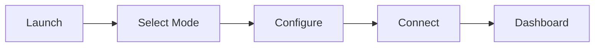

# Getting Started with Serial Studio

## What is Serial Studio?

Serial Studio is a cross-platform telemetry dashboard application for visualizing real-time data from embedded devices, sensors, and other data sources. It runs on Windows, macOS, and Linux.

**Core capabilities:**

- **Data sources**: Serial/UART, TCP/UDP, Bluetooth LE are included in the free edition. MQTT, Modbus, CAN Bus, Audio input, Raw USB, HID, and Process I/O are available in Pro.
- **15+ widget types**: Plot, MultiPlot, FFT Plot, Bar, Gauge, Compass, Gyroscope, Accelerometer, GPS Map, Data Grid, LED Panel, Terminal, 3D Plot, XY Plot, and Image View.
- **Export**: Save sessions to CSV or MDF4 for offline analysis.
- **Performance**: Built with Qt 6 and C++20, targeting 256 KHz+ data rates.
- **Three operation modes**: Quick Plot for instant visualization, Device Sends JSON for self-describing devices, and Project File for full dashboard customization.

Whether you are reading temperature from an Arduino, monitoring a CAN Bus on a vehicle, or building a ground station for a rocket, Serial Studio provides the visualization layer so you can focus on your hardware and firmware.

## First Connection Workflow

The following diagram shows the steps from launching Serial Studio to seeing data on your dashboard.



---

## Installation

### Windows

1. Download the installer from the [releases page](https://github.com/Serial-Studio/Serial-Studio/releases/latest).
2. Double-click the installer to begin installation.

**Unknown Developer Warning:** Windows may show a warning because the installer is not digitally signed. Click **More Info**, then click **Run Anyway**.

**Visual C++ Redistributable:** On a fresh Windows installation, Serial Studio may fail to launch. If this happens, install the [Microsoft Visual C++ Redistributable (64-bit)](https://aka.ms/vs/17/release/vc_redist.x64.exe) and try again.

### macOS

1. Download the DMG file from the [releases page](https://github.com/Serial-Studio/Serial-Studio/releases/latest).
2. Open the DMG and drag Serial Studio into the **Applications** folder.

Alternatively, install via Homebrew (community-maintained):

```bash
brew install --cask serial-studio
```

**Note:** The Homebrew cask is not officially maintained by the Serial Studio team. Use the DMG for guaranteed compatibility.

### Linux

Multiple installation methods are available:

**AppImage (recommended):**

```bash
chmod +x SerialStudio-*.AppImage
./SerialStudio-*.AppImage
```

You may need to install `libfuse2` first:

```bash
sudo apt update && sudo apt install libfuse2
```

**Flatpak (via Flathub):**

```bash
flatpak install flathub com.serial_studio.Serial-Studio
```

**DEB/RPM packages** are also available on the releases page.

**Serial port permissions on Linux:** If your serial device does not appear, add your user to the `dialout` group:

```bash
sudo usermod -a -G dialout $USER
```

Then log out and log back in for the change to take effect.

### Building from Source (GPL)

If you prefer to compile from source, you need Qt 6.9+ and CMake:

```bash
git clone https://github.com/Serial-Studio/Serial-Studio.git
cd Serial-Studio
cmake -B build -DCMAKE_BUILD_TYPE=Release
cmake --build build -j$(nproc)
```

The resulting binary will be in the `build/` directory.

---

## Interface Overview

When you launch Serial Studio, the main window is organized into four areas:

### 1. Toolbar (top)

The toolbar spans the top of the window and contains:

- **Project controls** — Open, save, and edit project files. The wrench icon opens the Project Editor.
- **I/O Interface selector** — Choose between Serial Port, Network Socket, Bluetooth LE, and (in Pro) MQTT, Modbus, CAN Bus, Audio, USB, HID, or Process.
- **Connect/Disconnect button** — Starts or stops the data connection.
- **Examples browser** — Load example projects that ship with Serial Studio to see working configurations.
- **CSV playback controls** — Replay previously recorded sessions.

### 2. Console (center, default view)

When you first connect, the console panel shows raw incoming data from your device. You can toggle between ASCII and hexadecimal display modes. The console is useful for verifying that your device is sending data correctly before configuring a dashboard.

### 3. Dashboard (center, replaces console)

Once Serial Studio successfully parses at least one valid frame, the view automatically switches from the Console to the Dashboard. The Dashboard displays real-time widgets (plots, gauges, maps, grids, and more) arranged according to your configuration. You can toggle individual widgets on and off using the sidebar on the left.

### 4. Setup Panel (right side, collapsible)

The Setup Panel is where you configure everything about your connection:

- **Operation mode** — Quick Plot, Project File, or Device Sends JSON.
- **I/O Interface settings** — Port, baud rate, IP address, etc., depending on the selected interface.
- **Frame parsing options** — Delimiters, data conversion, and other protocol settings.
- **Export options** — Enable CSV or MDF4 logging.

You can collapse the Setup Panel by clicking its header to give the Dashboard more screen space.

---

## Your First Connection — Quick Plot Mode

This is the fastest way to see data on screen. We will use an Arduino as an example, but the same approach works with any device that sends comma-separated values over a serial port.

### Step 1: Prepare your device

Upload this sketch to an Arduino (or adapt it for your board):

```cpp
void setup() {
  Serial.begin(115200);
  pinMode(A0, INPUT);
  pinMode(A1, INPUT);
  pinMode(A2, INPUT);
}

void loop() {
  Serial.print(analogRead(A0));
  Serial.print(",");
  Serial.print(analogRead(A1));
  Serial.print(",");
  Serial.print(analogRead(A2));
  Serial.print("\n");
  delay(20);
}
```

The key requirement is that your device sends **comma-separated numeric values** terminated by a **newline character** (`\n`, `\r`, or `\r\n`). For example: `512,1023,300\n`.

### Step 2: Configure Serial Studio

1. Open Serial Studio.
2. In the **Setup Panel** on the right, set the operation mode to **Quick Plot (Comma Separated Values)**.
3. Set the **I/O Interface** to **Serial Port**.
4. Select your device's **COM port** (e.g., `COM3` on Windows, `/dev/ttyUSB0` on Linux, `/dev/cu.usbmodem*` on macOS).
5. Set the **Baud Rate** to `115200` (must match the value in your Arduino sketch).

### Step 3: Connect

Click the **Connect** button in the toolbar. You will see:

1. The **Console** panel displays raw incoming CSV data.
2. Within a moment, Serial Studio detects valid frames and switches to the **Dashboard** view.
3. The Dashboard shows a **Data Grid** with your current values and a **MultiPlot** with one line per CSV field.

That is all it takes. No project file, no JSON — just connect and visualize.

### Step 4: Explore the dashboard

- Use the **Widgets** sidebar on the left to show or hide individual plots.
- Hover over plots to inspect values.
- Enable **CSV export** in the Setup Panel to record your session for later playback.

---

## Your First Connection — JSON Mode

If your device can generate JSON, it can define its own dashboard layout. Serial Studio wraps JSON frames in delimiters so it can find them in the data stream.

### What your device sends

Your device must output JSON frames wrapped in `/*` and `*/` delimiters:

```
/*{"title":"Weather Station","groups":[{"title":"Environment","widget":"datagrid","datasets":[{"title":"Temperature","value":"23.5","units":"\u00b0C"},{"title":"Pressure","value":"1013","units":"hPa"},{"title":"Humidity","value":"45.2","units":"%"}]}]}*/
```

The JSON structure tells Serial Studio everything: how to name the dashboard, what groups to create, which widget to use for each group, and what datasets to display.

### Steps

1. In the **Setup Panel**, set the operation mode to **No Parsing (Device Sends JSON Data)**.
2. Select your **I/O Interface** and configure the connection (port, baud rate, IP, etc.).
3. Click **Connect**.
4. Serial Studio extracts JSON frames between `/*` and `*/`, parses them, and builds the dashboard automatically.

This mode is ideal when you want the firmware to control the dashboard layout, for example when different firmware versions expose different sensors.

---

## Your First Connection — Project File Mode

Project File mode gives you full control over how Serial Studio interprets your data and what widgets appear on the dashboard. You create a `.json` project file using the built-in Project Editor, and Serial Studio uses it to parse incoming data and build the dashboard.

### Step 1: Open the Project Editor

Click the **wrench icon** in the toolbar, or select **Project Editor** from the menu. This opens a separate editor window.

### Step 2: Create a project

1. Click **New Project**.
2. Give your project a title (e.g., "My Sensor Dashboard").
3. Configure **frame detection**: set the start delimiter, end delimiter, or choose line-based detection depending on how your device frames its data.

### Step 3: Add groups and datasets

1. Click **Add Group** in the tree view on the left.
2. Name the group (e.g., "Temperature Sensors") and select a widget type (e.g., Data Grid, MultiPlot, Gauge).
3. Inside the group, click **Add Dataset** for each data field.
4. For each dataset, set its **title**, **index** (which field in the CSV row it maps to, starting from 0), **units**, and any min/max bounds.

### Step 4: Save and load

1. Save the project file (it is a `.json` file).
2. Back in the main window, set the operation mode to **Parse via JSON Project File**.
3. Load your project file using the file selector in the Setup Panel.

### Step 5: Connect

Configure your I/O interface and click **Connect**. Serial Studio uses your project file to parse incoming frames and display the widgets you configured.

---

## Understanding Operation Modes

Serial Studio provides three operation modes. Choosing the right one depends on how much control you need and how your device formats its output.

### Quick Plot

| Aspect | Detail |
|--------|--------|
| Configuration needed | None |
| Data format | Comma-separated numeric values |
| Line terminator | `\n`, `\r`, or `\r\n` |
| Dashboard generated | Automatic (Data Grid + MultiPlot) |
| Best for | Prototyping, quick debugging, simple sensors |

Quick Plot treats each line as a frame and each comma-separated field as a dataset. It automatically creates one plot per field. This is the fastest way to get data on screen, but it offers no control over widget types, labels, or units.

### Device Sends JSON

| Aspect | Detail |
|--------|--------|
| Configuration needed | None (device defines everything) |
| Data format | JSON wrapped in `/*` and `*/` |
| Dashboard generated | From JSON structure |
| Best for | Self-describing devices, dynamic dashboards |

The device sends complete JSON frames that define groups, datasets, widget types, units, and actions. Serial Studio reads these frames and builds the dashboard accordingly. This is useful when the firmware knows best how to present its data, or when different firmware versions need different dashboard layouts without changing the project file.

### Project File

| Aspect | Detail |
|--------|--------|
| Configuration needed | JSON project file (created in Project Editor) |
| Data format | Configurable (CSV with custom delimiters, binary with JS parser) |
| Dashboard generated | From project file |
| Best for | Production telemetry, complex protocols, multi-sensor systems |

This mode provides full control. You define frame delimiters, map data fields to datasets, choose widget types, set units and ranges, configure alarms, add FFT analysis, and write JavaScript parsers for binary protocols. Project File mode also supports multiple data sources for multi-device setups.

---

## Common First-Time Issues

### Serial port not appearing in the dropdown

- **Windows**: Open Device Manager and check under "Ports (COM & LPT)". You may need to install a USB-to-serial driver: [CH340](http://www.wch-ic.com/downloads/CH341SER_EXE.html), [FTDI](https://ftdichip.com/drivers/vcp-drivers/), or [CP210x](https://www.silabs.com/developers/usb-to-uart-bridge-vcp-drivers).
- **Linux**: Run `sudo usermod -a -G dialout $USER`, then log out and log back in. Verify the device appears with `ls /dev/ttyUSB*` or `ls /dev/ttyACM*`.
- **macOS**: Try a different USB port. Check System Settings for any security prompts blocking the device. Your device will typically appear as `/dev/cu.usbmodem*` or `/dev/cu.usbserial*`.

### No data appearing in the console

- Verify the **baud rate** matches your device configuration exactly.
- Make sure no other application (such as the Arduino IDE Serial Monitor) has the port open. Only one application can use a serial port at a time.
- Check that your device is actually sending data. A logic analyzer or second terminal program can help confirm this.
- Try disconnecting and reconnecting.

### Console shows data but dashboard does not appear

- In **Quick Plot** mode, make sure your device sends comma-separated **numeric** values terminated by a newline. Non-numeric text (other than numbers, commas, and whitespace) will prevent parsing.
- In **Project File** mode, verify that your frame delimiters match what the device actually sends. Check the console output to see the raw bytes.
- In **JSON** mode, confirm that JSON frames are properly wrapped in `/*` and `*/` and that the JSON is valid.

### Garbled or corrupted data in the console

- This almost always means a **baud rate mismatch**. Double-check both the device firmware and the Serial Studio setting.
- Also verify that **data bits**, **parity**, and **stop bits** match your device (the defaults of 8-N-1 work for most devices).

---

## Next Steps

Now that you have made your first connection, here are the recommended paths for learning more:

### Learn the fundamentals

- **[Operation Modes](Operation-Modes.md)** — Detailed comparison of all three modes with examples.
- **[Data Sources](Data-Sources.md)** — Configure Serial, Network (TCP/UDP), Bluetooth LE, and Pro-edition drivers.
- **[Communication Protocols](Communication-Protocols.md)** — Compare all supported protocols and choose the right one for your project.
- **[Data Flow](Data-Flow.md)** — Understand how Serial Studio processes data from raw bytes to dashboard widgets.

### Build custom dashboards

- **[Project Editor](Project-Editor.md)** — Create and edit project files with custom groups, datasets, and widget configurations.
- **[Widget Reference](Widget-Reference.md)** — Explore all 15+ widget types with configuration details and use-case guidance.
- **[JavaScript API](JavaScript-API.md)** — Write custom frame parsers for binary or non-standard data formats.

### Advanced features

- **[CSV Import and Export](CSV-Import-Export.md)** — Record sessions and replay them later for analysis.
- **[MQTT Integration](MQTT-Integration.md)** — Subscribe to MQTT topics for IoT data visualization.
- **[Protocol Setup Guides (Pro)](Protocol-Setup-Guides.md)** — Step-by-step guides for Modbus, CAN Bus, Audio, USB, HID, and Process I/O.
- **[API Reference](API-Reference.md)** — Automate Serial Studio from external scripts or connect AI models via the MCP protocol on TCP port 7777.

### Explore examples

Click **Examples** in the toolbar to browse working project files that ship with Serial Studio. These include GPS trackers, IMU visualizers, sensor dashboards, and more. Opening an example is one of the best ways to understand how project files are structured.

### Get help

- **[Troubleshooting](Troubleshooting.md)** — Detailed solutions for common problems.
- **[FAQ](FAQ.md)** — Frequently asked questions.
- **[GitHub Discussions](https://github.com/Serial-Studio/Serial-Studio/discussions)** — Ask questions and share your projects with the community.
