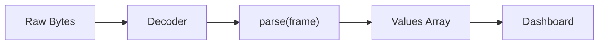

# Frame Parser Scripting Reference

Complete reference for Serial Studio's frame parser scripting API. Serial Studio supports two scripting languages for custom frame parsers: **Lua** (default, recommended) and **JavaScript**.

## Overview

When using Project File mode, you write a `parse()` function to transform raw device data into the array of values that Serial Studio maps to your dashboard datasets. This is the most powerful and flexible way to handle custom protocols.

**Lua** is the default language for new projects. It offers faster execution and lower overhead than JavaScript, making it ideal for high-throughput telemetry. **JavaScript** remains fully supported for backward compatibility with existing projects.

You can switch between languages at any time using the **Language** dropdown in the frame parser editor toolbar. Switching loads the equivalent template in the new language.

### Engine Details

| | Lua | JavaScript |
|---|---|---|
| **Engine** | Lua 5.4 (embedded) | QJSEngine (ECMAScript 7 / ES2016) |
| **Performance** | Faster — stack-based C API, no boxing | Slower — QJSValue boxing overhead |
| **Integer support** | Native 64-bit integers | Numbers are IEEE 754 doubles only |
| **Timeout** | 1 second per call | 1 second per call |
| **Isolation** | One lua_State per source | One QJSEngine per source |
| **Sandboxing** | base, table, string, math, utf8 only | Console + GC extensions only |

## Parser Pipeline



> **Legend:** 1 second timeout per call &bull; One engine per source

---

## The `parse()` Function

### Signature

**Lua:**
```lua
function parse(frame)
  -- Process frame data
  -- Return table of values
  return {value1, value2, value3}
end
```

**JavaScript:**
```javascript
function parse(frame) {
    // Process frame data
    // Return array of values
    return [value1, value2, value3];
}
```

### Input Parameter

The `frame` parameter type depends on the Decoder Method selected in the Project Editor:

| Decoder Method         | Lua `frame` Type             | JS `frame` Type              | Example Value                      |
|------------------------|------------------------------|------------------------------|------------------------------------|
| Plain Text (UTF-8)     | String                       | String                       | `"23.5,1013,45.2"`                 |
| Hexadecimal            | String (hex pairs)           | String (hex pairs)           | `"03FF020035A0"`                   |
| Base64                 | String (base64-encoded)      | String (base64-encoded)      | `"Av8CADWg"`                       |
| Binary (Direct) [Pro]  | Table of numbers (0--255)    | Array of numbers (0--255)    | `{3, 255, 2, 0, 53, 160}`         |

**Plain Text** is the default. The frame string contains whatever the device sent, decoded as UTF-8, with start/end delimiters already stripped.

**Binary (Direct)** passes byte values directly. In Lua, this is a 1-indexed table; in JavaScript, a 0-indexed array. Requires a Pro license.

### Return Value

Must return a table (Lua) or array (JavaScript). The index maps to the dataset Frame Index in your project definition.

> **Lua indexing note:** Lua tables are 1-indexed. `result[1]` maps to dataset Index 1, `result[2]` maps to Index 2, etc. This is a natural match since Serial Studio's dataset indices are also 1-based.

Return an empty table `{}` (Lua) or `[]` (JavaScript) for invalid or incomplete frames.

#### Flat Array (most common)

**Lua:**
```lua
function parse(frame)
  local result = {}
  for field in frame:gmatch("([^,]+)") do
    result[#result + 1] = field
  end
  return result
end
-- Input:  "23.5,1013,45.2"
-- Output: {"23.5", "1013", "45.2"}  (one frame, three datasets)
```

**JavaScript:**
```javascript
function parse(frame) {
    return frame.split(",");
}
```

#### 2D Array (batch / multi-frame)

Return a table of tables (Lua) or array of arrays (JavaScript). Each inner table/array becomes a separate frame:

**Lua:**
```lua
function parse(frame)
  local result = {}
  for line in frame:gmatch("[^;]+") do
    local row = {}
    for field in line:gmatch("([^,]+)") do
      row[#row + 1] = field
    end
    result[#result + 1] = row
  end
  return result
end
-- Input:  "23.5,1013;24.0,1012"
-- Output: {{"23.5","1013"}, {"24.0","1012"}}  (two frames)
```

#### Mixed Scalar/Vector Array

Mix scalar values with sub-tables/arrays. Scalars repeat across generated frames; vectors expand, one element per frame. If multiple vectors have different lengths, shorter ones are extended by repeating their last value.

**Lua:**
```lua
function parse(frame)
  local parts = {}
  for field in frame:gmatch("([^,]+)") do
    parts[#parts + 1] = tonumber(field) or field
  end

  local timestamp = parts[1]
  local sensorId  = parts[2]
  local readings  = {}
  for i = 3, #parts do
    readings[#readings + 1] = parts[i]
  end

  return {timestamp, sensorId, readings}
end
-- Input:  "100.0,7,1.1,2.2,3.3"
-- Generates three frames:
--   {100.0, 7, 1.1}
--   {100.0, 7, 2.2}
--   {100.0, 7, 3.3}
```

---

## Available APIs

### Lua Standard Libraries

The Lua engine loads a safe subset of the standard library. The following modules are available:

| Module | Key Functions |
|--------|--------------|
| **base** | `print`, `type`, `tonumber`, `tostring`, `pairs`, `ipairs`, `select`, `error`, `pcall`, `xpcall`, `assert`, `rawget`, `rawset`, `rawlen`, `rawequal`, `next`, `setmetatable`, `getmetatable` |
| **string** | `string.byte`, `string.char`, `string.find`, `string.format`, `string.gmatch`, `string.gsub`, `string.len`, `string.lower`, `string.upper`, `string.match`, `string.rep`, `string.reverse`, `string.sub` |
| **table** | `table.concat`, `table.insert`, `table.remove`, `table.sort`, `table.move`, `table.pack`, `table.unpack` |
| **math** | `math.abs`, `math.ceil`, `math.floor`, `math.max`, `math.min`, `math.sqrt`, `math.sin`, `math.cos`, `math.tan`, `math.pi`, `math.huge`, `math.log`, `math.exp`, `math.random` |
| **utf8** | `utf8.char`, `utf8.codes`, `utf8.codepoint`, `utf8.len`, `utf8.offset` |

**Not available** (sandboxed): `io`, `os`, `debug`, `package`, `require`, `dofile`, `loadfile`, `load`.

**Bitwise operators** (Lua 5.4 native): `&` (AND), `|` (OR), `~` (XOR), `<<` (left shift), `>>` (right shift), `~` (unary NOT). These are particularly useful for binary protocol parsing.

**Integer division**: `//` operator (e.g., `7 // 2 == 3`).

### JavaScript Standard APIs

The JavaScript engine provides standard ECMAScript built-ins. No browser DOM, no Node.js modules.

| Category | Available |
|----------|-----------|
| **String** | `split`, `substring`, `indexOf`, `trim`, `replace`, `toUpperCase`, `toLowerCase`, `charAt`, `charCodeAt`, `startsWith`, `endsWith`, `includes`, `match`, `search`, `slice`, `padStart`, `padEnd` |
| **Array** | `length`, `push`, `pop`, `shift`, `unshift`, `slice`, `splice`, `reverse`, `sort`, `join`, `concat`, `map`, `filter`, `forEach`, `reduce`, `find`, `findIndex`, `indexOf`, `includes`, `every`, `some`, `fill`, `Array.from`, `Array.isArray` |
| **Number** | `parseInt`, `parseFloat`, `isNaN`, `isFinite`, `Number()`, `.toFixed()`, `.toString(radix)` |
| **Math** | `abs`, `min`, `max`, `round`, `floor`, `ceil`, `sqrt`, `pow`, `sin`, `cos`, `tan`, `atan2`, `log`, `exp`, `PI`, `E`, `random` |
| **JSON** | `JSON.parse()`, `JSON.stringify()` |
| **RegExp** | `/pattern/flags`, `.test()`, `.exec()`, `String.match()`, `String.replace()` |
| **Console** | `console.log()`, `console.warn()`, `console.error()` |

### Global State

Variables declared outside `parse()` persist between calls within the same engine session. Use for frame counters, state machines, moving averages, and protocol state tracking.

**Lua:**
```lua
local frameCount = 0
local history = {}

function parse(frame)
  frameCount = frameCount + 1
  -- ...
end
```

**JavaScript:**
```javascript
var frameCount = 0;
var history = [];

function parse(frame) {
    frameCount++;
    // ...
}
```

Globals are reset when: the project is reloaded, parser code is edited and reapplied, or Serial Studio is restarted.

---

## Practical Examples

### Example 1: Simple CSV

**Lua:**
```lua
function parse(frame)
  local result = {}
  for field in frame:gmatch("([^,]+)") do
    result[#result + 1] = field
  end
  return result
end
```

**JavaScript:**
```javascript
function parse(frame) {
    return frame.split(",");
}
```

### Example 2: JSON Payload

**Lua:**
```lua
-- Lightweight JSON value extraction (flat objects only)
function parse(frame)
  local result = {}
  for key, value in frame:gmatch('"([^"]+)"%s*:%s*([%d%.%-]+)') do
    result[#result + 1] = tonumber(value)
  end
  return result
end
```

**JavaScript:**
```javascript
function parse(frame) {
    try {
        var obj = JSON.parse(frame);
        return [obj.temperature, obj.humidity, obj.pressure];
    } catch (e) {
        return [];
    }
}
```

### Example 3: Binary Protocol with Header (Binary Direct)

**Lua:**
```lua
function parse(frame)
  if #frame < 8 then return {} end
  if frame[1] ~= 0xAA or frame[2] ~= 0x55 then return {} end

  local temp     = ((frame[3] << 8) | frame[4]) / 100.0
  local pressure = ((frame[5] << 8) | frame[6]) / 10.0
  local humidity = frame[7]
  return {temp, pressure, humidity}
end
```

**JavaScript:**
```javascript
function parse(frame) {
    if (frame.length < 8) return [];
    if (frame[0] !== 0xAA || frame[1] !== 0x55) return [];

    var temp = (frame[2] << 8 | frame[3]) / 100.0;
    var pressure = (frame[4] << 8 | frame[5]) / 10.0;
    var humidity = frame[6];
    return [temp, pressure, humidity];
}
```

### Example 4: Stateful Frame Counter

**Lua:**
```lua
local frameCount = 0

function parse(frame)
  frameCount = frameCount + 1
  local result = {frameCount}
  for field in frame:gmatch("([^,]+)") do
    result[#result + 1] = field
  end
  return result
end
```

### Example 5: XOR Checksum Validation

**Lua:**
```lua
-- Frame format: "1023,512,850*AB"
function parse(frame)
  local data, checkHex = frame:match("^(.+)%*(%x+)$")
  if not data then return {} end

  local checksumReceived = tonumber(checkHex, 16)
  local checksumCalc = 0
  for i = 1, #data do
    checksumCalc = checksumCalc ~ data:byte(i)
  end

  if checksumCalc ~= checksumReceived then return {} end

  local result = {}
  for field in data:gmatch("([^,]+)") do
    result[#result + 1] = field
  end
  return result
end
```

### Example 6: Multi-Message State Machine

**Lua:**
```lua
-- Device sends "A:temp,humidity" and "B:voltage,current"
local envValues   = {0, 0}
local powerValues = {0, 0}

function parse(frame)
  local msgType = frame:sub(1, 1)
  local data = frame:sub(3)

  if msgType == "A" then
    local i = 1
    for field in data:gmatch("([^,]+)") do
      envValues[i] = tonumber(field) or 0
      i = i + 1
    end
  elseif msgType == "B" then
    local i = 1
    for field in data:gmatch("([^,]+)") do
      powerValues[i] = tonumber(field) or 0
      i = i + 1
    end
  end

  return {envValues[1], envValues[2], powerValues[1], powerValues[2]}
end
```

---

## Output Widget Transmit Helpers

Output controls (Pro feature) use a separate JavaScript engine with built-in protocol helper functions. These are available in every `transmit(value)` function — you do not need to import or declare them.

For full documentation on output controls, see [Output Controls](Output-Controls.md).

### Modbus

| Function | Description |
|----------|-------------|
| `modbusWriteRegister(address, value)` | Write a 16-bit integer to a holding register |
| `modbusWriteCoil(address, on)` | Write a coil (ON = 0xFF00, OFF = 0x0000) |
| `modbusWriteFloat(address, value)` | Write a 32-bit float across two consecutive registers |

### CAN Bus

| Function | Description |
|----------|-------------|
| `canSendFrame(id, payload)` | Send a CAN frame with an array or string payload |
| `canSendValue(id, value, bytes)` | Send a numeric value packed big-endian (1--8 bytes, default 2) |

> **Note:** Output widget transmit functions always use JavaScript. The Lua/JavaScript language selection applies only to the frame parser `parse()` function.

---

## Built-in Template Scripts

Serial Studio includes 28 ready-to-use parser templates, available in both Lua and JavaScript. Select a template from the dropdown in the frame parser editor:

| Template                  | Description                          |
|---------------------------|--------------------------------------|
| AT Commands               | AT command responses                 |
| Base64 Encoded            | Base64-encoded data                  |
| Batched Sensor Data       | Batched sensor data (multi-frame)    |
| Binary TLV                | Binary TLV (Tag-Length-Value)        |
| COBS Encoded              | COBS-encoded frames                  |
| Comma Separated           | Comma-separated data (default)       |
| Fixed Width Fields        | Fixed-width fields                   |
| Hexadecimal Bytes         | Hexadecimal bytes                    |
| INI Config                | INI/config format                    |
| JSON Data                 | JSON data                            |
| Key-Value Pairs           | Key-value pairs                      |
| MAVLink                   | MAVLink messages                     |
| MessagePack               | MessagePack data                     |
| Modbus                    | Modbus frames                        |
| NMEA 0183                 | NMEA 0183 sentences                  |
| NMEA 2000                 | NMEA 2000 messages                   |
| Pipe Delimited            | Pipe-delimited data                  |
| Raw Bytes                 | Raw bytes                            |
| RTCM Corrections          | RTCM corrections                     |
| Semicolon Separated       | Semicolon-separated data             |
| SiRF Binary               | SiRF binary protocol                 |
| SLIP Encoded              | SLIP-encoded frames                  |
| Tab Separated             | Tab-separated data                   |
| Time-Series 2D            | Time-series 2D arrays (multi-frame)  |
| UBX (u-blox)              | UBX protocol (u-blox)               |
| URL Encoded               | URL-encoded data                     |
| XML Data                  | XML data                             |
| YAML Data                 | YAML data                            |

When you switch between Lua and JavaScript, Serial Studio automatically loads the same template in the new language.

---

## Per-Source Parsers

In multi-device projects, each Source can have its own independent parser. Configure the parser in the Source's "Frame Parser" tab in the Project Editor.

Each source runs in an isolated engine instance. Global variables in one source do not affect another. If a source has no parser code, it falls back to the global parser (source 0).

---

## Rules and Limitations

1. The function **must** be named `parse` (case-sensitive).
2. It must accept exactly **one parameter**.
3. It must **return a table** (Lua) or **array** (JavaScript) — not a string, number, or nil.
4. Return an empty table/array for invalid or incomplete frames.
5. **Synchronous only.** No coroutines (Lua) or Promises/async (JavaScript).
6. **1 second execution timeout** per parse call. If your function takes longer (e.g., infinite loop), the engine is interrupted and the frame is dropped.
7. **No file system access**, no network access, no module imports.
8. Lua: `io`, `os`, `debug`, `package` libraries are not available. JavaScript: No DOM, `window`, `require`.
9. Global tables/arrays that grow without bound will leak memory. Always cap history buffers.

---

## Migrating from JavaScript to Lua

If you have an existing JavaScript parser and want to switch to Lua for better performance:

| JavaScript | Lua |
|---|---|
| `frame.split(",")` | `for field in frame:gmatch("([^,]+)") do ... end` |
| `frame.length` | `#frame` |
| `frame.indexOf("x")` | `frame:find("x", 1, true)` |
| `parseInt(s, 16)` | `tonumber(s, 16)` |
| `parseFloat(s)` | `tonumber(s)` |
| `Math.floor(x)` | `math.floor(x)` |
| `array.push(v)` | `table[#table + 1] = v` |
| `array[0]` (0-indexed) | `table[1]` (1-indexed) |
| `var x = 0;` | `local x = 0` |
| `for (var i = 0; ...)` | `for i = 1, n do ... end` |
| `0xFF & mask` | `0xFF & mask` (same in Lua 5.4) |
| `value << 8` | `value << 8` (same in Lua 5.4) |
| `JSON.parse(frame)` | Manual extraction (see JSON template) |
| `try { } catch(e) { }` | `pcall(function() ... end)` |
| `console.log(x)` | `print(x)` |

> **Key difference:** Lua tables are 1-indexed. Binary frame byte tables start at index 1, not 0. The `#` operator returns the table length.

---

## Debugging

**Lua:**
```lua
function parse(frame)
  print("Frame:", frame, "| Type:", type(frame), "| Length:", #frame)
  local result = {}
  for field in frame:gmatch("([^,]+)") do
    result[#result + 1] = field
  end
  print("Parsed " .. #result .. " fields")
  return result
end
```

**JavaScript:**
```javascript
function parse(frame) {
    console.log("Frame:", frame, "| Type:", typeof frame, "| Length:", frame.length);
    var values = frame.split(",");
    console.log("Parsed:", JSON.stringify(values));
    return values;
}
```

Output appears in Serial Studio's console/terminal panel.

---

## Performance Tips

- **Use Lua for high-frequency data** (>1 kHz). Lua's stack-based API avoids the QJSValue boxing overhead.
- Prefer early returns for invalid frames to skip expensive logic.
- Cap global history buffers with a fixed maximum size.
- Reuse a global result table when possible to minimize allocations.
- In Lua, use `string.find` with `plain=true` (3rd argument) for literal string searches instead of pattern matching.

---

## See Also

- [Data Flow](Data-Flow.md) — how data moves from device through parsing to the dashboard
- [Project Editor](Project-Editor.md) — where you write and configure parser code
- [Operation Modes](Operation-Modes.md) — when Project File mode (and thus custom parsers) applies
- [Troubleshooting](Troubleshooting.md) — common parser issues and fixes
