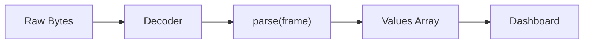

# Frame Parser Reference

Complete reference for Serial Studio's frame parser. Three options are available: **Built-In templates** (configured, not coded; the default for new projects), **Lua** scripts and **JavaScript** scripts.

## Overview

In Project File mode, the frame parser turns raw device data into the array of values Serial Studio maps to your dashboard datasets.

**Built-In** templates are compiled C++ parsers for common formats (delimited text, key=value, JSON, NMEA, Modbus, TLV and more). You pick a template, adjust its parameters in a form, and read the bundled documentation page for the wire format and channel mapping. No code is involved, and it is the fastest option by a wide margin. New projects start with the Built-In *Delimited text* template configured for comma-separated values.

**Lua** is the recommended scripting language. It runs faster than JavaScript and holds up better at high data rates. JavaScript is still fully supported for existing projects. Scripting is the most flexible way to handle custom protocols: you write a `parse()` function with full control over the frame.

You can switch between platforms at any time using the **Platform** dropdown in the frame parser editor toolbar. Every switch converts the current template to its closest equivalent on the new platform: the CSV/TSV/pipe/semicolon script templates map to and from the Built-In *Delimited text* separator, and the other formats map by name. Custom script code that does not match a template is replaced by the default template, as with any platform switch.

### Engine Details

| | Built-In | Lua | JavaScript |
|---|---|---|---|
| **Runtime** | Compiled C++ | Lua 5.4 | ECMAScript 7 / ES2016 |
| **Authoring** | Template + parameters, no code | `parse()` script | `parse()` script |
| **Performance** | Fastest (no interpreter) | Faster, lower overhead | Slower |
| **Integer support** | Full native range | Native 64-bit integers | Numbers are IEEE 754 doubles only |
| **Timeout** | Not needed (bounded parsers) | 500 ms per call | 500 ms per call |
| **Isolation** | Separate instance per source | Separate engine per source | Separate engine per source |
| **Sandboxing** | No user code runs | `base`, `table`, `string`, `math`, `utf8`, `coroutine` libraries | Console and GC extensions |

## Built-In Templates

Selecting **Built-In** in the **Platform** dropdown replaces the code editor with a template configurator: the template combobox sits in the editor toolbar, with the parameter form and the template's documentation page below it.

To test any parser, press **Test With Sample Data**: the Test Frame Parser dialog works with every platform (JavaScript, Lua and Built-In), lets you adjust the extraction pipeline (detection, delimiters, decoder, checksum), and shows the extracted frames, decoder output and parsed rows as a tree.

### Available Templates

| Family | Templates |
|---|---|
| Text | Delimited text (CSV by default; any separator text works), Fixed-width fields, Key-value pairs, INI/config format, AT command responses, NMEA 0183 sentences, URL-encoded data, JSON data, XML data, YAML data |
| Binary | Raw bytes, Hexadecimal bytes, Base64-encoded data, Binary TLV, COBS-encoded frames, SLIP-encoded frames, UBX protocol (u-blox), SiRF binary protocol, MAVLink messages, NMEA 2000 messages, RTCM corrections, Modbus frames, MessagePack data |
| Multi-frame | Batched sensor data, Time-series 2D arrays |

Every template exposes typed parameters. For example, *Delimited text* takes the separator text (a comma by default; type `;`, `|` or an escape sequence such as `\t` for tab), an optional quote character, whitespace trimming and empty-field removal. Templates that map named keys to channels (key-value, JSON, NMEA and similar) take an ordered key list: the position of each key in the list is the channel index, and missing keys keep their previous values between frames.

Binary protocol templates expect the matching decoder: select **Binary (Direct)** for TLV, COBS, SLIP, UBX, SiRF, MAVLink, NMEA 2000, RTCM, Modbus and MessagePack, and **Hexadecimal** for the Hexadecimal bytes template. The frame delimiters, checksum and decoder are configured per source, exactly as with scripted parsers.

### Built-In Templates Over the API

The Built-In configuration persists in the project file as `frameParserTemplate` (the template id) and `frameParserParams` (the parameter object) on each source. The control API mirrors this:

- `project.frameParser.listTemplates` returns the template catalog (id, name, description).
- `project.frameParser.getTemplateSchema` returns the parameter schema for a template id.
- `project.frameParser.setTemplate` applies a template (with optional params) to a source and switches it to the Built-In language.
- `project.frameParser.getTemplate` reads the current template and params for a source.
- `project.frameParser.dryRun` accepts `language: 2` with the JSON descriptor `{"template": "delimited", "params": {"separator": ";"}}` as the `code` payload to preview parsing without touching the project. Every `dryRun` call requires `code`, `language`, and one non-empty input (`inputBytesHex`, binary-safe and preferred, or `inputBytes` for UTF-8 text); the pipeline parameters (detection, delimiters, decoder, checksum) are optional and have defaults.

### When to Write a Script Instead

Use Lua or JavaScript when your device speaks a custom protocol that no template covers, when channel values need computation inside the parser, or when you need the scripting extras (`tableGet`/`tableSet`, `deviceWrite`, notifications). For everything the templates cover, Built-In parses the same frames with less setup and more headroom.

## Parser Pipeline



> **Legend:** 500 ms timeout per call &bull; One engine per source

## The `parse()` Function

### Signature

**Lua:**
```lua
function parse(frame)
  -- Process frame data
  -- Return table of values
  return {value1, value2, value3}
end
```

**JavaScript:**
```javascript
function parse(frame) {
    // Process frame data
    // Return array of values
    return [value1, value2, value3];
}
```

### Input Parameter

The `frame` parameter type depends on the Decoder Method selected in the Project Editor:

| Decoder Method         | Lua `frame` Type             | JS `frame` Type              | Example Value                      |
|------------------------|------------------------------|------------------------------|------------------------------------|
| Plain Text (UTF-8)     | String                       | String                       | `"23.5,1013,45.2"`                 |
| Hexadecimal            | String (hex pairs)           | String (hex pairs)           | `"03FF020035A0"`                   |
| Base64                 | String (base64-encoded)      | String (base64-encoded)      | `"Av8CADWg"`                       |
| Binary (Direct) [Pro]  | Table of numbers (0--255)    | Array of numbers (0--255)    | `{3, 255, 2, 0, 53, 160}`         |

**Plain Text** is the default. The frame string contains whatever the device sent, decoded as UTF-8, with start/end delimiters already stripped.

**Binary (Direct)** passes byte values directly. In Lua, this is a 1-indexed table; in JavaScript, a 0-indexed array. Requires a Pro license.

> **Binary trap:** with Binary (Direct), `frame` is **not a string**, so string functions fail on it. In Lua, `string.byte(frame, 1)` raises `bad argument #1 to 'byte' (string expected, got table)` and `frame:match(...)` raises `attempt to index a table value`; in JavaScript, `frame.split(",")` throws `frame.split is not a function`. Read bytes by indexing (`frame[1]` in Lua, `frame[0]` in JavaScript), as in Example 3 below. When you need `string.unpack` for multi-byte or float fields, convert the table to a string once at the top of `parse()`:
>
> ```lua
> function parse(frame)
>   if type(frame) == "table" then
>     frame = string.char(table.unpack(frame))
>   end
>   if #frame < 6 then return {} end
>   return { string.unpack("<f", frame, 1), string.unpack("<i2", frame, 5) }
> end
> ```
>
> The JavaScript equivalent for multi-byte fields is a `DataView` over the byte array:
>
> ```javascript
> function parse(frame) {
>     if (frame.length < 6) return [];
>     var view = new DataView(Uint8Array.from(frame).buffer);
>     return [view.getFloat32(0, true), view.getInt16(4, true)];
> }
> ```

### Return Value

Must return a table (Lua) or array (JavaScript). The index maps to the dataset Frame Index in your project definition.

> **Lua indexing note:** Lua tables are 1-indexed. `result[1]` maps to dataset Index 1, `result[2]` maps to Index 2, etc. This is a natural match since Serial Studio's dataset indices are also 1-based.

Return an empty table `{}` (Lua) or `[]` (JavaScript) for invalid or incomplete frames.

#### Flat Array (most common)

**Lua:**
```lua
function parse(frame)
  return frame:split(",")
end
-- Input:  "23.5,1013,45.2"
-- Output: {"23.5", "1013", "45.2"}  (one frame, three datasets)
```

`string.split` is a native, Serial Studio-provided helper: it splits on the
literal separator and keeps empty fields (`"1,,3"` -> `{"1", "", "3"}`), exactly
like JavaScript's `String.split`. Prefer it over a `gmatch`/`find` loop for
delimited frames — it runs in C and is the fast path.

**JavaScript:**
```javascript
function parse(frame) {
    return frame.split(",");
}
```

#### 2D Array (batch / multi-frame)

Return a table of tables (Lua) or array of arrays (JavaScript). Each inner table/array becomes a separate frame:

**Lua:**
```lua
function parse(frame)
  local result = {}
  for line in frame:gmatch("[^;]+") do
    local row = {}
    for field in line:gmatch("([^,]+)") do
      row[#row + 1] = field
    end
    result[#result + 1] = row
  end
  return result
end
-- Input:  "23.5,1013;24.0,1012"
-- Output: {{"23.5","1013"}, {"24.0","1012"}}  (two frames)
```

#### Mixed Scalar/Vector Array

Mix scalar values with sub-tables/arrays. Scalars repeat across generated frames; vectors expand, one element per frame. If multiple vectors have different lengths, shorter ones are extended by repeating their last value.

**Lua:**
```lua
function parse(frame)
  local parts = {}
  for field in frame:gmatch("([^,]+)") do
    parts[#parts + 1] = tonumber(field) or field
  end

  local timestamp = parts[1]
  local sensorId  = parts[2]
  local readings  = {}
  for i = 3, #parts do
    readings[#readings + 1] = parts[i]
  end

  return {timestamp, sensorId, readings}
end
-- Input:  "100.0,7,1.1,2.2,3.3"
-- Generates three frames:
--   {100.0, 7, 1.1}
--   {100.0, 7, 2.2}
--   {100.0, 7, 3.3}
```

## Available APIs

### Lua Standard Libraries

The Lua engine loads a safe subset of the standard library. The following modules are available:

| Module | Key Functions |
|--------|--------------|
| **base** | `print`, `type`, `tonumber`, `tostring`, `pairs`, `ipairs`, `select`, `error`, `pcall`, `xpcall`, `assert`, `rawget`, `rawset`, `rawlen`, `rawequal`, `next`, `setmetatable`, `getmetatable` |
| **string** | `string.byte`, `string.char`, `string.find`, `string.format`, `string.gmatch`, `string.gsub`, `string.len`, `string.lower`, `string.upper`, `string.match`, `string.pack`, `string.packsize`, `string.rep`, `string.reverse`, `string.sub`, `string.unpack` |
| **table** | `table.concat`, `table.insert`, `table.remove`, `table.sort`, `table.move`, `table.pack`, `table.unpack` |
| **math** | `math.abs`, `math.ceil`, `math.floor`, `math.max`, `math.min`, `math.sqrt`, `math.sin`, `math.cos`, `math.tan`, `math.pi`, `math.huge`, `math.log`, `math.exp`, `math.random` |
| **utf8** | `utf8.char`, `utf8.codes`, `utf8.codepoint`, `utf8.len`, `utf8.offset` |

**Serial Studio extensions** (added on top of the standard library):
`string.split(s, sep)` (native — splits on the literal separator, keeps empty
fields, like JavaScript's `String.split`), `string.trim`, `string.startswith`,
`string.endswith`, `string.gfind` (alias for `string.gmatch`), plus the Lua
5.1/5.2 compatibility names `math.log10`, `math.pow`, `math.atan2`, `bit32.*`,
and `unpack`.

**Not available** (sandboxed): `io`, `os`, `debug`, `package`, `require`, `dofile`, `loadfile`, `load`.

**Bitwise operators** (Lua 5.4 native): `&` (AND), `|` (OR), `~` (XOR), `<<` (left shift), `>>` (right shift), `~` (unary NOT). These are particularly useful for binary protocol parsing.

**Integer division**: `//` operator (e.g., `7 // 2 == 3`).

### JavaScript Standard APIs

The JavaScript engine provides standard ECMAScript built-ins. No browser DOM, no Node.js modules.

| Category | Available |
|----------|-----------|
| **String** | `split`, `substring`, `indexOf`, `trim`, `replace`, `toUpperCase`, `toLowerCase`, `charAt`, `charCodeAt`, `startsWith`, `endsWith`, `includes`, `match`, `search`, `slice`, `padStart`, `padEnd` |
| **Array** | `length`, `push`, `pop`, `shift`, `unshift`, `slice`, `splice`, `reverse`, `sort`, `join`, `concat`, `map`, `filter`, `forEach`, `reduce`, `find`, `findIndex`, `indexOf`, `includes`, `every`, `some`, `fill`, `Array.from`, `Array.isArray` |
| **Number** | `parseInt`, `parseFloat`, `isNaN`, `isFinite`, `Number()`, `.toFixed()`, `.toString(radix)` |
| **Math** | `abs`, `min`, `max`, `round`, `floor`, `ceil`, `sqrt`, `pow`, `sin`, `cos`, `tan`, `atan2`, `log`, `exp`, `PI`, `E`, `random` |
| **JSON** | `JSON.parse()`, `JSON.stringify()` |
| **RegExp** | `/pattern/flags`, `.test()`, `.exec()`, `String.match()`, `String.replace()` |
| **Console** | `console.log()`, `console.warn()`, `console.error()` |

### Global State

Variables declared outside `parse()` persist between calls within the same engine session. Use for frame counters, state machines, moving averages, and protocol state tracking.

**Lua:**
```lua
local frameCount = 0
local history = {}

function parse(frame)
  frameCount = frameCount + 1
  -- ...
end
```

**JavaScript:**
```javascript
var frameCount = 0;
var history = [];

function parse(frame) {
    frameCount++;
    // ...
}
```

Globals are reset when: the project is reloaded, parser code is edited and reapplied, or Serial Studio is restarted.

## Practical Examples

### Example 1: Simple CSV

**Lua:**
```lua
function parse(frame)
  local result = {}
  for field in frame:gmatch("([^,]+)") do
    result[#result + 1] = field
  end
  return result
end
```

**JavaScript:**
```javascript
function parse(frame) {
    return frame.split(",");
}
```

### Example 2: JSON Payload

**Lua:**
```lua
-- Lightweight JSON value extraction (flat objects only)
function parse(frame)
  local result = {}
  for key, value in frame:gmatch('"([^"]+)"%s*:%s*([%d%.%-]+)') do
    result[#result + 1] = tonumber(value)
  end
  return result
end
```

**JavaScript:**
```javascript
function parse(frame) {
    try {
        var obj = JSON.parse(frame);
        return [obj.temperature, obj.humidity, obj.pressure];
    } catch (e) {
        return [];
    }
}
```

### Example 3: Binary Protocol with Header (Binary Direct)

**Lua:**
```lua
function parse(frame)
  if #frame < 8 then return {} end
  if frame[1] ~= 0xAA or frame[2] ~= 0x55 then return {} end

  local temp     = ((frame[3] << 8) | frame[4]) / 100.0
  local pressure = ((frame[5] << 8) | frame[6]) / 10.0
  local humidity = frame[7]
  return {temp, pressure, humidity}
end
```

**JavaScript:**
```javascript
function parse(frame) {
    if (frame.length < 8) return [];
    if (frame[0] !== 0xAA || frame[1] !== 0x55) return [];

    var temp = (frame[2] << 8 | frame[3]) / 100.0;
    var pressure = (frame[4] << 8 | frame[5]) / 10.0;
    var humidity = frame[6];
    return [temp, pressure, humidity];
}
```

### Example 4: Stateful Frame Counter

**Lua:**
```lua
local frameCount = 0

function parse(frame)
  frameCount = frameCount + 1
  local result = {frameCount}
  for field in frame:gmatch("([^,]+)") do
    result[#result + 1] = field
  end
  return result
end
```

### Example 5: XOR Checksum Validation

**Lua:**
```lua
-- Frame format: "1023,512,850*AB"
function parse(frame)
  local data, checkHex = frame:match("^(.+)%*(%x+)$")
  if not data then return {} end

  local checksumReceived = tonumber(checkHex, 16)
  local checksumCalc = 0
  for i = 1, #data do
    checksumCalc = checksumCalc ~ data:byte(i)
  end

  if checksumCalc ~= checksumReceived then return {} end

  local result = {}
  for field in data:gmatch("([^,]+)") do
    result[#result + 1] = field
  end
  return result
end
```

### Example 6: Multi-Message State Machine

**Lua:**
```lua
-- Device sends "A:temp,humidity" and "B:voltage,current"
local envValues   = {0, 0}
local powerValues = {0, 0}

function parse(frame)
  local msgType = frame:sub(1, 1)
  local data = frame:sub(3)

  if msgType == "A" then
    local i = 1
    for field in data:gmatch("([^,]+)") do
      envValues[i] = tonumber(field) or 0
      i = i + 1
    end
  elseif msgType == "B" then
    local i = 1
    for field in data:gmatch("([^,]+)") do
      powerValues[i] = tonumber(field) or 0
      i = i + 1
    end
  end

  return {envValues[1], envValues[2], powerValues[1], powerValues[2]}
end
```

## Output Widget Transmit Helpers

Output controls (Pro feature) use a separate JavaScript engine with built-in protocol helper functions. They're available in every `transmit(value)` function. You don't need to import or declare them.

For full documentation on output controls, see [Output Controls](Output-Controls.md).

### Modbus

| Function | Description |
|----------|-------------|
| `modbusWriteRegister(address, value)` | Write a 16-bit integer to a holding register |
| `modbusWriteCoil(address, on)` | Write a coil (ON = 0xFF00, OFF = 0x0000) |
| `modbusWriteFloat(address, value)` | Write a 32-bit float across two consecutive registers |

### CAN Bus

| Function | Description |
|----------|-------------|
| `canSendFrame(id, payload)` | Send a CAN frame with an array or string payload |
| `canSendValue(id, value, bytes)` | Send a numeric value packed big-endian (1--8 bytes, default 2) |

> **Note:** Output widget transmit functions always use JavaScript. The Lua/JavaScript language selection applies only to the frame parser `parse()` function.

## Writing back to the device: `deviceWrite()`

Frame parsers (and dataset transforms) can send bytes back to the connected device from inside the script. This unblocks closed-loop control patterns: acknowledge a frame, raise an alarm setpoint, switch the device into a new mode, or pulse a request line, all decided by the script that just parsed the incoming frame.

### Signature

```text
deviceWrite(data, sourceId?)
  data:     string (Lua) or string / array of bytes (JavaScript)
  sourceId: optional number; defaults to the source the parser belongs to
  returns:  { ok = true }                  on success
            { ok = false, error = "..." }  on failure
```

`deviceWrite` is **synchronous and fire-and-forget**: it pushes bytes to the driver and returns immediately. It does not wait for a reply, it does not retry, and it does not block parsing.

Every call is logged to the application log as `[deviceWrite] source=<id> bytes=<n> written=<n>` for debugging.

### Lua example

```lua
function parse(frame)
  local values = {}
  for field in frame:gmatch("([^,]+)") do
    values[#values + 1] = tonumber(field) or field
  end

  -- Raise alarm if temperature exceeds threshold
  if (tonumber(values[1]) or 0) > 80 then
    local r = deviceWrite("ALARM=1\n")
    if not r.ok then
      print("alarm write failed:", r.error)
    end
  end

  return values
end
```

### JavaScript example

```javascript
function parse(frame) {
  const values = frame.split(",");

  // Acknowledge every frame we successfully parsed
  if (values.length === 4) {
    const r = deviceWrite("ACK\n");
    if (!r.ok) console.warn("ack failed:", r.error);
  }

  return values;
}
```

### Targeting a specific source

In multi-source projects, omit `sourceId` to write back to the same source the parser owns. Pass an explicit `sourceId` to write to a different one. This is useful when one source is the command channel and another is the telemetry channel:

```lua
function parse(frame)
  -- read telemetry on source 1, write commands to source 0
  deviceWrite("STATUS?\n", 0)
  return parseTelemetry(frame)
end
```

### Failure modes

`{ ok = false, error = ... }` covers all failure cases (`deviceWrite` never throws). The most common reasons:

- `"device not connected or write failed"`: no live driver for that source, or the driver's `write()` returned 0/negative.
- `"deviceWrite: data is empty"`: the payload was zero bytes.
- `"deviceWrite: data must be a string"` (Lua) / `"... string or byte array"` (JS): wrong argument type.
- `"deviceWrite: sourceId must be a number"`: the optional second argument was non-numeric.

### When NOT to use it

- For one-shot user-triggered commands (button press, slider drag), use an **Output Widget** instead. Output widgets carry UI, validation, and protocol helpers (CRC, Modbus, NMEA, ...). `deviceWrite` is the right tool when the *parser itself* needs to react to incoming data.
- Don't loop on `deviceWrite` inside a single `parse()` call. The parser hotpath runs on every frame, and runaway writes will saturate the link.
- Don't use it to broadcast unrelated state. The 500 ms parser watchdog will fire if your script spends too long in I/O.

## Firing actions: `actionFire()`

Parsers can also trigger an existing project [Action](Actions.md) by its integer `actionId`. Same return shape as `deviceWrite`: `{ ok = true }` on success, `{ ok = false, error = "..." }` on failure. Calls are logged `[actionFire] id=N index=M ok`.

```lua
function parse(frame)
  local values = {}
  for f in frame:gmatch("([^,]+)") do values[#values + 1] = f end
  if tonumber(values[1]) and tonumber(values[1]) < 5 then
    actionFire(3)   -- "Emergency Shutdown"
  end
  return values
end
```

`actionId` is the action's stable identifier (from `project.action.list` or the Project Editor), NOT its position in the action list.

`actionFire` is also available in dataset transforms and painter scripts.

## Controlling the dashboard: `clearPlots()` and friends

Parsers and dataset transforms can call a small set of dashboard helpers that affect what the user sees on the active window. These do NOT change the project file, do NOT touch widgets, datasets, or actions, and do NOT log anything to the console. They are intended for runtime UI orchestration driven by what the data tells you, for example: clearing a stale GPS trace the moment a valid fix arrives, hiding the terminal once the device is talking cleanly, or switching to a different workspace when the device reports a new operating mode.

All of them return the same shape as `deviceWrite` / `actionFire`:

```text
{ ok = true }
{ ok = false, error = "..." }
```

They never throw. They never block. They are available from frame parsers, dataset transforms, and painter scripts.

### Function reference

| Function                               | Argument(s)                          | What it does                                                                                          |
|----------------------------------------|--------------------------------------|-------------------------------------------------------------------------------------------------------|
| `clearPlots()`                         | none                                 | Empties every time-series buffer: line plots, multiplots, FFT, GPS traces, 3D plots, waterfall.       |
| `setPlotPoints(n)`                     | integer, >= 1                        | Changes the horizontal sample window for all line plots. Mirrors the **Points** spinner in the toolbar. |
| `setTerminalVisible(visible)`          | boolean                              | Shows or hides the dashboard terminal pane.                                                            |
| `setNotificationLogVisible(visible)`   | boolean                              | Shows or hides the notification log.                                                                   |
| `setClockVisible(visible)`             | boolean                              | Shows or hides the dashboard clock.                                                                    |
| `setStopwatchVisible(visible)`         | boolean                              | Shows or hides the dashboard stopwatch.                                                                |
| `setActiveWorkspace(idOrName)`         | integer workspace id, or string name | Switches the dashboard to the named (or numbered) workspace tab. String match is case-insensitive.     |

`clearPlots` only resets the plot data buffers. Widget settings, dataset definitions, FFT configuration, axis bounds, and actions are left alone. After the call, plots continue to draw the next incoming sample as usual.

`setPlotPoints` has the same effect as the user changing the **Points** value: every line plot reconfigures its rolling buffer. Calling it on every frame is wasteful; call it once after detecting a regime change.

The four visibility helpers map one-to-one to the user-facing **Show terminal / notifications / clock / stopwatch** toggles. Per-window: the change applies to whichever dashboard window is active.

`setActiveWorkspace` accepts either the workspace's numeric `workspaceId` (>= 1000) or its title string. If no workspace matches the name, it returns `{ ok = false, error = "setActiveWorkspace: no workspace named \"X\"" }`.

### Example: reset a GPS plot once a valid fix arrives

Many GPS receivers emit `0, 0` (or last-known stale coordinates) for several seconds before the first real fix. The plot ends up with a garbage line from the origin out to the first valid sample. Watch for the fix transition and clear once.

**Lua:**
```lua
local hadValidFix = false

function parse(frame)
  -- Frame: "lat,lon,quality"  (quality 1 = GPS fix, 0 = no fix)
  local lat, lon, quality = frame:match("([^,]+),([^,]+),([^,]+)")
  lat     = tonumber(lat)
  lon     = tonumber(lon)
  quality = tonumber(quality) or 0

  if not hadValidFix and quality > 0 then
    clearPlots()
    hadValidFix = true
  end

  return {lat, lon, quality}
end
```

**JavaScript:**
```javascript
var hadValidFix = false;

function parse(frame) {
  const parts   = frame.split(",");
  const lat     = parseFloat(parts[0]);
  const lon     = parseFloat(parts[1]);
  const quality = parseInt(parts[2], 10) || 0;

  if (!hadValidFix && quality > 0) {
    clearPlots();
    hadValidFix = true;
  }

  return [lat, lon, quality];
}
```

### Example: switch workspaces when the device changes mode

A multi-mode device (for example, a flight controller that toggles between *Standby*, *Calibration*, and *Flight*) can drive the dashboard layout from the parser, so the user always sees the workspace that matches the current device mode.

**Lua:**
```lua
local lastMode = nil

function parse(frame)
  -- Frame: "MODE=Flight,alt=120,speed=42"
  local mode = frame:match("MODE=([^,]+)")
  if mode and mode ~= lastMode then
    setActiveWorkspace(mode)
    lastMode = mode
  end

  local alt   = tonumber(frame:match("alt=([%-%d%.]+)"))   or 0
  local speed = tonumber(frame:match("speed=([%-%d%.]+)")) or 0
  return {alt, speed}
end
```

**JavaScript:**
```javascript
var lastMode = null;

function parse(frame) {
  const modeMatch  = frame.match(/MODE=([^,]+)/);
  const mode       = modeMatch ? modeMatch[1] : null;
  if (mode && mode !== lastMode) {
    setActiveWorkspace(mode);
    lastMode = mode;
  }

  const alt   = parseFloat((frame.match(/alt=([\-\d.]+)/)   || [])[1] || 0);
  const speed = parseFloat((frame.match(/speed=([\-\d.]+)/) || [])[1] || 0);
  return [alt, speed];
}
```

### Example: focus mode while streaming

Hide the chatty terminal, notification log, and stopwatch as soon as a valid telemetry stream is detected, so the user gets a clean dashboard. Restore them when the stream stalls (handled in a transform that watches `frameNumber` ticks elsewhere).

**Lua:**
```lua
local focused = false

function parse(frame)
  local values = {}
  for f in frame:gmatch("([^,]+)") do
    values[#values + 1] = tonumber(f) or f
  end

  if not focused and #values >= 3 then
    setTerminalVisible(false)
    setNotificationLogVisible(false)
    setStopwatchVisible(false)
    setPlotPoints(2000)
    focused = true
  end

  return values
end
```

**JavaScript:**
```javascript
var focused = false;

function parse(frame) {
  const values = frame.split(",").map(parseFloat);

  if (!focused && values.length >= 3) {
    setTerminalVisible(false);
    setNotificationLogVisible(false);
    setStopwatchVisible(false);
    setPlotPoints(2000);
    focused = true;
  }

  return values;
}
```

### Example: use from a dataset transform

The helpers are also available inside `transform(value, info)`. Useful when only one dataset's value is the trigger, for example clearing the plots the moment a "reset" sentinel value passes through.

```lua
-- Dataset transform: any reading >= 9999 means the device just rebooted.
function transform(value)
  if value >= 9999 then
    clearPlots()
    return 0  -- swap the sentinel out for a clean 0
  end
  return value
end
```

### When NOT to use these

- Do not call any of them on every frame. They are coarse UI commands. `clearPlots` on every frame produces an empty graph; `setActiveWorkspace` on every frame yanks the user's view away. Gate every call behind a state transition (`hadValidFix`, `lastMode`, `focused`) so the call fires once per event.
- Do not use them as user-preference settings. The user's toolbar toggles, **Points** spinner, and active workspace are persisted to QSettings or the project file. Script-driven changes are ephemeral, intended to react to the data, not to overwrite user choice.
- They affect the **active dashboard window** only. In a multi-window setup, scripts have no way to address a specific window.

## Calling any API command: `apiCall()`

Beyond the focused helpers above, parsers can invoke Serial Studio's API commands through a generic gateway. This is the same surface exposed on TCP port 7777 for external clients, now reachable from inside the parser, dataset transforms, and Painter widgets. The gateway is default-deny: only a small read-only allow-list is callable with no setup (`project.*` getters, `dashboard.getStatus` / `dashboard.getData` / `dashboard.tailFrames`, `notifications.list` / `notifications.post`, `sessions.list` / `sessions.get`, `controlscript.get` / `controlscript.getStatus`, `api.getCommands`); every other command returns `METHOD_NOT_ALLOWED` unless the project opts in via `apiCall.allowFullSurface`. Calls are also rate-limited per source: a 100 calls/s token bucket, at most 8 concurrent calls, and a 1 MiB cap on request bodies and responses.

```text
apiCall(method, params?) -> { ok, result?, error?, errorCode?, errorData? }
```

`method` is a dotted command name (for example `"dashboard.snapshot"`, `"ui.window.setActiveGroup"`, `"console.send"`). `params` is an optional object/table that maps to the same JSON parameters the TCP API accepts. See [API Reference](API-Reference.md) for the complete catalog.

A second helper, `apiCallList()`, returns an array of every registered command name, handy for quick discovery from the parser console.

### Return shape

| Field        | When set     | Description                                                                  |
|--------------|--------------|------------------------------------------------------------------------------|
| `ok`         | always       | `true` if the command executed successfully, `false` otherwise.              |
| `result`     | success      | The command-specific result object. Absent when the command returns nothing. |
| `error`      | failure      | Human-readable error message.                                                |
| `errorCode`  | failure      | One of `INVALID_PARAM`, `MISSING_PARAM`, `UNKNOWN_COMMAND`, ...              |
| `errorData`  | failure      | Optional structured diagnostic payload (e.g. nearest-name suggestions).      |

`apiCall` never throws. Every failure mode (unknown command, bad params, internal exception) returns a structured `{ ok = false, ... }` table.

### Examples

**Lua -- bring up the right workspace when a fault flag goes high (`ui.window.setActiveGroup` is not in the default allow-list, so this requires the `apiCall.allowFullSurface` opt-in):**

```lua
local lastFaultBit = 0

function parse(frame)
  local values = {}
  for f in frame:gmatch("([^,]+)") do
    values[#values + 1] = f
  end

  local fault = tonumber(values[4] or "0") or 0
  if fault ~= 0 and lastFaultBit == 0 then
    apiCall("ui.window.setActiveGroup", { groupId = 1002 })
    print("[FAULT] code=" .. fault)
  end
  lastFaultBit = fault

  return values
end
```

**JavaScript -- check the dashboard state when an alert arrives (`dashboard.getStatus` is on the default allow-list; no opt-in needed):**

```javascript
function parse(frame) {
    const values = frame.split(",");
    if (values[0] === "ALERT") {
        const status = apiCall("dashboard.getStatus");
        if (status.ok && status.result.running)
            console.warn("ALERT received, dashboard at " + status.result.fps + " fps");
    }
    return values;
}
```

**Lua -- discover what's available:**

```lua
function parse(frame)
  if not _G.__listed then
    _G.__listed = true
    local cmds = apiCallList()
    print("Registered commands: " .. #cmds)
    for i = 1, math.min(5, #cmds) do
      print("  " .. cmds[i])
    end
  end
  return { frame }
end
```

### When NOT to use it

- **One-shot, fire-and-forget.** `apiCall` runs synchronously on the dashboard thread. Heavy work (mass mutations, project save, MDF4 export) blocks frame processing. Gate every call on an event transition; never `apiCall` on every frame.
- **Prefer the focused helpers.** Runtime UI orchestration (clearing plots, toggling panes, switching the active workspace) has `apiCall` equivalents under `ui.*` / `dashboard.*`, but those sit behind the `apiCall.allowFullSurface` opt-in. The dedicated `clearPlots()` / `setPlotPoints()` / `setActiveWorkspace()` shortcuts bypass the allow-list, so use the shortcuts for those tasks; reach for `apiCall` for the rest of the command surface.
- **Avoid destructive commands from a parser.** Anything that mutates the project (`project.save`, `project.batch`, `groups.delete`) is fine from a one-time setup hook, but should not fire from the streaming hotpath.
- **Pro features stay gated.** Commands behind the commercial tier (Modbus, CAN, sessions, MDF4, MQTT...) return `{ ok = false, errorCode = "EXECUTION_ERROR" }` in GPL builds. Check `ok` before assuming success.

## Built-in Template Scripts

Serial Studio includes 28 ready-to-use parser templates, available in both Lua and JavaScript. Select a template from the dropdown in the frame parser editor:

| Template                  | Description                          |
|---------------------------|--------------------------------------|
| AT Commands               | AT command responses                 |
| Base64 Encoded            | Base64-encoded data                  |
| Batched Sensor Data       | Batched sensor data (multi-frame)    |
| Binary TLV                | Binary TLV (Tag-Length-Value)        |
| COBS Encoded              | COBS-encoded frames                  |
| Comma Separated           | Comma-separated data (default)       |
| Fixed Width Fields        | Fixed-width fields                   |
| Hexadecimal Bytes         | Hexadecimal bytes                    |
| INI Config                | INI/config format                    |
| JSON Data                 | JSON data                            |
| Key-Value Pairs           | Key-value pairs                      |
| MAVLink                   | MAVLink messages                     |
| MessagePack               | MessagePack data                     |
| Modbus                    | Modbus frames                        |
| NMEA 0183                 | NMEA 0183 sentences                  |
| NMEA 2000                 | NMEA 2000 messages                   |
| Pipe Delimited            | Pipe-delimited data                  |
| Raw Bytes                 | Raw bytes                            |
| RTCM Corrections          | RTCM corrections                     |
| Semicolon Separated       | Semicolon-separated data             |
| SiRF Binary               | SiRF binary protocol                 |
| SLIP Encoded              | SLIP-encoded frames                  |
| Tab Separated             | Tab-separated data                   |
| Time-Series 2D            | Time-series 2D arrays (multi-frame)  |
| UBX (u-blox)              | UBX protocol (u-blox)               |
| URL Encoded               | URL-encoded data                     |
| XML Data                  | XML data                             |
| YAML Data                 | YAML data                            |

When you switch between Lua and JavaScript, Serial Studio automatically loads the same template in the new language.

## Per-Source Parsers

In multi-device projects, each Source can have its own independent parser. Configure the parser in the Source's "Frame Parser" tab in the Project Editor.

Each source runs in an isolated engine instance. Global variables in one source do not affect another. If a source has no parser code, it falls back to the global parser (source 0).

## Rules and Limitations

1. The function **must** be named `parse` (case-sensitive).
2. It must accept exactly **one parameter**.
3. It must return a table (Lua) or array (JavaScript). Not a string, number, or nil.
4. Return an empty table/array for invalid or incomplete frames.
5. **Synchronous only.** The engine never yields to the host, so the result must be ready when `parse()` returns. Lua's `coroutine` library is available, but it cannot make `parse()` asynchronous; the same goes for JavaScript Promises/async.
6. **500 ms execution timeout** per parse call. If your function takes longer (e.g., infinite loop), the engine is interrupted and the frame is dropped.
7. **No file system access**, no network access, no module imports.
8. Lua: `io`, `os`, `debug`, `package` libraries are not available. JavaScript: No DOM, `window`, `require`.
9. Global tables/arrays that grow without bound will leak memory. Always cap history buffers.

## Migrating from JavaScript to Lua

If you have an existing JavaScript parser and want to switch to Lua for better performance:

| JavaScript | Lua |
|---|---|
| `frame.split(",")` | `for field in frame:gmatch("([^,]+)") do ... end` |
| `frame.length` | `#frame` |
| `frame.indexOf("x")` | `frame:find("x", 1, true)` |
| `parseInt(s, 16)` | `tonumber(s, 16)` |
| `parseFloat(s)` | `tonumber(s)` |
| `Math.floor(x)` | `math.floor(x)` |
| `array.push(v)` | `table[#table + 1] = v` |
| `array[0]` (0-indexed) | `table[1]` (1-indexed) |
| `var x = 0;` | `local x = 0` |
| `for (var i = 0; ...)` | `for i = 1, n do ... end` |
| `0xFF & mask` | `0xFF & mask` (same in Lua 5.4) |
| `value << 8` | `value << 8` (same in Lua 5.4) |
| `JSON.parse(frame)` | Manual extraction (see JSON template) |
| `try { } catch(e) { }` | `pcall(function() ... end)` |
| `console.log(x)` | `console.log(x)` or `print(x)` |

> **Key difference:** Lua tables are 1-indexed. Binary frame byte tables start at index 1, not 0. The `#` operator returns the table length.

## Debugging

**Lua:**
```lua
function parse(frame)
  print("Frame:", frame, "| Type:", type(frame), "| Length:", #frame)
  local result = {}
  for field in frame:gmatch("([^,]+)") do
    result[#result + 1] = field
  end
  print("Parsed " .. #result .. " fields")
  return result
end
```

**JavaScript:**
```javascript
function parse(frame) {
    console.log("Frame:", frame, "| Type:", typeof frame, "| Length:", frame.length);
    var values = frame.split(",");
    console.log("Parsed:", JSON.stringify(values));
    return values;
}
```

Output appears in Serial Studio's console/terminal panel. Lua provides the same `console` table as JavaScript (`console.log`, `console.debug`, `console.info`, `console.warn`, `console.error`), with `print()` as shorthand for `console.log()`; in both languages, `console.error` also raises an application notification, and `console.warn` does too when **Route Warnings to Notifications** is enabled in Settings (off by default). Arguments are joined with tab separators.

## Performance Tips

- **Use Lua for high-frequency data** (>1 kHz). Lua's stack-based API avoids the QJSValue boxing overhead.
- Prefer early returns for invalid frames to skip expensive logic.
- Cap global history buffers with a fixed maximum size.
- Reuse a global result table when possible to minimize allocations.
- In Lua, use `string.find` with `plain=true` (3rd argument) for literal string searches instead of pattern matching.

## See Also

- [Dataset Value Transforms](Dataset-Transforms.md): per-dataset `transform(value)` for calibration, filtering, and unit conversion.
- [Data Flow](Data-Flow.md): how data moves from device through parsing to the dashboard.
- [Project Editor](Project-Editor.md): where you write and configure parser code.
- [Operation Modes](Operation-Modes.md): when Project File mode (and thus custom parsers) applies.
- [Benchmark Dialog](Benchmark.md): measures `parse()` throughput per language (Lua vs JavaScript, numeric vs mixed) on your hardware.
- [Troubleshooting](Troubleshooting.md): common parser issues and fixes.
