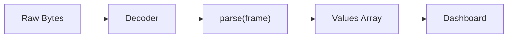

# JavaScript API Reference

Complete reference for Serial Studio's JavaScript frame parser API. Use this to write custom parsers for any data format.

## Overview

When using Project File mode, you can write a JavaScript `parse()` function to transform raw device data into the array of values that Serial Studio maps to your dashboard datasets. This is the most powerful and flexible way to handle custom protocols.

The parser runs inside a QJSEngine (ECMAScript 7 / ES2016 compliant) with console and garbage-collection extensions. Each source in a multi-source project gets its own isolated engine instance, so global state in one parser cannot affect another.

## Parser Pipeline

The following diagram shows how raw device bytes are transformed into dashboard-ready values through the decoder and JavaScript parser stages.



> **Legend:** 500 ms timeout per call &bull; ECMAScript 7 (ES2016) &bull; One engine per source

---

## The `parse()` Function

### Signature

```javascript
function parse(frame) {
    // Process frame data
    // Return array of values
    return [value1, value2, value3];
}
```

### Input Parameter

The `frame` parameter type depends on the Decoder Method selected in the Project Editor:

| Decoder Method         | `frame` Type               | Example Value                      |
|------------------------|----------------------------|------------------------------------|
| Plain Text (UTF-8)     | String                     | `"23.5,1013,45.2"`                 |
| Hexadecimal            | String (hex pairs)         | `"03FF020035A0"`                   |
| Base64                 | String (base64-encoded)    | `"Av8CADWg"`                       |
| Binary (Direct) [Pro]  | Array of numbers (0--255)  | `[3, 255, 2, 0, 53, 160]`         |

**Plain Text** is the default. The frame string contains whatever the device sent, decoded as UTF-8, with start/end delimiters already stripped.

**Hexadecimal** converts the raw bytes to a hex string before passing them in. Each byte becomes two hex characters (e.g., byte `0xFF` becomes `"FF"`).

**Base64** converts the raw bytes to a Base64 string before passing them in.

**Binary (Direct)** passes an array of integer byte values (0--255) directly, with no string encoding. This is the most efficient option for binary protocols. Requires a Pro license.

### Return Value

Must return an array. The array index maps to the dataset Frame Index in your project definition: `array[0]` maps to Index 1, `array[1]` maps to Index 2, and so on.

Return an empty array `[]` for invalid or incomplete frames.

#### Flat Array (most common)

```javascript
function parse(frame) {
    return frame.split(",");
}
// Input:  "23.5,1013,45.2"
// Output: ["23.5", "1013", "45.2"]  (one frame, three datasets)
```

#### 2D Array (batch / multi-frame)

Return an array of arrays. Each inner array becomes a separate frame:

```javascript
function parse(frame) {
    var lines = frame.split(";");
    var result = [];
    for (var i = 0; i < lines.length; i++)
        result.push(lines[i].split(","));
    return result;
}
// Input:  "23.5,1013;24.0,1012"
// Output: [["23.5","1013"], ["24.0","1012"]]  (two frames)
```

#### Mixed Scalar/Vector Array

Mix scalar values with arrays. Scalars repeat across generated frames; arrays expand, one element per frame. If multiple vectors have different lengths, shorter ones are extended by repeating their last value.

```javascript
function parse(frame) {
    var parts = frame.split(",");
    var timestamp = parseFloat(parts[0]);
    var sensorId = parseInt(parts[1]);
    var readings = [];
    for (var i = 2; i < parts.length; i++)
        readings.push(parseFloat(parts[i]));
    return [timestamp, sensorId, readings];
}
// Input:  "100.0,7,1.1,2.2,3.3"
// Generates three frames:
//   [100.0, 7, 1.1]
//   [100.0, 7, 2.2]
//   [100.0, 7, 3.3]
```

---

## Available JavaScript APIs

The engine provides standard ECMAScript built-ins. No browser DOM, no Node.js modules, no external libraries.

### String Methods

`split`, `substring`, `substr`, `indexOf`, `lastIndexOf`, `trim`, `replace`, `toUpperCase`, `toLowerCase`, `charAt`, `charCodeAt`, `startsWith`, `endsWith`, `includes`, `match`, `search`, `slice`, `repeat`, `padStart`, `padEnd`

### Array Methods

`length`, `push`, `pop`, `shift`, `unshift`, `slice`, `splice`, `reverse`, `sort`, `join`, `concat`, `map`, `filter`, `forEach`, `reduce`, `find`, `findIndex`, `indexOf`, `includes`, `every`, `some`, `fill`, `Array.from`, `Array.isArray`

### Number Functions

`parseInt(string, radix)`, `parseFloat(string)`, `isNaN(value)`, `isFinite(value)`, `Number(value)`, `.toFixed(digits)`, `.toString(radix)`, `Number.isInteger`, `Number.isFinite`

### Math Object

`abs`, `min`, `max`, `round`, `floor`, `ceil`, `sqrt`, `pow`, `sin`, `cos`, `tan`, `asin`, `acos`, `atan`, `atan2`, `log`, `log2`, `log10`, `exp`, `sign`, `trunc`, `cbrt`, `hypot`, `PI`, `E`, `random`

### JSON

`JSON.parse(string)` and `JSON.stringify(value)`.

### Base64

`atob(encoded)` decodes a Base64 string. `btoa(string)` encodes a string to Base64.

### Regular Expressions

`/pattern/flags` literal syntax, `.test()`, `.exec()`, `String.match()`, `String.replace()`, `String.search()`.

### Console

`console.log()`, `console.warn()`, `console.error()`. Output appears in Serial Studio's console window. Useful for debugging parsers during development.

### Global State

Variables declared outside `parse()` persist between calls within the same engine session. Use for frame counters, state machines, moving averages, checksum accumulators, and protocol state tracking.

Globals are reset when: the project is reloaded, parser code is edited and reapplied, or Serial Studio is restarted.

---

## Practical Examples

### Example 1: Simple CSV

```javascript
function parse(frame) {
    return frame.split(",");
}
```

### Example 2: Custom Delimiter

```javascript
function parse(frame) {
    return frame.split("|");
}
```

### Example 3: NMEA GPS Sentence

```javascript
function parse(frame) {
    if (!frame.startsWith("$GPGGA"))
        return [];

    var parts = frame.split(",");
    var lat = parseFloat(parts[2]) / 100;
    var lon = parseFloat(parts[4]) / 100;
    var alt = parseFloat(parts[9]);
    var sats = parseInt(parts[7]);
    return [lat, lon, alt, sats];
}
```

### Example 4: JSON Payload

```javascript
function parse(frame) {
    try {
        var obj = JSON.parse(frame);
        return [obj.temperature, obj.humidity, obj.pressure];
    } catch (e) {
        return [];
    }
}
```

### Example 5: Binary Protocol with Header (Binary Direct)

```javascript
// Decoder: Binary (Direct) [Pro]
// frame is an array of byte values
function parse(frame) {
    if (frame.length < 8)
        return [];

    if (frame[0] !== 0xAA || frame[1] !== 0x55)
        return [];

    var temp = (frame[2] << 8 | frame[3]) / 100.0;
    var pressure = (frame[4] << 8 | frame[5]) / 10.0;
    var humidity = frame[6];
    return [temp, pressure, humidity];
}
```

### Example 6: Hex String Byte Extraction (Hexadecimal Decoder)

```javascript
// Decoder: Hexadecimal
// frame is a hex string like "03FF020035A0"
function parse(frame) {
    var bytes = [];
    for (var i = 0; i < frame.length; i += 2)
        bytes.push(parseInt(frame.substr(i, 2), 16));

    var temp = ((bytes[0] << 8) | bytes[1]) / 100.0;
    var humidity = bytes[2];
    return [temp, humidity];
}
```

### Example 7: Stateful Frame Counter

```javascript
var frameCount = 0;

function parse(frame) {
    frameCount++;
    var values = frame.split(",");
    values.unshift(frameCount);
    return values;
}
```

### Example 8: Moving Average Filter

```javascript
var history = [];
var windowSize = 10;

function parse(frame) {
    var value = parseFloat(frame.split(",")[0]);
    history.push(value);
    if (history.length > windowSize)
        history.shift();

    var sum = 0;
    for (var i = 0; i < history.length; i++)
        sum += history[i];

    var average = sum / history.length;
    return [value, average];
}
```

### Example 9: XOR Checksum Validation

```javascript
// Frame format: "1023,512,850*AB"
function parse(frame) {
    var parts = frame.split("*");
    if (parts.length !== 2)
        return [];

    var data = parts[0];
    var checksumReceived = parseInt(parts[1], 16);

    var checksumCalculated = 0;
    for (var i = 0; i < data.length; i++)
        checksumCalculated ^= data.charCodeAt(i);

    if (checksumCalculated !== checksumReceived)
        return [];

    return data.split(",");
}
```

### Example 10: Multi-Message State Machine

```javascript
// Device sends "A:temp,humidity" and "B:voltage,current"
var envValues = [0, 0];
var powerValues = [0, 0];

function parse(frame) {
    var type = frame.charAt(0);
    var data = frame.substring(2).split(",");

    if (type === "A")
        envValues = data;
    else if (type === "B")
        powerValues = data;

    return envValues.concat(powerValues);
}
```

### Example 11: Key-Value Pairs

```javascript
var keyOrder = ["temp", "humidity", "pressure"];

function parse(frame) {
    var result = new Array(keyOrder.length).fill(0);
    var regex = /([\w]+)=([\d.]+)/g;
    var match;
    while ((match = regex.exec(frame)) !== null) {
        var idx = keyOrder.indexOf(match[1]);
        if (idx >= 0)
            result[idx] = parseFloat(match[2]);
    }
    return result;
}
// Input:  "temp=22.5,humidity=60,pressure=1013"
// Output: [22.5, 60, 1013]
```

---

## Built-in Template Scripts

Serial Studio includes 28 ready-to-use parser templates accessible from the Frame Parser Code editor in the Project Editor. Select a template from the dropdown to load it:

| Template                        | Description                          |
|---------------------------------|--------------------------------------|
| at_commands.js                  | AT command responses                 |
| base64_encoded.js               | Base64-encoded data                  |
| batched_sensor_data.js          | Batched sensor data (multi-frame)    |
| binary_tlv.js                   | Binary TLV (Tag-Length-Value)        |
| cobs_encoded.js                 | COBS-encoded frames                  |
| comma_separated.js              | Comma-separated data (default)       |
| fixed_width_fields.js           | Fixed-width fields                   |
| hexadecimal_bytes.js            | Hexadecimal bytes                    |
| ini_config.js                   | INI/config format                    |
| json_data.js                    | JSON data                            |
| key_value_pairs.js              | Key-value pairs                      |
| mavlink.js                      | MAVLink messages                     |
| messagepack.js                  | MessagePack data                     |
| modbus.js                       | Modbus frames                        |
| nmea_0183.js                    | NMEA 0183 sentences                  |
| nmea_2000.js                    | NMEA 2000 messages                   |
| pipe_delimited.js               | Pipe-delimited data                  |
| raw_bytes.js                    | Raw bytes                            |
| rtcm_corrections.js             | RTCM corrections                     |
| semicolon_separated.js          | Semicolon-separated data             |
| sirf_binary.js                  | SiRF binary protocol                 |
| slip_encoded.js                 | SLIP-encoded frames                  |
| tab_separated.js                | Tab-separated data                   |
| time_series_2d.js               | Time-series 2D arrays (multi-frame)  |
| ubx_ublox.js                    | UBX protocol (u-blox)               |
| url_encoded.js                  | URL-encoded data                     |
| xml_data.js                     | XML data                             |
| yaml_data.js                    | YAML data                            |

---

## Per-Source Parsers

In multi-device projects, each Source can have its own independent JavaScript parser. Configure the parser in the Source's "Frame Parser" tab in the Project Editor.

Each source runs in an isolated QJSEngine instance. Global variables in one source do not affect another. If a source has no parser code, it falls back to the global parser (source 0).

---

## Rules and Limitations

1. The function **must** be named `parse` (case-sensitive).
2. It must accept exactly **one parameter**.
3. It must **return an array** — not a string, object, number, or undefined.
4. Return an empty array `[]` for invalid or incomplete frames.
5. **Synchronous only.** No `async`/`await`, no Promises, no `setTimeout`, no `setInterval`.
6. **500 ms execution timeout** per parse call. If your function takes longer (e.g., infinite loop), the engine is interrupted and the frame is dropped.
7. **No file system access**, no network access, no module imports (`require`, `import`).
8. **No DOM.** No `document`, `window`, `localStorage`, or browser-specific APIs.
9. `console.log()` output goes to Serial Studio's console window, not to stdout.
10. Global arrays that grow without bound will leak memory. Always cap history buffers.

---

## Debugging

Use `console.log()` to inspect frame contents and intermediate values:

```javascript
function parse(frame) {
    console.log("Frame:", frame, "| Type:", typeof frame, "| Length:", frame.length);
    var values = frame.split(",");
    console.log("Parsed:", JSON.stringify(values));
    return values;
}
```

For binary frames, log byte values in hex:

```javascript
function parse(frame) {
    var hex = [];
    for (var i = 0; i < frame.length; i++)
        hex.push("0x" + frame[i].toString(16));
    console.log("Bytes:", hex.join(" "));
    // ...
}
```

Wrap risky operations in try/catch and log the error:

```javascript
function parse(frame) {
    try {
        var data = JSON.parse(frame);
        return [data.temp, data.humidity];
    } catch (e) {
        console.log("Parse error:", e.message);
        return [];
    }
}
```

Output appears in Serial Studio's console/terminal panel.

---

## Performance Tips

- Prefer `frame.split(",")` over `frame.split(/,/)`. String splits are faster than regex splits.
- Use early returns for invalid frames to skip expensive logic.
- Cap global history buffers with a fixed maximum size.
- For high-frequency data (>1 kHz), minimize object allocations inside `parse()`. Reuse a global result array when possible.
- Avoid `JSON.parse()` on every frame unless the data is actually JSON.

---

## See Also

- [Data Flow](Data-Flow.md) — how data moves from device through parsing to the dashboard
- [Project Editor](Project-Editor.md) — where you write and configure parser code
- [Operation Modes](Operation-Modes.md) — when Project File mode (and thus custom parsers) applies
- [Troubleshooting](Troubleshooting.md) — common parser issues and fixes
