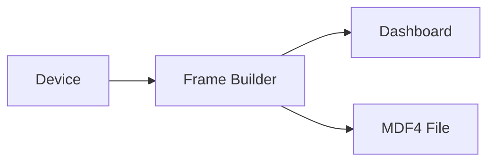

# MDF4 export and playback (Pro)

Serial Studio Pro can export incoming telemetry to MDF4 files during a live session and replay saved MDF4 files through the same data pipeline. MDF4 is an ASAM-standard binary format for measurement data, widely used in automotive and industrial testing alongside CAN, LIN, FlexRay, and analog channels. This page covers what MDF4 is, when to pick it over CSV, and how export and playback work in Serial Studio.

For text-based logging and the broader "what file format should I pick?" comparison, see [CSV Export & Playback](CSV-Export-Playback.md). For project-scoped, queryable session storage with replay metadata and tagging, see [Session Database](Session-Database.md).

## What is MDF4?

MDF stands for **Measurement Data Format**. The current revision is MDF4 (also written MF4 or `.mf4`), standardised by [ASAM](https://www.asam.net/) (the Association for Standardisation of Automation and Measuring Systems). It was designed for the automotive ECU-test workflow, where a single recording can carry hundreds of channels at very different sample rates (a CAN bus running at 1 kHz, an analog sensor at 10 kHz, GPS at 1 Hz), all timestamped against a common clock.

Compared to CSV, MDF4 differs in three ways that matter day to day:

- **Binary.** Fixed-width binary records are typically several times smaller than the equivalent CSV text for the same recording. Disk and network transfer costs drop accordingly. (Serial Studio writes uncompressed MDF4; the format also supports block compression in other writers.)
- **Per-channel sample rates.** Each "channel group" carries its own time base. A 1 Hz GPS channel and a 10 kHz vibration channel coexist in the same file without padding, and the readers respect each channel's native rate.
- **Rich metadata.** Channel name, units, conversion formulas (linear, table, rational), comments, and source information travel with the data. A reader knows what `EngineRPM` means in physical units, not just as a column index.

The trade-off is ecosystem: CSV opens in anything. MDF4 needs a tool that understands the format, usually Vector CANape, NI DIAdem, MATLAB Vehicle Network Toolbox, or the open-source [`asammdf`](https://asammdf.readthedocs.io/) Python library.



> Like CSV, MDF4 export runs on a background thread and writes in batches. The dashboard never stalls.

## CSV or MDF4?

| Aspect          | CSV                                  | MDF4 (Pro)                               |
|-----------------|--------------------------------------|------------------------------------------|
| File size       | Larger (text-based)                  | Smaller (fixed-width binary)             |
| Write speed     | Fine for most rates                  | Better for high-frequency data           |
| Compatibility   | Universal (Excel, Python, MATLAB, R) | Specialized (CANape, DIAdem, asammdf)    |
| Metadata        | Column headers only                  | Rich: channel names, units, conversions  |
| Sample rates    | One row per frame, all columns       | Per-channel time base, no padding        |
| Best for        | General analysis, sharing            | Automotive, industrial, high-rate logging|

Pick CSV for ad-hoc analysis, sharing with colleagues who don't have MDF4 tooling, or when you want to open the file in a spreadsheet without thinking about it. Pick MDF4 for long recordings at high data rates, automotive workflows that already use the format, or when channel metadata (units, conversions) matters at analysis time.

## MDF4 export

### Turning export on

MDF4 export is toggled in the Setup panel of the main window. Turn on the **MDF4 Recording** switch before or during a live connection. Once it's on, Serial Studio writes every incoming frame to an MDF4 file on a background thread.

### File location

Exported MDF4 files land under your workspace directory (Documents by default) in a per-project folder, with the file named after the session start time:

```
Serial Studio/MDF4/<Project Name>/<yyyy-MM-dd_HH-mm-ss>.mf4
```

For example, a session started at 3:30:05 PM on March 17, 2026, for a project named "Vehicle Test" would produce:

```
Serial Studio/MDF4/Vehicle Test/2026-03-17_15-30-05.mf4
```

### Channels and metadata

Each dataset becomes one MDF4 channel, and each project group becomes one MDF4 channel group. The exporter writes:

- **Channel group name** as the group's title, or `SourceName / GroupName` for multi-source projects.
- **Channel name** as the dataset's title, with a companion `<title> (raw)` channel carrying the pre-transform value.
- **Physical unit** from the dataset's `units` field.
- **Time channel** ("Time", in seconds): a per-group master channel storing wall-clock seconds, recorded at nanosecond resolution and derived from each frame's source timestamp.
- **Per-source channel groups** so multi-source projects keep each device's channels grouped together.

### File lifecycle

- The file is created on the first frame received after export is turned on.
- The file auto-closes when the device disconnects or when export is turned off.
- If you disconnect and reconnect during the same session, a new file is created with a new timestamp.

### Automation

The [API](API-Reference.md) exposes `mdf4Export.getStatus`, `mdf4Export.setEnabled`, and `mdf4Export.close` for export, plus the `mdf4Player.*` family for playback. The `--mdf-export` flag in the [Command-Line Interface](Command-Line-Interface.md) turns export on at startup.

### Background writing

MDF4 export runs on its own worker thread and flushes to disk in batches. On modern desktop hardware, sustained high frame rates are routine. Each exported frame keeps the source-derived timestamp it was parsed with; the export path never re-stamps the data.

## MDF4 playback

### Opening an MDF4 file

To replay a recorded MDF4 file:

1. Click **Open MDF4** in the toolbar.
2. Pick the `.mf4` file in the file dialog.
3. The MDF4 Player dialog appears.

### How playback works

During playback, the MDF4 Player feeds each frame through the same data pipeline as a live connection: Frame Builder, then Dashboard, widgets, MQTT, and API. The dashboard renders exactly as it would with a live device. File export (CSV and MDF4) is suppressed while any player is open, so replaying a file does not re-record it. The player respects the original timing between frames so playback speed matches the original recording rate.

### Player controls

| Control          | Action                           | Shortcut       |
|------------------|----------------------------------|----------------|
| Play / Pause     | Start or pause playback          | Space          |
| Previous frame   | Step back one frame              | Left Arrow     |
| Next frame       | Step forward one frame           | Right Arrow    |
| Progress slider  | Seek to any position in the file | Drag or click  |

The current timestamp shows above the slider as `HH:MM:SS.mmm`.

### Multi-channel files

Files exported by Serial Studio replay cleanly because the channel group structure matches the project that produced them. For files captured by other tools (CANape, vector loggers, custom acquisition systems), the player reads each channel group's data channels in file order and maps them positionally onto the currently loaded project's datasets, so the active project must define datasets in the same order as the file's channels.

## Analyzing exported data

MDF4 readers worth knowing:

- **Vector CANape.** The reference automotive analysis tool. Fully featured, commercial.
- **NI DIAdem.** Industrial data management and analysis.
- **MATLAB Vehicle Network Toolbox.** Native MDF4 support inside MATLAB.
- **Python `asammdf`.** Open-source library, widely used for batch processing and conversion to other formats: `from asammdf import MDF; mdf = MDF('file.mf4')`.

For one-off conversions, `asammdf` exports MDF4 to CSV, Parquet, HDF5, MATLAB `.mat`, and a few other formats. This is useful when an analysis tool downstream doesn't speak MDF4 directly.

## Common pitfalls

- **No frames written.** Export needs an active connection. The file is created on the first received frame, not on the toggle. If the device isn't sending, the file won't appear.
- **File size grows fast on high-rate sources.** An audio source at 48 kHz or a full CAN bus will produce gigabytes per hour. Monitor disk space and rotate sessions if you're recording continuously.
- **MDF4 reader can't open the file.** Some older readers (pre-2015) only support MDF3. Confirm the reader supports the MDF4 (`.mf4`) format. `asammdf` handles both.
- **Channel names look mangled.** MDF4 limits channel names to ASCII in some reader implementations. Non-ASCII characters in your dataset titles may render as `?` in third-party tools. Stick to ASCII for portability.
- **Timestamps drift compared to CSV.** They shouldn't, since both formats record the same source-derived timestamps. If they disagree, the issue is almost always in how the reader interprets the time channel's master/slave configuration. See [Threading and Timing Guarantees](Threading-and-Timing.md) for what the source timestamp represents.

## Further reading

- [ASAM MDF Standard (official site)](https://www.asam.net/standards/detail/mdf/)
- [MDF (Measurement Data Format) on Wikipedia](https://en.wikipedia.org/wiki/Measurement_Data_Format)
- [asammdf Python library documentation](https://asammdf.readthedocs.io/)
- [Introduction to MDF4 (CSS Electronics)](https://www.csselectronics.com/pages/mdf4-measurement-data-format)
- [Vector: MDF format overview](https://www.vector.com/int/en/know-how/protocols/mdf-measurement-data-format/)
- [MATLAB: Read MDF-Files](https://www.mathworks.com/help/vnt/mdf-files.html)

## See also

- [CSV Export & Playback](CSV-Export-Playback.md): text-based logging and replay, when MDF4 tooling is overkill.
- [Session Database](Session-Database.md): SQLite-backed project archive with built-in replay.
- [Session Reports](Session-Reports.md): rendered HTML/PDF summaries of recorded sessions.
- [Drivers: CAN Bus](Drivers-CAN-Bus.md): the canonical source for MDF4-style automotive recordings.
- [Threading and Timing Guarantees](Threading-and-Timing.md): what timestamps in exported MDF4 files mean.
- [Pro vs Free Features](Pro-vs-Free.md): MDF4 export and playback are Pro features.
