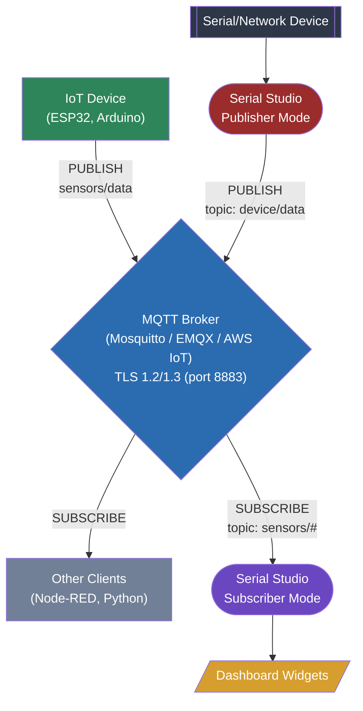

# MQTT Integration

MQTT (Message Queuing Telemetry Transport) is a lightweight publish/subscribe messaging protocol designed for constrained devices and unreliable networks. Serial Studio Pro integrates an MQTT client that can subscribe to broker topics to receive telemetry or publish incoming frame data to a broker for consumption by other applications. This is a Pro feature.

## MQTT Architecture

The following diagram shows how Serial Studio integrates with an MQTT broker in both subscriber and publisher modes.

---

## How MQTT Works

MQTT communication revolves around three concepts:

- **Broker**: A server that receives messages from publishers and routes them to subscribers. Examples: Mosquitto, EMQX, HiveMQ, AWS IoT Core.
- **Topic**: A hierarchical string (e.g., `sensors/room1/temperature`) that organizes messages. Publishers send to a topic; subscribers filter by topic.
- **Client**: Any application that connects to the broker. Serial Studio acts as a client in either publisher or subscriber mode.

**Typical flow:**

1. A device (e.g., ESP32) publishes sensor readings to `mydevice/sensors` on the broker.
2. Serial Studio subscribes to `mydevice/sensors`.
3. The broker delivers each message to Serial Studio, which processes it through the standard frame pipeline (Frame Builder, Dashboard, exports).

---

## Setup

### Opening the MQTT Dialog

Click the **MQTT** button in the toolbar. The MQTT Configuration Dialog opens with all connection and protocol settings.

### Broker Connection

| Setting | Description | Default |
|---------|-------------|---------|
| Hostname | Broker address (IP or hostname) | `127.0.0.1` |
| Port | Broker port | `1883` |
| Username | Authentication username (optional) | Empty |
| Password | Authentication password (optional) | Empty |
| Client ID | Unique identifier for this client | Auto-generated (16 characters) |
| Clean Session | Discard previous session state on connect | Enabled |

### MQTT Version

Select the protocol version from the dropdown:

- **MQTT 3.1** — Legacy. Widest broker compatibility.
- **MQTT 3.1.1** — Recommended for most brokers. Clearer specification than 3.1.
- **MQTT 5.0** — Latest. Adds shared subscriptions, message expiry, reason codes, and extended authentication.

### Mode Selection

Serial Studio operates in one of two modes:

- **Subscriber**: Serial Studio subscribes to a topic filter and processes incoming messages as raw frames through the data pipeline. This is the primary mode for receiving telemetry.
- **Publisher**: Serial Studio publishes outgoing frame data (the payload between start and end delimiters) to a configured topic on the broker. Use this to forward data from a connected serial/network device to MQTT.

### Topic Configuration

Enter the topic in the **Topic Filter** field.

**Subscriber examples:**

- `sensors/temperature` — Receive messages on this exact topic.
- `sensors/+/temperature` — Single-level wildcard. Matches `sensors/room1/temperature`, `sensors/room2/temperature`, etc.
- `sensors/#` — Multi-level wildcard. Matches everything under `sensors/`.

**Publisher examples:**

- `mydevice/data` — All frames are published to this single topic.

### Connecting

After configuring the settings, click **Connect**. The button label changes to indicate the connection state. To disconnect, click the button again (or use `toggleConnection`).

---

## Subscriber Mode

In subscriber mode, Serial Studio subscribes to the configured topic filter as soon as the connection is established. Each message received from the broker is treated as a raw frame — the same binary or text payload your device would send over serial or network.

**Data format expectations:**

- The message payload should contain the frame data **without** start/end delimiters. Serial Studio wraps it internally.
- For Quick Plot mode: comma-separated numeric values (e.g., `23.5,48.2,1013.25`).
- For Project File mode: data matching your project's frame parser expectations.
- For Device Sends JSON mode: a JSON object matching Serial Studio's JSON schema.

**Example:** If your ESP32 publishes `23.5,48.2,1013.25` to `weather/data`, and Serial Studio subscribes to `weather/data` in Quick Plot mode, the dashboard will display three datasets.

---

## Publisher Mode

In publisher mode, Serial Studio publishes every frame received from the currently connected data source (serial port, network socket, BLE, etc.) to the configured topic. The published payload is the raw frame content between the start and end delimiters.

**Example:** If a serial device sends `/*1023,512,850*/` and the publish topic is `mydevice/sensors`, the broker receives `1023,512,850` on that topic.

This mode is useful for bridging a local serial device to a remote MQTT infrastructure without modifying device firmware.

---

## TLS/SSL Configuration

For encrypted connections (strongly recommended for production and any broker exposed to the internet):

| Setting | Description |
|---------|-------------|
| SSL Enabled | Master toggle for TLS encryption |
| SSL Protocol | TLS version: TLS 1.0, 1.1, 1.2, 1.3, or auto-negotiation |
| Peer Verify Mode | `None` (no verification), `Query` (query without failing), `Verify` (require valid certificate), `Auto` (platform default) |
| Peer Verify Depth | Maximum certificate chain depth to verify |
| CA Certificates | Load additional CA certificates from a PEM file or directory |

**Common TLS configuration:**

- Port: `8883` (standard MQTT-over-TLS port).
- Peer Verify Mode: `Verify` for production, `None` for testing with self-signed certificates.
- CA Certificates: Load the broker's CA certificate if it is not in the system trust store.

To load certificates, click the certificate button in the SSL section and select the PEM file(s) or directory containing your CA chain.

---

## Will Message (Last Will and Testament)

The MQTT will message is a message the broker stores and publishes on behalf of the client if the client disconnects unexpectedly (network failure, crash, etc.). It notifies other subscribers that the client is offline.

| Setting | Description |
|---------|-------------|
| Will Topic | Topic the will message is published to |
| Will Message | Payload of the will message |
| Will QoS | Quality of Service: 0 (at most once), 1 (at least once), 2 (exactly once) |
| Will Retain | If enabled, the broker retains the will message for future subscribers |

**Example:** Set Will Topic to `mydevice/status`, Will Message to `offline`, and Will Retain to enabled. When Serial Studio disconnects unexpectedly, any subscriber to `mydevice/status` receives `offline`.

---

## Keep Alive

The keep-alive mechanism sends periodic PING packets to the broker to maintain the connection and detect network failures.

| Setting | Description |
|---------|-------------|
| Keep Alive | Interval in seconds between PING packets |
| Auto Keep Alive | Let Serial Studio manage the keep-alive interval automatically |

If the broker does not receive a PING within 1.5 times the keep-alive interval, it considers the client disconnected and publishes the will message (if configured).

---

## Client ID

Every MQTT client on a broker must have a unique client ID. Serial Studio auto-generates a 16-character random string on first launch. Click the **Regenerate** button to create a new ID at any time.

If two clients connect to the same broker with the same client ID, the broker disconnects the older connection. Always use unique IDs when running multiple Serial Studio instances.

---

## Quality of Service Levels

MQTT defines three QoS levels for message delivery:

| QoS | Name | Guarantee | Use Case |
|-----|------|-----------|----------|
| 0 | At most once | Fire-and-forget. No acknowledgment. | High-frequency sensor data where occasional loss is acceptable. |
| 1 | At least once | Broker acknowledges receipt. Message may be delivered more than once. | Most telemetry applications. |
| 2 | Exactly once | Four-step handshake ensures single delivery. Highest overhead. | Critical commands or configuration updates. |

The QoS setting in Serial Studio applies to the will message. The subscription QoS is determined by the broker's configuration and the publishing client's QoS.

---

## Troubleshooting

### Connection Issues

- Verify the broker address and port. Test connectivity with `ping <broker-address>` or a standalone MQTT client (`mosquitto_sub -h broker -t '#'`).
- Check username and password if the broker requires authentication.
- Ensure the firewall allows outgoing connections on the broker port (1883 or 8883).
- For TLS connections, verify the CA certificate matches the broker's certificate chain.

### No Data Received (Subscriber)

- Topic names are case-sensitive. `Sensors/Temperature` is not the same as `sensors/temperature`.
- Use `#` as the topic filter temporarily to receive all messages and confirm data is flowing.
- Verify that the publishing device is connected and actively sending to the expected topic. Use MQTT Explorer or `mosquitto_sub` to monitor independently.
- Check that the message payload format matches Serial Studio's expectations for the current operation mode.

### Connection Drops

- Check network stability between Serial Studio and the broker.
- Increase the keep-alive interval if the network has high latency.
- Verify the broker is not hitting connection limits (max clients, memory).
- If using MQTT 5.0, check the disconnect reason code in the console output.

### Data Format Mismatch

- In subscriber mode, the payload must be the raw frame data without delimiters.
- In Quick Plot mode, the payload should be comma-separated numeric values.
- In Project File mode, the payload must match the frame format expected by your project's parser.
- Use the Serial Studio console to inspect incoming payloads.

---

## Popular MQTT Brokers

**Public test brokers (for development and testing only):**

- `test.mosquitto.org` — Port 1883 (plaintext), 8883 (TLS), 8080 (WebSocket)
- `broker.hivemq.com` — Port 1883 (plaintext)

**Self-hosted:**

- [Eclipse Mosquitto](https://mosquitto.org/) — Lightweight, single-binary, easy to configure.
- [EMQX](https://www.emqx.io/) — Scalable, enterprise-grade, MQTT 5.0 support.
- [VerneMQ](https://vernemq.com/) — Distributed, fault-tolerant.

**Cloud services:**

- AWS IoT Core
- Azure IoT Hub
- Google Cloud IoT Core
- HiveMQ Cloud

---

## See Also

- [Communication Protocols](Communication-Protocols.md) — Protocol overview and comparison
- [Protocol Setup Guides](Protocol-Setup-Guides.md) — Step-by-step MQTT setup
- [Getting Started](Getting-Started.md) — First-time setup tutorial
- [Troubleshooting](Troubleshooting.md) — General troubleshooting guide
- [Pro vs Free Features](Pro-vs-Free.md) — MQTT is a Pro feature
