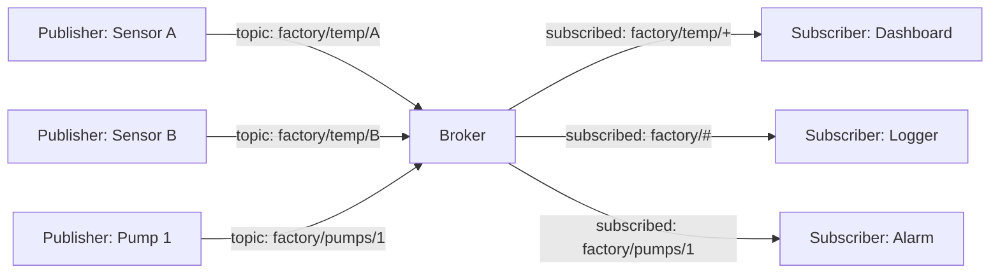
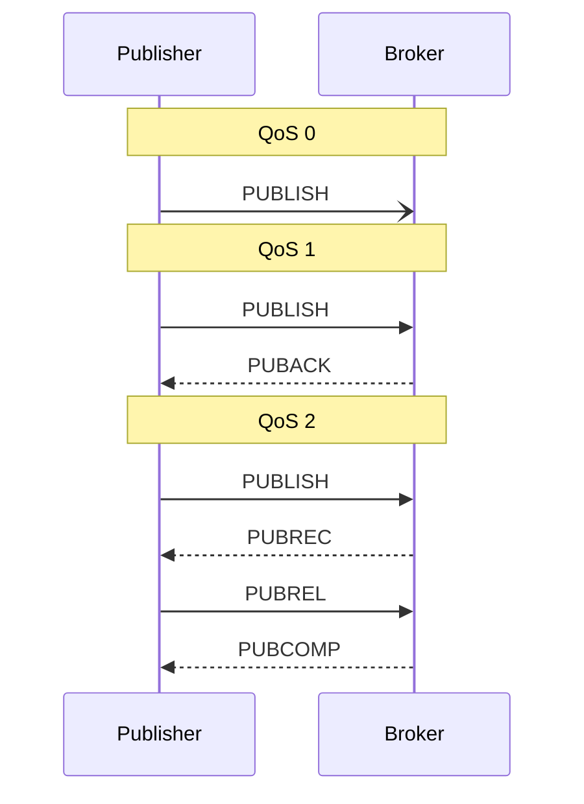

# MQTT Topics & Semantics

MQTT is the standard publish/subscribe protocol for IoT. It is the right transport when many devices share a network and publishers and subscribers should not have to know about each other directly. The header is small, it tolerates unreliable links, every constrained microcontroller has a client, and bridging it into a dashboard takes little work.

This page is the protocol vocabulary used by Serial Studio's two MQTT surfaces: the [subscriber driver](Drivers-MQTT.md) (broker → Serial Studio) and the [publisher](MQTT-Publisher.md) (Serial Studio → broker). Both reference the concepts defined here; this is the place to learn them once.

## What is MQTT?

MQTT originally stood for **MQ Telemetry Transport**, after IBM's MQ product line; the OASIS standard treats the name as no longer an acronym. The "Message Queuing Telemetry Transport" expansion often seen is a back-formation, and a misleading one: MQTT does not provide queuing in the traditional sense, though the "telemetry over unreliable links" part still describes it accurately. The protocol was designed in 1999 by IBM for monitoring oil pipelines over satellite links and standardised as an OASIS specification in 2014. The current version is MQTT 5.0 (2019); MQTT 3.1.1 is still extremely common in the field. Serial Studio supports 3.1, 3.1.1, and 5.0 on both of its MQTT surfaces and defaults to 5.0.

The core idea is decoupling. Publishers and subscribers do not connect to each other. They connect to a **broker**, and the broker handles routing.



A new publisher coming online does not announce itself to subscribers; it publishes to a topic, and any subscriber listening to that topic receives the message. A new subscriber does not announce itself to publishers; it subscribes to a topic pattern, and the broker routes new messages to it. Either side can be added or removed without coordination.

## Topics

Topics are hierarchical strings separated by `/`:

```
factory/floor1/zone3/temperature
home/livingroom/sensors/humidity
serial-studio/devices/esp32-001/data
```

The broker does not enforce a schema (topics are just strings), but conventions matter for subscribers. Common practice is to put the most general scope first and the most specific last.

Topic names are case-sensitive. `Sensors/Temperature` and `sensors/temperature` are two different topics; the broker will not route between them.

### Wildcards

Subscribers — not publishers — can use **wildcards** when registering a filter:

- `+` matches exactly one level. `factory/+/temperature` matches `factory/floor1/temperature` and `factory/floor2/temperature` but not `factory/floor1/zone3/temperature`.
- `#` matches all remaining levels. `factory/#` matches everything that starts with `factory/`. It must be the last character of the filter.

A common diagnostic trick is to temporarily subscribe to `#` (or `your/prefix/#`) and watch every message the broker routes. `mosquitto_sub -t '#' -v` does the same from a terminal.

## Recommended conventions for Serial Studio

Topics are conventions, not contract, so any structure that disambiguates publishers will work. The shape below scales as projects grow:

```
<project>/<device>/raw         # bytes off the wire, opaque to MQTT consumers
<project>/<device>/frame       # parsed-and-validated JSON frame
<project>/<device>/notify      # dashboard notifications, alarms
<project>/<device>/control     # commands sent back to the device
```

Putting the project at the top makes it easy to scope subscribers and ACLs per project; putting the device next lets a single subscriber follow one device with `myproject/esp32-001/#` or watch the entire fleet with `myproject/+/frame`. When a project has several MQTT subscribers, give each source a distinct topic filter — wildcards can multiplex publishers onto a single source, but Serial Studio can no longer tell them apart unless the publisher's identity is embedded in the payload.

## Quality of Service (QoS)

MQTT publishes can carry one of three QoS levels:

| QoS | Name             | Guarantees |
|-----|------------------|-----------|
| 0   | At most once     | Fire and forget. The message is sent, and it's gone. No retransmission, no ack. May be lost. |
| 1   | At least once    | The publisher resends until it gets a PUBACK from the broker. The subscriber may receive duplicates. |
| 2   | Exactly once     | Four-way handshake (PUBLISH → PUBREC → PUBREL → PUBCOMP). Guaranteed delivery, no duplicates. Slowest. |

For telemetry, QoS 0 is usually adequate: if a temperature reading is lost, the next one is already on its way. Choose QoS 1 when loss is unacceptable but duplicates are (the application deduplicates). QoS 2 is for "must arrive exactly once" cases such as billing events and is rarely worth its cost for streaming data.

Serial Studio's [subscriber driver](Drivers-MQTT.md) subscribes at QoS 0, and the [Publisher](MQTT-Publisher.md)'s built-in payload modes publish at QoS 0. Only the `mqttPublish()` script hook can request QoS 1 or 2.



## Retained messages

A publisher can mark a message as **retained**. The broker remembers the last retained message on each topic and delivers it immediately to any new subscriber. This is the way to signal "current state" rather than "events":

- `home/heating/setpoint` retained: the current setpoint, available to anyone who subscribes.
- `home/heating/events/setpoint-changed` non-retained: the change events, only seen by clients listening at the time.

Retained messages do not expire unless MQTT 5 message expiry is set. Publishing an empty payload to a topic with the retain flag clears the retained message.

Serial Studio's Publisher uses a retained message for the CSV header on `<TopicBase>/header`, so a subscriber that joins late still receives the column schema (see [MQTT Publisher](MQTT-Publisher.md)).

A retained message at a level *above* the live stream can mask new publishes for a fresh subscriber. If a dashboard connects and seems to receive stale data, subscribe to `your/topic/#` to see what the broker delivered on connect.

## Last Will and Testament

When a client connects, it can register a **Last Will** message: a topic, payload, and QoS that the broker publishes if the client disconnects ungracefully. This is the standard way to detect dead clients. Each client publishes a retained "I'm here" message on connect and a Last Will of "I'm gone" on the same topic; subscribers always know which clients are alive.

Serial Studio registers no Last Will of its own; the pattern matters here because devices publishing into a dashboard commonly use it for presence tracking.

## Sessions and clean session

MQTT 3.x assumes persistent sessions by default: the broker remembers a client's subscriptions and queued messages across disconnects, keyed by the client ID. When the client reconnects, it resumes where it left off.

For interactive clients (a dashboard connecting from a laptop) persistent sessions usually cause more confusion than they solve. **Clean session = on**, Serial Studio's default on both the subscriber driver and the Publisher, is right for most uses; the broker forgets the client between connections. Persistent sessions are useful when an offline subscriber must catch up on every message it missed; in that case turn clean session off, set a stable client ID, and make sure the publisher uses QoS ≥ 1 (QoS 0 messages are not queued for offline clients).

## Keep alive

The keep-alive interval, negotiated at CONNECT time, is the maximum time the broker waits between packets from the client before considering it dead. The client sends a PINGREQ when idle; the broker replies with PINGRESP and the timer resets. If the broker stops receiving anything within roughly 1.5 × keep-alive, it assumes the connection is gone, drops it, and publishes the Last Will message.

Pick a keep-alive that is comfortably shorter than the shortest network timeout in the path (NAT entries, corporate firewalls, mobile-network idle disconnects). Sixty seconds, Serial Studio's default, is reasonable; on flaky cellular links, drop to 30 or 15. Keep alive at `0` disables the mechanism entirely — the broker will only notice a dead client when TCP itself does, which can take minutes.

## Client IDs

Every MQTT client on a broker needs a unique client ID. Serial Studio generates a random 16-character ID for the subscriber driver (kept until you change it) and for the Publisher (regenerated on every project load unless **Custom Client ID** is on). **Regenerate** in the subscriber's Setup pane picks a new one; do this whenever you suspect a collision.

If two clients connect to the same broker with the same client ID, the broker disconnects the older one. Two Serial Studio instances pointed at the same broker need distinct client IDs. So do two MQTT sources within the same project.

## Popular brokers

**Public test brokers (development and testing only):**

- `test.mosquitto.org`: port 1883 (plaintext), 8883 (TLS), 8080 (WebSocket).
- `broker.hivemq.com`: port 1883 (plaintext).

Do not use public brokers for anything that should stay private. They are public.

**Self-hosted:**

- [Eclipse Mosquitto](https://mosquitto.org/): lightweight, single binary, easy to configure.
- [EMQX](https://www.emqx.io/): scalable, enterprise-grade, MQTT 5.0.
- [VerneMQ](https://vernemq.com/): distributed, fault-tolerant.

**Managed cloud:**

- AWS IoT Core.
- Azure IoT Hub.
- HiveMQ Cloud.
- EMQX Cloud.

## Further reading

- [HiveMQ: MQTT 2026 Guide](https://www.hivemq.com/mqtt/)
- [HiveMQ Essentials, Part 2: Publish/Subscribe Architecture](https://www.hivemq.com/blog/mqtt-essentials-part2-publish-subscribe/)
- [HiveMQ Essentials, Part 5: Topics, Wildcards, and Best Practices](https://www.hivemq.com/blog/mqtt-essentials-part-5-mqtt-topics-best-practices/)
- [HiveMQ Essentials, Part 6: Quality of Service Levels](https://www.hivemq.com/blog/mqtt-essentials-part-6-mqtt-quality-of-service-levels/)
- [HiveMQ Essentials, Part 8: Retained Messages](https://www.hivemq.com/blog/mqtt-essentials-part-8-retained-messages/)
- [mqtt.org, the official MQTT site](https://mqtt.org/)

## See also

- [MQTT Driver (Subscriber)](Drivers-MQTT.md): how the protocol vocabulary maps onto a per-source driver.
- [MQTT Publisher](MQTT-Publisher.md): the project-level outbound side and its payload modes.
- [Protocol Setup Guides](Protocol-Setup-Guides.md): step-by-step MQTT setup in the project editor.
- [Communication Protocols](Communication-Protocols.md): overview of all supported transports.
- [Drivers: Network](Drivers-Network.md): raw TCP / UDP, the transport MQTT runs on.
- [Pro vs Free Features](Pro-vs-Free.md): MQTT is a Pro feature.
