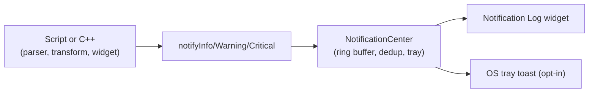

# Notifications

Dashboard-level notification system for publishing **Info**, **Warning**, and **Critical** events from frame parsers, dataset transforms, output widget scripts, C++ code, and the MCP API. Every event shows up in a scrollable log on the dashboard and can optionally surface as a native OS desktop notification.

Notifications are a **Pro feature**. The `notify*` functions are exposed to every scripting engine Serial Studio runs, but they raise a clear `notify() requires a Pro license` error when called without a valid Pro license. Level constants (`Info`, `Warning`, `Critical`) stay available at every tier so Pro-authored projects parse-load cleanly under GPL builds.

## Overview

Notifications are a single shared bus. Any caller can post an event; the dashboard's Notification Log widget subscribes to the bus and renders events in time order, oldest at the top. Events carry four fields:

| Field      | Type   | Purpose |
|------------|--------|---------|
| `level`    | int    | `0` = Info, `1` = Warning, `2` = Critical. |
| `channel`  | string | Free-form label (for example `"Power Events"`, `"Engine"`). Spaces allowed. |
| `title`    | string | Short event headline shown in bold in the log. |
| `subtitle` | string | Optional detail line shown under the title with word wrap. |

Channels are not declared up front. They come into existence as soon as something posts to them. The Notification Log has a **Filter by channel** box that narrows the view to a single channel when needed.



> **Legend:** 1024-event ring buffer &bull; 100 ms dedup window per `(level, channel, title, subtitle)` tuple &bull; Main-thread only &bull; Cleared on disconnect

---

## Where notifications come from

### Dataset transforms

Every dataset transform (Lua or JavaScript) has the `notify*` functions injected into its engine at compile time. They behave identically to any other transform-scope function.

### Frame parsers

Frame parser scripts (`parse(frame)`) have the same five functions available. Use them to flag protocol errors, malformed frames, out-of-range fields, or heartbeat timeouts directly from the parser.

### Output widget scripts

The `transmit(value)` function in output widgets can post notifications too. Useful for logging commands sent to the device, flagging clamped inputs, or warning when a setpoint exceeds a safe range.

### C++ and the MCP API

Notifications can also be posted from the command-line MCP API (`notifications.postInfo`, `notifications.postWarning`, etc.). That makes it easy to tie Serial Studio into larger test harnesses: your Python test driver posts an event, it shows up on the operator's dashboard immediately.

---

## The function family

Five functions are available everywhere:

| Function                                               | Level         | Purpose                                |
|--------------------------------------------------------|---------------|----------------------------------------|
| `notify(level, channel, title, subtitle)`              | caller chosen | Generic form. `level` is `0`, `1`, or `2`, or use the `Info`/`Warning`/`Critical` constants. |
| `notifyInfo(channel, title, subtitle)`                 | `Info`        | Informational event. Does not increment the unread counter. |
| `notifyWarning(channel, title, subtitle)`              | `Warning`     | Something worth attention but not critical. Increments the unread badge. |
| `notifyCritical(channel, title, subtitle)`             | `Critical`    | Alarm-class event. Increments the unread badge. |
| `notifyClear(channel, title, subtitle)`                | `Info`        | Emits a companion `Resolved: <title>` Info event. The original remains in history, so the resolution is visible in the timeline. |

### Argument overloads

Every `notifyInfo` / `notifyWarning` / `notifyCritical` / `notifyClear` accepts one, two, or three arguments. When you don't pass a channel, the event lands on the default `"Dashboard"` channel:

| Arguments                              | Behaviour                                                                  |
|----------------------------------------|----------------------------------------------------------------------------|
| `notifyInfo("Ready")`                  | Channel = `"Dashboard"`, title = `"Ready"`, subtitle empty.                |
| `notifyInfo("Ready", "System armed")`  | Channel = `"Dashboard"`, title = `"Ready"`, subtitle = `"System armed"`.   |
| `notifyInfo("Engine", "Ready", "")`    | Channel = `"Engine"`, title = `"Ready"`, subtitle = `""`.                  |

The generic `notify()` form always starts with the level, then follows the same 1/2/3-argument overload for the remaining fields.

Level constants are available as globals:

```
Info     = 0
Warning  = 1
Critical = 2
```

So `notify(Critical, "Engine", "EGT exceeded", "1052 C")` is equivalent to `notifyCritical("Engine", "EGT exceeded", "1052 C")`.

### Deduplication

The `NotificationCenter` drops events whose `(level, channel, title, subtitle)` tuple matches the previous event within 100 ms. That keeps transforms running at 10+ kHz from flooding the log with identical rows. A rising-value alarm whose subtitle includes the measured value (for example `"1049 C"`, then `"1050 C"`) is never collapsed, because the subtitle is part of the dedup key.

---

## Examples

The examples below use dataset transforms, but the function signatures are identical in frame parsers and output widgets.

### Example 1: simple informational event

A magnetometer reports headings in radians. Log the first converted value so you can confirm the transform loaded:

**Lua:**

```lua
local announced = false

function transform(value)
  if not announced then
    notifyInfo("Transform loaded")
    announced = true
  end

  return value * 180 / math.pi
end
```

**JavaScript:**

```javascript
var announced = false;

function transform(value) {
  if (!announced) {
    notifyInfo("Transform loaded");
    announced = true;
  }

  return value * 180 / Math.PI;
}
```

### Example 2: threshold warning with subtitle

A battery monitor drops below 11 V. Warn on the "Power" channel with the measured value in the subtitle:

**Lua:**

```lua
function transform(value)
  if value < 11.0 then
    notifyWarning("Power", "Battery low",
                  string.format("%.2f V", value))
  end

  return value
end
```

**JavaScript:**

```javascript
function transform(value) {
  if (value < 11.0) {
    notifyWarning("Power", "Battery low",
                  value.toFixed(2) + " V");
  }

  return value;
}
```

### Example 3: critical alarm with latch and resolve

Don't re-trigger a critical alarm on every frame. Latch the state, post once on entry, then post a `Resolved` Info event when the condition clears:

**Lua:**

```lua
local latched = false

function transform(value)
  if value > 900 and not latched then
    notifyCritical("Engine", "EGT critical",
                   string.format("%.1f C", value))
    latched = true
  elseif value < 870 and latched then
    notifyClear("Engine", "EGT critical",
                string.format("Back to %.1f C", value))
    latched = false
  end

  return value
end
```

**JavaScript:**

```javascript
var latched = false;

function transform(value) {
  if (value > 900 && !latched) {
    notifyCritical("Engine", "EGT critical",
                   value.toFixed(1) + " C");
    latched = true;
  } else if (value < 870 && latched) {
    notifyClear("Engine", "EGT critical",
                "Back to " + value.toFixed(1) + " C");
    latched = false;
  }

  return value;
}
```

### Example 4: generic notify() with a chosen level

Pick the level from a table or a computed expression:

**Lua:**

```lua
local function levelFor(rpm)
  if rpm > 9500 then return Critical end
  if rpm > 8500 then return Warning end
  return Info
end

function transform(value)
  notify(levelFor(value), "RPM", "Engine speed",
         string.format("%.0f rpm", value))
  return value
end
```

**JavaScript:**

```javascript
function levelFor(rpm) {
  if (rpm > 9500) return Critical;
  if (rpm > 8500) return Warning;
  return Info;
}

function transform(value) {
  notify(levelFor(value), "RPM", "Engine speed",
         value.toFixed(0) + " rpm");
  return value;
}
```

### Example 5: single-argument shorthand from a frame parser

A parser detects a bad checksum. Post a one-liner without specifying a channel; the event lands on the default `"Dashboard"` channel:

**Lua:**

```lua
function parse(frame)
  local parts = {}
  for token in string.gmatch(frame, "([^,]+)") do
    table.insert(parts, token)
  end

  local crc = tonumber(parts[#parts])
  if crc ~= computeCrc(parts) then
    notifyWarning("Frame dropped: bad CRC")
    return {}
  end

  return parts
end
```

**JavaScript:**

```javascript
function parse(frame) {
  var parts = frame.split(",");
  var crc = parseInt(parts[parts.length - 1], 10);
  if (crc !== computeCrc(parts)) {
    notifyWarning("Frame dropped: bad CRC");
    return [];
  }

  return parts;
}
```

### Example 6: output widget logging a command

An output widget formats a setpoint command. Log the outgoing value so the operator can see what was sent:

```javascript
function transmit(value) {
  notifyInfo("Setpoint", "Sent",
             "Target = " + value.toFixed(1));
  return "SET " + value.toFixed(1) + "\r\n";
}
```

---

## The Notification Log widget

The Notification Log is a Pro-only dashboard widget that renders events from the shared bus. Enable it from the Start Menu (**Notifications** toggle) or from the taskbar's bell icon while the dashboard is visible.

| Behaviour                   | Description |
|-----------------------------|-------------|
| Layout                      | One row per event, icon + title + channel pill + timestamp, optional subtitle on a wrapped second line. |
| Auto-scroll                 | Follows the tail automatically when new events arrive, unless the user has scrolled up to inspect history. |
| Border blink                | The widget border pulses in the alarm color for 10 seconds after any Warning or Critical event. |
| Filter by channel           | Case-sensitive substring match on the channel name. Live; rows hide and re-show as you type. |
| Clear all                   | Wipes the in-memory history. The ring buffer and the dedup window reset to empty. |
| Empty state                 | When the log is empty, the widget shows a large icon and a hint line reminding users which functions post events. |

The widget is global: only one exists per dashboard, and it isn't tied to any dataset group. Its position and size are saved with the project layout like any other dashboard widget.

### History is cleared between sessions

The log is wiped automatically on every dashboard reset (disconnect, project reload, playback stop). This keeps the dashboard honest: events from the previous session don't bleed into the new one.

---

## OS desktop notifications

For Warning and Critical events, Serial Studio can also raise a native desktop notification via the system tray. This is opt-in and off by default. Enable it under **Preferences → Notifications → System Notifications**.

When enabled, Warning and Critical events fire a tray toast even when Serial Studio isn't the foreground window. The toast shows the channel and title on one line and the subtitle on a second line. `Info` events never produce OS notifications; they're logged in the widget only.

Requires a system tray to be available. On macOS the tray is always present; on Linux, the result depends on the desktop environment (GNOME, KDE, Wayland compositors all behave slightly differently).

---

## Routing Qt log messages

Serial Studio already routes every `qDebug()`, `qWarning()`, `qCritical()`, and `qFatal()` call to the in-app Console widget. The NotificationCenter can additionally route Qt log messages:

| Qt level               | Where it goes by default                             | Toggle |
|------------------------|------------------------------------------------------|--------|
| `qCriticalMsg` / `qFatalMsg` | Console **and** NotificationCenter (`System` channel) | Always on. |
| `qWarningMsg`          | Console only                                         | Opt-in under **Preferences → Notifications → Route Warnings to Notifications**. |
| `qInfoMsg` / `qDebugMsg` | Console only                                       | Not routed to notifications. |

Warnings are off by default because Qt and QML emit them frequently during normal operation (setGeometry hints, deprecation notices, platform quirks). Routing them unfiltered would drown out real alarms. Critical messages are rare and always meaningful, so they route unconditionally.

---

## Rules and limitations

1. Notifications are Pro-only at runtime. `notify*` calls under GPL raise a clear `"notify() requires a Pro license. See https://serial-studio.com/pricing"` error from the script engine.
2. Level constants (`Info`, `Warning`, `Critical`) are always defined so Pro-authored scripts parse-load cleanly on GPL builds. Only the call itself fails.
3. The ring buffer holds the most recent 1024 events. Older events are dropped when new events arrive.
4. De-duplication collapses identical `(level, channel, title, subtitle)` tuples posted within 100 ms. Include the live value in the subtitle if you want rising-value events to stay visible.
5. `notifyInfo` does not increment the unread badge; only Warning and Critical do.
6. Channel names are case-sensitive. `"Power"` and `"power"` are different channels.
7. History is wiped on every dashboard reset (disconnect, project reload, playback open/close). Intentional: new sessions start with a clean log.
8. Posting from a worker thread is not allowed. Script engines run on the main thread already, so this only matters for C++ callers: route via `QMetaObject::invokeMethod(&nc, Qt::QueuedConnection, ...)` when posting from a worker.
9. Projects that use `notify*` in transforms are flagged as commercial by `SerialStudio::commercialCfg`, so the Pro-required overlay appears on the dashboard when loaded under GPL.

---

## See also

- [Dataset Value Transforms](Dataset-Transforms.md): where `notify*` is most commonly used.
- [Frame Parser Scripting](JavaScript-API.md): the `parse(frame)` function has the same notification API.
- [Output Controls](Output-Controls.md): `transmit(value)` can also post notifications.
- [API Reference](API-Reference.md): `notifications.post`, `notifications.list`, and related commands for external drivers.
- [Pro vs Free Features](Pro-vs-Free.md): what's gated behind a Pro license.
