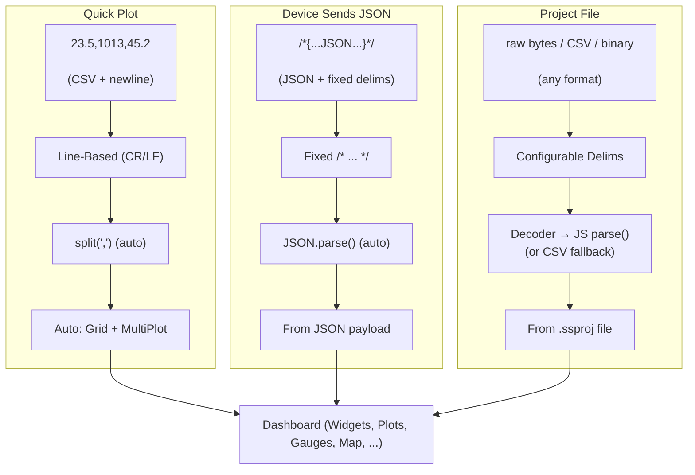

# Operation Modes

## Overview

Serial Studio supports three parsing modes that determine how incoming data is interpreted and displayed. The mode is selected in the Setup Panel on the right side of the main window. Each mode works with any data source — Serial (UART), Bluetooth LE, Network (TCP/UDP), and all Pro sources (Audio, Modbus, CAN Bus, USB, HID, Process).

The three modes, in order of increasing complexity, are:

1. **Quick Plot** — automatic CSV plotting with zero configuration.
2. **Device Sends JSON** — the device transmits a self-describing JSON frame that defines both data and dashboard layout.
3. **Project File** — a JSON project file on the host defines the dashboard, while the device sends only raw values.

The following diagram compares the data flow through each operation mode side by side.



| Feature | Quick Plot | Device Sends JSON | Project File |
|---------|:----------:|:-----------------:|:------------:|
| JS Parser | -- | -- | Yes |
| Custom Widgets | -- | Yes | Yes |
| Multi-Source | -- | -- | Yes (Pro) |
| Setup Effort | None | Firmware | Editor |

> **Note:** All modes work with any data source: Serial, TCP/UDP, BLE, and all Pro drivers.
>
> **Frame Detection options (Project File mode only):** End Only | Start+End | Start Only | No Delimiters.

---

## Quick Plot Mode

### Selection

Choose the "Quick Plot (Comma Separated Values)" radio button in the Setup Panel.

### How It Works

- **Frame detection:** line-based. Each line of text terminated by CR, LF, or CRLF is treated as one frame.
- **Data format:** comma-separated numeric values. Each value maps to one channel.
- **CSV delimiter:** comma only. Other delimiters are not supported in this mode.
- **Header detection:** if the first received row contains only non-numeric strings, those strings become channel labels for the dashboard.

When a connection is established, Serial Studio reads each line, splits it on commas, and creates a dashboard with:

- A **Data Grid** widget showing all current values.
- A **MultiPlot** widget overlaying all channels on a single time-series chart.
- Individual per-channel plots.

No project file is required. No JavaScript parsing is involved.

### Example Input

```
Temperature,Pressure,Humidity
23.5,1013.2,45.0
23.6,1013.1,45.1
23.7,1013.0,45.3
```

The first line sets channel labels. Subsequent lines are plotted in real time.

### Limitations

- Comma is the only supported delimiter.
- No custom widgets (gauges, bars, compass, GPS map, FFT, etc.).
- No alarm thresholds.
- No per-channel configuration (units, ranges, scaling).
- No JavaScript frame parsing.
- No multi-source support.

### When to Use

Quick Plot is the fastest way to visualize data. Use it when you want to verify that a device is transmitting correctly, prototype a new sensor, or demonstrate real-time plotting in an educational setting.

---

## Device Sends JSON Mode

### Selection

Choose the "No Parsing (Device Sends JSON Data)" radio button in the Setup Panel.

### How It Works

- **Frame detection:** fixed delimiters. Every frame must begin with `/*` and end with `*/`. These delimiters are hardcoded and cannot be changed.
- **Data format:** a complete JSON object enclosed between the delimiters. The JSON defines both the dashboard layout and the current data values.
- **Dashboard behavior:** Serial Studio rebuilds the dashboard dynamically whenever the JSON structure changes (new groups, different widgets, etc.). If only values change, the existing dashboard updates in place.

No project file is required. No JavaScript parsing is involved. The device firmware is entirely responsible for generating valid JSON.

### Transmission Format

```
/*{ ... JSON payload ... }*/
```

The device sends the opening `/*`, followed by a JSON object, followed by `*/`. Whitespace inside the delimiters is allowed.

### JSON Frame Structure

A complete frame contains a root object with three optional top-level keys:

| Key | Type | Required | Description |
|-----|------|----------|-------------|
| `title` | string | Yes | Dashboard title displayed at the top of the window. |
| `groups` | array | Yes | Array of group objects. Each group becomes a widget panel. |
| `actions` | array | No | Array of action objects. Each action becomes a button that transmits data back to the device. |

#### Group Object

Each group represents a panel on the dashboard containing one or more datasets.

| Key | Type | Default | Description |
|-----|------|---------|-------------|
| `title` | string | — | Display name of the group. |
| `widget` | string | `""` | Group widget type. See table below. |
| `datasets` | array | — | Array of dataset objects belonging to this group. |

**Group widget values:**

| Value | Dashboard Widget | Required Datasets |
|-------|-----------------|-------------------|
| `"datagrid"` | Data Grid | Any number of datasets. |
| `"multiplot"` | MultiPlot (overlaid time-series) | Two or more datasets with `graph: true`. |
| `"accelerometer"` | Accelerometer visualization | Three datasets (X, Y, Z). |
| `"gyro"` | Gyroscope visualization | Three datasets (X, Y, Z). |
| `"map"` | GPS Map | Two or three datasets (latitude, longitude, optional altitude). Uses `widget` values `"lat"`, `"lon"`, `"alt"` on datasets. |
| `"plot3d"` | 3D scatter/line plot | Three datasets (X, Y, Z). |
| `"image"` | Image viewer (Pro) | Image data embedded in the stream. |
| `""` (empty) | No group-level widget | Datasets rendered individually based on their own `widget` values. |

#### Dataset Object

Each dataset represents a single data channel within a group.

| Key | Type | Default | Description |
|-----|------|---------|-------------|
| `title` | string | — | Human-readable channel name. |
| `value` | string | — | Current value as a string (even for numbers). |
| `units` | string | `""` | Unit label (e.g., "degC", "%", "hPa"). |
| `index` | int | 0 | Position index within the frame (used for mapping). |
| `widget` | string | `""` | Dataset-level widget: `"bar"`, `"gauge"`, `"compass"`, or `""` for none. For special groups, use `"x"`, `"y"`, `"z"`, `"lat"`, `"lon"`, `"alt"`. |
| `graph` | bool | false | If true, this dataset is plotted as a time-series line. |
| `fft` | bool | false | Enable FFT analysis for this channel. |
| `fftSamples` | int | 256 | Number of samples per FFT window. |
| `fftSamplingRate` | int | 100 | Sampling rate in Hz for FFT frequency axis. |
| `fftMin` | double | 0 | Minimum display value for FFT plot. |
| `fftMax` | double | 0 | Maximum display value for FFT plot. |
| `led` | bool | false | Show an LED indicator for this channel. |
| `ledHigh` | double | 80 | Threshold above which the LED activates. |
| `alarmEnabled` | bool | false | Enable alarm monitoring. |
| `alarmLow` | double | 20 | Low alarm threshold. |
| `alarmHigh` | double | 80 | High alarm threshold. |
| `widgetMin` | double | 0 | Minimum value for bar/gauge/compass widgets. |
| `widgetMax` | double | 100 | Maximum value for bar/gauge/compass widgets. |
| `plotMin` | double | 0 | Fixed minimum for the plot Y-axis (0 = auto-scale). |
| `plotMax` | double | 0 | Fixed maximum for the plot Y-axis (0 = auto-scale). |

#### Action Object

Actions define buttons in the dashboard toolbar that send data back to the connected device.

| Key | Type | Default | Description |
|-----|------|---------|-------------|
| `title` | string | — | Button label. |
| `icon` | string | `"Play Property"` | Icon name for the button. |
| `txData` | string | — | Data string to transmit when the button is pressed. |
| `eol` | string | `""` | End-of-line sequence appended after `txData` (e.g., `"\r\n"`). |
| `binary` | bool | false | If true, `txData` is interpreted as binary hex data. |

### Full Example

```json
/*{
  "title": "Weather Station",
  "groups": [
    {
      "title": "Environment",
      "widget": "datagrid",
      "datasets": [
        {
          "title": "Temperature",
          "value": "23.5",
          "units": "degC",
          "widget": "gauge",
          "widgetMin": -20,
          "widgetMax": 60,
          "graph": true,
          "alarmEnabled": true,
          "alarmHigh": 50
        },
        {
          "title": "Humidity",
          "value": "45.2",
          "units": "%",
          "widget": "bar",
          "widgetMin": 0,
          "widgetMax": 100,
          "graph": true
        },
        {
          "title": "Pressure",
          "value": "1013",
          "units": "hPa",
          "graph": true
        }
      ]
    }
  ],
  "actions": [
    {
      "title": "Reset Sensor",
      "icon": "Refresh",
      "txData": "RST",
      "eol": "\r\n"
    }
  ]
}*/
```

### When to Use

Device Sends JSON is ideal when the firmware has enough memory and processing power to construct JSON strings, and when you want the device to fully control its own dashboard without maintaining a separate project file on the host. It is also useful for devices that change their dashboard structure at runtime (e.g., switching between operating modes).

---

## Project File Mode

### Selection

Choose the "Parse via JSON Project File" radio button in the Setup Panel. Then load or create a project file using the Project Editor (wrench icon in the toolbar).

### How It Works

- **Frame detection:** configurable per source. Four detection methods are available.
- **Data format:** configurable. Incoming bytes can be decoded as plain text (UTF-8), hexadecimal, Base64, or raw binary.
- **Dashboard definition:** a `.ssproj` JSON file on the host defines all groups, datasets, widgets, alarms, FFT settings, and actions.
- **Device data:** the device sends only raw values (CSV text, binary packets, etc.). Serial Studio maps each value to the corresponding dataset by index.
- **JavaScript parser:** an optional `parse(frame)` function can transform arbitrary protocols into the array of values that Serial Studio expects.
- **Multi-source:** a single project file can define multiple data sources, each with its own connection, frame detection, and decoder settings.

This mode provides full access to every widget type and configuration option in Serial Studio.

### Frame Detection Methods

Frame detection determines how Serial Studio identifies the boundaries of each data frame within a continuous byte stream. The method is configured per source in the Project Editor.

| Method | Enum Value | Behavior |
|--------|-----------|----------|
| **End Delimiter Only** | 0 | A frame ends when the end delimiter is encountered. The most common choice for line-terminated CSV data (e.g., delimiter = `\n`). |
| **Start and End Delimiter** | 1 | A frame begins at the start delimiter and ends at the end delimiter. Use this for protocols that wrap data in markers (e.g., `$DATA...;\n`). |
| **No Delimiters** | 2 | All incoming data is passed directly to the JavaScript parser without any delimiter-based splitting. Use this for length-prefixed or fixed-size binary protocols where the parser itself determines frame boundaries. |
| **Start Delimiter Only** | 3 | A frame begins at one occurrence of the start delimiter and ends when the next occurrence is found. The second occurrence becomes the start of the next frame. |

Delimiters can be specified as plain text or as hexadecimal byte sequences (toggle the "Hexadecimal Delimiters" option in the Project Editor).

### Decoder Methods

The decoder determines how raw bytes are converted into a string before being passed to the JavaScript parser (or split as CSV).

| Decoder | Enum Value | Description |
|---------|-----------|-------------|
| **Plain Text (UTF-8)** | 0 | Bytes are decoded as UTF-8 text. The most common choice for ASCII/CSV protocols. |
| **Hexadecimal** | 1 | Each byte is converted to a two-character hex string. For example, bytes `0x03 0xFF 0x02` become `"03FF02"`. |
| **Base64** | 2 | Bytes are encoded as a Base64 string. |
| **Binary (Direct)** | 3 | Raw bytes are passed to the JavaScript parser as an array of integers (0--255). This is a Pro feature. |

### JavaScript Frame Parser

When the incoming data is not simple comma-separated text, you can write a JavaScript function to transform each frame into the array of values that Serial Studio expects.

The function signature is:

```javascript
function parse(frame) {
    // 'frame' is a string (for PlainText/Hex/Base64 decoders)
    // or an array of integers (for the Binary decoder).
    //
    // Return a flat array of values:
    return [value1, value2, value3];
}
```

**Key behaviors:**

- The returned array is mapped to datasets by index: element 0 goes to dataset index 1, element 1 goes to dataset index 2, and so on.
- **Multi-frame return:** return an array of arrays to emit multiple frames from a single parse call: `[[row1_val1, row1_val2], [row2_val1, row2_val2]]`.
- **Mixed scalar/vector:** returning `[scalar, [vec1, vec2, vec3]]` auto-expands the inner array into separate dataset values.

**Example — parsing a semicolon-delimited protocol:**

```javascript
function parse(frame) {
    return frame.split(";");
}
```

**Example — parsing a fixed-size binary packet:**

```javascript
function parse(frame) {
    // frame is an array of bytes (Binary decoder)
    // Bytes 0-1: uint16 temperature (big-endian, x0.1)
    // Bytes 2-3: uint16 pressure (big-endian)
    var temp = ((frame[0] << 8) | frame[1]) * 0.1;
    var pres = (frame[2] << 8) | frame[3];
    return [temp, pres];
}
```

### Multi-Source Support

Project File mode supports multiple data sources within a single project. Each source is an independent entry with its own:

- Source ID and title
- Bus type (UART, Network, BLE, etc.)
- Frame detection method and delimiters
- Decoder method
- JavaScript parser code
- Connection settings

This enables monitoring multiple devices simultaneously on a single dashboard. For example, a weather station project might define one UART source for a ground sensor array and one TCP source for a remote wind station, with both feeding into the same dashboard.

Multi-source is a Pro feature. The free (GPL) edition is limited to a single source per project.

### When to Use

Project File mode is the right choice for any application that needs custom widgets, alarm thresholds, FFT analysis, per-channel configuration, multi-device monitoring, or a carefully designed dashboard layout. It is the most common mode for production telemetry systems, competition dashboards (CanSat, rocketry), and industrial monitoring.

---

## Choosing the Right Mode

| Scenario | Recommended Mode |
|----------|-----------------|
| Arduino or ESP32 sending CSV numbers for quick debugging | Quick Plot |
| Device firmware generates self-describing JSON | Device Sends JSON |
| Custom binary protocol with length-prefixed packets | Project File + Binary decoder + JS parser |
| Multiple sensors on different ports in one dashboard | Project File (multi-source, Pro) |
| Need gauges, bars, compass, GPS map, FFT, or alarms | Project File |
| Rapid prototyping or classroom demonstration | Quick Plot |
| Device changes its dashboard layout at runtime | Device Sends JSON |
| Production telemetry system with saved configuration | Project File |

### Feature Comparison

| Feature | Quick Plot | Device Sends JSON | Project File |
|---------|-----------|-------------------|--------------|
| Setup effort | None | Firmware must build JSON | Create project in editor |
| Frame detection | Line-based (auto) | Fixed `/*` ... `*/` | Configurable per source |
| CSV delimiter | Comma only | N/A (JSON) | Any (via JS parser) |
| JavaScript parser | No | No | Yes |
| Custom widgets | No (plots only) | Yes (device-defined) | Yes (project-defined) |
| Alarms and LED indicators | No | Yes | Yes |
| FFT analysis | No | Yes | Yes |
| Multi-source | No | No | Yes (Pro) |
| Saved configuration | No | N/A | Yes (.ssproj file) |
| Device data complexity | Minimal | Must generate JSON | Any format with JS parser |

---

## Getting Started Recommendations

If you are new to Serial Studio, start with **Quick Plot**. Connect your device, make sure it sends comma-separated numbers terminated by a newline, and click Connect. You will see data on screen within seconds.

Once you need more control — specific widget types, unit labels, alarm thresholds, or a polished dashboard layout — move to **Project File** mode. Open the Project Editor, define your groups and datasets, and load the resulting `.ssproj` file.

Use **Device Sends JSON** only when the device firmware is designed to emit its own dashboard definition, or when the dashboard structure must change dynamically based on device state.
