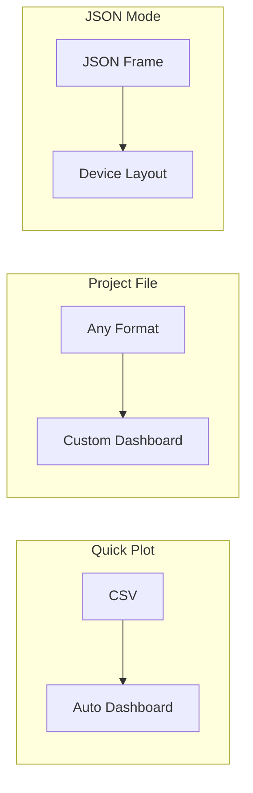

# Operation modes

## Overview

Serial Studio has three parsing modes that determine how incoming data is interpreted and displayed. The mode is picked in the Setup panel on the right side of the main window. Every mode works with any data source: Serial (UART), Bluetooth LE, Network (TCP/UDP), and all Pro sources (Audio, Modbus, CAN Bus, USB, HID, Process).

The three modes, in order of increasing complexity:

1. **Quick Plot.** Automatic CSV plotting with zero configuration.
2. **Project File.** A JSON project file on the host defines the dashboard, and the device sends raw values.
3. **Device Sends JSON.** The device transmits a self-describing JSON frame that defines both data and dashboard layout.

The diagram below compares data flow through each mode side by side.



| Feature          | Quick Plot | Project File | Device Sends JSON |
|------------------|:----------:|:------------:|:-----------------:|
| JS Parser        | No         | Yes          | No                |
| Custom Widgets   | No         | Yes          | Yes               |
| Multi-Source     | No         | Yes (Pro)    | No                |
| Setup Effort     | None       | Editor       | Firmware          |

> **Note.** All modes work with any data source: Serial, TCP/UDP, BLE, and all Pro drivers.
>
> **Frame detection options (Project File mode only):** End Only, Start+End, Start Only, No Delimiters.

---

## Quick Plot mode

### Selection

Pick the "Quick Plot (Comma Separated Values)" radio button in the Setup panel.

### How it works

- **Frame detection.** Line-based. Each line of text terminated by CR, LF, or CRLF is one frame.
- **Data format.** Comma-separated numeric values. Each value maps to one channel.
- **CSV delimiter.** Comma only. Other delimiters aren't supported in this mode.
- **Header detection.** If the first received row is all non-numeric strings, those strings become channel labels on the dashboard.

When a connection is established, Serial Studio reads each line, splits on commas, and creates a dashboard with:

- A Data Grid widget showing all current values.
- A MultiPlot widget overlaying all channels on a single time-series chart.
- Individual per-channel plots.

No project file required. No JavaScript parsing involved.

### Example input

```
Temperature,Pressure,Humidity
23.5,1013.2,45.0
23.6,1013.1,45.1
23.7,1013.0,45.3
```

The first line sets channel labels. Later lines are plotted in real time.

### Limitations

- Comma is the only supported delimiter.
- No custom widgets (gauges, bars, compass, GPS map, FFT, and so on).
- No alarm thresholds.
- No per-channel configuration (units, ranges, scaling).
- No JavaScript frame parsing.
- No multi-source support.

### When to use it

Quick Plot is the fastest way to visualize data. Use it when you want to check that a device is transmitting correctly, prototype a new sensor, or demonstrate real-time plotting in a classroom.

---

## Project File mode

### Selection

Pick the "Parse via JSON Project File" radio button in the Setup panel. Then load or create a project file in the Project Editor (wrench icon in the toolbar).

### How it works

- **Frame detection.** Configurable per source. Four detection methods are available.
- **Data format.** Configurable. Incoming bytes can be decoded as plain text (UTF-8), hexadecimal, Base64, or raw binary.
- **Dashboard definition.** A `.ssproj` JSON file on the host defines all groups, datasets, widgets, alarms, FFT settings, and actions.
- **Device data.** The device sends only raw values (CSV text, binary packets, and so on). Serial Studio maps each value to the corresponding dataset by index.
- **Frame parser script.** An optional `parse(frame)` function (Lua or JavaScript) can transform arbitrary protocols into the array of values Serial Studio expects.
- **Multi-source.** A single project file can define multiple data sources, each with its own connection, frame detection, and decoder settings.

This mode gives you access to every widget type and configuration option in Serial Studio. It's the most commonly used mode for real-world projects.

### Frame detection methods

Frame detection determines how Serial Studio finds the boundaries of each data frame in a continuous byte stream. The method is configured per source in the Project Editor.

| Method                      | Enum value | Behavior |
|-----------------------------|-----------|----------|
| **End Delimiter Only**      | 0         | A frame ends when the end delimiter is seen. The most common choice for line-terminated CSV data (for example delimiter = `\n`). |
| **Start and End Delimiter** | 1         | A frame begins at the start delimiter and ends at the end delimiter. Use this for protocols that wrap data in markers (for example `$DATA...;\n`). |
| **No Delimiters**           | 2         | All incoming data is passed directly to the frame parser script without delimiter-based splitting. Use this for length-prefixed or fixed-size binary protocols where the parser itself figures out frame boundaries. |
| **Start Delimiter Only**    | 3         | A frame begins at one occurrence of the start delimiter and ends when the next occurrence is found. The second occurrence becomes the start of the next frame. |

Delimiters can be specified as plain text or hexadecimal byte sequences (toggle "Hexadecimal Delimiters" in the Project Editor).

### Decoder methods

The decoder determines how raw bytes are converted before being passed to the frame parser (or split as CSV).

| Decoder                 | Enum value | Description |
|-------------------------|-----------|-------------|
| **Plain Text (UTF-8)**  | 0         | Bytes are decoded as UTF-8 text. The most common choice for ASCII/CSV protocols. |
| **Hexadecimal**         | 1         | Each byte is converted to a two-character hex string. For example, bytes `0x03 0xFF 0x02` become `"03FF02"`. |
| **Base64**              | 2         | Bytes are encoded as a Base64 string. |
| **Binary (Direct)**     | 3         | Raw bytes are passed to the frame parser as a table or array of integers (0 to 255). This is a Pro feature. |

### Frame parser script

When the incoming data isn't simple comma-separated text, you can write a Lua or JavaScript `parse()` function to transform each frame into the array of values Serial Studio expects. Lua is the default and recommended language for new projects because it's faster.

The signature:

```javascript
function parse(frame) {
    // 'frame' is a string (for PlainText/Hex/Base64 decoders)
    // or an array of integers (for the Binary decoder).
    //
    // Return a flat array of values:
    return [value1, value2, value3];
}
```

**Key behaviors:**

- The returned array is mapped to datasets by index: element 0 goes to dataset index 1, element 1 goes to dataset index 2, and so on.
- **Multi-frame return.** Return an array of arrays to emit multiple frames from a single parse call: `[[row1_val1, row1_val2], [row2_val1, row2_val2]]`.
- **Mixed scalar/vector.** Returning `[scalar, [vec1, vec2, vec3]]` auto-expands the inner array into separate dataset values.

**Example: parsing a semicolon-delimited protocol.**

```javascript
function parse(frame) {
    return frame.split(";");
}
```

**Example: parsing a fixed-size binary packet.**

```javascript
function parse(frame) {
    // frame is an array of bytes (Binary decoder)
    // Bytes 0-1: uint16 temperature (big-endian, x0.1)
    // Bytes 2-3: uint16 pressure (big-endian)
    var temp = ((frame[0] << 8) | frame[1]) * 0.1;
    var pres = (frame[2] << 8) | frame[3];
    return [temp, pres];
}
```

### Multi-source support

Project File mode supports multiple data sources within a single project. Each source is an independent entry with its own:

- Source ID and title.
- Bus type (UART, Network, BLE, and so on).
- Frame detection method and delimiters.
- Decoder method.
- Frame parser code (Lua or JavaScript).
- Connection settings.

That's how you monitor multiple devices at the same time on a single dashboard. For example, a weather station project might define one UART source for a ground sensor array and one TCP source for a remote wind station, both feeding one dashboard.

Multi-source is a Pro feature. The free (GPL) edition is limited to a single source per project.

### When to use it

Project File mode is the right choice for any application that needs custom widgets, alarm thresholds, FFT analysis, per-channel configuration, multi-device monitoring, or a carefully designed dashboard layout. It's the most common mode for production telemetry systems, competition dashboards (CanSat, rocketry), and industrial monitoring.

---

## Device Sends JSON mode

> This mode exists for specific cases where the device has to control its own dashboard layout at runtime. For most projects, Project File mode is the recommended approach: it's more flexible, doesn't need firmware changes, and isn't affected by protocol changes between Serial Studio versions. The JSON frame structure used here may change across versions, which can break firmware written against an older format.

### Selection

Pick the "No Parsing (Device Sends JSON Data)" radio button in the Setup panel.

### How it works

- **Frame detection.** Fixed delimiters. Every frame has to begin with `/*` and end with `*/`. These are hardcoded and can't be changed.
- **Data format.** A complete JSON object enclosed between the delimiters. The JSON defines both the dashboard layout and the current data values.
- **Dashboard behavior.** Serial Studio rebuilds the dashboard dynamically whenever the JSON structure changes (new groups, different widgets, and so on). If only values change, the existing dashboard updates in place.

No project file required. No JavaScript parsing involved. The device firmware is entirely responsible for generating valid JSON.

### Transmission format

```
/*{ ... JSON payload ... }*/
```

The device sends the opening `/*`, then a JSON object, then `*/`. Whitespace inside the delimiters is allowed.

### JSON frame structure

A complete frame has a root object with three optional top-level keys:

| Key       | Type   | Required | Description |
|-----------|--------|----------|-------------|
| `title`   | string | Yes      | Dashboard title shown at the top of the window. |
| `groups`  | array  | Yes      | Array of group objects. Each group becomes a widget panel. |
| `actions` | array  | No       | Array of action objects. Each action becomes a button that transmits data back to the device. |

#### Group object

Each group represents a panel on the dashboard with one or more datasets.

| Key         | Type   | Default | Description |
|-------------|--------|---------|-------------|
| `title`     | string | —       | Display name of the group. |
| `widget`    | string | `""`    | Group widget type. See the table below. |
| `datasets`  | array  | —       | Array of dataset objects that belong to this group. |

**Group widget values:**

| Value             | Dashboard widget                     | Required datasets |
|-------------------|--------------------------------------|-------------------|
| `"datagrid"`      | Data Grid                            | Any number of datasets. |
| `"multiplot"`     | MultiPlot (overlaid time-series)     | Two or more datasets with `graph: true`. |
| `"accelerometer"` | Accelerometer visualization          | Three datasets (X, Y, Z). |
| `"gyro"`          | Gyroscope visualization              | Three datasets (X, Y, Z). |
| `"map"`           | GPS Map                              | Two or three datasets (latitude, longitude, optional altitude). Uses `widget` values `"lat"`, `"lon"`, `"alt"` on datasets. |
| `"plot3d"`        | 3D scatter/line plot                 | Three datasets (X, Y, Z). |
| `"image"`         | Image viewer (Pro)                   | Image data embedded in the stream. |
| `""` (empty)      | No group-level widget                | Datasets rendered individually based on their own `widget` values. |

#### Dataset object

Each dataset represents a single data channel within a group.

| Key                 | Type   | Default | Description |
|---------------------|--------|---------|-------------|
| `title`             | string | —       | Human-readable channel name. |
| `value`             | string | —       | Current value as a string (even for numbers). |
| `units`             | string | `""`    | Unit label (for example "degC", "%", "hPa"). |
| `index`             | int    | 0       | Position index within the frame (used for mapping). |
| `widget`            | string | `""`    | Dataset-level widget: `"bar"`, `"gauge"`, `"compass"`, or `""` for none. For special groups, use `"x"`, `"y"`, `"z"`, `"lat"`, `"lon"`, `"alt"`. |
| `graph`             | bool   | false   | If true, this dataset is plotted as a time-series line. |
| `fft`               | bool   | false   | Enable FFT analysis for this channel. |
| `fftSamples`        | int    | 256     | Number of samples per FFT window. |
| `fftSamplingRate`   | int    | 100     | Sampling rate in Hz for the FFT frequency axis. |
| `fftMin`            | double | 0       | Minimum display value for the FFT plot. |
| `fftMax`            | double | 0       | Maximum display value for the FFT plot. |
| `led`               | bool   | false   | Show an LED indicator for this channel. |
| `ledHigh`           | double | 80      | Threshold above which the LED activates. |
| `alarmEnabled`      | bool   | false   | Enable alarm monitoring. |
| `alarmLow`          | double | 20      | Low alarm threshold. |
| `alarmHigh`         | double | 80      | High alarm threshold. |
| `widgetMin`         | double | 0       | Minimum value for bar/gauge/compass widgets. |
| `widgetMax`         | double | 100     | Maximum value for bar/gauge/compass widgets. |
| `plotMin`           | double | 0       | Fixed minimum for the plot Y-axis (0 = auto-scale). |
| `plotMax`           | double | 0       | Fixed maximum for the plot Y-axis (0 = auto-scale). |

#### Action object

Actions define buttons in the dashboard toolbar that send data back to the connected device.

| Key      | Type   | Default            | Description |
|----------|--------|--------------------|-------------|
| `title`  | string | —                  | Button label. |
| `icon`   | string | `"Play Property"`  | Icon name for the button. |
| `txData` | string | —                  | Data string to transmit when the button is pressed. |
| `eol`    | string | `""`               | End-of-line sequence appended after `txData` (for example `"\r\n"`). |
| `binary` | bool   | false              | If true, `txData` is interpreted as binary hex data. |

### Full example

```json
/*{
  "title": "Weather Station",
  "groups": [
    {
      "title": "Environment",
      "widget": "datagrid",
      "datasets": [
        {
          "title": "Temperature",
          "value": "23.5",
          "units": "degC",
          "widget": "gauge",
          "widgetMin": -20,
          "widgetMax": 60,
          "graph": true,
          "alarmEnabled": true,
          "alarmHigh": 50
        },
        {
          "title": "Humidity",
          "value": "45.2",
          "units": "%",
          "widget": "bar",
          "widgetMin": 0,
          "widgetMax": 100,
          "graph": true
        },
        {
          "title": "Pressure",
          "value": "1013",
          "units": "hPa",
          "graph": true
        }
      ]
    }
  ],
  "actions": [
    {
      "title": "Reset Sensor",
      "icon": "Refresh",
      "txData": "RST",
      "eol": "\r\n"
    }
  ]
}*/
```

### When to use it

Device Sends JSON is a fit for cases where firmware has to control its own dashboard layout at runtime, for example when a device switches between operating modes and needs different widgets for each. Keep in mind that shipping large JSON payloads over a serial port adds a lot of overhead compared to sending raw values, and the JSON structure is tied to the specific Serial Studio version you're using.

---

## Picking the right mode

| Scenario                                                     | Recommended mode |
|--------------------------------------------------------------|------------------|
| Arduino or ESP32 sending CSV numbers for quick debugging     | Quick Plot |
| Rapid prototyping or classroom demo                          | Quick Plot |
| Need gauges, bars, compass, GPS map, FFT, or alarms          | Project File |
| Custom binary protocol with length-prefixed packets          | Project File + Binary decoder + JS parser |
| Multiple sensors on different ports in one dashboard         | Project File (multi-source, Pro) |
| Production telemetry system with saved configuration         | Project File |
| Device changes its dashboard layout at runtime               | Device Sends JSON |

### Feature comparison

| Feature                     | Quick Plot       | Project File                  | Device Sends JSON         |
|-----------------------------|------------------|-------------------------------|---------------------------|
| Setup effort                | None             | Create project in editor      | Firmware has to build JSON |
| Frame detection             | Line-based (auto)| Configurable per source       | Fixed `/*` to `*/`        |
| CSV delimiter               | Comma only       | Any (via parser script)       | N/A (JSON)                |
| Frame parser (Lua/JS)       | No               | Yes                           | No                        |
| Custom widgets              | No (plots only)  | Yes (project-defined)         | Yes (device-defined)      |
| Alarms and LED indicators   | No               | Yes                           | Yes                       |
| FFT analysis                | No               | Yes                           | Yes                       |
| Multi-source                | No               | Yes (Pro)                     | No                        |
| Saved configuration         | No               | Yes (.ssproj file)            | N/A                       |
| Device data complexity      | Minimal          | Any format with JS parser     | Has to generate JSON      |

---

## Getting started recommendations

If you're new to Serial Studio, start with Quick Plot. Connect your device, make sure it sends comma-separated numbers terminated by a newline, and click Connect. You'll see data on screen in seconds.

Once you need more control (specific widget types, unit labels, alarm thresholds, or a polished dashboard layout), move to Project File mode. Open the Project Editor, define your groups and datasets, and load the resulting `.ssproj` file. This is the recommended mode for most real-world projects.

Device Sends JSON exists for niche cases where firmware has to control the dashboard layout at runtime. It's generally not recommended: it requires shipping verbose JSON over the data link, and the expected JSON structure can change between Serial Studio versions, which can break your firmware without warning. If you're unsure which mode to use, pick Project File.
