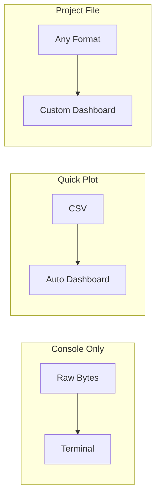

# Operation modes

## Overview

Serial Studio has three parsing modes that determine how incoming data is interpreted and displayed. The mode is picked in the Setup panel on the right side of the main window. Every mode works with any data source: Serial (UART), Bluetooth LE, Network (TCP/UDP), and all Pro sources (Audio, Modbus, CAN Bus, USB, HID, Process).

The three modes, in order of increasing complexity:

1. **Console Only.** No parsing, no dashboard. Raw bytes stream to the terminal so you can inspect what your device is actually sending.
2. **Quick Plot.** Automatic CSV plotting with zero configuration.
3. **Project File.** A `.ssproj` project file on the host defines the dashboard, and the device sends raw values (CSV, binary, or anything a frame parser can decode).

The diagram below compares data flow through each mode side by side.



| Feature          | Console Only | Quick Plot | Project File |
|------------------|:------------:|:----------:|:------------:|
| Dashboard        | No           | Auto       | Custom       |
| Frame Parser     | No           | No         | Lua / JS     |
| Custom Widgets   | No           | No         | Yes          |
| Multi-Source     | No           | No         | Yes (Pro)    |
| Setup Effort     | None         | None       | Editor       |

> **Note.** All modes work with any data source: Serial, TCP/UDP, BLE, and all Pro drivers (MQTT, Modbus, CAN Bus, Audio, USB, HID, Process I/O).
>
> **Frame detection options (Project File mode only):** End Only, Start+End, Start Only, No Delimiters.

---

## Console Only mode

### Selection

Pick the "Console Only (No Parsing)" radio button in the Setup panel.

### How it works

- **Frame detection.** None. Serial Studio doesn't scan for delimiters, doesn't buffer frames, and doesn't build a dashboard.
- **Data flow.** Raw bytes from the data source go straight to the terminal. The circular buffer, frame queue, and FrameBuilder are all skipped.
- **Display.** The terminal shows the raw stream in ASCII or hex. You can still save the console transcript to a file.
- **Transmit.** The console input box still works, so you can send bytes back to the device.

Console Only is not a parsing mode. No widgets render, no CSV export, no frame parser scripts. It exists purely as a diagnostic view.

### When to use it

- Figuring out what protocol your device is actually using.
- Verifying baud rate / pin wiring / framing before you commit to a project file.
- Debugging a stream that isn't being parsed correctly in another mode.
- Interactively driving a device with a simple text protocol (AT commands, CLI, and so on).

Once you've confirmed the data looks sane, switch to Quick Plot or Project File to actually visualize it.

---

## Quick Plot mode

### Selection

Pick the "Quick Plot (Comma Separated Values)" radio button in the Setup panel.

### How it works

- **Frame detection.** Line-based. Each line of text terminated by CR, LF, or CRLF is one frame.
- **Data format.** Comma-separated numeric values. Each value maps to one channel.
- **CSV delimiter.** Comma only. Other delimiters aren't supported in this mode.
- **Header detection.** If the first received row is all non-numeric strings, those strings become channel labels on the dashboard.

When a connection is established, Serial Studio reads each line, splits on commas, and creates a dashboard with:

- A Data Grid widget showing all current values.
- A MultiPlot widget overlaying all channels on a single time-series chart.
- Individual per-channel plots.

No project file required. No JavaScript parsing involved.

### Example input

```
Temperature,Pressure,Humidity
23.5,1013.2,45.0
23.6,1013.1,45.1
23.7,1013.0,45.3
```

The first line sets channel labels. Later lines are plotted in real time.

### Limitations

- Comma is the only supported delimiter.
- No custom widgets (gauges, bars, compass, GPS map, FFT, and so on).
- No alarm thresholds.
- No per-channel configuration (units, ranges, scaling).
- No JavaScript frame parsing.
- No multi-source support.

### When to use it

Quick Plot is the fastest way to visualize data. Use it when you want to check that a device is transmitting correctly, prototype a new sensor, or demonstrate real-time plotting in a classroom.

---

## Project File mode

### Selection

Pick the "Parse via JSON Project File" radio button in the Setup panel. Then load or create a project file in the Project Editor (wrench icon in the toolbar).

### How it works

- **Frame detection.** Configurable per source. Four detection methods are available.
- **Data format.** Configurable. Incoming bytes can be decoded as plain text (UTF-8), hexadecimal, Base64, or raw binary.
- **Dashboard definition.** A `.ssproj` JSON file on the host defines all groups, datasets, widgets, alarms, FFT settings, and actions.
- **Device data.** The device sends only raw values (CSV text, binary packets, and so on). Serial Studio maps each value to the corresponding dataset by index.
- **Frame parser script.** An optional `parse(frame)` function (Lua or JavaScript) can transform arbitrary protocols into the array of values Serial Studio expects.
- **Multi-source.** A single project file can define multiple data sources, each with its own connection, frame detection, and decoder settings.

This mode gives you access to every widget type and configuration option in Serial Studio. It's the most commonly used mode for real-world projects.

### Frame detection methods

Frame detection determines how Serial Studio finds the boundaries of each data frame in a continuous byte stream. The method is configured per source in the Project Editor.

| Method                      | Enum value | Behavior |
|-----------------------------|-----------|----------|
| **End Delimiter Only**      | 0         | A frame ends when the end delimiter is seen. The most common choice for line-terminated CSV data (for example delimiter = `\n`). |
| **Start and End Delimiter** | 1         | A frame begins at the start delimiter and ends at the end delimiter. Use this for protocols that wrap data in markers (for example `$DATA...;\n`). |
| **No Delimiters**           | 2         | All incoming data is passed directly to the frame parser script without delimiter-based splitting. Use this for length-prefixed or fixed-size binary protocols where the parser itself figures out frame boundaries. |
| **Start Delimiter Only**    | 3         | A frame begins at one occurrence of the start delimiter and ends when the next occurrence is found. The second occurrence becomes the start of the next frame. |

Delimiters can be specified as plain text or hexadecimal byte sequences (toggle "Hexadecimal Delimiters" in the Project Editor).

### Decoder methods

The decoder determines how raw bytes are converted before being passed to the frame parser (or split as CSV).

| Decoder                 | Enum value | Description |
|-------------------------|-----------|-------------|
| **Plain Text (UTF-8)**  | 0         | Bytes are decoded as UTF-8 text. The most common choice for ASCII/CSV protocols. |
| **Hexadecimal**         | 1         | Each byte is converted to a two-character hex string. For example, bytes `0x03 0xFF 0x02` become `"03FF02"`. |
| **Base64**              | 2         | Bytes are encoded as a Base64 string. |
| **Binary (Direct)**     | 3         | Raw bytes are passed to the frame parser as a table or array of integers (0 to 255). This is a Pro feature. |

### Frame parser script

When the incoming data isn't simple comma-separated text, you can write a Lua or JavaScript `parse()` function to transform each frame into the array of values Serial Studio expects. Lua is the default and recommended language for new projects because it's faster.

The signature:

```javascript
function parse(frame) {
    // 'frame' is a string (for PlainText/Hex/Base64 decoders)
    // or an array of integers (for the Binary decoder).
    //
    // Return a flat array of values:
    return [value1, value2, value3];
}
```

**Key behaviors:**

- The returned array is mapped to datasets by index: element 0 goes to dataset index 1, element 1 goes to dataset index 2, and so on.
- **Multi-frame return.** Return an array of arrays to emit multiple frames from a single parse call: `[[row1_val1, row1_val2], [row2_val1, row2_val2]]`.
- **Mixed scalar/vector.** Returning `[scalar, [vec1, vec2, vec3]]` auto-expands the inner array into separate dataset values.

**Example: parsing a semicolon-delimited protocol.**

```javascript
function parse(frame) {
    return frame.split(";");
}
```

**Example: parsing a fixed-size binary packet.**

```javascript
function parse(frame) {
    // frame is an array of bytes (Binary decoder)
    // Bytes 0-1: uint16 temperature (big-endian, x0.1)
    // Bytes 2-3: uint16 pressure (big-endian)
    var temp = ((frame[0] << 8) | frame[1]) * 0.1;
    var pres = (frame[2] << 8) | frame[3];
    return [temp, pres];
}
```

### Multi-source support

Project File mode supports multiple data sources within a single project. Each source is an independent entry with its own:

- Source ID and title.
- Bus type (UART, Network, BLE, and so on).
- Frame detection method and delimiters.
- Decoder method.
- Frame parser code (Lua or JavaScript).
- Connection settings.

That's how you monitor multiple devices at the same time on a single dashboard. For example, a weather station project might define one UART source for a ground sensor array and one TCP source for a remote wind station, both feeding one dashboard.

Multi-source is a Pro feature. The free (GPL) edition is limited to a single source per project.

### When to use it

Project File mode is the right choice for any application that needs custom widgets, alarm thresholds, FFT analysis, per-channel configuration, multi-device monitoring, or a carefully designed dashboard layout. It's the most common mode for production telemetry systems, competition dashboards (CanSat, rocketry), and industrial monitoring.

---

## Picking the right mode

| Scenario                                                     | Recommended mode |
|--------------------------------------------------------------|------------------|
| Just want to see what bytes the device is sending            | Console Only |
| Debugging a garbled stream, unknown baud rate, wrong wiring  | Console Only |
| Sending AT commands or a text CLI to a modem / module        | Console Only |
| Arduino or ESP32 sending CSV numbers for quick debugging     | Quick Plot |
| Rapid prototyping or classroom demo                          | Quick Plot |
| Need gauges, bars, compass, GPS map, FFT, or alarms          | Project File |
| Custom binary protocol with length-prefixed packets          | Project File + Binary decoder + Lua/JS parser |
| Multiple sensors on different ports in one dashboard         | Project File (multi-source, Pro) |
| Production telemetry system with saved configuration         | Project File |

### Feature comparison

| Feature                     | Console Only        | Quick Plot       | Project File                  |
|-----------------------------|---------------------|------------------|-------------------------------|
| Setup effort                | None                | None             | Create project in editor      |
| Dashboard                   | No                  | Auto             | Custom                        |
| Frame detection             | None (raw stream)   | Line-based (auto)| Configurable per source       |
| CSV delimiter               | N/A                 | Comma only       | Any (via parser script)       |
| Frame parser (Lua/JS)       | No                  | No               | Yes                           |
| Dataset value transforms    | No                  | No               | Yes                           |
| Custom widgets              | No                  | No (plots only)  | Yes (project-defined)         |
| Alarms and LED indicators   | No                  | No               | Yes                           |
| FFT analysis                | No                  | No               | Yes                           |
| Multi-source                | No                  | No               | Yes (Pro)                     |
| CSV / MDF4 export           | No                  | Yes              | Yes                           |
| Saved configuration         | No                  | No               | Yes (.ssproj file)            |

---

## Getting started recommendations

If you're hooking up a new device and don't yet know what it sends, start in **Console Only** mode. Connect, watch the raw bytes, confirm the baud rate and framing make sense.

Once you can see clean comma-separated numbers in the console, switch to **Quick Plot**. You'll get a dashboard with one plot per CSV field in seconds, with no configuration.

Once you need more control (specific widget types, unit labels, alarm thresholds, a polished dashboard layout, binary protocol parsing, or multiple concurrent data sources), move to **Project File** mode. Open the Project Editor, define your groups and datasets, save a `.ssproj` file, and load it from the Setup panel. This is the recommended mode for most real-world projects.
