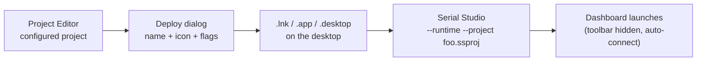
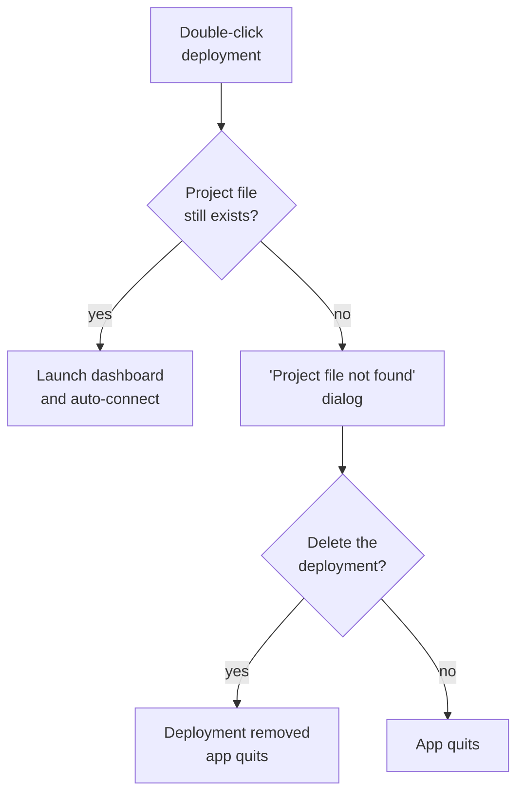

# Operator Deployments

A **deployment** is a saved launcher that opens Serial Studio with a specific project file and a fixed set of command-line flags. Double-clicking the launcher starts the dashboard with the project already loaded, the toolbar hidden, and (optionally) auto-connect, fullscreen, and pre-armed exports.

The intended workflow: an engineer configures a project once, generates a deployment for it, and hands the deployment file to whoever runs the workstation. Operators get a single-icon entry point to a known dashboard layout instead of having to find the right `.ssproj` and remember which exports to enable.

> **Pro feature.** Deployment generation and the `--runtime` flag are part of the commercial build. Deployments created on a Pro machine still launch under GPL builds (the runtime CLI flags are honoured by GPL builds), but they can only be *generated* from a Pro install.

> **Serial Studio must be installed on the target machine.** A deployment is a launcher, not a self-contained bundle. It records the absolute path of the Serial Studio executable at the moment it was created, plus the project file path and runtime flags. If Serial Studio isn't installed on the operator's machine — or if it has been uninstalled, moved, or the project file is missing — double-clicking the deployment will fail with the OS's "missing application" or "file not found" error. Install Serial Studio on the target machine first (the same installer the engineer uses), then drop the deployment file onto the desktop.

## What gets created

Pick **Deploy** from the toolbar. Fill in a name, optionally swap the icon, choose where to save, and Serial Studio writes a native launcher for your platform:

| Platform | File written          | Where it goes by default |
|----------|------------------------|--------------------------|
| Windows  | `.lnk` (shell-link binary) | Desktop, with the Serial Studio executable as the target |
| macOS    | `.app` bundle (Bash-launched, with custom `.icns`) | Desktop, opens via Finder/Dock |
| Linux    | `.desktop` (freedesktop.org Desktop Entry) | Desktop; move to `~/.local/share/applications/` to surface it in the launcher |

Every deployment hard-codes a single project file path plus the runtime flags you picked in the dialog. Double-clicking it relaunches Serial Studio with those exact arguments — there is no "remember last project" guessing involved.



> **Legend:** Deployments capture the project path and CLI flags at creation time. Editing the project later doesn't re-stamp the deployment — it just keeps pointing at the same file.

---

## The dialog

Two tabs.

### General

- **Icon.** Click the 96×96 preview (or **Change Icon…**) to pick your own. macOS prefers `.icns`, Windows prefers `.ico`, Linux accepts SVG or PNG. Leave it alone to use the bundled deployment icon.
- **Name.** Defaults to the project's title. Used as the deployment filename and the displayed label in the operator's shell. Reserved characters (`\ / : * ? " < > |`) are replaced with `_` automatically when saving.
- **Project.** Read-only field showing the currently loaded project. Use the folder button to switch projects without leaving the dialog. A project must be loaded for **Save** to enable.
- **Fullscreen.** When on, the deployment adds `--fullscreen` so the dashboard launches full-screen with no window chrome.

### Logging

Optional toggles that pre-arm the export modules at startup. These are the same flags as the corresponding modules' Enable Export checkboxes — turning them on in the deployment means the export starts the moment the device connects, with no extra clicks.

| Switch              | CLI flag              | What it does on launch |
|---------------------|-----------------------|------------------------|
| **CSV File**        | `--csv-export`        | Enables CSV export to the user's CSV folder. |
| **MDF4 File**       | `--mdf-export`        | Enables MDF4 export to the user's MDF4 folder. |
| **Session Database**| `--session-export`    | Enables Session Database recording to the configured `.db` location. |
| **Console Log**     | `--console-export`    | Enables Console export to the configured log location. |

Each export module decides where the file lands — the deployment just flips the switch.

### Save

Press **Save**. A native Save dialog opens with the right file filter for your OS. Pick a location, and Serial Studio writes the launcher and reveals it in your file manager so you can move it onto a desktop, share it, or include it in an installer payload.

If anything goes wrong while writing the file, an inline red banner shows the OS error in the dialog. The dialog stays open so you can retry without losing your selections.

---

## Runtime mode

Every generated deployment adds `--runtime`. This flag adjusts the dashboard for unattended/operator use:

| Behaviour                             | Effect with `--runtime` |
|---------------------------------------|--------------------------|
| Toolbar                               | Hidden from launch — the Setup, Console, and Project Editor buttons are not visible. |
| Project loading                       | Loads the file passed via `--project` immediately, in Project mode. No project picker. |
| Auto-connect                          | Once the QML loads, Serial Studio calls `connectDevice()` automatically if the project's bus type has a usable configuration. |
| Failed initial connect (4 s grace)    | If no connection is established within 4 seconds of launch, a **Device Unavailable** dialog is shown. |
| User-initiated disconnect             | Quits the application. In runtime mode, pressing Disconnect is treated as "I'm done." |
| Device-initiated drop                 | Shows the **Connection Lost** dialog. The user can Reconnect, pick a different device, or Quit; the dashboard layout is preserved underneath. |
| Project file missing at launch        | A pre-flight check runs before the QML loads. If the project file is missing, a "Project file not found" dialog is shown and offers to **Delete Deployment** (when `--shortcut-path` is provided) or **Quit**. |

Runtime mode does **not** change anything about the data pipeline, frame parsers, exports, or the API server. The dashboard, MCP/JSON-RPC, gRPC, MQTT, and Session Database all behave exactly as they would in a normal Serial Studio session. Only the surrounding chrome is changed.

### The recovery dialog

When the initial connection fails or an active connection drops in runtime mode, the dialog shows two pages:

1. **Page 0 — summary.** A warning icon, a one-line headline ("The connection to your device was lost." or "Serial Studio couldn't reach your device."), and three buttons: **Quit**, **Pick Different Device**, **Try Again** / **Reconnect**. The dialog auto-closes when a connection is re-established, so the user can leave it open and come back.
2. **Page 1 — driver picker.** A bus-type combo plus the Hardware setup pane embedded in the dialog. Lets the user choose a different port or device without exposing the rest of the toolbar. Press **Connect** when ready.

This is the only piece of the setup UI an operator interacts with under runtime mode, and it only appears when the connection is not established.

---

## CLI reference

A deployment is a saved invocation of `serial-studio` with these flags. The same command can be run by hand, dropped into a service unit, or scripted in CI:

```sh
serial-studio \
    --project /path/to/project.ssproj \
    --runtime \
    --fullscreen \
    --csv-export \
    --mdf-export \
    --session-export \
    --console-export \
    --shortcut-path /path/to/deployment.lnk
```

| Flag                | Notes |
|---------------------|-------|
| `--project <file>`  | Path to the `.ssproj` to load. Available in GPL builds. |
| `--runtime`         | Operator runtime mode (Pro). Implies hide-toolbar, auto-connect, and the recovery dialog. |
| `--fullscreen`      | Launch the dashboard full-screen. Available in GPL builds. |
| `--no-toolbar`      | Hide the toolbar without enabling runtime behaviour (Pro). Useful for embedded HMIs that have their own chrome. |
| `--csv-export`      | Pre-arm CSV export (Pro). |
| `--mdf-export`      | Pre-arm MDF4 export (Pro). |
| `--session-export`  | Pre-arm Session Database export (Pro). |
| `--console-export`  | Pre-arm Console export (Pro). |
| `--shortcut-path <p>` | Identifies which deployment file launched this process (Pro). Lets the runtime offer to delete a broken deployment when its project file goes missing. The flag is named `--shortcut-path` for backwards compatibility with deployments generated by earlier versions. |

The deployment generator passes `--shortcut-path` automatically; you only need it when crafting flags by hand and want the broken-deployment self-cleanup behaviour.

---

## When the project file goes missing

If a project file is moved or deleted after the deployment was generated, the runtime detects this **before** any window appears and offers to clean up:



The cleanup treats macOS `.app` bundles as directories (recursive remove) and Windows `.lnk` / Linux `.desktop` as plain files. Nothing else on disk is touched.

---

## Tips for kiosk-style setups

- **Install Serial Studio first.** The deployment is a launcher, not a bundle. Use the Serial Studio installer on the target machine before dropping the deployment file in place. If Serial Studio isn't installed on the operator's machine, the deployment will fail with the OS's "missing application" error.
- **Pair it with a project lock.** A locked `.ssproj` plus a runtime-mode deployment limits the editor surface available at the workstation. See [Project Lock](Project-Lock.md).
- **Pre-flight your exports.** Toggle the recorders on in the Logging tab so files start collecting the moment the device connects.
- **Use full-screen on dedicated displays.** Combine `--fullscreen` with the OS's autostart hook to bring up the dashboard on boot.
- **Linux launcher integration.** Save the `.desktop` file to `~/.local/share/applications/` to make it appear in GNOME/KDE/etc. application menus. Most desktop environments pick up new entries automatically; some need an `update-desktop-database` run.
- **Windows icon caching.** If a deployment keeps showing the previous icon after you regenerate it, that's the Windows icon cache — sign out and back in, or rebuild it with `ie4uinit.exe -show`.
- **macOS Gatekeeper.** First launch of an unsigned `.app` deployment may prompt for confirmation. Right-click → Open works around it. Signed/notarized Serial Studio installs don't carry the warning over to their generated deployments because the launcher just `exec`s the original signed binary.

---

## Frequently asked

**Does the deployment include Serial Studio itself?**
No. It's a launcher that points at the Serial Studio binary already installed on the machine. Install Serial Studio on the operator's computer separately, the same way you'd install any other application. Without it, double-clicking the deployment fails.

**Can a deployment launch in QuickPlot or Console-Only mode?**
Not via the dialog. Deployments target Project mode; that's the intended use. You can still hand-craft a CLI invocation with `--quick-plot` if you have a reason to.

**Does the deployment bundle the project file inside it?**
No. It records the absolute path to the `.ssproj`. Move the project, and the deployment breaks (cleanly — see the missing-file flow above).

**Can I edit a deployment after creating it?**
Yes. Windows `.lnk` exposes Properties → Target. macOS `.app/Contents/MacOS/run` is a small Bash script. Linux `.desktop` files are plain text. All three can be edited by hand if you need to adjust the flags.

**Will the deployment still work on a machine without a Pro license?**
Yes — the runtime CLI flags are honoured by GPL builds. You just can't *generate* deployments there. The target machine still needs Serial Studio installed.

**What if the user has multiple devices and the deployment points at one of them?**
The recovery dialog's **Pick Different Device** page lets them switch on the fly without leaving runtime mode. The deployment's auto-connect behaviour is a starting point, not a hard wire.

**Does the deployment survive a Serial Studio update?**
Usually yes. The deployment targets the Serial Studio executable by absolute path; package upgrades that overwrite the binary in place leave the deployment intact. Reinstalls that move the executable will require regenerating the deployment.

---

## See also

- [Project Lock](Project-Lock.md): pair a locked project with a runtime deployment to limit the editor surface at the workstation.
- [Operation Modes](Operation-Modes.md): how Project mode (the only one runtime deployments use) compares to QuickPlot and Console-Only.
- [Project Editor](Project-Editor.md): where the project that the deployment points to is built.
- [CSV Import & Export](CSV-Import-Export.md), [Session Database](Session-Database.md): the recorders the Logging tab pre-arms.
- [Pro vs Free Features](Pro-vs-Free.md): what's bundled with a Pro license.
