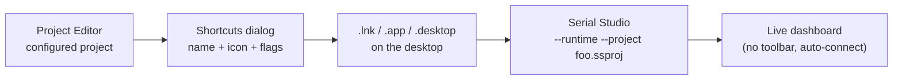
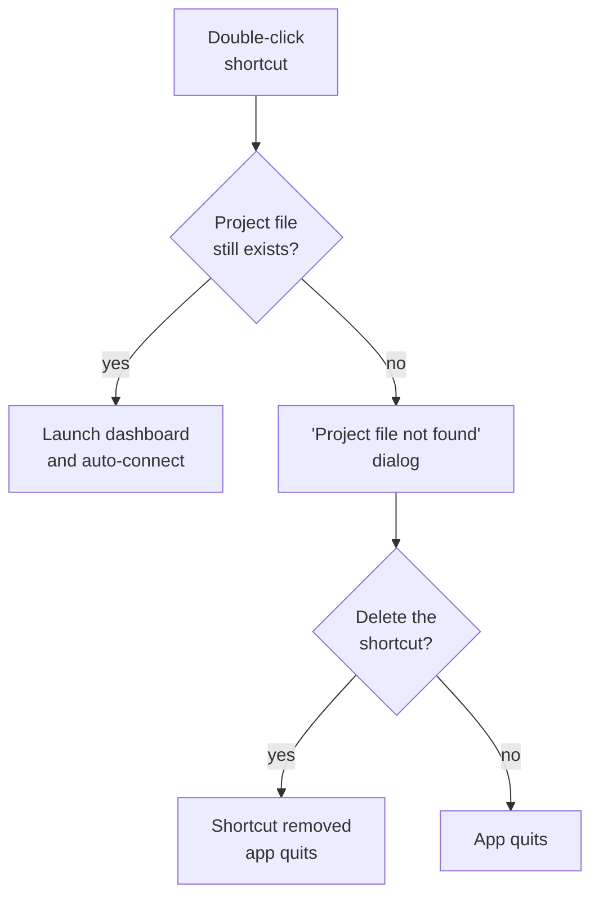

# Operator Shortcuts

A one-click launcher that takes someone straight to a live dashboard. No setup pane, no toolbar to wander around in, no project picker — just the icon on the desktop, double-click, and the data is on screen. When the device unplugs, Serial Studio quits or pops a focused recovery dialog instead of dropping the operator into a half-broken UI.

This is what turns a Serial Studio project into a workstation. Engineers configure a project once, generate a shortcut for it, and hand the shortcut to operators who never need to touch the editor.

> **Pro feature.** Shortcut generation and runtime mode are part of the commercial build. Shortcuts created on a Pro machine still launch under GPL builds (the runtime CLI flags are GPL-respecting), but they can only be *generated* from a Pro install.

## What gets created

Pick **Shortcuts** from the toolbar. Fill in a name, optionally swap the icon, choose where to save, and Serial Studio writes a native launcher for your platform:

| Platform | File written          | Where it goes by default |
|----------|------------------------|--------------------------|
| Windows  | `.lnk` (proper shell-link binary) | Desktop, with the Serial Studio executable as the target |
| macOS    | `.app` bundle (Bash-launched, with custom `.icns`) | Desktop, opens via Finder/Dock |
| Linux    | `.desktop` (freedesktop.org Desktop Entry) | Desktop; move to `~/.local/share/applications/` to surface it in the launcher |

Every shortcut hard-codes a single project file path plus the runtime flags you picked in the dialog. Double-clicking it relaunches Serial Studio with those exact arguments — there is no "remember last project" guessing involved.



> **Legend:** Shortcuts capture the project path and CLI flags at creation time. Editing the project later doesn't re-stamp the shortcut — it just keeps pointing at the same file.

---

## The dialog

Two tabs, deliberately short.

### General

- **Icon.** Click the 96×96 preview (or **Change Icon…**) to pick your own. macOS prefers `.icns`, Windows prefers `.ico`, Linux accepts SVG or PNG. Leave it alone to use the bundled Serial Studio shortcut icon.
- **Name.** Defaults to the project's title. This becomes the shortcut filename and the displayed label in your shell. Reserved characters (`\ / : * ? " < > |`) are replaced with `_` automatically when saving.
- **Project.** Read-only field showing the currently loaded project. Use the folder button to switch projects without leaving the dialog. You **must** have a project loaded to enable Save.
- **Fullscreen.** When on, the shortcut adds `--fullscreen` so the dashboard launches full-screen with no window chrome.

### Logging

Optional toggles that pre-arm the export modules at startup. Same flags as the corresponding modules' Enable Export checkboxes — turning them on in the shortcut means the export starts the moment the device connects, no extra clicks.

| Switch              | CLI flag              | What it does on launch |
|---------------------|-----------------------|------------------------|
| **CSV File**        | `--csv-export`        | Enables CSV export to the user's CSV folder. |
| **MDF4 File**       | `--mdf-export`        | Enables MDF4 export to the user's MDF4 folder. |
| **Session Database**| `--session-export`    | Enables Session Database recording to the configured `.db` location. |
| **Console Log**     | `--console-export`    | Enables Console export to the configured log location. |

Each export module decides where the file lands — the shortcut just flips the switch.

### Save

Press **Save**. A native Save dialog opens with the right file filter for your OS. Pick a location, and Serial Studio writes the launcher and reveals it in your file manager so you can drag it onto a desktop, share, or installer payload.

If anything goes wrong while writing the file, an inline red banner appears in the dialog with the OS error. The dialog stays open so you can retry without losing your selections.

---

## Runtime mode

Every generated shortcut adds `--runtime`. That is the flag that turns the dashboard from "the app a developer uses" into "the screen an operator uses." Specifically:

| Behavior                              | Effect with `--runtime` |
|---------------------------------------|--------------------------|
| Toolbar                               | Hidden from launch — there is no Setup, Console, or Project Editor button in sight. |
| Project loading                       | Loads the file passed via `--project` immediately, in Project mode. No project picker. |
| Auto-connect                          | Once the QML loads, Serial Studio calls `connectDevice()` automatically if the project's bus type has a usable configuration. |
| Failed initial connect (4 s grace)    | If no connection is established within 4 seconds of launch, a focused **Device Unavailable** dialog appears. |
| User-initiated disconnect             | Quits the application. Operators who press Disconnect mean "I'm done." |
| Device-initiated drop                 | Pops the **Connection Lost** dialog. The operator can Reconnect, pick a different device, or Quit — but the dashboard layout is preserved underneath. |
| Project file missing at launch        | Pre-flight check before QML loads. A clear "Project file not found" message offers to **Delete Shortcut** (if `--shortcut-path` was provided) or **Quit**. No flickering empty window. |

Runtime mode does **not** change anything about the data pipeline, frame parsers, exports, or the API server. The dashboard, MCP/JSON-RPC, gRPC, MQTT, and Session Database all behave exactly as they would in a normal Serial Studio session. Only the surrounding UI is locked down.

### The recovery dialog

When a connection fails or drops in runtime mode, the dialog has two pages:

1. **Page 0 — summary.** A warning icon, a one-line headline ("The connection to your device was lost." or "Serial Studio couldn't reach your device."), and three buttons: **Quit**, **Pick Different Device**, **Try Again** / **Reconnect**. The dialog auto-closes the moment a connection is re-established, so the operator can leave it open and walk away.
2. **Page 1 — driver picker.** Bus type combo + the Hardware setup pane embedded directly in the dialog. Lets the operator choose a different port without exposing the rest of the toolbar. Press **Connect** when ready.

This is the only piece of the setup UI an operator ever sees in runtime mode, and it only appears when something is actually wrong.

---

## CLI reference

A shortcut is just a saved invocation of `serial-studio` with these flags. You can run the same command by hand, drop it into a service unit, or pipe it through your CI:

```sh
serial-studio \
    --project /path/to/project.ssproj \
    --runtime \
    --fullscreen \
    --csv-export \
    --mdf-export \
    --session-export \
    --console-export \
    --shortcut-path /path/to/shortcut.lnk
```

| Flag                | Notes |
|---------------------|-------|
| `--project <file>`  | Path to the `.ssproj` to load. Available in GPL builds. |
| `--runtime`         | Operator runtime mode (Pro). Implies hide-toolbar, auto-connect, and the recovery dialog. |
| `--fullscreen`      | Launch the dashboard full-screen. Available in GPL builds. |
| `--no-toolbar`      | Hide the toolbar without enabling runtime behavior (Pro). Useful for embedded HMIs that have their own chrome. |
| `--csv-export`      | Pre-arm CSV export (Pro). |
| `--mdf-export`      | Pre-arm MDF4 export (Pro). |
| `--session-export`  | Pre-arm Session Database export (Pro). |
| `--console-export`  | Pre-arm Console export (Pro). |
| `--shortcut-path <p>` | Identifies which shortcut file launched this process (Pro). Lets the runtime offer to delete a broken shortcut when its project file goes missing. |

The shortcut generator passes `--shortcut-path` automatically; you only need it when crafting flags by hand and want the broken-shortcut self-cleanup behavior.

---

## When the project file goes missing

Operators sometimes move or delete project files. To keep that from leaving zombie launchers on the desktop, the runtime checks the project path **before** any window appears:



The cleanup uses `ShortcutGenerator::deleteShortcut()` and treats macOS `.app` bundles as directories (recursive remove) and Windows `.lnk` / Linux `.desktop` as plain files. Nothing else on disk is touched.

---

## Tips for kiosk-style setups

- **Pair it with a project lock.** A locked `.ssproj` plus a runtime-mode shortcut gives you a single-button operator workstation: no editor, no toolbar, no way to wander off into settings. See [Project Lock](Project-Lock.md).
- **Pre-flight your exports.** Toggle the recorders on in the Logging tab so files start collecting the moment the device connects — operators don't have to remember to press Record.
- **Use full-screen on dedicated displays.** Combine `--fullscreen` with the OS's autostart hook to bring up the dashboard on boot.
- **Linux launcher integration.** Save the `.desktop` file to `~/.local/share/applications/` to make it appear in GNOME/KDE/etc. application menus. Most desktop environments pick up new entries automatically; some need an `update-desktop-database` run.
- **Windows icon caching.** If a shortcut keeps showing the previous icon after you regenerate it, that's the Windows icon cache — sign out and back in, or rebuild it with `ie4uinit.exe -show`.
- **macOS Gatekeeper.** First-run of an unsigned `.app` shortcut may prompt for confirmation. Right-click → Open works around it. Signed/notarized Serial Studio installs don't carry the warning over to their generated shortcuts because the launcher just `exec`s the original signed binary.

---

## Frequently asked

**Can a shortcut launch in QuickPlot or Console-Only mode?**
Not via the dialog. Shortcuts target Project mode; that's the whole point. You can still hand-craft a CLI invocation with `--quick-plot` if you really want to.

**Does the shortcut bundle the project file inside it?**
No. It records the absolute path to the `.ssproj`. Move the project, and the shortcut breaks (cleanly — see the missing-file flow above).

**Can I edit a shortcut after creating it?**
Open the file. Windows `.lnk` exposes Properties → Target. macOS `.app/Contents/MacOS/run` is a tiny Bash script. Linux `.desktop` files are plain text. All three are easy to tweak by hand if you need to adjust the flags.

**Will the shortcut still work on a machine without a Pro license?**
Yes — the runtime CLI flags are honored by GPL builds. You just can't *generate* shortcuts there.

**What if my user has multiple devices and the shortcut points at one of them?**
The recovery dialog's **Pick Different Device** page lets the operator switch on the fly without leaving runtime mode. The shortcut's auto-connect behavior is a starting point, not a hard wire.

**Does the shortcut survive a Serial Studio update?**
Yes. The shortcut targets the Serial Studio executable by absolute path; package upgrades that overwrite the binary in place leave the shortcut intact. Reinstalls that move the executable will require regenerating the shortcut.

---

## See also

- [Project Lock](Project-Lock.md): pair a locked project with a runtime shortcut for a sealed operator dashboard.
- [Operation Modes](Operation-Modes.md): how Project mode (the only one runtime shortcuts use) compares to QuickPlot and Console-Only.
- [Project Editor](Project-Editor.md): where the project that the shortcut points to is built.
- [CSV Import & Export](CSV-Import-Export.md), [Session Database](Session-Database.md): the recorders the Logging tab pre-arms.
- [Pro vs Free Features](Pro-vs-Free.md): what's bundled with a Pro license.
