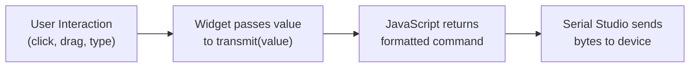

# Output Controls

## Overview

Output controls are interactive dashboard widgets that send data back to a connected device. While standard widgets visualize incoming telemetry, output controls let you transmit commands, setpoints, and parameters — enabling full bidirectional communication from the Serial Studio dashboard.

Each output control uses a user-defined JavaScript `transmit(value)` function that converts widget interactions (button clicks, slider drags, text input) into the exact bytes your device expects. This makes output controls protocol-agnostic: the same slider widget can drive a plain-text serial command, a JSON payload, or a binary packet — just by changing the transmit function.

Output controls require a **Pro license**.

## How Output Controls Work



1. The user interacts with a control on the dashboard (clicks a button, moves a slider, types text, etc.).
2. The widget calls its JavaScript `transmit(value)` function with the interaction value.
3. The function returns a string or byte sequence.
4. Serial Studio transmits the result to the connected device.

Transmission is rate-limited to a minimum of 50 ms between sends, preventing device buffer overflows during continuous interactions like slider drags.

## Output Control Types

### Button

Sends a single command on click.

| Property | Value |
|----------|-------|
| Value passed to `transmit()` | `1` (integer) |
| Interaction | Single click |
| Use cases | Reset, start/stop, trigger measurement |

### Slider

Sends a numeric value from a draggable slider.

| Property | Default | Description |
|----------|---------|-------------|
| Min Value | 0 | Lower bound of the slider range |
| Max Value | 100 | Upper bound of the slider range |
| Step Size | 1 | Increment between discrete positions |
| Initial Value | 0 | Starting position |
| Units | — | Label suffix (e.g., "%", "rpm") |

The value passed to `transmit()` is a number clamped to [Min, Max]. Transmissions occur continuously while dragging, rate-limited to 50 ms intervals.

### Toggle

Binary on/off switch.

| Property | Default | Description |
|----------|---------|-------------|
| ON Label | — | Text shown in the ON state |
| OFF Label | — | Text shown in the OFF state |
| Initial Value | 0 | Starting state (0 = off, 1 = on) |

Passes `1` to `transmit()` when switched on, `0` when switched off.

### Text Field

Accepts arbitrary typed input and sends it as a string.

| Property | Value |
|----------|-------|
| Value passed to `transmit()` | The typed string |
| Interaction | Press Enter or click Send |
| Use cases | AT commands, debug console, custom queries |

### Knob

Rotary dial for continuous setpoint adjustment. Same numeric properties as Slider (Min, Max, Step, Initial Value, Units) but displayed as a circular dial.

### Ramp Generator

Automated value sweep for testing and stress scenarios.

| Property | Default | Description |
|----------|---------|-------------|
| Start Value | 0 | Ramp starting point |
| Target Value | 100 | Ramp ending point |
| Speed | 1 | Units per second |
| Cycles | 0 | Number of forward-backward sweeps (0 = infinite) |

When started, the ramp generator automatically increments the value from start to target at the configured speed, then reverses back. Each step calls `transmit()` with the current value. Use the dashboard controls to start, stop, and configure the ramp.

## Creating Output Controls

1. Open the Project Editor (toolbar wrench icon, or Ctrl+Shift+P / Cmd+Shift+P).
2. Click one of the **Add Output** buttons in the toolbar (Button, Slider, Toggle, Text Field, Knob, or Ramp).
3. An **Output Panel** group is created automatically if one does not exist.
4. Select the new control in the tree view to configure its properties and transmit function.

Output controls live inside **Output Panel** groups. You can also add an Output Panel group first (via the toolbar), then add controls to it. Each Output Panel can hold multiple controls of mixed types, arranged in a configurable column grid.

## The Transmit Function

Every output control has a JavaScript `transmit(value)` function that defines how interactions become device commands. The function is compiled once when the dashboard opens and executed on each interaction.

### Writing a Transmit Function

The function receives a single `value` parameter and must return a string:

```javascript
function transmit(value) {
  // value is:
  //   1           for Button clicks
  //   0 or 1      for Toggle state changes
  //   number       for Slider, Knob, Ramp Generator
  //   "string"    for TextField input

  return "CMD " + value + "\r\n";
}
```

### Built-in Templates

The code editor includes 8 ready-to-use templates. Select one from the template dropdown and customize it for your device.

#### Simple Command

Sends plain text with a line terminator. Adapts to the widget type automatically.

```javascript
function transmit(value) {
  if (typeof value === "string")
    return value + "\r\n";

  if (value === 1)
    return "ON\r\n";

  if (value === 0)
    return "OFF\r\n";

  return "SET " + value + "\r\n";
}
```

#### JSON Command

Sends structured JSON objects. Useful for firmware that parses JSON input.

```javascript
function transmit(value) {
  var obj = {
    cmd: "set",
    value: value
  };
  return JSON.stringify(obj) + "\n";
}
```

#### Binary Packet

Sends framed binary data with STX/ETX delimiters.

```javascript
function transmit(value) {
  var STX = String.fromCharCode(0x02);
  var ETX = String.fromCharCode(0x03);
  var cmd = String.fromCharCode(0x01);
  var val = String.fromCharCode(Math.round(value) & 0xFF);
  return STX + cmd + val + ETX;
}
```

#### PWM Control

Sends a duty cycle value (0-255) for motor speed, LED brightness, or heater control.

```javascript
function transmit(value) {
  var duty = Math.round(Math.max(0, Math.min(255, value)));
  return "PWM " + duty + "\r\n";
}
```

#### PID Setpoint

Sends a floating-point setpoint with 2 decimal places for PID controllers.

```javascript
function transmit(value) {
  return "SP " + Number(value).toFixed(2) + "\r\n";
}
```

#### Relay Toggle

Sends distinct ON/OFF commands for relay or digital output control.

```javascript
function transmit(value) {
  return value ? "RELAY ON\r\n" : "RELAY OFF\r\n";
}
```

#### AT Command

Sends AT-style commands for modems, Bluetooth modules, and WiFi modules.

```javascript
function transmit(value) {
  if (typeof value === "string" && value.length > 0)
    return "AT+" + value + "\r\n";

  return "AT\r\n";
}
```

#### Modbus Write (Simulated)

Formats a Modbus-style write command. For real Modbus RTU, use the built-in Modbus driver.

```javascript
var REGISTER = 40001;

function transmit(value) {
  return "W " + REGISTER + " " + Math.round(value) + "\r\n";
}
```

### Importing from File

Click the import button in the code editor toolbar to load a `.js` file from disk. This is useful for sharing transmit functions across projects or version-controlling them separately.

## Output Panel Layout

Output controls are displayed in an Output Panel widget on the dashboard. The panel uses an adaptive layout engine:

- Controls are arranged in a configurable number of columns (set in the Output Panel group properties).
- Small controls (Button, Slider, Toggle, TextField) stack vertically within columns.
- Tall controls (Knob, Ramp Generator) span the full column height.
- If controls overflow the visible area, the panel scrolls vertically.

## Multi-Source Projects

In projects with multiple data sources (devices), each output control has a **Target Device** property. This determines which connected device receives the transmitted data. The tree view shows the target device tag next to each control.

## Output Controls vs. Actions

Both output controls and [Actions](Actions.md) send data to connected devices, but they serve different purposes:

| Feature | Output Controls | Actions |
|---------|----------------|---------|
| Widget types | 6 (button, slider, toggle, text, knob, ramp) | Button only |
| Data formatting | JavaScript `transmit()` function | Fixed TX Data + EOL |
| Continuous values | Yes (slider, knob, ramp) | No |
| Timer/auto-repeat | Ramp generator only | Yes (4 timer modes) |
| Auto-execute on connect | No | Yes |
| License | Pro | Free |

**Use Actions** for simple fire-and-forget commands, periodic polling, and auto-execute-on-connect sequences. **Use Output Controls** when you need interactive controls with continuous values, custom data formatting, or a mix of widget types.

## Examples

### Motor Speed Controller

Control motor speed with a slider and an emergency stop button.

| Control | Type | Properties |
|---------|------|------------|
| Speed | Slider | Min: 0, Max: 100, Units: "%" |
| Emergency Stop | Button | — |

Speed transmit function:
```javascript
function transmit(value) {
  return "SPD " + Math.round(value) + "\r\n";
}
```

Emergency Stop transmit function:
```javascript
function transmit(value) {
  return "ESTOP\r\n";
}
```

### Relay Control Panel

Toggle 3 relays independently.

| Control | Type | Properties |
|---------|------|------------|
| Relay 1 | Toggle | ON: "Closed", OFF: "Open" |
| Relay 2 | Toggle | ON: "Closed", OFF: "Open" |
| Relay 3 | Toggle | ON: "Closed", OFF: "Open" |

Each relay uses a customized transmit function with its relay number:
```javascript
// Relay 1
function transmit(value) {
  return value ? "R1 ON\r\n" : "R1 OFF\r\n";
}
```

### Sensor Calibration Interface

Combine a text field for commands with a knob for fine adjustment.

| Control | Type | Properties |
|---------|------|------------|
| Command | TextField | — |
| Offset | Knob | Min: -10, Max: 10, Step: 0.1, Units: "mV" |

Command transmit function:
```javascript
function transmit(value) {
  return "CAL " + value + "\r\n";
}
```

Offset transmit function:
```javascript
function transmit(value) {
  return "OFFSET " + Number(value).toFixed(1) + "\r\n";
}
```

## Common Mistakes

### Controls Do Not Appear on Dashboard

**Symptom:** Output controls are configured in the Project Editor but do not appear on the dashboard.

**Fix:** Ensure the device is connected. Output panels only appear on the dashboard while a connection is active. Also verify that the controls are inside an Output Panel group (group type must be "Output").

### Commands Not Received by Device

**Symptom:** The control is visible and interactive, but the device does not respond.

**Fix:**
1. Check the **Console** view to confirm data is being sent.
2. Verify the transmit function returns a properly terminated string (most devices expect `\r\n`).
3. Confirm the correct **Target Device** is selected in multi-source projects.
4. Check that your Pro license is active — transmission is disabled without it.

### Slider Sends Too Many Commands

**Symptom:** The device is overwhelmed or the serial buffer overflows while dragging a slider.

**Fix:** The built-in 50 ms rate limit prevents most flooding, but if your device needs more time between commands, increase the step size to reduce the number of discrete values, or add debouncing logic in your transmit function.

### Transmit Function Error

**Symptom:** A red error indicator appears on the control.

**Fix:** Open the Project Editor and check the transmit function for syntax errors. The function must be a valid JavaScript function named `transmit` that accepts one parameter and returns a string.

## Tips

- Start with a built-in template and modify it — this avoids common syntax mistakes.
- Test with the Console view open to see exactly what bytes are being transmitted.
- Use the Ramp Generator to stress-test your device's command handling at sustained rates.
- Combine output controls with input widgets in the same dashboard for full closed-loop monitoring (e.g., a slider to set a target temperature alongside a gauge showing the actual temperature).
- For complex protocols, write helper functions inside the transmit function scope — variables declared outside `transmit()` persist across calls (like the `REGISTER` variable in the Modbus template).

## See Also

- [Actions](Actions.md) — simple command buttons with timer support.
- [Project Editor](Project-Editor.md) — complete guide to creating and configuring projects.
- [Widget Reference](Widget-Reference.md) — all input/visualization widget types.
- [JavaScript API](JavaScript-API.md) — JavaScript capabilities available in Serial Studio.
- [Data Sources](Data-Sources.md) — configuring device connections.
